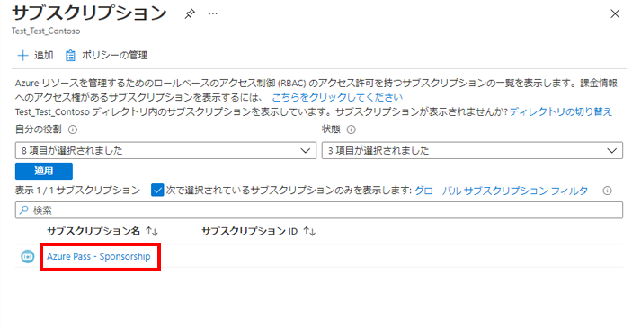
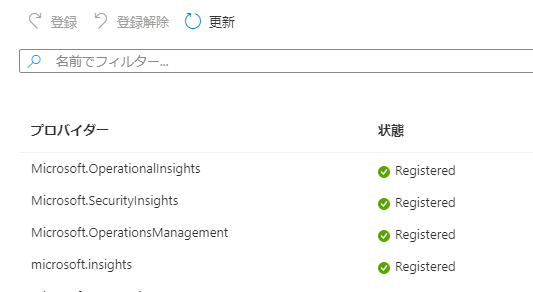

---
lab:
  title: ラボ 03:開発環境の設定
  module: 'Module 2: Devices and Device Communication'
ms.openlocfilehash: ff8debfc695c847537f93449f9849775b2945b9c
ms.sourcegitcommit: 7281efeb9cb5654361c2f1aa93aea724a3898966
ms.translationtype: HT
ms.contentlocale: ja-JP
ms.lasthandoff: 05/31/2022
ms.locfileid: "145955880"
---
# <a name="set-up-the-development-environment"></a>開発環境を設定する

## <a name="lab-scenario"></a>課題シナリオ

Contoso の開発者であるあなたは、Azure IoT ソリューションの構築を開始する前に、開発環境をセットアップすることが重要なステップであることを理解しています。 Microsoft や他の企業には、IoT ソリューションの開発とサポートに使用できるツールが多数用意されており、チームがどのツールを使用するかについて決定する必要があることを理解しています。

チームが IoT ソリューションで作業するために使用できる開発環境を準備することにしました。 環境は、Azure およびローカル PC での作業をサポートする必要があります。 議論した後に、チームは開発環境について次の大まかな決定を下しました。

* [オペレーティング システム]: Windows 10 は OS として使用されます。 Windows はほとんどのチームで使用されているので、論理的な選択でした。 Azure サービスが他のオペレーティングシステム (Mac OS や Linux など) をサポートしていること、および Microsoft がこれらの選択肢のいずれかを選択したチームのメンバーにサポート ドキュメントを提供していることをチームにメモします。
* 一般的なコーディング ツール:Visual Studio Code と Azure CLI は、主要なコーディング ツールとして使用されます。 これらのツールでは両方とも、Azure IoT SDK を活用する IoT の拡張機能がサポートされます。
* IoT Edge ツール:Docker Desktop コミュニティと Python は、カスタムの IoT Edge モジュールの開発をサポートするために使用されます (Visual Studio Code と共に)。

これらの決定を支持して、次の環境を設定します。

* Windows 10 64 ビット: Pro、Enterprise、または Education (ビルド 15063 以降)。 以下が含まれます。
  * 4 GB – 8 GB システム RAM (Docker の場合は高い方が良い)
  * Windows の Hyper-V およびコンテナの機能を有効にする必要があります。
  * BIOS レベルのハードウェア仮想化のサポートが BIOS の設定で有効になっている必要があります。

  > **注**:仮想マシンに開発環境を設定する場合、VM 環境は入れ子になった仮想化 ([入れ子になった仮想化](https://docs.microsoft.com/en-us/virtualization/hyper-v-on-windows/user-guide/nested-virtualization)) をサポートする必要があります。

* Azure CLI (現在/最新)
* .NET Core 3.1.200 (or later) SDK
* VS Code (最新)
* Python 3.9
* Linux コンテナーに設定された Docker Desktop Community 2.1.0.5 以降
* VS Code と Azure CLI の IoT 拡張機能
* node.js (最新)

> **重要**:仮想マシンは、このコースに向けて作成されました。ここでは、上記で指定されているツールの大部分を提供しています。 以下の手順では、準備済み VM の使用、または Windows PC をローカルで使用する環境の設定をサポートしています。

## <a name="in-this-lab"></a>このラボでは

このラボでは、開発環境を構成します。 ラボには、次の演習が含まれます。

* LOD 仮想マシン環境を使っている受講者の場合:

    * 仮想マシン環境に開発ツールの拡張機能をインストールする

* ローカル PC を開発環境として構成する必要がある受講者の場合:

    * ローカル PC に開発者ツールと製品をインストールする
    * ローカル PC に開発ツールの拡張機能をインストールする
    * ローカル PC 上でコースの課題ファイルと代替ツールを設定する
    * ローカル PC にリソース プロバイダーを登録する

## <a name="lab-instructions"></a>ラボの手順

> **重要**:このコースのラボを完了するためにホステッド仮想マシン環境を使っている受講者の場合、完了する必要があるのは演習 1 のみです。 このラボの他のすべての演習は、ローカル PC 上に開発環境を設定する受講者を対象としています。 ローカル PC 上に開発環境を設定する場合は、演習 2 に進んでから、残りの演習をすべて完了してください。

### <a name="exercise-1-install-tool-extensions-in-the-virtual-machine-environment"></a>演習 1:仮想マシン環境にツールの拡張機能をインストールする

Visual Studio Code と Azure CLI ツール (仮想マシンに既にインストールされています) はどちらも、開発者がソリューションをより効率的に作成するのに役立つ Azure IoT 拡張機能をサポートします。 これらの拡張機能は Azure IoT SDK を活用し、セキュリティ対策を確保しながら開発時間を短縮することがよくあります。 Visual Studio Code の C# 拡張機能も追加します。

#### <a name="task-1-install-visual-studio-code-extensions-on-the-virtual-machine"></a>タスク 1:仮想マシンに Visual Studio Code の拡張機能をインストールする

1. Visual Studio Code を開きます。

1. [Visual Studio Code] ウィンドウの左側で、 **[拡張機能]** をクリックします。

    ボタンの上にマウス ポインターを置くと、ボタンのタイトルを表示できます。 [拡張機能] ボタンは、上から 6 番目です。

1. Visual Studio Code の拡張機能マネージャーで、次の拡張機能を検索して、インストールします。

    * Microsoft の [Azure IoT Tools](https://marketplace.visualstudio.com/items?itemName=vsciot-vscode.azure-iot-tools) (`vsciot-vscode.azure-iot-tools`)
    * Microsoft の [C# for Visual Studio Code](https://marketplace.visualstudio.com/items?itemName=ms-vscode.csharp) (`ms-vscode.csharp`)
    * Microsoft による [Azure Tools for Visual Studio Code](https://marketplace.visualstudio.com/items?itemName=ms-vscode.vscode-node-azure-pack) (ms-vscode.vscode-node-azure-pack)
    * Microsoft による [Visual Studio Code 用の DTDL エディター](https://marketplace.visualstudio.com/items?itemName=vsciot-vscode.vscode-dtdl) (vsciot-vscode.vscode-dtdl)

1. Visual Studio Code を閉じます。

#### <a name="task-2-install-azure-cli-extension---virtual-machine-environment"></a>タスク 2:Azure CLI 拡張機能をインストールする - 仮想マシン環境

1. 新しいコマンドラインまたはターミナル ウィンドウを開き、Azure IoT CLI 拡張機能をインストールします。

    たとえば、Windows **コマンド** プロンプト コマンドライン アプリケーションを使用できます。

1. コマンド プロンプトで、IoT 用の Azure CLI 拡張機能をインストールするには、次のコマンドを入力します。

    ```bash
    az extension add --name azure-iot
    ```

1. コマンド プロンプトで、Time Series Insights 用の Azure CLI 拡張機能をインストールするには、次のコマンドを入力します。

    ```bash
    az extension add --name timeseriesinsights
    ```

#### <a name="task-3-install-azure-cli-extension---cloud-environment"></a>タスク 3:Azure CLI 拡張機能のインストール - クラウド環境

多くのラボでは、Azure Cloud Shell を介して Azure CLI IoT 拡張機能を使用する必要があります。 次の手順により、拡張機能がインストールされ、最新バージョンが実行されていることを確認します。

1. 仮想マシン上で Web ブラウザー ウィンドウを開き、次のアドレスの Azure Cloud Shell に移動します。

    +++https://shell.azure.com/+++

1. プロンプトが表示されたら、このコースで使っている Azure サブスクリプションを使ってログインします。

1. Cloud Shell のストレージの設定に関するメッセージが表示された場合は、デフォルトをそのまま使用します。

1. Cloud Shell が **Bash** を使用していることを確認します。

    [Azure Cloud Shell] ページの左上隅にあるドロップダウンは、環境を選択するために使用されます。 選択されたドロップダウンの値が **Bash** であることを確認します。

1. コマンド プロンプトで、IoT 用の Azure CLI 拡張機能をインストールするには、次のコマンドを入力します。

    ```bash
    az extension add --name azure-iot
    ```

    **注**:拡張機能がすでにインストールされている場合は、次のコマンドを入力して、最新バージョンを実行していることを確認できます。

    ```bash
    az extension update --name azure-iot
    ```

1. コマンド プロンプトで、Time Series Insights 用の Azure CLI 拡張機能をインストールするには、次のコマンドを入力します。

    ```bash
    az extension add --name timeseriesinsights
    ```

#### <a name="task-4-verify-the-virtual-machine-environment"></a>タスク 4:仮想マシン環境を確認する

開発環境が正常に設定されたことを確認する必要があります。 これが完了すると、IoT ソリューションの構築を開始する準備が整います。

1. 新しいコマンドライン/ターミナル ウィンドウを開きます。

1. 現在インストールされているバージョンの Azure CLI のバージョン情報を出力する次のコマンドを実行して、**Azure CLI** のインストールを検証します。

    ```cmd/sh
    az --version
    ```

    `az --version` コマンドは、インストールした Azure CLI のバージョン情報 (`azure-cli` バージョン番号) を出力します。 このコマンドにより、IoT 拡張機能を含む、インストールされているすべての Azure CLI モジュールのバージョン番号も出力されます。 次のような出力が表示されます。

    ```cmd/sh
    azure-cli                           2.21.0

    core                                2.21.0
    telemetry                            1.0.6

    Extensions:
    azure-iot                          0.10.10
    timeseriesinsights                   0.2.1
    ```

1. 次のコマンドを実行して、現在インストールされているバージョンの .NET Core SDK のバージョン番号を出力して、**NET Core 3.x SDK** のインストールを検証します。

    ```cmd/sh
    dotnet --version
    ```

    `dotnet --version` コマンドは、現在インストールされている .NET Core SDK のバージョンを出力します。

1. .NET Core3.1 以降がインストールされていることを確認します。

> **注**:このコースのラボを完了するために LOD 仮想マシン環境を使っている場合、開発環境は構成済みなので、次のラボに進むことができます。

### <a name="exercise-2-install-developer-tools-and-products-on-the-local-pc"></a>演習 2:ローカル PC に開発者ツールと製品をインストールする

> **重要**:演習 2 とこのラボの残りのすべての演習は、このコースのために作成された LOD 仮想マシンを使って **いない** 受講者を対象にしています。 ローカル PC を開発環境として構成する必要がある受講者は、演習 2 から 5 を使って、ローカル PC にツールをインストールし、開発環境を構成することができます。

#### <a name="task-1-install-net-core-on-your-local-pc"></a>タスク 1:ローカル PC に .NET Core をインストールする

.NET Core は、Web サイト、サービス、およびコンソール アプリを構築するためのクロスプラットフォーム バージョンの .NET です。

1. .NET Core のダウンロード ページを開くには、新しいブラウザーのタブを開き、次のページに移動します。

    ```
    https://dotnet.microsoft.com/download
    ```

1. .NET ダウンロード ページの .NET Core で、 **.NET Core SDK のダウンロード** をクリックします。

    .NET Core SDK は、.NET Core アプリのビルドに使用されます。 このコースのラボでは、これを使用してコード ファイルをビルド/編集します。

1. ポップアップ メニューの **[実行]** をクリックし、画面の指示に従ってインストールを完了します。

    インストールは、1 分未満で完了します。 次のコンポーネントがインストールされます。

    * .NET Core SDK 3.1.100 以降
    * .NET Core Runtime 3.1.100 以降
    * ASP.NET Core Runtime 3.1.100 以降
    * .NET Core Windows Desktop Runtime 3.1.0 以降

    詳細については、以下のリソースを参照することができます。

    * [.NET Core のドキュメント](https://aka.ms/dotnet-docs)
    * [.NET Core の依存関係と要件](https://docs.microsoft.com/en-us/dotnet/core/install/dependencies?tabs=netcore31&pivots=os-windows)
    * [SDK のドキュメント](https://aka.ms/dotnet-sdk-docs)
    * [リリース ノート](https://aka.ms/netcore3releasenotes)
    * [チュートリアル](https://aka.ms/dotnet-tutorials)

#### <a name="task-2-install-visual-studio-code-on-your-local-pc"></a>タスク 2:ローカル PC に Visual Studio Code をインストールする

Visual Studio Code は、軽量でありながら強力なソース コード エディターです。これはデスクトップで使用でき、Windows、macOS、Linux に対応しています。 JavaScript、TypeScript、Node.js 向けの組み込みのサポートが付属しており、他の言語(C++、C#、Java、Python、PHP、Go など) や実行時間 (.NET、Unity など) の拡張機能の豊富なエコシステムを備えています。

1. Visual Studio Code のダウンロード ページを開くには、新しいブラウザーのタブを開き、次のページに移動します。

    ```
    https://code.visualstudio.com/Download
    ```

    Mac OS X および Linux に Visual Studio Code をインストールする手順については、[こちら](https://code.visualstudio.com/docs/setup/setup-overview) の Visual Studio Code セットアップ ガイドを参照してください。 このページには、Windows のインストールに関する詳細な手順とヒントも記載されています。

1. [Visual Studio Code のダウンロード] ページで、**Windows** をクリックします。

    ダウンロードを開始すると、2 つのことが起こります。ポップアップ ダイアログが開き、開始ガイダンスが一部表示されます。

1. ポップアップ ダイアログでセットアップ プロセスを開始するには、 **[実行]** をクリックし、画面の指示に従います。

    インストーラをダウンロード フォルダに保存する場合は、フォルダを開いて、VSCodeSetup 実行可能ファイルをダブルクリックして、インストールを完了できます。

    既定では、Visual Studio Code は "C:\Program Files (x86)\Microsoft VS Code" フォルダーの場所 (64 ビット コンピューターの場合) にインストールされます。 このセットアップ プロセスは、約 1 分間かかるのみです。

    > **注**: .NET Framework 4.5 は、Windows にインストールするときに、Visual Studio Code が必要です。 Windows 7 を使用している場合は、[.NET Framework 4.5](https://www.microsoft.com/en-us/download/details.aspx?id=30653) がインストールされていることを確認してください。

    Visual Studio Code をインストールする詳細な手順については、Microsoft Visual Studio Code インストール手順ガイド ([https://code.visualstudio.com/Docs/editor/setup](https://code.visualstudio.com/Docs/editor/setup)) を参照してください

#### <a name="task-3-install-azure-cli-on-your-local-pc"></a>タスク 3:ローカル PC に Azure CLI をインストールする

Azure CLI は、Azure 関連のスクリプト作成タスクを簡単に実行できるように設計されたコマンドライン ツールです。 また、柔軟にデータをクエリすることができ、非ブロッキング プロセスとして長時間実行される操作をサポートします。

1. Azure CLI ツールのダウンロード ページを開くには、新しいブラウザーのタブを開き、次のページに移動します。

    ```
    https://docs.microsoft.com/en-us/cli/azure/install-azure-cli?view=azure-cli-latest  
    ```

    Azure CLI ツールの最新バージョンをインストールする必要があります。 Azure CLI の現在 (2022 年 2 月時点) のバージョンは 2.33 ですが、新しいバージョンが毎月リリースされるので、最新バージョンは変わっている可能性があることに注意してください。

1. **[Azure CLI のインストール]** ページで、OS のインストール オプション ( **[Install on Windows]\(Windows にインストール\)** など) を選び、画面の指示に従って Azure CLI ツールをインストールします。

    このコースのラボでは、Azure CLI ツールを使用するための詳細な手順が示されますが、詳細が必要な場合は、「[Azure CLI の概要](https://docs.microsoft.com/en-us/cli/azure/get-started-with-azure-cli?view=azure-cli-latest)」を参照してください。

#### <a name="task-4-install-python-39-on-your-local-pc"></a>タスク 4:ローカル PC に Python 3.9 をインストールする

IoT Edge と Docker をサポートするために Python 3.9 を使用します。

1. Python.org のダウンロード ページを開くには、新しいブラウザーのタブを開き、次のページに移動します。

    ```
    https://www.python.org/downloads/
    ```

1. [Python のダウンロード] ページで、お使いのオペレーティング システムに適したインストーラー ファイルを選択します。

1. プロンプトが表示されたら、インストーラを実行するオプションを選択します。

1. [Python のインストール] ダイアログで、 **[Python 3.9 を PATH に追加]** をクリックします。

1. **[今すぐインストール]** をクリックします。

1. [セットアップが成功しました] ページが表示されたら、 **[パスの長さの制限を無効にする]** をクリックします。

1. インストール プロセスを完了するには、 **[閉じる]** をクリックします。

#### <a name="task-5-install-docker-desktop-on-your-local-pc"></a>タスク 5:ローカル PC に Docker Desktop をインストールする

カスタム IoT Edge モジュールの作成と展開をカバーするラボでは、Docker デスクトップ コミュニティ (最新の安定バージョン) を使用します。

1. Docker Desktop for Windows のダウンロード ページを開くには、新しいブラウザーのタブを開き、次のページに移動します。

    ```
    https://docs.docker.com/docker-for-windows/install/ 
    ```

    左側のナビゲーション メニューから、追加のオペレーティング システムのインストールにアクセスできます。

1. Windows PC がシステム要件を満たしていることを確認します。

    Windows の設定を使用して、[Windows の機能]ダイアログ ボックスを開き、それを使用して Hyper-V とコンテナが有効になっていることを確認できます。

1. **[Docker Desktop for Windows]** をクリックし、画面の指示に従って、ダウンロードしたインストール ファイルを開いて実行します。

    Docker Desktop のインストール ダイアログを表示するには、少し時間がかかることがあります。

1. インストールに成功しましたというメッセージが表示されたら、 **[閉じる]** をクリックします。

    インストール後、Docker Desktop は自動的に起動しません。 Docker Desktop を起動するには、"Docker" を検索し、検索結果で [Docker Desktop] を選択します。 ステータス バーのホエール アイコンが安定している場合、Docker Desktop は稼働中で、ターミナル ウィンドウからアクセスできます。

#### <a name="task-6---install-nodejs-on-your-local-pc"></a>タスク 6 - ローカル PC に node.js をインストールする

一部のサンプル Web アプリケーションは、node.js を使用してローカルで実行されます。 次の手順により、node.js がインストールされ、最新バージョンが実行されていることを確認します。

1. Node.js のダウンロード ページを開くには、新しいブラウザーのタブを開き、次のページに移動します。

    ```
    https://nodejs.org/en/#home-downloadhead
    ```

1. 最新の LTS (ロングターム サポート) バージョンをダウンロードします - 執筆時点で 14.16.0。

1. プロンプトが表示されたら、インストーラを実行するオプションを選択します。

1. インストーラーをステップ スルーします。

   * **エンドユーザー使用許諾契約** - 条件に同意し、 **[次へ]** をクリックします。
   * **宛先フォルダー** - 既定値を受け入れ (または必要に応じて変更し)、 **[次へ]** をクリックします。
   * **カスタム セットアップ** - 既定値を受け入れ、 **[次へ]** をクリックします。
   * **ネイティブ モジュールのツール** - **[自動インストール]** をオンにして、 **[次へ]** をクリックします。
   * **Node.js をインストールする準備ができました** - **[インストール]** をクリックします
     * UAC ダイアログで **[はい]** をクリックします。

1. が完了するまで待ち、 **[完了]** をクリックします。

1. **[Node.js 用の追加ツールのインストール]** コマンド ウィンドウで、プロンプトが表示されたら、**Enter** キーを押して続行します。

1. UAC ダイアログで **[はい]** をクリックします。

    複数のパッケージがダウンロードされ、インストールされます。 これには少し時間がかかります。

1. インストールが完了したら、**新しい** コマンド シェルを開き、次のコマンドを入力します。

    ```powershell
    node --version
    ```

    ノードが正常にインストールされると、インストールされたバージョンが表示されます。

### <a name="exercise-3-install-tool-extensions-for-the-local-pc-environment"></a>演習 3:ローカル PC 環境用のツールの拡張機能をインストールする

Visual Studio Code と Azure CLI ツールはどちらも、開発者がソリューションをより効率的に作成するのに役立つ Azure IoT 拡張機能をサポートします。 これらの拡張機能は Azure IoT SDK を活用し、セキュリティ対策を確保しながら開発時間を短縮することがよくあります。 Visual Studio Code の C# 拡張機能も追加します。

#### <a name="task-1-install-visual-studio-code-extensions-on-the-local-pc"></a>タスク 1:ローカル PC に Visual Studio Code の拡張機能をインストールする

1. Visual Studio Code を開きます。

1. [Visual Studio Code] ウィンドウの左側で、 **[拡張機能]** をクリックします。

    ボタンの上にマウス ポインターを置くと、ボタンのタイトルを表示できます。 [拡張機能] ボタンは、上から 6 番目です。

1. Visual Studio Code の拡張機能マネージャーで、次の拡張機能を検索して、インストールします。

    * Microsoft の [Azure IoT Tools](https://marketplace.visualstudio.com/items?itemName=vsciot-vscode.azure-iot-tools) (`vsciot-vscode.azure-iot-tools`)
    * Microsoft の [C# for Visual Studio Code](https://marketplace.visualstudio.com/items?itemName=ms-vscode.csharp) (`ms-vscode.csharp`)
    * Microsoft による [Azure Tools for Visual Studio Code](https://marketplace.visualstudio.com/items?itemName=ms-vscode.vscode-node-azure-pack) (ms-vscode.vscode-node-azure-pack)
    * Microsoft による [Visual Studio Code 用の DTDL エディター](https://marketplace.visualstudio.com/items?itemName=vsciot-vscode.vscode-dtdl) (vsciot-vscode.vscode-dtdl)

1. Visual Studio Code を閉じます。

#### <a name="task-2-install-azure-cli-extension---local-pc-environment"></a>タスク 2:Azure CLI 拡張機能をインストールする - ローカル PC 環境

1. 新しいコマンドラインまたはターミナル ウィンドウを開き、Azure IoT CLI 拡張機能をインストールします。

    たとえば、Windows **コマンド** プロンプト コマンドライン アプリケーションを使用できます。

1. コマンド プロンプトで、IoT 用の Azure CLI 拡張機能をインストールするには、次のコマンドを入力します。

    ```bash
    az extension add --name azure-iot
    ```

1. コマンド プロンプトで、Time Series Insights 用の Azure CLI 拡張機能をインストールするには、次のコマンドを入力します。

    ```bash
    az extension add --name timeseriesinsights
    ```

#### <a name="task-3-install-azure-cli-extension---cloud-environment"></a>タスク 3:Azure CLI 拡張機能のインストール - クラウド環境

多くのラボでは、Azure Cloud Shell を介して Azure CLI IoT 拡張機能を使用する必要があります。 次の手順により、拡張機能がインストールされ、最新バージョンが実行されていることを確認します。

1. Web ブラウザーで、次のアドレスの Azure Cloud Shell に移動します。

    **ローカル PC**:[Azure Cloud Shell](https://shell.azure.com/)

1. プロンプトが表示されたら、このコースで使っている Azure サブスクリプションを使ってログインします。

1. Cloud Shell のストレージの設定に関するメッセージが表示された場合は、デフォルトをそのまま使用します。

1. Cloud Shell が **Bash** を使用していることを確認します。

    [Azure Cloud Shell] ページの左上隅にあるドロップダウンは、環境を選択するために使用されます。 選択されたドロップダウンの値が **Bash** であることを確認します。

1. コマンド プロンプトで、IoT 用の Azure CLI 拡張機能をインストールするには、次のコマンドを入力します。

    ```bash
    az extension add --name azure-iot
    ```

    **注**:拡張機能がすでにインストールされている場合は、次のコマンドを入力して、最新バージョンを実行していることを確認できます。

    ```bash
    az extension update --name azure-iot
    ```

1. コマンド プロンプトで、Time Series Insights 用の Azure CLI 拡張機能をインストールするには、次のコマンドを入力します。

    ```bash
    az extension add --name timeseriesinsights
    ```

#### <a name="task-4-verify-development-environment-setup"></a>タスク 4:開発環境の設定を確認する

開発環境が正常に設定されたことを確認する必要があります。

1. 新しいコマンドライン/ターミナル ウィンドウを開きます。

1. 現在インストールされているバージョンの Azure CLI のバージョン情報を出力する次のコマンドを実行して、**Azure CLI** のインストールを検証します。

    ```cmd/sh
    az --version
    ```

    `az --version` コマンドは、インストールした Azure CLI のバージョン情報 (`azure-cli` バージョン番号) を出力します。 このコマンドにより、IoT 拡張機能を含む、インストールされているすべての Azure CLI モジュールのバージョン番号も出力されます。 次のような出力が表示されます。

    ```cmd/sh
    azure-cli                           2.21.0

    core                                2.21.0
    telemetry                            1.0.6

    Extensions:
    azure-iot                          0.10.10
    timeseriesinsights                   0.2.1
    ```

1. 次のコマンドを実行して、現在インストールされているバージョンの .NET Core SDK のバージョン番号を出力して、**NET Core 3.x SDK** のインストールを検証します。

    ```cmd/sh
    dotnet --version
    ```

    `dotnet --version` コマンドは、現在インストールされている .NET Core SDK のバージョンを出力します。

1. .NET Core3.1 以降がインストールされていることを確認します。

### <a name="exercise-4-set-up-course-lab-files-and-alternative-tools-on-the-local-pc"></a>演習 4:ローカル PC 上でコースの課題ファイルと代替ツールを設定する

このコースの多くのラボでは、課題活動の開始点として使用できるコード プロジェクトなど、あらかじめ構築されたリソースを使用しています。 これらのラボリソースは、ローカル PC の開発環境にダウンロードする必要がある GitHub プロジェクトで提供されます。

コースラボを直接サポートするリソース (GitHub プロジェクトに含まれるリソース) に加えて、このコース以外の学習機会をサポートするため、インストールすることを選択できるオプションのツールがいくつかあります。 一例として Power Shell があります。これは、Microsoft のチュートリアルやその他のリソースで参照されている場合があります。

以下の手順は、これらのリソースの種類の両方の構成を示しています。

#### <a name="task-1-download-course-lab-files-to-the-local-pc"></a>タスク 1:ローカル PC にコース ラボ ファイルをダウンロードする

Microsoft は、ラボ リソース ファイルへのアクセスを提供する GitHub リポジトリを作成しました。 これらのファイルを開発環境でローカルに保有することが、一部の場合では必要であり、その他の多くの場合では便利です。 このタスクでは、開発環境内でリポジトリの内容をダウンロードして抽出します。

1. Web ブラウザーで次の場所に移動します: [https://github.com/MicrosoftLearning/AZ-220-Microsoft-Azure-IoT-Developer](https://github.com/MicrosoftLearning/AZ-220-Microsoft-Azure-IoT-Developer)

1. **[コード]** ドロップダウンを開き、 **[ZIP のダウンロード]** をクリックします。

1. ZIP ファイルを開発環境に保存するには、 **[保存]** をクリックします。

1. ファイルを保存したら、 **[フォルダを開く]** をクリックします。

1. 保存した ZIP ファイルを右クリックし、 **[すべて抽出]** をクリックします

1. **[参照]** をクリックし、アクセスに便利なフォルダーの場所に移動します。

    > **重要**: 既定では、Windows の [最大ファイル パス長は 260](https://docs.microsoft.com/en-us/windows/win32/fileio/naming-a-file#maximum-path-length-limitation) です。 ZIP 内のファイル パスはすでに長いため、大きなファイル パスを使用してネストされたフォルダー内のアーカイブを抽出することは避けてください。 たとえば、zip を抽出するように求められるデフォルトのパスは、**c:\users\\[username]\downloads\AZ-220-Microsoft-Azure-IoT-Developer-master** のようになります。これは、できるだけ短くすることお勧めします (**c:\az220** など)

1. ファイルを抽出するには、 **[抽出]** をクリックします。

    ファイルの場所をメモしておきます。

#### <a name="task-2-install-azure-powershell-module-on-the-local-pc"></a>タスク 2:ローカル PC に Azure PowerShell モジュールをインストールする

> **注**:このコースのラボ アクティビティでは、PowerShell の使用は含まれていませんが、PowerShell を使用するリファレンス ドキュメントにサンプル コードが記載されている場合があります。 PowerShell コードを実行する場合は、次の手順を使用してインストール手順を完了できます。

Azure PowerShell は、PowerShell コマンド ラインから Azure リソースを直接管理するためのコマンドレットのセットです。 Azure PowerShell は、簡単に学習して使い始めることができるように設計されていますが、自動化のための強力な機能が用意されています。 .NET Standard で記述された Azure PowerShell は、Windows 上の PowerShell 5.1 およびすべてのプラットフォーム上の PowerShell 6.x 以降で動作します。

> **警告**: Windows 用の PowerShell 5.1 で AzureRM と Az の両方のモジュールを同時にインストールすることはできません。 AzureRM をシステムで引き続き使用できるようにしておく必要がある場合は、PowerShell Core 6.x 以降用の Az モジュールをインストールします。 そのためには、PowerShell Core 6.x 以降をインストールしてから、PowerShell Core ターミナルで以下の手順に従ってください。

1. Azure PowerShell モジュールを、現在のユーザーのみに対してインストールするか (推奨されるアプローチ)、すべてのユーザーに対してインストールするかを決定します。

1. 選択した PowerShell ターミナルを起動する - すべてのユーザーに対してインストールする場合、 **[管理者として実行]** を選択するか、macOS または Linux で **sudo** コマンドを使用することで、管理者特権で PowerShell セッションを起動する必要があります。

1. 現在のユーザーに対してのみインストールするには、次のコマンドを入力します。

    ```powershell
    Install-Module -Name Az -AllowClobber -Scope CurrentUser
    ```

    または、システム上のすべてのユーザーに対してインストールするには、次のコマンドを入力します。

    ```powershell
    Install-Module -Name Az -AllowClobber -Scope AllUsers
    ```

1. 既定では、PowerShell ギャラリーは、PowerShellGet の信頼できるリポジトリとしては構成されません。 PSGallery の初回使用時には、次のプロンプトが表示されます。

    ```output
    Untrusted repository

    You are installing the modules from an untrusted repository. If you trust this repository, change
    its InstallationPolicy value by running the Set-PSRepository cmdlet.

    Are you sure you want to install the modules from 'PSGallery'?
    [Y] Yes  [A] Yes to All  [N] No  [L] No to All  [S] Suspend  [?] Help (default is "N"):
    ```

1. インストールを続行するには、**Yes** または **Yes to All** と回答します。

    Az モジュールは、Azure PowerShell コマンドレットのロールアップ モジュールです。 これをインストールすると、利用可能な Azure Resource Manager モジュールがすべてダウンロードされ、コマンドレットを使用できるようになります。

> **注**:**AZ** モジュールが既にインストールされている場合は、次の方法で最新バージョンに更新できます。
>
> ```powershell
> Update-Module -Name Az
> ```

### <a name="exercise-5---register-resource-providers-on-the-local-pc"></a>演習 5 - ローカル PC にリソース プロバイダーを登録する

このコースでは、さまざまな種類のリソースが作成されますが、その一部は現在のサブスクリプションで使用するために登録されていない可能性があります。 一部のリソースは最初の使用時に自動的に登録されますが、他のリソースは使用する前に登録する必要があります。そうしないと、エラーが報告されます。

#### <a name="task-1---register-resource-providers-using-the-azure-cli"></a>タスク 1 - Azure CLI を使用してリソース プロバイダーを登録する

Azure CLI には、リソース プロバイダーの管理に役立ついくつかのコマンドが用意されています。 このタスクでは、このコースに必要なリソース プロバイダーが登録されていることを確認します。

1. ブラウザーを使用して [Azure Cloud Shell](https://shell.azure.com/) を開き、このコースで使用している Azure サブスクリプションでログインします。

1. リソース プロバイダーの現在の状態のリストを表示するには、次のコマンドを入力します。

    ```powershell
    az provider list -o table
    ```

    これにより、次のようなリソースの *長い* リストが表示されます。

    ```powershell
    Namespace                                RegistrationPolicy    RegistrationState
    ---------------------------------------  --------------------  -------------------
    Microsoft.OperationalInsights            RegistrationRequired  Registered
    microsoft.insights                       RegistrationRequired  NotRegistered
    Microsoft.DataLakeStore                  RegistrationRequired  Registered
    Microsoft.DataLakeAnalytics              RegistrationRequired  Registered
    Microsoft.Web                            RegistrationRequired  Registered
    Microsoft.ContainerRegistry              RegistrationRequired  Registered
    Microsoft.ResourceHealth                 RegistrationRequired  Registered
    Microsoft.BotService                     RegistrationRequired  Registered
    Microsoft.Search                         RegistrationRequired  Registered
    Microsoft.EventGrid                      RegistrationRequired  Registered
    Microsoft.SignalRService                 RegistrationRequired  Registered
    Microsoft.VSOnline                       RegistrationRequired  Registered
    Microsoft.Sql                            RegistrationRequired  Registered
    Microsoft.ContainerService               RegistrationRequired  Registered
    Microsoft.ManagedIdentity                RegistrationRequired  Registered
    ...
    ```

1. 文字列 **Event** を含む名前空間のリストが返されるようにするには、次のコマンドを実行します。

    ```powershell
    az provider list -o table --query "[?contains(namespace, 'Event')]"
    ```

    次のような結果が表示されます。

    ```powershell
    Namespace            RegistrationState    RegistrationPolicy
    -------------------  -------------------  --------------------
    Microsoft.EventGrid  NotRegistered        RegistrationRequired
    Microsoft.EventHub   Registered           RegistrationRequired
    ```

1. このコースに必要なリソースを登録するには、次のコマンドを実行します。

    ```powershell
    az provider register --namespace "Microsoft.EventGrid" --accept-terms
    az provider register --namespace "Microsoft.EventHub" --accept-terms
    az provider register --namespace "Microsoft.Insights" --accept-terms
    az provider register --namespace "Microsoft.TimeSeriesInsights" --accept-terms
    ```

    > **注**: **-accept-terms** がプレビュー中であるという警告が表示される場合があります。これは無視してかまいません。

    > **注**:**microsoft.insights** は小文字でリストされていますが、register/unregister コマンドでは大文字と小文字は区別されません。

1. リソースの更新されたステータスを表示するには、次のコマンドを実行します。

    ```powershell
    az provider list -o table --query "[?(contains(namespace, 'insight') || contains(namespace, 'Event') || contains(namespace, 'TimeSeriesInsights'))]"
    ```

    > **注**:register/unregister コマンドは大文字と小文字を区別しませんが、クエリ言語は大文字と小文字を区別しないため、**インサイト** は小文字にする必要があります。

    これで、リソースが登録されます。

#### <a name="task-2---register-resource-providers-using-the-azure-portal"></a>タスク 2 - AAzure portal を使用してリソース プロバイダーを登録する

ポータルを利用すると、登録の状態を確認したり、リソース プロバイダー名前空間を登録したりできます。 このタスクでは、UI に慣れます。

1. 必要に応じて、Azure アカウントの認証情報を使用して [>portal.azure.com](https://portal.azure.com) にログインします。

1. Portal で **[すべてのサービス]** を選択します。

    ![[すべてのサービス] を選択する](media/LAB_AK_03-select-all-services.png )

1. [サブスクリプション] を選択します。

    ![[サブスクリプション] を選択する](media/LAB_AK_03-select-subscriptions.png)

1. サブスクリプションの一覧から、リソース プロバイダーの登録に使用するサブスクリプションを選択します。

    

1. サブスクリプションについては、**[リソース プロバイダー]** を選択します。

    ![[リソース プロバイダー] を選択する](media/LAB_AK_03-select-resource-provider.png)

1. リソース プロバイダーのリストを見てください。適切なアクションをクリックすることで、リソースを登録または登録解除できます。

    

1. リストされたリソースをフィルター処理するには、検索テキスト ボックスに「**insights**」と入力します。

    検索条件が入力されると、リストがフィルター処理されることに注意してください。 検索でも大文字と小文字は区別されません。
