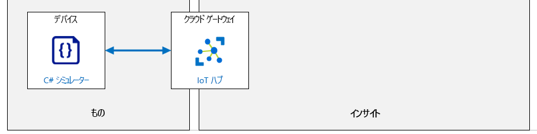

---
lab:
  title: ラボ 04:IoT デバイスを Azure に接続する
  module: 'Module 2: Devices and Device Communication'
ms.openlocfilehash: 024b4b28e920cb7193c1272bec4fde3d697d93ec
ms.sourcegitcommit: b1a2557baf4854683036fde125ada75c6f3dbbfd
ms.translationtype: HT
ms.contentlocale: ja-JP
ms.lasthandoff: 03/28/2022
ms.locfileid: "141200492"
---
# <a name="connect-an-iot-device-to-azure"></a>IoT デバイスを Azure に接続する

## <a name="lab-scenario"></a>課題シナリオ

Contoso は、高品質のチーズを生産することで知られています。 同社の人気と販売の両方が急成長しているため、彼らは顧客の期待に応える高品質なチーズを確実に維持するための方策を講じたいと考えています。

昔は、各勤務シフト中に工場の現場担当者が温度と湿度のデータを収集していました。 同社は、新しい施設が稼働し始めるにつれて、工場の拡張により監視の強化が必要になることと、データを収集する手動プロセスでは調整できなくなることを懸念しています。

Contoso は温度と湿度を監視するために、IoT デバイスを使用する自動化システムを立ち上げることにしました。 テレメトリ データの通信速度は調整可能で、チーズのバッチが環境に敏感なプロセスを進める際に製造プロセスが確実に制御されるようにします。

この資産監視ソリューションをフルスケールの実装前に評価するには、IoT デバイス (温度センサーと湿度センサーを含む) を IoT Hub に接続します。

> **注**:このラボでは、物理的な IoT デバイスとセンサーをシミュレートする .NET Core コンソール アプリケーションを作成します。 シミュレートされたデバイスは IoT デバイス SDK を実装し、物理デバイスと同じように IoT Hub に接続します。 シミュレートされたデバイスは、物理デバイスで使用されるのと同じ SDK リソースを使用してテレメトリ値も通信しますが、センサーの読み取り値は、温度および湿度センサーから読み取られた実際の値ではなく、生成された値になります。

次のリソースが作成されます。



## <a name="in-this-lab"></a>このラボでは

このラボでは、ラボの前提条件を確認することから始め、必要に応じてスクリプトを実行して、Azure サブスクリプションに必要なリソースが含まれていることを確認します。 次に、Azure portal を使用してデバイス ID を Azure IoT Hub に登録し、対応するシミュレートされたデバイスアプリを Visual Studio Code で開発します。 次に、シミュレートされたデバイスコードに接続文字列 (デバイスの登録時に IoT Hub によって作成された) を挿入し、アプリを実行して接続をテストし、テレメトリが意図したとおりに IoT Hub に到達していることを確認します。 ラボには、次の演習が含まれます。

* ラボの前提条件を構成する (必要な Azure リソース)
* Azure portal を使用して、Azure IoT Hub のデバイス ID を作成する
* シミュレートされたデバイス (C#) を作成してテストする

## <a name="lab-instructions"></a>ラボの手順

### <a name="exercise-1-configure-lab-prerequisites"></a>演習 1:ラボの前提条件を構成する

このラボでは、次の Azure リソースが使用可能であることを前提としています。

| リソースの種類  | リソース名                |
| :------------- | :--------------------------- |
| リソース グループ | rg-az220                     |
| IoT Hub        | iot-az220-training-{your-id} |

これらのリソースを確実に使用できるようにするには、次の手順に従います。

1. 仮想マシン環境で Microsoft Edge ブラウザー ウィンドウを開き、次の Web アドレスに移動します。

    ```text
    https://portal.azure.com/#create/Microsoft.Template/uri/https%3A%2F%2Fraw.githubusercontent.com%2FMicrosoftLearning%2FAZ-220-Microsoft-Azure-IoT-Developer%2Fmaster%2FAllfiles%2FARM%2Flab04.json
    ```

    > **注**:緑色の "T" 記号 (例: +++このテキストを入力+++) が表示されているときはいつでも、関連付けられているテキストをクリックすると、仮想マシン環境内の現在のフィールドに情報が入力されます。

1. Azure portal にログインするように求められた場合は、このコースで使用している Azure 資格情報を入力します。

    **[カスタム デプロイ]** ページが表示されます。

1. **[プロジェクトの詳細]** の **[サブスクリプション]** ドロップダウンで、このコースで使用する [Azure サブスクリプション] が選択されていることを確認します。

1. **[リソース グループ]** ドロップダウンで、 **[rg-az220]** を選択します。

    > **注**:**rg-az220** がリストにない場合:
    >
    > 1. **[リソース グループ]** ドロップダウンで、 **[新規作成]** をクリックします。
    > 1. **[名前]** に「**rg-az220**」と入力します。
    > 1. **[OK]** をクリックします。

1. **[インスタンスの詳細]** の **[リージョン]** ドロップダウンで、最も近いリージョンを選択します。

    > **注**:**rg-az220** グループが既に存在する場合、 **[リージョン]** フィールドは、リソース グループで使用されるリージョンに設定され、読み取り専用になります。

1. **[Your ID]\(ユーザー ID\)** フィールドに、演習 1 で作成した一意の ID を入力します。

1. **[コース ID]** フィールドに、「**az220**」と入力します。

1. テンプレートを検証するには、 **[確認および作成]** をクリックします。

1. 検証に成功したら、 **[作成]** をクリックします。

    デプロイが開始されます。

1. デプロイが完了した後、テンプレートの出力値を確認するには、左側のナビゲーション領域で **[出力]** をクリックします。

    後で使用するために出力をメモしておきます。

    * connectionString

これで、リソースが作成されました。

### <a name="exercise-2-create-an-azure-iot-hub-device-id-using-the-azure-portal"></a>演習 2:Azure portal を使用して、Azure IoT Hub のデバイス ID を作成する

このコースでは、IoT Hub の機能を使用して、Contoso 向けのスケーラブルでフル機能の IoT ソリューションを構築しますが、このラボでは、IoT Hub を使用して、IoT Hub と IoT デバイス間の信頼性の高い安全な双方向通信を確立することに焦点を当てます。

この演習では、Azure portal で IoT Hub を開き、新しい IoT デバイスをデバイス レジストリに追加してから、IoT Hub がデバイス用に作成した接続文字列のコピーを取得します (これは、ラボの後半でデバイス コードで使用します)。

#### <a name="task-1-create-the-device"></a>タスク 1:デバイスを作成する

1. 必要に応じて、Azure portal にログインします。

    仮想マシン環境で、ブラウザー ウィンドウを開き、+++https://portal.azure.com+++ に移動します。

    複数の Azure アカウントをお持ちの場合は、このコースで使用するサブスクリプションに関連付けられているアカウントを使用してログインしていることを確認してください。

1. AZ-220 ダッシュボードが表示されていることを確認します。

1. **rg-az220** リソース グループのタイルで、**iot-az220-training-{your-id}** をクリックします

1. IoT ハブ ブレードの左側メニューで、 **[デバイス管理]** の下にある **[デバイス]** をクリックします。

1. **[IoT デバイス]** ペインの上部にある **[デバイスの追加]** をクリックします。

1. **[デバイス ID]** フィールドに、「**sensor-th-0001**」と入力します

    デバイス ID (Device ID) は、デバイスの認証とアクセス制御に使用されます。

    デバイス ID に何らかの形式の命名規則を確立すると便利です。 これにはいくつかの理由があります。たとえば、デバイス ID は、IoT Hub がデバイスを表すために使用する値です。 したがって、あるデバイスを別のデバイスと簡潔かつ情報に基づいて区別するデバイス ID を持つことは役に立ちます。

    上記の推奨される命名規則 _sensor-th-0001_ は、このデバイスを、温度と湿度の値 ( _-th_) を報告するセンサー対応デバイス (_sensor_) として識別し、最大 9999 ( _-0001_) のシリーズの中でこのタイプの最初のデバイスです。 Contoso には、これらのデバイスが 200 または 5000 台設置されており、工場のフロアから環境条件を報告している場合があります。デバイス ID は、デバイスを認識する方法の 1 つです。

1. **[認証の種類]** で、 **[対称キー]** が選択されていることを確認します。

    使用可能な認証には 3 種類あることに注意してください。 このラボでは、3 つ中で最も単純な対称キーを活用します。 X.509 証明書とその認証への使用については、後のラボで説明します。

1. **[キーの自動生成]** で、チェックボックスが選択されていることを確認します。

    **[キーの自動生成]** を選択すると、 **[プライマリ キー]** と **[セカンダリ キー]** のフィールドが非表示になり、レコードが保存されると入力されます。 **[キーの自動生成]** をオフにすると、これらのフィールドが表示され、値を直接入力できるようになります。

1. **[このデバイスを IoT Hub に接続する]** で、 **[有効化]** が選択されていることを確認します。

    ロールアウトの前にデバイスエントリを作成する場合は、デバイスの最初の作成時にここで [無効化] オプションを選択できます。 デバイス レコードを保持したいが、関連付けられたデバイスが IoT Hub に接続しないようにする場合は、将来この値を無効に設定することもできます。

1. **[親デバイス]** で、値として **[親デバイスなし]** のままにします。

    IoT デバイスは、IoT Edge デバイスなどの他のデバイスによってペアレント化される場合があります。 コースの後半で、親子デバイスの関係を実装する機会が得られます。

1. このデバイス レコードを IoT Hub に追加するには、 **[保存]** をクリックします。

    しばらくすると、 **[IoT デバイス]** ペインが更新され、新しいデバイスが一覧表示されます。

    > **助言**：手動で更新する必要がある場合があります - ブラウザーを更新するのではなく、ページの **[更新]** ボタンをクリックしてください

#### <a name="task-2-get-the-device-connection-string"></a>タスク 2:デバイス接続文字列を取得する

デバイスが IoT Hub に接続するには、接続を確立する必要があります。 このラボでは、接続文字列を使用してデバイスを IoT Hub に直接接続します (これは認証のために対称キー認証と呼ばれることがよくあります)。 対称キー認証を使用する場合、2 つの接続文字列を使用できます。1 つはプライマリ キーを使用し、もう 1 つはセカンダリ キーを使用します。 上記のように、プライマリ キーとセカンダリ キーは、デバイス レコードが保存された後にのみ生成されます。 したがって、接続文字列の 1 つを取得するには、最初にレコードを保存してから (上記のタスクで行ったように)、次にデバイス レコードを再度開く必要があります (これを実行しようとしています)。

1. IoT Hub の **[IoT デバイス]** ペインの **[デバイス ID]** で、 **[sensor-th-0001]** をクリックします。

1. 時間を割いて、**sensor-th-0001** デバイス詳細ブレードの内容を確認してください。

    デバイスのプロパティに加えて、デバイス詳細ブレードは、ブレードの上部に沿って、デバイスに関連するいくつかの機能 (ダイレクト メソッドやデバイス ツインなど) へのアクセスを提供することに注意してください。

1. キーと接続文字列の値が入力されていることに注意してください。

    値は既定で難読化されていますが、各フィールドの右側にある "目" のアイコンをクリックして、値の表示と非表示を切り替えることができます。

1. **[プライマリ接続文字列]** フィールドの右側にある **[コピー]** をクリックします。

    ボタン アイコンの上にマウス ポインターを置くと、名前が表示されます。[コピー] ボタンは右端にあります。

    > **注**:ラボの後半でプライマリ接続文字列値を使用する必要があるため、アクセス可能な場所に保存することをお勧めします (値をメモ帳などのテキスト エディターに貼り付けるとよいでしょう)。

    接続文字列は次の形式になります。

    ```text
    HostName={IoTHubName}.azure-devices.net;DeviceId=sensor-th-0001;SharedAccessKey={SharedAccessKey}
    ```

### <a name="exercise-3-create-and-test-a-simulated-device-c"></a>演習 3:シミュレートされたデバイス (C#) を作成してテストする

Azure IoT Device SDK を使用すると、デバイス クライアントを使用して IoTデ バイスで実行されるアプリを構築できます。 SDK のツールは、安全な接続を確立し、メッセージをパッケージ化し、IoT Hub との通信を実装するのに役立ちます。 デバイス SDK は、IoT Hub からメッセージ、ジョブ、メソッド、またはデバイス ツインの更新を受信するのにも役立ちます。

この演習では、Visual Studio Code と Azure IoT Device SDK を使用してシミュレートされたデバイス アプリケーションを作成します。 前の演習で作成したデバイス ID と共有アクセ スキー (プライマリ接続文字列) を使用して、デバイスを Azure IoT Hub に接続します。 次に、セキュリティで保護されたデバイスの接続と通信をテストして、IoT Hub がデバイスからシミュレートされた温度と湿度の値を期待どおりに受信していることを確認します。

> **注**:シミュレートされたデバイス コードは C# プログラミング言語を使用して記述しますが、別のプログラミング言語に慣れている場合や、プログラミング スキルが少し錆びている場合でも、手順は簡単に実行できます。 重要なことは、IoT デバイス SDK がコードでどのように実装されているかを認識することです (これも詳細に説明されています)。

#### <a name="task-1-create-the-initial-project"></a>タスク 1:初期プロジェクトを作成する

1. 新しいコマンドライン/ターミナル ウィンドウを開きます。

    たとえば、Windows **コマンド** プロンプト コマンドライン アプリケーションを使用できます。

1. シミュレートされたデバイス アプリケーションを作成するフォルダーの場所に移動します。

    ルート フォルダーの場所は重要ではありませんが、短いフォルダー パスで簡単に見つけられるものが役立ちます。

1. コマンド プロンプトで、"CaveDevice" という名前のディレクトリを作成し、現在のディレクトリをそのディレクトリに変更するために、次のコマンドを入力します。

   ```bash
   mkdir CaveDevice
   cd CaveDevice
   ```

1. 新しい .NET コンソール アプリケーションを作成するには、次のコマンドを入力します。

    ```bash
    dotnet new console
    ```

    このコマンドでは、プロジェクト ファイルと共に、フォルダーに **Program.cs** ファイルが作成されます。

1. シミュレートされたデバイス アプリに必要な Azure IoT デバイス SDK とコード ライブラリをインストールするには、次のコマンドを入力します。

    ```bash
    dotnet add package Microsoft.Azure.Devices.Client
    ```

    > **注**:**Microsoft.Azure.Devices.Client** パッケージには、Azure IoT Device SDK for .NET が含まれており、依存関係として **Newtonsoft.Json** パッケージが含まれています。 **Newtonsoft.Json** パッケージには、JSON の作成と操作を支援する API が含まれています。 必要に応じて、`dotnet add package Newtonsoft.Json` を使用して Newtonsoft.Json パッケージをインストールします。

    > **重要**:"パッケージに使用できるバージョンはありません" エラーが発生した場合は、ご利用の開発環境の Nuget 構成ファイルを更新する必要があります。 次のコマンドを実行します (次に、dotnet add package コマンドを再試行します)。 `dotnet nuget add source --name nuget.org https://api.nuget.org/v3/index.json`

    次のタスクでは、シミュレートされたデバイス アプリをビルドしてテストします。

1. すべてのアプリケーションの依存関係がダウンロードされるようにするには、次のコマンドを入力します

    ```bash
    dotnet restore
    ```

1. **Visual Studio Code** を開きます。

1. **[ファイル]** メニューで、 **[フォルダーを開く]** をクリックします。

1. **[フォルダーを開く]** ダイアログで、**CaveDevice** ディレクトリを作成した場所に移動します。

1. フォルダーのリストで、 **[CaveDevice]** をクリックし、 **[フォルダーの選択]** をクリックします。

    Visual Studio Code の [エクスプローラー] ペインに、2 つの C# プロジェクト ファイルが表示されます。

    * CaveDevice.csproj
    * Program.cs

    > **注**:"**Required assets to build and debug are missing from CaveDevice. Add them? (ビルドとデバッグに必要な資産が CaveDevice にありません。追加しますか?)** " というメッセージが表示された場合は、 **[はい]** をクリックして続行できます。

#### <a name="task-2-explore-the-application"></a>タスク 2:アプリケーションの探索

上記のように、アプリケーションは現在 2 つのファイルで構成されています。

* CaveDevice.csproj
* Program.cs

このタスクでは、Visual Studio Code を使用して、2 つのアプリケーション ファイルの内容と目的を確認します。

1. **[エクスプローラー]** ペインで、アプリケーション プロジェクト ファイルを開くには、 **[CaveDevice.csproj]** をクリックします。

    これで、**CaveDevice.csproj** ファイルがコード エディター ペインで開かれるはずです。

1. 時間を割いて **CaveDevice.csproj** ファイルの内容を確認します。

    ファイルの内容は次のようになります。

    ```xml
    <Project Sdk="Microsoft.NET.Sdk">

        <PropertyGroup>
            <OutputType>Exe</OutputType>
            <TargetFramework>netcoreapp3.1</TargetFramework>
        </PropertyGroup>

        <ItemGroup>
            <PackageReference Include="Microsoft.Azure.Devices.Client" Version="1.*" />
        </ItemGroup>

    </Project>
    ```

    > **注**:ファイル内のパッケージのバージョン番号は、上記の番号と異なる場合がありますが、問題ありません。

    プロジェクト ファイル (.csproj) は、作業中のプロジェクトのタイプを指定する XML ドキュメントです。 この場合、プロジェクトは **Sdk** スタイルのプロジェクトです。

    ご覧のとおり、プロジェクト定義には、**PropertyGroup** と **ItemGroup** の 2 つのセクションが含まれています。

    **PropertyGroup** は、このプロジェクトを構築することで生成される出力のタイプを定義します。 この場合、.NET Core3.1 を対象とする実行可能ファイルを作成します。

    **ItemGroup** は、アプリケーションに必要な外部ライブラリを指定します。 これらの特定の参照は NuGet パッケージ用であり、各パッケージ参照はパッケージ名とバージョンを指定します。 `dotnet add package` コマンド (上記の手順で入力したもの) によってこれらの参照をプロジェクト ファイルに追加し、`dotnet restore` コマンドによってすべての依存関係がダウンロードされたことを確認しました。

    > **ヒント**: NuGet について詳しくは、[こちら](https://docs.microsoft.com/en-us/nuget/what-is-nuget)をご覧ください。

1. **[エクスプローラー]** ペインで、 **[Program.cs]** をクリックします。

    これで、**Program.cs** ファイルがコード エディター ペインで開かれるはずです。

1. 時間を割いて **Program.cs** ファイルの内容を確認します。

    ファイルの内容は次のようになります。

    ```csharp
    using System;

    namespace CaveDevice
    {
        class Program
        {
            static void Main(string[] args)
            {
                Console.WriteLine("Hello World!");
            }
        }
    }
    ```

    このプログラムを実行すると、単に "Hello World!" が コマンド ライン ウィンドウに出力されます。 ここには多くのコードはありませんが、注目に値することがいくつかあります。

    * `using` 領域 - ソース ファイルには、コードが **使用している** 名前空間が一覧表示されます (これは通常、ここにあるようにファイルの先頭で行われます)。 この例では、コードは `System` を使用していることを指定しています。 つまり、コードで **System** 名前空間に含まれているコンポーネントを使用する場合、そのコード行に **System** という単語を明示的にリストする必要はありません。 たとえば、上記のコードでは、`Console` クラスを使用して "Hello World!" を記述しています。 `Console` クラスは **System** 名前空間の一部ですが、`Console` を使用するときに `System` という単語を含める必要はありませんでした。 これの利点は、一部の名前空間が非常に深くネストされていることを考慮すると、より明らかになります (5 つ以上のレベルが一般的です)。 もう一度上記のコードを参照すると、`using System;` を指定しなかった場合は、コンソール行を次のように記述する必要があります。

        ```csharp
        System.Console.WriteLine("Hello World!");
        ```

    * `namespace` 領域 - これは、名前空間に続く `{ }` に含まれるクラスがその名前空間の一部であることを指定します。 したがって、**Console** が **System** 名前空間の一部であるのと同様に、上記の例では、**Program** クラスは **CaveDevice** 名前空間の一部であり、そのフル ネームは **CaveDevice.Program** です。

    * `class` 領域 - これは **Program** クラスの内容を定義します。 1 つのソース ファイル内に複数のクラスを含めることができます

    > **注**:開発者は通常、特に大規模なプロジェクトでは、クラスを独自のソース ファイル (ソース ファイルごとに 1 つのクラス) に分割します。 ただし、このコースのラボでは、ファイルごとに複数のクラスを含めることになります。 これは、ラボの手順を簡素化するのに役立ち、ベスト プラクティスを意味するものではありません。

1. Visual Studio Code **[ビュー]** メニューで、 **[ターミナル]** をクリックします。

    これにより、統合されたターミナルが Visual Studio のコード ウィンドウの下部に開きます。 ターミナル ウィンドウを使用して、コンソール アプリケーションをコンパイルして実行します。

1. ターミナル ペインで、現在のディレクトリ パスが `CaveDevice` フォルダーに設定されていることを確認します。

    ターミナル コマンド プロンプトには、現在のディレクトリ パスが含まれています。 入力したコマンドは現在の場所で実行されるため、現在の場所が `CaveDevice` フォルダーであることを確認してください。

1. **CaveDevice** プロジェクトをビルドして実行するには、次のコマンドを入力します。

    ```cmd/sh
    dotnet run
    ```

1. "**Hello World!** " が表示されます。

    少し経ってから "**Hello World!** " が 入力した `dotnet run` コマンドのすぐ下の行に表示されます。

    シミュレートされたデバイス アプリケーションで同じ `Console.WriteLine` アプローチを使用して、情報をローカルに表示します。これにより、IoT Hub に送信されている情報を確認し、デバイスによって完了されているプロセスを追跡できます。

    この Hello World アプリはいくつかの基本的な概念を示していますが、明らかにシミュレートされたデバイスではありません。 次のタスクでは、このコードをシミュレートされたデバイス コードに置き換えます。

#### <a name="task-3-implement-the-simulated-device-code"></a>タスク 3:シミュレートされたデバイス コードを実装する

このタスクでは、Visual Studio Code を使用して、Azure IoT Device SDK を利用してIoT Hub リソースに接続するコードを入力します。

1. **[エクスプローラー]** ペインで、 **[Program.cs]** をクリックします。

1. 既存のコードをすべて選択してから削除します。

1. コード エディター ペインで、シミュレートされたデバイス アプリケーションの基本構造を作成するには、次のコードを入力します。

    > **重要**: コードを LODS などの学習環境に貼り付ける場合は、次の点に注意してください。
    >
    > * **[テキストの入力] -> [クリップボード テキストの入力]** バッファは制限されているため、コピーされたコードが切り捨てられる可能性があります。作業内容を再確認し、不足している文字を追加してください。
    > * **[クリップボード テキストの入力]** 入力をシミュレートするため、Visual Studio Code のデフォルト設定では、コードが自動的にインデントされ、閉じ括弧 - `)`、`}`、および `]` が挿入され、文字が重複し、インデントが正しくなくなります。 これらのアクションは、次の設定でオフにできます。
    >    * **エディター:自動閉じ括弧**
    >    * **エディター:自動インデント**
    > * ソースは、**F1** を使用して **ドキュメントのフォーマット** を入力するか、**Shift+Alt+F** キーを押すことにより、いつでも再フォーマットできます。


    ```csharp
    // INSERT using statements below here
    namespace CaveDevice
    {
        class Program
        {
            // INSERT variables below here
            // INSERT Main method below here
            // INSERT SendDeviceToCloudMessagesAsync method below here
            // INSERT CreateMessageString method below here
        }
        // INSERT EnvironmentSensor class below here
    }
    ```

    > **注:**  ご覧のとおり、名前空間とクラスは保持されていますが、他の項目はプレースホルダー コメントです。 次の手順では、特定のコメントの下のファイルにコードを挿入します。

    > **ヒント**: Visual Studio Code で貼り付けたテキストを再フォーマットするには、**Shift+Alt+F** キーを押すか、**F1** を押してコマンド パレットを開き、 **[ドキュメントのフォーマット]** を検索します。

1. `// INSERT using statements below here` というコメントを探します。

1. アプリケーション コードが使用する名前空間を指定するには、次のコードを入力します。

    ```csharp
    using System;
    using System.Text;
    using System.Threading.Tasks;
    using Microsoft.Azure.Devices.Client;
    using Newtonsoft.Json;
    ```

    **System** を指定するだけでなく、文字列をエンコードするための **System.Text**、非同期タスクのための **System.Threading.Tasks**、前に追加した 2 つのパッケージの名前空間など、コードが使用する他の名前空間も宣言していることに注意してください。

    > **ヒント**: コードを挿入する場合、コード レイアウトが理想的でない場合があります。 コード エディター ペインを右クリックし、 **[ドキュメントのフォーマット]** をクリックすると、Visual Studio Code でドキュメントをフォーマットできます。 **[タスク]** ペインを開いて (**F1** キーを押します)、「**ドキュメントのフォーマット**」と入力して **Enter** キーを押して同じ結果を得ることができます。 また、Windows では、このタスクのショートカットは **SHIFT+ALT+F** です。

1. `// INSERT variables below here` というコメントを探します。

1. プログラムが使用している変数を指定するには、次のコードを入力します。

    ```csharp
    // Contains methods that a device can use to send messages to and receive from an IoT Hub.
    private static DeviceClient deviceClient;

    // The device connection string to authenticate the device with your IoT hub.
    // Note: in real-world applications you would not "hard-code" the connection string
    // It could be stored within an environment variable, passed in via the command-line or
    // stored securely within a TPM module.
    private readonly static string connectionString = "{Your device connection string here}";
    ```

1. 入力したコード (およびコード コメント) を確認してください。

    **deviceClient** 変数は、**DeviceClient** のインスタンスを格納するために使用されます。このクラスは Azure IoT Device SDK から取得され、デバイスが IoT Hub との間でメッセージを送受信するために使用できるメソッドが含まれています。

    **connectionString** 変数には、前に作成したデバイスの接続文字列が含まれます。 この値は、**DeviceClient** が IoT Hub に接続するために使用します。 次の手順で connectionStrin の値を指定します。

    > **重要**: このコース全体を通して、このラボと他のラボで、接続文字列、パスワード、およびその他の構成情報がアプリケーションにハードコードされている例を確認できます。 これはラボを簡素化するためだけに行われるものであり、推奨される方法では **ありません**。 ラボで提供されるときは、このようなセキュリティの問題が可能な限り対処されています。 セキュリティに関するトピック (および、その他の重要な考慮事項) は、インストラクターによるプレゼンテーションの間、および受講者ハンドブックの内容において、コース全体の流れをサポートする方法で対処されます。 2 つが常に完全に一致するとは限りません。 その結果、ラボのトピックの中には、コースの後半になるまで詳しく説明されないものがある可能性があります。

    コード コメントに記載されているように、接続文字列および同様の構成値は、環境変数、コマンドライン パラメーターなどの代替手段を介して提供するか、より適切には、トラステッド プラットフォーム モジュール (TPM) などのセキュリティで保護されたハードウェアに格納する必要があります。

1. 入力したコードで、IoT Hub からコピーしたプライマリ接続文字列を使用して **connectionString** の値を更新します。

    更新されると、**connectionString** 変数行は次のようになります。

    ```csharp
    private readonly static string connectionString = "HostName=iot-az220-training-dm200420.azure-devices.net;DeviceId=sensor-th-0001;SharedAccessKey=hfavUmFgoCPA9feWjyfTx23SUHr+dqG9X193ctdEd90=";
    ```

1. `// INSERT Main method below here` というコメントを探します。

1. シミュレートされたデバイス アプリケーションの **Main** メソッドを作成するには、次のコードを入力します。

    ```csharp
    private static void Main(string[] args)
    {
        Console.WriteLine("IoT Hub C# Simulated Cave Device. Ctrl-C to exit.\n");

        // Connect to the IoT hub using the MQTT protocol
        deviceClient = DeviceClient.CreateFromConnectionString(connectionString, TransportType.Mqtt);
        SendDeviceToCloudMessagesAsync();
        Console.ReadLine();
    }
    ```

    **Main** メソッドは、アプリの起動後に実行されるアプリケーションの最初の部分です。

1. 入力したコード (およびコード コメント) を確認してください。

    シンプルなデバイス アプリの基本構造は次のとおりです。

    * IoT ハブに接続します
    * アプリにテレメトリを送信する (デバイスからクラウドへのメッセージ)

    **deviceClient** 変数は、**DeviceClient** 静的メソッド **CreateFromConnectionString** の結果で初期化されることに注意してください。 このメソッドは、前に指定した接続文字列を使用し、デバイスがテレメトリの送信に使用するプロトコル (この場合は MQTT) を選択します。

    > **注**:本番アプリケーションでは、**CreateFromConnectionString** メソッド呼び出しは、接続の問題を適切に処理するために例外処理コードでラップされます。 このラボ コードやその他のラボ コードは、重要なポイントを強調するために可能な限りシンプルに保たれているため、簡潔にするためにほとんどのエラー処理は省略されています。

    接続されると、**SendDeviceToCloudMessagesAsync** メソッドが呼び出されます。 メソッド名に "赤い波線" の下線が引かれていることに気付くかもしれません。これは、Visual Studio Code が **SendDeviceToCloudMessagesAsync** がまだ実装されていないことに気付いたためです。 メソッドをまもなく追加します。

    最後に、アプリケーションはユーザー入力を待ちます。

    > **Information**:**DeviceClient** クラスは [ここ](https://docs.microsoft.com/en-us/dotnet/api/microsoft.azure.devices.client.deviceclient?view=azure-dotnet)に記載されています。
    >
    > **Information**:**CreateFromConnectionString** メソッドは [ここ](https://docs.microsoft.com/en-us/dotnet/api/microsoft.azure.devices.client.deviceclient.createfromconnectionstring?view=azure-dotnet#Microsoft_Azure_Devices_Client_DeviceClient_CreateFromConnectionString_System_String_Microsoft_Azure_Devices_Client_TransportType_)に記載されています。
    >
    > **Information**:サポートされているトランスポート プロトコルは、[ここ](https://docs.microsoft.com/en-us/azure/iot-hub/iot-hub-devguide-protocols)に記載されています。

1. `// INSERT - SendDeviceToCloudMessagesAsync below here` というコメントを探します。

1. **SendDeviceToCloudMessagesAsyncメソッド** を作成するには、次のコードを入力します。

    ```csharp
    private static async void SendDeviceToCloudMessagesAsync()
    {
        // Create an instance of our sensor
        var sensor = new EnvironmentSensor();

        while (true)
        {
            // read data from the sensor
            var currentTemperature = sensor.ReadTemperature();
            var currentHumidity = sensor.ReadHumidity();

            var messageString = CreateMessageString(currentTemperature, currentHumidity);

            // create a byte array from the message string using ASCII encoding
            var message = new Message(Encoding.ASCII.GetBytes(messageString));

            // Add a custom application property to the message.
            // An IoT hub can filter on these properties without access to the message body.
            message.Properties.Add("temperatureAlert", (currentTemperature > 30) ? "true" : "false");

            // Send the telemetry message
            await deviceClient.SendEventAsync(message);
            Console.WriteLine("{0} > Sending message: {1}", DateTime.Now, messageString);

            await Task.Delay(1000);
        }
    }
    ```

    **SendDeviceToCloudMessagesAsync** メソッドの宣言にキーワード `async` が含まれていることに注意してください。 これは、メソッドに `await` キーワードを使用する非同期コードが含まれていることを指定し、コールバックの組み込みを処理するようコンパイラに指示します。

1. 入力したコード (およびコード コメント) を確認してください。

    このメソッドは、典型的なメッセージ ループを実装します。

    * 1 つ以上のセンサーから読み取る
    * 送信するメッセージを作成する
    * メッセージを送信する
    * しばらく待つか、イベントが発生するなどを待ちます。
    * ループを繰り返す

    次の説明では、メソッド コードについて詳しく説明します。

    * コードで最初に行うことは、**EnvironmentSensor** クラスのインスタンスを作成することです。 これはループの外側で行われ、ループ内のセンサー データのシミュレーションをサポートするために使用されます。 間もなく **EnvironmentSensor** クラスを追加します。

    * 次に、無限ループを開始します。ユーザーが **Ctrl + C** キーを押すまで `while(true) {}` が繰り返されます。

    * ループ内で最初に行うことは、センサーから温度と湿度を読み取り、それらの値を使用してメッセージ文字列を作成することです。**CreateMessageString** のコードもすぐに追加します。

    * 次に、IoT Hub に送信される実際の **メッセージ** を作成します。 これを行うには、Azure IoT Device SDK から **Message** クラスのインスタンスを作成します。これは、Iot Hub とのやり取りに使用されるメッセージを表すデータ構造です (IoT Hub は特定のメッセージ形式を想定しています)。 **Message** クラスに使用するコンストラクターでは、メッセージ文字列をバイト配列としてエンコードする必要があります。

    * 次に、追加のプロパティを使用してメッセージを拡張します。たとえば、**currentTemperature** が 30 より大きい場合は、**temporaryAlert** プロパティを true に設定し、それ以外の場合は false に設定します。

    * 次に `await deviceClient.SendEventAsync(message);` を呼び出してテレメトリ メッセージを送信します。 この行には `await` キーワードが含まれていることに注意してください。 これは、次のコードが非同期であり、将来的に完了することをコンパイラーに指示します。完了すると、このメソッドは次の行で実行を継続します。

    * 最後に、ローカル コンソール ウィンドウにメッセージ文字列を書き込んで、テレメトリが IoT Hub に送信されたことを示し、1000 ミリ秒 (1 秒) 待ってからループを繰り返します。

    > **Information**:C# での `async`、`await`、非同期プログラミングの詳細については、[こちら](https://docs.microsoft.com/en-us/dotnet/csharp/async)を参照してください。

    > **Information**:**Message** クラスは [ここ](https://docs.microsoft.com/en-us/dotnet/api/microsoft.azure.devices.client.message?view=azure-dotnet)に記載されています。

1. `// INSERT CreateMessageString method below here` というコメントを探します。

1. センサーの読み取り値から JSON 文字列を作成する **CreateMessageString** メソッドを作成するには、次のコードを入力します。

    ```csharp
    private static string CreateMessageString(double temperature, double humidity)
    {
        // Create an anonymous object that matches the data structure we wish to send
        var telemetryDataPoint = new
        {
            temperature = temperature,
            humidity = humidity
        };

        // Create a JSON string from the anonymous object
        return JsonConvert.SerializeObject(telemetryDataPoint);
    }
    ```

    このメソッドは、温度と湿度のプロパティを持つ匿名オブジェクトを作成し、それを **telemetryDataPoint** に割り当てます。

    次に、**telemetryDataPoint** の値は、前に追加した **Newtonsoft.Json** パッケージの一部である **JsonConvert** クラスを介して JSON 文字列に変換されます。 次に、JSON 文字列値が返され、メッセージのペイロードとして使用されます。

1. `// INSERT EnvironmentSensor class below here` というコメントを探します。

1. **EnvironmentSensor** クラスを作成するには、次のコードを入力します。

    ```csharp
    /// <summary>
    /// This class represents a sensor
    /// real-world sensors would contain code to initialize
    /// the device or devices and maintain internal state
    /// a real-world example can be found here: https://bit.ly/IoT-BME280
    /// </summary>
    internal class EnvironmentSensor
    {
        // Initial telemetry values
        double minTemperature = 20;
        double minHumidity = 60;
        Random rand = new Random();

        internal EnvironmentSensor()
        {
            // device initialization could occur here
        }

        internal double ReadTemperature()
        {
            return minTemperature + rand.NextDouble() * 15;
        }

        internal double ReadHumidity()
        {
            return minHumidity + rand.NextDouble() * 20;
        }
    }
    ```

    これは、乱数を使用して温度と湿度を表す値を返す非常に単純なクラスです。 実際には、センサーとの対話は、特に低レベルでセンサーと通信して測定値を導出する必要がある場合 (適切な単位で直接読み取るのではなく)、はるかに複雑になることがよくあります。

    > **Information**:単純な温度、湿度、圧力センサーと相互作用するコードのより代表的な例を [ここ](https://bit.ly/IoT-BME280)で見ることができます。

1. **[ファイル]** メニューの **[保存]** をクリックします。

1. 完成したアプリケーションをスキャンするのに少し時間がかかります。

    完成したアプリケーションは、単純なシミュレートされたデバイスを表しています。 デバイスを IoT Hub に接続し、デバイスからクラウドへのメッセージを送信する方法を示します。

    これで、アプリケーションをテストする準備ができました

#### <a name="task-4-test-the-application"></a>タスク 4:アプリケーションをテストする

1. [Visual Studio Code] ペインの **[表示]** メニューで、 **[ターミナル]** をクリックします。

    選択したターミナル シェルが Windows コマンド プロンプトであることを確認します。

1. ターミナル ビューのコマンド プロンプトで、次のコマンドを入力します。

    ```cmd/sh
    dotnet run
    ```

    このコマンドは、シミュレートされたデバイス アプリケーションをビルドして実行します。 `CaveDevice.cs` ファイルが格納されているディレクトリにターミナルの場所が設定されていることを確認します。

    > **注**:コマンドを実行して `Malformed Token` などのエラー メッセージが出力される場合は、 **[プライマリ接続文字列]** 値が `connectionString` 変数の値として正しく構成されていることを確認します。

    追加のエラーメッセージが表示された場合は、このラボの **Final** フォルダーで参照できる完成したソリューション コードを参照することで、コードが正しく作成されたことを確認できます。 この **Final** フォルダーは、ラボ 3 で開発環境をセットアップするときにダウンロードしたラボ リソース ファイルに含まれています。 フォルダ パスは次のとおりです。

    >
    > * すべてのファイル
    >   * ラボ
    >      * LAB_AK_04-connect-iot-device-to-azure
    >        * 最終工程

1. ターミナルに表示されるメッセージ文字列の出力を確認します。

    シミュレートされたデバイス アプリケーションが実行されると、`temperature` と `humidity` の値を含むイベント メッセージが Azure IoT Hub に送信され、コンソールにメッセージ文字列出力が表示されます。

    ターミナル出力は次のようになります。

    ```text
    IoT Hub C# Simulated Cave Device. Ctrl-C to exit.

    10/25/2019 6:10:12 PM > Sending message: {"temperature":27.714212817472504,"humidity":63.88147743599558}
    10/25/2019 6:10:13 PM > Sending message: {"temperature":20.017463779085066,"humidity":64.53511070671263}
    10/25/2019 6:10:14 PM > Sending message: {"temperature":20.723927165718717,"humidity":74.07808918230147}
    10/25/2019 6:10:15 PM > Sending message: {"temperature":20.48506045736608,"humidity":71.47250854944461}
    10/25/2019 6:10:16 PM > Sending message: {"temperature":25.027703996760632,"humidity":69.21247714628115}
    10/25/2019 6:10:17 PM > Sending message: {"temperature":29.867399432634656,"humidity":78.19206098010395}
    10/25/2019 6:10:18 PM > Sending message: {"temperature":33.29597232085465,"humidity":62.8990878830194}
    10/25/2019 6:10:19 PM > Sending message: {"temperature":25.77350195766124,"humidity":67.27347029711747}
    ```

    > **注**:ひとまず、シミュレートされたデバイス アプリを実行したままにします。 次のタスクは、IoT Hub がテレメトリ メッセージを受信していることを確認することです。

#### <a name="task-5-verify-telemetry-stream-sent-to-azure-iot-hub"></a>タスク 5:Azure IoT Hub に送信されるテレメトリ ストリームを確認する

このタスクでは、Azure CLI を使用して、シミュレートされたデバイスから送信されたテレメトリが Azure IoT Hub によって受信されていることを確認します。

1. ブラウザー ウィンドウで、次の Web アドレスを使って、Azure Cloud Shell に移動します。

    +++https://shell.azure.com/+++

    プロンプトが表示されたら、このコースで使っている Azure サブスクリプションを使ってログインします。

1. Azure Cloud Shell で、IoT Hub が受信しているイベント メッセージを監視するには、次のコマンドを入力します。

    ```cmd/sh
    az iot hub monitor-events --hub-name {IoTHubName} --device-id sensor-th-0001
    ```

    _必ず、 **{IoTHubName}** プレースホルダーを Azure IoT Hub の名前に置き換えてください。_

    > **注**:Azure CLI コマンドを実行しているときに "_Dependency update required for IoT extension version (IoT 拡張機能のバージョンに必要な依存関係の更新が必要です)_ " というメッセージが表示された場合は、`y` を押して更新を受け入れ、`Enter` を押します。 これにより、期待通りにコマンドは続行されます。

    `monitor-events` コマンド (`az iot hub` Azure CLI モジュール内) は、Azure IoT Hub に送信されるデバイス テレメトリおよびその他のメッセージ タイプを監視する機能を提供します。 これは、コード開発中に非常に便利なツールになる可能性があり、コマンドライン インターフェイスの利便性も優れています。

    `--device-id` パラメーターは省略可能ですが、単一のデバイスのイベントを監視できるようになります。 パラメーターを省略すると、コマンドにより指定された Azure IoT Hub に送信されるすべてのイベントが監視されます。

1. `az iot hub monitor-events` Azure CLI コマンドにより、指定された Azure IoT Hub に到達するイベントの JSON 表現が出力されることに注意してください。

    このコマンドを使用すると、IoT Hub に送信されるイベントを監視できます。 また、デバイスが IoT Hub に接続して通信できることを確認します。

    次のようなメッセージが表示されます。

    ```cmd/sh
    Starting event monitor, filtering on device: sensor-th-0001, use ctrl-c to stop...
    {
        "event": {
            "origin": "sensor-th-0001",
            "payload": "{\"temperature\":25.058683971901743,\"humidity\":67.54816981383979}"
        }
    }
    {
        "event": {
            "origin": "sensor-th-0001",
            "payload": "{\"temperature\":29.202181296051563,\"humidity\":69.13840303623043}"
        }
    }
    ```

1. IoT Hub がテレメトリを受信していることを確認したら、Azure Cloud Shell および Visual Studio Code ウィンドウで **Ctrl+C** キーを押します。

    [Ctrl-C] は実行中のアプリを停止するために使用されます。 常に不要なアプリやジョブをシャットダウンすることを忘れないでください。
