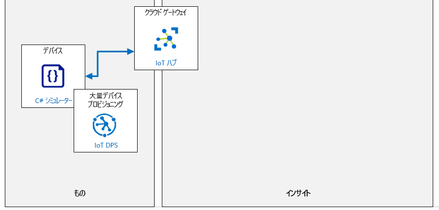

---
lab:
    title: 'ラボ 05: DPS でのデバイスの個別登録'
    module: 'モジュール 3: 大規模なデバイス プロビジョニング'
---

# DPS でのデバイスの個別登録

## ラボ シナリオ

Contoso の経営陣は、既存の資産監視および追跡ソリューションの更新を推進しています。この更新では、IoT デバイスを使用して、現在のシステムで必要な手動のデータ入力作業を削減し、出荷プロセス中のより高度な監視を提供します。このソリューションは、出荷用コンテナーがロードされたときに IoT デバイスをプロビジョニングし、コンテナーが目的地に到着したときにデバイスのプロビジョニングを解除する機能に依存しています。プロビジョニング要件を管理するための最良のオプションは、IoT Hub デバイス プロビジョニング サービス (DPS) のようです。

提案されたシステムは、輸送中の輸送コンテナーの場所、温度、圧力をトラッキングするために、統合されたセンサーを備えた IoT デバイスを使用します。IoT デバイスは、Contoso がチーズの輸送に使用する既存の出荷コンテナー内に配置され、車両が提供する WiFi を使用して Azure IoT Hub に接続します。新しいシステムは、製品環境の継続的な監視を提供し、問題が検出されたときにさまざまな通知シナリオを可能にします。テレメトリが IoT Hub に送信されるレートは構成可能である必要があります。

Contoso のチーズ パッケージング施設では、空のコンテナーがシステムに入ると、新しい IoT デバイスが装備され、パッケージ化されたチーズ製品がロードされます。IoT デバイスは、DPS を使用して IoT Hub に自動プロビジョニングされます。コンテナーが宛先に到着すると、IoT デバイスが取得され、完全にプロビジョニング解除 (登録抹消および登録解除) する必要があります。回収されたデバイスはリサイクルされ、同じ自動プロビジョニング プロセスに従って将来の出荷に再利用されます。

DPS を使用してデバイス プロビジョニングとプロビジョニング解除プロセスを検証する作業を担当します。最初のテスト段階では、個別登録アプローチを使用します。

次のリソースが作成されます。



## このラボでは

このラボでは、ラボの前提条件を確認することから始め、必要に応じてスクリプトを実行して、Azure サブスクリプションに必要なリソースが含まれていることを確認します。次に、対称キー認証を使用し、デバイスの初期デバイス ツイン状態 (テレメトリ レート) を指定する、DPS への新しい個別登録を作成します。デバイスの登録が保存されたら、登録に戻り、デバイスの認証に必要な自動生成されたプライマリ キーとセカンダリ キーを取得します。次に、シミュレートされたデバイスを作成し、デバイスが IoT Hub に正常に接続されていること、および初期デバイス ツイン プロパティがデバイスによって期待どおりに適用されていることを確認します。最後に、デバイスの登録抹消と登録解除の両方を行って (それぞれ、DPS と IoT Hub から) デバイスをソリューションから安全に削除するプロビジョニング解除プロセスを完了します。ラボには、次の演習が含まれます。

* ラボの前提条件を確認する
* DPS での新しい個別登録 (対称キー) の作成
* シミュレートされたデバイスの構成
* シミュレートされたデバイスのテスト
* デバイスのプロビジョニング解除

## ラボの手順

### 演習 1: ラボの前提条件を確認する

このラボでは、次の Azure リソースが使用可能であることを前提としています。

| リソースの種類 | リソース名 |
| :-- | :-- |
| リソース グループ | rg-az220 |
| IoT Hub | iot-az220-training-{your-id} |
| デバイス プロビジョニング サービス | dps-az220-training-{your-id} |

これらのリソースが利用できない場合は、演習 2 に進む前に、以下の指示に従って **lab05-setup.azcli** スクリプトを実行する必要があります。スクリプト ファイルは、開発環境構成 (ラボ 3) の一部としてローカルに複製した GitHub リポジトリに含まれています。

**lab05-setup.azcli** スクリプトは、**Bash** シェル環境で実行するために記述されています。Azure Cloud Shell でこれを実行するのが、最も簡単な方法です。

1. ブラウザーを使用して [Azure Cloud Shell](https://shell.azure.com/) を開き、このコースで使用している Azure サブスクリプションでログインします。

    Cloud Shell のストレージの設定に関するメッセージが表示された場合は、デフォルトをそのまま使用します。

1. Cloud Shell が **Bash** を使用していることを確認します。

    「Azure Cloud Shell」 ページの左上隅にあるドロップダウンは、環境を選択するために使用されます。選択されたドロップダウンの値が **Bash** であることを確認します。

1. Cloud Shell ツール バーで、「**ファイルのアップロード/ダウンロード**」 をクリックします(右から 4番目のボタン)。

1. ドロップダウンで、「**アップロード**」 をクリックします。

1. ファイル選択ダイアログで、開発環境を構成したときにダウンロードした GitHub ラボ ファイルのフォルダーの場所に移動します。

    _ラボ 3: 開発環境の設定_:ZIP ファイルをダウンロードしてコンテンツをローカルに抽出することで、ラボ リソースを含む GitHub リポジトリを複製しました。抽出されたフォルダー構造には、次のフォルダー パスが含まれます。

    * すべてのファイル
      * ラボ
          * 05 - DPS におけるデバイスの個別登録
            * 設定

    lab05-setup.azcli スクリプト ファイルは、ラボ 5 の設定フォルダー内にあります。

1. **lab05-setup.azcli** ファイルを選択し、「**開く**」 をクリックします。

    ファイルのアップロードが完了すると、通知が表示されます。

1. 正しいファイルがアップロードされたことを確認するには、次のコマンドを入力します。

    ```bash
    ls
    ```

    `ls` コマンドを使用して、現在のディレクトリの内容を表示します。一覧にある lab05-setup.azcli ファイルを確認できるはずです。

1. セットアップ スクリプトを含むこのラボのディレクトリを作成し、そのディレクトリに移動するには、次の Bash コマンドを入力します。

    ```bash
    mkdir lab5
    mv lab05-setup.azcli lab5
    cd lab5
    ```

    これらのコマンドは、このラボのディレクトリを作成し、**lab05-setup.azcli** ファイルをそのディレクトリに移動させ、新しいディレクトリを現在の作業ディレクトリにするための変更を行います。

1. **lab05-setup.azcli** スクリプトに実行権限があることを確認するには、次のコマンドを入力します。

    ```bash
    chmod +x lab05-setup.azcli
    ```

1. Cloud Shell ツールバーで、lab05-setup.azcli ファイルへのアクセスを有効にするには、「**エディタを開く**」 (右から 2 番目のボタン - **{ }**) をクリックします。

1. 「**ファイル**」 の一覧で、lab5 フォルダーを展開してスクリプト ファイルを開き 、**lab5**、「**lab05-setup.azcli**」 の順にクリックします。

    エディタは **lab05-setup.azcli** ファイルの内容を表示します。

1. エディターで、`{your-id}` と `{your-location}` 変数の値を更新します。

    サンプル例として、このコースの最初に作成した一意の id 、つまり **cah191211** に `{your-id}` を設定し、リソースにとって意味のある場所に `{your-location}` を設定する必要があります。

    ```bash
    #!/bin/bash

    # これらの値を変更してください!
    YourID="{your-id}"
    Location="{your-location}"
    ```

    > **注**:  `{your-location}` 変数は、すべてのリソースをデプロイするリージョンの短い名前に設定する必要があります。次のコマンドを入力すると、使用可能な場所と短い名前 (「**名前**」 の列) の一覧を表示できます。

    ```bash
    az account list-locations -o Table

    DisplayName           Latitude    Longitude    Name
    --------------------  ----------  -----------  ------------------
    East Asia             22.267      114.188      eastasia
    Southeast Asia        1.283       103.833      southeastasia
    Central US            41.5908     -93.6208     centralus
    East US               37.3719     -79.8164     eastus
    East US 2             36.6681     -78.3889     eastus2
    ```

1. エディター画面の右上で、ファイルに加えた変更を保存してエディターを閉じるには、**...** をクリックし、「**エディターを閉じる**」 をクリックします。

    保存を求められたら、「**保存**」 をクリックすると、エディタが閉じます。

    > **注**:  **CTRL+S**を使っていつでも保存でき、 **CTRL+Q**を押してエディターを閉じます。

1. このラボに必要なリソースを作成するには、次のコマンドを入力します。

    ```bash
    ./lab05-setup.azcli
    ```

    これは、実行するのに数分かかります。各ステップが完了すると、出力が表示されます。

    スクリプトが完了したら、ラボを続行することができます。

### 演習 2: DPS での新しい個別登録 (対称キー) の作成

この演習では、_対称キー構成証明_を使用して、デバイス プロビジョニング サービス (DPS) 内のデバイスに対して新しい個別登録を作成します。また、登録内でデバイスの初期状態を構成します。登録を保存した後、戻って、登録が保存されたときに作成される自動生成された認証キーを取得します。

#### タスク 1: 登録を作成する

1. 必要に応じて、Azure アカウントの認証情報を使用して [>portal.azure.com](https://portal.azure.com) にログインします。

    複数の Azure アカウントをお持ちの場合は、このコースで使用するサブスクリプションに関連付けられているアカウントを使用してログインしていることを確認してください。

1. **AZ-220** ダッシュボードがロードされ、リソース タイルが表示されていることに注意してください。

    IoT Hub と DPS の両方のリソースが表示されます。

1. **rg-az220** リソース グループのタイルで、**dps-az220-training-{your-id}** をクリックします。

1. 左側のメニューの 「**設定**」 で、「**登録の管理**」 をクリックします。

1. **「登録の管理」** ペインの上部で、**「+ 個々の登録を追加」** をクリックします。

1. 「**登録の追加**」 ブレードの 「**メカニズム**」 ドロップダウンで、「**対称キー**」 をクリックします。

    これにより、対称キー認証を使用する構成証明方法が設定されます。

1. 「メカニズム」 設定のすぐ下で、「**キーの自動生成**」 オプションがオンになっていることを確認します。

    これにより、DPS は デバイス登録時に **主キー** と **2 次キー** の両方の値を自動的に生成するように設定されます。オプションで、このオプションのチェックを外して、カスタムキーを手動で入力できます。

    > **注**: プライマリ キーとセカンダリ キーの値は、このレコードが保存された後に生成されます。次のタスクでは、このレコードに戻って値を取得し、このラボの後半でシミュレートされたデバイス アプリ内でそれらを使用します。

1. 「**登録 ID**」 フィールドで、DPS 内のデバイス登録に使用する登録 ID を指定するには「**sensor-thl-1000**」と入力します

    既定では、登録からデバイスがプロビジョニングされるときに、登録 ID が IoT Hub デバイス ID として使用されます。これらの値を異なる値にする必要がある場合は、そのフィールドに必要な IoT Hub デバイス ID を入力することができます。

1. 「**IoT Hub デバイス ID**」 フィールドは空白のままにします。

    このフィールドを空白のままにすると、IoT Hub は登録 ID をデバイス ID として使用します。選択できないフィールドにデフォルトのテキスト値が表示される場合は、このテキストはプレースホルダー テキストであり、入力値として扱われるので、心配しないでください。

1. 「**IoT Edge デバイス**」 フィールドを **False** のままにします。

    新しいデバイスはエッジ デバイスではありません。IoT Edge デバイスの操作については、このコースの後半で説明します。

1. 「**デバイスをハブに割り当てる方法を選択してください**」 フィールドを 「**加重が均等に分布**」 に設定したままにします。

    登録に関連付けられている IoT Hub は 1 つしかないため、この設定は重要ではありません。  複数の分散ハブがある大規模な環境では、この設定によって、このデバイス登録を受信する IoT Hub の選択方法を制御できます。サポートされている割り当てポリシーは 4 つあります。

    * **最低限の待ち時間**: デバイスに対する待ち時間が最も短いハブに基づいて、デバイスを IoT Hub にプロビジョニングします。
    * **加重が均等に分布 (デフォルト)**: リンクされた各 IoT Hub にデバイスが同程度にプロビジョニングされます。これが既定の設定です。デバイスを 1 つの IoT Hub にのみプロビジョニングする場合は、この設定のままでかまいません。 
    * **登録リストを介した静的構成**: 登録リストの目的の IoT Hub の仕様が、Device Provisioning Service レベルの割り当てポリシーよりも優先されます。
    * **カスタム (Azure 関数を使用)**: デバイス プロビジョニング サービスは、デバイスと登録に関するすべての関連情報を提供する Azure 関数コードを呼び出します。関数コードが実行され、デバイスのプロビジョニングに使用する IoT Hub 情報が返されます。

1. 「**このデバイスを割り当てることができる IoT Hub を選択する**」 ドロップダウンで 作成した **iot-az220-training-{your-id}** IoT Hub が指定されていることに注意してください。

    このフィールドは、デバイスに割り当てられる IoT Hub を指定するために使用されます。

1. 「**Select how you want device data to be handled on re-provisioning (再プロビジョニングするときのデバイス データの処理方法を選択してください)**」 フィールドを、既定値の 「**Re-provision and migrate data (再プロビジョニングしてデータを移行する)**」 に設定したままにします。

    このフィールドによって、同じデバイス (同じ登録 ID で示される) が、少なくとも 1 回正常にプロビジョニングされた後に、プロビジョニング要求を後で送信する再プロビジョニング動作を高度に制御できます。次の 3 つのオプションがあります。

    * **データの再プロビジョニングと移行**: このポリシーは新しい登録エントリの既定値です。このポリシーは、登録エントリに関連付けられているデバイスが新しいプロビジョニング要求を送信するときに処理されます。登録エントリの構成に応じて、デバイスは別の IoT Hub に再割り当てされる可能性があります。デバイスの割り当て先の IoT Hub が変更されると、最初の IoT Hub へのデバイスの登録は削除されます。最初の IoT Hub からのすべてのデバイス状態情報は、新しい IoT Hub に移行されます。
    * **再プロビジョニングして初期構成にリセットする**: このポリシーは、IoT Hub を変更せずにファクトリ リセットに使用されることが多いです。このポリシーは、登録エントリに関連付けられているデバイスが新しいプロビジョニング要求を送信するときに処理されます。登録エントリの構成に応じて、デバイスは別の IoT Hub に再割り当てされる可能性があります。デバイスの割り当て先の IoT Hub が変更されると、最初の IoT Hub へのデバイスの登録は削除されます。デバイスがプロビジョニングされたときにプロビジョニング サービス インスタンスが受け取った初期構成のデータは、新しい IoT Hub に提供されます。
    * **再プロビジョニングしない**: デバイスは別のハブに再プロビジョニングされることはありません。このポリシーは、下位互換性を管理するために提供されます。

1. **「初期デバイス ツイン状態」** フィールドで、`telemetryDelay` という名前のプロパティを`"2"` の値で指定するには、JSON オブジェクトを次のように更新します。

    最終的な JSON は次のようになります。

    ```json
    {
        "tags": {},
        "properties": {
            "desired": {
                "telemetryDelay": "2"
            }
        }
    }
    ```

    このフィールドには、デバイスの必要なプロパティの初期構成を表す JSON データが含まれます。入力したデータは、センサー テレメトリの読み取りと IoT Hub へのイベントの送信の遅延時間を設定するためにデバイスによって使用されます。

1. 「 **入力可能な項目**」 フィールドは 「**有効**」 に設定したままにします。

    一般的に、新しい登録エントリを有効にし、有効を維持する必要があります。

1. 「**登録の追加**」 ブレードの上部にある 「**保存**」 をクリック します。

#### タスク 2: 登録を確認し、認証キーを取得する

1. 「**登録の管理**」 ペインで、個別のデバイス登録の一覧を表示するには、「**個別の登録**」 をクリックします。

    ご存知かもしれませんが、登録レコードを使用して認証キーを取得します。

1. **「登録 ID」** で、**「sensor-thl-1000」** をクリックします。

    このブレードにより、作成した個々の登録の登録詳細を表示できます。

1. **「認証タイプ」** セクションを見つけます。

    登録の作成時に認証タイプを対称キーとして指定したため、プライマリ キーとセカンダリ キーの値が作成されました。各テキスト ボックスの右側に、値のコピーに使用できるボタンがあることに注意してください。

1. このデバイス登録の**プライマリ キー**と**セカンダリ キー**の値をコピーし、後で参照できるようにファイルに保存します。

    これらは、デバイスが IoT Hub サービスで認証するための認証キーです。

1. **初期デバイス ツインの状態**を見つけ、デバイス ツインの Desired State の JSON に、`telemetryDelay` プロパティが値 `"2"` に設定されていることに注意してください。

1. **sensor-thl-1000** の個別登録ブレードを閉じます。

### 演習 3: シミュレートされたデバイスの構成

この演習では、前の演習で作成した個々の登録を使用して Azure IoT に接続するように、C# で記述されたシミュレートされたデバイスを構成します。また、Azure IoT Hub 内のデバイス ツインに基づくデバイス構成を読み取って更新するコードをシミュレートされたデバイスに追加します。

この演習で作成するシミュレートされたデバイスは、出荷コンテナーやボックス内に配置される IoT デバイスを表し、Contoso 製品の転送中の監視に使用されます。Azure IoT Hub に送信されるデバイスからのセンサー テレメトリには、コンテナーの温度、湿度、圧力、緯度/経度座標が含まれています。デバイスは、全体的な資産追跡ソリューションの一部です。

> **注**: このシミュレートされたデバイスの作成は、前のラボで作成したものと少し冗長であるという印象を持っているかもしれませんが、このラボで実装する認証メカニズムは、以前に行ったものとはかなり異なります。前のラボでは認証に共有アクセス キーを使用してデバイスのプロビジョニングを必要とせず、プロビジョニング管理の利点 (デバイス ツインなど) も提供しないためです。また、共有キーのかなり大希望な配布と管理が必要です。このラボでは、デバイス プロビジョニング サービスを使用して一意のデバイスをプロビジョニングします。

#### タスク 1: シミュレートされたデバイスを作成する

1. **「dps-az220-training- {your-id}」** ブレードの左側のメニューで、**「概要」** をクリックします。

1. ブレードの右上で、**ID スコープ**に割り当てられた値の上にマウス ポインタを置き、「**クリップボードにコピー**」 をクリックします。

    この値はまもなく使用されるため、クリップボードを使用できない場合は値をメモしておきます。大文字の "O" と数字の "0" を必ず区別してください。

    **ID スコープ**は、次の値と似ています。`0ne0004E52G`

1. **Visual Studio Code** を開きます。

1. **「ファイル」** メニューの **「フォルダーを開く」** をクリックし、ラボ 5 のスターター フォルダーに移動します。

    ラボ 5 のスターター フォルダーは、ラボ 3 で開発環境をセットアップするときにダウンロードしたラボ リソース ファイルの一部です。フォルダ パスは次のとおりです。

    * すべてのファイル
      * ラボ
          * 05 - DPS におけるデバイスの個別登録
            * スターター

1. 「**フォルダーを開く**」 ダイアログで、「**ContainerDevice**」 をクリックしてから、「**フォルダーの選択**」 をクリックします。
 
    ContainerDevice フォルダーは、ラボ 5 のスターター フォルダーのサブフォルダーです。Program.cs ファイルと ContainerDevice.csproj ファイルが含まれています。

    > **注**: Visual Studio Code で必要なアセットを読み込むように求められた場合は、**「はい」** をクリックしてアセットを読み込むことができます。
 
1. **「表示」**メニューで、**「ターミナル」** をクリック します。

    選択したターミナル シェルが Windows コマンド プロンプトであることを確認します。

1. ターミナル コマンド プロンプトで、すべてのアプリケーション NuGet パッケージを復元するには、次のコマンドを入力します。

    ```cmd/sh
    dotnet restore
    ```

1. 「Visual Studio Code **エクスプローラー**」 ペインで、「**Program.cs**」 をクリックします。

1. コード エディターで、Program クラスの上部近くにある **dpsIdScope** 変数を見つけます。

1. デバイス プロビジョニング サービスからコピーした ID スコープを使用して、dpsIdScope に割り当てられた値を更新します。

    > **注**: ID スコープの値が使用できない場合は、DPS サービスの 「概要」 ブレード (Azure portal) で確認できます。

1. **registrationId** 変数を見つけ、**sensor-thl-1000** を使用して割り当てられた値を更新します

    この変数は、デバイス プロビジョニング サービスで作成した個々の加入契約の**登録 ID** 値を表します。

1. 保存した**プライマリ キー**と**セカンダリ キー**の値を使用して、**individualEnrollmentPrimaryKey** 変数と **individualEnrollmentSecondaryKey** 変数を更新します。

    > **注**: これらのキー値が利用できない場合は、次のように Azure portal からコピーできます。
    >
    > 「**登録の管理**」 ブレードを開き、「**個別の登録**」 をクリックし、「**sensor-thl-1000**」 をクリックします。値をコピーし、上記の手順に示すように貼り付けます。

#### タスク 2: プロビジョニング コードを追加する

このタスクでは、DPS を介してデバイスをプロビジョニングし、IoT Hub への接続に使用できる DeviceClient インスタンスを作成するコードを実装します。

1. 時間を割いて **Program.cs** ファイルのコードをスキャンします。 

    **ContainerDevice** アプリケーションの全体的なレイアウトは、ラボ 4 で作成した **CaveDevice** アプリケーションと同様です。両方のアプリケーションに次のものが含まれていることに注意してください。

    * ステートメントの使用
    * 名前空間の定義
      * プログラム クラス - Azure IoT への接続とテレメトリの送信を担当
      * EnvironmentSensor クラス - センサー データの生成を担当

1. コード エディターで、`// INSERT Main method below here` コメントを見つけます。

1. シミュレートされたデバイス アプリケーションの **Main** メソッドを作成するには、次のコードを入力します。

    ```csharp
    public static async Task Main(string[] args)
    {

        using (var security = new SecurityProviderSymmetricKey(registrationId,
                                                                individualEnrollmentPrimaryKey,
                                                                individualEnrollmentSecondaryKey))
        using (var transport = new ProvisioningTransportHandlerAmqp(TransportFallbackType.TcpOnly))
        {
            ProvisioningDeviceClient provClient =
                ProvisioningDeviceClient.Create(GlobalDeviceEndpoint, dpsIdScope, security, transport);

            using (deviceClient = await ProvisionDevice(provClient, security))
            {
                await deviceClient.OpenAsync().ConfigureAwait(false);

                // 以下にセットアップ OnDesiredPropertyChanged イベント処理を挿入します

                // 以下にデバイス ツイン プロパティの読み込みを挿入します

                // デバイス テレメトリの読み取りと送信を開始します
                Console.WriteLine("Start reading and sending device telemetry...");
                await SendDeviceToCloudMessagesAsync(deviceClient);

                await deviceClient.CloseAsync().ConfigureAwait(false);
            }
        }
    }
    ```

    このアプリケーションの Main メソッドは、前のラボで作成した CaveDevice アプリケーションの Main メソッドと同様の目的を果たしますが、少し複雑です。CaveDevice アプリでは、デバイス接続文字列を使用して IoT Hub に直接接続しました。今回は、最初にデバイスをプロビジョニングし (または、後続の接続のために、デバイスがまだプロビジョニングされていることを確認し)、次に適切な IoT Hub 接続の詳細を取得する必要があります。

    DPS に接続するには、**dpsScopeId** と **GlobalDeviceEndpoint** (変数で定義) が必要なだけでなく、以下も指定する必要があります。

    * **security** - 登録の認証に使用される方法。以前に対称キーを使用するように個々の登録を構成したため、**SecurityProviderSymmetricKey** が論理的な選択です。ご想像のとおり、X.509 と TPM もサポートするプロバイダーのバリエーションがあります。

    * **transport** - プロビジョニングされたデバイスによって使用されるトランスポート プロトコル。この例では、AMQPハンドラーが選択されています (**ProvisioningTransportHandlerAmqp**)。もちろん、HTTP ハンドラーと MQTT ハンドラーも利用できます。

    **security** 変数と **transport** 変数が入力されたら、**ProvisioningDeviceClient** のインスタンスを作成します。このインスタンスを使用してデバイスを登録し、**ProvisionDevice** メソッドで **DeviceClient** を作成します。これは、まもなく追加します。

    **Main** メソッドの残りの部分では、**CaveDevice** -  で行ったのとは少し異なる方法でデバイスクライアントを使用します。今回は、デバイス接続を明示的に開いて、アプリがデバイス ツインを使用できるようにします (これについては次の演習で詳しく説明します)。次に、**SendDeviceToCloudMessagesAsync** メソッドを呼び出して、テレメトリの送信を開始します。

    **SendDeviceToCloudMessagesAsync** メソッドは、**CaveDevice** アプリケーションで作成したものと非常によく似ています。これは、**EnvironmentSensor** クラスのインスタンスを作成し (これも圧力と位置のデータを返します)、メッセージを作成して送信します。メソッド ループ内の固定遅延の代わりに、**telemetryDelay** 変数: `await Task.Delay(telemetryDelay * 1000);` を使用して遅延が計算されることに注意してください。時間が許せば、自分自身を詳しく調べて、これを以前のラボで使用したクラスと比較してください。

    最後に、**Main** メソッドに戻り、デバイス クライアントを閉じます。

    > **情報**: [ここ](https://docs.microsoft.com/ja-jp/dotnet/api/microsoft.azure.devices.provisioning.client.provisioningdeviceclient?view=azure-dotnet) - から **ProvisioningDeviceClient** のドキュメントを見つけることができ、そこから他の関連クラスに簡単に移動できます。

1. `// INSERT ProvisionDevice method below here` コメントを見つけます。

1. **ProvisionDevice** メソッドを作成するには、次のコードを入力します。

    ```csharp
    private static async Task<DeviceClient> ProvisionDevice(ProvisioningDeviceClient provisioningDeviceClient, SecurityProviderSymmetricKey security)
    {
        var result = await provisioningDeviceClient.RegisterAsync().ConfigureAwait(false);
        Console.WriteLine($"ProvisioningClient AssignedHub: {result.AssignedHub}; DeviceID: {result.DeviceId}");
        if (result.Status != ProvisioningRegistrationStatusType.Assigned)
        {
            throw new Exception($"DeviceRegistrationResult.Status is NOT 'Assigned'");
        }

        var auth = new DeviceAuthenticationWithRegistrySymmetricKey(
            result.DeviceId,
            security.GetPrimaryKey());

        return DeviceClient.Create(result.AssignedHub, auth, TransportType.Amqp);
    }
    ```

    ご覧のとおり、このメソッドは、前に作成したプロビジョニング デバイス クライアントとセキュリティ インスタンスを受け取ります。`provisioningDeviceClient.RegisterAsync()` が呼び出され、**DeviceRegistrationResult** インスタンスが返されます。この結果には、**DeviceId**、**AssignedHub**、**Status** などの多くのプロパティが含まれています。

    > **情報**: **DeviceRegistrationResult** プロパティの詳細については、[こちら](https://docs.microsoft.com/ja-jp/dotnet/api/microsoft.azure.devices.provisioning.client.deviceregistrationresult?view=azure-dotnet)をご覧ください。

    次に、メソッドはプロビジョニングス テータスが設定されていることを確認し、デバイスが*割り当て*  - られていない場合は例外をスローします。ここで考えられる他の結果には、*未割り当て*、*割り当て中*、*失敗*、*無効*などがあります。

    * **Program.ProvisionDevice** メソッドには、DPS を介してデバイスを登録するためのロジックが含まれています。
    * **Program.SendDeviceToCloudMessagesAsync** メソッドは、テレメトリをデバイスからクラウドへのメッセージとして Azure IoT Hub に送信します。
    * **EnvironmentSensor** クラスには、温度、湿度、圧力、緯度、経度用の、シミュレートされたセンサーの読み取り値を生成するためのロジックが含まれています。 

1. **SendDeviceToCloudMessagesAsync** メソッドを見つけます。

1. **SendDeviceToCloudMessagesAsync** メソッドの下部にある `Task.Delay()` の呼び出しに着目してください。

    `Task.Delay()` は、次のテレメトリ メッセージを作成して送信する前に、一定期間 `while` ループを "一時停止" するために使用されます。**telemetryDelay** 変数は、次のテレメトリ メッセージを送信するまでの待機時間を定義するために使用されます。Contoso では、遅延時間を構成可能にする必要があります。  

1. **Program** クラスの先頭近くにある **telemetryDelay** 変数宣言を見つけます。

    遅延の既定値が **1** 秒に設定されていることに注意してください。次の手順では、デバイス ツイン値を使用して遅延時間を制御するコードを統合します。

#### タスク 3: デバイス ツインのプロパティを統合する

デバイスで (Azure IoT Hub から) デバイス ツインのプロパティを使用するには、デバイス ツインのプロパティにアクセスして適用するコードを作成する必要があります。この場合、シミュレートされたデバイス コードを更新して、telemetryDelay デバイスのツインの必要なプロパティを読み取り、その値をコード内の対応する **telemetryDelay** 変数に割り当てます。また、デバイスのツイン レポート プロパティ (IoT Hub によって維持されている) を更新して、デバイスに現在実装されている遅延時間を記録する必要があります。

1. Visual Studio Code エディターで、**Main** メソッドを見つけます。

    デバイス ツイン プロパティの統合を開始するには、デバイス ツイン プロパティが更新されたときに、シミュレートされたデバイスに通知を有効にするコードが必要です。

    これを実現するには、`DeviceClient.SetDesiredPropertyUpdateCallbackAsync` メソッドを使用し、`OnDesiredPropertyChanged` メソッドを作成することによってイベント ハンドラーを設定します。

1.  `// INSERT Setup OnDesiredPropertyChanged Event Handling below here` コメントを見つけます。

1. OnDesiredPropertyChanged イベントの DeviceClient を設定するには、次のコードを入力します。

    ```csharp
    await deviceClient.SetDesiredPropertyUpdateCallbackAsync(OnDesiredPropertyChanged, null).ConfigureAwait(false);
    ```

    **SetDesiredPropertyUpdateCallbackAsync** メソッドは、デバイス ツインの必要なプロパティ変更を受け取るために **DesiredPropertyUpdateCallback** イベント ハンドラーを設定するために使用されます。このコードは、デバイス ツイン プロパティの変更イベントを受信したときに **OnDesiredPropertyChanged** という名前のメソッドを呼び出す **deviceClient** を構成します。

    イベント ハンドラーを設定するための **SetDesiredPropertyUpdateCallbackAsync** メソッドが整ったので、呼び出す **OnDesiredPropertyChanged** メソッドを作成する必要があります。

1. `// INSERT OnDesiredPropertyChanged method below here` コメントを見つけます。

1. **OnDesiredPropertyChanged** メソッドを作成するには、次のコードを入力します。

    ```csharp
    private static async Task OnDesiredPropertyChanged(TwinCollection desiredProperties, object userContext)
    {
        Console.WriteLine("Desired Twin Property Changed:");
        Console.WriteLine($"{desiredProperties.ToJson()}");

        // 必要なツイン プロパティを読み取る
        if (desiredProperties.Contains("telemetryDelay"))
        {
            string desiredTelemetryDelay = desiredProperties["telemetryDelay"];
            if (desiredTelemetryDelay != null)
            {
                telemetryDelay = int.Parse(desiredTelemetryDelay);
            }
            // 必要な telemetryDelay が null または未指定の場合は、変更しないでください
        }

        // ツイン プロパティをレポートする
        var reportedProperties = new TwinCollection();
        reportedProperties["telemetryDelay"] = telemetryDelay.ToString();
        await deviceClient.UpdateReportedPropertiesAsync(reportedProperties).ConfigureAwait(false);
        Console.WriteLine("Reported Twin Properties:");
        Console.WriteLine($"{reportedProperties.ToJson()}");
    }
    ```

    **OnDesiredPropertyChanged** イベント ハンドラーが **TwinCollection** 型の **desiredProperties** パラメーターを受け入れることに注意してください。

    **desiredProperties** パラメーターの値に **telemetryDelay** (デバイス ツインの必要なプロパティ) が含まれている場合、コードはデバイス ツイン プロパティの値を **telemetryDelay** 変数に割り当てます。**SendDeviceToCloudMessagesAsync** メソッドには、IoT Hub に送信されるメッセージ間の遅延時間を設定するために **telemetryDelay** 変数を使用する **Task.Delay** 呼び出しが含まれていることを思い出すかもしれません。

    次のコード ブロックは、デバイスの現在の状態を Azure IoT Hub に報告するために使用されることに注意してください。このコードは、**DeviceClient.UpdateReportedPropertiesAsync** メソッドを呼び出し、デバイス プロパティの現在の状態を含む **TwinCollection** を渡します。これは、デバイス ツインの必要なプロパティ変更イベントを受信し、それに応じて構成を更新したことを IoT Hub に報告する方法です。これは、目的のプロパティのエコーではなく、プロパティに設定されている内容を報告することに注意してください。デバイスから送信された報告されたプロパティが、デバイスが受信した望ましい状態と異なる場合、IoT Hub はデバイスの状態を反映する正確なデバイス ツインを維持します。

    デバイスは、Azure IoT Hub からデバイス ツインの必要なプロパティに対する更新を受け取ることができるようになったので、デバイスの起動時に初期セットアップを構成するようにコード化する必要があります。これを行うには、デバイスは、Azure IoT Hub から現在のデバイス ツインの必要なプロパティを読み込み、それに応じてそれ自体を構成する必要があります。

1. **Main** メソッドで、`// INSERT Load Device Twin Properties below here` コメントを見つけます。

1. デバイス ツインの必要なプロパティを読み取り、デバイスの起動時に一致するようにデバイスを構成するには、次のコードを入力します。

    ```csharp
    var twin = await deviceClient.GetTwinAsync().ConfigureAwait(false);
    await OnDesiredPropertyChanged(twin.Properties.Desired, null);
    ```

    このコードは、シミュレートされたデバイスのデバイス ツインを取得する `DeviceTwin.GetTwinAsync` メソッドを呼び出します。次に、`Properties.Desired` プロパティ オブジェクトにアクセスして、デバイスの現在の必要な状態を取得し、それをシミュレートされたデバイスの **telemetryDelay** 変数を構成する **OnDesiredPropertyChanged** メソッドに渡します。

    このコードでは、_OnDesiredPropertyChanged_ イベントを処理するために既に作成されている **OnDesiredPropertyChanged** メソッドを再利用しています。これにより、デバイス ツインの目的の状態プロパティを読み取り、起動時にデバイスを 1 か所で構成するコードを保持できます。結果のコードは、より簡単で保守が容易になります。

1. 「Visual Studio Code **ファイル**」 メニューの 「**保存**」 をクリックします。

    次に、シミュレートされたデバイスは、Azure IoT Hub のデバイス ツイン プロパティを使用して、テレメトリ メッセージ間の遅延を設定します。

### 演習 4: シミュレートされたデバイスのテスト

この演習では、シミュレートされたデバイスを実行し、センサー テレメトリを Azure IoT Hub に送信することを確認します。また、Azure IoT Hub 内のシミュレートされたデバイスの telemetryDelay デバイス ツイン プロパティを更新することにより、テレメトリが Azure IoT Hub に送信される速度を変更します。

#### タスク 1: デバイスをビルドおよび実行する

1. Visual Studio Code でコード プロジェクトを開いていることを確認します。

1. **「表示」**メニューで、**「ターミナル」** をクリック します。

1. ターミナル ペインで、コマンド プロンプトに `Program.cs` ファイルのディレクトリ パスが表示されていることを確認します。

1. コマンド プロンプトで、シミュレートされたデバイス アプリケーションをビルドして実行するには、次のコマンドを入力します。

    ```cmd/sh
    dotnet run
    ```

    > **注**: シミュレートされたデバイス アプリケーションを実行すると、まず、その状態に関する詳細がコンソール (ターミナル ペイン) に書き込まれます。

1. `Desired Twin Property Changed:` 行の後の JSON 出力には、デバイスの `telemetryDelay` に必要な値が含まれていることに注意してください。

    ターミナル ペインを上にスクロールして、出力を確認できます。次のようになるはずです。

    ```text
    ProvisioningClient AssignedHub: iot-az220-training-{your-id}.azure-devices.net; DeviceID: sensor-thl-1000
    Desired Twin Property Changed:
    {"telemetryDelay":"2","$version":1}
    Reported Twin Properties:
    {"telemetryDelay":"2"}
    Start reading and sending device telemetry...
    ```

1. シミュレートされたデバイス アプリケーションが Azure IoT Hub にテレメトリ イベントを送信し始めることに注意してください。

    テレメトリ イベントには、`temperature`、`humidity`、`pressure`、`latitude`、および`longitude`の値が含まれ、次のようになるはずです。

    ```text
    11/6/2019 6:38:55 PM > Sending message: {"temperature":25.59094770373355,"humidity":71.17629229611545,"pressure":1019.9274696347665,"latitude":39.82133964767944,"longitude":-98.18181981142438}
    11/6/2019 6:38:55 PM > Sending message: {"temperature":24.68789062681044,"humidity":71.52098010830628,"pressure":1022.6521258267584,"latitude":40.05846882452387,"longitude":-98.08765031156229}
    11/6/2019 6:38:55 PM > Sending message: {"temperature":28.087463226675737,"humidity":74.76071353757787,"pressure":1017.614206096327,"latitude":40.269273772972454,"longitude":-98.28354453319591}
    11/6/2019 6:38:55 PM > Sending message: {"temperature":23.575667940813894,"humidity":77.66409506912534,"pressure":1017.0118147748344,"latitude":40.21020096551372,"longitude":-98.48636739129239}
    ```

    テレメトリの読み取り値のタイムスタンプの違いに注目してください。テレメトリ メッセージ間の遅延は、ソース コードでの規定値 `1` 秒ではなく、デバイス ツインを介して構成されるように `2` 秒となる必要があります。

1. シミュレートされたデバイス アプリを実行したままにします。

    デバイス コードが次のアクティビティで期待どおりに動作していることを確認します。

#### タスク 2: Azure IoT Hub に送信されるテレメトリ ストリームを確認する

このタスクでは、Azure CLI を使用して、シミュレートされたデバイスから送信されたテレメトリが Azure IoT Hub によって受信されていることを確認します。

1. ブラウザーを使用して [Azure Cloud Shell](https://shell.azure.com/) を開き、このコースで使用している Azure サブスクリプションでログインします。

1. Azure Cloud Shell で、次のコマンドを入力します。

    ```cmd/sh
    az iot hub monitor-events --hub-name {IoTHubName} --device-id sensor-thl-1000
    ```

    _**{IoTHubName}** プレースホルダーを Azure IoT Hub の名前に必ず置き換えてください。_

1. IoT Hub が sensor-thl-1000 デバイスからテレメトリ メッセージを受信していることに注意してください。

    次のタスクのために、シミュレートされたデバイス アプリケーションを実行したままにします。

#### タスク 3: ツインを使用してデバイスの構成を変更する

シミュレートされたデバイスを実行すると、Azure IoT Hub 内でデバイス ツインの必要な状態を編集することで、`telemetryDelay` 構成を更新できます。これは、Azure portal 内の Azure IoT Hub でデバイスを構成することで実現できます。

1. Azure portal を開き (まだ開いていない場合)、**Azure IoT Hub** サービスに移動します。

1. 「IoT Hub」 ブレードの 「**エクスプローラ**」 の下の左側のメニューで、「**IoT デバイス**」 をクリックします。

1. **「デバイス ID」** で、**「sensor-thl-1000」** をクリックします。

    > **重要**: このラボで使用しているデバイスを選択していることを確認します。

1. 「**sensor-thl-1000**デバイス」 ブレードのブレードの上部にある 「**デバイス ツイン**」 をクリックします。

    「**デバイス ツイン**」 ブレードでは、デバイス ツインの完全な JSON が編集者に提供されます。これにより、Azure portal 内でデバイス ツインの状態を直接表示および/または編集できます。

1. `properties.desired` オブジェクトの JSON の場所を特定します。

    これには、デバイスの望ましい状態が含まれています。`telemetryDelay` プロパティは既に存在し、DPS の個別登録に基づいてデバイスがプロビジョニングされたときに構成されたとおりに `2` に設定されていることに注意してください。

1. 目的の `telemetryDelay` プロパティに割り当てられた値を更新するには、値を `5` に変更します。

    値には引用符 ("" ) が含まれます。

1. 「**デバイス ツイン**」 ブレードの上部にある 「**保存**」 をクリックします。

    `OnDesiredPropertyChanged` イベントは、シミュレートされたデバイスのコード内で自動的にトリガーされ、デバイスは、デバイス ツインの必要な状態への変更を反映するように、その構成を更新します。

1. シミュレートされたデバイス アプリケーションを実行するために使用している Visual Studio Code ウィンドウに切り替えます。

1. Visual Studio Code で、ターミナル ウィンドウの下部までスクロールします。

1. デバイスが、デバイス ツインプロパティの変更を認識することに注意してください。

    出力には、新しい必要な `telemetryDelay` プロパティ値の JSON と共に、`Desired Twin Property Changed` というメッセージが表示されます。デバイスは、デバイス ツインの必要な状態の新しい構成を選択すると、現在構成されているように、5 秒ごとにセンサー テレメトリの送信を開始するよう自動的に更新されます。

    ```text
    Desired Twin Property Changed:
    {"telemetryDelay":"5","$version":2}
    Reported Twin Properties:
    {"telemetryDelay":"5"}
    4/21/2020 1:20:16 PM > Sending message: {"temperature":34.417625961088405,"humidity":74.12403526442313,"pressure":1023.7792049974805,"latitude":40.172799921919186,"longitude":-98.28591913777421}
    4/21/2020 1:20:16 PM > Sending message: {"temperature":20.963297521678403,"humidity":68.36916032636965,"pressure":1023.7596862048422,"latitude":39.83252821949164,"longitude":-98.31669969393461}
    ```

1. Azure Cloud Shell で Azure CLI コマンドを実行しているブラウザー ページに切り替えます。

    `az iot hub monitor-events` コマンドがまだ実行されていることを確認します。実行されていない場合は、コマンドを再度開始します。

1. Azure IoT Hub に送信されたテレメトリ イベントが、新しい間隔 5 秒で受信されていることに注意してください。

1. **Ctrl+C** を使用して `az` コマンドとシミュレートされたデバイス アプリケーションの両方を停止します。

1. Azure portal を使用してブラウザー ウインドウに切り替えます。

1. **デバイス ツイン** ブレードを閉じます。

1. 引き続き Azure portal で、「**sensor-thl-1000** デバイス」 ブレードの **「デバイス ツイン」** をクリックします。

1. `properties.reported` オブジェクトの JSON の場所を特定します。

    JSON のこの部分には、デバイスによって報告された状態が含まれています。`telemetryDelay` プロパティもここに存在し、`5` に設定されていることに注意してください。  また、値が最後に更新された時点と、特定のレポート値が最後に更新された時刻を示す `$metadata` 値もあります。

1. **デバイス ツイン** ブレードを閉じます。

1. シミュレートされたデバイス ブレードを閉じ、IoT Hub ブレードを閉じます。

### 演習 5: デバイスのプロビジョニング解除

Contoso のシナリオでは、輸送コンテナーが最終目的地に到着すると、IoT デバイスがコンテナーから削除され、Contoso の場所に戻されます。Contoso は、デバイスをテストしてインベントリに配置する前に、デバイスのプロビジョニングを解除する必要があります。将来的には、デバイスは同じ IoT Hub または異なる地域の IoT Hub にプロビジョニングされる可能性があります。デバイスの完全なプロビジョニング解除は、IoT ソリューションにおける IoT デバイスのライフサイクルの重要なステップです。

この演習では、デバイス プロビジョニング サービス (DPS) と Azure IoT Hub の両方からデバイスのプロビジョニングを解除ために必要なタスクを実行します。Azure IoT ソリューションから IoT デバイスを完全にプロビジョニングを解除するには、これらの両方のサービスから削除する必要があります。 

#### タスク 1: DPS からデバイスの登録を解除する

1. 必要な場合は、お使いの Azure アカウントの資格情報を使用して Azure portal にログインします。

    複数の Azure アカウントをお持ちの場合は、このコースで使用するサブスクリプションに関連付けられているアカウントを使用してログインしていることを確認してください。

1. リソース グループ タイルで、デバイス プロビジョニング サービスを開くには、**「dps-az220-training-{your-id}」** をクリックします。

1. 左側のメニューの 「**設定**」 で、「**登録の管理**」 をクリックします。

1. 「**登録の管理**」 ペインで、個別のデバイス登録の一覧を表示するには、「**個別の登録**」 をクリックします。

1. **sensor-thl-1000** の左側にあるチェックボックスをクリックします。

    > **注**: sensor-thl-1000 の個別のデバイス登録を開くのではなく、選択するだけです。

1. ブレードの上部で、「**削除**」 をクリックします。

    > **注**: DPS から個々の登録を削除すると、登録が恒久的に削除されます。一時的に登録を無効にするには、個々の登録の 「**登録の詳細**」 で 「**エントリを有効にする」** 設定を 「**無効にする**」 に設定します。

1. 「**登録の削除**」 プロンプトで 「**はい**」 をクリックします。

    これで、個別登録がデバイス プロビジョニング サービス (DPS) から削除されます。プロビジョニング解除プロセスを完了するには、シミュレートされたデバイスの **デバイス ID** も **Azure IoT Hub** サービスから削除する必要があります。

#### タスク 2: IoT Hub からデバイスの登録を解除する

1. Azure portal で、ダッシュボードにもう一度アクセスしてください。

1. リソース グループ タイルで、Azure IoTHub ブレードを開くには、**「iot-az220-training-{your-id}」** をクリックします。

1. 左側のメニューの 「**エクスプローラー**」で 「**IoT デバイス**」 をクリックします。

1. **sensor-thl-1000** の左側にあるチェックボックスをクリックします。

    > **重要**: このラボで使用したシミュレートされたデバイスを表すデバイスを選択していることを確認します。

1. ブレードの上部で、「**削除**」 をクリックします。

1. 「**選択したデバイスを削除しますか**」 のプロンプトで、「**はい**」 をクリックします。

    > **注**:  IoT Hub からデバイス ID を削除すると、デバイスの登録が完全に削除されます。デバイスが IoT Hub に接続できないように一時的に無効にするには、 デバイスのプロパティ内で 「**IoT Hub への接続を有効にする**」 を 「**無効にする**」 に設定します。

これで、デバイス登録がデバイス プロビジョニング サービスから削除され、一致するデバイス ID が Azure IoT Hub から削除されたので、シミュレートされたデバイスがソリューションから完全に退避されました。
