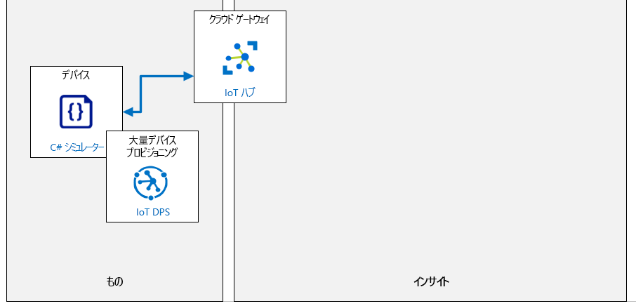

---
lab:
  title: ラボ 06:DPS を使用して IoT デバイスを安全かつ大規模に自動プロビジョニングする
  module: 'Module 3: Device Provisioning at Scale'
ms.openlocfilehash: 5e9c0a761111d5763f2e313cc249052b9ea61e30
ms.sourcegitcommit: b1a2557baf4854683036fde125ada75c6f3dbbfd
ms.translationtype: HT
ms.contentlocale: ja-JP
ms.lasthandoff: 03/28/2022
ms.locfileid: "141200495"
---
# <a name="automatically-provision-iot-devices-securely-and-at-scale-with-dps"></a>DPS を使用して IoT デバイスを安全かつ大規模に自動プロビジョニングする

## <a name="lab-scenario"></a>課題シナリオ

Contoso の資産の監視および追跡ソリューションに対する現在までの作業により、個々の登録を使用してデバイスのプロビジョニングとプロビジョニング解除のプロセスを検証することが可能になりました。 管理チームは、より大規模な展開のためにプロセスのテストを開始するように依頼しました。

プロジェクトを進めるには、デバイス プロビジョニング サービスを使用して、より多くのデバイスを自動的に登録し、X.509 証明書認証を使用して、安全に登録できることを実証する必要があります。 Contoso の要件が満たされていることを確認するために、グループ登録を設定します。

次のリソースが作成されます。



## <a name="in-this-lab"></a>このラボでは

このラボでは、ラボの前提条件を確認することから始め、必要に応じてスクリプトを実行して、Azure サブスクリプションに必要なリソースが含まれていることを確認します。 次に、Azure Cloud Shell 内で OpenSSL を使用して X.509 ルート CA 証明書を生成し、ルート証明書を使用して、デバイス プロビジョニング サービス (DPS) 内のグループ登録を構成します。 その後、ルート証明書を使用してデバイス証明書を生成します。これは、シミュレートされたデバイス コード内で使用して、デバイスを IoT Hub にプロビジョニングします。 デバイスコード内で、デバイスの初期構成を実行するために使用されるデバイス ツイン プロパティへのアクセスを実装します。 次に、シミュレートされたデバイスをテストします。 このラボを終了するには、グループ全体の登録をプロビジョニング解除します。 ラボには、次の演習が含まれます。

* ラボの前提条件を構成する (必要な Azure リソース)
* OpenSSL を使用した X.509 CA 証明書の生成と構成
* X.509 証明書を使用してシミュレートされたデバイスを構成する
* シミュレートされたデバイスのテスト
* グループ登録のプロビジョニング解除

## <a name="lab-instructions"></a>ラボの手順

### <a name="exercise-1-configure-lab-prerequisites"></a>演習 1:ラボの前提条件を構成する

このラボでは、次の Azure リソースが使用可能であることを前提としています。

| リソースの種類 | リソース名 |
| :-- | :-- |
| リソース グループ | rg-az220 |
| IoT Hub | iot-az220-training-{your-id} |
| デバイス プロビジョニング サービス | dps-az220-training-{your-id} |

これらのリソースを確実に使用できるようにするには、次の手順に従います。

1. 仮想マシン環境で Microsoft Edge ブラウザー ウィンドウを開き、次の Web アドレスに移動します。
 
    +++https://portal.azure.com/#create/Microsoft.Template/uri/https%3A%2F%2Fraw.githubusercontent.com%2FMicrosoftLearning%2FAZ-220-Microsoft-Azure-IoT-Developer%2Fmaster%2FAllfiles%2FARM%2Flab06.json+++

    > **注**:緑色の "T" 記号 (例: +++このテキストを入力+++) が表示されているときはいつでも、関連付けられているテキストをクリックすると、仮想マシン環境内の現在のフィールドに情報が入力されます。

1. Azure portal にログインするように求められた場合は、このコースで使用している Azure 資格情報を入力します。

    **[カスタム デプロイ]** ページが表示されます。

1. **[プロジェクトの詳細]** の **[サブスクリプション]** ドロップダウンで、このコースで使用する [Azure サブスクリプション] が選択されていることを確認します。

1. **[リソース グループ]** ドロップダウンで、 **[rg-az220]** を選択します。

    > **注**:**rg-az220** がリストにない場合:
    >
    > 1. **[リソース グループ]** ドロップダウンで、 **[新規作成]** をクリックします。
    > 1. **[名前]** に「**rg-az220**」と入力します。
    > 1. **[OK]** をクリックします。

1. **[インスタンスの詳細]** の **[リージョン]** ドロップダウンで、最も近いリージョンを選択します。

    > **注**:**rg-az220** グループが既に存在する場合、 **[リージョン]** フィールドは、リソース グループで使用されるリージョンに設定され、読み取り専用になります。

1. **[Your ID]\(ユーザー ID\)** フィールドに、演習 1 で作成した一意の ID を入力します。

1. **[コース ID]** フィールドに、「**az220**」と入力します。

1. テンプレートを検証するには、 **[確認および作成]** をクリックします。

1. 検証に成功したら、 **[作成]** をクリックします。

    デプロイが開始されます。

1. デプロイが完了した後、テンプレートの出力値を確認するには、左側のナビゲーション領域で **[出力]** をクリックします。

    後で使用するために出力をメモしておきます。

    * connectionString
    * dpsScopeId

これで、リソースが作成されました。

### <a name="exercise-2-generate-and-configure-x509-ca-certificates-using-openssl"></a>演習 2:OpenSSL を使用した X.509 CA 証明書の生成と構成

この演習では、 Azure Cloud Shell 内で OpenSSL を使用して X.509 CA 証明書を生成します。 この証明書は、デバイス プロビジョニング サービス (DPS) 内のグループ登録を構成するために使用されます。

#### <a name="task-1-generate-the-certificates"></a>タスク 1:証明書の生成

1. 必要に応じて、 このコースで使用している Azure アカウントの認証情報を使用して [Azure portal](https://portal.azure.com) にログインします。

    複数の Azure アカウントをお持ちの場合は、このコースで使用するサブスクリプションに関連付けられているアカウントを使用してログインしていることを確認してください。

1. ポータル ウィンドウの右上で、Azure Cloud Shell を開き、 **[クラウド シェル]** をクリックします。

    [Cloud Shell] ボタンには、コマンド プロンプトを表すアイコン ( **`>_`** ) が表示されます。

    表示画面の下部付近に Cloud Shell ウィンドウが開きます。

1. Cloud Shell ウィンドウの左上隅で、環境オプションとして **[Bash]** が選択されていることを確認します。

    > **注**:Azure Cloud Shell では、*Bash* インターフェイスと *PowerShell* インターフェイスの両方で **OpenSSL** の使用がサポートされています。 この演習では、*Bash* シェル用に書かれたヘルパー スクリプトをいくつか使用します。

1. Cloud Shell コマンド プロンプトで、新しいディレクトリを作成して移動するには、次のコマンドを入力します。

    ```sh
    # ensure the current directory is the user's home directory
    cd ~

    # make a directory named "certificates"
    mkdir certificates

    # change directory to the "certificates" directory
    cd certificates
    ```

1. Cloud Shell コマンド プロンプトで、使用する Azure IoT ヘルパー スクリプトをダウンロードして準備するには、次のコマンドを入力します。

    ```sh
    # download helper script files
    curl https://raw.githubusercontent.com/Azure/azure-iot-sdk-c/master/tools/CACertificates/certGen.sh --output certGen.sh
    curl https://raw.githubusercontent.com/Azure/azure-iot-sdk-c/master/tools/CACertificates/openssl_device_intermediate_ca.cnf --output openssl_device_intermediate_ca.cnf
    curl https://raw.githubusercontent.com/Azure/azure-iot-sdk-c/master/tools/CACertificates/openssl_root_ca.cnf --output openssl_root_ca.cnf

    # update script permissions so user can read, write, and execute it
    chmod 700 certGen.sh
    ```

    ヘルパー スクリプトとサポート ファイルは、Azure IoT Device SDK のコンポーネントである Github でホストされている **Azure/azure-iot-sdk-c** オープン ソース プロジェクトからダウンロードされています。 **certGen.sh** ヘルパー スクリプトを使用すると、OpenSSL 構成の詳細 (このコースの範囲外) を深く掘り下げることなく、CA 証明書がどのように使用されているかを確認できます。

    このヘルパー スクリプトの使用に関するその他の手順、Bash ではなく PowerShell を使う方法については、次のリンクを参照してください。[https://github.com/Azure/azure-iot-sdk-c/blob/master/tools/CACertificates/CACertificateOverview.md](https://github.com/Azure/azure-iot-sdk-c/blob/master/tools/CACertificates/CACertificateOverview.md)

    > **警告**:このヘルパー スクリプトで作成された証明書は、プロダクションで **使用しないでください** 。 これらのパスワードには、ハードコードされたパスワード ("*1234*") が含まれ、30 日後に期限切れになり、最も重要なのは、CA 証明書を理解しやすくするためのデモ用にのみ提供されています。 CA 証明書に対して製品を構築する場合は、証明書の作成と有効期間の管理に会社のセキュリティのベスト プラクティスを使用する必要があります。

    興味がある場合は、Cloud Shell に組み込まれているエディターを使用して、ダウンロードしたスクリプト ファイルの内容をすばやくスキャンできます。

    * Cloud Shell でエディターを開くには、 **`{}`** をクリックします。
    * ファイル の一覧で **証明書** をクリックし、**certGen.sh** をクリックします

    > **注**:Bash 環境で他のテキスト ファイル表示ツール (`more` コマンドや `vi` コマンドなど) を使用した経験がある場合は、それらのツールを使用することもできます。

    次に、スクリプトを使用してルート証明書と中間証明書を作成します。

1. ルート証明書と中間証明書を生成するには、次のコマンドを入力します。

    ```sh
    ./certGen.sh create_root_and_intermediate
    ```

    `create_root_and_intermediate` オプションを指定してスクリプトを実行したことに注意してください。 このコマンドは、`~/certificates` ディレクトリからスクリプトを実行していることを前提としています。

    このコマンドは、`azure-iot-test-only.root.ca.cert.pem` という名前のルート CA 証明書を生成し、それを `./certs` ディレクトリ (作成した証明書ディレクトリの下) に配置しました。

1. ルート証明書を (DPS にアップロードできるように) ローカル マシンにダウンロードするには、次のコマンドを入力します。

    ```sh
    download ~/certificates/certs/azure-iot-test-only.root.ca.cert.pem
    ```

    ファイルをローカル コンピュータに保存するように求められます。 ファイルの保存場所をメモしておきます。次のタスクで必要になります。

#### <a name="task-2-configure-dps-to-trust-the-root-certificate"></a>タスク 2:ルート証明書を信頼するように DPS を構成する

1. Azure portal で、デバイス プロビジョニング サービスを開きます。

    デバイス プロビジョニング サービスには、ダッシュボードの [リソース] タイルから `dps-az220-training-{your-id}` をクリックしてアクセスできます。

1. **[dps-az220-training- {your-id}]** ブレードの左側のメニューの **[設定]** で、 **[証明書]** をクリックします。

1. **[証明書]** ペインの上部にある **[+ 追加]** をクリックします。

    **[+ 追加]** をクリックすると、X.509 CA 証明書を DPS サービスにアップロードするプロセスが開始されます。

1. **[証明書の追加]** ブレードの **[証明書名]** に「**root-ca-cert**」と入力します。

    ルート証明書と中間証明書、またはチェーン内の同じ階層レベルにおける複数の証明書などの、証明書を区別できる名前を付ける必要があります。

    > **注**:入力したルート証明書名は、証明書ファイルの名前と同じか、または別の名前である可能性があります。 指定した名前は、コンテンツ X.509 CA 証明書に埋め込まれている _共通名_ とは相関関係のない論理名です。

1. **Certificate .pem または .cer ファイル** で、テキスト ボックスの右側にある **[開く]** をクリックします。

    テキスト フィールドの右の **[開く]** ボタンをクリックすると、[ファイルを開く] ダイアログが開き、前にダウンロードした `azure-iot-test-only.root.ca.cert.pem` CA 証明書に移動できます。

1. ルート CA 証明書ファイルをダウンロードしたフォルダーの場所に移動し、 **[azure-iot-test-only.root.ca.cert.pem]** をクリックして、 **[開く]** をクリックします。

1. **[証明書の追加]** ブレードの下部にある **[保存]** をクリックします。

    X.509 CA 証明書がアップロードされると、[証明書] ペインに、 **[ステータス]** の値が **[未確認]** に設定された証明書が表示されます。 この CA 証明書を使用して DPS に対してデバイスを認証できるようになる前に、証明書の _所有証明_ を確認する必要があります。

1. 証明書の所有証明の確認プロセスを開始するには、 **[root-ca-cert]** をクリックします。

1. **[証明書の詳細]** ペインの下部で、 **[確認コードの生成]** をクリックします。

    **[確認コードの生成]** ボタンを表示するには、下にスクロールする必要があります。

    ボタンをクリックすると、生成されたコードが [確認コード] フィールド (ボタンのすぐ上にあります) に入力されます。

1. **[確認コード]** の右側にある **[クリップボードにコピー]** をクリックします。

    CA 証明書から生成された証明書を DPS 内で生成した確認コードと共にアップロードすることにより、CA 証明書の所有証明が DPS に提供されます。 これは、CA 証明書を実際に所有していることを証明する方法です。

    > **重要**:検証証明書を生成する間は、**証明書の詳細** ウィンドウを開いたままにする必要があります。 ウィンドウを閉じると、確認コードが無効になり、新しいコードを生成する必要があります。

1. まだ開いていない場合は **Azure Cloud Shell** を開いて、`~/certificates` ディレクトリに移動します。

1. 検証証明書を作成するには、次のコマンドを入力します。

    ```sh
    ./certGen.sh create_verification_certificate <verification-code>
    ```

    必ず、`<verification-code>` プレースホルダーを Azure portal によって生成された **確認コード** に置き換えてください。

    たとえば、実行するコマンドは次のようになります。

    ```sh
    ./certGen.sh create_verification_certificate 49C900C30C78D916C46AE9D9C124E9CFFD5FCE124696FAEA
    ```

    これにより、CA 証明書にチェーンされた _検証証明書_ が生成されます。 証明書の件名は、確認コードです。 生成された `verification-code.cert.pem` という検証証明書は、Azure Cloud Shell の `./certs` ディレクトリ内にあります。

    次の手順では、検証証明書をローカル コンピューターにダウンロードし (ルート証明書で以前に行った場合と同様)、DPS にアップロードできるようにします。

1. 検証証明書をローカル コンピューターにダウンロードするには、次のコマンドを入力します。

    ```sh
    download ~/certificates/certs/verification-code.cert.pem
    ```

    > **注**:Web ブラウザーによっては、この時点で複数のダウンロードを許可するように求められることがあります。 ダウンロード コマンドに応答がないように見える場合、ダウンロードを許可するアクセス許可を要求するプロンプトが画面上のどこかに表示されていないことを確認してください。

1. **[証明書の詳細]** ペインに移動します。

    DPS サービスのこのペインは、引き続き Azure portal で開いている必要があります。

1. **[証明書の詳細]** ペインの下部にある **検証証明書の .pem または .cer ファイル** の右下にある **[開く]** をクリックします。

1. [ファイルを開く] ダイアログで、ダウンロード フォルダーに移動して、**verification-code.cert.pem** をクリックして、 **[開く]** をクリックします。

1. **[証明書の詳細]** ペインの下部にある **[確認]** をクリックします。

1. **[証明書]** ペインで、証明書の **[ステータス]** が **[確認済み]** と設定されていることを確認します。

    この変更を表示するには、ペインの上部 ( **[追加]** ボタンの右側) の **[更新]** ボタンを使用する必要があります。

#### <a name="task-3-create-group-enrollment-x509-certificate-in-dps"></a>タスク 3:DPS でのグループ登録 (X.509 証明書) の作成

このタスクでは、X.509 証明書の構成証明を使用するデバイス プロビジョニング サービス (DPS) 内に新しい登録グループ を作成します。

1. **[dps-az220-training- {your-id}]** ブレードの左側のメニューの **[設定]** で、 **[登録の管理]** をクリックします。

1. **[登録の管理]** ペインの上部で、 **[登録グループの追加]** をクリックします。

    登録グループは、基本的に自動プロビジョニングを通じて登録できるデバイスの記録であることを思い出してください。

1. **[登録グループの追加]** ブレードの **[グループ名]** に、「**eg-test-simulated-devices**」と入力します

1. **[証明タイプ]** が **[証明書]** に設定されていることを確認します。

1. **[証明書のタイプ]** フィールドが **[CA 証明書]** に設定されていることを確認します。

1. **[プライマリ証明書]** ドロップダウンで、以前に DPS にアップロードされた CA 証明書 (**root-ca-cert** など) を選択します。

1. **[セカンダリ証明書]** ドロップダウンは **[証明書が選ばれていません]** に設定されたままにします。

    通常、セカンダリ証明書は、期限切れの証明書や侵害された証明書に対応するために、証明書のローテーションに使用されます。 証明書のローリングの詳細については、[https://docs.microsoft.com/en-us/azure/iot-dps/how-to-roll-certificates](https://docs.microsoft.com/en-us/azure/iot-dps/how-to-roll-certificates) を参照してください

1. **[デバイスをハブに割り当てる方法を選択してください]** フィールドを **[加重が均等に分布]** に設定したままにします。

    複数の分散ハブがある大規模な環境では、この設定によって、デバイス登録を受信する IoT Hub の選択方法を制御できます。 このラボの登録に関連付けられた IoT Hub が 1 つあるため、IoT Hub にデバイスを割り当てる方法は、このラボ シナリオでは実際には適用されません。

1. **[このグループを割り当てることができる IoT Hub の選択]** ドロップダウンで **iot-az220-training-{your-id}** IoT Hub が選択されていることに注意してください。

    このフィールドは、デバイスがプロビジョニングされたときに、デバイスが正しい IoT Hub に追加されるようにするために使用されます。

1. **[再プロビジョニングでデバイス データを処理する方法を選択する]** フィールドを **[データの再プロビジョニングと移行]** に設定したままにします。

    このフィールドによって、同じデバイス (同じ登録 ID で示される) が、少なくとも 1 回正常にプロビジョニングされた後に、プロビジョニング要求を後で送信する再プロビジョニング動作を高度に制御できます。

1. **[初期デバイス ツインの状態]** フィールドで、JSON オブジェクトを次のように変更します。

    ```json
    {
        "tags": {},
        "properties": {
            "desired": {
                "telemetryDelay": "1"
            }
        }
    }
    ```

    この JSON データは、この登録グループに参加するすべてのデバイスに必要なデバイス ツインのプロパティの初期構成を表します。

    デバイスは `properties.desired.telemetryDelay` プロパティを使って、テレメトリの読み取りと IoT Hub への送信の時間遅延を設定します。

1. **[エントリの有効化]** を **[有効]** に設定したままにします。

    一般的に、新しい登録エントリを有効にし、有効を維持する必要があります。

1. **[登録グループの追加]** ブレードの上部にある **[保存]** をクリックします。

### <a name="exercise-3-configure-simulated-device-with-x509-certificate"></a>演習 3:X.509 証明書を使用してシミュレートされたデバイスを構成する

この演習では、ルート証明書を使用してデバイス証明書を生成し、証明用のデバイス証明書を使用して接続するシミュレートされたデバイスを構成します。

#### <a name="task-1-generate-a-device-certificate"></a>タスク 1:デバイス証明書の生成

1. 必要な場合は、お使いの Azure アカウントの資格情報を使用して Azure portal にログインします。

    複数の Azure アカウントをお持ちの場合は、このコースで使用するサブスクリプションに関連付けられているアカウントを使用してログインしていることを確認してください。

1. Azure portal のツールバーで、 **[Cloud Shell]** をクリックします。

    Azure portal ツールバーは、ポータル ウィンドウの上部にあります。 [Cloud Shell] ボタンは右から 6 番目です。

1. Cloud Shell が **Bash** を使用していることを確認します。

    [Azure Cloud Shell] ページの左上隅にあるドロップダウンは、環境を選択するために使用されます。 選択されたドロップダウンの値が **Bash** であることを確認します。

1. Cloud Shell コマンド プロンプトで、`~/certificates` ディレクトリに移動するには次のコマンドを入力します。

    ```sh
    cd ~/certificates
    ```

    `~/certificates` ディレクトリは、`certGen.sh` ヘルパー スクリプトがダウンロードされた場所です。 このラボの前半で、これらを使用して DPS の CA 証明書を生成しました。 このヘルパー スクリプトは、CA 証明書チェーン内でデバイス証明書を生成するためにも使用されます。

1. CA 証明書チェーン内で X.509 デバイス証明書を生成するには、次のコマンドを入力します。

    ```sh
    ./certGen.sh create_device_certificate sensor-thl-2000
    ```

    このコマンドは、以前に生成された CA 証明書によって署名された新しい X.509 証明書を作成します。 `certGen.sh` スクリプトの `create_device_certificate` コマンドにデバイス ID (`sensor-thl-2000`) が渡されていることに注意してください。 このデバイス ID は、デバイス証明書の _common name_ `CN=` の値内に設定されます。 この証明書は、シミュレートされたデバイスのリーフ デバイス X.509 証明書を生成し、デバイス プロビジョニング サービス (DPS) でデバイスを認証するために使用されます。

    `create_device_certificate` コマンドが完了すると、生成された X.509 デバイス証明書は `new-device.cert.pfx` という名前が付けられ、`/certs` サブディレクトリに格納されます。

    > **注**:このコマンドは、`/certs` サブディレクトリ内の既存のデバイス証明書を上書きします。 複数デバイスの証明書を作成する場合は、コマンドを実行するたびに `new-device.cert.pfx` のコピーを保存してください。

1. 作成したデバイス証明書の名前を変更するには、次のコマンドを入力します。

    ```sh
    mv ~/certificates/certs/new-device.cert.pfx ~/certificates/certs/sensor-thl-2000-device.cert.pfx
    mv ~/certificates/certs/new-device.cert.pem ~/certificates/certs/sensor-thl-2000-device.cert.pem
    ```

1. 追加のデバイス証明書を作成するには、次のコマンドを入力します。

    ```sh
    ./certGen.sh create_device_certificate sensor-thl-2001
    mv ~/certificates/certs/new-device.cert.pfx ~/certificates/certs/sensor-thl-2001-device.cert.pfx
    mv ~/certificates/certs/new-device.cert.pem ~/certificates/certs/sensor-thl-2001-device.cert.pem
    ```

1. 生成された X.509 デバイス証明書を Cloud Shell からローカル コンピューターにダウンロードするには、次のコマンドを入力します。

    ```sh
    download ~/certificates/certs/sensor-thl-2000-device.cert.pfx
    download ~/certificates/certs/sensor-thl-2001-device.cert.pfx
    ```

    次のタスクでは、X.509 デバイス証明書を使用してデバイス プロビジョニング サービスで認証するシミュレートされたデバイスの構築を開始します。

#### <a name="task-2-configure-a-simulated-device"></a>タスク 2:シミュレートされたデバイスの構成

このタスクでは、以下を完了します。

* コードに配置される DPS から ID スコープを取得する
* ダウンロードしたデバイス証明書をアプリケーションのルート フォルダーにコピーする
* Visual Studio Code でアプリケーションを構成する

1. Azure portal で、デバイス プロビジョニング サービス ブレードを開き、 **[概要]** ペインが選択されていることを確認します。

1. **[概要]** ペインで、デバイス プロビジョニング サービスの **[ID スコープ]** をコピーし、後で参照するために保存します。

    値の上にマウス ポインターを合わせると表示される値の右側に [コピー] ボタンがあります。

    **ID スコープ** は、次の値と似ています。`0ne0004E52G`

1. Windows エクスプローラーを開き、`sensor-thl-2000-device.cert.pfx` 証明書ファイルがダウンロードされたフォルダーに移動します。

1. エクスプローラーを使用して、2 つのデバイス証明書ファイルのコピーを作成します。

    両方の証明書ファイルをコピーすることで時間を節約できますが、最初にビルドするコード プロジェクトでは、最初の証明書である `sensor-thl-2000-device.cert.pfx` のみを使用します。

1. エクスプローラーで、ラボ 6 (DPS でのデバイスの自動登録) の Final フォルダーに移動します。

    "_ラボ 3:開発環境の設定_" では、ZIP ファイルをダウンロードしてコンテンツをローカルに抽出することで、ラボ リソースを含む GitHub リポジトリをクローンしました。 抽出されたフォルダー構造には、次のフォルダー パスが含まれます。

    * すべてのファイル
      * ラボ
          * 06 - DPS でのデバイスの自動登録
            * 最終工程
              * ContainerDevice

1. ContainerDevice フォルダーを開いた状態で、コピーしたデバイス証明書ファイルを貼り付けます。

    ContainerDevice フォルダーのルート ディレクトリには、シミュレートされたデバイス アプリの `Program.cs` ファイルが含まれています。 シミュレートされたデバイス アプリは、デバイス プロビジョニング サービスへの認証時にデバイス証明書ファイルを使用します。

1. **Visual Studio Code** を開きます。

1. **[ファイル]** メニューで、 **[フォルダーを開く]** を選択します。

1. **[フォルダーを開く]** ダイアログで、ラボ 6 (DPS でのデバイスの自動登録) の Final フォルダーに移動します。

1. **[ContainerDevice]** をクリックし、 **[フォルダーの選択]** をクリックします。

    Visual Studio Code のエクスプローラー ウィンドウに次のファイルが一覧表示されます。

    * ContainerDevice.csproj
    * Program.cs
    * sensor-thl-2000-device.cert.pfx

    **注**:このフォルダーにコピーした他のデバイス証明書ファイルは、このラボの後半で使用されますが、ここでは、最初のデバイス証明書ファイルのみの実装に焦点を当てます。

1. **[エクスプローラー]** ペインで、ContainerDevice.csproj ファイルを開くには、 **[ContainerDevice.csproj]** をクリックします。

1. [コード エディター] ペインの `<ItemGroup>` タグ内で、証明書ファイル名を次のように更新します。

    ```xml
    <ItemGroup>
        <None Update="sensor-thl-2000-device.cert.pfx" CopyToOutputDirectory="PreserveNewest" />
        <PackageReference Include="Microsoft.Azure.Devices.Client" Version="1.*" />
        <PackageReference Include="Microsoft.Azure.Devices.Provisioning.Transport.Mqtt" Version="1.*" />
        <PackageReference Include="Microsoft.Azure.Devices.Provisioning.Transport.Amqp" Version="1.*" />
        <PackageReference Include="Microsoft.Azure.Devices.Provisioning.Transport.Http" Version="1.*" />
    </ItemGroup>
    ```

    この構成により、C# コードのコンパイル時に `sensor-thl-2000-device.cert.pfx` 証明書ファイルがビルド フォルダーにコピーされ、プログラムの実行時にアクセスできるようになります。

1. Visual Studio Code **[ファイル]** メニューの **[保存]** をクリックします。

    **注**:Visual Studio Code から復元するように求められた場合は、ここで実行します。

1. **[エクスプローラー]** ペインで、 **[Program.cs]** をクリックします。

    ざっと見ると、このバージョンの **ContainerDevice** アプリケーションは、前のラボで使用したバージョンと実質的に同じであることがわかります。 唯一の変更は、認証メカニズムとしての X.509 証明書の使用に特に関連するものです。 アプリケーションの観点からは、このデバイスがグループ登録と個人登録を介して接続することはほとんど重要ではありません。

1. **GlobalDeviceEndpoint** 変数を見つけ、その値が Azure デバイス プロビジョニング サービス (`global.azure-devices-provisioning.net`) のグローバル デバイス エンドポイントに設定されていることを確認します。

    パブリック Azure クラウド内では、**global.azure-devices-provisioning.net** は、デバイス プロビジョニング サービス (DPS) のグローバル デバイス エンドポイントです。 Azure DPS に接続しているすべてのデバイスは、このグローバル デバイス エンドポイントの DNS 名で構成されます。 次のようなコードが表示されます。

    ```csharp
    private const string GlobalDeviceEndpoint = "global.azure-devices-provisioning.net";
    ```

1. **dpsIdScope** 変数を見つけて、割り当てられた値をデバイス プロビジョニング サービスの [概要] ウィンドウからコピーした **ID スコープ** に更新します。

    コードを更新すると、次のようになります。

    ```csharp
    private static string dpsIdScope = "0ne000CBD6C";
    ```

1. **certificateFileName** 変数を見つけ、その値が生成したデバイス証明書ファイルの既定の名前 (**new-device.cert.pfx**) に設定されていることを確認します。

    以前のラボのように対称キーを使用するのではなく、今回はアプリケーションが X.509 証明書を使用しています。 **new-device.cert.pfx** ファイルは、Cloud Shell 内の **certGen.sh** ヘルパー スクリプトを使用して生成した X.509 デバイス証明書ファイルです。 この変数は、デバイス プロビジョニング サービスで認証するときに使用する X.509 デバイス証明書がどのファイルに含まれているかをデバイス コードに指示します。

1. 次のように、**certificateFileName** 変数に割り当てられた値を更新します。

    ```csharp
    private static string certificateFileName = "sensor-thl-2000-device.cert.pfx";
    ```

1. **certificatePassword** 変数を見つけ、その値が **certGen.sh** スクリプトで定義された既定のパスワードに設定されていることを確認します。

    **certificatePassword** 変数には、X.509 デバイス証明書のパスワードが含まれています。 これは X.509 証明書を生成するときに **certGen.sh** ヘルパー スクリプトで使用される既定のパスワードであるため、`1234` に設定されています。

    > **注**:このラボの目的のために、パスワードはハード コーディングされています。 _運用_ シナリオでは、Azure Key Vault などに、より安全な方法でパスワードを保存する必要があります。 さらに、証明書ファイル (PFX) は、ハードウェア セキュリティ モジュール (HSM) を使用して、運用デバイスに安全に安全に格納する必要があります。
    >
    > HSM (ハードウェア セキュリティ モジュール) は、デバイス シークレットの安全なハードウェア ベースのストレージに使用され、最も安全なフォームのシークレット ストレージです。 X.509 証明書と SAS トークンの両方を HSM に格納できます。 HSM は、プロビジョニング サービスがサポートするすべての構成証明メカニズムで使用できます。 HMS については、このコースの後半で詳しく解説します。

1. Visual Studio Code **[ファイル]** メニューの **[保存]** をクリックします。

    次に、シミュレートされたデバイスは、Azure IoT Hub のデバイス ツイン プロパティを使用して、テレメトリ メッセージ間の遅延を設定します。

1. **[ターミナル]** メニューで、**[新しいターミナル]** をクリックします。

1. ターミナル コマンド プロンプトで、コードが正しくビルドされることを確認するには、「**dotnetbuild**」と入力します

    ビルド エラーが表示された場合は、次の演習に進む前に、今すぐ修正してください。 必要に応じて講師と協力してください。

### <a name="exercise-4-create-additional-instances-of-your-simulated-device"></a>演習 4:シミュレートされたデバイスの追加インスタンスを作成する

この演習では、シミュレートされたデバイス プロジェクトのコピーを作成してから、作成してプロジェクト フォルダーに追加したさまざまなデバイス証明書を使用するようにコードを更新します。

#### <a name="task-1-make-copies-of-your-code-project"></a>タスク 1:コード プロジェクトのコピーを作成する

1. Windows ファイル エクスプローラーを開きます。

1. エクスプローラーで、ラボ 6 (DPS でのデバイスの自動登録) の Final フォルダーに移動します。

    "_ラボ 3:開発環境の設定_" では、ZIP ファイルをダウンロードしてコンテンツをローカルに抽出することで、ラボ リソースを含む GitHub リポジトリをクローンしました。 抽出されたフォルダー構造には、次のフォルダー パスが含まれます。

    * すべてのファイル
      * ラボ
          * 06 - DPS でのデバイスの自動登録
            * 最終工程

1. **[ContainerDevice]** を右クリックし、 **[コピー]** をクリックします。

    ContainerDevice フォルダーは、シミュレートされたデバイス コードを含むフォルダーである必要があります。

1. **ContainerDevice** の下の空のスペースを右クリックし、 **[貼り付け]** をクリックします

    "ContainerDevice - Copy" という名前のフォルダーが作成されていることがわかります。

1. **[ContainerDevice-Copy]** を右クリックし、**[名前の変更]** をクリックして、「**ContainerDevice2001**」と入力します

#### <a name="task-2-update-the-certificate-file-references-in-your-code-project"></a>タスク 2:コード プロジェクトの証明書ファイル参照を更新する

1. 必要に応じて、Visual Studio Code を開きます。

1. **[ファイル]** メニューで、 **[フォルダーを開く]** をクリックします。

1. ラボ 6 の Final フォルダーに移動します。

1. **[ContainerDevice2001]** をクリックし、 **[フォルダーの選択]** をクリックします。

1. エクスプローラー ウィンドウで、**Program.cs** をクリックします。

1. コード エディターで、**certificateFileName** 変数を見つけてから、**certificateFileName** 変数に割り当てられている値を次のように更新します。

    ```csharp
    private static string certificateFileName = "sensor-thl-2001-device.cert.pfx";
    ```

1. **[エクスプローラー]** ペインで、ContainerDevice.csproj ファイルを開くには、 **[ContainerDevice.csproj]** をクリックします。

1. [コード エディター] ペインの `<ItemGroup>` タグ内で、証明書ファイル名を次のように更新します。

    ```xml
    <ItemGroup>
        <None Update="sensor-thl-2001-device.cert.pfx" CopyToOutputDirectory="PreserveNewest" />
        <PackageReference Include="Microsoft.Azure.Devices.Client" Version="1.*" />
        <PackageReference Include="Microsoft.Azure.Devices.Provisioning.Transport.Mqtt" Version="1.*" />
        <PackageReference Include="Microsoft.Azure.Devices.Provisioning.Transport.Amqp" Version="1.*" />
        <PackageReference Include="Microsoft.Azure.Devices.Provisioning.Transport.Http" Version="1.*" />
    </ItemGroup>
    ```

1. **[ファイル]** メニューの **[すべてを保存]** をクリックします。

### <a name="exercise-5-test-the-simulated-device"></a>エクササイズ 5:シミュレートされたデバイスのテスト

この演習では、シミュレートされたデバイスを実行します。 デバイスが初めて起動されると、デバイス プロビジョニング サービス (DPS) に接続され、構成されたグループ登録を使用して自動的に登録されます。 DPS グループ登録に登録すると、デバイスは Azure IoT Hub デバイス レジストリ内に自動的に登録されます。 登録が完了すると、デバイスは構成済みの X.509 証明書認証を使用して Azure IoT Hub との通信を安全に開始します。

#### <a name="task-1-build-and-run-the-simulated-device-projects"></a>タスク 1:シミュレートされたデバイス プロジェクトをビルドして実行する

1. Visual Studio Code が開いていることを確認してください。

1. **[ファイル]** メニューで、 **[フォルダーを開く]** をクリックします。

1. ラボ 6 の Final フォルダーに移動します。

1. **[ContainerDevice]** をクリックし、 **[フォルダーの選択]** をクリックします。

1. **[表示]** メニューの **[ターミナル]** をクリックします。

    これにより、統合されたターミナルが Visual Studio のコード ウィンドウの下部に開きます。

1. ターミナル コマンド プロンプトで、現在のディレクトリ パスが `\ContainerDevice` フォルダーに設定されていることを確認します。

    次のような内容が表示されます。

    `Allfiles\Labs\06-Automatic Enrollment of Devices in DPS\Final\ContainerDevice>`

1. **ContainerDevice** プロジェクトをビルドして実行するには、次のコマンドを入力します。

    ```cmd/sh
    dotnet run
    ```

    > **注**:シミュレートされたデバイスを初めて実行するとき、最も一般的なエラーは _無効な証明書_ エラーです。 `ProvisioningTransportException` 例外が表示された場合、原因として最も可能性が高いのはこのエラーです。 以下に示すようなメッセージが表示された場合は、続行する前に、DPS の CA 証明書、およびシミュレートされたデバイス アプリケーションのデバイス証明書が正しく構成されていることを確認する必要があります。
    >
    > ```text
    > localmachine:LabFiles User$ dotnet run
    > Found certificate: AFF851ED016CA5AEB71E5749BCBE3415F8CF4F37 CN=sensor-thl-2000; PrivateKey: True
    > Using certificate AFF851ED016CA5AEB71E5749BCBE3415F8CF4F37 CN=sensor-thl-2000
    > RegistrationID = sensor-thl-2000
    > ProvisioningClient RegisterAsync . . . Unhandled exception. Microsoft.Azure.Devices.Provisioning.Client.ProvisioningTransportException: {"errorCode":401002,"trackingId":"2e298c80-0974-493c-9fd9-6253fb055ade","message":"Invalid certificate.","timestampUtc":"2019-12-13T14:55:40.2764134Z"}
    >   at Microsoft.Azure.Devices.Provisioning.Client.Transport.ProvisioningTransportHandlerAmqp.ValidateOutcome(Outcome outcome)
    >   at Microsoft.Azure.Devices.Provisioning.Client.Transport.ProvisioningTransportHandlerAmqp.RegisterDeviceAsync(AmqpClientConnection client, String correlationId, DeviceRegistration deviceRegistration)
    >   at Microsoft.Azure.Devices.Provisioning.Client.Transport.ProvisioningTransportHandlerAmqp.RegisterAsync(ProvisioningTransportRegisterMessage message, CancellationToken cancellationToken)
    >   at X509CertificateContainerDevice.ProvisioningDeviceLogic.RunAsync() in /Users/User/Documents/AZ-220/LabFiles/Program.cs:line 121
    >   at X509CertificateContainerDevice.Program.Main(String[] args) in /Users/User/Documents/AZ-220/LabFiles/Program.cs:line 55
    > ...
    > ```

1. シミュレートされたデバイス アプリがターミナル ウィンドウに出力を送信することに注意してください。

    シミュレートされたデバイス アプリケーションが正しく実行されている場合、**ターミナル** は、アプリからのコンソール出力を表示します。

    ターミナルウィンドウに表示される情報の一番上までスクロールします。

    X.509 証明書が読み込まれ、デバイスがデバイス プロビジョニング サービスに登録され、**iot-az220-training-{your-id}** IoT Hub に接続するように割り当てられ、デバイス ツインの必要なプロパティが読み込まれることに注意してください。

    ```text
    localmachine:LabFiles User$ dotnet run
    Found certificate: AFF851ED016CA5AEB71E5749BCBE3415F8CF4F37 CN=sensor-thl-2000; PrivateKey: True
    Using certificate AFF851ED016CA5AEB71E5749BCBE3415F8CF4F37 CN=sensor-thl-2000
    RegistrationID = sensor-thl-2000
    ProvisioningClient RegisterAsync . . . Device Registration Status: Assigned
    ProvisioningClient AssignedHub: iot-az220-training-CP1119.azure-devices.net; DeviceID: sensor-thl-2000
    Creating X509 DeviceClient authentication.
    simulated device. Ctrl-C to exit.
    DeviceClient OpenAsync.
    Connecting SetDesiredPropertyUpdateCallbackAsync event handler...
    Loading Device Twin Properties...
    Desired Twin Property Changed:
    {"$version":1}
    Reported Twin Properties:
    {"telemetryDelay":1}
    Start reading and sending device telemetry...
    ```

    シミュレートされたデバイスのソース コードを確認するには、`Program.cs` ソース コード ファイルを開きます。 コンソールに表示されるメッセージを出力するために使用されるいくつかの `Console.WriteLine` ステートメントを探します。

1. JSON 形式のテレメトリ メッセージが Azure IoT Hub に送信されていることに注意してください。

    ```text
    Start reading and sending device telemetry...
    12/9/2019 5:47:00 PM > Sending message: {"temperature":24.047539159212047,"humidity":67.00504162675004,"pressure":1018.8478924248358,"latitude":40.129349260196875,"longitude":-98.42877188146265}
    12/9/2019 5:47:01 PM > Sending message: {"temperature":26.628804161040485,"humidity":68.09610794675355,"pressure":1014.6454375411363,"latitude":40.093269544242695,"longitude":-98.22227128174003}
    ```

    シミュレートされたデバイスが最初の起動を通過すると、Azure IoT Hub へのシミュレートされたセンサーのテレメトリ メッセージの送信が開始されます。

    IoT Hub に送信される各メッセージ間の `telemetryDelay` デバイス ツイン プロパティで定義されている遅延が、センサー テレメトリ メッセージの送信の間に現在 **1 秒** 遅延していることに注意してください。

1. シミュレートされたデバイスを実行したままにします。

#### <a name="task-2-start-the-other-simulated-device"></a>タスク 2:他のシミュレートされたデバイスを起動します

1. Visual Studio Code の新しいインスタンスを開きます。

    これは、Windows 10 の スタート メニューから次のように実行できます。Windows 10 の **スタート** メニューで、**Visual Studio Code** を右クリックし、**新しいウィンドウ** をクリックします。

1. Visual Studio Code ウィンドウの **[ファイル]** メニューで **[フォルダーを開く]** をクリックします。

1. ラボ 6 の Final フォルダーに移動します。

1. **[ContainerDevice2001]** をクリックし、 **[フォルダーの選択]** をクリックします。

1. **[表示]** メニューの **[ターミナル]** をクリックします。

    これにより、統合されたターミナルが Visual Studio のコード ウィンドウの下部に開きます。

1. ターミナル コマンド プロンプトで、現在のディレクトリ パスが `\ContainerDevice2001` フォルダーに設定されていることを確認します。

    次のような内容が表示されます。

    `Allfiles\Labs\06-Automatic Enrollment of Devices in DPS\Final\ContainerDevice2001>`

1. **ContainerDevice** プロジェクトをビルドして実行するには、次のコマンドを入力します。

    ```cmd/sh
    dotnet run
    ```

#### <a name="task-3-change-the-device-configuration-through-its-twin"></a>タスク 3:ツインを使用してデバイスの構成を変更する

シミュレートされたデバイスを実行すると、Azure IoT Hub 内でデバイス ツインの必要な状態を編集することで、`telemetryDelay` 構成を更新できます。

1. **Azure portal** を開き、**Azure IoT Hub** サービスに移動します。

1. IoT Hub ブレードの左側のメニューにある **エクスプローラー** で、**IoT デバイス**  をクリックします。

1. IoT デバイスの一覧で、 **[sensor-thl-2000]** をクリックします。

    > **重要**:このラボからデバイスを選択していることを確認します。 コースの前半で作成された _sensor-th-0001_ という名前のデバイスも表示される場合があります。

1. **[sensor-thl-2000]** デバイス ブレードで、ブレードの上部にある **[デバイス ツイン]** をクリックします。

    **[デバイス ツイン]** ブレードには、デバイス ツイン用の完全な JSON を含むエディターがあります。 これにより、Azure portal 内でデバイス ツインの状態を直接表示および/または編集できます。

1. デバイス ツイン JSON 内の `properties.desired` ノードを見つけます。

1. `telemetryDelay` プロパティを `"2"` の値に更新します。

    シミュレートされたデバイスの `telemetryDelay` が更新され、センサーのテレメトリが **2 秒** ごとに送信されます。

    デバイス ツインの目的のプロパティのこのセクションの結果の JSON は、次のようになります。

    ```json
    "properties": {
        "desired": {
          "telemetryDelay": "2",
          "$metadata": {
            "$lastUpdated": "2019-12-09T22:48:05.9703541Z",
            "$lastUpdatedVersion": 2,
            "telemetryDelay": {
              "$lastUpdated": "2019-12-09T22:48:05.9703541Z",
              "$lastUpdatedVersion": 2
            }
          },
          "$version": 2
        },
    ```

    `properties.desired` ノードの `$metadata` と `$version` の値は、JSON 内に残しておきます。 `telemetryDelay` 値のみを更新して、新しいデバイス ツインの必要なプロパティ値を設定する必要があります。

1. ブレードの上部で、デバイスに対して必要な新しいデバイス ツインのプロパティを適用するには、 **[保存]** をクリックします。

    保存すると、更新されたデバイス ツインの必要なプロパティが、シミュレートされたデバイスに自動的に送信されます。

1. 元の **ContainerDevice** プロジェクトを含む **Visual Studio Code** ウィンドウに戻ります。

1. 更新されたデバイス ツインの `telemetryDelay` の必要なプロパティ設定がアプリケーションに通知されていることに注意してください。

    アプリケーションは、新しいデバイス ツインの必要なプロパティが読み込まれ、変更が設定され、Azure IoT Hub に報告されたことを示すメッセージをコンソールに出力します。

    ```text
    Desired Twin Property Changed:
    {"telemetryDelay":2,"$version":2}
    Reported Twin Properties:
    {"telemetryDelay":2}
    ```

1. シミュレートされたデバイスのセンサー テレメトリ メッセージが、Azure IoT Hub に _2 秒_ ごとに送信されていることに注意してください。

    ```text
    12/9/2019 5:48:07 PM > Sending message: {"temperature":33.89822140284731,"humidity":78.34939097908763,"pressure":1024.9467544610131,"latitude":40.020042418755764,"longitude":-98.41923808825841}
    12/9/2019 5:48:09 PM > Sending message: {"temperature":27.475786026323114,"humidity":64.4175510594703,"pressure":1020.6866468579678,"latitude":40.2089999240047,"longitude":-98.26223221770334}
    12/9/2019 5:48:11 PM > Sending message: {"temperature":34.63600901637041,"humidity":60.95207713588703,"pressure":1013.6262313688063,"latitude":40.25499096898331,"longitude":-98.51199886959347}
    ```

1. **[ターミナル]** ペインで **Ctrl-C** キーを押して、シミュレートされたデバイス アプリを終了します。

1. 各 Visual Studio Code ウィンドウに切り替え、**ターミナル** プロンプトを使用して、シミュレートされたデバイス アプリを閉じます。

1. Azure portal ウィンドウを切り替えます。

1. **デバイス ツイン** ブレードを閉じます。

1. **[sensor-thl-2000]** ブレードで、 **[デバイス ツイン]** をクリックします。

1. 下にスクロールして、`properties.reported` オブジェクトの JSON を見つけます。

    これには、デバイスによって報告された状態が含まれます。

1. `telemetryDelay` プロパティもここに存在し、`2` に設定されていることに注意してください。

    `reported` 値が最後に更新された日時を示す `$metadata` 値もあります。

1. もう一度 **デバイス ツイン** ブレードを閉じます。

1. **[sensor-thl-2000]** ブレードを閉じて、Azure portal のダッシュボードに戻ります。

### <a name="exercise-6-deprovision-a-single-device-from-the-group-enrollment"></a>演習 6:グループ登録から単一のデバイスをプロビジョニング解除する

グループ登録の一部として登録されているデバイスの一部のみをプロビジョニング解除する必要がある理由はたくさんあります。 たとえば、デバイスが不要になった、新しいバージョンのデバイスが利用可能になった、またはデバイスが壊れているか危険にさらされている可能性があります。

登録グループから単一のデバイスのプロビジョニングを解除するには、次の 2 つのことを行う必要があります。

* デバイスのリーフ (デバイス) 証明書の無効な個別登録を作成します。

    これにより、そのデバイスのプロビジョニング サービスへのアクセスが取り消されますが、チェーン内に登録グループの署名証明書を持つ他のデバイスは引き続きアクセスを許可されます。 デバイスの無効になっている個別の登録を削除しないでください。削除すると、デバイスが登録グループを介して再登録できるようになります。

* IoT Hub の ID レジストリからデバイスを無効化または削除する。

    ソリューションに複数の IoT Hub が含まれている場合は、登録グループにプロビジョニングされたデバイスのリストを使用して、デバイスがプロビジョニングされた IoT Hub を見つける必要があります (デバイスを無効化または削除できるようにするため)。 この場合、IoT Hub が 1 つしかないため、使用された IoT Hub を調べる必要はありません。

この演習では、登録グループから 1 つのデバイスのプロビジョニングを解除します。

#### <a name="task-1-create-a-disabled-individual-enrollment-for-the-device"></a>タスク 1:デバイスの無効な個別登録を作成する。

このタスクでは、個別登録に **sensor-thl-2001** デバイスを使用します。

1. 必要な場合は、お使いの Azure アカウントの資格情報を使用して Azure portal にログインします。

    複数の Azure アカウントをお持ちの場合は、このコースで使用するサブスクリプションに関連付けられているアカウントを使用してログインしていることを確認してください。

1. Azure portal のツールバーで、 **[Cloud Shell]** をクリックします。

    Azure portal ツールバーは、ポータル ウィンドウの上部にあります。 [Cloud Shell] ボタンは右から 6 番目です。

1. Cloud Shell が **Bash** を使用していることを確認します。

    [Azure Cloud Shell] ページの左上隅にあるドロップダウンは、環境を選択するために使用されます。 選択されたドロップダウンの値が **Bash** であることを確認します。

1. Cloud Shell コマンド プロンプトで、`~/certificates` ディレクトリに移動するには次のコマンドを入力します。

    ```sh
    cd ~/certificates
    ```

1. .pem デバイス証明書を Cloud Shell からローカル コンピューターにダウンロードするには、次のコマンドを入力します。

    ```sh
    download ~/certificates/certs/sensor-thl-2001-device.cert.pem
    ```

1. Azure ダッシュボードへの切り替え

1. リソースのタイルで、**dps-az220-training-{your-id}** をクリックします

1. DPS ブレードの左側のメニューの **[設定]** で、 **[登録の管理]** をクリックします。

1. **[登録の管理]** ペインで、 **[個別の登録を追加]** をクリックします。

1. **[登録の追加]** ブレードの **[メカニズム]** で、 **[X.509]** が選択されていることを確認します。

1. **[プライマリ証明書の .pem または .cer ファイル]** で、 **[開く]** をクリックします。

1. **[開く]** ダイアログで、ダウンロード フォルダーに移動します。

1. ダウンロード フォルダーで、 **[sensor-thl-2001-device.cert.pem]** をクリックし、 **[開く]** をクリックします。

1. **[登録の追加]** ブレードの **[IoT Hub デバイス ID]** で、「**sensor-thl-2001**」と入力します

1. **[エントリの有効化]** で、 **[無効化]** をクリックします。

1. ブレードの上部にある **[保存]** をクリックします。

1. Azure ダッシュボードに戻ります。

#### <a name="task-2-deregister-the-device-from-iot-hub"></a>タスク 2:IoT Hub からデバイスの登録を解除する

1. リソースのタイルで、**iot-az220-training-{your-id}** をクリックします

1. IoT ハブ ブレードの左側のメニューで、 **[デバイス管理]** の下にある **[デバイス]** をクリックします。

1. **[IoT デバイス]** ペインの **[デバイス ID]** で、**sensor-thl-2001** デバイスを見つけます。

1. **sensor-thl-2001** の左側にあるチェックボックスをクリックします。

1. **[IoT デバイス]** ペインの上部にある **[削除]** をクリックしてから、 **[はい]** をクリックします。

#### <a name="task-3-confirm-that-the-device-is-deprovisioned"></a>タスク 3:デバイスのプロビジョニングが解除されていることを確認する

1. ContainerDevice2004 コードのプロジェクトがある Visual Studio Code 画面に切り替えます。

    Visual Studio Code を前の演習の後に閉じていれば、Visual Studio Code を使用して ContainerDevice2004 フォルダーを開きます。

1. **[表示]** メニューの **[ターミナル]** をクリックします。

1. コマンド プロンプトが **ContainerDevice2001** フォルダーの場所にあることを確認します。

1. 次のコマンドを入力して、シミュレートされたデバイス アプリを実行します。

    ```cmd/sh
    dotnet run
    ```

1. デバイスがプロビジョニングを試みたときに、例外が表示されます。

    デバイスが接続され、デバイス プロビジョニング サービスによって認証されるとき、サービスは、まず、デバイスの資格情報と一致する個々の登録を検索します。 次に、サービスは、登録グループを検索して、デバイスをプロビジョニングできるかどうかを決定します。 デバイスの無効になっている個々の登録が検出された場合、サービスはデバイスの接続を阻止します。 サービスは、デバイスの証明書チェーンに中間またはルート CA の有効な登録グループが存在する場合でも、接続を阻止します。

    アプリケーションが構成済みの X.509 証明書を使用して DPS に接続しようとすると、DPS は DeviceRegistrationResult.Status が `割り当て済み` ではないと報告します。

    ```txt
    Found certificate: 13F32448E03F451E897B681758BAC593A60BFBFA CN=sensor-thl-2001; PrivateKey: True
    Using certificate 13F32448E03F451E897B681758BAC593A60BFBFA CN=sensor-thl-2001
    ProvisioningClient AssignedHub: ; DeviceID:
    Unhandled exception. System.Exception: DeviceRegistrationResult.Status is NOT 'Assigned'
    at ContainerDevice.Program.ProvisionDevice(ProvisioningDeviceClient provisioningDeviceClient, SecurityProviderX509Certificate security) in C:\Users\howdc\Allfiles\Labs\06-Automatic Enrollment of Devices
    in DPS\Final\ContainerDevice2004\Program.cs:line 107
    at ContainerDevice.Program.Main(String[] args) in C:\Users\howdc\Allfiles\Labs\06-Automatic Enrollment of Devices in DPS\Final\ContainerDevice2004\Program.cs:line 49
    at ContainerDevice.Program.<Main>(String[] args)
    ```

    Azure portal に戻って、個別の登録を有効にするか、個別の登録を削除すると、デバイスは再び DPS で認証され、IoT Hub に接続できるようになります。 個別の登録が削除されると、デバイスは自動的にグループの登録に追加されます。

### <a name="exercise-7-deprovision-the-group-enrollment"></a>演習 7:グループ登録のプロビジョニング解除

この演習では、完全な登録グループのプロビジョニングを解除します。 繰り返しになりますが、これには、デバイス プロビジョニング サービスからの登録解除と IoT ハブからのデバイスの登録解除が含まれます。

#### <a name="task-1-disenroll-the-enrollment-group-from-the-dps"></a>タスク 1:DPS から登録グループの登録を解除する


このタスクでは、登録グループを削除します。これにより、登録済みのデバイスが削除されます。

1. Azure ダッシュボードに移動します。

1. リソースのタイルで、**dps-az220-training-{your-id}** をクリックします

1. DPS ブレードの左側のメニューの **[設定]** で、 **[登録の管理]** をクリックします。

1. **登録グループ** のリストの **[グループ名]** で、 **[eg-test-simulated-devices]** をクリックします。

1. **[登録グループの詳細]** ブレードで、下にスクロールして **[エントリの有効化]** フィールドを見つけ、 **[無効]** をクリック します。

    DPS 内のグループ登録を無効にすると、この登録グループ内のデバイスを一時的に無効にできます。 これにより、これらのデバイスで使用してはならない X.509 証明書の一時的なリストが提供されます。

1. ブレードの上部にある **[保存]** をクリックします。

    ここでシミュレートされたデバイスの 1 つを実行すると、個別の登録を無効にした場合と同様のエラー メッセージが表示されます。

    登録グループを完全に削除するには、登録グループを DPS から削除する必要があります。

1. **[登録の管理]** ペインの **[グループ名]** で、 **[eg-test-simulated-devices]** の左側にあるチェック ボックスをオンにします。

    **[シミュレートされたデバイス]** の左側にあるチェックボックス が既に選択されている場合は、オンのままにします。

1. **[登録の管理]** ペインの上部にある **[削除]** をクリックします。

1. **[登録の削除]** のアクションを確認するメッセージが表示されたら、 **[はい]** をクリックします。

    いったん削除するとグループ登録は DPS から完全に消去されるため、追加しなおすにはもう一度作成する必要があります。

    > **注**:証明書の登録グループを削除した場合、証明書チェーンに証明書を持つデバイスは、ルート証明書または証明書チェーンの上位にある別の中間証明書に対して、別の有効な登録グループがまだ存在する場合でも登録できる場合があります。

1. Azure portal ダッシュボードに戻ります。

#### <a name="task-2-deregister-the-devices-from-the-iot-hub"></a>タスク 2:IoT Hub からデバイスの登録を解除する

登録グループがデバイス プロビジョニング サービス (DPS) から削除されても、デバイス登録は引き続き Azure IoT Hub 内に存在します。 デバイスのプロビジョニングを完全に解除するには、その登録も削除する必要があります。

1. リソースのタイルで、**iot-az220-training-{your-id}** をクリックします

1. IoT ハブ ブレードの左側メニューで、 **[デバイス管理]** の下にある **[デバイス]** をクリックします。

1. **sensor-thl-2000** およびその他のグループ登録済みデバイスのデバイス ID は、Azure IoT Hub デバイス レジストリ内にまだ存在していることに注意してください。

1. sensor-thl-2000 デバイスを削除するには、 **sensor-thl-2000** の左側にあるチェック ボックスをオンにし、 **[削除 ]** をクリックします。

1. "_選択したデバイスを削除しますか?_ " という確認メッセージが表示されたら、 **[はい]** をクリックします。

1. 上記の手順 4-5 を繰り返して、sensor-thl-2001 デバイスを削除します。

#### <a name="task-3-confirm-that-your-devices-have-been-deprovisioned"></a>タスク 3:デバイスのプロビジョニングが解除されていることを確認する

デバイス プロビジョニング サービスからグループ登録を削除し、Azure IoT Hub デバイス レジストリからデバイスを削除したので、そのデバイスはソリューションから完全に削除されました。

1. ContainerDevice コードのプロジェクトがある Visual Studio Code 画面に切り替えます。

    Visual Studio Code を前の演習の後に閉じていれば、Visual Studio Code を使用してラボ 6 Final フォルダーを開きます。

1. Visual Studio Code **[ビュー]** メニューで、 **[ターミナル]** をクリックします。

1. コマンド プロンプトが **ContainerDevice** フォルダーの場所にあることを確認します。

1. 次のコマンドを入力して、シミュレートされたデバイス アプリを実行します。

    ```cmd/sh
    dotnet run
    ```

1. デバイスがプロビジョニングを試みたときに、例外が表示されます。

    グループ登録と登録デバイスが削除されたので、シミュレートされたデバイスはもうプロビジョニングも接続もできません。 設定した X.509 証明書を使用してアプリケーションが DPS へ接続しようとすると、`ProvisioningTransportException` エラー メッセージが返されます。

    ```txt
    Found certificate: AFF851ED016CA5AEB71E5749BCBE3415F8CF4F37 CN=sensor-thl-2000; PrivateKey: True
    Using certificate AFF851ED016CA5AEB71E5749BCBE3415F8CF4F37 CN=sensor-thl-2000
    RegistrationID = sensor-thl-2000
    ProvisioningClient RegisterAsync . . . Unhandled exception. Microsoft.Azure.Devices.Provisioning.Client.ProvisioningTransportException: {"errorCode":401002,"trackingId":"df969401-c766-49a4-bab7-e769cd3cb585","message":"Unauthorized","timestampUtc":"2019-12-20T21:30:46.6730046Z"}
       at Microsoft.Azure.Devices.Provisioning.Client.Transport.ProvisioningTransportHandlerAmqp.ValidateOutcome(Outcome outcome)
       at Microsoft.Azure.Devices.Provisioning.Client.Transport.ProvisioningTransportHandlerAmqp.RegisterDeviceAsync(AmqpClientConnection client, String correlationId, DeviceRegistration deviceRegistration)
       at Microsoft.Azure.Devices.Provisioning.Client.Transport.ProvisioningTransportHandlerAmqp.RegisterAsync(ProvisioningTransportRegisterMessage message, CancellationToken cancellationToken)
    ```

デバイス プロビジョニング サービスで IoT デバイスライフサイクルの一環として、登録、構成、およびプロビジョニング解除を完了しました。
