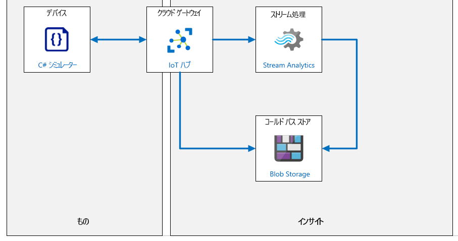

---
lab:
  title: ラボ 07:デバイス メッセージ ルーティング
  module: 'Module 4: Message Processing and Analytics'
ms.openlocfilehash: 2601ddbe100553d88feba68b8210fb2c3b70930d
ms.sourcegitcommit: eec2943250f1cd1ad2c5202ecbb9c37af71e8961
ms.translationtype: HT
ms.contentlocale: ja-JP
ms.lasthandoff: 03/24/2022
ms.locfileid: "140872830"
---
# <a name="device-message-routing"></a>デバイス メッセージ ルーティング

## <a name="lab-scenario"></a>課題シナリオ

Contoso の経営陣は、DPS を使用した自動デバイス登録の実装に感銘を受けています。 彼らは現在、製品の包装と出荷に関連する IoT ベースのソリューションを開発してもらうことに関心を持っています。

チーズの包装と出荷に関連するコストはかなりのものです。 コスト効率を最大化するために、Contoso はオンプレミスのパッケージング施設を運営しています。 ワークフローは単純です。チーズをカットしてパッケージ化し、パッケージを輸送用コンテナに組み立て、コンテナーを目的地に関連付けられた特定のビンに配送します。 コンベア ベルト システムは、このプロセスを通じて製品を移動するために使用されます。 成功の指標は、所定の時間内 (通常は勤務シフト) にコンベア ベルト システムから出発するパッケージの数です。

コンベア ベルト システムは、このプロセスの重要なリンクであり、ワークフローが最大の効率で進行していることを確認するために視覚的に監視されます。 システムには、停止、低速、高速という 3 つのオペレータ制御速度があります。 当然、低速で配送される荷物の数は、より高速よりも少なくなります。 しかし、考慮すべき他の多くの要因があります。

* コンベア ベルト システムの振動レベルは、低速でははるかに低くなります
* 振動レベルが高いと、パッケージがコンベアから落下する可能性があります
* 高い振動レベルは、システムの摩耗を加速することが知られています
* 振動レベルがしきい値制限を超えた場合、検査を可能にするためにコンベア ベルトを停止する必要があります (より深刻な障害を回避するため)

自動化された IoT ソリューションは、スループットを最大化するだけでなく、振動レベルに基づいた予防保守の形式を実装します。これは、深刻なシステム損傷が発生する前に早期の警告サインを検出するために使用されます。

> **注**:**予防保全** (予測メンテナンスとも呼ばれる) は、機器が正常に動作している間に実行されるメンテナンス活動をスケジュールする設備メンテナンスプログラムです。 このアプローチの目的は、多くの場合コストのかかる混乱が発生する、予期しない故障を回避することです。

オペレーターが異常な振動レベルを視覚的に検出することは必ずしも容易ではありません。 このため、振動レベルとデータ異常のメジャーに役立つ Azure IoT ソリューションを検討しています。 振動センサーは、さまざまな場所でコンベア ベルトに取り付けられ、IoT デバイスを使用して IoT Hub にテレメトリを送信します。 IoT Hub は、Azure Stream Analytics と組み込みの機械学習 (ML) モデルを使用して、リアルタイムで振動異常を警告します。 また、将来的に社内の機械学習モデルを開発できるように、すべてのテレメトリ データをアーカイブすることも計画しています。

単一の IoT デバイスからシミュレートしたテレメトリを使用して、ソリューションのプロトタイプを作成することを決定します。

振動データを現実的な方法でシミュレートするには、運用のエンジニアと協力して、振動の原因について少しなりとも理解しておきます。 全体の振動レベルに寄与する振動の種類が、さまざまに多いことが判明しました。 たとえば、ガイド ホイールが壊れたり、特に重い負荷が不適切にコンベア ベルトにかかったりすると、"力振動" が発生する可能性があります。 また、システム設計の限界 (速度や重量など) を超えたときに導入できる "増加する振動" もあります。 エンジニアリング チームは、振動データ (異常を含む) の許容可能な表現を生成するシミュレートされた IoT デバイスのコードの開発を支援することに同意します。

次のリソースが作成されます。



## <a name="in-this-lab"></a>このラボでは

このラボでは、ラボの前提条件を確認することから始め、必要に応じてスクリプトを実行して、Azure サブスクリプションに必要なリソースが含まれていることを確認します。 次に、振動テレメトリを IoT Hub に送信するシミュレートされたデバイスを作成します。 シミュレートされたデータが IoT Hub に到着したら、データのアーカイブに使用できる IoT Hub メッセージ ルートと Azure Stream Analytics ジョブを実装します。 ラボには、次の演習が含まれます。

* ラボの前提条件を構成する (必要な Azure リソース)
* 振動テレメトリを生成するコードを記述する
* Azure BLOB ストレージにメッセージ ルートを作成する
* ログ ルート Azure Stream Analytics ジョブ

## <a name="lab-instructions"></a>ラボの手順

### <a name="exercise-1-configure-lab-prerequisites"></a>演習 1:ラボの前提条件を構成する

このラボでは、次の Azure リソースが使用可能であることを前提としています。

| リソースの種類 | リソース名 |
| :-- | :-- |
| リソース グループ | rg-az220 |
| IoT Hub | iot-az220-training-{your-id} |
| デバイス ID | sensor-v-3000 |

これらのリソースを確実に使用できるようにするには、次の手順に従います。

1. 仮想マシン環境で Microsoft Edge ブラウザー ウィンドウを開き、次の Web アドレスに移動します。
 
    +++https://portal.azure.com/#create/Microsoft.Template/uri/https%3A%2F%2Fraw.githubusercontent.com%2FMicrosoftLearning%2FAZ-220-Microsoft-Azure-IoT-Developer%2Fmaster%2FAllfiles%2FARM%2Flab07.json+++

    > **注**:緑色の "T" 記号 (例: +++このテキストを入力+++) が表示されているときはいつでも、関連付けられているテキストをクリックすると、仮想マシン環境内の現在のフィールドに情報が入力されます。

1. Azure portal にログインするように求められた場合は、このコースで使用している Azure 資格情報を入力します。

    **[カスタム デプロイ]** ページが表示されます。

1. **[プロジェクトの詳細]** の **[サブスクリプション]** ドロップダウンで、このコースで使用する [Azure サブスクリプション] が選択されていることを確認します。

1. **[リソース グループ]** ドロップダウンで、 **[rg-az220]** を選択します。

    > **注**:**rg-az220** がリストにない場合:
    >
    > 1. **[リソース グループ]** ドロップダウンで、 **[新規作成]** をクリックします。
    > 1. **[名前]** に「**rg-az220**」と入力します。
    > 1. **[OK]** をクリックします。

1. **[インスタンスの詳細]** の **[リージョン]** ドロップダウンで、最も近いリージョンを選択します。

    > **注**:**rg-az220** グループが既に存在する場合、 **[リージョン]** フィールドは、リソース グループで使用されるリージョンに設定され、読み取り専用になります。

1. **[Your ID]\(ユーザー ID\)** フィールドに、演習 1 で作成した一意の ID を入力します。

1. **[コース ID]** フィールドに、「**az220**」と入力します。

1. テンプレートを検証するには、 **[確認および作成]** をクリックします。

1. 検証に成功したら、 **[作成]** をクリックします。

    デプロイが開始されます。

1. デプロイが完了した後、テンプレートの出力値を確認するには、左側のナビゲーション領域で **[出力]** をクリックします。

    後で使用するために出力をメモしておきます。

    * connectionString
    * deviceConnectionString

これで、リソースが作成されました。

### <a name="exercise-2-write-code-to-generate-vibration-telemetry"></a>演習 2:振動テレメトリを生成するコードを記述する

Contoso のコンベア ベルト システムの監視を自動化し、予知保全を可能にするには、長期データ分析とリアルタイムデータ分析の両方が必要です。 履歴データが存在しないため、最初のステップは、振動データとデータ異常を現実的な方法で模倣するシミュレーション データを生成することです。 Contoso のエンジニアは、時間の経過に伴う振動をシミュレートするアルゴリズムを開発し、実装するコード クラス内にアルゴリズムを組み込みました。 エンジニアは、アルゴリズムの調整に必要な将来の更新をサポートすることに同意しました。

最初のプロトタイプ段階では、テレメトリ データを生成する単一の IoT デバイスを実装します。 振動データに加えて、デバイスは Blob Storage に送信されるいくつかの追加の値 (配信されたパッケージ、周囲温度、および同様のメトリック) を作成します。 この追加データは、予知保全のための機械学習モジュールの開発に使用されるデータをシミュレートします。

この演習では、以下のことを行います。

* シミュレートされたデバイス プロジェクトをロードする
* シミュレートされたデバイスの接続文字列を更新し、プロジェクトコードを確認する
* シミュレートされたデバイス接続とテレメトリ通信をテストする
* テレメトリが IoT Hub に到達していることを確認する

#### <a name="task-1-open-your-simulated-device-project"></a>タスク 1:シミュレートされたデバイス プロジェクトを開く

1. **Visual Studio Code** を開きます。

1. **[ファイル]** メニューで、 **[フォルダーを開く]** をクリックします。

1. **[フォルダーを開く]** ダイアログで、 **[07-デバイス メッセージ ルーティング]** フォルダーに移動します。

    _[ラボ 3: 開発環境の設定]_ では、ZIP ファイルをダウンロードして内容をローカル環境に抽出することで、ラボ リソースを含む GitHub リポジトリをクローンしました。 抽出されたフォルダー構造には、次のフォルダー パスが含まれます。

    * すべてのファイル
        * ラボ
            * 07-デバイス メッセージ ルーティング
                * スターター
                    * VibrationDevice

1. ラボ 7 の **スターター** フォルダーに移動します。

1. **[VibrationDevice]** をクリックし、 **[フォルダーの選択]** をクリックします。

    Visual Studio Code のエクスプローラー ウィンドウに次のファイルが一覧表示されます。

    * Program.cs
    * VibrationDevice.csproj

    > **注**:必要なアセットをロードするように求められた場合は、今すぐロードできます。

1. **[エクスプローラー]** ペインで、 **[Program.cs]** をクリックします。

    ざっと見ると、**VibrationDevice** アプリケーションが前のラボで使用されていたものと非常に似ていることがわかります。 このバージョンのアプリケーションは、対称キー認証を使用し、テレメトリとログ メッセージの両方を IoT Hub に送信し、より複雑なセンサー実装を備えています。

1. **[ターミナル]** メニューで、**[新しいターミナル]** をクリックします。

    コマンドプロンプトの一部として示されているディレクトリ パスを調べて、正しい場所にいることを確認します。 以前のラボ プロジェクトのフォルダー構造内で、このプロジェクトのビルドを開始したくありません。

1. ターミナル コマンド プロンプトで、アプリケーションがエラーなしでビルドされることを確認するには、次のコマンドを入力します。

    ```cmd
    dotnet build
    ```

    次のように出力されます。

    ```text
    ❯ dotnet build
    Microsoft (R) Build Engine version 16.5.0+d4cbfca49 for .NET Core
    Copyright (C) Microsoft Corporation. All rights reserved.

    Restore completed in 39.27 ms for D:\Az220-Code\AllFiles\Labs\07-Device Message Routing\Starter\VibrationDevice\VibrationDevice.csproj.
    VibrationDevice -> D:\Az220-Code\AllFiles\Labs\07-Device Message Routing\Starter\VibrationDevice\bin\Debug\netcoreapp3.1\VibrationDevice.dll

    Build succeeded.
        0 Warning(s)
        0 Error(s)

    Time Elapsed 00:00:01.16
    ```

次のタスクでは、接続文字列を構成し、アプリケーションを確認します。

#### <a name="task-2-configure-connection-and-review-code"></a>タスク 2:接続とレビュー コードを構成する

このタスクで構築するシミュレートされたデバイス アプリは、コンベア ベルトを監視している IoT デバイスをシミュレートします。 アプリは、センサー信号をシミュレートして 2 秒ごとに振動センサー データを報告します。

1. **Program.cs** ファイルが Visual Studio Code で開かれていることを確認します。

1. **Program** クラスの先頭近くにある `deviceConnectionString` 変数宣言を見つけます。

    ```csharp
    private readonly static string deviceConnectionString = "<your device connection string>";
    ```

1. `<your device connection string>` を、前に保存したデバイス接続文字列に置き換えます。

    > **注**:これは、このコードに対して行う必要がある唯一の変更です。

1. **[ファイル]** メニューの **[保存]** をクリックします。

1. 必要に応じて、少し時間を取ってコードを確認します。

#### <a name="task-3-test-your-code-to-send-telemetry"></a>タスク 3:テレメトリを送信するためのコードをテストする

1. ターミナル コマンド プロンプトで、アプリを実行するには、次のコマンドを入力します。

    ```bash
    dotnet run
    ```

   このコマンドにより、現在のフォルダーにある **Program.cs** ファイルが実行されます。

1. 次のようなコンソール出力が表示されます。

    ```text
    Vibration sensor device app.

    Telemetry data: {"vibration":0.0}
    Telemetry sent 10:29 AM
    Log data: {"vibration":0.0,"packages":0,"speed":"stopped","temp":60.22}
    Log data sent

    Telemetry data: {"vibration":0.0}
    Telemetry sent 10:29 AM
    Log data: {"vibration":0.0,"packages":0,"speed":"stopped","temp":59.78}
    Log data sent
    ```

    > **注**:ターミナルウィンドウでは、緑色のテキストは正常に機能していることを示し、赤色のテキストは問題が発生している場合に使用されます。 エラー メッセージが表示された場合は、まずデバイスの接続文字列を確認します。

1. 次のタスクのために、このアプリを実行したままにします。

    次のタスクに進めない場合は、ターミナルウィンドウで **Ctrl-C** を入力してアプリを停止できます。 `dotnet run` コマンドを使用すれば、後で再起動できます。

#### <a name="task-4-verify-the-iot-hub-is-receiving-telemetry"></a>タスク 4:IoT Hub がテレメトリを受信していることを確認する

このタスクでは、Azure portal を使用して、IoT Hub がテレメトリを受信していることを確認します。

1. [Azure Portal](https://portal.azure.com) を開きます。

1. リソースのタイルで、**iot-az220-training-{your-id}** をクリックします

1. **[概要]** ウィンドウで、下にスクロールしてメトリック タイルを表示します。

1. **[最後のデータを表示]** に隣接した時間の範囲を 1 時間に変更します。

    **[デバイスからクラウドへのメッセージ]** タイルでは、いくつかの現在のアクティビティがプロットされている必要があります。 アクティビティが表示されない場合は、ある程度の待機時間が発生しているため、しばらく待ちます。

    デバイスでテレメトリが送信され、ハブでそれが受信されたら、次の手順では、メッセージを適切なエンドポイントにルーティングします。

### <a name="exercise-3-create-a-message-route-to-azure-blob-storage"></a>演習 3:Azure BLOB ストレージにメッセージ ルートを作成する

IoT ソリューションでは、データの種類に応じて、またはビジネス上の理由から、受信メッセージ データを複数のエンドポイントの場所に送信する必要があることがよくあります。 Azure IoT Hub は、ソリューションに必要な場所に受信データを送信できるようにする _メッセージ ルーティング_ 機能を提供します。

Microsoft システムのアーキテクチャでは、データをアーカイブする保管場所と、より迅速な分析用の場所となる 2 つの目的地にデータが送信される必要があります。

Contoso の振動監視シナリオでは、次の 2 つのメッセージ ルートを作成する必要があります。

* 最初のルートは、データ アーカイブ用の Azure Blob Storage の場所になります
* 2 番目のルートは、リアルタイム分析のための Azure Stream Analytics ジョブへのルートです

メッセージ ルートは一度に 1 つずつ構築およびテストするのが最善であるため、この演習ではストレージ ルートに焦点を当てます。 このルートを "ログ" ルートと呼び、Azure リソースの作成について少しずつ掘り下げます。

メッセージ ルーティングの重要な機能の 1 つは、エンドポイントにルーティングする前に着信データをフィルター処理する機能です。 SQL クエリとして記述されたフィルターでは、特定の条件が満たされた場合にのみ、ルートをたどって出力をストリーミングします。

データをフィルター処理する最も簡単な方法の 1 つは、メッセージのプロパティを評価することです。 前の演習でデバイス メッセージにメッセージ プロパティを追加したことを思い出してください。 追加したコードは次のようになりました。

```csharp
...
telemetryMessage.Properties.Add("sensorID", "VSTel");
...
loggingMessage.Properties.Add("sensorID", "VSLog");
```

ルートの基準として `sensorID` を使用する SQL クエリをメッセージ ルートに埋め込むことができるようになりました。 この場合、`sensorID` に割り当てられた値が `VSLog` (振動センサー ログ) の場合、メッセージはストレージ アーカイブを対象としています。

この演習では、ログ記録ルートを作成してテストします。

#### <a name="task-1-define-the-message-routing-endpoint"></a>タスク 1:メッセージ ルーティング エンドポイントを定義する

1. [Azure portal](https://portal.azure.com/) で、IoT Hub が開いていることを確認してください。

1. 左側のメニューの **[Hub の設定]** の下にある **[メッセージ ルーティング]** をクリックします。

1. **[メッセージ ルーティング]** ウィンドウで、 **[ルート]** タブが選択されていることを確認します。

1. 新しいルートを追加するには、 **[+ 追加]** をクリックします。

    **[ルートの追加]** ブレードが表示されます。

1. **[ルートの追加]** ブレードの **[名前]** に「**vibrationLoggingRoute**」と入力します

1. **[エンドポイント]** の右側の **[+ エンドポイントの追加]** をクリックし、ドロップダウン リストで **[ストレージ]** をクリックします。

    **[ストレージ エンドポイントの追加]** ブレードが表示されます。

1. **[ストレージ エンドポイントの追加]** ブレードの **[エンドポイント名]** で、「**vibrationLogEndpoint**」と入力します。

1. サブスクリプションに関連付けられているストレージ アカウントのリストを表示するには、 **[コンテナーの選択]** をクリックします。

    Azure サブスクリプションに既に存在するストレージ アカウントの一覧が表示されます。 この時点で既存のストレージ アカウントとコンテナーを選択できますが、このラボでは新しいストレージ アカウントとコンテナーを作成します。

1. ストレージ アカウントの作成を開始するには、 **[+ ストレージ アカウント]** をクリックします。

    **[ストレージ アカウントの作成]** ブレードが表示されます。

1. **[ストレージ アカウントの作成]** ブレードで、**[名前]** の下に「**vibrationstore{your-id}**」と入力します。

    例: **vibrationstorecah191211**

    > **注**:このフィールドには、小文字と数字のみを含めることができ、3 ~ 24 文字で、一意である必要があります。

1. **[アカウントの種類]** ドロップダウンで、 **[StorageV2(汎用 v2)]** をクリックします。

1. **[パフォーマンス]** で **[標準]** が選択されていることを確認します。

    これにより、全体的なパフォーマンスを犠牲にして、コストを抑えることができます。

1. **[レプリケーション]** で、 **[ローカル冗長ストレージ (LRS)]** が選択されていることを確認します。

    これにより、ディザスター リカバリーのリスク軽減を犠牲にして、コストを抑えることができます。 運用環境では、ソリューションにはより堅牢なレプリケーション戦略が必要になる場合があります。

1. **[場所]** で、このコースの演習で使用している地域を選択します。

1. **[TLS の最小バージョン]** で **[バージョン 1.2]** が選択されていることを確認します。

1. ストレージ アカウント エンドポイントを作成するには、 **[OK]** をクリックします。

1. 要求が検証され、ストレージ アカウントのデプロイが完了するまで待ちます。

    検証と作成には 1 分から 2 分かかることがあります。

    完了すると、 **[ストレージ アカウントの作成]** ブレードが閉じ、 **[ストレージ アカウント]** ブレードが表示されます。 作成したストレージ アカウントを表示するように、[ストレージ アカウント] ブレードが自動更新されている必要があります。

#### <a name="task-2-define-the-storage-account-container"></a>タスク 2:ストレージ アカウント コンテナーを定義する

1. **[ストレージ アカウント]** ブレードで **[vibrationstore{your-id}]** をクリックします。

    **[コンテナー]** ブレードが表示されます。 これは新しいストレージ アカウントであるため、一覧表示するコンテナーはありません。

1. コンテナーを作成するには、 **[+ コンテナー]** をクリックします。

    **[新しいコンテナー]** ダイアログが表示されます。

1. **[新しいコンテナー]** ダイアログで、**[名前]** に「**vibrationcontainer**」と入力します

   この場合も、小文字と数字のみが受け入れられます。

1. **[パブリック アクセス レベル]** で **[プライベート (匿名アクセスなし)]** が選択されていることを確認します。

1. コンテナーを作成するには、 **[作成]** をクリックします。

    しばらくすると、コンテナーの **[リース状態]** が更新され、**[利用可能]** と表示されます。

1. ソリューションのコンテナーを選択するには、 **[vibrationcontainer]** をクリックし、 **[選択]** をクリックします。

    **[ストレージ エンドポイントの追加]** ブレードに戻ります。 **Azure Storage コンテナー** が、作成したストレージ アカウントとコンテナーの URL に設定されていることに注意してください。

1. **[バッチの頻度]** フィールドと **[チャンク サイズ ウィンドウ]** フィールドは既定値の **100** のままにします。

1. **[エンコード]** で、2 つのオプションがあり、**AVRO** が選択されていることに注意してください。

    > **注**:既定では、IoT Hub は Avro 形式でコンテンツを書き込み、メッセージ本文プロパティとメッセージ プロパティの両方があります。 Avro 形式は他のエンドポイントでは使用されません。 Avro はデータとメッセージの保存には最適な形式ですが、データのクエリ用途には使うのは容易ではありません。 比較すると、JSON または CSV 形式はデータのクエリがはるかに簡単です。 IoT Hub では、JSON と AVRO でのデータの Blob Storage への書き込みがサポートされるようになりました。

1. **[ファイル名の形式]** フィールドで指定した値を調べてください。

    **[ファイル名の形式]** フィールドは、ストレージ内のファイルにデータを書き込むために使用するパターンを指定します。 ファイルが作成されると、さまざまなトークンが値に置き換えられます。

1. ブレードの下部で、ストレージ エンドポイントを作成するには、 **[作成]** をクリックします。

    検証とその後の作成には少し時間がかかります。 完了したら、 **[ルートの追加]** ブレード戻るはずです。

    **[エンドポイント]** に値が設定されていることに注意してください。
#### <a name="task-3-define-the-routing-query"></a>タスク 3:ルーティング クエリを定義する

1. **[ルートの追加]** ブレードの **[データソース]** で、 **[デバイス テレメトリ メッセージ]** が選択されていることを確認します。

1. **[ルートを有効にする]** で、 **[有効]** が選択されていることを確認します。

1. **[ルーティング クエリ]** の下で、次のクエリに **true** を置き換えます。

    ```sql
    sensorID = 'VSLog'
    ```

    このクエリにより、`sensorID` アプリケーション プロパティが `VSLog` に設定されたメッセージのみがストレージ エンドポイントにルーティングされるようになります。

1. このルートを保存するには、 **[保存]** をクリックします。

    成功メッセージを待ちます。 完了すると、ルートが **[メッセージ ルーティング]** ペインに表示されます。

1. Azure portal ダッシュボードに戻ります。

#### <a name="task-4-verify-data-archival"></a>タスク 4:データ アーカイブを確認する

1. Visual Studio Code で作成したデバイス アプリが、依然として実行されていることを確認します。

    そうでない場合は、`dotnet run` を使用して Visual Studio Code ターミナルで実行します。

1. リソース タイルで、ストレージ アカウント ブレードを開くには、 **[vibrationstore {your-id}]** をクリックします。

    リソース タイルにストレージ アカウントが表示されない場合は、リソース グループ タイルの上部にある **[更新]** ボタンをクリックし、上記の手順に従ってストレージ アカウントを開きます。

1. **[vibrationstore{your-id}]** ブレードの左側のメニューで、 **[Storage Browser (プレビュー)]** をクリックします。

    Storage Explorer を使用して、データがストレージ アカウントに追加されていることを確認できます。

    > **注**:Storage Explorer は現在プレビュー モードであるため、正確な操作モードは変更される可能性があります。

1. **[Storage Explorer (プレビュー)]** ペインで、**BLOB コンテナー** を展開し、 **[vibrationcontainer]** をクリックします。

    データを表示するには、フォルダの階層を下に移動する必要があります。 最初のフォルダーは、IoT Hub にちなんで名付けられます。

    > **注**:データが表示されない場合は、しばらく待ってからもう一度試してください。

1. 右側のペインの **[名前]** で、 **[iot-az220-training-{your-id}]** をダブルクリックし、ダブルクリックして階層に移動します。

    IoT Hub フォルダーの下に、パーティションのフォルダーが表示され、次に年、月、日の数値が表示されます。 最後のフォルダーは、UTC 時間でリストされた時間を表します。 Hour フォルダーには、ログ メッセージ データを含む多数のブロック BLOB が含まれます。

1. タイムスタンプが最も早いデータのブロック BLOB をダブルクリックします。

1. 上部にある **[ダウンロード]** メニューをクリックします。

    **{day_num}.avro** (例: **22.avro**) というファイルが **Downloads** フォルダーにダウンロードされます。

1. ダウンロードしたファイルを **Visual Studio Code** で開き、 **[アイテムを開きますか]** をクリックします。

    データは読みやすい形式ではありませんが、振動メッセージとして認識できるはずです。

1. データを含む **Visual Studio Code** ドキュメントを閉じます。

1. Azure portal のダッシュボードに戻ります。

### <a name="exercise-4-logging-route-azure-stream-analytics-job"></a>演習 4:ログ ルート Azure Stream Analytics ジョブ

この演習では、ロギング メッセージを Blob Storage に出力する Stream Analytics ジョブを作成します。 次に、Azure portal の Storage Explorer を使用して、保存されているデータを表示します。

これにより、ルートに次の設定が含まれていることを確認できます。

* **名前** - vibrationLoggingRoute
* **データ ソース** - DeviceMessages
* **ルーティング クエリ** - sensorID = 'VSLog'
* **エンドポイント** - vibrationLogEndpoint
* **有効** - true

> **注**:このラボでは、奇妙に思えるかもしれませんが、データをストレージにルーティングし、Azure Stream Analytics を使用してデータをストレージにも送信しています。 作成シナリオでは、両方のパスを長期的には使用しません。 代わりに、ここで作成している 2 番目のパスが存在しない可能性があります。 ここでは、ラボ環境でルーティングが期待どおりに機能していることを検証し、Azure Stream Analytics の簡単な実装を示す方法として使用しています。

#### <a name="task-1-create-the-stream-analytics-job"></a>タスク 1:Streaming Analytics ジョブを作成する

1. Azure portal で、 **[+ リソースの作成]** をクリックします。

1. **[新規]** ブレードの **[マーケットプレースの検索]** テキストボックスに「**stream analytics**」と入力し、**[Stream Analytics ジョブ]** をクリックします。

1. **[Stream Analytics ジョブ]** ブレードで、 **[作成]** をクリックします。

    **[新しい Stream Analytics ジョブ]** ウィンドウが表示されます。

1. **[新しい Stream Analytics ジョブ]** ウィンドウの **[名前]** の下に「**vibrationJob**」と入力します。

1. **[サブスクリプション]** で、ラボで使用しているサブスクリプションを選択します。

1. **[リソース グループ]** で **[rg-az220]** を選択します。

1. **[場所]** で、このコースの演習で使用している地域を選択します。

1. **[ホスティング環境]** で、 **[クラウド]** が選択されていることを確認します。

    エッジ ホスティングについては、コースの後半で説明します。

1. **[ストリーミング ユニット]** で、数値を **3** から **1** に減ら します。

    このラボでは 3 ユニットは必要ありません。これによりコストが削減されます。

1. Stream Analytics ジョブを作成するには、 **[作成]** をクリックします。

1. **[デプロイの成功]** メッセージを待ってから、新しいリソースを開きます。

    > **ヒント:** 新しいリソースに移動するためのメッセージが表示されない場合、または任意のタイミングでリソースを見つける必要がある場合は、 **[ホーム]、[すべてのリソース]** の順に選択します。 リソースのリストに表示するのに十分なリソース名を入力してください。

1. お手数ですが、新しい Stream Analytics ジョブを調べてください。

    空のジョブがあり、入力または出力が表示されておらず、スケルトン クエリが存在することに注意してください。 次のステップでは、これらのエントリを設定します。

#### <a name="task-2-create-the-stream-analytics-job-input"></a>タスク 2:Stream Analytics ジョブの入力を作成する

1. 左側のメニューの **[ジョブ トポロジ]** で、 **[入力]** をクリックします。

    **[入力]** ペインが表示されます。

1. **[入力]** ペインで、 **[+ ストリーム入力の追加]** をクリックし、 **[IoT Hub]** をクリックします。

    **[IoT Hub - 新しい入力]** ペインが表示されます。

1. **[IoT Hub - 新しい入力]** ペインの **[入力エイリアス]** に `vibrationInput` と入力します。

1. **[サブスクリプションから IoT Hub を選択]** が選択されていることを確認します。

1. **IoT Hub** で、**iot-az220-training- {your-id}** IoT Hub が選択されていることを確認します。

1. **[サブスクリプション]** で、以前に IoT Hub の作成に使用したサブスクリプションが選択されていることを確認します。

1. **IoT Hub** で、**iot-az220-training- {your-id}** IoT Hub が選択されていることを確認します。

1. **[コンシューマー グループ]** で **$Default** が選択されていることを確認します。

1. **[共有アクセス ポリシー名]** で **iothubowner** が選択されていることを確認します。

    > **注**:**共有アクセス ポリシー キー** は読み取り専用で実装されます。

1. **[エンドポイント]** で、 **[メッセージング]** が選択されていることを確認します。

1. **[パーティション キー]** を空白のままにします。

1. **[イベントのシリアル化形式]** で **[JSON]** が選択されていることを確認します。

1. **[エンコード]** で、 **[UTF-8]** が選択されていることを確認します。

    フィールドの一部を表示させるために、下にスクロールする必要がある場合があります。

1. **[イベントの圧縮タイプ]** で **[なし]** が選択されていることを確認します。

1. 新しい入力を保存するには、 **[保存]** をクリックし、入力が作成されるまで待ちます。

    **入力** リストが更新されて、新しい入力が表示されるはずです。

#### <a name="task-3-create-the-stream-analytics-job-output"></a>タスク 3:Stream Analytics ジョブの出力を作成する

1. 出力を作成するには、左側のメニューの **[ジョブ トポロジ]** で **[出力]** をクリックします。

    **[出力]** ペインが表示されます。

1. **[出力]** ペインで、 **+ 追加]** [をクリックし、] **[Blob storage/ADLS Gen2** をクリックします。

    **[Blob Storage/ADLS Gen2 - 新しい出力]** ペインが表示されます。

1. **[Blob Storage または ADLS Gen2 - 新しい出力]** ペインの **[出力エイリアス]** に `vibrationOutput` と入力します。

1. **[サブスクリプションから Blob Storage/ADLS Gen2 を選択]** が選択されていることを確認します。

1. **[サブスクリプション]** で、このラボで使用しているサブスクリプションを選択します。

1. **[ストレージ アカウント]** で **[vibrationstore{your-id}]** をクリックします。

1. **[コンテナー]** で、 **[既存の使用]** が選択され、ドロップダウン リストから **[vibrationcontainer]** が選択されていることを確認します。

1. **[認証モード]** で **[接続文字列]** を選択します。

    > **[ストレージ アカウント キー]** が表示されていることに **注意** してください。

1. **パス パターン** は空白のままにします。

1. **[日付の形式]** と **[時刻の形式]** は既定値のままにします。

1. **[イベントのシリアル化形式]** で **[JSON]** が選択されていることを確認します。

1. **[形式]** で、 **[線区切り]** が選択されていることを確認します。

1. **[エンコード]** で、 **[UTF-8]** が選択されていることを確認します。

    > **注**:この設定では、各レコードを各行に JSON オブジェクトとして格納し、全体として取得すると、ファイルが無効な JSON レコードになります。 もう 1 つのオプション **[配列]** は、各レコードが配列内の項目である JSON 配列として文書全体がフォーマットされることを保証します。 これにより、ファイル全体を有効な JSON として解析できます。

1. **最小行は** 空白のままにします。

1. **[最大時間]** で、 **[時間]** と **[分]** を空白のままにします。

1. 出力を作成するには、 **[保存]** をクリックし、出力が作成されるのを待ちます。

    **出力** リストが新しい出力で更新されます。

#### <a name="task-4-create-the-stream-analytics-job-query"></a>タスク 4:Stream Analytics ジョブのクエリを作成する

1. クエリを編集するには、左側のメニューの **[ジョブ トポロジ]** で **[クエリ]** をクリックします。

1. クエリ エディター ペインで、既存のクエリを以下のクエリに置き換えます。

    ```sql
    SELECT
        *
    INTO
        vibrationOutput
    FROM
        vibrationInput
    ```

1. エディター ペインの真上にある **[クエリの保存]** をクリックします。

1. 左側のメニューで **[概要]** をクリックします。

#### <a name="task-5-test-the-logging-route"></a>タスク 5:ログ ルートをテストする

次は面白い部分です。 デバイス アプリによって送信されるテレメトリは、ルートに沿って、ストレージ コンテナーに格納されますか?

1. Visual Studio Code で作成したデバイス アプリが、依然として実行されていることを確認します。

    そうでない場合は、`dotnet run` を使用して Visual Studio Code ターミナルで実行します。

1. Stream Analytics ジョブの **[概要]** ウィンドウで、 **[開始]** をクリックします。

1. **[ジョブの開始]** ウィンドウで、 **[ジョブ出力の開始時刻]** を **[現在]** のままにし、 **[開始]** をクリック します。

    ジョブが開始するまでに、すこし時間がかかることがあります。

1. Azure portal メニューで、 **[ダッシュボード]** をクリックします。

1. リソース タイルで、**vibrationstore{your-id}** をクリックします。

    ストレージ アカウントが表示されない場合は、リソース グループ タイルの上部にある **[更新]** ボタンを使用します。

1. ストレージ アカウントの **[概要]** ペインで **[監視]** セクションを選びます。

1. **[主要指標]** で、 **[最後のデータを表示]** の横にある時間の範囲を **[1 時間]** に変更します。

    グラフにアクティビティが表示されるはずです。

1. 左側のメニューで、 **[Storage Browser (プレビュー)]** をクリックします。

    Storage Explorer を使用して、すべてのデータがストレージ アカウントに到達していることを再確認できます。

    > **注**:Storage Explorer は現在プレビュー モードであるため、正確な操作モードは変更される可能性があります。

1. **[Storage Browser (プレビュー)]** の **[BLOB コンテナー]** の下にある **[vibrationcontainer]** をクリックします。

1. データを表示するには、json ファイルを選び、 **[ダウンロード]** をクリックし、 **[ここをクリックしてダウンロード]** をクリックします。

1. ダウンロードしたファイルを **Visual Studio Code** で開き、JSON データを確認します。

    ```json
    {"vibration":-0.025974767991863323,"EventProcessedUtcTime":"2021-10-22T22:03:10.8624609Z","PartitionId":3,"EventEnqueuedUtcTime":"2021-10-22T22:02:09.1180000Z","IoTHub":{"MessageId":null,"CorrelationId":null,"ConnectionDeviceId":"sensor-v-3000","ConnectionDeviceGenerationId":"637705296662649188","EnqueuedTime":"2021-10-22T22:02:08.7900000Z"}}
    {"vibration":-2.6574811793183173,"EventProcessedUtcTime":"2021-10-22T22:03:10.9718423Z","PartitionId":3,"EventEnqueuedUtcTime":"2021-10-22T22:02:11.1030000Z","IoTHub":{"MessageId":null,"CorrelationId":null,"ConnectionDeviceId":"sensor-v-3000","ConnectionDeviceGenerationId":"637705296662649188","EnqueuedTime":"2021-10-22T22:02:11.0720000Z"}}
    {"vibration":3.9654399589335796,"EventProcessedUtcTime":"2021-10-22T22:03:10.9718423Z","PartitionId":3,"EventEnqueuedUtcTime":"2021-10-22T22:02:13.3060000Z","IoTHub":{"MessageId":null,"CorrelationId":null,"ConnectionDeviceId":"sensor-v-3000","ConnectionDeviceGenerationId":"637705296662649188","EnqueuedTime":"2021-10-22T22:02:13.1500000Z"}}
    {"vibration":0.99447803871677132,"EventProcessedUtcTime":"2021-10-22T22:03:10.9718423Z","PartitionId":3,"EventEnqueuedUtcTime":"2021-10-22T22:02:15.2910000Z","IoTHub":{"MessageId":null,"CorrelationId":null,"ConnectionDeviceId":"sensor-v-3000","ConnectionDeviceGenerationId":"637705296662649188","EnqueuedTime":"2021-10-22T22:02:15.2120000Z"}}
    ```

1. データを含む **Visual Studio Code** ドキュメントを閉じます。

1. Azure portal のダッシュボードに戻ります。

1. ダッシュボードに戻ります。

1. リソース タイルで、 **[vibrationJob]** をクリックします。

1. **[vibrationJob]** ブレードで **[停止]** をクリックし、 **[はい]** をクリックします。

    デバイス アプリから、ルートをたどってハブまで、さらにストレージ コンテナーまでアクティビティをトレースしました。 大きな進歩です。 データの視覚化をすばやく確認する場合は、次のモジュールでこのシナリオのストリーム分析を続行します。

1. [Visual Studio Code] ウィンドウに切り替えます。

1. ターミナル コマンド プロンプトで、デバイス シミュレータ アプリを終了するには、**Ctrl-C** キーを押します。

> **重要**:このコースのデータ視覚化モジュールを完了するまで、これらのリソースを削除しないでください。
