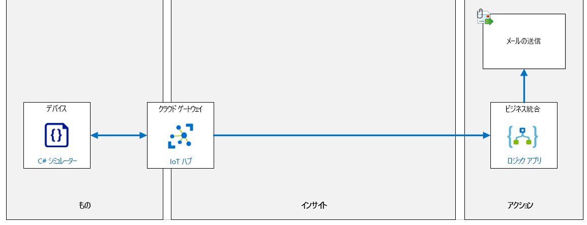
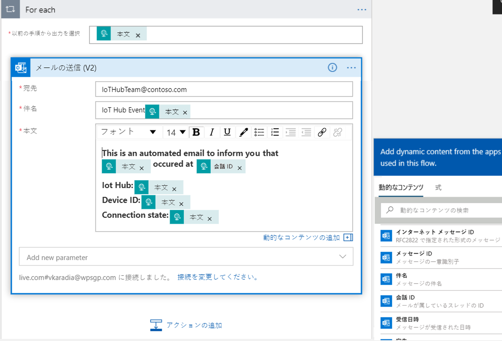
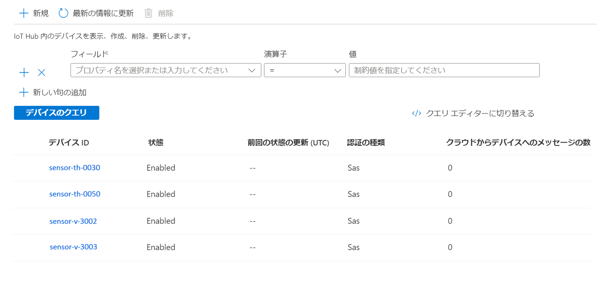

---
lab:
  title: ラボ 09:IoT Hub と Event Grid を統合する
  module: 'Module 5: Insights and Business Integration'
ms.openlocfilehash: 85c57fcbf64a6b20636b0ef289d634ef09e9c292
ms.sourcegitcommit: eec2943250f1cd1ad2c5202ecbb9c37af71e8961
ms.translationtype: HT
ms.contentlocale: ja-JP
ms.lasthandoff: 03/24/2022
ms.locfileid: "140872836"
---
# <a name="integrate-iot-hub-with-event-grid"></a>IoT Hub と Event Grid を統合する

## <a name="lab-scenario"></a>課題シナリオ

Contoso 社の経営陣は、Azure IoT サービスを使用して作成したプロトタイプ ソリューションに感銘を受けており、既に実証した機能に追加の予算を割り当てることに満足しています。 現在、特定の運用サポート機能の統合を検討するよう求めています。 具体的には、特定の作業領域を担当するマネージャーにアラート通知を送信する Azure ツールのサポート方法を確認したいと考えています。 アラートの基準は、ビジネス エリア マネージャーによって定義されます。 IoT Hub で受信するテレメトリ データが評価され、通知が生成されます。

過去に協働して成功を収めたビジネスマネージャーのナンシーを特定しました。 ソリューションの初期段階で、彼女と一緒に作業します。

施設技術者のナンシーのチームには、異なるチーズ洞窟間の温度を監視するために使用される新しく接続されたサーモスタットをインストールする責任があることをナンシーから聞いています。 サーモスタット デバイスは、IoT Hub に接続できる IoT デバイスとして機能します。 プロジェクトを開始するには、新しいデバイスが実装されたときに通知を生成するアラートを作成することに同意します。

アラートを生成するには、IoT Hub で新しいサーモスタット デバイスが作成されたときに、デバイスで作成されたイベントタイプを Event Grid にプッシュします。 このイベントに反応する Logic Apps インスタンスを作成し (Event Grid 上で)、デバイス ID と接続状態を指定して、新しいデバイスが作成された場合に施設に警告をするメールを送信します。

次のリソースが作成されます。



## <a name="in-this-lab"></a>このラボでは

このラボでは、次のタスクを正常に達成します。

* ラボの前提条件を構成する (必要な Azure リソース)
* 電子メールを送信するロジック アプリを作成する
* Azure IoT Hub イベント サブスクリプションの構成
* ロジック アプリをトリガーする新しいデバイスを作成する

### <a name="exercise-1-configure-lab-prerequisites"></a>演習 1:ラボの前提条件を構成する

このラボでは、次の Azure リソースが利用可能であることを前提としています。

| リソースの種類  | リソース名          |
|----------------|------------------------|
| リソース グループ | rg-az220              |
| IoT Hub        | iot-az220-training-{your-id} |

これらのリソースを確実に使用できるようにするには、次の手順に従います。

1. 仮想マシン環境で Microsoft Edge ブラウザー ウィンドウを開き、次の Web アドレスに移動します。
 
    +++https://portal.azure.com/#create/Microsoft.Template/uri/https%3A%2F%2Fraw.githubusercontent.com%2FMicrosoftLearning%2FAZ-220-Microsoft-Azure-IoT-Developer%2Fmaster%2FAllfiles%2FARM%2Flab09.json+++

    > **注**:緑色の "T" 記号 (例: +++このテキストを入力+++) が表示されているときはいつでも、関連付けられているテキストをクリックすると、仮想マシン環境内の現在のフィールドに情報が入力されます。

1. Azure portal にログインするように求められた場合は、このコースで使用している Azure 資格情報を入力します。

    **[カスタム デプロイ]** ページが表示されます。

1. **[プロジェクトの詳細]** の **[サブスクリプション]** ドロップダウンで、このコースで使用する [Azure サブスクリプション] が選択されていることを確認します。

1. **[リソース グループ]** ドロップダウンで、 **[rg-az220]** を選択します。

    > **注**:**rg-az220** がリストにない場合:
    >
    > 1. **[リソース グループ]** ドロップダウンで、 **[新規作成]** をクリックします。
    > 1. **[名前]** に「**rg-az220**」と入力します。
    > 1. **[OK]** をクリックします。

1. **[インスタンスの詳細]** の **[リージョン]** ドロップダウンで、最も近いリージョンを選択します。

    > **注**:**rg-az220** グループが既に存在する場合、 **[リージョン]** フィールドは、リソース グループで使用されるリージョンに設定され、読み取り専用になります。

1. **[Your ID]\(ユーザー ID\)** フィールドに、演習 1 で作成した一意の ID を入力します。

1. **[コース ID]** フィールドに、「**az220**」と入力します。

1. テンプレートを検証するには、 **[確認および作成]** をクリックします。

1. 検証に成功したら、 **[作成]** をクリックします。

    デプロイが開始されます。

1. デプロイが完了した後、テンプレートの出力値を確認するには、左側のナビゲーション領域で **[出力]** をクリックします。

    後で使用するために出力をメモしておきます。

    * connectionString

これで、リソースが作成されました。

>**注**:このラボを成功させるには、**microsoft.eventgrid** リソース プロバイダーの登録が必要になる場合があります。 次のコマンドを実行して確認します。

```bash
az provider show --namespace microsoft.eventgrid -o tsv
```
> 結果に **[登録済み]** と表示された場合、これ以上何も必要ありません。 **NotRegistered** の場合は、次のコマンドを実行して **microsoft.eventgrid** プロバイダーを登録します。

```bash
az provider register --namespace microsoft.eventgrid
```
> これが完了するまで 15 分以上かかる場合があります。 次のメッセージが表示されます。

```bash
Registering is still on-going. You can monitor using 'az provider show -n microsoft.eventgrid'
```

### <a name="exercise-2-create-http-web-hook-logic-app-that-sends-an-email"></a>演習 2:メールを送信する HTTP Web Hook ロジック アプリを作成する

Azure Logic Apps は、企業全体または組織全体でアプリ、データ、システム、サービスを統合する必要がある場合に、タスク、ビジネス プロセス、ワークフローのスケジュール設定、自動化、調整を支援するクラウド サービスです。

この演習では、HTTP Web Hook を介してトリガーされる新しい Azure ロジック アプリを作成し、Outlook.com のメール アドレスを使用してメールを送信します。

#### <a name="task-1-create-a-logic-app-resource-in-the-azure-portal"></a>タスク 1:Azure portal でロジック アプリ リソースを作成する

1. 必要に応じて、 このコースで使用している Azure アカウントの認証情報を使用して [Azure portal](https://portal.azure.com) にログインします。

    複数の Azure アカウントをお持ちの場合は、このコースで使用するサブスクリプションに関連付けられているアカウントを使用してログインしていることを確認してください。

1. Azure portal で、 **[+ リソースの作成]** をクリックします。

1. **[リソースの作成]** ブレードの **[検索サービスとマーケットプレイス]** ボックスで、「**ロジック アプリ**」と入力します

1. 検索結果で **[ロジック アプリ]** をクリックします。

1. **ロジック アプリ** ブレードで、**作成** を選択します。

1. **[基本]** タブの **[プロジェクトの詳細]** で、このコースで使用している **[サブスクリプション]** を選択します。

1. **[リソース グループ]** ドロップダウンの **[既存の選択]** で、 **[rg-az220]** をクリックします。

1. **[インスタンスの詳細]** の **[種類]** で **[消費]** を 選択します。

1. **[名前]** フィールド に「**logic-az220-training-{your-id}** 」と入力します

    例: **logic-az220-training-cp191218**

    Azure ロジック アプリの名前は、IP 接続デバイスからアクセスできるパブリックにアクセス可能なリソースであるため、グローバルに一意である必要があります。

1. **[リージョン]** ドロップダウンで、リソース グループに使用したのと同じ Azure リージョンを選択します。

1. **[Log Analytics を有効にする]** は **[いいえ]** のままにします。

1. **[Review + create]\(レビュー + 作成\)** をクリックします。

1. **[確認と作成]** タブで、**[作成]** をクリックします。

    > **注**:ロジック アプリのデプロイが完了するまでに、1 分から 2 分かかります。

1. Azure portal ダッシュボードに戻ります。

#### <a name="task-2-configure-your-logic-app"></a>タスク 2:ロジック アプリを構成する

1. リソース グループ タイルで、デプロイされたばかりのロジック アプリ リソースへのリンクをクリックします。

    **logic-az220-training-{your-id}** ロジック アプリが表示されない場合は、リソース グループ タイルを更新します。

    > **注**:その **ロジック アプリ** に初めて移動すると、 **[Logic Apps デザイナー]** ペインが表示されます。 このページが自動的に表示されない場合は、 **[ロジック アプリ]** ブレードの **[開発ツール]** セクションの **[ロジック アプリ デザイナー]** をクリックします。

1. **[共通のトリガーで開始]** セクションの **[HTTP 要求を受信したとき]** をクリックします。

    一般的に使用されるトリガーの 1 つを使用して開始すると、ロジック アプリを使い始めるのに便利です。

1. ビジュアル デザイナーが開き、 **[HTTP 要求の受信時]** トリガーが選択されていることに注意してください。

1. **[HTTP 要求の受信時]** トリガーの **[要求本文の JSON スキーマ]** テキスト ボックスで、 **[サンプルのペイロードを使用してスキーマを生成する]** リンクをクリックします。

    > **注**:次の手順では、**DeviceCreated** サンプル イベント スキーマを [要求本文の JSON スキーマ] テキスト ボックスに追加します。 このサンプルは、他のイベント スキーマ サンプルと関連するドキュメントの一部と共に、詳細を知りたい人のために次のリンクで見つけることができます。[IoT Hub の Azure Event Grid イベント スキーマ](https://docs.microsoft.com/en-us/azure/event-grid/event-schema-iot-hub)。

1. コピーと貼り付け操作を使用して、次のサンプル JSON を **[サンプルの JSON ペイロードを入力するか、貼り付けます]** テキスト ボックスに追加し、 **[完了]** をクリックします。

    ```json
    [{
      "id": "56afc886-767b-d359-d59e-0da7877166b2",
      "topic": "/SUBSCRIPTIONS/<subscription ID>/RESOURCEGROUPS/<resource group name>/PROVIDERS/MICROSOFT.DEVICES/IOTHUBS/<hub name>",
      "subject": "devices/LogicAppTestDevice",
      "eventType": "Microsoft.Devices.DeviceCreated",
      "eventTime": "2018-01-02T19:17:44.4383997Z",
      "data": {
        "twin": {
          "deviceId": "LogicAppTestDevice",
          "etag": "AAAAAAAAAAE=",
          "deviceEtag": "null",
          "status": "enabled",
          "statusUpdateTime": "0001-01-01T00:00:00",
          "connectionState": "Disconnected",
          "lastActivityTime": "0001-01-01T00:00:00",
          "cloudToDeviceMessageCount": 0,
          "authenticationType": "sas",
          "x509Thumbprint": {
            "primaryThumbprint": null,
            "secondaryThumbprint": null
          },
          "version": 2,
          "properties": {
            "desired": {
              "$metadata": {
                "$lastUpdated": "2018-01-02T19:17:44.4383997Z"
              },
              "$version": 1
            },
            "reported": {
              "$metadata": {
                "$lastUpdated": "2018-01-02T19:17:44.4383997Z"
              },
              "$version": 1
            }
          }
        },
        "hubName": "egtesthub1",
        "deviceId": "LogicAppTestDevice"
      },
      "dataVersion": "1",
      "metadataVersion": "1"
    }]
    ```

    このサンプル JSON は、作成されたロジック アプリの Web hook エンドポイントに Event Grid から送信される JSON の例です。 このサンプルには、製品利用統計情報のメッセージを送信する IoT デバイスの IoT Hub メッセージ テレメトリのプロパティが含まれています。

1. **[要求本文の JSON スキーマ]** テキスト ボックスに、指定したサンプル JSON に基づいて自動的に生成された JSON スキーマが事前設定されることに注意してください。

1. **[HTTP 要求を受信したとき]** のトリガーの下にある、 **[+ 新しいステップ]** をクリックします。

1. **[アクションの選択]** の下にある [検索] テキスト ボックスに、**Outlook.com** と入力してください。

1. アクション の一覧で、送信 オプションまでスクロール ダウンし、**メールの送信 (V2)** をクリックします。

    > **注**:これらの手順では、**Outlook.com** のメール アドレスを使用して電子メールを送信するようにロジック アプリを構成する方法を説明しています。 別の方法として、Office 365 Outlook または Gmail コネクタを使用して電子メールを送信するようにロジック アプリを構成することもできます。

1. **Outlook.com** コネクタで **[ログイン]** をクリックし、プロンプトに従って既存の Outlook.com アカウントで認証します。

1. **[このアプリに情報へのアクセスを許可する]** を求められたら、 **[はい]** をクリックします。

1. **[メールの送信 (V2)]** アクションの **[宛先]** フィールドで、メール メッセージの送信先のメール アドレスを入力します。

    この演習では、メール通知を受信できるメール アドレスを指定します。 このコネクタに使用する Outlook.com アカウント、またはアクセスしやすい別のメール アカウントを入力できます。

    上記の手順で認証されたOutlook.comアカウントは、メールの送信に使用されます。

1. **[件名]** フィールドに **IoT Hub アラート** と入力します。

1. **[本文**] フィールドに、次のメッセージの内容を入力します。

    ```text
    This is an automated email to inform you that:

    {eventType} occurred at {eventTime}

    IoT Hub: {hubName}
    Device ID: {deviceID}
    Connection state: {connectionState}
    ```

1. 入力したメッセージ本文を確認します。

    中かっこのエントリは動的コンテンツを表すことを意図していることに気付いたかもしれません。 これらのプレースホルダー エントリを実際の動的コンテンツ値に置き換える必要があります。

    > **注**:コネクタの右側に [動的コンテンツツールの追加] が表示されない場合は、**本文** テキスト ボックスのすぐ下にある **[動的コンテンツ の追加]** ハイパーリンクをクリック します。 必要なフィールドが表示されない場合は、動的コンテンツ ペインの **さらに表示** をクリックして、入力したメッセージ本文に含まれるフィールドを含めます。

    次の手順では、各プレースホルダーの値を対応する動的コンテンツ値に置き換えます。

1. 動的コンテンツ プレースホルダーごとに、エントリを削除し、対応する動的コンテンツ フィールドに置き換えます。

    入力データ スキーマは配列用であるため、最初の動的コンテンツ値を追加すると、Logic Apps Designer は、 **[For each]** アクション内で入れ子になるメール アクションを自動的に変更します。 この場合、 **[メールの送信 (V2)]** アクションが折りたたまれます。 メール メッセージを再度開くには、 **[電子メールの送信 (V2)]** をクリックし、メッセージ本文の編集を続けます。

    この手順を完了すると、次のようなメッセージ本文が表示されます。

    

1. デザイナーの上部で、ロジック アプリ ワークフローに対するすべての変更を保存するには、 **[保存]** をクリックします。

1. [_HTTP 要求を受信したとき_] トリガーを展開するには、 **[HTTP 要求を受信したとき]** をクリックします。

1. 表示されている **[HTTP POST URL]** の値をコピーします。

    **HTTP POST URL** は次のようになります。

    ```text
    https://prod-87.eastus.logic.azure.com:443/workflows/b16b5556cbc54c97b063479ed55b2669/triggers/manual/paths/invoke?api-version=2016-10-01&sp=%2Ftriggers%2Fmanual%2Frun&sv=1.0&sig=ZGqYl-R5JKTugLG3GR5Ir1FuM0zIpCrMw4Q2WycJRiM
    ```

    この URL は、HTTPS を介してロジック アプリ トリガーを呼び出すために使用される Web hook エンドポイントです。 **sig** クエリ文字列パラメーターと値に注意してください。 **sig** パラメーターには、Web hook エンドポイントへの要求を認証するために使用される共有アクセス キーが含まれています。

1. 今後の参照用に URL を保存します。

### <a name="exercise-3-configure-azure-iot-hub-event-subscription"></a>演習 3:Azure IoT Hub イベント サブスクリプションを構成する

他のサービスにイベント通知を送信して、ダウンストリームのプロセスをトリガーできるように、Azure IoT Hub は Azure Event Grid と統合します。 Business Applications を構成して IoT Hub イベントをリッスンし、信頼性が高くスケーラブルで安全な方法で重要なイベントに対応できるようにします。  たとえば、新しい IoT デバイスが IoT Hub に登録されるたびに、データベースの更新、作業チケットの作成、メール通知の配信などを実行するよう、アプリケーションを構築します。

この演習では、Azure IoT Hub 内にイベント サブスクリプションを作成して、アラート メールを送信するロジック アプリをトリガーする Event Grid 統合を設定します。

1. Azure portal ダッシュボードに戻ります。

1. リソース グループ タイルで、IoT Hub に移動するには、 **[iot-az220-training-{your-id}]** をクリックします。

1. **[IoT Hub]** ブレードの左側のナビゲーション メニューで、 **[イベント]** をクリックします。

1. **[イベント]** ペインの上部にある、 **[+ イベント サブスクリプション]** をクリックします。

1. [イベント サブスクリプションの作成] ブレードの **[名前]** フィールドに、 **[MyDeviceCreateEvent]** と入力します。

1. **EventSchema** フィールドが **Event Grid スキーマ** に設定されていることを確認します。

1. **[トピックの詳細]** で、「**mydevicetopic-{your-id}** 」と入力します

1. **[イベントの種類]** で **[イベントの種類のフィルター]** ドロップダウンを開き、 **[作成されたデバイス]** 以外のすべての選択肢を選択解除します。

1. **[エンドポイントの詳細]** で **[エンドポイントの種類]** ドロップダウンを開き、 **[ウェブフック]** をクリックします。

1. **[エンドポイントの詳細]** で **[エンドポイントの選択]** をクリックします。

1. **[Web hook の選択]** ペインの **[サブスクライバー エンドポイント]** で、ロジックアプリからコピーした URL を貼り付け、 **[選択の確認]** をクリックします。

    > **重要**: [作成] をクリックしないでください。

    以上でイベント サブスクリプションを保存すると、IoT hub でデバイスが作成されるたびに通知を受け取るようになります。 ただし、このラボでは、オプションのフィールドを使用して特定のデバイスをフィルター処理します。

1. ペインの上部にある **[フィルター]** をクリックします。

    特定のデバイスをフィルター処理するためにフィルターを使用します。

1. **[フィルターの詳細設定]** で **[新しいフィルターの追加]** をクリックし、フィールドに次の値を入力します。

    * **キー**: 「`Subject`」と入力します

    * **演算子**: [`String begins with`] を選択します

    * **値**: 「`devices/sensor-th`」と入力します

    この値を使用して、チーズ セラーの温度および湿度センサーに関連付けられたデバイス イベントをフィルター処理します。

1. イベント サブスクリプションを保存するには、 **[作成]** をクリックします。

### <a name="exercise-4-test-your-logic-app-with-new-devices"></a>演習 4:新しいデバイスでロジック アプリをテストする

新しいデバイスを作成してイベント通知の電子メールをトリガーすることで、ロジック アプリをテストします。

1. Azure potral で、必要に応じて IoT Hub ブレードに移動します。

1. 左側のナビゲーション メニューの **[デバイス管理]** で、 **[デバイス]** をクリックします。

1. IoT デバイス ブレードの上部にある **+ 新規** をクリックします。

1. **[デバイス ID]** フィールドに、「**sensor-th-0050**」と入力します

1. その他の設定は既定のままにして、 **[保存]** をクリックします。

1. イベント サブスクリプション フィルターをテストするには、次のデバイス ID を使用して追加のデバイスを作成します。

    * `sensor-v-3002`
    * `sensor-th-0030`
    * `sensor-v-3003`

    合計 4 つの例を追加した場合、IoT デバイスの一覧は次の図のようになります。

    

1. IoT Hub にデバイスをいくつか追加した後、ロジック アプリをトリガーしたものをメールで確認します。
