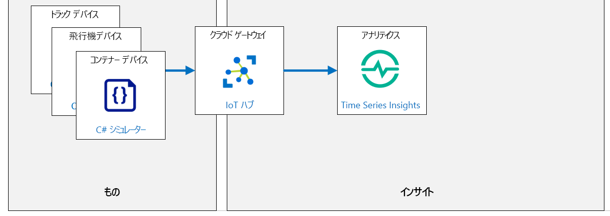

---
lab:
  title: ラボ 10:Time Series Insights を使用したタイムスタンプ付きデータの探索と分析
  module: 'Module 5: Insights and Business Integration'
ms.openlocfilehash: fd17b8e705bbd280adb47873c2d862da7ed66be3
ms.sourcegitcommit: d1db4018f68e024ddb742eea332060a9892e5962
ms.translationtype: HT
ms.contentlocale: ja-JP
ms.lasthandoff: 05/30/2022
ms.locfileid: "145942963"
---
# <a name="explore-and-analyze-time-stamped-data-with-time-series-insights"></a>Time Series Insights を使用したタイムスタンプ付きデータの探索と分析

## <a name="lab-scenario"></a>課題シナリオ

Azure IoT サービスとツールを実装する努力が実を結びました。 Contoso は、出荷時にチーズ容器の環境条件を監視する "資産条件トラッキング システム" を展開しました。

新しいシステムを発売してから 2 週間後、特定の出荷に対する輸送中の温度スパイクが明らかになりました。 出荷中のチーズの一部は台無しになりましたが、新しいシステムは影響を受けたチーズが顧客に届けられなかったことを確認しました。 監視システムの Azure IoT 側を誰よりもよく知っているので、調査を主導します。

経営陣は、将来的に製品の損失を防ぐところまで、システムを改善できるかどうかを判断するようお願いしています。 出荷時に使用したトラックや飛行機から取得した IoT デバイスのセンサー データを関連付けます。 トラックの 1 台の温度が車両の特定の箇所で予期せず上昇し、輸送コンテナーの 1 つ (温度と湿度を監視する IoT デバイスを搭載) に熱スパイクを発生させたようです。

あなたのチームは、監視システムをさらに改善するには、ほぼリアルタイムのデータ探索と根本原因分析が必要であると判断します。

Azure IoT ソリューションに Time Series Insights を追加することを提案します。 これにより、Contoso は、トラック、飛行機、コンテナー内の IoT デバイスによって生成される大量の時系列データを迅速に格納、視覚化、クエリを実行し、時間の経過に伴う変化を視覚化できます。

次のリソースが作成されます。



## <a name="in-this-lab"></a>このラボでは

このラボでは、次のタスクを正常に達成します。

* ラボの前提条件を構成する (必要な Azure リソース)
* Azure Time Series Insights (TSI) 環境の作成
* Time Series Insights (TSI) を利用して IoT Hub に接続する
* この演習では、Time Series Insights (TSI) Explorer を使用して時系列データを表示します

## <a name="lab-instructions"></a>ラボの手順

### <a name="exercise-1-configure-lab-prerequisites"></a>演習 1:ラボの前提条件を構成する

このラボでは、次の Azure リソースが利用可能であることを前提としています。

| リソースの種類 | リソース名 |
| :-- | :-- |
| リソース グループ | `rg-az220` |
| IoT Hub | `iot-az220-training-{your-id}` |
| デバイス ID | `sensor-th-truck0001` |
| デバイス ID | `sensor-th-airplane0001` |
| デバイス ID | `sensor-th-container0001` |

これらのリソースを確実に使用できるようにするには、次の手順に従います。

1. 仮想マシン環境で Microsoft Edge ブラウザー ウィンドウを開き、次の Web アドレスに移動します。
 
    +++https://portal.azure.com/#create/Microsoft.Template/uri/https%3A%2F%2Fraw.githubusercontent.com%2FMicrosoftLearning%2FAZ-220-Microsoft-Azure-IoT-Developer%2Fmaster%2FAllfiles%2FARM%2Flab10.json+++

    > **注**:緑色の "T" 記号 (例: +++このテキストを入力+++) が表示されているときはいつでも、関連付けられているテキストをクリックすると、仮想マシン環境内の現在のフィールドに情報が入力されます。

1. Azure portal にログインするように求められた場合は、このコースで使用している Azure 資格情報を入力します。

    **[カスタム デプロイ]** ページが表示されます。

1. **[プロジェクトの詳細]** の **[サブスクリプション]** ドロップダウンで、このコースで使用する [Azure サブスクリプション] が選択されていることを確認します。

1. **[リソース グループ]** ドロップダウンで、 **[rg-az220]** を選択します。

    > **注**:**rg-az220** がリストにない場合:
    >
    > 1. **[リソース グループ]** ドロップダウンで、 **[新規作成]** をクリックします。
    > 1. **[名前]** に「**rg-az220**」と入力します。
    > 1. **[OK]** をクリックします。

1. **[インスタンスの詳細]** の **[リージョン]** ドロップダウンで、最も近いリージョンを選択します。

    > **注**:**rg-az220** グループが既に存在する場合、 **[リージョン]** フィールドは、リソース グループで使用されるリージョンに設定され、読み取り専用になります。

1. **[Your ID]\(ユーザー ID\)** フィールドに、演習 1 で作成した一意の ID を入力します。

1. **[コース ID]** フィールドに、「**az220**」と入力します。

1. テンプレートを検証するには、 **[確認および作成]** をクリックします。

1. 検証に成功したら、 **[作成]** をクリックします。

    デプロイが開始されます。 必要な Azure リソースをデプロイするには数分かかります。

1. Azure リソースの作成中に、テキスト エディター ツールを開きます (メモ帳には、 **[スタート]** メニューの **[アクセサリ]** からアクセスできます)。 

    > **注**:テキスト エディターを使用して、Azure リソースに関連付けられているいくつかの構成値を格納します。

1. テキスト エディターで、次のテキスト ラベルを入力します。

    - connectionString-iothub:

    - deviceID-truck:

    - connectionString-truck:

    - deviceID-airplane:

    - connectionString-airplane:

    - deviceID-container:

    - connectionString-container:

1. Azure portal ウィンドウに戻り、デプロイが完了するまで待ちます。

    デプロイが完了すると、通知が表示されます。

    > **注**:createDevice 操作中にデプロイが失敗する場合は、次の手順のようにしてデバイスを手動で作成します。

1. デプロイが完了した後、テンプレートの出力値を確認するには、左側のナビゲーション領域で **[出力]** をクリックします。

    後で使用するために出力をメモしておきます。

    * connectionString
    * deviceIDs

    > **注**:deviceIDs の出力には、各デバイスの接続文字列の JSON 配列が含まれています。 適切なテキスト エディターを使って、デバイス名と接続文字列を記録します。

    ```json
    [
        {
            "name":"createDevice-sensor-thl-truck0001",
            "connectionString":"HostName=iot-az220-training-dm072321.azure-devices.net;DeviceId=sensor-thl-truck0001;SharedAccessKey=yJV1FfKyVg5SBA5M9L3D3u1DqoiINYDaEuXv3KWHekA="
        },
        {
            "name":"createDevice-sensor-thl-airplane0001",
            "connectionString":"HostName=iot-az220-training-dm072321.azure-devices.net;DeviceId=sensor-thl-airplane0001;SharedAccessKey=GN+aU3P4oDAhLddLuCKKwTYkinGwl828KvGQTZwxYMc="
        },
        {
            "name":"createDevice-sensor-thl-container0001",
            "connectionString":"HostName=iot-az220-training-dm072321.azure-devices.net;DeviceId=sensor-thl-container0001;SharedAccessKey=lNZEp9xMYBYOidaDxHZcH9MWdOrDgyhmmUrZYBIhwXg="
        }
    ]
    ```

    > **重要**:createDevice 操作中にデプロイが失敗した場合、 **[出力]** ペインは空白になります。 次の手順のようにして、必要な IoT デバイスと、IoT ハブとデバイス接続文字列のレコードを作成します。

    1. Azure portal メニューで、 **[ダッシュボード]** をクリックします。

    1. **[すべてのリソース]** タイルで、Azure IoT Hub を開くには、**iot-az220-training-{your-id}** をクリックします。

    1. IoT ハブのウィンドウの **[デバイス管理]** で、 **[デバイス]** をクリックします。

    1. [デバイス] ページで、 **[+ デバイスの追加]** をクリックします。

    1. [デバイスの作成] ページの **[デバイス ID]** に、「**sensor-th-truck0001**」と入力します

        +++sensor-th-truck0001+++

    1. ページの下部にある **[保存]** をクリックします。

    1. 前の 3 つのステップを繰り返し、**sensor-th-airplane0001** および **sensor-th-container0001** というデバイス ID の IoT デバイスを作成します。

        +++sensor-th-airplane0001+++

        +++sensor-th-container0001+++

    1. [デバイス] ページの **[デバイス ID]** で、**sensor-th-truck0001** をクリックします。

        デバイスが一覧にない場合は、[デバイス] ページで **[最新の情報に更新]** をクリックします。

    1. sensor-th-truck0001 ページで、 **[デバイス ID]** の値の右側にある **[コピー]** をクリックした後、値をテキスト エディター ファイルに保存します。

    1. sensor-th-truck0001 ページで、 **[プライマリ接続文字列]** の値をコピーして、テキスト エディター ファイルに保存します。

    1. 前の 3 つのステップを繰り返し、**sensor-th-airplane0001** および **sensor-th-container0001** デバイスのデバイス ID とプライマリ接続文字列の値を記録します。

    1. 自分の IoT ハブのウィンドウに戻ります。

    1. 左側のメニューの **[セキュリティの設定]** で、 **[共有アクセス ポリシー]** をクリックします。

    1. **iothubowner** をクリックします。

    1. IoT ハブのプライマリ接続文字列が一覧に表示されていることに注意してください。

    1. IoT ハブのプライマリ接続文字列の値をコピーし、テキスト エディター ファイルに保存します。

    このラボに必要な Azure リソースを利用できるようになりました。

### <a name="exercise-2-setup-time-series-insights"></a>演習 2:Time Series Insights の設定

Azure Time Series Insights (TSI) は、IoT ソリューションのデータを大規模に収集、処理、保存、分析、クエリするために使用されるエンドツーエンドのサービスとしてのプラットフォーム オファリングです。 TSI は、時系列に対して高度にコンテキスト化および最適化されたデータのアドホック データ探索と運用分析のために設計されています。

この演習では、Azure IoT Hub と Time Series Insights の統合を設定します。

1. Azure portal のメニューを使用してダッシュボードに移動します。

    必要に応じて、Azure アカウントの認証情報を使用して [>portal.azure.com](https://portal.azure.com) にログインします。 複数の Azure アカウントをお持ちの場合は、このコースで使用するサブスクリプションに関連付けられているアカウントを使用してログインしていることを確認してください。

1. Azure portal で、 **[+ リソースの作成]** をクリックします。

1. **[新規]** ウィンドウの **[Marketplace を検索]** テキストボックスに、「**time series insights**」と入力します

1. 検索結果で、 **[Time Series Insights]** をクリックします。

1. **[Time Series Insights]** ブレードで、 **[作成]** をクリックします。

    [Time Series Insights 環境の作成] ページが開くとき、2025 年 3 月以降は Time Series Insights がサポートされないことを示す警告が表示されることがあります。 運用シナリオでは、他のオプションを調べる必要があります。

1. **[サブスクリプション]** ドロップダウンで、このコースに使用するサブスクリプションを選択します。

1. **[リソース グループ]** ドロップダウンで、 **[rg-az220]** をクリックします。

1. **[環境名]** フィールドに、「**tsi-az220-training-{your-id}**」と入力します。

1. **[場所]** のドロップダウンで、リソース グループで使用する Azure リージョンを選択します。

1. **[階層]** フィールドで、 **[Gen1 (S1)]** 価格レベル が選択され、 **[容量]** が **1** に設定されていることを確認します。

1. ブレードの下部にある **[Next: Event Source]\(次へ: イベント ソース\)** をクリックします。

1. **[イベント ソース]** タブで、 **[Create an event source?]\(イベント ソースを作成しますか?\)** が **[はい]** に設定され、その **[ソースの種類]** が **[IoT Hub]** に設定されていることを確認します。

1. **[名前]** フィールドに「**iot-az220-training-{your-id}**」と入力して、このイベント ソースの一意の名前を指定します。

1. **[サブスクリプション]** ドロップダウンで、このコースに使用するサブスクリプションを選択します。

1. **[IoT Hub 名]** ドロップダウンで、既にプロビジョニングされている **Aiot-az220-training-{your-id}** Azure IoT Hub サービスを選択します。

1. **[IoT Hub アクセス ポリシー名]** ドロップダウンで **[iothubowner]** をクリックします。

    運用環境では、Azure IoT Hub 内に新しい _アクセス ポリシー_ を作成し、Time Series Insights (TSI) アクセスの構成に使用することをお勧めします。 これで、同じ Azure IoT Hub に接続されているその他のサービスに関係なく、TSI のセキュリティを管理できます。  便宜上、今回はそれを行いません。

1. **[IoT Hub コンシューマー グループ]** ドロップダウンの右側にある **[新規]** をクリックします。

    これにより、指定する名前を使用して新しいコンシューマー グループを追加できます。

1. **[IoT Hub コンシューマー グループ]** ボックスに **tsievents** と入力し、 **[追加]** をクリックします。

    これにより、このイベント ソースに使用する新しい _コンシューマー グループ_ が追加されます。 コンシューマー グループは、特定のコンシューマー グループから同時に 1 つのアクティブ リーダーしか存在できないので、このイベント ソースを専用に使用する必要があります。

1. **[開始オプション]** セクションの **[開始時刻]** ドロップダウンで、 **[今すぐ始める (既定)]** を選択します。

1. **[タイムスタンプ]** セクションの **[プロパティ名]** は既定値 (空白) のままにします。

1. ブレードの最下部で、 **[Review + create]** をクリックします。

    > **注**:*イベント ソース*  ウィンドウにすぐに戻ってきた場合は、**IoT Hub コンシューマー グループ** フィールドの右側にある **追加** をクリックしたことを再確認します。 コンシューマーグループを作成するまで TSI リソースを作成できません。

1. ブレードの最下部で、 **[Review + create]** をクリックします。

1. [概要] タブが表示されたら、 **[確認および作成]** をクリックし、 **[OK]** をクリックします。

1. Time Series Insights のデプロイが完了したら、ダッシュボードに戻ります。

1. リソース グループ タイルを更新してから、**tsi-az220-training-{your-id}** をクリックします。

    すべてのリソースを表示するには、ダッシュボードのサイズを変更する必要がある場合があります。

    > **注**:**Time Series Insights 環境** リソースに "**tsi-az220-training-{your-id}** " という名前を付けました。 作成した *Time Series Insights イベント ソース* も表示されますが、ここでは TSI 環境を開く必要があります。

1. **[Time Series Insights 環境]** ブレードの左側のメニューで、 **[設定]** の **[イベント ソース]** をクリックします。

1. **[イベント ソース]** ペインで、リスト内の **iot-az220-training-{your-id}** イベント ソースに注目してください。

    これは、TSI リソースが作成されたときに設定されたイベント ソースです。

1. イベント ソースの詳細を確認するには、**iot-az220-training-{your-id}** をクリックします。

    イベント ソースの構成が、Time Series Insights リソースの作成時に設定された設定と一致していることに注意してください。

### <a name="exercise-3-run-simulated-iot-devices"></a>演習 3:シミュレートされた IoT デバイスを実行する

この演習では、シミュレートされたデバイスを実行して、テレメトリ イベントを Azure IoT Hub に送信します。

1. **Visual Studio Code** を開きます。

1. **[ファイル]** メニューで、 **[フォルダーを開く]** をクリックします。

1. **[フォルダーを開く]** ダイアログで、ラボ 10 の Starter フォルダーに移動します。

    「ラボ 3: 開発環境の設定」では、ZIP ファイルをダウンロードして内容をローカル環境に抽出することで、ラボ リソースを含む GitHub リポジトリをクローンしました。 抽出されたフォルダー構造には、次のフォルダー パスが含まれます。

    * すべてのファイル
      * ラボ
          * 10-Time Series Insights でタイムスタンプ付きデータを探索および分析する
            * スターター

1. **[フォルダーを開く]** ダイアログで、 **[ContainerSimulation]** をクリックしてから、 **[フォルダーの選択]** をクリックします。

    メッセージが表示されたら、C# 拡張機能を読み込むか、復元を実行します。

1. エクスプローラー ペインで、Program.cs ファイルを開くには、**Program.cs** をクリックします。

1. 接続文字列の割り当てに使用する変数を見つける

    ```csharp
    private readonly static string connectionStringTruck = "{Your Truck device connection string here}";
    private readonly static string connectionStringAirplane = "{Your Airplane device connection string here}";
    private readonly static string connectionStringContainer = "{Your Container device connection string here}";
    ```

1. 変数の割り当てを、ラボで前に保存した接続文字列で更新します。

    プレースホルダーの値を、対応する IoT デバイスの接続文字列に置き換えてください。

1. **[ファイル]** メニューの **[保存]** をクリックします。

1. **[表示]** メニューの **[ターミナル]** をクリックします。

1. **[ターミナル]** ペインのコマンド プロンプトで、ラボ 10 の `/Starter/ContainerSimulation` ディレクトリへのパスが指定されていることを確認します。

1. コマンド プロンプトで、**ContainerSimulation** アプリをビルドして実行するには 、次のコマンドを入力します。

    ```cmd/sh
    dotnet run
    ```

1. [ターミナル] ペインに表示されるメッセージに注意してください。

    **ContainerSimulation** アプリが実行されると、利用統計情報のターミナルへの出力が開始されます。 これは、Azure IoT Hub に送信する利用統計情報です。

    **ContainerSimulation** アプリが実行されている場合、 **[ターミナル]** 出力は次のようになります。

    ```text
    12/27/2019 8:51:30 PM > Sending TRUCK message: {"temperature":35.15660452608195,"humidity":48.422323938240865}
    12/27/2019 8:51:31 PM > Sending AIRPLANE message: {"temperature":17.126545186374237,"humidity":36.46941012936869}
    12/27/2019 8:51:31 PM > Sending CONTAINER message: {"temperature":21.986403302500637,"humidity":47.847680384455096}
    12/27/2019 8:51:32 PM > Sending TRUCK message: {"temperature":36.10474464823629,"humidity":48.82029906486022}
    12/27/2019 8:51:32 PM > Sending AIRPLANE message: {"temperature":16.55005930170971,"humidity":36.49988437459935}
    12/27/2019 8:51:32 PM > Sending CONTAINER message: {"temperature":21.811727088543286,"humidity":50.0}
    ```

1. このラボの残りの部分では、**ContainerSimulation** アプリを実行したままにします。

    これにより、3 つのデバイス (コンテナー、トラック、および航空機) からのデバイスの製品利用統計情報が Azure IoT Hub に送信されます。

1. **ContainerSimulation** アプリが 30 秒間実行されると、**コンテナー** デバイスが配送方法を変更していることを示すメッセージが表示されます。

    配送方法は **トラック** および **航空機** の間で30秒ごとに変わります。 この場合、 **[ターミナル]** 出力は次のようになります。

    ```text
    12/27/2019 8:51:40 PM > CONTAINER transport changed to: TRUCK
    ```

    > **注**:実稼働では、出荷コンテナーは通常の出荷過程での転送方法のみを変更します。 このラボでシミュレートされたシナリオでは、このラボの手順実行中に収まる十分に短いデータ期間を提供するため、30 秒ごとに実行されます。

### <a name="exercise-4-view-time-series-insights-explorer"></a>演習 4:Time Series Insights Explorer の表示

この演習では、Time Series Insights (TSI) Explorer を使用して時系列データを操作する方法について説明します。

1. 必要に応じて Azure アカウントの認証情報を使用し、[portal.azure.com](https://portal.azure.com) にログインします。

    複数の Azure アカウントをお持ちの場合は、このコースで使用するサブスクリプションに関連付けられているアカウントを使用してログインしていることを確認してください。

1. リソース グループ タイルで、**aztsi-az220-training-{your-id}** をクリックします。

1. **[Time Series Insights 環境]** ブレードの **[概要]** の最上部で、 **[TSI エクスプローラーに移動]** をクリックします。

    これにより、新しいブラウザー タブで **[Time Series Insights Explorer]** が開きます。

    > **注**:"選択したユーザー アカウントはテナント 'Microsoft Services' に存在せず、アプリケーションにアクセスできません" というメッセージが表示される場合は、アプリを開こうとしたときに、Azure サブスクリプション アカウントのユーザー プリンシパル名が Microsoft Graph (Active Directory Graph) によって調整されていない可能性があります。 この問題を回避するには、次のプロセスを使用します。  

    - サブスクリプション アカウントに関連付けられている AAD テナントに新しいユーザーを追加します。

        たとえば、Azure portal から Cloud Shell を開き、次のコマンドを入力します: az ad user create --display-name tsi --password pass123! --user-principal-name tsi@personalaccount.onmicrosoft.com

        サブスクリプション アカウントのユーザー プリンシパル名のテナント部分は、次のコマンドを使って確認できます: az ad signed-in-user show --query "userPrincipalName" -o tsv

    - Azure portal (サブスクリプション アカウントでサインイン) から [アクセス制御 (IAM)] を開き、所有者として新しいユーザーのロールの割り当てを追加します。

    - Azure ダッシュボードから TSI リソースを開き、[データ アクセス ポリシー] を開き、[プリンシパルの選択] を使用して新しいユーザー アカウントを共同作成者として追加します。

    - TSI エクスプローラーを開いたら ([**TSI エクスプローラーに移動]** )、上で作成したユーザーのユーザー名 (サービス プリンシパル名) とパスワードを入力します。

1. 左側のメニューで、 **[分析]** が選択されていることを確認します。

    ナビゲーション メニューを展開すると、ボタン名を表示できます。 [分析] と [モデル] の 2 つのオプションがあります。 [分析] を選択します。

    ナビゲーション メニューを折りたたみ、ページの左側にクエリ編集領域が表示されるようにします。

1. クエリの編集を開始するには、 **[新しいクエリの追加]** をクリックします。

1. クエリ エディターの **[クエリ 1]** で、 **[測定]** ドロップダウンを開き、 **[温度]** をクリックします。

1. **[分割]** ドロップダウンを開き、 **[iothub-connection-device-id]** をクリックします。

    クエリを実行すると、グラフが分割され、各 IoT デバイスからの製品利用統計情報がグラフに個別に表示されます。

1. ページの上部で、表示を自動的に更新するには、 **[自動更新]** をクリックします。

    **[自動更新]** が有効になっている場合、ディスプレイは _30 秒_ ごとに更新され、最新のデータが表示されます。 これは、利用可能なデータの過去 1 時間にのみ適用されます。

1. Azure IoT Hub 内の IoT デバイスの **温度** センサー イベント データが _折れ線グラフ_ に表示される点に注意してください。

1. グラフの左側にある **[デバイス ID]** のリストに注目してください。

    特定のデバイス ID にマウスを合わせると、グラフ表示のデータが強調表示されます。

1. 3 つのシミュレートされたデバイスからシステムにストリーミングされるテレメトリの温度データ (グラフ) を確認します。

1. **sensor-th-container0001** の **温度** のスパイクは、**sensor-th-truck0001** または **sensor-th-airplane0001** の温度スパイクと相関していることに注意してください。

    これにより、sensor-th-container0001 がその時点でトラックまたは飛行機で輸送されていることがわかります。

1. 画面に 2 番目のクエリを追加するには、 **[新しいクエリの追加]** をクリックします。

1. **[クエリ 2]** で、 **[測定]** ドロップダウンを **[湿度]** に設定し、 **[分割]** ドロップダウンを **[iothub-connection-device-id]** に設定し、 **[追加]** をクリックします。

    2 つのグラフが表示されています。 上のグラフは **温度** を示し、下のグラフは **湿度** を示しています。どちらも独自の Y 軸スケールを使用しています。

1. グラフの線の上にマウス ポインタを置きます。

    グラフ上にマウス カーソルを置くと、グラフ上の点の詳細がポップアップに表示されます。 ポップアップには、グラフ内のデータポイントの最小値 (**min**)、平均値 (**avg**)、および最大値 (**max**) が (そのポイントで表される短時間で) 表示されます。 選択したデータ ポイントに関連付けられた時間の範囲が、ディスプレイ下部の時間軸に沿って表示されます。

1. 縦軸の上に、グラフ設定を制御するために使用できるオプションがある点に注目してください。

1. [サイクル間隔] の設定を 15 秒に変更します。

    サイクル間隔を大きくすると、データの外観が変化することに注意してください。

データの探索が完了したら、 ターミナルで **Ctrl+C** キーを押してコンテナー シミュレーター アプリを停止することを忘れないでください。
