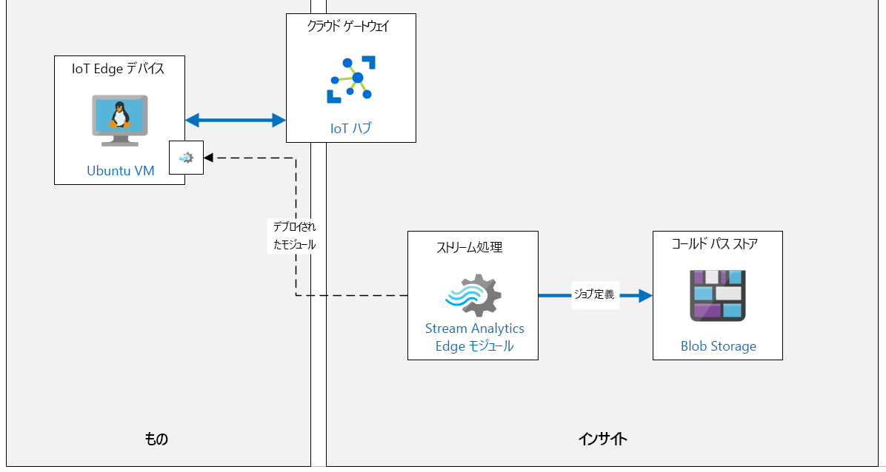

---
lab:
  title: ラボ 11:Azure IoT Edge の概要
  module: 'Module 6: Azure IoT Edge Deployment Process'
ms.openlocfilehash: a223c0aa8abc8c5a16e81d343a0f94a6b9bbdf36
ms.sourcegitcommit: 88ea18cdadb26810b563a54c06ce5e98344bcd92
ms.translationtype: HT
ms.contentlocale: ja-JP
ms.lasthandoff: 03/29/2022
ms.locfileid: "141258553"
---
# <a name="introduction-to-azure-iot-edge"></a>Azure IoT Edge の概要

## <a name="lab-scenario"></a>課題シナリオ

グローバル市場で地元の消費者を奨励するために、Contoso は地元の職人と提携し、世界中の新しい地域でチーズを生産しています。

各地では、地元のチーズを作成するために使用される混合および処理機械が装備されている複数の生産ラインをサポートしています。 現在、施設にはそれぞれの機械に IoT デバイスが接続されています。 これらのデバイスはセンサー データを Azure にストリーミングし、すべてのデータがクラウドで処理されます。

大量のデータが収集され、一部のマシンで即時の時間応答が必要なため、Contoso は IoT Edge ゲートウェイ デバイスを使用して、インテリジェンスの一部を即時処理に使用したいと考えています。 データの一部は引き続きクラウドに送信されます。 また、IoT Edge にデータ インテリジェンスを導入することで、ローカル ネットワークが貧弱な場合でも、データを処理して迅速に対応できるようになります。

Azure IoT Edge ソリューションのプロトタイプ作成を任されました。 まず、温度を監視する IoT Edge デバイス (チーズ加工処理マシンの 1 台に接続されているデバイスをシミュレートします) を設定します。 次に、そのデバイスを使用して平均温度を計算し、プロセス制御値を超えた場合にアラート通知を生成するデバイスに Stream Analytics モジュールをデプロイします。

次のリソースが作成されます。



## <a name="in-this-lab"></a>このラボでは

このラボでは、次のタスクを正常に達成します。

* ラボの前提条件を構成する (必要な Azure リソース)
* Azure IoT Edge 対応の Linux VM をデプロイする
* Azure CLI を使用して IoT Hub で IoT Edge デバイス ID を作成する
* IoT Edge デバイスを IoT Hub に接続する
* Edge デバイスに Edge モジュールを追加する
* Azure Stream Analytics を IoT Edge モジュールとしてデプロイする

## <a name="lab-instructions"></a>ラボの手順

### <a name="exercise-1-configure-lab-prerequisites"></a>演習 1:ラボの前提条件を構成する

このラボでは、次の Azure リソースが使用可能であることを前提としています。

| リソースの種類 | リソース名 |
| :-- | :-- |
| リソース グループ | rg-az220 |
| IoT Hub | iot-az220-training-{your-id} |

これらのリソースを確実に使用できるようにするには、次の手順に従います。

1. 仮想マシン環境で Microsoft Edge ブラウザー ウィンドウを開き、次の Web アドレスに移動します。
 
    +++https://portal.azure.com/#create/Microsoft.Template/uri/https%3A%2F%2Fraw.githubusercontent.com%2FMicrosoftLearning%2FAZ-220-Microsoft-Azure-IoT-Developer%2Fbicep%2FAllfiles%2FARM%2Flab11.json+++

    > **注**:緑色の "T" 記号 (例: +++このテキストを入力+++) が表示されているときはいつでも、関連付けられているテキストをクリックすると、仮想マシン環境内の現在のフィールドに情報が入力されます。

1. Azure portal にログインするように求められた場合は、このコースで使用している Azure 資格情報を入力します。

    **[カスタム デプロイ]** ページが表示されます。

1. **[プロジェクトの詳細]** の **[サブスクリプション]** ドロップダウンで、このコースで使用する [Azure サブスクリプション] が選択されていることを確認します。

1. **[リソース グループ]** ドロップダウンで、 **[rg-az220]** を選択します。

    > **注**:**rg-az220** がリストにない場合:
    >
    > 1. **[リソース グループ]** ドロップダウンで、 **[新規作成]** をクリックします。
    > 1. **[名前]** に「**rg-az220**」と入力します。
    > 1. **[OK]** をクリックします。

1. **[インスタンスの詳細]** の **[リージョン]** ドロップダウンで、最も近いリージョンを選択します。

    > **注**:**rg-az220** グループが既に存在する場合、 **[リージョン]** フィールドは、リソース グループで使用されるリージョンに設定され、読み取り専用になります。

1. **[Your ID]\(ユーザー ID\)** フィールドに、演習 1 で作成した一意の ID を入力します。

1. **[コース ID]** フィールドに、「**az220**」と入力します。

1. テンプレートを検証するには、 **[確認および作成]** をクリックします。

1. 検証に成功したら、 **[作成]** をクリックします。

    デプロイが開始されます。

1. デプロイが完了した後、テンプレートの出力値を確認するには、左側のナビゲーション領域で **[出力]** をクリックします。

    後で使用するために出力をメモしておきます。

    * connectionString

これで、リソースが作成されました。

### <a name="exercise-2-create-and-configure-an-iot-edge-vm"></a>演習 2:IoT Edge VM を作成および構成する

この演習では、IoT Edge デバイス ID を作成し、デバイスの接続文字列を使って IoT Edge ランタイムを構成します。

#### <a name="task-1-create-an-iot-edge-device-identity-in-iot-hub-using-azure-cli"></a>タスク 1:Azure CLI を使用して IoT Hub で IoT Edge デバイス ID を作成する

このタスクでは、Azure CLI を使用して、Azure IoT Hub 内に新しい IoT Edge デバイス ID を作成します。

1. 必要な場合は、お使いの Azure アカウントの資格情報を使用して Azure portal にログインします。

    複数の Azure アカウントをお持ちの場合は、このコースで使用するサブスクリプションに関連付けられているアカウントを使用してログインしていることを確認してください。

1. Azure portal のツール バーで、Azure Cloud Shell を開き、 **[Cloud Shell]** をクリックします。

    左側のナビゲーション メニューではなく、Azure portal のツール バー上にある Cloud Shell ボタンには、コマンド プロンプトと似たようなアイコンがあります。

1. **Bash** 環境オプションを使用していることを確認します。

    Cloud Shell の左上隅の環境ドロップダウンで、Bash を選択する必要があります。

1. コマンド プロンプトで、IoT Hub に IoT Edge デバイス ID を作成するには、次のコマンドを入力します。

    ```bash
    az iot hub device-identity create --hub-name iot-az220-training-{your-id} --device-id sensor-th-0067 --edge-enabled
    ```

    `{your-id}` プレースホルダーを、このコースの開始時に作成した YOU-ID 値に必ず置き換えてください。

    > **注**:Azure portal で IoT Hub を使用して、この IoT Edge デバイスを作成することもできます。 **[IoT Hub]**  ->  **[IoT Edge]**  ->  **[IoT Edge デバイスの追加]** 。

1. コマンドで作成された出力をレビューします。

    出力には、IoT Edge デバイス用に作成された **デバイス ID** に関する情報が含まれています。 たとえば、自動生成されたキーを使用した `symmetricKey` 認証が既定として設定されており、`iotEdge` 機能が、指定された `--edge-enabled` パラメーターで示されるとおり `true` に設定されてることを確認できます。

    ```json
    {
        "authentication": {
            "symmetricKey": {
                "primaryKey": "jftBfeefPsXgrd87UcotVKJ88kBl5Zjk1oWmMwwxlME=",
                "secondaryKey": "vbegAag/mTJReQjNvuEM9HEe1zpGPnGI2j6DJ7nECxo="
            },
            "type": "sas",
            "x509Thumbprint": {
                "primaryThumbprint": null,
                "secondaryThumbprint": null
            }
        },
        "capabilities": {
            "iotEdge": true
        },
        "cloudToDeviceMessageCount": 0,
        "connectionState": "Disconnected",
        "connectionStateUpdatedTime": "0001-01-01T00:00:00",
        "deviceId": "sensor-th-0067",
        "deviceScope": "ms-azure-iot-edge://sensor-th-0067-637093398936580016",
        "etag": "OTg0MjI1NzE1",
        "generationId": "637093398936580016",
        "lastActivityTime": "0001-01-01T00:00:00",
        "status": "enabled",
        "statusReason": null,
        "statusUpdatedTime": "0001-01-01T00:00:00"
    }
    ```

1. IoT Edge デバイスの **接続文字列** を表示するには、次のコマンドを入力します。

    ```bash
    az iot hub device-identity connection-string show --device-id sensor-th-0067 --hub-name iot-az220-training-{your-id}
    ```

    `{your-id}` プレースホルダーを、このコースの開始時に作成した YOU-ID 値に必ず置き換えてください。

1. コマンドの JSON 出力から `connectionString` の値をコピーし、後で参照するために保存します。

    この接続文字列は、IoT Edge デバイスを構成して IoT Hub に接続するために使用されます。

    ```json
        {
          "connectionString": "HostName={IoTHubName}.azure-devices.net;DeviceId=sensor-th-0067;SharedAccessKey=jftBfeefPsXgrd87UcotVKJ88kBl5Zjk1oWmMwwxlME="
        }
    ```

    > **注**:IoT Edge デバイス接続文字列は、 **[IoT Hub]**  ->  **[IoT Edge]**  ->  **[Edge デバイス]**  ->  **[接続文字列 (主キー)]** に移動することで、Azure portal 内からもアクセスできます

#### <a name="task-2-provision-iot-edge-vm"></a>タスク 2:IoT Edge VM をプロビジョニングする

このタスクでは、ARM (Azure Resource Manager) テンプレートを使用して Linux VM をプロビジョニングし、IoT Edge ランタイムをインストールして接続を構成します。

1. 仮想マシン環境で Microsoft Edge ブラウザー ウィンドウを開き、次の Web アドレスに移動します。

    +++https://portal.azure.com/#create/Microsoft.Template/uri/https%3A%2F%2Fraw.githubusercontent.com%2FMicrosoftLearning%2FAZ-220-Microsoft-Azure-IoT-Developer%2Fmaster%2FAllfiles%2FARM%2Flab11a.json+++

1. プロンプトが表示されたら、**Azure portal** にログインします。

    **[カスタム デプロイ]** ページが表示されます。

1. **[プロジェクトの詳細]** の **[サブスクリプション]** ドロップダウンで、このコースで使用する [Azure サブスクリプション] が選択されていることを確認します。

1. **[リソース グループ]** ドロップダウンの下にある **[新規作成]** をクリックし、「**rg-az220vm**」と入力します。

1. **[リージョン]** フィールドに、前に使用したのと同じ場所を入力します。

1. **[仮想マシン名]** テキストボックスに「**vm-az220-training-edge0001-{your-id}**」と入力します

1. **[Device Connection String]\(デバイスの接続文字列\)** フィールド に、前の演習の接続文字列の値を入力します。

1. **[仮想マシンのサイズ]** フィールドに **Standard_DS1_v2** が入力されていることを確認します。

1. **[Ubuntu OS Version]\(Ubuntu OS のバージョン\)** フィールドに **18.04-LTS** が入力されていることを確認します。

1. **[管理者ユーザー名]** フィールドにユーザー名を入力します。

1. **[認証の種類]** フィールドで、 **[パスワード]** が選ばれていることを確認します。

1. **[Admin Password Or Key]\(管理者のパスワードまたはキー\)** フィールドに、使用するパスワードを入力します。

1. **[Allow SSH]\(SSH を許可する\)** フィールドで、 **[true]** が選ばれていることを確認します。

1. テンプレートを検証するには、 **[確認および作成]** をクリックします。

1. 検証に成功したら、 **[作成]** をクリックします。

    > **注**:デプロイが完了するには 5 分ほどかかる場合があります。

1. テンプレートが完了したら、 **[出力]** ペインに移動し、次の値を記録しておきます。

    * パブリック FQDN
    * パブリック SSH

#### <a name="task-3-connect-to-the-vm"></a>タスク 3:VM に接続する

1. まだ Cloud Shell が開いていない場合は、 **[Cloud Shell]** をクリックします。

1. Cloud Shell コマンド プロンプトで、前にメモした **パブリック SSH** コマンドを貼り付け、**Enter** キーを押します。

    > **注**:コマンドは次のようになります。

    ```bash
    ssh username@vm-az220-training-edge0001-{your-id}.{region}.cloudapp.azure.com
    ```

1. **[接続を続行しますか?]** というメッセージが表示されたら、「**yes**」と入力して **Enter** キーを押します。

    VM への接続をセキュリティで保護するために使用される証明書が自己署名であるため、このプロンプトがセキュリティの確認となります。 このプロンプトに対する回答は、後続の接続で記憶されます。また、これは最初の接続でのみ表示されます。

1. パスワードの入力を求められたら、VM のプロビジョニング時に作成した管理者パスワードを入力します。

1. 接続すると、ターミナル コマンド プロンプトが変更され、次のような Linux VM の名前が表示されます。

    ```bash
    username@vm-az220-training-edge0001-{your-id}:~$
    ```

    これにより、接続された VM が分かります。

1. IoT Edge デーモンが実行されていることを確認するには、次のコマンドを入力します。

    ```bash
    sudo iotedge system status
    ```

    成功した応答は次のようになります。

    ```bash
    System services:
        aziot-edged             Running
        aziot-identityd         Running
        aziot-keyd              Running
        aziot-certd             Running
        aziot-tpmd              Ready

    Use 'iotedge system logs' to check for non-fatal errors.
    Use 'iotedge check' to diagnose connectivity and configuration issues.
    ```

1. IoT Edge ランタイムが接続されていることを確認するには、次のコマンドを実行します。

    ```bash
    sudo iotedge check
    ```

    これにより、いくつかのチェックが実行され、結果が表示されます。 このラボでは、**構成チェック** の警告/エラーを無視してください。 **接続チェック** は成功し、次のようになります。

    ```bash
    Connectivity checks
    -------------------
    √ container on the default network can connect to IoT Hub AMQP port - OK
    √ container on the default network can connect to IoT Hub HTTPS / WebSockets port - OK
    √ container on the default network can connect to IoT Hub MQTT port - OK
    √ container on the IoT Edge module network can connect to IoT Hub AMQP port - OK
    √ container on the IoT Edge module network can connect to IoT Hub HTTPS / WebSockets port - OK
    √ container on the IoT Edge module network can connect to IoT Hub MQTT port - OK
    ```

    接続が失敗する場合は、 **/etc/aziot/config.toml** で接続文字列の値を再確認してください。

### <a name="exercise-3-add-edge-module-to-edge-device"></a>演習 3:Edge デバイスに Edge モジュールを追加する

この演習では、シミュレートされた温度センサーをカスタム IoT Edge モジュールとして追加し、IoT Edge デバイスで実行するようにデプロイします。

#### <a name="task-1-configure-module-for-deployment"></a>タスク 1:デプロイ用にモジュールを構成する

1. 必要な場合は、お使いの Azure アカウントの資格情報を使用して Azure portal にログインします。

    複数の Azure アカウントをお持ちの場合は、このコースで使用するサブスクリプションに関連付けられているアカウントを使用してログインしていることを確認してください。

1. リソース グループ タイルで、IoT Hub を開くには、 **[iot-az220-training-{your-id}]** をクリックします。

1. **[IoT Hub]** ブレードの左側にある **[デバイス管理]** で、 **[IoT Edge]** をクリックします。

1. IoT Edge デバイスの一覧で、 **[sensor-th-0067]** をクリックします。

1. **[sensor-th-0067]** ブレードで、 **[モジュール]** タブに、デバイスに対して現在構成されているモジュールのリストが表示されていることを確認します。

    現在、IoT Edge デバイスは、IoT Edge ランタイムの一部である Edge エージェント (`$edgeAgent`) および Edge ハブ (`$edgeHub`) モジュールのみで構成されています。

1. **sensor-th-0067** ブレードの最上部にある **[モジュールの設定]** をクリックします。

1. **[デバイスのモジュールを設定: sensor-th-0067]** ブレードで、**IoT Edge モジュール** セクションを見つけます。

1. **[IoT Edge モジュール]** で **[追加]** をクリックしてから、 **[IoT Edge モジュール]** をクリックします。

1. **[IoT Edge モジュールの追加]** ペインの **[IoT Edge モジュール名]** に、「**tempsensor**」と入力します

    カスタム モジュールの名前を "tempsensor" と命名します

1. **[イメージの URI]** で「**mcr.microsoft.com/azureiotedge-simulated-temperature-sensor**」と入力します

    > **注**:このイメージは、このテスト シナリオをサポートするために製品グループによって提供される Docker Hub で公開されたイメージです。

1. 選択したタブを変更するには、 **[モジュール ツインの設定]** をクリックします。

1. モジュール ツインに必要なプロパティを指定するには、次の JSON を入力します。

    ```json
    {
        "EnableProtobufSerializer": false,
        "EventGeneratingSettings": {
            "IntervalMilliSec": 500,
            "PercentageChange": 2,
            "SpikeFactor": 2,
            "StartValue": 20,
            "SpikeFrequency": 20
        }
    }
    ```

    この JSON は、モジュール ツインの必要なプロパティを設定して Edge モジュールを構成します。

1. ブレードの最下部で、 **[追加]** をクリックします。

1. **[デバイスにモジュールを設定: sensor-th-0067]** ブレードで、ブレードの下部にある **[次へ:ルート >]** をクリックします。

1. 既定のルートは既に構成されています。

    * 名前: **route**
    * 値: `FROM /messages/* INTO $upstream`

    このルートによって、IoT Edge デバイス上のすべてのモジュールからのすべてのメッセージが IoT Hub に送信されます

1. **[Review + create](レビュー + 作成)** をクリックします。

1. **[デプロイ]** で、表示されている配置マニフェストを確認します。

    見てのとおり、IoT Edge デバイスの配置マニフェストは非常に読みやすい JSON 形式です。

    `properties.desired` セクションの下に、IoT Edge デバイスにデプロイされる IoT Edge モジュールを宣言する `modules` セクションがあります。 これには、コンテナー レジストリの資格情報を含むすべてのモジュールのイメージ URI が含まれます。

    ```json
    {
        "modulesContent": {
            "$edgeAgent": {
                "properties.desired": {
                    "modules": {
                        "tempsensor": {
                            "settings": {
                                "image": "asaedgedockerhubtest/asa-edge-test-module:simulated-temperature-sensor",
                                "createOptions": ""
                            },
                            "type": "docker",
                            "status": "running",
                            "restartPolicy": "always",
                            "version": "1.0"
                       },
    ```

    JSON の下部には、Edge Hub に必要なプロパティを含む **$edgeHub** セクションがあります。 このセクションには、モジュール間および IoT Hub へのイベントのルーティングのルーティング構成も含まれています。

    ```json
        "$edgeHub": {
            "properties.desired": {
                "routes": {
                  "route": "FROM /messages/* INTO $upstream"
                },
                "schemaVersion": "1.1",
                "storeAndForwardConfiguration": {
                    "timeToLiveSecs": 7200
                }
            }
        },
    ```

    JSON の下位のセクションには **tempsensor** モジュールのセクションがあり、その中の `properties.desired` セクションには、Edge モジュールの構成に必要なプロパティが含まれています。

    ```json
                },
                "tempsensor": {
                    "properties.desired": {
                        "EnableProtobufSerializer": false,
                        "EventGeneratingSettings": {
                            "IntervalMilliSec": 500,
                            "PercentageChange": 2,
                            "SpikeFactor": 2,
                            "StartValue": 20,
                            "SpikeFrequency": 20
                        }
                    }
                }
            }
        }
    ```

1. ブレードの下部で、デバイスのモジュールの設定を完了するには、 **[作成]** をクリックします。

1. **[sensor-th-0067]** ブレードの **[モジュール]** の下に、**tempsensor** が表示されていることを確認します。

    > **注**:一覧表示されたモジュールを初めて表示するには、 **[更新]** をクリックする必要がある場合があります。

    **tempsensor** のランタイムの状態が報告されないことがあります。

1. ブレードの上部にある **[更新]** をクリックします。

1. **tempsensor** モジュールの **ランタイムの状態** が **動作中** に設定されています。

    それでも値が報告されない場合は、しばらく待ってからブレードを再度更新します。

#### <a name="task-2-confirm-module-deployment"></a>タスク 2:モジュールのデプロイを確認する

1. Cloud Shell セッションを開きます (まだ開いていない場合)。

    `vm-az220-training-edge0001-{your-id}` 仮想マシンすでに接続されていない場合は、以前と同様に **SSH** を使用して接続します。

1. Cloud Shell コマンド プロンプトで、IoT Edge デバイス上で現在実行されているモジュールを一覧表示するには、次のコマンドを入力します。

    ```bash
    iotedge list
    ```

1. コマンドの出力は、次のようなものになります。

    ```bash
    demouser@vm-az220-training-edge0001-{your-id}:~$ iotedge list
    NAME             STATUS           DESCRIPTION      CONFIG
    edgeHub          running          Up a minute      mcr.microsoft.com/azureiotedge-hub:1.1
    edgeAgent        running          Up 26 minutes    mcr.microsoft.com/azureiotedge-agent:1.1
    tempsensor       running          Up 34 seconds    asaedgedockerhubtest/asa-edge-test-module:simulated-temperature-sensor
    ```

    `tempsensor` が動作中のモジュールの 1 つとしてリストされていることがわかります。

1. モジュール ログを表示するには、次のコマンドを入力します。

    ```bash
    iotedge logs tempsensor
    ```

    コマンドの出力は、次のようなものになります。

    ```bash
    demouser@vm-az220-training-edge0001-{your-id}:~$ iotedge logs tempsensor
    11/14/2019 18:05:02 - Send Json Event : {"machine":{"temperature":41.199999999999925,"pressure":1.0182182583425192},"ambient":{"temperature":21.460937846433808,"humidity":25},"timeCreated":"2019-11-14T18:05:02.8765526Z"}
    11/14/2019 18:05:03 - Send Json Event : {"machine":{"temperature":41.599999999999923,"pressure":1.0185790159334602},"ambient":{"temperature":20.51992724976499,"humidity":26},"timeCreated":"2019-11-14T18:05:03.3789786Z"}
    11/14/2019 18:05:03 - Send Json Event : {"machine":{"temperature":41.999999999999922,"pressure":1.0189397735244012},"ambient":{"temperature":20.715225311096397,"humidity":26},"timeCreated":"2019-11-14T18:05:03.8811372Z"}
    ```

    `iotedge logs` コマンドを使用して、任意の Edge モジュールのモジュール ログを表示できます。

1. シミュレートされた温度センサー モジュールは、500 メッセージを送信した後に停止します。 次のコマンドを実行して再開できます。

    ```bash
    iotedge restart tempsensor
    ```

    今すぐモジュールを再起動する必要はありませんが、後でテレメトリの送信を停止した場合は、Cloud Shell に戻って Edge VM にSSH 接続し、このコマンドを実行してリセットします。 リセットされると、モジュールはテレメトリの送信を再開します。

### <a name="exercise-4-deploy-azure-stream-analytics-as-iot-edge-module"></a>演習 4:IoT Edge モジュールとして Azure Stream Analytics をデプロイする

これで、tempSensor モジュールが IoT Edge デバイスにデプロイされ、実行されるようになったので、IoT Edge デバイスでメッセージを処理できる Stream Analytics モジュールを追加してから、IoT Hub に送信できます。

#### <a name="task-1-create-azure-storage-account"></a>タスク 1:Azure ストレージ アカウントを作成する

1. 必要な場合は、お使いの Azure アカウントの資格情報を使用して Azure portal にログインします。

    複数の Azure アカウントをお持ちの場合は、このコースで使用するサブスクリプションに関連付けられているアカウントを使用してログインしていることを確認してください。

1. Azure portal で、 **[+ リソースの作成]** をクリックします。

1. **[リソースの作成]** ブレードの検索テキストボックスに、「**ストレージ**」と入力し、**Enter** キーを押します。

1. **[マーケットプレイス]** ブレードで、 **[ストレージ アカウント]** をクリックします。

1. **[ストレージ アカウント]** ブレードで **[作成]** をクリックします。

1. **ストレージ アカウントの作成** ブレードで、サブスクリプション ドロップダウンが、このコースで使用しているサブスクリプションを表示していることを確認します。

1. **[リソース グループ]** ドロップダウンで、 **[rg-az220]** をクリックします。

1. **[ストレージ アカウント名]** テキストボックスに、「**az220store{your-id}**」と入力します。

    > **注**:このフィールドでは、{your-id} を小文字で入力する必要があり、ダッシュ文字や下線文字は使用できません。

1. **[リージョン]** フィールドを、Azure IoT Hub で使用されているのと同じ Azure リージョンに設定します。

1. **[パフォーマンス]** フィールドを **[Standard]** に設定します。

1. **[冗長]** フィールド を **ローカル冗長ストレージ (LRS)** に設定します。

1. 他のすべての設定をそのままにします。

1. ブレードの最下部で、 **[Review + create]** をクリックします。

1. **[検証が成功しました]** のメッセージが表示されるまで待ってから、**[作成]** をクリックします。

    デプロイが完了するまでに少し時間がかかる場合があります。作成している間に Stream Analytics のリソースの作成を継続できます。

#### <a name="task-2-create-an-azure-stream-analytics-job"></a>タスク 2:Azure Stream Analytics ジョブを作成する

1. Azure portal で、 **[+ リソースの作成]** をクリックします。

1. **[リソースの作成]** ブレードの検索テキストボックスに、「**Stream Analytics ジョブ**」と入力し、**Enter** キーを押します。

1. **[Marketplace]** ブレードで、 **[Stream Analytics ジョブ]** をクリックします。

1. **[Stream Analytics ジョブ]** ブレードで、 **[作成]** をクリックします。

1. **[新しい Stream Analytics ジョブ]** ブレードの **[ジョブ名]** フィールドに、「**asa-az220-training-{your-id}**」を入力します

1. **[リソース グループ]** ドロップダウンで、 **[rg-az220]** をクリックします。

1. **[場所]** ドロップダウンで、ストレージ アカウントと Azure IoT Hub に使用される Azure リージョンと同じリージョンを選択します。

1. **[ホスティング環境]** フィールドを **Edge** に設定します。

    これにより、Stream Analytics ジョブがオンプレミスの IoT ゲートウェイ Edge デバイスにデプロイされます。

1. ブレードの下部にある **[作成]** をクリックします。

    このリソースがデプロイされるまで数分かかります。

#### <a name="task-3-configure-azure-stream-analytics-job"></a>タスク 3:Azure Stream Analytics ジョブを構成する

1. **[デプロイが完了しました]** というメッセージが表示されたら、**[リソースに移動]** をクリックします。

    新しい Stream Analytics ジョブの [概要] ウィンドウに表示されている必要があります。

1. 左側のナビゲーション メニューの **[ジョブ トポロジ]** で、 **[入力]** をクリックします。

1. **[入力]** ペインで、 **[ストリーム入力の追加]** をクリックしてから、 **[Event Hub]** をクリックします。

1. **[Edge Hub]** ペインの **[入力エイリアス]** フィールドに、「**温度**」を入力します。

1. **[イベントのシリアル化形式]** ドロップダウンで、**JSON** が選択されていることを確認します。

    Stream Analytics は、メッセージ形式を理解する必要があります。 JSON は標準形式です。

1. **[エンコード]** ドロップダウンで、**UTF-8** が選択されていることを確認します。

    > **注**:UTF-8 は、書き込み時にサポートされている唯一の JSON エンコードです。

1. **[イベント圧縮タイプ]** ドロップダウンで、 **[なし]** が選択されていることを確認します。

    この課題では、圧縮を使用しません。 GZip および Deflate 形式もサービスでサポートされています。

1. 画面の下部で、 **[保存]** をクリックします。

1. 左側のナビゲーション メニューの **[ジョブ トポロジ]** で、 **[出力]** をクリックします。

1. **[出力]** ペインで、 **[+ 追加]** をクリックしてから、 **[Edge Hub]** をクリックします。

1. **[Edge Hub]** ペインの **[出力エイリアス]** フィールドに、「**警告**」と入力します。

1. **[イベントのシリアル化形式]** ドロップダウンで、**JSON** が選択されていることを確認します。

    Stream Analytics は、メッセージ形式を理解する必要があります。 JSON は標準形式ですが、サービスでは CSV もサポートされています。

1. **[形式]** ドロップダウンで、 **[改行区切り]** が選択されていることを確認します。

1. **[エンコード]** ドロップダウンで、**UTF-8** が選択されていることを確認します。

    > **注**:UTF-8 は、書き込み時にサポートされている唯一の JSON エンコードです。

1. 画面の下部で、 **[保存]** をクリックします。

1. 左側のナビゲーション メニューの **[ジョブ トポロジ]** で、 **[クエリ]** をクリックします。

1. **[クエリ]** ペインで、既定のクエリを次に置き換えます。

    ```sql
    SELECT
        'reset' AS command
    INTO
        alert
    FROM
        temperature TIMESTAMP BY timeCreated
    GROUP BY TumblingWindow(second,15)
    HAVING Avg(machine.temperature) > 25
    ```

    このクエリは、`temperature` 入力に入るイベントを調べ、15 秒間隔のタンブリング ウィンドウでグループ化して、そのグループ内の平均温度値が 25 よりも大きいかどうかをチェックします。 平均が 25 より大きい場合、`command` プロパティが `reset` の値に設定されたイベントを `alert` 出力に送信します。

    `TumblingWindow` 関数の詳細については、次のリンクを参照してください: [https://docs.microsoft.com/en-us/stream-analytics-query/tumbling-window-azure-stream-analytics](https://docs.microsoft.com/en-us/stream-analytics-query/tumbling-window-azure-stream-analytics)

1. クエリ エディターの上部にある **[クエリの保存]** をクリックします。

#### <a name="task-4-configure-storage-account-settings"></a>タスク 4:ストレージ アカウント設定を構成する

IoT Edge デバイスにデプロイされるように Stream Analytics ジョブを準備するには、Azure BLOB Storage コンテナーに関連付ける必要があります。 ジョブがデプロイされると、ジョブ定義がストレージ コンテナーにエクスポートされます。

1. **[Stream Analytics ジョブ]** ブレード上にある、左側のナビゲーション メニューの **[構成]** で、 **[ストレージ アカウントの設定]** をクリックします。

1. **[ストレージ アカウントの設定]** ペインで **[ストレージ アカウントの追加]** をクリックします。

1. **[ストレージ アカウントの設定]** で、 **[サブスクリプションから Blob Storage/ADLS Gen2 を選択]** が選択されていることを確認します。

1. **[ストレージ アカウント]** ドロップダウンで、**az220store{your-id}** ストレージ アカウントが選択されていることを確認します。

1. ペインの上部にある **[保存]** をクリックします。

    変更を保存するかどうかを確認するメッセージが表示されたら、 **[はい]** をクリックします

#### <a name="task-5-deploy-the-stream-analytics-job"></a>タスク 5:Streaming Analytics ジョブをデプロイする

1. Azure portal で、**iot-az220-training-{your-id}** IoT Hub リソースに移動します。

1. 左側のナビゲーション メニューの **[デバイス管理]** で、 **[IoT Edge]** をクリックします。

1. **[デバイス ID]** で、 **[sensor-th-0067]** をクリックします。

1. **[sensor-th-0067]** ペインの最上部にある **[モジュールの設定]** をクリックします。

1. **[デバイスのモジュールを設定: sensor-th-0067]** ペインで、**IoT Edge モジュール** セクションを見つけます。

1. **[IoT Edge モジュール]** の下で **[追加]** をクリックしてから、 **[Azure Stream Analytics モジュール]** をクリックします。

1. **[Edge デプロイ]** ペインの **[サブスクリプション]** で、このコースに使用するサブスクリプションが選択されていることを確認します。

1. **[Edge ジョブ]** ドロップダウンで、**asa-az220-training-{your-id}** Steam Analytics ジョブが選択されていることを確認します。

    > **注**:ジョブは既に選択されていても、 **[保存]** ボタンが無効になっている可能性があります - **[Edge ジョブ]** のドロップダウンをもう一度開いて **asa-az220-training-{your-id}** ジョブをもう一度選択します。 これで **[保存]** ボタンが有効になるはずです。

1. 画面の下部で、 **[保存]** をクリックします。

    デプロイには数分かかります。

1. Edge パッケージが正常に公開されたら、新しい ASA モジュールが **IoT Edge モジュール** セクションの下に表示されていることを確認します。

1. **IoT Edge モジュール** で、 **[asa-az220-training-{your-id}]** をクリックします。

    これは、Edge デバイスに追加された Steam Analytics モジュールです。

1. **[IoT Edge モジュールの更新]** ペインで、**イメージ URI** が標準の Azure Stream Analytics イメージを指していることに注意してください。

    ```text
    mcr.microsoft.com/azure-stream-analytics/azureiotedge:1.0.8
    ```

    これは、IoT Edge デバイスに展開されるすべての ASA ジョブに使用されるイメージと同じです。

    > **注**:構成された **イメージ URI** の最後にあるバージョン番号には、Stream Analytics モジュールを作成したときの最新バージョンが反映されます。 このユニットを書いている時点では、バージョンは `1.0.8` でした。

1. すべての値を既定値のままにして、 **[IoT Edge カスタム モジュール]** ペインを閉じます。

1. **[デバイスのモジュールを設定: sensor-th-0067]** ペインで、 **[次へ:ルート >]** をクリックします。

    既存のルーティングが表示されることを確認します。

1. 定義されている既定のルートを次の 3 つのルートに置き換えます。

    * ルート 1
        * NAME: **telemetryToCloud**
        * VALUE: `FROM /messages/modules/tempsensor/* INTO $upstream`
    * ルート 2
        * NAME: **alertsToReset**
        * VALUE: `FROM /messages/modules/asa-az220-training-{your-id}/* INTO BrokeredEndpoint("/modules/tempsensor/inputs/control")`
    * ルート 3
        * NAME: **telemetryToAsa**
        * VALUE: `FROM /messages/modules/tempsensor/* INTO BrokeredEndpoint("/modules/asa-az220-training-{your-id}/inputs/temperature")`

    > **注**:`asa-az220-training-{your-id}` プレースホルダーを Azure Stream Analytics ジョブ モジュールの名前に必ず置き換えてください。 モジュールとその名前のリストを表示するために **[前へ]** をクリックしてから、このステップに戻るために **[次へ]** をクリックします。

    定義されるルートは次のとおりです。

    * **telemetryToCloud** ルートは、`tempsensor` モジュール出力から Azure IoT Hub にすべてのメッセージを送信します。
    * **alertsToReset** ルートは、Stream Analytics モジュール出力から **tempsensor** モジュールの入力に、すべての警告メッセージを送信します。
    * **telemetryToAsa** ルートは、`tempsensor` モジュール出力から Stream Analytics モジュール入力にすべてのメッセージを送信します。

1. **[デバイスのモジュールを設定: sensor-th-0067**] ブレードの下部にある、 **[Review + create]** をクリックします。

1. **[レビューと作成]** タブで、**配置マニフェスト** JSON が、Stream Analytics モジュールと、たった今構成されたルーティング定義で更新されたことを確認します。

1. `tempsensor` でシミュレートされた温度センサー モジュールの JSON 構成を確認します。

    ```json
    "tempsensor": {
        "settings": {
            "image": "asaedgedockerhubtest/asa-edge-test-module:simulated-temperature-sensor",
            "createOptions": ""
        },
        "type": "docker",
        "version": "1.0",
        "status": "running",
        "restartPolicy": "always"
    },
    ```

1. 以前に構成されたルートの JSON 構成と、JSON デプロイ定義で構成されている方法を確認します。

    ```json
    "$edgeHub": {
        "properties.desired": {
            "routes": {
                "telemetryToCloud": "FROM /messages/modules/tempsensor/* INTO $upstream",
                "alertsToReset": "FROM /messages/modules/asa-az220-training-CP122619/* INTO BrokeredEndpoint(\\\"/modules/tempsensor/inputs/control\\\")",
                "telemetryToAsa": "FROM /messages/modules/tempsensor/* INTO BrokeredEndpoint(\\\"/modules/asa-az220-training-CP122619/inputs/temperature\\\")"
            },
            "schemaVersion": "1.0",
            "storeAndForwardConfiguration": {
                "timeToLiveSecs": 7200
            }
        }
    },
    ```

1. ブレードの下部にある **[作成]** をクリックします。

#### <a name="task-6-view-data"></a>タスク 6:データの表示

1. **SSH** 経由で **IoT Edge デバイス** に接続している **Cloud Shell** セッションに戻ります。

    閉じているか、タイムアウトしている場合は、再接続します。 `SSH` コマンドを実行し、前と同じログインを行います。

1. コマンド プロンプトで、デバイスにデプロイされたモジュールの一覧を表示するには、次のコマンドを入力します。

    ```bash
    iotedge list
    ```

    新しい Stream Analytics モジュールが IoT Edge デバイスにデプロイされるには、1 分かかる場合があります。 それが表示されると、このコマンドの出力リストに表示されます。

    ```bash
    demouser@vm-az220-training-edge0001-{your-id}:~$ iotedge list
    NAME               STATUS           DESCRIPTION      CONFIG
    asa-az220-training-CP1119  running          Up a minute      mcr.microsoft.com/azure-stream-analytics/azureiotedge:1.0.5
    edgeAgent          running          Up 6 hours       mcr.microsoft.com/azureiotedge-agent:1.0
    edgeHub            running          Up 4 hours       mcr.microsoft.com/azureiotedge-hub:1.0
    tempsensor         running          Up 4 hours       asaedgedockerhubtest/asa-edge-test-module:simulated-temperature-sensor
    ```

    > **注**:Stream Analytics モジュールがリストに表示されない場合は、1〜2 分待ってから、もう一度やり直してください。 IoT Edge デバイスでモジュールのデプロイが更新されるには、1 分かかることがあります。

1. コマンド プロンプトで、`tempsensor` モジュールによって Edge デバイスから送信されるテレメトリを監視するには、次のコマンドを入力します。

    ```bash
    iotedge logs tempsensor
    ```

1. 出力を確認するには、少し時間がかかります。

    **tempsensor** によって送信される温度テレメトリを監視している間、`machine.temperature` の平均が `25` を超えると、Stream Analytics ジョブによって **リセット** コマンドが送信されることに注意してください。 これは、Stream Analytics ジョブ クエリで構成されたアクションです。

    このイベントの出力は、以下のようなものになります。

    ```bash
    11/14/2019 22:26:44 - Send Json Event : {"machine":{"temperature":231.599999999999959,"pressure":1.0095600761599359},"ambient":{"temperature":21.430643635304012,"humidity":24},"timeCreated":"2019-11-14T22:26:44.7904425Z"}
    11/14/2019 22:26:45 - Send Json Event : {"machine":{"temperature":531.999999999999957,"pressure":1.0099208337508767},"ambient":{"temperature":20.569532965342297,"humidity":25},"timeCreated":"2019-11-14T22:26:45.2901801Z"}
    Received message
    Received message Body: [{"command":"reset"}]
    Received message MetaData: {"MessageId":null,"To":null,"ExpiryTimeUtc":"0001-01-01T00:00:00","CorrelationId":null,"SequenceNumber":0,"LockToken":"e0e778b5-60ff-4e5d-93a4-ba5295b995941","EnqueuedTimeUtc":"0001-01-01T00:00:00","DeliveryCount":0,"UserId":null,"MessageSchema":null,"CreationTimeUtc":"0001-01-01T00:00:00","ContentType":"application/json","InputName":"control","ConnectionDeviceId":"sensor-th-0067","ConnectionModuleId":"asa-az220-training-CP1119","ContentEncoding":"utf-8","Properties":{},"BodyStream":{"CanRead":true,"CanSeek":false,"CanWrite":false,"CanTimeout":false}}
    Resetting temperature sensor..
    11/14/2019 22:26:45 - Send Json Event : {"machine":{"temperature":320.4,"pressure":0.99945886361358849},"ambient":{"temperature":20.940019742324957,"humidity":26},"timeCreated":"2019-11-14T22:26:45.7931201Z"}
    ```
