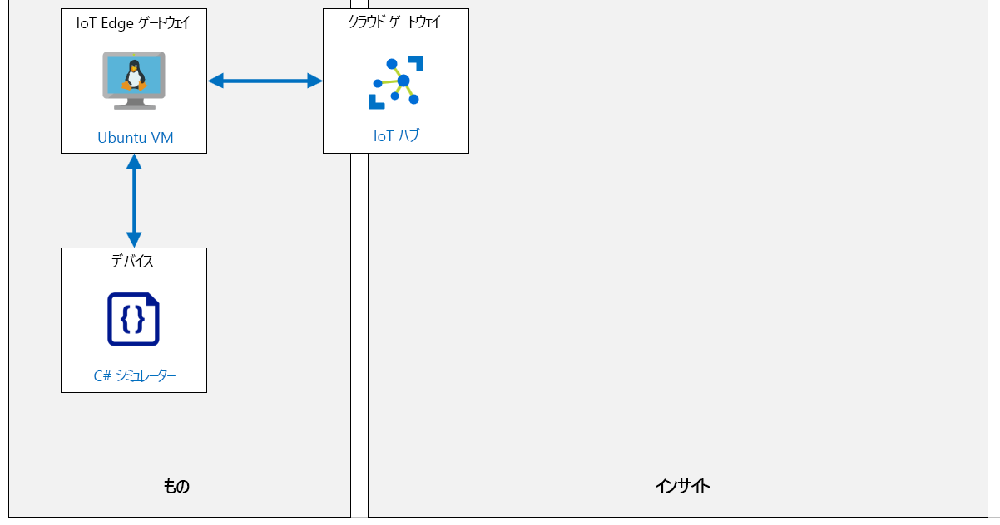

---
lab:
  title: ラボ 12:IoT Edge ゲートウェイを設定する
  module: 'Module 6: Azure IoT Edge Deployment Process'
ms.openlocfilehash: a710ea3e39a2c63da58925f669b7bdb8f983a4e7
ms.sourcegitcommit: b9f2c53cb54dde700e21476bcc7435310d15445d
ms.translationtype: HT
ms.contentlocale: ja-JP
ms.lasthandoff: 04/11/2022
ms.locfileid: "141604967"
---
# <a name="setup-an-iot-edge-gateway"></a>IoT Edge ゲートウェイを設定する

## <a name="lab-scenario"></a>課題シナリオ

このラボは理論に基づいた形で、IoT Edge デバイスをゲートウェイとして使用する方法について説明します。

ゲートウェイとしての IoT Edge デバイスの使用には、透過、プロトコル変換、ID 変換の 3 つのパターンがあります。

**透過** – IoT Hub に理論的に接続できるデバイスは、代わりにゲートウェイ デバイスに接続できます。 このダウンストリーム デバイスには独自の IoT Hub ID があり、MQTT、AMQP、HTTP のいずれかのプロトコルを使っています。 ゲートウェイは、デバイスと IoT Hub の間の通信を単純に受け渡します。 デバイスはゲートウェイ経由でクラウドと通信していることを認識せず、IoT Hub のデバイスを操作しているユーザーは中間のゲートウェイ デバイスに気付きません。 したがって、ゲートウェイは透過的です。 透過的なゲートウェイとして IoT Edge デバイスを使う方法については、「透過的なゲートウェイの作成」をご覧ください。

**プロトコル変換** – 非透過的ゲートウェイ パターンとしても知られているものであり、MQTT、AMQP、または HTTP をサポートしていないデバイスは、ゲートウェイ デバイスを使って IoT Hub にデータを送信できます。 ゲートウェイは、ダウンストリーム デバイスによって使用されているプロトコルを認識します。またゲートウェイは、IoT Hub 内で ID を持つ唯一のデバイスです。 すべての情報は、1 つのデバイスつまりゲートウェイから送信されているように見えます。 クラウド アプリケーションでデバイスごとにデータを分析する必要がある場合、ダウンストリーム デバイスは追加の識別情報をメッセージに埋め込む必要があります。 さらに、ツインやメソッドのような IoT Hub プリミティブを使うことができるのはゲートウェイ デバイスのみであり、ダウンストリーム デバイスは使えません。

**ID 変換** - IoT Hub に接続できないデバイスは、代わりにゲートウェイ デバイスに接続できます。 ゲートウェイは、ダウンストリーム デバイスに代わって IoT Hub ID とプロトコルの変換機能を提供します。 ゲートウェイは、ダウンストリーム デバイスによって使われているプロトコルを認識し、ダウンストリーム デバイスに ID を提供し、IoT Hub のプリミティブを変換できるほど十分にスマートです。 ダウンストリーム デバイスは、ツインとメソッドを備えたファースト クラスのデバイスとして IoT Hub に認識されます。 ユーザーは、IoT Hub のデバイスと対話することができ、中間にゲートウェイ デバイスがあることには気付きません。

次のリソースが作成されます。



## <a name="in-this-lab"></a>このラボでは

このラボでは、次のタスクを正常に達成します。

* ラボの前提条件を構成する (必要な Azure リソース)
* Azure IoT Edge 対応の Linux VM を IoT Edge デバイスとしてデプロイする
* IoT Edge デバイスの CA 証明書を生成して構成する
* Azure portal を使用して IoT Hub で IoT Edge デバイス ID を作成する
* IoT Edge ゲートウェイのホスト名を設定する
* IoT Edge ゲートウェイ デバイスを IoT Hub に接続する
* 通信用に IoT Edge ゲートウェイ デバイス ポートを開く
* IoT Hub でダウンストリーム デバイスの ID を作成する
* ダウンストリーム デバイスを IoT Edge ゲートウェイに接続する
* イベント フローの検証

## <a name="lab-instructions"></a>ラボの手順

### <a name="exercise-1-configure-lab-prerequisites"></a>演習 1:ラボの前提条件を構成する

このラボでは、次の Azure リソースが使用可能であることを前提としています。

| リソースの種類 | リソース名 |
| :-- | :-- |
| リソース グループ | rg-az220 |
| IoT Hub | iot-az220-training-{your-id} |

これらのリソースを確実に使用できるようにするには、次のタスクを行います。

1. 仮想マシン環境で Microsoft Edge ブラウザー ウィンドウを開き、次の Web アドレスに移動します。
 
    +++https://portal.azure.com/#create/Microsoft.Template/uri/https%3A%2F%2Fraw.githubusercontent.com%2FMicrosoftLearning%2FAZ-220-Microsoft-Azure-IoT-Developer%2Fmaster%2FAllfiles%2FARM%2Flab12.json+++

    > **注**:緑色の "T" 記号 (例: +++このテキストを入力+++) が表示されているときはいつでも、関連付けられているテキストをクリックすると、仮想マシン環境内の現在のフィールドに情報が入力されます。

1. Azure portal にログインするように求められた場合は、このコースで使用している Azure 資格情報を入力します。

    **[カスタム デプロイ]** ページが表示されます。

1. **[プロジェクトの詳細]** の **[サブスクリプション]** ドロップダウンで、このコースで使用する [Azure サブスクリプション] が選択されていることを確認します。

1. **[リソース グループ]** ドロップダウンで、 **[rg-az220]** を選択します。

    > **注**:**rg-az220** がリストにない場合:
    >
    > 1. **[リソース グループ]** ドロップダウンで、 **[新規作成]** をクリックします。
    > 1. **[名前]** に「**rg-az220**」と入力します。
    > 1. **[OK]** をクリックします。

1. **[インスタンスの詳細]** の **[リージョン]** ドロップダウンで、最も近いリージョンを選択します。

    > **注**:**rg-az220** グループが既に存在する場合、 **[リージョン]** フィールドは、リソース グループで使用されるリージョンに設定され、読み取り専用になります。

1. **[Your ID]\(ユーザー ID\)** フィールドに、演習 1 で作成した一意の ID を入力します。

1. **[コース ID]** フィールドに、「**az220**」と入力します。

1. テンプレートを検証するには、 **[確認および作成]** をクリックします。

1. 検証に成功したら、 **[作成]** をクリックします。

    デプロイが開始されます。

1. デプロイが完了した後、テンプレートの出力値を確認するには、左側のナビゲーション領域で **[出力]** をクリックします。

    後で使用するために出力をメモしておきます。

    * connectionString

これで、リソースが作成されました。

### <a name="exercise-2-deploy-and-configure-a-linux-vm--as-an-iot-edge-gateway"></a>演習 2:Linux VM をデプロイし、IoT Edge ゲートウェイとして構成する

この演習では、Ubuntu サーバー VM をデプロイし、IoT Edge ゲートウェイとして構成します。

#### <a name="task-1-create-iot-edge-gateway-device-identity"></a>タスク 1:IoT Edge ゲートウェイ デバイスの ID を作成する

このタスクでは、Azure IoT Hub を使用して、IoT Edge 透過ゲートウェイ (お使いの IoT Edge VM) に使用する新しい IoT Edge デバイス ID を作成します。

1. 必要な場合は、お使いの Azure アカウントの資格情報を使用して Azure portal にログインし、Azure ダッシュボードに移動します。

1. **rg-az220** リソース グループ タイルで、IoT Hub を開くには、 **[iot-az220-training-{your-id}]** をクリックします。

1. **iot-az220-training-<自分の ID>** ブレードの左側のナビゲーション メニューで、 **[デバイス管理]** の **[IoT Edge]** をクリックします。

    [IoT Edge] ペインを使用すると、IoT Hub に接続されている IoT Edge デバイスを管理できます。

1. ペインの上部で、 **[IoT Edge デバイスの追加]** をクリックします。

1. **[デバイスの作成]** ブレードの **[デバイス ID]** フィールドで、「**vm-az220-training-gw0001-{your-id}**」と入力します。

    {your-id} をコースの開始時に作成した値に必ず置き換えてください。 これは、認証とアクセス制御に使用されるデバイス ID です。

1. **[認証タイプ]** で **[対称キー]** が選択されていることを確認し、 **[キーの自動生成]** ボックスをオンのままにします。

    これにより、IoT Hub はデバイスを認証するための対称キーを自動的に生成します。

1. その他の設定は既定のままにして、 **[保存]** をクリックします。

    しばらくすると、新しい IoT Edge デバイスが IoT Edge デバイスの一覧に追加されます。

1. **[デバイス ID]** で **[vm-az220-training-gw0001-{your-id}]** をクリックします。

1. **[vm-az220-training-gw0001-{your-id}]** ブレードで **プライマリ接続文字列** をコピーします。

    値の右側に [コピー] ボタンが表示されます。

1. **プライマリ接続文字列** の値をファイルに保存し、関連付けられているデバイスに関するメモを取ります。

1. **vm-az220-training-gw0001-<自分の ID>** ブレードで、 **[モジュール]** の一覧が **\$edgeAgent** と **\$edgeHub** だけであることに注意してください。

    IoT Edge エージェント ( **\$edgeAgent**) および IoT Edge ハブ ( **\$edgeHub**) モジュールは、IoT Edge ランタイムの一部です。 Edge ハブは通信を担当し、Edge エージェントはデバイスにモジュールを展開して監視します。

1. ブレードの上部で、 **[モジュールの設定]** をクリックします。

    **[デバイスにモジュールを設定する]** ブレードを使用して、IoT Edge デバイスにモジュールを追加できます。 しかし、さしあたりは、このブレードを使用して IoT Edge ゲートウェイ デバイスに対し、メッセージ ルーティングが正しく構成されていることを確認します。

1. **[デバイスにモジュールを設定する]** ブレードの上部で、 **[ルート]** をクリックします。

    **[ルート]** の下に、IoT Edge デバイス用に構成された既定のルートがエディタによって表示されます。 この時点で、すべてのモジュールから Azure IoT Hub にすべてのメッセージを送信するルートを用いて構成されている必要があります。 ルート構成がこれに一致しない場合は、次のルートに一致させるために更新します。

    * **名前**: `route`
    * **値**: `FROM /* INTO $upstream`

    メッセージ ルートの `FROM /*` の部分は、デバイスからクラウドへのすべてのメッセージ、または任意のモジュールやリーフ デバイスからのツイン変更通知に一致します。 次に、`INTO $upstream` の部分では、これらのメッセージを Azure IoT Hub に送信することがルートに指示されます。

    > **注**: Azure IoT Edge 内のメッセージ ルーティングの構成に関する詳細については、[IoT Edge にモジュールをデプロイしてルートを確立する方法の詳細](https://docs.microsoft.com/azure/iot-edge/module-composition#declare-routes#declare-routes)に関するドキュメント記事を参照してください。

1. ブレードの最下部で、 **[Review + create]** をクリックします。

    **[デバイスにモジュールを設定する]** ブレードのこのタブには、Edge デバイスの配置マニフェストが表示されます。 ブレードの上部に "検証が成功しました" というメッセージが表示されるはずです。

1. 時間をとって配置マニフェストを確認してください。

1. ブレードの下部にある **[作成]** をクリックします。

#### <a name="task-2-provision-iot-edge-vm"></a>タスク 2:IoT Edge VM をプロビジョニングする

このタスクでは、ARM (Azure Resource Manager) テンプレートを使用して Linux VM をプロビジョニングし、IoT Edge ランタイムをインストールし、IoT Hub への接続を構成し、デバイスからゲートウェイへの通信を暗号化するための X509 証明書を生成して、それらを IoT Edge ランタイムの構成に追加します。

> **Information**:自動的に行われる手順について詳しくは、次のリソースを確認してください。
>
> * [Azure IoT Edge for Linux をインストールまたはアンインストールする](https://docs.microsoft.com/en-us/azure/iot-edge/how-to-install-iot-edge?view=iotedge-2020-11)
> * [IoT Edge デバイスで証明書を管理する](https://docs.microsoft.com/en-us/azure/iot-edge/how-to-manage-device-certificates?view=iotedge-2020-11)
> * [IoT Edge デバイスの機能をテストするためのデモ用の証明書を作成する](https://docs.microsoft.com/en-us/azure/iot-edge/how-to-create-test-certificates?view=iotedge-2020-11)

1. Web ブラウザーを開き、次のアドレスに移動します。 

    ```
    https://portal.azure.com/#create/Microsoft.Template/uri/https%3A%2F%2Fraw.githubusercontent.com%2FMicrosoftLearning%2FAZ-220-Microsoft-Azure-IoT-Developer%2Fmaster%2FAllfiles%2FARM%2Flab12a.json
    ```

1. メッセージが表示されたら、このラボで使っている Azure 資格情報を使ってログインします。

    **[カスタム デプロイ]** ページが表示されます。

1. **[プロジェクトの詳細]** の **[サブスクリプション]** ドロップダウンで、このコースで使用する [Azure サブスクリプション] が選択されていることを確認します。

1. **[リソース グループ]** ドロップダウンで [作成] を選択し、「**rg-az220vm**」と入力します。

1. **[リージョン]** フィールド に、前に使用したのと同じ場所を入力します。

1. **[仮想マシン名]** テキスト ボックスに、「**vm-az220-training-gw0001-{your-id}** 」と入力します

1. **[Device Connection String]\(デバイスの接続文字列\)** フィールド に、前の演習の接続文字列の値を入力します。

1. **[仮想マシンのサイズ]** フィールドに **Standard_DS1_v2** が入力されていることを確認します。

1. **[Ubuntu OS Version]\(Ubuntu OS のバージョン\)** フィールドに **18.04-LTS** が入力されていることを確認します。

1. **[管理者ユーザー名]** フィールドにユーザー名を入力します。

1. **[認証の種類]** フィールドで、 **[パスワード]** が選ばれていることを確認します。

1. **[Admin Password Or Key]\(管理者のパスワードまたはキー\)** フィールドに、使用するパスワードを入力します。

1. **[Allow SSH]\(SSH を許可する\)** フィールドで、 **[true]** が選ばれていることを確認します。

1. テンプレートを検証するには、 **[確認および作成]** をクリックします。

1. 検証に成功したら、 **[作成]** をクリックします。

    > **注**:デプロイはすぐに完了するかもしれませんが、VM の構成はバックグラウンドで続けられています。

1. テンプレートが完了したら、 **[出力]** ウィンドウに移動し、次の値を記録しておきます。

    * パブリック FQDN
    * パブリック SSH

####
 タスク 3:通信用に IoT Edge ゲートウェイ デバイス ポートを開く

IoT Hub とのすべての通信は送信接続を介して行われるため、Standard IoT Edge デバイスが機能するために受信接続は必要ありません。 ゲートウェイ デバイスは、ダウンストリーム デバイスからメッセージを受信する必要があるため、異なります。 ダウンストリーム デバイスとゲートウェイ デバイスの間にファイアウォールがある場合は、ファイアウォール経由でも通信が可能である必要があります。 Azure IoT Edge ゲートウェイを機能させるには、ダウンストリーム デバイスから入ってくるトラフィックのために、IoT Edge ハブでサポートされているプロトコルうち、少なくとも 1 つを開いておく必要があります。 サポートされているプロトコルは MQTT、AMQP、HTTPS です。

Azure IoT Edge でサポートされている IoT 通信プロトコルのポート マッピングは次のようになります。

| プロトコル | ポート番号 |
| --- | --- |
| MQTT | 8883 |
| AMQP | 5671 |
| HTTPS<br/>MQTT + WS (Websocket)<br/>AMQP + WS (Websocket) | 443 |

お使いのデバイスに選択した IoT 通信プロトコルには、IoT Edge ゲートウェイ デバイスをセキュリティで保護するファイアウォールのために、対応するポートを開いておく必要があります。 このラボの場合は、IoT Edge ゲートウェイをセキュリティで保護するために Azure ネットワーク セキュリティ グループ (NSG) が使用されるため、NSG の受信セキュリティ規則は、これらのポートで開かれます。

運用シナリオでは、デバイスが通信するポートの最小数のみを開きます。 MQTT を使用する場合、受信通信にはポート 8883 だけを開けてください。 開くポートを増やすと、セキュリティ攻撃者に利用されるおそれがある攻撃ベクトルが増えます。 セキュリティのベスト プラクティスは、ソリューションに必要な最小数のポートのみを開くことです。

このタスクでは、インターネットから Azure IoT Edge ゲートウェイへのアクセスをセキュリティで保護するネットワーク セキュリティ グループ (NSG) を構成します。 ダウンストリーム IoT デバイスがゲートウェイと通信できるように、MQTT、AMQP、HTTPS 通信に必要なポートを開いておく必要があります。

1. 必要な場合は、お使いの Azure アカウントの資格情報を使用して Azure portal にログインします。

1. Azure ダッシュボードで、**rg-az220vm** リソース グループ タイルを見つけます。

    このリソース グループ タイルには、関連付けられたネットワーク セキュリティ グループへのリンクが含まれていることに注意してください。

1. **rg-az220vm** リソース グループのタイルで、**nsg-vm-az220-training-gw0001-<自分の ID>** をクリックします。

1. **[ネットワーク セキュリティ グループ]** ブレードの左側のメニューの **[設定]** で、 **[アウトバウンドセキュリティ規則]** をクリックします。

1. **[受信セキュリティ規則]** ウィンドウの上部にある **[追加]** をクリックします。

1. **[受信セキュリティ規則の追加]** ペインで、 **[Source]\(ソース\)** が **[任意]** に設定されていることを確認します。

    これにより、任意のソースからのトラフィックが許可されます。運用環境では、これを特定のアドレスなどに制限することができます。

1. **[Destination]\(宛先\)** で、 **[Destination]\(宛先\)** が **[任意]** に設定されていることを確認します。

    これにより、送信トラフィックを任意の場所にルーティングできます。 運用環境では、アドレスを制限することができます。

1. **[宛先ポート範囲]** で、値を「**8883**」に変更します。

    これは、MQTT プロトコル用のポートです。

1. **[プロトコル]** で **[TCP]** をクリックします。

    MQTT では TCP が使われます。

1. **[アクション]** で、 **[許可]** が選ばれていることを確認します。

    この規則は送信トラフィックを許可するためのものなので、 **[許可]** を選びます。

1. **[優先度]** では既定値を指定します。ほとんどの場合、これは **1010** になります。一意である **必要があります**。

    規則は優先度順に処理されます。値が小さいほど、優先度は高くなります。 既存の規則を編集する必要なしに、新しい規則を簡単に追加できるよう、規則は 100、200、300 のように間を空けることをお勧めします。

1. **[名前]** で値を **MQTT** に変更します。

1. その他すべての設定を既定のままにして、 **[追加]** をクリックします。

    これにより、IOT Edge ゲートウェイへの MQTT プロトコルの通信を許可する受信セキュリティ規則が定義されます。

1. MQTT ルールを追加した後、**AMQP** および **HTTPS** 通信プロトコルのポートを開くには、次の値を持つ 2 つのルールを追加します。

    | 宛先ポート範囲 | プロトコル | 名前 |
    | :--- | :--- | :--- |
    | 5671 | TCP | AMQP |
    | 443 | TCP | HTTPS |

   > **注**:新しいルールが表示されるのを確認するには、ウィンドウの上部にあるツールバーの **[更新]** ボタンを使用する必要がある場合があります。

1. これら 3 つのポートがネットワーク セキュリティ グループ (NSG) で開いていると、ダウンストリーム デバイスは、MQTT、AMQP、または HTTPS プロトコルを使用し、IoT Edge ゲートウェイに接続できます。

### <a name="exercise-3-download-device-ca-certificate"></a>演習 3:デバイスの CA 証明書をダウンロードする

この演習では、作成した **vm-az220-training-gw0001-<自分の ID>** 仮想マシンを探し、生成されたテスト証明書をクラウド シェルにダウンロードします。

#### <a name="task-1-connect-to-the-vm"></a>タスク 1:VM に接続する

1. IoT Edge 仮想マシンが正常にデプロイされたことを確認します。

    Azure portal で通知ウィンドウを確認できます。

1. **rg-az220vm** リソース グループが Azure ダッシュボードに固定されていることを確認します。

    リソース グループをダッシュボードに固定するには、Azure ダッシュボードに移動して、次の手順を実行します。

    * Azure portal メニューで、 **[リソース グループ]** をクリックします。
    * **[リソース グループ]** ブレードの **[名前]** で、**rg-az220vm** リソース グループを見つけます。
    * **rg-az220vm** の行で、ブレードの右側にある **[...]** をクリックした後、 **[ダッシュボードにピン留め]** をクリックします。

    ダッシュボードを編集して、RG タイルとリストに表示されたリソースへのアクセスを容易にすることもできます。

1. Azure portal のツールバーで、 **[Cloud Shell]** をクリックします。

1. Cloud Shell のコマンド プロンプトで、前のタスクで記録した **ssh** コマンド (例: **ssh vmadmin@vm-az220-training-edge0001-dm080321.centralus.cloudapp.azure.com** ) を貼り付けて、**Enter** キーを押します。

1. **[接続を続行しますか?]** というメッセージが表示されたら、「**yes**」と入力して **Enter** キーを押します。

    VM への接続をセキュリティで保護するために使用される証明書が自己署名であるため、このプロンプトがセキュリティの確認となります。 このプロンプトに対する回答は、後続の接続で記憶されます。また、これは最初の接続でのみ表示されます。

1. パスワードを入力するよう求められたら、Edge ゲートウェイ VM がプロビジョニングされる時に作成した管理者パスワードを入力します。

1. 接続されると、ターミナルは次のように Linux VM の名前を表示するように変更されます。 これにより、接続された VM が分かります。

    ``` bash
    username@vm-az220-training-gw0001-{your-id}:~$
    ```

1. 仮想マシンのパブリック IP アドレスを確認するには、次のコマンドを入力します。

    ```bash
    nslookup vm-az220-training-gw0001-{your-id}.centralus.cloudapp.azure.com
    ```

    次のように出力されます。

    ```bash
    Server:         127.0.0.53
    Address:        127.0.0.53#53

    Non-authoritative answer:
    Name:   vm-az220-training-gw0001-{your-id}}.centralus.cloudapp.azure.com
    Address: 168.61.181.131
    ```

    VM のパブリック IP は最後の **Address** の値です (この例では **168.61.181.131**)。

    > **重要**: この IP アドレスを記録しておきます。後で必要になります。 IP アドレスは、通常、VM を再起動するたびに変わります。

    > **注**:パブリック IP が Azure Cloud Shell に表示されない場合は、Azure Portal を使って VM のパブリック IP アドレスを検索します。

#### <a name="task-2-explore-the-iot-edge-configuration"></a>タスク 2:IoT Edge の構成を調べる

VM の初回起動時に、IoT Edge を構成するスクリプトが実行されました。 このスクリプトでは、次の操作が実行されました。

* **aziot-identity-service** パッケージをインストールしました
* **aziot-edge** パッケージをインストールしました
* **config.toml** (IoT Edge の構成ファイル) の初期バージョンを **/etc/aziot/config.toml** にダウンロードしました
* ARM テンプレートの実行時に指定されたデバイス接続文字列を **/etc/aziot/config.toml** に追加しました
* [Iot Edge の Git リポジトリ](https://github.com/Azure/iotedge.git)を **/etc/gw-ssl/iotedge** にクローンしました
* ディレクトリ **/tmp/lab12** を作成し、IoT Edge ゲートウェイの SSL テスト ツールを **/etc/gw-ssl/iotedge** からコピーしました
* テスト SSL 証明書を **/tmp/lab12** に生成し、それを **/etc/aziot** にコピーしました
* 証明書を **/etc/aziot/config.toml** に追加しました
* 更新された **/etc/aziot/config.toml** を IoT Edge ランタイムに適用しました

1. インストールされた IoT Edge のバージョンを確認するには、次のコマンドを入力します。

    ```bash
    iotedge --version
    ```

    これを書いている時点では、インストールされるバージョンは `iotedge 1.2.3` です

1. IoT Edge の構成を表示するには、次のコマンドを入力します。

    ```bash
    cat /etc/aziot/config.toml
    ```

    次のように出力されます。

    ```s
        [provisioning]
    source = "manual"
    connection_string = "HostName=iot-az220-training-dm080221.azure-devices.net;DeviceId=sensor-th-0067;SharedAccessKey=2Zv4wruDViwldezt0iNMtO1mA340tM8fnmxgoQ3k0II="

    [agent]
    name = "edgeAgent"
    type = "docker"

    [agent.config]
    image = "mcr.microsoft.com/azureiotedge-agent:1.2"

    [connect]
    workload_uri = "unix:///var/run/iotedge/workload.sock"
    management_uri = "unix:///var/run/iotedge/mgmt.sock"

    [listen]
    workload_uri = "fd://aziot-edged.workload.socket"
    management_uri = "fd://aziot-edged.mgmt.socket"

    [moby_runtime]
    uri = "unix:///var/run/docker.sock"
    network = "azure-iot-edge"

    trust_bundle_cert = 'file:///etc/aziot/azure-iot-test-only.root.ca.cert.pem'

    [edge_ca]
    cert = 'file:///etc/aziot/iot-edge-device-ca-MyEdgeDeviceCA-full-chain.cert.pem'
    pk = 'file:///etc/aziot/iot-edge-device-ca-MyEdgeDeviceCA.key.pem'
    ```

    セットアップの間に、**connection_string**、**trust_bundle_cert**、**cert**、**pk** の値が更新されました。

1. IoT Edge デーモンが実行されていることを確認するには、次のコマンドを入力します。

    ```bash
    sudo iotedge system status
    ```

    このコマンドでは、次のような出力が表示されます。

    ```bash
    System services:
        aziot-edged             Running
        aziot-identityd         Running
        aziot-keyd              Running
        aziot-certd             Running
        aziot-tpmd              Ready

    Use 'iotedge system logs' to check for non-fatal errors.
    Use 'iotedge check' to diagnose connectivity and configuration issues.
    ```

1. IoT Edge ランタイムが接続されていることを確認するには、次のコマンドを実行します。

    ```bash
    sudo iotedge check
    ```

    これにより、いくつかのチェックが実行され、結果が表示されます。 このラボでは、**構成チェック** の警告/エラーを無視してください。 **接続チェック** は成功し、次のようになります。

    ```bash
    Connectivity checks (aziot-identity-service)
    --------------------------------------------
    √ host can connect to and perform TLS handshake with iothub AMQP port - OK
    √ host can connect to and perform TLS handshake with iothub HTTPS / WebSockets port - OK
    √ host can connect to and perform TLS handshake with iothub MQTT port - OK

    Configuration checks
    --------------------
    ** entries removed for legibility **

    Connectivity checks
    -------------------
    √ container on the default network can connect to IoT Hub AMQP port - OK
    √ container on the default network can connect to IoT Hub HTTPS / WebSockets port - OK
    √ container on the default network can connect to IoT Hub MQTT port - OK
    √ container on the IoT Edge module network can connect to IoT Hub AMQP port - OK
    √ container on the IoT Edge module network can connect to IoT Hub HTTPS / WebSockets port - OK
    √ container on the IoT Edge module network can connect to IoT Hub MQTT port - OK
    ```

    接続が失敗する場合は、**config.toml** で接続文字列の値を再確認してください。

1. VM シェルを終了するには、次のコマンドを入力します。

    ```bash
    exit
    ```

    VM への接続が閉じ、Cloud Shell のプロンプトが表示されます。

#### <a name="task-3-download-ssl-certs-from-vm-to-cloud-shell"></a>タスク 3:SSL 証明書を VM から Cloud Shell にダウンロードする

次に、**MyEdgeDeviceCA** 証明書を **vm-az220-training-gw0001-<自分の ID>** 仮想マシンから "ダウンロード" し、リーフ デバイスと IoT Edge ゲートウェイ間の通信を暗号化するために使用できるようにする必要があります。

1. **vm-az220-training-gw0001-<自分の ID>** 仮想マシンから **Cloud Shell** のストレージに **/tmp/lab12** ディレクトリをダウンロードするには、Cloud Shell のコマンド プロンプトで次のコマンドを入力します。

    ```bash
    mkdir lab12
    scp -r -p {username}@{FQDN}:/tmp/lab12 .
    ```

    >**重要**: 上のコマンドでは、末尾のピリオド `.` の前に `space` があります。

    > **注**: **{username}** プレースホルダーを VM の管理者ユーザーのユーザー名に置き換え、 **{FQDN}** プレースホルダーを VM の完全修飾ドメイン名に置き換えます。 必要に応じて、SSH セッションを開くために使用されるコマンドを参照してください。
    > `scp -r -p vmadmin@vm-az220-training-edge0001-dm080321.centralus.cloudapp.azure.com:/tmp/lab12 .`

1. プロンプトが表示されたら、VM の管理者パスワードを入力します。

    コマンドが実行されると、SSH 経由で証明書とキー ファイルを含む **/tmp/lab12** ディレクトリのコピーが Cloud Shell ストレージにダウンロードされます。

1. ファイルがダウンロードされたことを確認するには、次のコマンドを入力します。

    ```bash
    cd lab12
    ls
    ```

    次の一覧表示されたファイルを確認する必要があります。

    ```bash
    certGen.sh  csr        index.txt.attr      index.txt.old  openssl_root_ca.cnf  serial
    certs       index.txt  index.txt.attr.old  newcerts       private              serial.old
    ```

    ファイルが **vm-az220-training-gw0001-{your-id}** 仮想マシンから Cloud Shell ストレージにコピーされたら、必要に応じて、任意の IoT Edge デバイス証明書とキー ファイルをローカル コンピューターに簡単にダウンロードできるようになります。 ファイルは `download <filename>` コマンドを使って Cloud Shell からダウンロードできます。 ラボの後半でこれを行います。

### <a name="exercise-4-create-a-downstream-device"></a>演習 4:ダウンストリーム デバイスを作成する

この演習では、ダウンストリーム デバイスを作成し、ゲートウェイ経由で IoT Hub に接続します。

#### <a name="task-1-create-device-identity-in-iot-hub"></a>タスク 1:IoT Hub でデバイス ID を作成する

このタスクでは、ダウンストリーム IoT デバイスの Azure IoT Hub に新しい IoT デバイス ID を作成します。 このデバイス ID は、Azure IoT Edge ゲートウェイがこのダウンストリーム デバイスの親デバイスになるように構成されます。

1. 必要な場合は、お使いの Azure アカウントの資格情報を使用して Azure portal にログインします。

1. Azure ダッシュボードで、IoT Hub を開くには、 **[iot-az220-training-{your-id}]** をクリックします。

1. **iot-az220-training-<自分の ID>** ブレードの左側のナビゲーション メニューで、 **[デバイス管理]** の **[デバイス]** をクリックします。

    [IoT Hub] ブレードのこのウィンドウを使用して、IoT Hub に接続されている IoT デバイスを管理できます。

1. 新しい IoT デバイスの構成を始めるには、ウィンドウの上部で **[+ デバイスの追加]** をクリックします。

1. **[デバイスの作成]** ブレードの **[デバイス ID]** で、「**sensor-th-0072**」と入力します。

    これは、認証とアクセス制御に使用されるデバイス ID です。

1. **[認証の種類]** で、 **[対称キー]** が選択されていることを確認します。

1. **[キーの自動生成]** の下のボックスはオンのままにします。

    これにより、IoT Hub はデバイスを認証するための対称キーを自動的に生成します。

1. **[親デバイス]** で **[親デバイスの設定]** をクリックします。

    このラボで先ほど作成した IoT Edge ゲートウェイ デバイスを介して IoT Hub と通信するように、このダウンストリーム デバイスを構成します。

1. **[エッジ デバイスを親デバイスとして設定する]** ブレードの **[デバイス ID]** で、 **[vm-az220-training-gw0001-{your-id}]** をクリックし、 **[OK]** をクリックします。

1. **[デバイスの作成]** ブレードで、ダウンストリーム デバイスの IoT デバイス ID を作成するには、 **[保存]** をクリックします。

1. **[IoT デバイス]** ウィンドウの上部にある **[更新]** をクリックします。

1. **[デバイス ID]** で、**sensor-th-0072** をクリックします。

    これにより、このデバイスの詳細ビューが開きます。

1. IoT デバイスの概要 ペインで、**プライマリ接続文字列** フィールドの右側にある **コピー** をクリックします。

1. 後の参照用に接続文字列を保存します。

    この接続文字列は sensor-th-0072 の子デバイス用であることに注意してください。

#### <a name="task-2-download-device-x509-xertificate"></a>タスク 2:デバイスの x509 証明書をダウンロードする

このタスクでは、事前に構築されているダウンストリーム デバイスと Edge ゲートウェイ デバイスの間の接続を構成します。

1. 必要な場合は、お使いの Azure アカウントの資格情報を使用して Azure portal にログインします。

    複数の Azure アカウントをお持ちの場合は、このコースで使用するサブスクリプションに関連付けられているアカウントを使用してログインしていることを確認してください。

1. Azure portal のツール バーで、 **[Cloud Shell]** をクリックします。

    環境が **Bash** に設定されていることを確認します。

    > **注**:Cloud Shell がすでに開いていて、Edge デバイスに接続されている場合は、**exit** コマンドを使用して SSH セッションを終了します。

1. Cloud Shell コマンド プロンプトで、IoT Edge ゲートウェイ仮想マシンのルート CA X.509 証明書をダウンロードするには、次のコマンドを入力します。

    ```bash
    download lab12/certs/azure-iot-test-only.root.ca.cert.pem
    ```

    以前の Azure IoT Edge ゲートウェイでは、ゲートウェイに接続しているダウンストリーム デバイスとの通信の暗号化にこのルート CA X.509 証明書を使用するための構成は、 **/etc/aziot/config.toml** ファイルで行われていました。 この X.509 証明書は、ゲートウェイとの通信を暗号化するために使用できるよう、ダウンストリーム デバイスにコピーされる必要があります。

1. **azure-iot-test-only.root.ca.cert.pem** X.509 証明書ファイルを、ダウンストリーム IoT デバイスのソース コードがある **Starter/DownstreamDevice** ディレクトリにコピーします。

    > **重要**: ファイルに正確な名前が付いていることを確認してください。 以前のラボと異なる名前 (たとえば、 **(1)** が追加されている) を持つことがあるため、必要に応じてコピー後に名前を変更します。

#### <a name="task-3-create-hosts-file-entry"></a>タスク 3:hosts ファイルのエントリを作成する

このラボの以前のバージョンでは、デバイスの connectionString の **GatewayHostName** からの値として FQDN が使用されましたが、現在のバージョンのテスト スクリプトによって生成されるテスト x509 証明書では、これはサポートされなくなっています。 代わりに、ホスト名のみが使われ、ホスト名を IP アドレスに解決するために、ローカル コンピューターの **hosts** ファイルにエントリを作成する必要があります。 次の手順のようにして、hosts ファイルに必要なエントリを追加します。

1. Visual Studio Code を開きます。

1. **[ファイル]** メニューの **[ファイルを開く]** をクリックします。

1. フォルダー **c:\\Windows\\System32\\Drivers\\etc\\** ファイルに移動し、**hosts** ファイルを開きます。

    > **注**: **hosts** ファイルに拡張子はありません。

1. **hosts** ファイルに次の行を追加し、その後に空の行を追加します。

    ```text
    {VM Public IP Address} vm-az220-training-gw0001-{your-id}
    {blank line}
    ```

    たとえば、オブジェクトに適用された

    ```text
    168.61.181.131 vm-az220-training-gw0001-dm090821

    ```

1. ファイルを保存します。保存失敗のプロンプトが表示されたら、 **[管理者権限で再試行...]** をクリックし、 **[ユーザー アカウント制御]** ダイアログで **[はい]** をクリックします。

ローカル コンピューターで VM 名を適切な IP アドレスに解決できるようになります。

#### <a name="task-4-connect-downstream-device-to-iot-edge-gateway"></a>タスク 4:ダウンストリーム デバイスを IoT Edge ゲートウェイに接続する

1. Visual Studio Code を開きます。

1. **[ファイル]** メニューで、 **[フォルダーを開く]** をクリックします。

1. **[フォルダーを開く]** ダイアログで、ラボ 12 の **スターター** フォルダーに移動し、**DownstreamDevice** をクリックして、 **[フォルダーの選択]** をクリック します。

    Program.cs ファイルと一緒に [エクスプローラー] ペインに一覧表示されている azure-iot-test-only.root.ca.cert.pem ファイルが表示されます。

    > **注**:dotnet を復元および/または C# 拡張機能を読み込むためのメッセージが表示された場合は、インストールを完了します。

1. エクスプローラー ウィンドウで、**Program.cs** をクリックします。

    ざっと確認すると、このアプリは以前のラボで作業した **CaveDevice** アプリケーションのバリアントであることがわかります。

1. **connectionString** 変数の宣言を見つけて、プレースホルダー値を **sensor-th-0072** IoT デバイスのプライマリ接続文字列に置き換えます。

1. 割り当てられた **connectionString** 値を **GatewayHostName** プロパティに追加し、GatewayHostName の値を IoT Edge ゲートウェイ デバイスの名前に設定します。 この名前は、このラボで前に hosts ファイルで指定した名前と一致する必要があります。

    完成した接続文字列値は、次の形式に一致する必要があります。

    ```text
    HostName=<IoT-Hub-Name>.azure-devices.net;DeviceId=sensor-th-0072;SharedAccessKey=<Primary-Key-for-IoT-Device>;GatewayHostName=<HostName-for-IoT-Edge-Device>
    ```

    > **重要**: 以前のバージョンの IoT Edge ランタイムでは、**GatewayHostName** は完全な DNS 名でした

    上記のプレースホルダーを適切な値に置き換えてください。

    * **\<IoT-Hub-Name\>** :Azure IoT Hub の名前。
    * **\<Primary-Key-for-IoT-Device\>** :Azure IoT Hub の **sensor-th-0072** IoT デバイスのプライマリ キー。
    * **\<Hostname-Name-for-IoT-Edge-Device\>** : **vm-az220-training-gw0001-<自分の ID>** Edge デバイスのホスト名。

    アセンブルされた接続文字列値を持つ **connectionString** 変数は、次のようになります。

    ```csharp
    private readonly static string connectionString = "HostName=iot-az220-training-abc201119.azure-devices.net;DeviceId=sensor-th-0072;SharedAccessKey=ygNT/WqWs2d8AbVD9NAlxcoSS2rr628fI7YLPzmBdgE=;GatewayHostName=vm-az220-training-gw0001-{your-id}";
    ```

1. **[ファイル]** メニューの **[保存]** をクリックします。

1. 下にスクロールして **Main** メソッドを表示し、少し時間をかけてコードをレビューします。

    このメソッドには、構成された接続文字列を使用して **DeviceClient** をインスタンス化するコードが含まれ、Azure IoT Edge ゲートウェイとの通信に使用するトランスポート プロトコルとして `MQTT` が指定されています。

    ```csharp
    deviceClient = DeviceClient.CreateFromConnectionString(connectionString, TransportType.Mqtt);
    SendDeviceToCloudMessagesAsync();
    ```

    Main メソッドは:

    * ルート CAX.509 証明書をローカル マシンに自動的にインストールするコードを含む **InstallCACert** メソッドを呼び出します。
    * シミュレートされたデバイスからイベント テレメトリを送信する **SendDeviceToCloudMessagesAsync** メソッドを実行します。

1. **SendDeviceToCloudMessagesAsync** メソッドを見つけ、少し時間をかけてコードをレビューします。

    このメソッドには、シミュレートされたデバイス テレメトリを生成し、イベントを IoT Edge ゲートウェイに送信するコードが含まれています。

1. **InstallCACert** を見つけ、ルート CA X.509 証明書をローカル マシン証明書ストアにインストールするコードを参照します。

    > **注**:この証明書は、デバイスから Edge ゲートウェイへの通信を保護するために使用されることに注意してください。 デバイスは、IoT Hub での認証に接続文字列内の対称キーを使用します。

    このメソッド内の初期コードは、**azure-iot-test-only.root.ca.cert.pem** ファイルが使用可能であることを確認する役割を果たします。 もちろん、実稼働アプリケーションでは、環境変数などの X.509 証明書へのパスを指定するための代替メカニズムの使用、または TPM の使用を検討する場合があります。

    X.509 証明書の存在が確認されると、**X509Store** クラスを使用して、現在のユーザーの証明書ストアに証明書がロードされます。 証明書は、ゲートウェイへの通信を保護するためにオンデマンドで利用できるようになります。これはデバイス クライアント内で自動的に行われるため、追加のコードはありません。

    > **Information**:**X509Store** クラスの詳細については、[こちら](https://docs.microsoft.com/en-us/dotnet/api/system.security.cryptography.x509certificates.x509store?view=netcore-3.1)をご覧ください。

1. **[ターミナル]** メニューで、**[新しいターミナル]** をクリックします。

1. ターミナル コマンド プロンプトで、次のコマンドを入力します。

    ```bash
    dotnet run
    ```

    このコマンドは、**sensor-th-0072** のシミュレートされたデバイスのコードをビルドして実行し、デバイス テレメトリの送信を開始します。

    > **注**:アプリが (IoT Edge ゲートウェイで認証するために使用できるように) ローカル コンピューターに X.509 証明書をインストールしようとすると、証明書のインストールに関するセキュリティ警告が表示されることがあります。 アプリを続行するには、 **[はい ]** をクリックする必要があります。

1. 証明書をインストールするかどうか尋ねられたら、 **[はい]** をクリックします。

1. シミュレートされたデバイスが実行されると、コンソールの出力に、Azure IoT Edge ゲートウェイに送信されているイベントが表示されます。

    ターミナル出力は次のようになります。

    ```text
    IoT Hub C# Simulated Cave Device. Ctrl-C to exit.

    User configured CA certificate path: azure-iot-test-only.root.ca.cert.pem
    Attempting to install CA certificate: azure-iot-test-only.root.ca.cert.pem
    Successfully added certificate: azure-iot-test-only.root.ca.cert.pem

    10/25/2019 6:10:12 PM > Sending message: {"temperature":27.714212817472504,"humidity":63.88147743599558}
    10/25/2019 6:10:13 PM > Sending message: {"temperature":20.017463779085066,"humidity":64.53511070671263}
    10/25/2019 6:10:14 PM > Sending message: {"temperature":20.723927165718717,"humidity":74.07808918230147}
    10/25/2019 6:10:15 PM > Sending message: {"temperature":20.48506045736608,"humidity":71.47250854944461}
    ```

    > **注**:デバイス送信が最初の送信で 1 秒以上長く一時停止しているように見える場合は、NSG 受信ルールを以前に正しく追加していなかったため、MQTT トラフィックがブロックされている可能性があります。  NSG の構成を確認します。

1. 次の演習に進むときは、シミュレートされたデバイスを実行したままにします。

#### <a name="task-5-verify-event-flow"></a>タスク 5:イベント フローの検証

このタスクでは、Azure CLI を使用して、IoT Edge ゲートウェイを経由してダウンストリーム IoT デバイスから Azure IoT Hub に送信されるイベントを監視します。 これは、すべてが正しく動作していることを検証します。

1. 必要な場合は、お使いの Azure アカウントの資格情報を使用して Azure portal にログインします。

    複数の Azure アカウントをお持ちの場合は、このコースで使用するサブスクリプションに関連付けられているアカウントを使用してログインしていることを確認してください。

1. Cloud Shell が実行されていない場合は、Azure portal のツールバーで **[Cloud Shell]** をクリックします。

1. Cloud Shell で SSH 接続を使用して Edge デバイスに接続している場合は、その接続を終了します。

1. Cloud Shell コマンド プロンプトで、Azure IoT Hub にフローするイベントのストリームを監視するには、次のコマンドを実行します。

    ```bash
    az iot hub monitor-events -n iot-az220-training-{your-id}
    ```

    必ず、`-n` パラメーターの `{your-id}` プレースホルダーを、Azure IoT Hub の名前に置き換えてください。

    `az iot hub monitor-events` コマンドを使用すると、デバイスのテレメトリと、Azure IoT Hub に送信されたメッセージを監視できます。 これにより、シミュレートされたデバイスから IoT Edge ゲートウェイに送信されるイベントが Azure IoT Hub によって受信されていることを確認します。

    > **注**: `Dependency update (uamqp 1.2) required for IoT extension version: 0.10.13.` というメッセージが表示されたら、「**Y*」と入力します。

1. すべてが正常に動作していれば、`az iot hub monitor-events` コマンドからの出力は次のようになります。

    ```text
    chris@Azure:~$ az iot hub monitor-events -n iot-az220-training-1119
    Starting event monitor, use ctrl-c to stop...
    {
        "event": {
            "origin": "sensor-th-0072",
            "module": "",
            "interface": "",
            "component": "",
            "payload": "{\"temperature\":29.995470051651573,\"humidity\":70.47896838303608}"
        }
    }
    {
        "event": {
            "origin": "sensor-th-0072",
            "module": "",
            "interface": "",
            "component": "",
            "payload": "{\"temperature\":28.459910635584922,\"humidity\":60.49697355390386}"
        }
    }
    ```

このラボを完了してイベント フローを確認したら、**CTRL+C** キーを押してコンソール アプリケーションを終了します。
