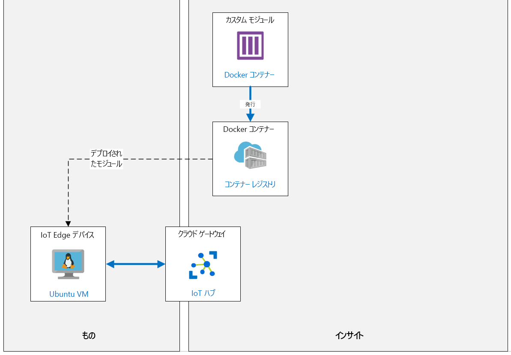

---
lab:
  title: ラボ 13:VS コードを使用して Azure IoT Edge でカスタム モジュールを開発、デプロイ、デバッグする
  module: 'Module 7: Azure IoT Edge Modules'
ms.openlocfilehash: 9586c15c0e16a0bdbe7850a0c28af480dcf34086
ms.sourcegitcommit: 7281efeb9cb5654361c2f1aa93aea724a3898966
ms.translationtype: HT
ms.contentlocale: ja-JP
ms.lasthandoff: 05/31/2022
ms.locfileid: "145955883"
---
# <a name="develop-deploy-and-debug-a-custom-module-on-azure-iot-edge-with-vs-code"></a>VS コードを使用して Azure IoT Edge でカスタム モジュールを開発、デプロイ、デバッグする

## <a name="lab-scenario"></a>課題シナリオ

消費者の需要変動に対処するために、Contoso は熟成チーズ ホイールの在庫を少量、各チーズ製造施設の倉庫に保管しています。 これらの熟成されたホイールはワックスで密封され、チーズが最適な状態で保たれるように、貯蔵環の境が慎重に制御されています。 Contoso はコンベア システムを使用して、ワックスで密封された大きなチーズ ホイールを倉庫から梱包施設に移動させます。

これまで、Contoso ではパッケージング工程をフル稼働させ、システムに配置されているすべてのチーズを処理していました。 包装されたチーズの余剰在庫はプロモーション オファーに使用できるので問題にはならず、必要に応じてチーズを在庫から追加で取り出すこともできました。 しかし、Contoso が大幅に成長し、世界的に需要変動が大きくなりつつあるため、同社は包装するチーズの量を管理できる方法でシステムを自動化する必要があります。

包装領域および出荷領域でコンベア ベルト システムを監視する IoT ソリューションはすでに実装されており、包装量の管理と制御に役立つソリューションの開発を任されています。

包装された個数が正しいことを確認するために、コンベア ベルト システムで検出されたパッケージの数をカウントする簡単なモジュールを作成 (および IoT Edge デバイスにデプロイ) することにしました。 パッケージの検出に使用できる別のモジュールがすでに用意されています (両方のモジュールが同じ IoT Edge デバイスにデプロイされます)。

他のモジュールで検出されたパッケージの数をカウントするカスタム IoT Edge モジュールを作成して、デプロイする必要があります。

このラボには、以下の開発マシン (ラボ ホスト環境 - VM または PC) の前提条件が含まれています。

* Visual Studio Code と次の拡張機能がインストールされていること。
  * Microsoftの [Azure IoT Tools](https://marketplace.visualstudio.com/items?itemName=vsciot-vscode.azure-iot-tools)
  * Microsoftの [C#](https://marketplace.visualstudio.com/items?itemName=ms-vscode.csharp)
  * [Docker](https://marketplace.visualstudio.com/items?itemName=ms-azuretools.vscode-docker)
* Docker Client バージョン 18.03.0 以降で、開発マシンにインストールされた Docker Community Edition
  * [Mac および Windows 用の Docker デスクトップをダウンロードする](https://www.docker.com/products/docker-desktop)

    > **重要**: 2020 年 1 月 13 日に、バージョン 1.2 以前のすべての TLS で Azure Container Registry のサポートが削除されたため、Docker Client 18.03.0 以降を実行する必要があります。

次のリソースが作成されます。



## <a name="in-this-lab"></a>このラボでは

このラボでは、次のタスクを正常に達成します。

* ラボの前提条件を構成する (必要な Azure リソース)
* コンテナー レジストリを作成する
* エッジ モジュールを作成し、カスタマイズする
* エッジ デバイスにモジュールをデプロイする

## <a name="lab-instructions"></a>ラボの手順

### <a name="exercise-1-configure-lab-prerequisites"></a>演習 1:ラボの前提条件を構成する

このラボでは、次の Azure リソースが使用可能であることを前提としています。

| リソースの種類 | リソース名 |
| :-- | :-- |
| リソース グループ | rg-az220 |
| IoT Hub | iot-az220-training-{your-id} |

これらのリソースを確実に使用できるようにするには、次の手順に従います。

1. 仮想マシン環境で Microsoft Edge ブラウザー ウィンドウを開き、次の Web アドレスに移動します。
 
    +++https://portal.azure.com/#create/Microsoft.Template/uri/https%3A%2F%2Fraw.githubusercontent.com%2FMicrosoftLearning%2FAZ-220-Microsoft-Azure-IoT-Developer%2Fmaster%2FAllfiles%2FARM%2Flab13.json+++

    > **注**:緑色の "T" 記号 (例: +++このテキストを入力+++) が表示されているときはいつでも、関連付けられているテキストをクリックすると、仮想マシン環境内の現在のフィールドに情報が入力されます。

1. Azure portal にログインするように求められた場合は、このコースで使用している Azure 資格情報を入力します。

    **[カスタム デプロイ]** ページが表示されます。

1. **[プロジェクトの詳細]** の **[サブスクリプション]** ドロップダウンで、このコースで使用する [Azure サブスクリプション] が選択されていることを確認します。

1. **[リソース グループ]** ドロップダウンで、 **[rg-az220]** を選択します。

    > **注**:**rg-az220** がリストにない場合:
    >
    > 1. **[リソース グループ]** ドロップダウンで、 **[新規作成]** をクリックします。
    > 1. **[名前]** に「**rg-az220**」と入力します。
    > 1. **[OK]** をクリックします。

1. **[インスタンスの詳細]** の **[リージョン]** ドロップダウンで、最も近いリージョンを選択します。

    > **注**:**rg-az220** グループが既に存在する場合、 **[リージョン]** フィールドは、リソース グループで使用されるリージョンに設定され、読み取り専用になります。

1. **[Your ID]\(ユーザー ID\)** フィールドに、演習 1 で作成した一意の ID を入力します。

1. **[コース ID]** フィールドに、「**az220**」と入力します。

1. テンプレートを検証するには、 **[確認および作成]** をクリックします。

1. 検証に成功したら、 **[作成]** をクリックします。

    デプロイが開始されます。

1. デプロイが完了した後、テンプレートの出力値を確認するには、左側のナビゲーション領域で **[出力]** をクリックします。

    後で使用するために出力をメモしておきます。

    * connectionString

これで、リソースが作成されました。

### <a name="exercise-2-install-azure-iot-edgehub-dev-tool"></a>演習 2:Azure IoT EdgeHub 開発ツールをインストールする

この演習では、Azure IoT EdgeHub 開発ツールをインストールします。

1. 開発環境に Python 3.9 (またはそれ以降) がインストールされていることを確認します。

    仮想マシン環境には、Python バージョン 3.9 および 3.7 が含まれています。 Windows 環境 PATH は、バージョン 3.9.2 用に構成されています。

    仮想マシン環境ではなく自分の PC で作業している場合、このコースのラボ 3 では、インストールされている Python 3.9 を含め、ラボ環境をローカルに準備する手順について説明します。 Python がインストールされていない場合は、ラボ 3 の手順を参照してください。

    > **注**:インストールされている Python のバージョンを確認するには、コマンド プロンプトを開き、コマンド **python--version** を入力します。

1. Python がインストールされている場合は、Windows コマンド プロンプトを開きます。

1. コマンド プロンプトで、Python (Pip) のパッケージ マネージャーをインストールするには、次のコマンドを入力します。

    ```cmd/sh
    curl https://bootstrap.pypa.io/get-pip.py -o get-pip.py
    ```

    ```cmd/sh
    python get-pip.py
    ```

    pip バージョンに関する警告は無視してかまいません。 wheel.exe に関するエラーは無視してかまいません。

    開発マシンに Azure IoT EdgeHub 開発ツールをインストールするには、Pip が必要です。

    > **重要**: このようなコードをダウンロードする場合は、実行前にコードを確認してください。

    Pip のインストールに問題がある場合は、公式の Pip [インストール手順](https://pip.pypa.io/en/stable/installing/)を参照してください。

    > **注**:Windows では、Python や Pip がインストールされる場合がありますが、**PATH** ではインストールされません。 Python がインストールされているのに利用できない場合は、インストラクターに確認してください。

1. Azure IoT EdgeHub 開発ツールをインストールするには、次のコマンドを入力します。

    ```cmd/sh
    pip install iotedgehubdev --user
    ```

    > **注**:たとえば Ubuntu や macOS にプレインストールされている Python 2.7 など、開発環境に複数のバージョンの Python がインストールされている場合、正しい `pip` または `pip3` を使用して `iotedgehubdev` をインストールしていることを確認してください。

    Azure IoT EdgeHub 開発ツールの詳細については、こちらをご覧ください。[Azure IoT EdgeHub 開発ツール](https://pypi.org/project/iotedgehubdev/)

Python 環境を構成し、これらのツールをインストールしたので、カスタム IoT Edge モジュールの格納に使用する Azure Container Registry を作成する準備ができました。

### <a name="exercise-3-create-an-azure-container-registry"></a>演習 3:Azure コンテナー レジストリを作成する

Azure Container Registry は、コンテナーをデプロイするためのプライベート Docker イメージのストレージを提供します。 このサービスは、オープンソースの Docker Registry 2.0 をベースとした、管理されたプライベートな Docker レジストリ サービスです。 Azure Container Registry は、プライベート Docker コンテナー イメージを格納および管理するために使用されます。

この演習では、Azure portal を使用して、新しい Azure Container Registry リソースを作成します。

#### <a name="task-1-create-the-container-registry"></a>タスク 1:コンテナー レジストリを作成する

1. 必要な場合は、お使いの Azure アカウントの資格情報を使用して Azure portal にログインします。

    複数の Azure アカウントをお持ちの場合は、このコースで使用するサブスクリプションに関連付けられているアカウントを使用してログインしていることを確認してください。

1. Azure portal で、 **[+ リソースの作成]** をクリックします。

1. **[新規]** ブレードの **[Marketplace の検索]** テキストボックスに「**コンテナー レジストリ**」と入力し、**Enter** キーを押します。

1. **[Marketplace]** ブレードで、 **[コンテナー レジストリ]** をクリックします。

1. **[コンテナー レジストリ]** ブレードで、 **[作成]** を選択します。

1. **[コンテナー レジストリの作成]** ブレードの **[サブスクリプション]** で、このコースに使用するサブスクリプションが選択されていることを確認します。

1. **[リソース グループ]** ドロップダウンで、 **[rg-az220]** をクリックします。

1. **[コンテナー レジストリの作成]** ブレードの **[レジストリ名]** で、グローバルに一意な名前を入力します。

    グローバルに一意な名前を付けるには、「+++acraz220training{your-id}+++」と入力します。

    例: **acraz220trainingcah220531**

    Azure Container Registry の名前は、IP 接続デバイスからアクセスでき、パブリックにアクセス可能なリソースであるため、グローバルに一意である必要があります。

    新しい Azure Container Registry に一意の名前を指定する場合は、次の点を考慮してください。

    * 前述のように、レジストリの名前は Azure 全体で一意である必要があります。 これは、名前に割り当てられた値がサービスに割り当てられたドメイン名で使用されるためです。 Azure では、世界中のどこからでもレジストリに接続できるため、すべてのコンテナー レジストリに、結果として得られるドメイン名を使用してインターネットからアクセスできる必要があります。

    * Azure Container Registry が作成されると、レジストリ名を変更することはできません。 名前を変更する必要がある場合は、新しいコンテナー レジストリを作成し、コンテナー イメージを再デプロイし、古いコンテナー レジストリを削除する必要があります。

    > **注**:入力した名前が一意であることを Azure が確認します。 入力した名前が一意でない場合、Azure は警告として名前フィールドの最後にアスタリスクを表示します。 グローバルに一意な名前を作成するために、必要に応じて上記の名前に `01` または `02` を付加できます。

1. **[場所]** ドロップダウンで、リソース グループに使用された Azure リージョンと同じリージョンを選択します。

1. **[可用性ゾーン]** で、チェックボックスを **オフ** のままにします。

    可用性ゾーンは、特定のリージョンのコンテナー レジストリに復元力と高可用性を提供する高可用性オファリングです。

1. **[SKU]** ドロップダウンで、 **[Standard]** が選択されていることを確認します。

    Azure Container Registry は、SKU と呼ばれる複数のサービス レベルで使用できます。 これらの SKU は、Azure におけるプライベート Docker レジストリの容量と使用パターンに合ったさまざまなオプションと予測可能な価格を提供します。

1. ブレードの最下部で、 **[Review + create]** をクリックします。

    入力した設定が検証されます。

1. コンテナー レジストリの作成を完了するには、ブレードの下部にある **[作成]** をクリック します。

#### <a name="task-2-connect-docker-to-the-container-registry"></a>タスク 2:Docker をコンテナー レジストリに接続します

1. ダッシュボードで リソース タイルを更新し、**acraz220training{your-id}** をクリックします。

1. 左側のナビゲーション メニューの **[設定]** で、 **[アクセス キー]** をクリック します。

1. **[管理者ユーザー]** で **[有効にする]** をクリックします。

    このオプションを使用すると、ユーザー名としてレジストリ名と、パスワードとして管理者ユーザー アクセス キーを使用して、Azure Container Registry サービスにログインできます。

1. 次の値をメモします。

    * **ログイン サーバー**
    * **ユーザー名**
    * **password**

    デフォルトでは、管理者のユーザー名は ACR 名と一致します - **acraz220training{your-id}**

    この情報により、今後の手順で Docker 操作の実行に必要となる、新しいレジストリに対して認証を行えるようになります。

1. コマンド プロンプトを開いて、次のコマンドを入力します。

    ```cmd/sh
    docker login <loginserver>
    ```

    `<loginserver>` は、記録した名前に置き換えてください。

    次に例を示します。

    ```cmd/sh
    docker login az220acrcah191204.azurecr.io
    ```

1. プロンプトが表示されたら、前の手順で記録したユーザー名とパスワードを入力します。

    > **注**:コマンド プロンプトでパスワードを入力しても、表示されません。 値は何回も入力しないでください。

    このコマンドでは、Docker ツールセットで将来使用するために、ローカル Docker クライアント構成ファイル (`$HOME/.docker/config.json`) またはオペレーティング システムの安全な資格情報ストレージ メカニズム (Docker の構成に応じて) に資格情報を記録します。

Azure Container Registry を作成し、これに対してローカル マシンを認証したので、レジストリに格納するカスタム IoT Edge モジュール コンテナーを作成できます。

### <a name="exercise-4-create-custom-edge-module-in-c"></a>演習 4:C# でカスタム エッジ モジュールを作成する

この練習では、C# で記述されたカスタム Azure IoT Edge モジュールを含む Azure IoT Edge ソリューションを作成します。

#### <a name="task-1-create-the-solution"></a>タスク 1:ソリューションの作成

1. Visual Studio Code を開きます。

1. **[表示]** メニューの Visual Studio コマンド パレット を開き、 **[コマンド パレット]** をクリックします。

1. コマンド プロンプトに「**Azure IoT Edge: New**」と入力し、**[Azure IoT Edge: 新しい IoT Edge ソリューション]** をクリックします。

1. 新しいソリューションを作成するフォルダーを参照し、 **[フォルダーの選択]** をクリックします。

1. ソリューション名の入力を求められたら、「**EdgeSolution**」と入力します

    この名前は、作成される新しい **IoT Edge ソリューション** のディレクトリ名として使用 されます。

1. モジュール テンプレートを選択するように求めるメッセージが表示されたら、 **[C# モジュール]** をクリックします。

    これにより、ソリューションに追加されたカスタム IoT Edge モジュールの開発言語として `C#` が定義されます。

1. カスタム IoT Edge モジュールの名前を入力するように求められたら、「**ObjectCountingModule**」と入力します

    これは、作成される新しい IoT Edge モジュールの名前になります。

1. モジュールの Docker イメージ リポジトリの名前を求めるメッセージが表示されたら、プレースホルダーの値を次のように更新します。

    既定の `localhost:5000/objectcountingmodule` リポジトリの場所の `localhost:5000` 部分を、`acraz220training{your-id}.azurecr.io` のような Azure Container Registry サーバーの名前に置き換えます。

    これは、IoT Edge モジュールの docker イメージが公開される Docker リポジトリになります。

    Docker イメージ リポジトリの場所は、次の形式に従います。

    ```text
    <acr-name>.azurecr.io/<module-name>
    ```

    プレースホルダーは、次のように適切な値に置き換えてください。

    * `<acr-name>`:Azure Container Registry サービスの名前で置き換えます。
    * `<module-name>`:作成するカスタム Azure IoT Edge モジュールの名前で置き換えます。

    > **注**:Visual Studio Code のデフォルトの Docker イメージ リポジトリは、`localhost:5000/<your module name>` に設定されています。 テストにローカル Docker レジストリを使用する場合は、**localhost** で問題ありません。

    > **重要**: ACR 参照からポート `5000` への参照を必ず削除してください。  このポートはローカル Docker リポジトリに使用されますが、ACR の場合は使用されません。

1. ソリューションを作成する Visual Studio Code を待ちます。

    新しい **IoT Edge ソリューション** が作成されると、Visual Studio Code によってソリューションが開きます。

    > **注**:Visual Studio Code が必要なリソースまたは C# 拡張機能を読み込むように求めるメッセージが表示されたら、 **[はい]** をクリックします。

    > **注**:Visual Studio Code で **.env** ファイルを構成するように求められた場合は、 **[はい]** を選択して、以下のタスク 2 に進みます。

#### <a name="task-2-configure-the-solution"></a>タスク 2:ソリューションの構成

1. **[Explorer]** ペインの内容を確認します。

    新しい IoT Edge ソリューションの一部として作成されたファイルとディレクトリに注目してください。

1. **[Explorer]** ウィンドウで `.env` ファイルを開くには、 **[.env]** をクリックします。

    .env ファイルは、IoT Edge ソリューションのルート ディレクトリにあります。 ここには、Docker レジストリにアクセスするためのユーザー名とパスワードが設定されています。

    > **注:**  Visual Studio Code は、すでにこのファイルを開いている可能性があります。

    ユーザー名とパスワードは、次の形式でこのファイルに保存されています。

    ```text
    CONTAINER_REGISTRY_USERNAME_<registry-name>=<registry-username>
    CONTAINER_REGISTRY_PASSWORD_<registry-name>=<registry-password>
    ```

    上記のプレースホルダーの定義は次の通りです。

    * `<registry-name>`:ドッカー レジストリの名前
    * `<registry-username>`:Docker レジストリへのアクセスに使用するユーザー名。
    * `<registry-password>`:Docker レジストリへのアクセスに使用するパスワード。

    作成した `.env` ファイルの中で、構成値に `<registry-name>` が追加されていることを確認します。 追加された値は、IoT Edge ソリューションを作成する時に指定した Docker レジストリの名前と一致する必要があります。

    > **注**:ここで認証情報を提供しているのに、なぜ前に `docker login` を実行したのか疑問に思うかもしれません。  このラボを作成した時点では、Visual Studio Code ツールで、これらの認証情報を使用して自動的に `docker login` のステップが実行されることはありません。デプロイ テンプレートの一部として、後でエッジ エージェントに認証情報を提供するためだけに使用されます。

1. `.env` ファイルの中にあるプレースホルダーの値を、前に保存したユーザー名とパスワードの値に置き換えます。

    `<registry-username>` プレースホルダーを、以前に作成した Azure Container Registry の **レジストリ名** (_aka Username_) に置き換えます。
    `<registry-password>` プレースホルダーを Azure Container Registry の **パスワード** に置き換えます。

    > **注**:Azure Container Registry の **[ユーザー名]** と **[パスワード]** の値は、Azure portal 内の **[Azure Container Registry]** サービスの **[アクセス キー]** ウィンドウにアクセスすることで確認できます (以前に記録していない場合)。

1. 更新された **.env** ファイルを保存します。

1. **[Explorer]** ウィンドウで `deployment.template.json` ファイルを開くには、 **[deployment.template.json]** をクリックします。

    `deployment.template.json` ファイルは、ルート IoT Edge ソリューション ディレクトリにあります。 このファイルは、IoT Edge ソリューションの _配置マニフェスト_ です。 配置マニフェストは、インストールするモジュールと構成方法を IoT Edge デバイス (またはデバイスのグループ) に通知します。 配置マニフェストには、各モジュール ツインの _目的のプロパティ_ が含まれます。 IoT Edge デバイスは、各モジュールの _報告されたプロパティ_ をレポートします。

    すべての配置マニフェストに、`$edgeAgent` と `$edgeHub` という 2 つのモジュールが必要です。 これらのモジュールは、IoT Edge デバイスと、その上で実行されているモジュールを管理する IoT Edge ランタイムの一部です。

1. `deployment.template.json` 配置マニフェスト ファイルをスクロールして、`$edgeAgent` 要素の `properties.desired` セクション内の次の項目に注目します。

    * `systemModules` - IoT Edge ランタイムの一部である `$edgeAgent` および `$edgeHub` システム モジュールに使用する Docker イメージを定義します。

    * `modules` - IoT Edge デバイス (またはデバイスのグループ) 上でデプロイおよび実行されるさまざまなモジュールを定義します。

1. `$edgeAgent` の `modules` セクション内に、次の 2 つのモジュールが定義されていることに注目してください。

    * `ObjectCountingModule`:これは、この新しい IoT Edge ソリューションの一部として作成されるカスタム IoT Edge モジュールです。

    * `SimulatedTemperatureSensor`:これは、IoT Edge デバイスにデプロイするシミュレートされた温度センサー モジュールを定義します。

1. 配置マニフェストの `$edgeHub` セクションに注目してください。

    このセクションでは、IoT Edge モジュール間でメッセージを通信するためのメッセージ ルートを含む、目的のプロパティを (`properties.desired` 要素を介して) 定義し、最後に Azure IoT Hub サービスにメッセージを送信します。

    ```json
        "$edgeHub": {
          "properties.desired": {
            "schemaVersion": "1.0",
            "routes": {
              "ObjectCountingModuleToIoTHub": "FROM /messages/modules/ObjectCountingModule/outputs/* INTO $upstream",
              "sensorToObjectCountingModule": "FROM /messages/modules/SimulatedTemperatureSensor/outputs/temperatureOutput INTO BrokeredEndpoint(\"/modules/ObjectCountingModule/inputs/input1\")"
            },
            ...
          }
        }
    ```

    `sensorToObjectCountingModule` ルートは、`SimulatedTemperatureSensor` モジュール (`/messages/modules/SimulatedTemplaratureSensor/outputs/temperatureOutput` 経由) からカスタム `ObjectCountingModule` モジュール (`BrokeredEndpoint(\"/modules/ObjectCountingModule/inputs/input1\")"` 経由) にメッセージをルーティングするように構成されています。

    `ObjectCountingModuleToIoTHub` ルートは、カスタム `ObjectCountingModule` モジュール (`/messages/modules/SimulatedTemperatureSensor/outputs/temperatureOutput` 経由) から送信されたメッセージを Azure IoT Hub サービス (`$upstream` 経由) にルーティングするように構成されています。

1. Visual Studio Code の **[表示]** メニューで、 **[コマンド パレット]** をクリックします。

1. コマンド プロンプトに「**Azure IoT Edge: Set Default**」と入力し、**[Azure IoT Edge: Edge ソリューションの既定のターゲット プラットフォームを設定]** をクリックします。

1. ターゲット プラットフォームを選択するには、 **amd64** をクリックします。

    このターゲット プラットフォームは、IoT Edge デバイスのハードウェア プラットフォーム アーキテクチャに設定する必要があります。

    > **注**:**Ubuntu Linux VM で IoT Edge** を使用しているため、`amd64` オプションが適切な選択肢となります。 Windows VM の場合は `windows-amd64` を使用し、ARM CPU アーキテクチャで実行されるモジュールの場合は `arm32v7` オプションを選択します。

#### <a name="task-3-review-the-module-code"></a>タスク 3:モジュール コードを確認する

1. **[Explorer]** ウィンドウで `/modules/ObjectCountingModule` ディレクトリを展開するには、 **[モジュール]** をクリックします。

    このディレクトリには、開発中の新しい IoT Edge モジュールのソース コード ファイルが含まれていることに注意してください。

1. **[Explorer]** ウィンドウで `/modules/ObjectCountingModule/Program.cs` ファイルを開くには、 **[Program.cs]** をクリックします。

    このファイルには、新しく作成されたカスタム IoT Edge モジュールのテンプレート ソース コードが含まれています。 このコードは、カスタム IoT Edge モジュールを作成するための開始点を提供します。

1. Program.cs ファイルで `static async Task Init()` メソッドを見つけて、少し時間をかけてコードを確認します。

    このメソッドでは、モジュールに送信されるメッセージを処理するための `ModuleClient` を初期化し、メッセージを受信するコールバックを設定します。 このメソッドのコード内のコード コメントを読み、コードの各セクションの動作を確認します。

1. `static async Task<MessageResponse> PipeMessage(` メソッドを見つけて、少し時間をかけてコードを確認します。

    このメソッドは、モジュールが EdgeHub からメッセージを送信するたびに呼び出されます。 このメソッド内のソース コードの現在の状態は、このモジュールに送信されたメッセージを受け取り、変更せずにモジュール出力にパイプ出力します。 このメソッド内のコードを読み、その動作を確認します。

    また、`PipeMessage` メソッド内の次のコード行とその処理に注目してください。

    メソッド内の次のコード行は、モジュールに送信されるメッセージの数をカウントするカウンターをインクリメントします。

    ```csharp
    int counterValue = Interlocked.Increment(ref counter);
    ```

    メソッド内の次のコード行では、モジュールが受信したメッセージの総数と、現在のメッセージの本文を JSON として含むメッセージを、モジュールの `Console` に書き出します。

    ```csharp
    byte[] messageBytes = message.GetBytes();
    string messageString = Encoding.UTF8.GetString(messageBytes);
    Console.WriteLine($"Received message: {counterValue}, Body: [{messageString}]");
    ```

サンプル カスタム モジュールを作成して構成しました。 次に、IoT Edge シミュレータでデバッグします。

### <a name="exercise-5-debug-in-attach-mode-with-iot-edge-simulator"></a>エクササイズ 5:IoT Edge シミュレータを使用した接続モードでのデバッグ

この演習では、Visual Studio Code内から IoT Edge シミュレーターを使用して、カスタム IoT Edge モジュール ソリューションをビルドして実行します。

#### <a name="task-1-create-a-test-iot-edge-device"></a>タスク 1:テスト用のIoT Edge デバイスを作成する

1. 必要な場合は、お使いの Azure アカウントの資格情報を使用して Azure portal にログインします。

    複数の Azure アカウントをお持ちの場合は、このコースで使用するサブスクリプションに関連付けられているアカウントを使用してログインしていることを確認してください。

1. リソース グループ タイルで、**iot-az220-training-{your-id}** をクリックします

1. 左側のナビゲーション メニューの **[セキュリティ設定]** で、 **[共有アクセス ポリシー]** をクリックします。

1. ポリシーの一覧にある **iothubowner** をクリックします。

    > **重要**: エッジ シミュレータには、構成に特権ロールが必要です。 このような特権ロールは、通常のユース ケースでは使用しません。

1. **[iothubowner]** ウィンドウで、 **[プライマリ接続文字列]** の値をコピーします。

    以下に必要な値を記録します。

1. 左側のナビゲーション メニューの **[デバイス管理]** で、 **[IoT Edge]** をクリックします。

    このウィンドウでは、IoT Hub に接続されている IoT Edge デバイスを管理することができます。

1. ペインの上部で、 **[IoT Edge デバイスの追加]** をクリックします。

1. **[デバイスの作成]** ブレードの **[デバイス ID]** で、 **[SimulatedDevice]** と入力します。

    これは、認証とアクセス制御に使用されるデバイス ID です。

1. **[認証の種類]** で、 **[対称キー]** が選択されていることを確認します。

1. **[キーの自動生成]** ボックスはオンのままにします。

    これにより、IoT Hub はデバイスを認証するための対称キーを自動的に生成します。

1. その他の設定は既定のままにして、 **[OK]** をクリックします。

#### <a name="task-2-configure-the-test-module"></a>タスク 2:テスト モジュールを構成する

1. IoT Edge ソリューションを含む **[Visual Studio Code]** インスタンスに切り替えます。

1. **[Explorer]** ウィンドウで、 **[deployment.debug.template.json]** を右クリックし、 **[シミュレータで IoT Edge ソリューションを構築および実行]** をクリックします。

    このファイルは、デバッグ配置マニフェスト ファイルです。 これは IoT Edge ソリューションのルート ディレクトリにあります。

    プロセスが始まると、ウィンドウの右下隅にシミュレータを起動する前にダイアログが開き、**最初に iotedgehubdev を設定してください** と表示されます。

1. **iotedgehubdev のセットアップ** を求めるプロンプトが表示されたら、 **[セットアップ]** をクリックします。

1. **IoT Hub 接続文字列** を要求される場合は、前にメモした **接続文字列プライマリ キー** を入力します。

1. **IoT Edge デバイスの選択** を求めるメッセージが表示されたら、 **[SimulatedDevice]** をクリックします。

    > **注**:右下隅に "**承認されていません**" というエラーが表示された場合は、コマンド パレットから `Azure IoT Hub: Set IoT Hub Connection String` コマンドを実行してシミュレーターの接続文字列を再構成し、コマンド パレットから `Azure IoT Edge: Setup IoT Edge Simulator` を実行して、デバイスをもう一度選択してみてください。

    > **注**:ローカル コンピューター (Visual Studio Code **ターミナル** ウィンドウ) で、特に Linux または macOS で管理者パスワードの入力を求められる場合があります。 プロンプトでパスワードを入力し、 **[Enter]** キーを押します。 パスワードが要求されるのは、`iotedgehubdev` のセットアップ コマンドが、昇格された特権を必要とするため、`sudo` を使用して実行されていることが原因です。

    IoT Edge シミュレーターが正常にセットアップされると、 **IoT Edge シミュレーターは正常に設定されました** というメッセージが Visual Studio Code ターミナルに表示されます。

    これで、IoT Edge シミュレーターでモジュールをビルドして実行すると、期待どおりに実行されます。

#### <a name="task-3-build-and-run-the-module"></a>タスク 3:モジュールをビルドして実行する

1. **[Explorer]** ウィンドウで、 **[deployment.debug.template.json]** を右クリックし、 **[シミュレータで IoT Edge ソリューションを構築および実行]** をクリックします。

    > **注**:Windows を使用しているときに、ターミナルに `open //./pipe/docker_engine: The system cannot find the file specified.` (一部) というメッセージが表示される場合は、Docker が開始されていないか、正常に実行されていない可能性があります。  Docker の再起動やコンピューターの完全な再起動が必要になる場合があります。

    > **注**:`image operating system "linux" cannot be used on this platform` (一部) というメッセージが表示される場合は、Linux コンテナーをサポートするように Docker 構成を変更します。  (必要に応じて、インストラクターに相談してください。)

    > **注**:ビルドは、マシン上の Docker イメージとインターネット接続の速度によっては、時間がかかる場合があります。  ビルドには、Docker イメージが存在しない場合はダウンロードし、必要に応じてコンテナインスタンスを更新する機能が含まれます。

1. ターミナル ウィンドウでビルド プロセスのレポートを確認します。

    IoT Edge デバイスをシミュレートしてモジュールを実行するために必要なすべてのものをダウンロードして構築するには、かなりの時間がかかる場合があります。

    **IoT Edge シミュレーター** が実行されると、構築したモジュールがターミナル ウィンドウに報告されるメッセージ出力の送信を開始することに注意してください。

    ```text
    SimulatedTemperatureSensor    |         12/09/2019 15:05:08> Sending message: 4, Body: [{"machine":{"temperature":23.023276334173641,"pressure":1.2304998355387693},"ambient":{"temperature":20.56235126408858,"humidity":24},"timeCreated":"2019-12-09T15:05:08.4596891Z"}]
    ObjectCountingModule           | Received message: 4, Body: [{"machine":{"temperature":23.023276334173641,"pressure":1.2304998355387693},"ambient":{"temperature":20.56235126408858,"humidity":24},"timeCreated":"2019-12-09T15:05:08.4596891Z"}]
    ObjectCountingModule           | Received message sent
    SimulatedTemperatureSensor    |         12/09/2019 15:05:13> Sending message: 5, Body: [{"machine":{"temperature":23.925331861560853,"pressure":1.3332656551145274},"ambient":{"temperature":20.69443827876562,"humidity":24},"timeCreated":"2019-12-09T15:05:13.4856557Z"}]
    ObjectCountingModule           | Received message: 5, Body: [{"machine":{"temperature":23.925331861560853,"pressure":1.3332656551145274},"ambient":{"temperature":20.69443827876562,"humidity":24},"timeCreated":"2019-12-09T15:05:13.4856557Z"}]
    ObjectCountingModule           | Received message sent
    ```

    **ObjectCountingModule** からの出力には、テキスト `Received message: #` (`#` は、作成されたカスタムの **ObjectCountingModule** IoT Edge モジュールによって受信された合計メッセージ数) が含まれています。

1. IoT Edge Simulator を実行したまま、Azure portal を開き、Cloud Shell を開きます。

1. [Cloud Shell] のコマンド プロンプトで次のコマンドを入力して、ローカル コンピューターの IoT Edge シミュレーターで実行している `SimulatedDevice` から Azure IoT Hub に送信されるメッセージを監視します。

    ```cmd/sh
    az iot hub monitor-events --hub-name "iot-az220-training-{your-id}"
    ```

    上記のコマンドの `iot-az220-training-{your-id}` の値を Azure IoT Hub サービスの名前に置き換えてください。

1. Cloud Shell に表示される出力を確認します。

    上記を実行している間、前に入力したコマンドの出力として、Azure IoT Hub が受信したメッセージの JSON 表現が Cloud Shell に表示されます。

    出力は次のようになります。

    ```json
    {
        "event": {
            "origin": "SimulatedDevice",
            "payload": "{\"machine\":{\"temperature\":88.003809452058647,\"pressure\":8.6333453806142764},\"ambient\":{\"temperature\":21.090260561364826,\"humidity\":24},\"timeCreated\":\"2019-12-09T15:16:32.402965Z\"}"
        }
    }
    {
        "event": {
            "origin": "SimulatedDevice",
            "payload": "{\"machine\":{\"temperature\":88.564600328362815,\"pressure\":8.6972329488008278},\"ambient\":{\"temperature\":20.942187817041848,\"humidity\":25},\"timeCreated\":\"2019-12-09T15:16:37.4355705Z\"}"
        }
    }
    ```

1. Cloud Shell の出力と Visual Studio Code ターミナルの出力を比較します。

    IoT Edge デバイスで実行されている IoT Edge モジュールが 2 つあり、メッセージを生成していますが、Azure IoT Hub に送信される各メッセージのコピーは 1 つだけであることに注意してください。 IoT Edge デバイスには、`SimulatedTemperatureSensor` からのメッセージが `ObjectCountingModule` にパイプされて Azure IoT Hub に送信される、メッセージ パイプラインが定義されています。

1. Azure IoT Hub イベントの監視を停止するには、Azure Cloud Shell 内で **[Ctrl + C]** キーを押します。

#### <a name="task-4-debug-the-module"></a>タスク 4:モジュールのデバッグ

1. Visual Studio Code ウィンドウに切り替えます。

1. 左側のツール バーで、[Visual Studio Code] デバッガー ビューを開くには、 **[実行]** をクリック します。

    [実行] ボタンは上から下の 4 番目のボタンで、アイコンにバグのような形で表示されます。

1. ウィンドウの上部にある **[実行]** ペインのドロップダウンで、 **[ObjectCountingModule リモート デバッグ ( .NET Core)]** が選択されていることを確認します。

1. ドロップダウンの左側にある **[デバッグの開始]** をクリックします。

    **[F5 ]** キーを押して、デバッグを開始することもできます。

1. **[接続するプロセスの選択]** を求めるメッセージが表示されたら、 **[dotnet ObjectCountingModule.dll]** をクリックします。

1. 左側のツールバーで、ファイルの Explorer ビューに変更するには、 **[Explorer]** をクリックします。

1. [Explorer] ウィンドウで `/modules/ObjectCountingModule/Program.cs` ソース コード ファイルを開くには、 **[Program.cs]** をクリックします。

1. コードエディターで、`static async Task<MessageResponse> PipeMessage(` メソッドを見つけます。

1. `static async Task<MessageResponse> PipeMessage(` コード行を選択した後、ブレークポイントを設定するには、**F9** キーを押します。

    Visual Studio Code では、行をクリックして **[F9]** キーを押すことで、コード内にブレークポイントを設定できます。

1. 設定されたブレークポイントで実行が停止し、エディターがその特定のコード行を強調表示していることに注意してください。

1. Visual Studio Code のデバッガー ビューを開くには、左側のツール バーで **[実行]** をクリックします。

1. 左側のパネルに表示されている変数に注目してください。

1. 実行を再開するには、 **[続行]** をクリックします。

    **F5 キー** を押して再開することもできます。

1. ブレークポイントにヒットするたびに実行が停止します。

1. デバッグを停止するには、 **[切断]** ボタンをクリックするか、**Shift キーを押しながら F5 キー** を押します。

1. IoT Edge シミュレーターを停止するには、 **[コマンド パレット]** を開き、 **[Azure IoT Edge:IoT Edge Simulator の停止]** オプションを選択します。

モジュールが作成され、IoT Edge シミュレーターでテストされたので、次にこのモジュールをクラウドにデプロイします。

### <a name="exercise-6-deploy-the-iot-edge-solution"></a>演習 6:IoT Edge ソリューションのデプロイ

この演習では、カスタム IoT Edge モジュールを構築して、Azure Container Registry (ACR) サービスに公開します。 ACR に公開されると、カスタム モジュールは、任意のIoT Edge デバイスに展開できるようになります。

#### <a name="task-1--publish-module-to-the-azure-container-registry"></a>タスク 1:モジュールを Azure Container Registry に公開する

1. EdgeSolution プロジェクトを含む、Visual Studio Code ウィンドウを開きます。

1. **[Explorer]** ビューで `.env` ファイルを開くには、 **[.env]** をクリックします。

    `.env` ファイルは IoT Edge ソリューションのルート ディレクトリにあります。

1. Azure Container Registry の認証情報が設定されていることを確認します。

    適切に設定されている場合、`CONTAINER_REGISTRY_USERNAME_<acr-name>` キーの値は Azure Container Registry サービス名に設定され、`CONTAINER_REGISTRY_PASSWORD_<acr-name>` キーの値は Azure Container Registry サービスの **パスワード** に設定されます。 キーの `<acr-name>` プレースホルダーは、IoT Edge ソリューションが作成されると、自動的に ACR サービス名 (すべて小文字) に設定されます。

    結果の `.env` ファイルの内容は、次のようになります。

    ```text
    CONTAINER_REGISTRY_USERNAME_acraz220trainingcah191204=acraz220trainingcah191204
    CONTAINER_REGISTRY_PASSWORD_acraz220trainingcah191204=Q8YErJFCtqSe9C7BWdHOKEXk+C6uKSuK
    ```

1. **[Explorer]** ビューで、 **[deployment.template.json]** を右クリックし、 **[IoT Edge ソリューションのビルドとプッシュ]** をクリックします。

    IoT Edge ソリューションのビルドとプッシュ 操作の状態は、Visual Studio Code の **ターミナル** ウィンドウに表示されます。 プロセスが完了すると、カスタムの `ObjectCountingModule` IoT Edge モジュールがビルドされ、IoT Edge モジュールの Docker イメージが Azure Container Registry サービスに発行されます。

1. Azure portal ウィンドウに切り替えます。

    必要な場合は、お使いの Azure アカウントの資格情報を使用して Azure portal にログインします。

    複数の Azure アカウントをお持ちの場合は、このコースで使用するサブスクリプションに関連付けられているアカウントを使用してログインしていることを確認してください。

1. [リソース グループ] タイルで Azure Container Registry (ACR) サービスを開くには、**acraz220training{your-id}** をクリックします。

1. 左側のナビゲーション メニューの **[サービス]** で、 **[リポジトリ]** をクリックします。

1. **[リポジトリ]** ウィンドウで、`objectcountingmodule` リポジトリが ACR サービス内に存在することを確認します。

    これは、カスタムの `ObjectCountingModule` IoT Edge モジュールを Visual Studio Code から公開したときに作成されたものです。

    > **注**:リポジトリが存在しない場合は、プッシュ アクションの結果をレビューして、ACR の参照でポート番号 `:5000` への参照が残っていないか確認します。この確認は **[編集]** 、 **[ファイル内の検索]** で行えます。  また、`.env` ファイルの認証情報を確認して、ラボの前の手順で `docker login` ステップを実行したことも確認します。

1. **[リポジトリ]** で、 **[objectcountingmodule]** をクリックします。

1. **[objectcountingmodule]** ブレードの **[タグ]** に、 **[0.0.1-amd64]** という名前のタグがあることを確認します。

1. **[0.0.1-amd64]** をクリックして、このタグの詳細ペインを開きます。

    [_リポジトリ_]、[_タグ_]、[_タグの作成日_]、[_タグの最終更新日_] などのほか、タグに関する情報を示すプロパティが表示されます。

1. **[リポジトリ]** プロパティと **[タグ]** プロパティの値のコピーを保存します。

    値をコピーするには、表示された値の右側にある **[クリップボードにコピー]** ボタンをクリックします。

    IoT Edge デバイスで実行するカスタム IoT Edge モジュール用の Docker イメージの、この特定のバージョンをプルダウンするために、リポジトリとタグの名前が必要になります。

    Docker イメージ リポジトリとタグ名の組み合わせ形式は、次の形式になります。

    ```text
    <repository-name>:<tag>
    ```

    `objectcountingmodule` IoT Edge モジュールの完全な Docker イメージ名の例を次に示します。

    ```text
    objectcountingmodule:0.0.1-amd64
    ```

#### <a name="task-2-configure-an-iot-edge-device-to-use-the-module"></a>タスク 2:モジュールを使用するように IoT Edge デバイスを構成する

1. Azure IoT Hub リソースに移動します。

    カスタムの `objectcountingmodule` IoT Edge モジュールが Azure Container Registry (ACR) に公開されている場合、次の手順は、IoT Hub 内に新しい IoT Edge デバイスを作成し、新しいカスタム IoT Edge モジュールを実行するように構成することです。

1. **[iot-az220-training-{your-id}]** ブレードの **[デバイス管理]** の左側にあるナビゲーション メニューで、 **[IoT Edge]** をクリックします。

1. **[IoT Edge]** ペインの上部にある **[IoT Edge デバイスの追加]** をクリックします。

1. **[デバイスの作成]** ブレードの **[デバイス ID]** で、「**objectcountingdevice**」と入力します

1. **[認証の種類]** で **[対称キー]** が選択されていることを確認し、 **[キーの自動生成]** チェックボックスがオンになっていることを確認します。

    この単元では、 _対称キー_ 認証を選択して、IoT Edge モジュールの登録をシンプルにします。 _キーの自動生成_ オプションを選択した状態で、このデバイスの認証キーが IoT Hub によって自動的に生成されます。

1. ブレードの上部にある **[保存]** をクリックします。

1. **[IoT Edge]** ペイン **[デバイス ID]** で、 **[objectcountingdevice]** をクリックします。

1. **objectcountingdevice** ブレードの最上部にある **[モジュールの設定]** をクリックします。

1. **[デバイスのモジュールを設定: objectcountingdevice]** ブレードの **[コンテナー レジストリ設定]** で、次の値を入力します。

    * **[名前]** : Azure Container Registry の **レジストリ名** を入力します (例: `acraz220trainingcah191204`)。
    * **[アドレス]** : Azure Container Registry サービスの **ログイン サーバー** (または DNS 名) を入力します (例: `acraz220trainingcah191204.azurecr.io`)。
    * **User Name**:Azure Container Registry サービスの **ユーザー名** を入力します。
    * **パスワード**: Azure Container Registry サービスの **パスワード** を入力します。

    > **注**:Azure Container Registry (ACR) サービスの _レジストリ名_、_ログイン サーバー_、_ユーザー名_、_パスワード_ は、サービスの **[アクセス キー]** ウィンドウで見つかります。

1. **[デバイスでモジュールを設定する: objectcountingdevice]** ブレードの **[IoT Edge モジュール]** で、 **[追加]** をクリックした後、 **[IoT Edge モジュール]** をクリックします。

1. **[IoT Edge モジュールの追加]** ウィンドウの **[IoT Edge モジュール名]** で、「**objectcountingmodule**」と入力します

1. **[モジュール設定]** で、カスタム IoT Edge モジュールの Docker イメージの完全な URI とタグ付き名を入力するには、次の形式を使用します。

    ```text
    <container-registry-login-server>/<repository-name>:<tag>
    ```

    上記の **Image URI** 形式の中のプレースホルダーを適切な値に置き換えます。

    * `<container-registry-login-server>` * Azure Container Registry サービスの **ログイン サーバー** (または DNS 名) を入力します。
    * `<repository-name>` * 前にコピーした、カスタム IoT Edge モジュールの Docker Image の **リポジトリ名**。
    * `<tag>` * 前にコピーした、カスタム IoT Edge モジュールの Docker Image の **タグ**。

    フィールドに入力する **Image URI** は、次のようになります。

    ```text
    acraz220trainingcah191204.azurecr.io/objectcountingmodule:0.0.1-amd64
    ```

1. 残りの設定は既定値のままにして、 **[追加]** をクリックします。

1. **[デバイスにモジュールを設定: objectcountingdevice]** ブレードで、下部にある **[次へ:ルート >]** をクリックします。

1. **[ルート]** タブで、既定のルート設定を確認します。

    エディターには、IoT エッジ デバイスに構成されている既定のルートが表示されます。 現時点では、すべてのモジュールから Azure IoT Hub にすべてのメッセージを送信するルートを使用して構成する必要があります。

    * 名前: **route**
    * 値: `FROM /messages/* INTO $upstream`

1. 既定のルートの右側にある **[ルートの削除]** をクリックします。

1. 次の 2 つのルートを追加します。

    | 名前 | 値 |
    | --- | --- |
    | `AllMessagesToObjectCountingModule` | `FROM /* INTO BrokeredEndpoint("/modules/objectcountingmodule/inputs/input1")` |
    | `ObjectCountingModuleToIoTHub` | `FROM /messages/modules/objectcountingmodule/outputs/* INTO $upstream` |

1. **AllMessagesToObjectCountingModule** ルートに割り当てられた値をレビューします。

    このルートでは、**ソース** の値 `/*` を指定しています。 これによって、すべての device-to-cloud メッセージ、または任意のモジュールやリーフ デバイスからのツイン変更通知にこのルートが適用されます。

    このルートでは、**送信先** の値 `BrokeredEndpoint("/modules/objectcountingmodule/inputs/input1")` を指定しています。 これにより、このルートのソースからのすべてのメッセージが `objectcountingmodule` IoT Edge モジュールの入力に送信されます。

1. **ObjectCountingModuleToIoTHub** ルートに割り当てられた値をレビューします。

    このルートでは、**ソース** の値 `/messages/modules/objectcountingmodule/outputs/*` を指定しています。 これにより、`objectcountingmodule` IoT Edge モジュールから出力されるすべてのメッセージにルートが適用されます。

    このルートでは、**送信先** の値 `$upstream` を指定しています。 これにより、このルートのソースから Microsoft Azure 内の Azure IoT Hub サービスにすべてのメッセージが送信されます。

    > **注**:Azure IoT Hub と IoT Edge モジュールを使用したメッセージ ルーティングの構成の詳細については、次のリンクを参照してください。
    > * [Learn how to deploy modules and establish routes in IoT Edge](https://docs.microsoft.com/en-us/azure/iot-edge/module-composition) (IoT Edge にモジュールをデプロイしてルートを確立する方法)
    > * [IoT Hub message routing query syntax](https://docs.microsoft.com/en-us/azure/iot-hub/iot-hub-devguide-routing-query-syntax) (IoT Hub メッセージ ルーティングのクエリ構文)

1. ブレードの下部にある **[次へ:確認および作成]** をクリックします。

1. デバイスの配置マニフェストを確認し、 **[作成]** をクリックします。

これで、`objectcountingmodule` カスタム IoT Edge モジュールの開発が完了しました。 これで、IoT Edge デバイスが登録され、指定されたモジュールとルートが構成されました。前のラボで示したように、関連付けられた IoT Edge デバイスが Azure IoT Hub に接続されると、`objectcountingmodule` をデプロイする準備が整います。
