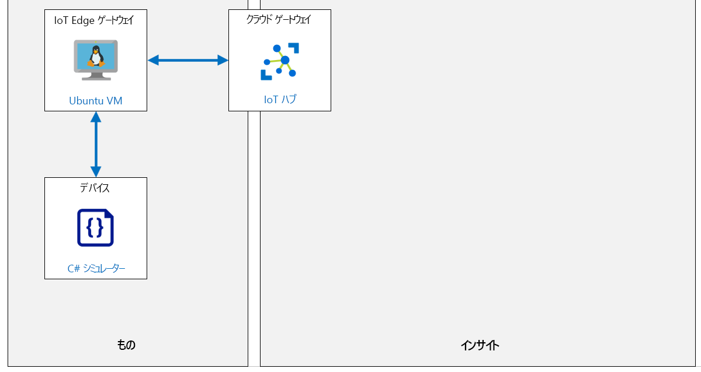

---
lab:
  title: ラボ 14:制限付きネットワークとオフラインで IoT Edge デバイスを実行する
  module: 'Module 7: Azure IoT Edge Module'
ms.openlocfilehash: ed1a6e21e83fc4b9f0fa22edf68da4ac946adf65
ms.sourcegitcommit: b9f2c53cb54dde700e21476bcc7435310d15445d
ms.translationtype: HT
ms.contentlocale: ja-JP
ms.lasthandoff: 04/11/2022
ms.locfileid: "141604970"
---
# <a name="run-an-iot-edge-device-in-restricted-network-and-offline"></a>制限付きネットワークとオフラインで IoT Edge デバイスを実行する

## <a name="lab-scenario"></a>課題シナリオ

Contoso がチーズ用パッケージングおよび出荷設備で導入したコンベア ベルト監視システムは、成果をあげています。 システムは現在、製品利用統計情報を Azure IoT Hub に送信することでベルトの振動レベルを管理し、新しい IoT Edge デバイスはシステムを通過するチーズ パッケージの数をトラッキングすることで在庫管理を支援しています。

管理者は、チーズ製造施設の一部で依然としてよく発生するネットワークの停止に対して、システムの回復性を持たせたいと考えています。 さらに、IT 部署は、ネットワークの負荷分散をするために、重要でない製品利用統計情報を 1 日の特定の時間帯に一括アップロードして、システムを最適化するよう要求しています。

ネットワークが切断された場合に備え、オフライン計画をサポートするような IoT Edge の構成を提案し、センサーからの製品利用統計情報をローカル (デバイス上) に格納し、特定の時刻に同期する Edge デバイスの構成を検討します。

次のリソースが作成されます。



## <a name="in-this-lab"></a>このラボでは

このラボでは、次のタスクを正常に達成します。

* ラボの前提条件を構成する (必要な Azure リソース)
* Azure IoT Edge 対応の Linux VM をデプロイする
* 子 IoT デバイスにより IoT Edge 親デバイスをセットアップする
* IoT Edge デバイスをゲートウェイとして構成する
* Azure CLI を使用して IoT Edge ゲートウェイ デバイスの受信ポートを開く
* IoT Edge ゲートウェイ デバイスの存続可能時間とメッセージ ストアを構成する
* 子 IoT デバイスを IoT Edge ゲートウェイに接続する
* デバイス接続とオフライン サポートをテストする

## <a name="lab-instructions"></a>ラボの手順

### <a name="exercise-1-configure-lab-prerequisites"></a>演習 1:ラボの前提条件を構成する

このラボでは、次の Azure リソースが利用可能であることを前提としています。

| リソースの種類 | リソース名 |
| :-- | :-- |
| リソース グループ | rg-az220 |
| IoT Hub | iot-az220-training-{your-id} |
| IoT Edge デバイス | vm-az220-training-gw0002-{your-id} |
| IoT デバイス | sensor-th-0084 |

これらのリソースを確実に使用できるようにするには、次の手順に従います。

1. 仮想マシン環境で Microsoft Edge ブラウザー ウィンドウを開き、次の Web アドレスに移動します。
 
    +++https://portal.azure.com/#create/Microsoft.Template/uri/https%3A%2F%2Fraw.githubusercontent.com%2FMicrosoftLearning%2FAZ-220-Microsoft-Azure-IoT-Developer%2Fmaster%2FAllfiles%2FARM%2Flab14.json+++

    > **注**:緑色の "T" 記号 (例: +++このテキストを入力+++) が表示されているときはいつでも、関連付けられているテキストをクリックすると、仮想マシン環境内の現在のフィールドに情報が入力されます。

1. Azure portal にログインするように求められた場合は、このコースで使用している Azure 資格情報を入力します。

    **[カスタム デプロイ]** ページが表示されます。

1. **[プロジェクトの詳細]** の **[サブスクリプション]** ドロップダウンで、このコースで使用する [Azure サブスクリプション] が選択されていることを確認します。

1. **[リソース グループ]** ドロップダウンで、 **[rg-az220]** を選択します。

    > **注**:**rg-az220** がリストにない場合:
    >
    > 1. **[リソース グループ]** ドロップダウンで、 **[新規作成]** をクリックします。
    > 1. **[名前]** に「**rg-az220**」と入力します。
    > 1. **[OK]** をクリックします。

1. **[インスタンスの詳細]** の **[リージョン]** ドロップダウンで、最も近いリージョンを選択します。

    > **注**:**rg-az220** グループが既に存在する場合、 **[リージョン]** フィールドは、リソース グループで使用されるリージョンに設定され、読み取り専用になります。

1. **[Your ID]\(ユーザー ID\)** フィールドに、演習 1 で作成した一意の ID を入力します。

1. **[コース ID]** フィールドに、「**az220**」と入力します。

1. **[VM リソース グループ]** フィールドに、「**rg-az220vm**」と入力します。

1. **[管理ユーザー名]** に使用するアカウント名を入力します。

1. **[認証の種類]** フィールドで、 **[パスワード]** を選びます。

1. **[Admin Password Or Key]\(管理者のパスワードまたはキー\)** フィールドに、管理者アカウントで使うパスワードを入力します。

1. テンプレートを検証するには、 **[確認および作成]** をクリックします。

1. 検証に成功したら、 **[作成]** をクリックします。

    デプロイが開始されます。

1. デプロイが完了した後、テンプレートの出力値を確認するには、左側のナビゲーション領域で **[出力]** をクリックします。

    後で使用するために出力をメモしておきます。
    * connectionString
    * deviceConnectionString
    * gatewayConnectionString
    * devicePrimaryKey
    * publicFQDN
    * publicSSH

これで、リソースが作成されました。

> **注**:VM と IoT Edge のプロビジョニングに加えて、ARM テンプレートでは受信トラフィック用のファイアウォール規則も構成され、子デバイスが作成されています。

### <a name="exercise-2-download-device-ca-certificate"></a>演習 2:デバイスの CA 証明書をダウンロードする

この演習では、作成した **vm-az220-training-gw0002-{your-id}** 仮想マシンを探し、生成されたテスト証明書をクラウド シェルにダウンロードします。

#### <a name="task-1-connect-to-the-vm"></a>タスク 1:VM に接続する

1. IoT Edge 仮想マシンが正常にデプロイされたことを確認します。

    Azure portal で通知ウィンドウを確認できます。

1. **rg-az220vm** リソース グループが Azure ダッシュボードに固定されていることを確認します。

    リソース グループをダッシュボードに固定するには、Azure ダッシュボードに移動して、次の手順を実行します。

    * Azure portal メニューで、 **[リソース グループ]** をクリックします。
    * **[リソース グループ]** ブレードの **[名前]** で、**rg-az220vm** リソース グループを見つけます。
    * **rg-az220vm** の行で、ブレードの右側にある **[...]** をクリックした後、 **[ダッシュボードにピン留め]** をクリックします。

    ダッシュボードを編集して、RG タイルとリストに表示されたリソースへのアクセスを容易にすることもできます。

1. Azure portal のツールバーで、 **[Cloud Shell]** をクリックします。

1. Cloud Shell のコマンド プロンプトで、前のタスクで記録した **ssh** コマンド (例: **ssh vmadmin@vm-az220-training-gw0002-dm080321.centralus.cloudapp.azure.com** ) を貼り付けて、**Enter** キーを押します。

1. **[接続を続行しますか?]** というメッセージが表示されたら、「**yes**」と入力して **Enter** キーを押します。

    VM への接続をセキュリティで保護するために使用される証明書が自己署名であるため、このプロンプトがセキュリティの確認となります。 このプロンプトに対する回答は、後続の接続で記憶されます。また、これは最初の接続でのみ表示されます。

1. パスワードを入力するよう求められたら、Edge ゲートウェイ VM がプロビジョニングされる時に作成した管理者パスワードを入力します。

1. 接続されると、ターミナルは次のように Linux VM の名前を表示するように変更されます。 これにより、接続された VM が分かります。

    ``` bash
    username@vm-az220-training-gw0002-{your-id}:~$
    ```

1. 仮想マシンのパブリック IP アドレスを確認するには、次のコマンドを入力します。

    ```bash
    nslookup vm-az220-training-gw0001-{your-id}.centralus.cloudapp.azure.com
    ```

    次のように出力されます。

    ```bash
    Server:         127.0.0.53
    Address:        127.0.0.53#53

    Non-authoritative answer:
    Name:   vm-az220-training-gw0001-{your-id}}.centralus.cloudapp.azure.com
    Address: 168.61.181.131
    ```

    VM のパブリック IP は最後の **Address** の値です (この例では **168.61.181.131**)。

    > **重要**: この IP アドレスを記録しておきます。後で必要になります。 IP アドレスは、通常、VM を再起動するたびに変わります。

#### <a name="task-2-explore-the-iot-edge-configuration"></a>タスク 2:IoT Edge の構成を調べる

VM の初回起動時に、IoT Edge を構成するスクリプトが実行されました。 このスクリプトでは、次の操作が実行されました。

* **aziot-identity-service** パッケージをインストールしました
* **aziot-edge** パッケージをインストールしました
* **config.toml** (IoT Edge の構成ファイル) の初期バージョンを **/etc/aziot/config.toml** にダウンロードしました
* ARM テンプレートの実行時に指定されたデバイス接続文字列を **/etc/aziot/config.toml** に追加しました
* [Iot Edge の Git リポジトリ](https://github.com/Azure/iotedge.git)を **/etc/gw-ssl/iotedge** にクローンしました
* ディレクトリ **/tmp/lab12** を作成し、IoT Edge ゲートウェイの SSL テスト ツールを **/etc/gw-ssl/iotedge** からコピーしました
* テスト SSL 証明書を **/tmp/lab12** に生成し、それを **/etc/aziot** にコピーしました
* 証明書を **/etc/aziot/config.toml** に追加しました
* 更新された **/etc/aziot/config.toml** を IoT Edge ランタイムに適用しました

1. インストールされた IoT Edge のバージョンを確認するには、次のコマンドを入力します。

    ```bash
    iotedge --version
    ```

    これを書いている時点では、インストールされるバージョンは `iotedge 1.2.3` です

1. IoT Edge の構成を表示するには、次のコマンドを入力します。

    ```bash
    cat /etc/aziot/config.toml
    ```

    次のように出力されます。

    ```s
    [provisioning]
    source = "manual"
    connection_string = "HostName=iot-az220-training-dm080221.azure-devices.net;DeviceId=sensor-th-0067;SharedAccessKey=2Zv4wruDViwldezt0iNMtO1mA340tM8fnmxgoQ3k0II="

    [agent]
    name = "edgeAgent"
    type = "docker"

    [agent.config]
    image = "mcr.microsoft.com/azureiotedge-agent:1.2"

    [connect]
    workload_uri = "unix:///var/run/iotedge/workload.sock"
    management_uri = "unix:///var/run/iotedge/mgmt.sock"

    [listen]
    workload_uri = "fd://aziot-edged.workload.socket"
    management_uri = "fd://aziot-edged.mgmt.socket"

    [moby_runtime]
    uri = "unix:///var/run/docker.sock"
    network = "azure-iot-edge"

    trust_bundle_cert = 'file:///etc/aziot/azure-iot-test-only.root.ca.cert.pem'

    [edge_ca]
    cert = 'file:///etc/aziot/iot-edge-device-ca-MyEdgeDeviceCA-full-chain.cert.pem'
    pk = 'file:///etc/aziot/iot-edge-device-ca-MyEdgeDeviceCA.key.pem'
    ```

    セットアップの間に、**connection_string**、**trust_bundle_cert**、**cert**、**pk** の値が更新されました。

1. IoT Edge デーモンが実行されていることを確認するには、次のコマンドを入力します。

    ```bash
    sudo iotedge system status
    ```

    このコマンドでは、次のような出力が表示されます。

    ```bash
    System services:
        aziot-edged             Running
        aziot-identityd         Running
        aziot-keyd              Running
        aziot-certd             Running
        aziot-tpmd              Ready

    Use 'iotedge system logs' to check for non-fatal errors.
    Use 'iotedge check' to diagnose connectivity and configuration issues.
    ```

1. IoT Edge ランタイムが接続されていることを確認するには、次のコマンドを実行します。

    ```bash
    sudo iotedge check
    ```

    これにより、いくつかのチェックが実行され、結果が表示されます。 このラボでは、**構成チェック** の警告/エラーを無視してください。 **接続チェック** は成功し、次のようになります。

    ```bash
    Connectivity checks (aziot-identity-service)
    --------------------------------------------
    √ host can connect to and perform TLS handshake with iothub AMQP port - OK
    √ host can connect to and perform TLS handshake with iothub HTTPS / WebSockets port - OK
    √ host can connect to and perform TLS handshake with iothub MQTT port - OK

    Configuration checks
    --------------------
    ** entries removed for legibility **

    Connectivity checks
    -------------------
    √ container on the default network can connect to IoT Hub AMQP port - OK
    √ container on the default network can connect to IoT Hub HTTPS / WebSockets port - OK
    √ container on the default network can connect to IoT Hub MQTT port - OK
    √ container on the IoT Edge module network can connect to IoT Hub AMQP port - OK
    √ container on the IoT Edge module network can connect to IoT Hub HTTPS / WebSockets port - OK
    √ container on the IoT Edge module network can connect to IoT Hub MQTT port - OK
    ```

    接続が失敗する場合は、**config.toml** で接続文字列の値を再確認してください。

1. VM シェルを終了するには、次のコマンドを入力します。

    ```bash
    exit
    ```

    VM への接続が閉じ、Cloud Shell のプロンプトが表示されます。

#### <a name="task-3-download-ssl-certs"></a>タスク 3:SSL 証明書のダウンロード

次に、**MyEdgeDeviceCA** 証明書を **vm-az220-training-gw0002-{your-id}** 仮想マシンから "ダウンロード" して、リーフ デバイスと IoT Edge ゲートウェイ間の通信を暗号化するために使用できるようにする必要があります。

1. Cloud Shell コマンド プロンプトで、**vm-az220-training-gw0002-{your-id}** 仮想マシンから **Cloud Shell** ストレージに **/tmp/lab12** ディレクトリをダウンロードするには、次のコマンドを入力します。

    ```bash
    mkdir lab12
    scp -r -p <username>@<FQDN>:/tmp/lab12 .
    ```

    > **注**: **<username>** プレースホルダーを VM の管理者ユーザーのユーザー名に置き換え、 **<FQDN>** プレースホルダーを VM の完全修飾ドメイン名に置き換えます。 必要に応じて、SSH セッションを開くために使用されるコマンドを参照してください。
    > `scp -r -p vmadmin@vm-az220-training-edge0001-dm080321.centralus.cloudapp.azure.com:/tmp/lab12 .`

1. プロンプトが表示されたら、VM の管理者パスワードを入力します。

    コマンドが実行されると、SSH 経由で証明書とキー ファイルを含む **/tmp/lab12** ディレクトリのコピーが Cloud Shell ストレージにダウンロードされます。

1. ファイルがダウンロードされたことを確認するには、次のコマンドを入力します。

    ```bash
    cd lab12
    ls
    ```

    次の一覧表示されたファイルを確認する必要があります。

    ```bash
    certGen.sh  csr        index.txt.attr      index.txt.old  openssl_root_ca.cnf  serial
    certs       index.txt  index.txt.attr.old  newcerts       private              serial.old
    ```

    ファイルが **vm-az220-training-gw0002-{your-id}** 仮想マシンから Cloud Shell ストレージにコピーされたら、必要に応じて、任意の IoT Edge デバイス証明書とキー ファイルをローカル コンピューターに簡単にダウンロードできるようになります。 ファイルは `download <filename>` コマンドを使って Cloud Shell からダウンロードできます。 ラボの後半でこれを行います。

1. このラボの後半で使うルート証明書をダウンロードするには、次のコマンドを入力します。

    ```bash
    download ~/lab12/azure-iot-test-only.root.ca.cert.pem
    ```

### <a name="exercise-3-configure-iot-edge-device-time-to-live-and-message-storage"></a>演習 3:IoT Edge デバイスの Time to Live とメッセージの記憶域を構成する

拡張オフライン シナリオ用に IoT Edge デバイスを構成するには、オフラインになる可能性のあるサポートされている期間 (Time-to-Live と呼ばれることが多い) の指定、およびローカル ストレージ設定の指定が含まれます。

Time-to-Live (TTL) の既定値は `7200` (7200 秒、つまり 2 時間) です。 これは迅速な中断には十分な時間ですが、デバイスまたはソリューションが長期間オフラインモードで機能する必要がある場合、2 時間が十分に長くない場合があります。 長期間にわたって切断された状態が発生する可能性がある場合に、ソリューションが製品利用統計情報を失わずに動作するよう、IoT Edge ハブ モジュールの TTL プロパティを最大 1,209,600 秒 (2 週間の TTL 期間) に構成できます。

IoT Edge Hub モジュール (`$edgeHub`) は、Azure IoT Hub サービスとゲートウェイ デバイスで実行されている IoT Edge Hub 間の通信を調整するために使用されます。 モジュール ツインの必要なプロパティ内にある、`storeAndForwardConfiguration.timeToLiveSecs` プロパティで、Azure IoT Hub サービスなどのルーティング エンドポイントから切断された状態のときに IoT Edge Hub がメッセージを保持する時間を秒単位で指定します。 Edge ハブの `timeToLiveSecs` プロパティは、特定のデバイスの配置マニフェストで、単一デバイスまたは大規模なデプロイの一部として指定できます。

IoT Edge デバイスは、切断/オフライン状態の場合に自動的にメッセージを保存します。 ストレージの場所は、`HostConfig` オブジェクトを使用して構成できます。

この演習では、Azure IoT Hub の Azure portal ユーザー インターフェイスを使用して、単一の IoT Edge ゲートウェイ デバイスにある Edge Hub (`$edgeHub`) モジュールの `timeToLiveSecs` プロパティを変更します。 また、メッセージが保存される IoT Edge デバイス上の保存場所も構成します。

#### <a name="task-1-configure-the-edgehub-module-twin"></a>タスク 1:$edgeHub モジュール ツインを構成する

1. 必要な場合は、お使いの Azure アカウントの資格情報を使用して Azure portal にログインします。

    複数の Azure アカウントをお持ちの場合は、このコースで使用するサブスクリプションに関連付けられているアカウントを使用してログインしていることを確認してください。

1. **rg-az220** リソース グループのタイルで、**iot-az220-training-{your-id}** をクリックします

1. [IoT Hub] ブレードの左側のメニューで、 **[デバイス管理]** で、 **[IoT Edge]** をクリックします。

    このウィンドウでは、IoT Hub に接続されている IoT Edge デバイスを管理することができます。

1. **[デバイス ID]** で **[vm-az220-training-gw0002-{your-id}]** をクリックします。

1. **[モジュール]** の **[$edgeHub]** をクリックします。

    **Edge ハブ** モジュールの [モジュール ID の詳細] ブレードでは、IoT Edge デバイスのモジュール ID ツインおよびその他のリソースにアクセスできます。

1. **[モジュール ID の 詳細]** ブレードで、 **[モジュール ID ツイン]** をクリックします。

    このブレードには、エディター ウィンドウに JSON として表示される `vm-az220-training-gw0002-{your-id}/$edgeHub` のモジュール ID ツインが含まれています。

1. $edgeHub モジュール ID ツインの内容を確認してください。

    これは新しいデバイスなので、目的のプロパティは基本的に空であることに注意してください。

1. **[モジュール ID ツイン]** ブレードを閉じます。

1. **[vm-az220-training-gw0002-{your-id}]** ブレードに戻ります。

1. ブレードの上部で、 **[モジュールの設定]** をクリックします。

    **[デバイスでのモジュールの設定]** ブレードを使用すると、この IoT Edge デバイスに展開される IoT Edge モジュールを作成して構成できます。

1. **[モジュールの設定]** ブレードの **[IoT Edge モジュール]** で、 **[ランタイム設定]** をクリックします。

1. **[ランタイム設定]** ペインで、 **[Edge ハブ]** タブを選びます。

1. **[ストア アンド フォワードの構成 - Time to Live (秒)]** フィールドを見つけます。

1. **[ストア アンド フォワードの構成 - Time to Live (秒)]** テキストボックスに、**1209600** と入力します

    これは、IoT Edge デバイスのメッセージの存続可能時間の値 2 週間を指定します。これは、最大時間です。

    > **注**:Edge ハブ (`$edgeHub`) モジュールで **メッセージの有効期限** (TTL) を構成する場合は、いくつかの点を考慮する必要があります。 IoT Edge デバイスが切断されている場合、メッセージはローカル デバイスに保存されます。 TTL 期間中に保存されるデータ量を計算し、その量のデータに対して十分な記憶域がデバイスにあることを確認する必要があります。 重要なデータが失われないようにするには、ストレージの量と構成する TTL がソリューションの要件を満たしている必要があります。
    >
    > デバイスに十分な記憶域がない場合は、より短い TTL を構成する必要があります。 メッセージの格納期間が TTL の時間制限に達すると、まだ Azure IoT Hub に送信されていない場合は削除されます。

    IoT Edge デバイスは、切断/オフライン状態の場合に自動的にメッセージを保存します。 ストレージの場所は、`HostConfig` オブジェクトを使用して構成できます。

1. **[環境変数]** 領域を見つけます。

    メッセージの保存場所の構成を完了するには、新しい環境変数を追加する必要があります。

1. **[環境変数]** の **[名前]** テキストボックスに「**storageFolder**」と入力します

1. **[環境変数]** の **[値]** テキストボックスに「**/iotedge/storage/**」と入力します

1. **[コンテナーの作成オプション]** フィールドを見つけます。

    このフィールドには、構成可能な `HostConfig` JSON オブジェクトが含まれていることに注意してください。 `HostConfig` プロパティと環境変数を作成して、Edge デバイスの保存場所を構成します。

1. `HostConfig` オブジェクトの `PortBindings` プロパティの閉じかっこの下に、次の `Binds` プロパティを追加します。

    ```json
    "Binds": [
        "/etc/aziot/storage/:/iotedge/storage/"
    ]
    ```

    > **注**:`PortBindings` プロパティと `Binds` プロパティは必ずコンマで区切ります。

    **[作成オプション]** テキストボックスの結果の JSON は、次のようになります。

    ```json
    {
        "HostConfig": {
            "PortBindings": {
                "443/tcp": [
                {
                    "HostPort": "443"
                }
                ],
                "5671/tcp": [
                {
                    "HostPort": "5671"
                }
                ],
                "8883/tcp": [
                {
                    "HostPort": "8883"
                }
                ]
            },
            "Binds": [
                "/etc/aziot/storage/:/iotedge/storage/"
            ]
        }
    }
    ```

    この `Binds` 値によって、Edge ハブ モジュールの Docker コンテナー内の `/iotedge/storage/` ディレクトリが、物理的な IoT Edge デバイス上の `/etc/aziot/storage/` ホスト システム ディレクトリにマップされるように構成されます。

    この値は `<HostStoragePath>:<ModuleStoragePath>` の形式です。 `<HostStoragePath>` 値は、IoT Edge デバイス上のホスト ディレクトリの場所です。 `<ModuleStoragePath>` は、コンテナー内で使用可能なモジュール記憶域のパスです。 これらの値はどちらも絶対パスを指定する必要があります。

1. **[ランタイム設定]** ペインの下部にある **[適用]** をクリックします。

1. **[デバイスにモジュールを設定する]** ブレードで **[Review + create]** をクリックします。

1. 配置マニフェストの内容を確認してください。

    配置マニフェスト内で更新プログラムを見つけます。 これを見つけるには、`$edgeAgent` と `$edgeHub` の両方をチェックする必要があります。

1. ブレードの下部にある **[作成]** をクリックします。

    変更が保存されると、モジュール構成の変更が **IoT Edge デバイス** に通知され、それに応じてデバイスで新しい設定が再構成されます。

    変更が Azure IoT Edge デバイスに渡されると、新しい構成で **edgeHub** モジュールが再起動されます。

    >**注**: **[モジュール]** 一覧で、 **$edgeHub** モジュールの **[ランタイムの状態]** にエラーが表示されます。

1. エラー メッセージを確認するには、 **[エラー]** をクリックします。

    **[トラブルシューティング]** ページにエラー ログが表示されます。 これには、次のような例外が含まれます。

    ```log
    Unhandled exception. System.AggregateException: One or more errors occurred. (Access to the path '/iotedge/storage/edgeHub' is denied.)
    ```

    次のタスクでは、このエラーを解決します。

#### <a name="task-2-update-directory-permissions"></a>タスク 2:ディレクトリのアクセス許可を更新する

続行する前に、IoT Edge ハブ モジュールのユーザー プロファイルに、 **/etc/aziot/storage/** ディレクトリに対する必要な読み取り、書き込み、および実行のアクセス許可があることを確認する必要があります。

1. Azure portal のツールバーで、 **[Cloud Shell]** をクリックします。

1. Cloud Shell のコマンド プロンプトで、前のタスクで記録した **ssh** コマンド (例: **ssh vmadmin@vm-az220-training-gw0002-dm080321.centralus.cloudapp.azure.com** ) を貼り付けて、**Enter** キーを押します。

1. **[接続を続行しますか?]** というメッセージが表示されたら、「**yes**」と入力して **Enter** キーを押します。

    VM への接続をセキュリティで保護するために使用される証明書が自己署名であるため、このプロンプトがセキュリティの確認となります。 このプロンプトに対する回答は、後続の接続で記憶されます。また、これは最初の接続でのみ表示されます。

1. パスワードを入力するよう求められたら、Edge ゲートウェイ VM がプロビジョニングされる時に作成した管理者パスワードを入力します。

1. 接続されると、ターミナルは次のように Linux VM の名前を表示するように変更されます。 これにより、接続された VM が分かります。

    ``` bash
    username@vm-az220-training-gw0002-{your-id}:~$
    ```

1. 実行中の IoT Edge モジュールを表示するには、次のコマンドを入力します。

    ```bash
    iotedge list
    ```

1. `iotedge list` コマンドの出力を確認してください。

    *edgeHub* が起動に失敗したことがわかるはずです。

    ```text
    NAME             STATUS           DESCRIPTION                 CONFIG
    edgeAgent        running          Up 4 seconds                mcr.microsoft.com/azureiotedge-agent:1.1
    edgeHub          failed           Failed (139) 0 seconds ago  mcr.microsoft.com/azureiotedge-hub:1.1
    ```

    これは、 **/etc/aziot/storage/** ディレクトリに書き込むアクセス許可が *edgeHub* プロセスにないためです。

1. ディレクトリのアクセス許可に関する問題を確認するために、次のコマンドを入力します。

    ```bash
    iotedge logs edgeHub
    ```

    ターミナルに現在のログが出力されます。ログをスクロールすると、次のような関連するエントリが表示されます。

    ```text
    Unhandled Exception: System.AggregateException: One or more errors occurred. (Access to the path '/iotedge/storage/edgeHub' is denied.) ---> System.UnauthorizedAccessException: Access to the path '/iotedge/storage/edgeHub' is denied. ---> System.IO.IOException: Permission denied
    ```

1. ディレクトリのアクセス許可を更新するには、次のコマンドを入力します。

    ```sh
    sudo chown $( whoami ):iotedge /etc/aziot/storage/
    sudo chmod 775 /etc/aziot/storage/
    ```

    最初のコマンドは、ディレクトリの所有者を現在のユーザーに設定し、所有しているユーザー グループを **iotedge** に設定します。 2 番目のコマンドは、現在のユーザーと **iotedge** グループのメンバーの両方へのフル アクセスを有効にします。 これにより、*edgeHub* モジュールは **/etc/iotedge/storage/** ディレクトリ内でディレクトリとファイルを作成できるようになります。

    > **注**:"**chown: '/etc/iotedge/storage/' にアクセスできません:ファイルまたはディレクトリが存在しません**" というエラーが表示された場合、次のコマンドを使ってディレクトリを作成してから、上記のコマンドを再実行します。

    ```sh
    sudo mkdir /etc/iotedge/storage
    ```

1. *edgeHub* モジュールを再起動して、起動されていることを確認するには、次のコマンドを入力します。

    ```bash
    iotedge restart edgeHub
    iotedge list
    ```

    >**注**:再起動するモジュール名は、大文字と小文字が区別されます - **edgeHub**

    *edgeHub* モジュールが実行されているはずです。

    ```text
    NAME             STATUS           DESCRIPTION      CONFIG
    edgeAgent        running          Up 13 minutes    mcr.microsoft.com/azureiotedge-agent:1.1
    edgeHub          running          Up 6 seconds     mcr.microsoft.com/azureiotedge-hub:1.1
    ```

これで、IoT１デバイス (子/リーフ) をこの IoT Edge Gateway デバイスに接続する準備が整いました。

### <a name="exercise-4-connect-child-iot-device-to-iot-edge-gateway"></a>演習 4:子 IoT デバイスを IoT Edge ゲートウェイに接続する

対称キーを使用して通常の IoT デバイスを IoT Hub に対して認証するプロセスは、ダウンストリーム (または子/リーフ) デバイスにも適用されます。 唯一の違いは、接続をルーティングするためのゲートウェイ デバイスへのポインターを追加するか、またはオフライン シナリオでは IoT Hub に代わって認証を処理する必要があることです。

> **注**:ラボで以前に保存した **sensor-th-0084** の接続文字列値を使用します。 接続文字列の新しいコピーが必要な場合は、Azure portal の Azure IoT Hub からアクセスできます。 IoT Hub の **[IoT デバイス]** ウィンドウを開き、**sensor-th-0084** をクリックして **[プライマリ接続文字列]** をコピーし、テキスト ファイルに保存します。

#### <a name="task-1-create-hosts-file-entry"></a>タスク 1:hosts ファイルのエントリを作成する

このラボの以前のバージョンでは、デバイスの connectionString の **GatewayHostName** からの値として FQDN が使用されましたが、現在のバージョンのテスト スクリプトによって生成されるテスト x509 証明書では、これはサポートされなくなっています。 代わりに、ホスト名のみが使われ、ホスト名を IP アドレスに解決するために、ローカル コンピューターの **hosts** ファイルにエントリを作成する必要があります。 次の手順のようにして、hosts ファイルに必要なエントリを追加します。

1. Visual Studio Code を開きます。

1. **[ファイル]** メニューの **[ファイルを開く]** をクリックします。

1. フォルダー **c:\\Windows\\System32\\Drivers\\etc\\** ファイルに移動し、**hosts** ファイルを開きます。

    > **注**: **hosts** ファイルに拡張子はありません。

1. **hosts** ファイルに次の行を追加し、その後に空の行を追加します。

    ```text
    {VM Public IP Address} vm-az220-training-gw0002-{your-id}
    {blank line}
    ```

    たとえば、オブジェクトに適用された

    ```text
    168.61.181.131 vm-az220-training-gw0002-dm090821

    ```

1. ファイルを保存します。保存失敗のプロンプトが表示されたら、 **[管理者権限で再試行...]** をクリックし、 **[ユーザー アカウント制御]** ダイアログで **[はい]** をクリックします。

ローカル コンピューターで VM 名を適切な IP アドレスに解決できるようになります。

#### <a name="task-1-configure-device-app"></a>タスク 1:デバイス アプリの構成

このタスクでは、対称キーを使用して IoT Hub に接続するようにダウンストリーム IoT デバイス (子デバイスまたはリーフ デバイス) を構成します。 デバイスは、(親 IoT Edge デバイスのゲートウェイ ホスト名に加えて) 対称キーを含む接続文字列を使用して IoT Hub と親 IoT Edge デバイスに接続するように構成されます。

1. Windows **エクスプローラー** アプリを開き、 **[ダウンロード]** フォルダーに移動します。

    [ダウンロード] フォルダーには、IoT Edge ゲートウェイを構成したときにダウンロードされた X.509 証明書ファイルが含まれているはずです。 この証明書ファイルを IoT デバイス アプリのルート ディレクトリにコピーする必要があります。

1. **[ダウンロード]** フォルダーで **azure-iot-test-only.root.ca.cert.pem** を右クリックし、 **[コピー]** をクリックします。

    > **注**:ダウンロード フォルダーにすでに azure-iot-test-only.root.ca.cert.pem ファイルがある場合、必要なファイルの名前は azure-iot-test-only.root.ca.cert (1).pem になります。 宛先フォルダーに追加したら、名前をazure-iot-test-only.root.ca.cert.pem に変更する必要があります。

    このファイルは、ダウンロードした X.509 証明書ファイルで、 '/Starter/ChildIoTDevice' ディレクトリ (子 IoT デバイスのソース コードが存在するディレクトリ) に追加されます。

1. ラボ 14 のスターター フォルダーに移動し、コピーしたファイルを **ChildIoTDevice** フォルダーに貼り付けます。

1. コピーした証明書ファイルの名前が **azure-iot-test-only.root.ca.cert.pem** であることを確認します

    ダウンロード フォルダーにすでに azure-iot-test-only.root.ca.cert.pem ファイルがある場合、必要なファイルの名前は azure-iot-test-only.root.ca.cert (1).pem である可能性があります。

1. Visual Studio Code の新しいインスタンスを開きます。

1. **[ファイル]** メニューで、 **[フォルダーを開く]** をクリックします。

1. **[フォルダーを開く]** ダイアログで、ラボ 14 **[スターター]** フォルダーに移動し、 **[ChildIoTDevice]** をクリックしてから **[フォルダーの選択]** をクリックします。

    [エクスプローラー] ペインにプロジェクト ファイルが一覧表示されるはずです。

1. Visual Studio Code **[エクスプローラー]** ペインで、 **[Program.cs]** をクリックします。

1. **[Program.cs]** ファイルで、**connectionString** 変数の宣言を探します。

1. プレースホルダーの値を **sensor-th-0084** IoT デバイスのプライマリ接続文字列に置き換えます。

1. 割り当てられた **connectionString** 値を **GatewayHostName** プロパティに追加し、GatewayHostName の値を IoT Edge ゲートウェイ デバイスの名前に設定します。 これは、このラボで前に hosts ファイルで指定した名前と一致する必要があります。

    完成した接続文字列値は、次の形式に一致する必要があります。

    ```text
    HostName=<IoT-Hub-Name>.azure-devices.net;DeviceId=sensor-th-0072;SharedAccessKey=<Primary-Key-for-IoT-Device>;GatewayHostName=<Name-for-IoT-Edge-Device>
    ```

    上記のプレースホルダーを適切な値に置き換えてください。

    * **\<IoT-Hub-Name\>** :Azure IoT Hub の名前。
    * **\<Primary-Key-for-IoT-Device\>** : Azure IoT Hub の **sensor-th-0084** IoT デバイスの主キー。
    * **\<DNS-Name-for-IoT-Edge-Device\>** : **vm-az220-training-gw0002-{your-id}** Edge デバイスのホスト名。

    **connectionString** 変数割り当てコードは、次のようになります。

    ```csharp
    private readonly static string connectionString = "HostName=iot-az220-training-1119.azure-devices.net;DeviceId=sensor-th-0084;SharedAccessKey=ygNT/WqWs2d8AbVD9NAlxcoSS2rr628fI7YLPzmBdgE=;GatewayHostName=vm-az220-training-gw0002-{your-id}";
    ```

1. **[ファイル]** メニューの **[保存]** をクリックします。

1. **[表示]** メニューの **[ターミナル]** をクリックします。

    **ターミナル** コマンド プロンプトに、`/Starter/ChildIoTDevice` ディレクトリが表示されていることを確認します。

1. **ChildIoTDevice** のシミュレートされたデバイスをビルドして実行するには、次のコマンドを入力します。

    ```cmd/sh
    dotnet run
    ```

    > **注**:アプリがローカル コンピューターに **X.509 証明書** をインストールすると (それを使用して IoT Edge ゲートウェイを認証できるようになります)、証明書をインストールするかどうか確認するポップアップ ウィンドウが表示されることがあります。 **[はい]** をクリックして、アプリが認定資格証をインストールできるようにします。

1. ターミナルに表示される出力に注意してください。

    シミュレートされたデバイスが実行されると、コンソールの出力に、Azure IoT Edge ゲートウェイに送信されているイベントが表示されます。

    ターミナル出力は次のようになります。

    ```cmd/sh
    IoT Hub C# Simulated Cave Device. Ctrl-C to exit.

    User configured CA certificate path: azure-iot-test-only.root.ca.cert.pem
    Attempting to install CA certificate: azure-iot-test-only.root.ca.cert.pem
    Successfully added certificate: azure-iot-test-only.root.ca.cert.pem
    11/27/2019 4:18:26 AM > Sending message: {"temperature":21.768769073192388,"humidity":79.89793652663843}
    11/27/2019 4:18:27 AM > Sending message: {"temperature":28.317862208149332,"humidity":73.60970909409677}
    11/27/2019 4:18:28 AM > Sending message: {"temperature":25.552859350830715,"humidity":72.7897707153064}
    11/27/2019 4:18:29 AM > Sending message: {"temperature":32.81164186439088,"humidity":72.6606041624493}
    ```

1. 次の演習に進むときは、シミュレートされたデバイスを実行したままにします。

#### <a name="task-2-test-device-connectivity-and-offline-support"></a>タスク 2:デバイス接続とオフライン サポートをテストする

このタスクでは、**vm-az220-training-gw0002-{your-id}** の IoT Edge の透過的なゲートウェイを介して Azure IoT Hub に送信されている **sensor-th-0084** からのイベントを監視します。 次に、**vm-az220-training-gw0002-{your-id}** と Azure IoT Hub の間の接続を中断し、テレメトリが子 IoT デバイスから IoT Edge ゲートウェイに今もなお送信されることを確認します。 この後、Azure IoT Hub との接続を再開し、IoT Edge ゲートウェイが Azure IoT Hub への製品利用統計情報の送信を再開することを監視します。

1. 必要な場合は、お使いの Azure アカウントの資格情報を使用して Azure portal にログインします。

    複数の Azure アカウントをお持ちの場合は、このコースで使用するサブスクリプションに関連付けられているアカウントを使用してログインしていることを確認してください。

1. Azure portal のツール バーで、 **[Cloud Shell]** をクリックします。

    環境 ドロップダウンが **Bash** に設定されていることを確認します。

1. Cloud Shell コマンド プロンプトで、Azure IoT Hub によって受信されるイベントの監視を開始するには、次のコマンドを入力します。

    ```cmd/sh
    az iot hub monitor-events --hub-name iot-az220-training-{your-id}
    ```

    `{your-id}` プレースホルダーは、Azure IoT Hub インスタンスの一意のサフィックスに置き換えてください。

1. Azure IoT Hub に送信される **sensor-th-0084** から得られる製品利用統計情報に注意してください。

    **sensor-th-0084** のシミュレートされたデバイス アプリケーションは、製品利用統計情報を **vm-az220-training-gw0002-{your-id}** IoT Edge 透過ゲートウェイ仮想マシンに送信するように構成されており、その後、製品利用統計情報は Azure IoT Hub に送信される点に留意してください。

    Cloud Shell は、次のようなイベント メッセージの表示を開始します。

    ```text
    Starting event monitor, use ctrl-c to stop...
    {
        "event": {
            "origin": "sensor-th-0072",
            "module": "",
            "interface": "",
            "component": "",
            "payload": "{\"temperature\":29.995470051651573,\"humidity\":70.47896838303608}"
        }
    }
    {
        "event": {
            "origin": "sensor-th-0072",
            "module": "",
            "interface": "",
            "component": "",
            "payload": "{\"temperature\":28.459910635584922,\"humidity\":60.49697355390386}"
        }
    }
    ```

    > **注**:次に、 **オフライン** 機能をテストする必要があります。 これを行うには、**vm-az220-training-gw0002-{your-id}** デバイスをオフラインにする必要があります。 これは Azure で実行されている仮想マシンであるため、 VM の **ネットワーク セキュリティ グループ** に **アウトバウンド規則** を追加することで、シミュレートすることができます。

#### <a name="task3-add-rule-to-block-traffic"></a>タスク 3:トラフィックをブロックするルールの追加

1. **Azure portal** で、ダッシュボードに移動し **rg-az220vm** リソース グループ タイルを表示します。

1. リソースの一覧で、**vm-az220-training-gw0002-{your-id}** 仮想マシンの **ネットワーク セキュリティ グループ** を開くには、**nsg-vm-az220-training-gw0002-{your-id}** をクリックします。

1. **[ネットワーク セキュリティ グループ]** ブレードで、 **[設定]** の下にあるナビゲーション ウィンドウ左側の、 **[アウトバウンドセキュリティ規則]** をクリック します。

1. ブレードの上部にある **[+ 追加]** をクリックします。

1. **[送信セキュリティ規則の追加]** ペインで、次のフィールド値を設定します。

    * 宛先ポート範囲: **\***
    * アクション:**拒否**
    * 優先順位:100
    * 名前:**DenyAll**

    **[宛先ポート範囲]** を " **\*** " に設定すると、すべてのポートに規則が適用されます。

1. ブレードの最下部で、 **[追加]** をクリックします。

1. Azure portal の **Cloud Shell** に戻ります。

1. `az iot hub monitor-events` コマンドがまだ実行中である場合は、**Ctrl + C** キーを押して終了します。

1. Cloud Shell コマンド プロンプトで、`ssh` を使用して **vm-az220-training-gw0002-{your-id}** VM に接続するには、次のコマンドを入力します。

    ```sh
    ssh <username>@<ipaddress>
    ```

    プレースホルダーは、`ssh` コマンドに必要な値に置き換えてください。

    | プレースホルダー | 置き換える値 |
    | :--- | :--- |
    | `<username>` | **IoTEdgeGateaway** 仮想マシンの管理者 **ユーザー名**。 これは **vmadmin** でなくてはなりません。
    | `<ipaddress>` | **vm-az220-training-gw0002-{your-id}** 仮想マシンの **パブリック IP アドレス**。

1. プロンプトが表示されたら、**vm-az220-training-gw0002-{your-id}** の管理者 **パスワード** を入力します。

    `ssh` 経由で **vm-az220-training-gw0002-{your-id}** VM に接続すると、コマンド プロンプトが更新されます。

1. IoT Edge ランタイムをリセットするには、次のコマンドを入力します。

    ```sh
    sudo iotedge system restart
    ```

    これにより、IoT Edge ランタイムは Azure IoT Hub サービスから強制的に切断され、再接続を試みます。

1. *edgeHub* モジュールが正常に再起動したことを確認するには、次のコマンドを入力します。

    ```bash
    iotedge list
    ```

    *edgeHub* モジュールの再起動に失敗した場合は、次のコマンドを入力して再試行します。

    ```bash
    iotedge restart edgeHub
    iotedge list
    ```

1. **vm-az220-training-gw0002- {your-id}** との `ssh` セッションを終了するには、次のコマンドを入力します。

    ```cmd/sh
    exit
    ```

1. Cloud Shell コマンド プロンプトで、Azure IoT Hub によって受信されるイベントの監視を開始するには、次のコマンドを入力します。

    ```cmd/sh
    az iot hub monitor-events --hub-name iot-az220-training-{your-id}
    ```

    `{your-id}` プレースホルダーは、Azure IoT Hub インスタンスの一意のサフィックスに置き換えてください。

1. **Azure IoT Hub** によって受信されているイベントがなくなったことがわかります。

1. [Visual Studio Code] ウィンドウに切り替えます。

1. **sensor-th-0084** のシミュレートされたデバイス アプリケーションが実行されている **ターミナル** を開き、デバイスの製品利用統計情報がまだ **vm-az220-training-gw0002-{your-id}** に送信されていることを確認します。

    この時点で **vm-az220-training-gw0002-{your-id}** は Azure IoT Hub から切断されます。 引き続き **sensor-th-0084** による接続を認証し、子デバイスからデバイス製品利用統計情報を受信します。 この間、IoT Edge ゲートウェイは、子デバイスからのイベント テレメトリを、構成に従って IoT Edge ゲートウェイ デバイスの記憶域に保存します。

1. **[Azure portal]** ウィンドウに切り替えます。

1. **vm-az220-training-gw0002-{your-id}** の **[ネットワーク セキュリティ グループ]** ブレードに戻ります。

1. 左側のナビゲーション メニューの **[設定]** で、 **[送信セキュリティ規則]** をクリックします。

1. **[送信セキュリティ規則]** ウィンドウで **[DenyAll]** をクリックします。

1. **[DenyAll]** ウィンドウで、NSG からこの拒否規則を削除するには、 **[削除]** をクリックします。

1. **[セキュリティ規則の削除]** プロンプトで、**[はい]** をクリックします。

    **vm-az220-training-gw0002-{your-id}** IoT Edge 透過ゲートウェイは Azure IoT Hub との接続を再開できるようになると、接続されているすべての子デバイスからのイベント製品利用統計情報を同期します。 これには、切断中に送信できずに保存された製品利用統計情報と、ゲートウェイに送信中のすべての製品利用統計情報が含まれます。

    > **注**:IoT Edge ゲートウェイ デバイスが Azure IoT Hub に再接続し、テレメトリの送信を再開するまでには数分かかる場合があります。 待機すると、`az iot hub monitor-events` コマンドの出力に再びイベントが表示されます。

このラボでは、Azure IoT Edge ゲートウェイが IoT Hub への接続が中断されたために送信できないメッセージを保持するのに、ローカル ストレージを利用することを実演しました。 接続が再確立されると、メッセージが送信されるのがわかりました。

> **注**:ラボの作業が完了したら、ターミナルで **Ctrl + C** キーを押して、デバイス シミュレーション アプリケーションを終了します。
