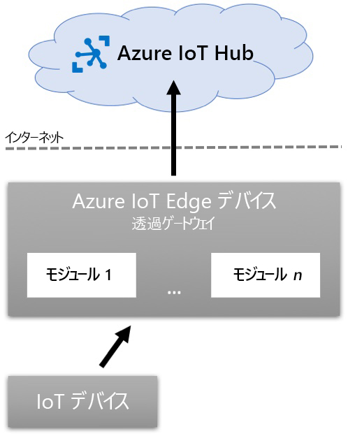

---
lab:
    title: 'ラボ 14: 制限付きネットワークとオフラインで IoT Edge デバイスを実行する'
    module: 'モジュール 7: Azure IoT Edge モジュール'
---

# 制限付きネットワークとオフラインで IoT Edge デバイスを実行する

## ラボ シナリオ

Contoso がチーズ用パッケージングおよび出荷設備で導入したコンベア ベルト監視システムは、成果をあげています。システムは現在、製品利用統計情報を Azure IoT Hub に送信することでベルトの振動レベルを管理し、新しい IoT Edge デバイスはシステムを通過するチーズ パッケージの数をトラッキングすることで在庫管理を支援しています。

管理者は、チーズ製造施設の一部で依然としてよく発生するネットワークの停止に対して、システムの回復性を持たせたいと考えています。さらに、IT 部署は、ネットワークの負荷分散をするために、重要でない製品利用統計情報を 1 日の特定の時間帯に一括アップロードして、システムを最適化するよう要求しています。

ネットワークが切断された場合に備え、オフライン計画をサポートするような IoT Edge の構成を提案し、センサーからの製品利用統計情報をローカル (デバイス上) に格納し、特定の時刻に同期する Edge デバイスの構成を検討します。

次のリソースが作成されます。


## このラボでは

このラボでは、次のタスクを正常に達成します。

* ラボの前提条件が満たされていることを確認する (必要な Azure リソースがあること)

  * スクリプトは、必要に応じて IoT Hub を作成します。
  * スクリプトは、このラボに必要な新しいデバイス ID を作成します。

* Azure IoT Edge 対応の Linux VM をデプロイする
* 子 IoT デバイスにより IoT Edge 親デバイスをセットアップする
* IoT Edge デバイスをゲートウェイとして構成する
* Azure CLI を使用して IoT Edge ゲートウェイ デバイスの受信ポートを開く
* IoT Edge ゲートウェイ デバイスの存続可能時間とメッセージ ストアを構成する
* 子 IoT デバイスを IoT Edge ゲートウェイに接続する
* デバイス接続とオフライン サポートをテストする

## ラボの手順

### 演習 1: ラボの前提条件を確認する

このラボでは、次の Azure リソースが利用可能であることを前提としています。

| リソースの種類 | リソース名 |
| :-- | :-- |
| リソース グループ | rg-az220 |
| IoT Hub | iot-az220-training-{your-id} |
| IoT デバイス | sensor-th-0050 |

> **重要**: セットアップ スクリプトを実行して、必要なデバイスを作成します。

不足しているリソースと新しいデバイスを作成するには、演習 2 に進む前に、以下の手順に従って **lab14-setup.azcli** スクリプトを実行する必要があります。スクリプト ファイルは、開発環境構成 (ラボ 3) の一部としてローカルに複製した GitHub リポジトリに含まれています。

**lab14-setup.azcli** スクリプトは、**Bash** シェル環境で実行するために記述されています。Azure Cloud Shell でこれを実行するのが、最も簡単な方法です。

> **注:** **sensor-th-0050** デバイスの接続文字列が必要です。このデバイスが Azure IoT Hub に登録されている場合は、Azure Cloud Shell で次のコマンドを実行して接続文字列を取得できます。

```bash
az iot hub device-identity connection-string show --hub-name iot-az220-training-{your-id} --device-id sensor-th-0050 -o tsv
```

#### タスク 1: セットアップ スクリプトを実行する

1. ブラウザーを使用して [Azure Cloud Shell](https://shell.azure.com/) を開き、このコースで使用している Azure サブスクリプションでログインします。

    Cloud Shell のストレージの設定に関するメッセージが表示された場合は、デフォルトをそのまま使用します。

1. Cloud Shell が **Bash** を使用していることを確認します。

    「Azure Cloud Shell」 ページの左上隅にあるドロップダウンは、環境を選択するために使用されます。選択されたドロップダウンの値が **Bash** であることを確認します。

1. Cloud Shell ツール バーで、「**ファイルのアップロード/ダウンロード**」 をクリックします(右から 4番目のボタン)。

1. ドロップダウンで、「**アップロード**」 をクリックします。

1. ファイル選択ダイアログで、開発環境を構成したときにダウンロードした GitHub ラボ ファイルのフォルダーの場所に移動します。

    _ラボ 3: 開発環境の設定_:ZIP ファイルをダウンロードしてコンテンツをローカルに抽出することで、ラボ リソースを含む GitHub リポジトリを複製しました。抽出されたフォルダー構造には、次のフォルダー パスが含まれます。

    * すべてのファイル
      * ラボ
          * 14 - 制限されたネットワークおよびオフラインでの IoT Edge デバイスの実行
            * 設定

    lab14-setup.azcli スクリプト ファイルは、ラボ 14 の設定フォルダー内にあります。

1. **lab14-setup.azcli** ファイルを選択し、「**開く**」 をクリックします。

    ファイルのアップロードが完了すると、通知が表示されます。

1. 正しいファイルが Azure Cloud Shell にアップロードされたことを確認するには、次のコマンドを入力します。

    ```bash
    ls
    ```

    `ls` コマンドを使用して、現在のディレクトリの内容を表示します。一覧にある lab14-setup.azcli ファイルを確認できるはずです。

1. セットアップ スクリプトを含むこのラボのディレクトリを作成し、そのディレクトリに移動するには、次の Bash コマンドを入力します。

    ```bash
    mkdir lab14
    mv lab14-setup.azcli lab14
    cd lab14
    ```

1. **lab14-setup.azcli** に実行権限があることを確認するには、次のコマンドを入力します。

    ```bash
    chmod +x lab14-setup.azcli
    ```

1. Cloud Shell ツールバーで、lab14-setup.azcli ファイルへのアクセスを有効にするには、「**エディターを開く**」 (右から 2 番目のボタン - **{ }**) をクリックします。

1. 「**ファイル**」 の一覧で、lab14 フォルダーを展開してスクリプト ファイルを開くには、「**lab14**」 をクリックし、「**lab14-setup.azcli**」 をクリックします。

    エディタは **lab14-setup.azcli** ファイルの内容を表示します。

1. エディターで、割り当て済みの値 `{your-id}` と `{your-location}` を更新します。

    サンプル例として、このコースの最初に作成した一意の id 、つまり **cah191211** に `{your-id}` を設定し、リソースにとって意味のある場所に `{your-location}` を設定する必要があります。

    ```bash
    #!/bin/bash

    # Change these values!
    YourID="{your-id}"
    Location="{your-location}"
    ```

    > **注**:  `{your-location}` 変数は、すべてのリソースをデプロイするリージョンの短い名前に設定する必要があります。次のコマンドを入力すると、使用可能な場所と短い名前 (「**名前**」 の列) の一覧を表示できます。

    ```bash
    az account list-locations -o Table

    DisplayName           Latitude    Longitude    Name
    --------------------  ----------  -----------  ------------------
    East Asia             22.267      114.188      eastasia
    Southeast Asia        1.283       103.833      southeastasia
    Central US            41.5908     -93.6208     centralus
    East US               37.3719     -79.8164     eastus
    East US 2             36.6681     -78.3889     eastus2
    ```

1. エディター画面の右上で、ファイルに加えた変更を保存してエディターを閉じるには、**...** をクリックし、「**エディターを閉じる**」 をクリックします。

    保存を求められたら、「**保存**」 をクリックすると、エディタが閉じます。

    > **注**: **CTRL+S** を使っていつでも保存でき、**CTRL+Q** を押してエディターを閉じます。

1. このラボに必要なリソースを作成するには、次のコマンドを入力します。

    ```bash
    ./lab14-setup.azcli
    ```

    このスクリプトの実行には数分かかります。各ステップが完了すると、出力が表示されます。

    このスクリプトは、まず **rg-az220** という名前のリソース グループ と **iot-az220-training-{your-id}** という名前の IoT Hub を作成します。既に存在する場合は、対応するメッセージが表示されます。次にスクリプトは、**sensor-th-0050** の ID を持つデバイスを IoT Hub に追加し、デバイスの接続文字列を表示します。

1. スクリプトが完了すると、デバイスの接続文字列が表示されることに注意してください。

    接続文字列は「HostName=」で始まります。

1. 接続文字列をテキスト ドキュメントにコピーし、**sensor-th-0050** デバイス用であることに注意してください。

    接続文字列を簡単に見つけることができる場所に保存すると、ラボを続ける準備が整います。

### 演習 2: Azure IoT Edge 対応の Linux VM をデプロイする

この演習では、Azure CLI を使用して、Azure IoT Edge ランタイムをサポートする Ubuntu Server VM を作成します。

#### タスク 1: VM を作成する

1. 必要な場合は、お使いの Azure アカウントの資格情報を使用して Azure portal にログインします。

    複数の Azure アカウントをお持ちの場合は、このコースで使用するサブスクリプションに関連付けられているアカウントを使用してログインしていることを確認してください。

1. **rg-az220vm** リソース グループ タイルが Azure ダッシュボードに既に固定されていることを確認してください。

    > **注**: **rg-az220vm** リソース グループは前のラボで作成されたものであり、ダッシュボードに固定する必要があります。ダッシュボードにまだ固定されていない場合は、VM を作成する前に、CLI コマンドを使用して以下で作成します。

1. Azure portal のツール バーで、**「Cloud Shell」** をクリックします。

    シェルで環境が **Bash** に設定されていることを確認します。

1. **rg-az220vm** リソース グループを作成する必要がある場合は、次の手順に従ってください。

    Azure IoT Edge 対応の VM 用のリソース グループを作成するには、次のコマンドを入力します。

    ```bash
    az group create --name rg-az220vm --location {your-location}
    ```

    > **注**: 上記のコマンドで、`{your-location}` を自分に近い地域に置き換えることを忘れないでください。

    新しいリソース グループをダッシュボードに固定するには、Azure ダッシュボードに移動して、次の手順を実行します。

    * Azure portal メニューで、**「リソース グループ」** をクリックします。
    * 「**リソース グループ**」 ブレードの 「**名前**」 で、**rg-az220vm** リソース グループを見つけます。
    * **rg-az220vm** 行でブレードの右側にある **...** をクリックした後、**「ダッシュボードにピン留め」** をクリックします。

    ダッシュボードを編集して、RG タイルとリストに表示されたリソースへのアクセスを容易にすることもできます。

1. Cloud Shell コマンド プロンプトで、Linux VM を作成するには、次の 2 つのコマンドを入力します。

    ```bash
    az vm create --resource-group rg-az220vm --name vm-az220-training-gw0002-{your-id} --image Canonical:UbuntuServer:18.04-LTS:latest --admin-username vmadmin --admin-password {YOUR-PASSWORD-HERE} --authentication-type password
    ```

    > **注**: 2 番目のコマンドにあるプレースホルダーを置き換えてください。

    コマンドでは、上で指定したリソース グループ内に VM が作成されます。**vm-az220-training-gw0002-{your-id}** を一意の ID で更新し、`{YOUR-PASSWORD-HERE}` を適切に安全なパスワードに置き換えることを忘れないでください。 

    > **注**: 運用環境では、ユーザー名/パスワードの方法を使用する代わりに、SSH キーの生成を選択することもできます。Linux VM と SSH の詳細については、こちらをご参照ください。[https://docs.microsoft.com/ja-jp/azure/virtual-machines/linux/create-ssh-keys-detailed](https://docs.microsoft.com/ja-jp/azure/virtual-machines/linux/create-ssh-keys-detailed).
    >
    > **注**:  デプロイが完了するまで、約 5 分かかります。デプロイ中に、次のユニットに進むことができます。

### 演習 3: 子 IoT デバイスにより IoT Edge の親を設定する

IoT Edge ゲートウェイ (親) と、他 IoT デバイス (子またはリーフ デバイス) による、親子関係を使用すると、Azure IoT ソリューション内でオフライン機能を実装することができます。IoT Edge デバイスが IoT Hub に 1 度でも接続する機会があれば、そのデバイスと子デバイスは、インターネットの断続的接続、または接続なしでも機能し続けることができます。

次の図は、IoT Edge デバイスの親と子デバイスの関係を示しています。



この図では、子デバイスが親 IoT Edge デバイスに接続し、認証を行います。子デバイスは、Azure IoT Hub の資格情報を使用して、この認証を行います。認証されると、子 IoT デバイスは、IoT Edge デバイス上のエッジ ハブ (`$edgeHub`) にメッセージを送信します。メッセージが親 IoT Edge デバイスに到着すると、構成に従って IoT Edge モジュールとルーティングによってメッセージが処理されます。たとえば、接続時の Azure IoT Hub へのメッセージの送信などです。

親 IoT Edge デバイスへの接続が切断されると (または Azure IoT Hub への接続が切れると)、すべてのデバイス メッセージが IoT Edge デバイスに自動保存されます。接続が復元されると、IoT Edge デバイスで接続が再開され、保存されたメッセージが Azure IoT Hub に送信されます。IoT Edge デバイスに保存されたメッセージは、デバイスの存続時間 (TTL) 構成に応じて期限切れになる場合があります。デフォルトでは、メッセージを最大 `7200` 秒間 (2 時間) 保存します。

この演習では、IoT Edge デバイスを Azure IoT Hub に登録し、IoT デバイスを作成して IoT Edge デバイスの子として構成します。これにより、前述された説明のとおり、クラウドの Azure IoT Hub に通信が送信される前に、子 IoT デバイスが親 IoT Edge ゲートウェイ デバイスを介してメッセージを送信することができます。Edge ゲートウェイ デバイスと IoT Hub 間の接続が失われた場合、接続が復元されるまで、Edge ゲートウェイ デバイスによって (構成された期間内で) メッセージが保存されます。

1. 必要な場合は、お使いの Azure アカウントの資格情報を使用して Azure portal にログインします。

    複数の Azure アカウントをお持ちの場合は、このコースで使用するサブスクリプションに関連付けられているアカウントを使用してログインしていることを確認してください。

1. Azure portal のツールバーで、「**Cloud Shell**」 をクリックします。

    環境が **Bash** を使用していることを確認します。

1. Azure IoT Hub 内に新しい **IoT Edge デバイス ID** を作成するには、次のコマンドを入力します。

    ```sh
    az iot hub device-identity create --edge-enabled --hub-name iot-az220-training-{your-id} --auth-method shared_private_key --device-id vm-az220-training-gw0002-{your-id}
    ```

    > **注**:  必ず、**iot-az220-training-{your-id}** IoT Hub 名を、使用する Azure IoT Hub の名前に置き換えてください。

    `az iot hub device-identity create` コマンドには、次のパラメーターが含まれていることに注意してください。

    * `--hub-name`: この必須パラメーターは、**Azure IoT Hub** の名前を指定して新しいデバイスを追加するために使用されます。

    * `--device-id`: この必須パラメーターは、作成する IoT デバイスの **デバイス ID** を指定するために使用されます。

    * `--edge-enabled`: これは、作成される IoT デバイスが **IoT Edge デバイス**であり、IoT Edge で有効になることを指定します。

    * `--auth-method`: これにより、IoT デバイスで使用する認証方法を指定します。`shared_private_key` の値により、対称キーの暗号化を使用するように指定します。その他の使用可能なオプションは、`x509_ca` と `x509_thumbprint` です。

1. コマンドによって生成された JSON 出力を確認する時間を取ります。

    コマンドが完了すると、ターミナルに戻される JSON のブログがあることに注意してください。この JSON には、作成されたばかりの **IoT Edge デバイス** の構成に関するいくつかの詳細が含まれています。デバイスの詳細の中には、デバイスのサービスによって自動生成された**対称キー** があります。

    ```json
        {
          "authentication": {
            "symmetricKey": {
              "primaryKey": "gOAYooDeRrinZzyo0yWZNEkvc0wZaF9/4qaXv7s7olw=",
              "secondaryKey": "MzE5VtKJzOO6HGnNkI4kyn+MCziUYXZ/MSJCKxHIHa0="
            },
            "type": "sas",
            "x509Thumbprint": {
              "primaryThumbprint": null,
              "secondaryThumbprint": null
            }
          },
          "capabilities": {
            "iotEdge": true
          },
          "cloudToDeviceMessageCount": 0,
          "connectionState": "Disconnected",
          "connectionStateUpdatedTime": "0001-01-01T00:00:00",
          "deviceId": "vm-az220-training-gw0002-{your-id}",
          "deviceScope": "ms-azure-iot-edge://vm-az220-training-gw0002-{your-id}-637121074930370650",
          "etag": "Nzk1MjE0NjM2",
          "generationId": "637121074930370650",
          "lastActivityTime": "0001-01-01T00:00:00",
          "status": "enabled",
          "statusReason": null,
          "statusUpdatedTime": "0001-01-01T00:00:00"
        }
    ```

1. IoT Hub から **vm-az220-training-gw0002-{your-id}** デバイスの**接続文字列**を取得するには、次のコマンドを入力します。

    ```cmd/sh
    az iot hub device-identity connection-string show --hub-name iot-az220-training-{your-id} --device-id vm-az220-training-gw0002-{your-id} -o tsv
    ```

    > **注**:  必ず、**iot-az220-training-{your-id}** IoT Hub 名を、使用する Azure IoT Hub の名前に置き換えてください。

    `az iot hub device-identity connection-string show` コマンドは、いくつかのパラメーターを渡すことによって呼び出されることに注意してください。

    * `--hub-name`: この必須パラメーターは、**Azure IoT Hub** の名前を指定して新しいデバイスを追加するために使用されます。

    * `--device-id`: この必須パラメーターは、作成する IoT デバイスの **デバイス ID** を指定するために使用されます。

    **vm-az220-training-gw0002-{your-id}** バイスから出力される IoT Hub 接続文字列は、次の形式になります。

    ```text
    HostName={iot-hub-name}.azure-devices.net;DeviceId=vm-az220-training-gw0002-{your-id};SharedAccessKey={shared-access-key}
    ```

1. このラボで後述する参照用に接続文字列の値のコピーを保存します。

    次の手順では、親 IoT Edge ゲートウェイ デバイスに直接接続して IoT Hub と通信する子 IoT デバイスを作成します。

1. IoT Edge デバイスの子として IoT デバイスを作成して構成するには、次のコマンドを実行します。

    ```sh
    az iot hub device-identity create -n iot-az220-training-{your-id} --device-id sensor-th-0084
    ```

    > **注**:  必ず、**iot-az220-training-{your-id}** IoT Hub 名を、使用する Azure IoT Hub の名前に置き換えてください。

    このコマンドには、次のパラメーターが渡されます。

    * `-n`: この必須パラメーターは `--hub-name` の短縮形であり、**Azure IoT Hub** の名前を指定して新しいデバイスを追加するために使用されます。

    * `--device-id`: この必須パラメーターは、作成する IoT デバイスの **デバイス ID** を指定するために使用されます。

    このコマンドは `--auth-method` を渡さない点に注意してください。このパラメーターを省略すると、既定値の `shared_private_key` が使用されます。

1. このコマンドの JSON 出力を確認するために時間を取ってください。

    コマンドが完了すると、ターミナルに JSON のブログが返されるのがわかります。この JSON には、作成されたばかりの **IoT デバイス**に関するいくつかの詳細が含まれています。Azure IoT Hub でデバイスを認証するため、または子デバイスが親 IoT Edge ゲートウェイに接続するときに使用できる対称キーを含む `symmetricKey` ノードに注意してください。

    後で使用できるよう、この IoT デバイスの **primaryKey** が必要になります。

    ```json
        {
          "authentication": {
            "symmetricKey": {
              "primaryKey": "uMhYoXK/WRoXrIATh25aijyEbA401PKDxy4KCS488U4=",
              "secondaryKey": "9tOPmSkmoqRd2KEP1JFyQQ6y2JdA5HPO7qnckFrBVm4="
            },
            "type": "sas",
            "x509Thumbprint": {
              "primaryThumbprint": null,
              "secondaryThumbprint": null
            }
          },
          "capabilities": {
            "iotEdge": false
          },
          "cloudToDeviceMessageCount": 0,
          "connectionState": "Disconnected",
          "connectionStateUpdatedTime": "0001-01-01T00:00:00",
          "deviceId": "sensor-th-0084",
          "deviceScope": "ms-azure-iot-edge://vm-az220-training-gw0002-{your-id}-637121074930370650",
          "etag": "MTgxNjg1MjE0",
          "generationId": "637121169262975883",
          "lastActivityTime": "0001-01-01T00:00:00",
          "status": "enabled",
          "statusReason": null,
          "statusUpdatedTime": "0001-01-01T00:00:00"
        }
    ```

1. このラボの後半で参照するために `primaryKey` 値のコピーを保存します。

1. IoT Hub から **sensor-th-0084** デバイスの**接続文字列**を取得するには、次のコマンドを入力します。

    ```cmd/sh
    az iot hub device-identity connection-string show --hub-name iot-az220-training-{your-id} --device-id sensor-th-0084 -o tsv
    ```

    > **注**:  必ず、**iot-az220-training-{your-id}** IoT Hub 名を、使用する Azure IoT Hub の名前に置き換えてください。

1. このラボで後述する参照用に接続文字列の値のコピーを保存します。

1. Azure portal で、iot-az220-training-{your-id} に移動します。「IoT デバイス」 を選択します。「sensor-th-0084」 をクリックします。親デバイスの横にある歯車アイコンをクリックします。「vm-az220-training-gw0002-{your-id}」 を選択します。「OK」 をクリックします。

1. 完了したアクションの結果を検討します。

    これで、IoT Edge デバイスと子 IoT デバイスが Azure IoT Hub 内に登録されました。**IoT デバイス**は、その親として **IoT Edge デバイス**を使用して構成されます。

    この構成により、子 IoT デバイスが、Azure IoT Hub に直接接続する代わりに、親 IoT Edge デバイスと接続して通信できるようになります。このように IoT デバイス トポロジを構成するとオフライン対応のシナリオが可能になり、Azure IoT Hub への接続が切断されても、IoT デバイスと IoT Edge デバイスは動作し続けることができます。

### 演習 4: IoT Edge デバイスをゲートウェイとして構成する

ダウンストリーム デバイスが独自の IoT Hub ID を持ち、理論的に単独で IoT Hub に接続できる場合は、IoT Edge 透過ゲートウェイが使用されることを思い出してください。ゲートウェイでは、デバイスと IoT Hub の間の通信を受け渡すだけです。ネットワーク接続が失われたときに発生するオフライン シナリオをサポートするために、このゲートウェイ デバイスを実装します。

この演習では、(以前作成した) Ubuntu 仮想マシン上の Azure IoT Edge を IoT Edge 透過ゲートウェイ デバイスに構成します。

> **注**: ヘルパー スクリプトを使用して、IoT Edge デバイスを透過ゲートウェイとして構成します。これにより、プロセスをより迅速に完了できます。

#### タスク 1 - VM が実行されていることを確認する

1. 必要に応じて、Azure portal ツールバーで、「**Cloud Shell**」 をクリックします

    環境が **Bash** を使用していることを確認します。

1. **rg-az220vm** グループ内の VM のステータスを表示するには、次のコマンドを入力します。

    ```bash
    az vm list --show-details --resource-group rg-az220vm -o table
    ```

    **rg-az220vm** 内の VM のリストが表示されます。**vm-az220-training-gw0002-{your-id}** VMの行を見つけて、**PowerState** 列の値を確認します。**PowerState** が **VM を実行している**場合は、**PublicIps** 値をメモします。

1. VM **PowerState** が**実行中の VM** と等しくない場合、VM を起動するには、次のコマンドを入力します。

    ```bash
    az vm start --name vm-az220-training-gw0002-{your-id} --resource-group rg-az220vm
    ```

    コマンドが完了するまで数分かかります。

1. **vm-az220-training-gw0002- {your-id}** VM の**パブリック IP** を取得するには、次のコマンドを再入力します。

    ```bash
    az vm list --show-details --resource-group rg-az220vm -o table
    ```

    **PowerState** が **VM を実行している**ことを確認し、**PublicIps** 値をメモします。

#### タスク 2: Microsoft インストール パッケージをパッケージ マネージャーに追加する

1. 必要な場合は、お使いの Azure アカウントの資格情報を使用して Azure portal にログインします。

1. Azure portal のツールバーで、「**Cloud Shell**」 をクリックします。

    **Bash** を使用するように環境設定されているかを確認します。

1. Cloud Shell コマンド プロンプトで、Edge VM への SSH 接続を確立するには、次のコマンドを入力します。

    ```bash
    ssh {username}@{Public-IP-Address}
    ```

    ユーザー名と**パブリック IP アドレス**のプレースホルダー値を必ず置き換えてください。例: `ssh vmadmin@52.170.205.37`

1. プロンプト「**接続を続行しますか (はい/いいえ)?**」が表示されたら、「**はい**」と入力します

1. Microsoft インストール パッケージにアクセスするように VM を構成するには、次のコマンドを実行します。

    ```bash
    curl https://packages.microsoft.com/config/ubuntu/18.04/multiarch/prod.list > ./microsoft-prod.list
    ```

1. ダウンロードしたパッケージ リストをパッケージ マネージャーに追加するには、次のコマンドを実行します。

    ```bash
    sudo cp ./microsoft-prod.list /etc/apt/sources.list.d/
    ```

1. パッケージをインストールするには、Microsoft GPG 公開鍵をインストールする必要があります。次のコマンドを実行します。

    ```bash
    curl https://packages.microsoft.com/keys/microsoft.asc | gpg --dearmor > microsoft.gpg
    sudo cp ./microsoft.gpg /etc/apt/trusted.gpg.d/
    ```

    > **重要**: Azure IoT Edge ソフトウェア パッケージには、パッケージ内にあるライセンス条項 (**usr/share/doc/{package-name}** または **LICENSE** ディレクトリ) が適用されます。パッケージを使用する前に、ライセンス条項をお読みください。インストールし、パッケージを使用すると、これらの条項に同意したものと見なされます。ライセンス条項に同意しない場合は、そのパッケージを使用しないでください。

#### タスク 3: コンテナー エンジンをインストールする

Azure IoT Edge は、OCI と互換性のあるコンテナー ランタイムに依存します。実稼働の本番シナリオでは、Moby エンジンをお勧めします。Moby エンジンは、Azure IoT Edge で公式にサポートされている唯一のコンテナー エンジンです。Docker CE/EE コンテナー イメージは、Moby ランタイムと互換性があります。

1. デバイスのパッケージ リストを更新するには、次のコマンドを実行します。

    ```bash
    sudo apt-get update
    ```

    このコマンドの実行には、数分かかる場合があります。

1. **Moby** エンジンをインストールするには、次のコマンドを実行します。

    ```bash
    sudo apt-get install moby-engine
    ```

    続行するように求められたら、「**Y**」を入力します。インストールには数分かかる場合があります。

#### タスク 4: IoT Edge をインストールする

IoT Edge セキュリティ デーモンによって、IoT Edge デバイス上にセキュリティ標準が提供されて維持されます。デーモンは起動のたびに開始され、IoT Edge ランタイムの残りの部分を開始することでデバイスをブートストラップします。

1. 通常、新しいパッケージをインストールする前にパッケージ リストを更新することをお勧めしますが、パッケージは前のタスクで更新されました。デバイスのパッケージ リストを更新するには、次のコマンドを実行します。

    ```bash
    sudo apt-get update
    ```

1. 使用可能な **IoT Edge ランタイム**のバージョンを一覧表示するには、次のコマンドを実行します。

    ```bash
    apt list -a iotedge
    ```

    > **ヒント**: このコマンドは、以前のバージョンのランタイムをインストールする必要がある場合に役立ちます。

1. 最新バージョンの **IoT Edge ランタイム**をインストールするには、次のコマンドを実行します。

    ```bash
    sudo apt-get install iotedge
    ```

    続行するように求められたら、「**Y**」を入力します。インストールには数分かかる場合があります。

    > **ヒント**: `apt list -a iotedge` コマンドの出力に表示される以前のバージョン (**1.0.9-1** など) をインストールする場合は、次のコマンドを使用します。
    > ```bash
    > sudo apt-get install iotedge=1.0.9-1 libiothsm-std=1.0.9-1
    > ```

1. Azure IoT Edge ランタイムが VM にインストールされていることを確認するには、次のコマンドを実行します。

    ```bash
    iotedge version
    ```

    このコマンドは、仮想マシンに現在インストールされている Azure IoT Edge ランタイムのバージョンを出力します。

    バージョンの出力は次のようになります。

    ```bash
    vmadmin@vm-az220-training-gw0002-dm200420:~$ iotedge --version
    iotedge 1.1.1
    ```

1. Cloud Shell コマンド プロンプトで、SSH セッションを閉じるには、**exit** を入力し、**Enter** キーを押します。

#### タスク 5: ヘルパー スクリプトを構成する

1. Visual Studio Code の新しいインスタンスを開きます。

1. Visual Studio Code の 「**ファイル**」 メニューの 「**フォルダを開く**」 をクリックします。

1. 「フォルダーを開く」 ダイアログで、ラボ 14 のセットアップ フォルダーに移動します。

    _ラボ 3: 開発環境の設定_: ZIP ファイルをダウンロードしてコンテンツをローカルに抽出することで、ラボ リソースを含む GitHub リポジトリを複製しました。抽出されたフォルダー構造には、次のフォルダー パスが含まれます。

    * すべてのファイル
      * ラボ
          * 14 - 制限されたネットワークおよびオフラインでの IoT Edge デバイスの実行
            * 設定

1. 「**セットアップ**」、**「フォルダーの選択**」 の順にクリックします。

1. **「エクスプローラ」** ペインで、**「setup-iot-edge-gateway.sh」** をクリックします。

1. コード エディターで、プレースホルダーの値を次のように置き換えます。

    更新する必要がある変数は、`setup-iot-edg-gateway.sh` スクリプトの先頭付近にあり、プレースホルダーが置き換えられる前は、次のようになります。

    ```sh
    connectionstring="{iot-edge-device-connection-string}"
    hostname="{iot-edge-device-hostname}"
    ```

    プレースホルダーの値に関するガイダンス:

    | プレースホルダー | 置き換える値 |
    | :--- | :--- |
    | `{iot-edge-device-connection-string}` | Azure IoT Hub 内で作成された IoT Edge デバイス **vm-az220-training-gw0002-{your-id}** の 「**接続文字列**」 に貼り付けます。
    | `{iot-edge-device-hostname}` | 先ほど作成した Ubuntu VM の IoT Edge **vm-az220-training-gw0002-{your-id}** の 「**パブリック IP アドレス**」 に貼り付けます。パブリック IP アドレスは、子 IoT デバイスで DNS ホスト名として使用され、 IoT Edge の透過的なゲートウェイに接続するのに必要です。パブリック IP アドレスは、Azure portal の仮想マシン **vm-az220-training-gw0002-{your-id}** の 「概要」 ペインに表示されています。

1. 「**ファイル**」 メニューの 「**上書き保存**」 をクリックします。

1. **「エクスプローラ」** ペインで、 **setup-remote-iot-edge-gateway.sh** をクリックします。

1. コード エディターで、プレースホルダーの値を次のように置き換えます。

    更新する必要がある変数は、`setup-remote-iot-edg-gateway.sh` スクリプトの先頭付近にあり、プレースホルダーが置き換えられる前は以下のようになります。

    ```sh
    username="{iot-edge-username}"
    ipaddress="{iot-edge-ipaddress}"
    ```

    プレースホルダーの値に関するガイダンス:

    | プレースホルダー | 置き換える値 |
    | :--- | :--- |
    | `{iot-edge-username}` | 管理者の**ユーザー名**を入力して、Ubuntu VM の IoT Edge **vm-az220-training-gw0002-{your-id}** に接続します。このユーザー名は、SSH を介した VM への接続に使用されます。このユーザー名は、この演習で既に (VM を作成するために) 使用した Azure CLI コマンド内で **vmadmin** として指定されています 。
    | `{iot-edge-ipaddress}` | Ubuntu VM の IoT Edge **vm-az220-training-gw0002-{your-id}** の**パブリック IP アドレス**を入力します。この IP アドレスは、SSH を介した VM への接続に使用されます。

1. 「**ファイル**」 メニューの 「**上書き保存**」 をクリックします。

#### タスク 6: ヘルパー スクリプトを実行する

1. Azure Cloud Shell ツール バーで、「**ファイルのアップロード/ダウンロード**」 をクリックします(右から 4番目のボタン)。

1. ドロップダウンで、「**アップロード**」 をクリックします。

1. 「ファイル選択」 ダイアログで、ラボ 14 のセットアップ フォルダーに移動します。

    setup-iot-edge-gateway.sh および setup-remote-iot-edge-gateway.sh スクリプト ファイルは、演習 14 の設定フォルダー内にあります。これは、スクリプト ファイルを更新したときに上記の Visual Studio Code で開いたフォルダーの場所と同じです。

    * すべてのファイル
      * ラボ
          * 14 - 制限されたネットワークおよびオフラインでの IoT Edge デバイスの実行
            * 設定

1. **setup-iot-edge-gateway.sh** および **setup-remote-iot-edge-gateway.sh** スクリプト ファイルを選択し、「**開く**」 をクリックします。

    アップロードが完了すると、通知が表示されます。

    > **注**:  この 2 つのヘルパー スクリプトは、Ubuntu VM 上で Azure IoT Edge を透過的なゲートウェイ デバイスとして設定するのに役立ちます。これらのスクリプトは、このラボでの開発目的のために使用されることを意図しており、運用環境での使用は想定されていません。

1. 両方のファイルのアップロードが完了したことを確認するには、次のコマンドを入力します。

    ```bash
    ls
    ```

    `ls` コマンドを使用して、現在のディレクトリの内容を表示します。続行する前に、両方のファイルがあることを確認してください。

1. DOS と UNIX の行末文字の問題を修正するには、次のコマンドを実行します。

    ```sh
    dos2unix setup-remote-iot-edge-gateway.sh
    dos2unix setup-iot-edge-gateway.sh
    ```

1. **setup-remote-iot-edge-gateway.sh** に、読み取り/書き込み/実行の権限があることを確認するには、次のコマンドを入力します。

    ```sh
    chmod 700 setup-remote-iot-edge-gateway.sh
    ```

1. IoT Edge Transparent Gateway として Ubuntu VM に IoT Edge を設定するには、次のコマンドを入力します。

    ```sh
    ./setup-remote-iot-edge-gateway.sh
    ```

    ホストの信頼性を確立できないというメッセージが表示され、接続を続行するかを確認された場合は、**yes** と入力します。

1. プロンプトが表示されたら、Ubuntu VM の IoT Edge の パスワードを入力します。

    合計 3 回パスワードの入力を求められます。これらのプロンプトは、`ssh` と `scp` コマンドが `setup-iot-edge-gateway.sh` ヘルパー スクリプトを VM にアップロードするため、スクリプトを実行し、このあと IoT Edge Transparent Gateway が子 IoT デバイスを認証するように X.509 証明書をダウンロードします。

    ヘルパー スクリプトが Ubuntu VM の IoT Edgeを IoT Edge Transparent Gateway に構成し終えると、Cloud Shell は `azure-iot-test-only.root.ca.cert.pem` X.509 証明書をダウンロードします。

1. 指示に従い、X.509 証明書をダウンロード フォルダーに保存します。

    この証明書は、子 IoT デバイス認証の構成に使用されます。

    > **注**: Web ブラウザー内で X.509 証明書が自動的にダウンロードされない場合は、Cloud Shell コマンド プロンプトを開き、次のコマンドを実行します。

    ```sh
    download azure-iot-test-only.root.ca.cert.pem
    ```

    この演習では、ヘルパー スクリプトを使用して、Ubuntu VM の IoT Edge を IoT Edge Transparent Gateway Device として設定と構成を行いました。スクリプト ファイルを使用することにより、ラボのアクティビティは、Azure IoT Edge の制限されたネットワークとオフライン機能を理解するという、より大きなシナリオに焦点を当てます。Ubuntu VM で、IoT Edge Transparent Gateway として IoT Edgeを設定する手順については、このコースのラボ 12 をご覧ください。

### 演習 5: Azure CLI を使用して IoT Edge ゲートウェイ デバイスの受信ポートを開く

Azure IoT Edge ゲートウェイが子 IoT デバイスと通信するには、デバイス プロトコルの TCP/IP ポートが **受信**通信用に開かれていなくてはなりません。デバイスは、サポートされている 3 つのプロトコルのいずれかを使用して IoT ゲートウェイと通信できます。

サポートされているプロトコルの TCP/IP ポート番号は次のとおりです。

| プロトコル | ポート番号 |
| --- | --- |
| MQTT | 8883 |
| AMQP | 5671 |
| HTTPS<br/>MQTT + WS (Websocket)<br/>AMQP + WS (Websocket) | 443 |

この演習では、Azure CLI を使用して、インターネットから Azure IoT Edge ゲートウェイへのアクセスをセキュリティで保護するネットワーク セキュリティ グループ (NSG) を構成します。ダウンストリーム IoT デバイスがゲートウェイと通信できるように、MQTT、AMQP、HTTPS 通信に必要なポートを開いておく必要があります。

1. 必要な場合は、お使いの Azure アカウントの資格情報を使用して Azure portal にログインします。

    複数の Azure アカウントをお持ちの場合は、このコースで使用するサブスクリプションに関連付けられているアカウントを使用してログインしていることを確認してください。

1. ダッシュボードで **vm-az220-training-gw0002-{your-id}** 仮想マシンを含むリソース グループのタイルを探します。

1. このリソース グループには、**vm-az220-training-gw0002-{your-id}** 仮想マシン用に作成された **vm-az220-training-gw0002-{your-id}** NSG ネットワーク セキュリティ グループ (NSG) 含まれていることに注意してください。

1. Azure portal のツール バーで、**「Cloud Shell」** をクリックします。

    **Bash** を使用するように環境設定されているかを確認します。

1. Cloud Shell コマンド プロンプトで、Azure IoT Edge ゲートウェイ VM で使用されているネットワーク セキュリティ グループ (NSG) の名前を一覧表示するには、次のコマンドを入力します。

    ```bash
    az network nsg list --resource-group rg-az220vm -o table
    ```

    次のような出力が表示されます。

    ```text
    Location    Name                                    ProvisioningState    ResourceGroup    ResourceGuid
    ----------  --------------------------------------  -------------------  ---------------  ------------------------------------
    westus2     vm-az220-training-gw0001-{your-id}-nsg  Succeeded            rg-az220vm       <GUID>
    westus2     vm-az220-training-gw0002-{your-id}NSG   Succeeded            rg-az220vm       <GUID>
    ```

1. Cloud Shell コマンド プロンプトで、MQTT、AMQP、および HTTPS 通信プロトコルの NSG に **受信規則** を追加するには、以下のコマンドを入力します。

    ```cmd/sh
    az network nsg rule create --name MQTT --nsg-name vm-az220-training-gw0002-{your-id}NSG --resource-group rg-az220vm --destination-port-ranges 8883 --priority 101
    az network nsg rule create --name AMQP --nsg-name vm-az220-training-gw0002-{your-id}NSG --resource-group rg-az220vm --destination-port-ranges 5671 --priority 102
    az network nsg rule create --name HTTPS --nsg-name vm-az220-training-gw0002-{your-id}NSG --resource-group rg-az220vm --destination-port-ranges 443 --priority 103
    ```

    コマンドを実行する前に、上記の **{your-id}** プレースホルダーを適切な値に置き換えてください。

    > **注**:  運用環境では、IoT デバイスで使用されている通信プロトコルへの受信通信のみを開くことをお勧めします。デバイスで MQTT のみが使用されている場合は、そのポートの受信方向の通信だけを開きます。これにより、悪用される可能性のあるオープン ポートの表面攻撃領域を制限できます。

    **受信規則**が**ネットワーク セキュリティ グループ** (NSG) に追加されると、子 IoT デバイスは IoT Edge ゲートウェイ仮想マシンと通信できるようになります。

### 演習 6: IoT Edge デバイスの Time to Live とメッセージの記憶域を構成する

拡張オフライン シナリオ用に IoT Edge デバイスを構成するには、オフラインになる可能性のあるサポートされている期間 (Time-to-Live と呼ばれることが多い) の指定、およびローカル ストレージ設定の指定が含まれます。

Time-to-Live (TTL) のデフォルト値は `7200` (7200 秒、つまり 2 時間) です。これは迅速な中断には十分な時間ですが、デバイスまたはソリューションが長期間オフラインモードで機能する必要がある場合、2 時間が十分に長くない場合があります。長期間にわたって切断された状態が発生する可能性がある場合に、ソリューションが製品利用統計情報を失わずに動作するよう、IoT Edge ハブ モジュールの TTL プロパティを最大 1,209,600 秒 (2 週間の TTL 期間) に構成できます。

IoT Edge Hub モジュール (`$edgeHub`) は、Azure IoT Hub サービスとゲートウェイ デバイスで実行されている IoT Edge Hub 間の通信を調整するために使用されます。モジュール ツインの必要なプロパティ内にある、`storeAndForwardConfiguration.timeToLiveSecs` プロパティで、Azure IoT Hub などのルーティング エンドポイントから切断された状態のときに IoT Edge Hub がメッセージを保持する時間を秒単位で指定します。単一デバイスまたは大規模なデプロイの一部である特定のデバイスの配置マニフェストで、Edge ハブの `timeToLiveSecs` プロパティを指定できます。

IoT Edge デバイスは、切断/オフライン状態の場合に自動的にメッセージを保存します。ストレージの場所は、`HostConfig` オブジェクトを使用して構成できます。

この演習では、Azure IoT Hub の Azure portal ユーザー インターフェイスを使用して、単一の IoT Edge ゲートウェイ デバイスにある Edge Hub (`$edgeHub`) モジュールの `timeToLiveSecs` プロパティを変更します。また、メッセージが保存される IoT Edge デバイス上の保存場所も構成します。

#### タスク 1: $edgeHub モジュール ツインを構成する

1. 必要な場合は、お使いの Azure アカウントの資格情報を使用して Azure portal にログインします。

    複数の Azure アカウントをお持ちの場合は、このコースで使用するサブスクリプションに関連付けられているアカウントを使用してログインしていることを確認してください。

1. **rg-az220** リソース グループのタイルで、**iot-az220-training-{your-id}** をクリックします

1. 「IoT Hub」 ブレードの左側のメニューで、「**自動デバイス管理**」 で、「**IoT Edge**」 をクリックします。

    このウィンドウでは、IoT Hub に接続されている IoT Edge デバイスを管理することができます。

1. 「**デバイス ID**」 で 「**vm-az220-training-gw0002-{your-id}**」 をクリックします。

1. **「モジュール」** の **「$edgeHub」** をクリックします。

    **Edge ハブ** モジュールの 「モジュール ID の詳細」 ブレードでは、IoT Edge デバイスのモジュール ID ツインおよびその他のリソースにアクセスできます。

1. 「**モジュール ID の 詳細**」 ブレードで、「**モジュール ID ツイン**」 をクリックします。

    このブレードには、エディター ウィンドウに JSON として表示される `vm-az220-training-gw0002-{your-id}/$edgeHub` のモジュール ID ツインが含まれています。

1. $edgeHub モジュール ID ツインの内容を確認してください。

    これは新しいデバイスなので、目的のプロパティは基本的に空であることに注意してください。

1. 「**モジュール ID ツイン**」 ブレードを閉じます。

1. 「**vm-az220-training-gw0002-{your-id}**」 ブレードに戻ります。

1. ブレードの上部で、「**モジュールの設定**」 をクリックします。

    **「デバイスでのモジュールの設定」** ブレードを使用すると、この IoT Edge デバイスに展開される IoT Edge モジュールを作成して構成できます。

1. **「モジュールの設定」** ブレードの **「IoT Edge モジュール」** で、**「ランタイム設定」** をクリックします。

1. **「ランタイム設定」** ペインで、**「Edge ハブ」** をクリックしてから、**「ストア アンド フォワードの構成 - Time to Live (秒)」** フィールドを見つけます。

1. **「ストア アンド フォワードの構成 - Time to Live (秒)」** テキストボックスに、**1209600** と入力します

    これは、IoT Edge デバイスのメッセージの存続可能時間の値 2 週間を指定します。これは、最大時間です。

    > **注**:  Edge ハブ (`$edgeHub`) モジュールで**メッセージの有効期限** (TTL) を構成する場合は、いくつかの点を考慮する必要があります。IoT Edge デバイスが切断されている場合、メッセージはローカル デバイスに保存されます。TTL 期間中に保存されるデータ量を計算し、その量のデータに対して十分な記憶域がデバイスにあることを確認する必要があります。重要なデータの損失を回避するには、ストレージと TTL の構成量がソリューション要件を満たさなくてはなりません。
    >
    > デバイスに十分な記憶域がない場合は、より短い TTL を構成する必要があります。メッセージの格納期間が TTL の時間制限に達すると、まだ Azure IoT Hub に送信されていない場合は削除されます。

    IoT Edge デバイスは、切断/オフライン状態の場合に自動的にメッセージを保存します。ストレージの場所は、`HostConfig` オブジェクトを使用して構成できます。

1. 「**コンテナーの作成オプション**」 フィールドを見つけます。

    このフィールドには、構成可能な `HostConfig` JSON オブジェクトが含まれていることに注意してください。`HostConfig` プロパティと環境変数を作成して、Edge デバイスの保存場所を構成します。

1. `HostConfig` オブジェクトの `PortBindings` プロパティの閉じ括弧の下に、次の `Binds` プロパティを追加します。

    ```json
    "Binds": [
        "/etc/iotedge/storage/:/iotedge/storage/"
    ]
    ```

    > **注**: `PortBindings` プロパティと `Binds` プロパティは必ずコンマで区切ります。

    **「作成オプション」** テキストボックスの結果の JSON は、次のようになります。

    ```json
    {
        "HostConfig": {
            "PortBindings": {
                "443/tcp": [
                {
                    "HostPort": "443"
                }
                ],
                "5671/tcp": [
                {
                    "HostPort": "5671"
                }
                ],
                "8883/tcp": [
                {
                    "HostPort": "8883"
                }
                ]
            },
            "Binds": [
                "/etc/iotedge/storage/:/iotedge/storage/"
            ]
        }
    }
    ```

    この `Binds` 値は、Edge ハブ モジュールで Docker コンテナーの `/iotedge/storage/` ディレクトリが物理 IoT Edge デバイス上のホスト システム ディレクトリ `/etc/iotedge/storage/` にマッピングされるように構成します。

    値は `<HostStoragePath>:<ModuleStoragePath>` の形式になります。`<HostStoragePath>` 値は、IoT Edge デバイス上のホスト ディレクトリの場所です。`<ModuleStoragePath>` は、コンテナー内で使用可能なモジュール ストレージ パスです。これらの値はどちらも絶対パスを指定する必要があります。

1. 「**環境変数**」 フィールドを見つけます。

    メッセージの保存場所の構成を完了するには、新しい環境変数を追加する必要があります。

1. **「環境変数」** の **「名前」** テキストボックスに「**storageFolder**」と入力します

1. **「環境変数」** の **「値」** テキストボックスに「**/iotedge/storage/**」と入力します

1. 「**ランタイム設定**」 ペインの下部にある 「**適用**」 をクリックします。

1. **「デバイスにモジュールを設定する」** ブレードで **「Review + create」** をクリックします。

1. 配置マニフェストの内容を確認してください。

    配置マニフェスト内で更新プログラムを見つけます。これを見つけるには、`$edgeAgent` と `$edgeHub` の両方をチェックする必要があります。

1. ブレードの最下部で、**作成**をクリックします。

    変更が保存されると、モジュール構成の変更が **IoT Edge デバイス**に通知され、それに応じてデバイスで新しい設定が再構成されます。

    変更が Azure IoT Edge デバイスに渡されると、新しい構成で **edgeHub** モジュールが再起動されます。

#### タスク 2: ディレクトリのアクセス許可を更新する

続行する前に、IoT Edge ハブ モジュールのユーザー プロファイルに、**/etc/iotedge/storage/** ディレクトリに対する必要な読み取り、書き込み、および実行のアクセス許可があることを確認する必要があります。

1. Azure portal ダッシュボードで、「**vm-az220-training-gw0002-{your-id}**」 をクリックします。

    これで IoT Edge 仮想マシンのブレードが開き、「概要」 ウィンドウが選択されます。

1. 「**vm-az220-training-gw0002-{your-id}**」 ブレードの上部にある 「**接続**」 をクリックし、「**SSH**」 をクリックします。

1. **「クライアントを使用して SSH 経由で接続する」** で **4. 「次のコマンド例を実行して VM に接続する」** フィールドを見つけます。

    SSH コマンドを使用して仮想マシンに接続します。`sshusername@52.170.205.79` のような形式のコマンドが必要です。

1. 「**4. 以下のサンプル コマンドを実行して、VMに接続Rする**」 フィールドの右側の 「**クリップボードにコピー**」 をクリックします。

1. 値をメモ帳 (または別のテキスト エディター) に貼り付けます。

    > **注**: サンプル コマンドに `-i <private key path>` が含まれている場合は、コマンドのその部分を削除する必要があります。`sshusername@52.170.205.79` のような形式のコマンドが必要です。

1. Azure portal のツール バーで、**「Cloud Shell」** をクリックします。

    環境が **Bash** に設定されていることを確認します。

1. Cloud Shell コマンド プロンプトで、クリップボードから `ssh` コマンドを貼り付け、**Enter** キーを押します。

1. 「**接続を続行しますか?**」というメッセージが表示されたら、`yes` と入力して 「Enter」 を押します。

    VM への接続をセキュリティで保護するために使用される証明書が自己署名であるため、このプロンプトがセキュリティの確認となります。このプロンプトに対する回答は、後続の接続で記憶されます。また、これは最初の接続でのみ表示されます。

1. パスワードの入力を求められたら、VM をプロビジョニングするときに入力した管理者パスワードを入力します。

    接続後は、ターミナルのプロンプトが更新され、接続している Linux VM の名前が表示されます。例:

    ```cmd/sh
    username@vm-az220-training-gw0002-{your-id}:~$
    ```

1. 実行中の IoT Edge モジュールを表示するには、次のコマンドを入力します。

    ```bash
    iotedge list
    ```

1. `iotedge list` コマンドの出力を確認してください。

    *edgeHub* が起動に失敗したことがわかるはずです。

    ```text
    NAME             STATUS           DESCRIPTION                 CONFIG
    edgeAgent        running          Up 4 seconds                mcr.microsoft.com/azureiotedge-agent:1.0
    edgeHub          failed           Failed (139) 0 seconds ago  mcr.microsoft.com/azureiotedge-hub:1.0
    ```

    これは、**/etc/iotedge/storage/** ディレクトリに書き込むアクセス許可が *edgeHub* プロセスにないためです。

1. ディレクトリのアクセス許可に関する問題を確認するために、次のコマンドを入力します。

    ```bash
    iotedge logs edgeHub
    ```

    ターミナルに現在のログが出力されます。ログをスクロールすると、次のような関連するエントリが表示されます。

    ```text
    Unhandled Exception: System.AggregateException: One or more errors occurred. (Access to the path '/iotedge/storage/edgeHub' is denied.) ---> System.UnauthorizedAccessException: Access to the path '/iotedge/storage/edgeHub' is denied. ---> System.IO.IOException: Permission denied
    ```

1. ディレクトリのアクセス許可を更新するには、次のコマンドを入力します。

    ```sh
    sudo chown $( whoami ):iotedge /etc/iotedge/storage/
    sudo chmod 775 /etc/iotedge/storage/
    ```

    最初のコマンドは、ディレクトリの所有者を現在のユーザーに設定し、所有しているユーザー グループを **iotedge** に設定します。2 番目のコマンドは、現在のユーザーと **iotedge** グループのメンバーの両方へのフル アクセスを有効にします。これにより、*edgeHub* モジュールは **/etc/iotedge/storage/** ディレクトリ内でディレクトリとファイルを作成できるようになります。

    > **注**: 「**chown: '/etc/iotedge/storage/' にアクセスできません: そのようなファイルまたはディレクトリはありません**」というエラーが表示された場合、次のコマンドを使用してディレクトリを作成してから、上記のコマンドを再実行します。

    ```sh
    sudo mkdir /etc/iotedge/storage
    ```

1. *edgeHub* モジュールを再起動して、起動されていることを確認するには、次のコマンドを入力します。

    ```bash
    iotedge restart edgeHub
    iotedge list
    ```

    *edgeHub* モジュールが実行されているはずです。

    ```text
    NAME             STATUS           DESCRIPTION      CONFIG
    edgeAgent        running          Up 13 minutes    mcr.microsoft.com/azureiotedge-agent:1.0
    edgeHub          running          Up 6 seconds     mcr.microsoft.com/azureiotedge-hub:1.0
    ```

これで、IoT１デバイス (子/リーフ) をこの IoT Edge Gateway デバイスに接続する準備が整いました。

### 演習 7: 子 IoT デバイスを IoT Edge ゲートウェイに接続する

対称キーを使用して通常の IoT デバイスを IoT Hub に対して認証するプロセスは、ダウンストリーム (または子/リーフ) デバイスにも適用されます。唯一の違いは、接続をルーティングするためのゲートウェイ デバイスへのポインターを追加するか、またはオフライン シナリオでは IoT Hub に代わって認証を処理する必要があることです。

> **注**: ラボで以前に保存した **sensor-th-0084** の接続文字列値を使用します。接続文字列の新しいコピーが必要な場合は、Azure portal の Azure IoT Hub からアクセスできます。IoT Hub の **「IoT デバイス」** ウィンドウを開き、**sensor-th-0084** をクリックして **「プライマリ接続文字列」** をコピーし、テキスト ファイルに保存します。

この演習では、対称キーを使用して IoT Hub に接続するようにダウンストリーム IoT デバイス (子デバイスまたはリーフ デバイス) を構成します。デバイスは、(親 IoT Edge デバイスのゲートウェイ ホスト名に加えて) 対称キーを含む接続文字列を使用して IoT Hub と親 IoT Edge デバイスに接続するように構成されます。

1. Windows **エクスプローラー** アプリを開き、「**ダウンロード**」 フォルダーに移動します。

    「ダウンロード」 フォルダーには、IoT Edge ゲートウェイを構成したときにダウンロードされた X.509 証明書ファイルが含まれているはずです。この証明書ファイルを IoT デバイス アプリのルート ディレクトリにコピーする必要があります。

1. 「**ダウンロード**」 フォルダーで **azure-iot-test-only.root.ca.cert.pem** を右クリックし、「**コピー**」 をクリックします。

    > **注**: ダウンロード フォルダーにすでに azure-iot-test-only.root.ca.cert.pem ファイルがある場合、必要なファイルの名前は azure-iot-test-only.root.ca.cert (1).pem になります。宛先フォルダーに追加したら、名前を azure-iot-test-only.root.ca.cert.pem に変更する必要があります。

    このファイルは、ダウンロードした X.509 証明書ファイルで、/Starter/ChildIoTDevice ディレクトリ (子 IoT デバイスのソース コードが存在するディレクトリ) に追加されます。

1. ラボ 14 のスターター フォルダーに移動し、コピーしたファイルを **ChildIoTDevice** フォルダーに貼り付けます。

1. コピーした証明書ファイルの名前が **azure-iot-test-only.root.ca.cert.pem** であることを確認します

    ダウンロード フォルダーにすでに azure-iot-test-only.root.ca.cert.pem ファイルがある場合、必要なファイルの名前は azure-iot-test-only.root.ca.cert (1).pem である可能性があります。

1. Visual Studio Code の新しいインスタンスを開きます。

1. 「**ファイル**」 メニューで、「**フォルダーを開く**」 をクリックします。

1. 「**フォルダーを開く**」 ダイアログで、ラボ 14 「**スターター**」 フォルダーに移動し、「**ChildIoTDevice**」 をクリックしてから 「**フォルダーの選択**」 をクリックします。

    「エクスプローラー」 ペインにプロジェクト ファイルが一覧表示されるはずです。

1. 「Visual Studio Code **エクスプローラー**」 ペインで、「**Program.cs**」 をクリックします。

1. **「Program.cs」** ファイルで、**connectionString** 変数の宣言を探します。

1. プレースホルダーの値を **sensor-th-0084** IoT デバイスのプライマリ接続文字列に置き換えます。

1. 次のように、**GatewayHostName** プロパティを含むように接続文字列の値を変更します。

    **GatewayHostName** プロパティは、IoT Edge ゲートウェイ仮想マシンのパブリック IP アドレスの値に設定する必要があります。

    更新された接続文字列は、次の形式と一致します。

    ```text
    HostName=<iot-hub-name>.azure-devices.net;DeviceId=DownstreamDevice1;SharedAccessKey=<iot-device-key>;GatewayHostName=<iot-edge-gateway-hostname>
    ```

    上記のプレースホルダーを適切な値に置き換えてください。

    * **\<IoT-Hub-Name\>**: Azure IoT Hub の名前。
    * **\<IoT-Device-Primary-Key\>**: Azure IoT Hub の sensor-th-0084 IoT デバイスのプライマリ キー。
    * **\<IoT-Edge-Gateway-Hostname\>**: **vm-az220-training-gw0002-{your-id}** 仮想マシン (Edge ゲートウェイ) のパブリック IP アドレス。

    **connectionString** 変数割り当てコードは、次のようになります。

    ```csharp
    private readonly static string connectionString = "HostName=iot-az220-training-1119.azure-devices.net;DeviceId=sensor-th-0084;SharedAccessKey=ygNT/WqWs2d8AbVD9NAlxcoSS2rr628fI7YLPzmBdgE=;GatewayHostName=40.124.67.13";
    ```

1. 「**ファイル**」 メニューの 「**上書き保存**」 をクリックします。

1. **「表示」** メニューで、**「ターミナル」** をクリック します。

    **ターミナル** コマンド プロンプトに、 `/Starter/ChildIoTDevice` ディレクトリが表示されていることを確認します。

1. **ChildIoTDevice** のシミュレートされたデバイスをビルドして実行するには、次のコマンドを入力します。

    ```cmd/sh
    dotnet run
    ```

    > **注**: アプリがローカル コンピューターに **X.509 認定資格証**をインストールすると (それを使用して IoT Edge ゲートウェイを認証できるようになります)、認定資格証をインストールするかどうか確認するポップアップ ウィンドウが表示されることがあります。**「はい」** をクリックして、アプリが認定資格証をインストールできるようにします。

1. ターミナルに表示される出力に注意してください。

    シミュレートされたデバイスが実行されると、コンソールの出力に、Azure IoT Edge ゲートウェイに送信されているイベントが表示されます。

    ターミナル出力は次のようになります。

    ```cmd/sh
    IoT Hub C# Simulated Cave Device. Ctrl-C to exit.

    User configured CA certificate path: azure-iot-test-only.root.ca.cert.pem
    Attempting to install CA certificate: azure-iot-test-only.root.ca.cert.pem
    Successfully added certificate: azure-iot-test-only.root.ca.cert.pem
    11/27/2019 4:18:26 AM > Sending message: {"temperature":21.768769073192388,"humidity":79.89793652663843}
    11/27/2019 4:18:27 AM > Sending message: {"temperature":28.317862208149332,"humidity":73.60970909409677}
    11/27/2019 4:18:28 AM > Sending message: {"temperature":25.552859350830715,"humidity":72.7897707153064}
    11/27/2019 4:18:29 AM > Sending message: {"temperature":32.81164186439088,"humidity":72.6606041624493}
    ```

1. 次の演習に進むときは、シミュレートされたデバイスを実行したままにします。

### 演習 8: デバイス接続とオフライン サポートをテストする

この演習では、**vm-az220-training-gw0002-{your-id}** の IoT Edge の透過的なケートウェイを介して Azure IoT Hub に送信されている **sensor-th-0084** からのイベントを監視します。次に、**vm-az220-training-gw0002-{your-id}** と Azure IoT Hub の間の接続を中断し、テレメトリが子 IoT デバイスから IoT Edge ゲートウェイに今もなお送信されることを確認します。この後、Azure IoT Hub との接続を再開し、IoT Edge ゲートウェイが Azure IoT Hub への製品利用統計情報の送信を再開することを監視します。

1. 必要な場合は、お使いの Azure アカウントの資格情報を使用して Azure portal にログインします。

    複数の Azure アカウントをお持ちの場合は、このコースで使用するサブスクリプションに関連付けられているアカウントを使用してログインしていることを確認してください。

1. Azure portal のツール バーで、**「Cloud Shell」** をクリックします。

    「環境」 ドロップダウンが 「**Bash**」 に設定されていることを確認します。

1. Cloud Shell コマンド プロンプトで、Azure IoT Hub によって受信されるイベントの監視を開始するには、次のコマンドを入力します。

    ```cmd/sh
    az iot hub monitor-events --hub-name iot-az220-training-{your-id}
    ```

    `{your-id}` プレースホルダーは必ず、Azure IoT Hub インスタンスの一意のサフィックスに置き換えてください。

1. Azure IoT Hub に送信される **sensor-th-0084** から得られる製品利用統計情報に注意してください。

    **sensor-th-0084** のシミュレートされたデバイス アプリケーションは、製品利用統計情報を **vm-az220-training-gw0002-{your-id}** IoT Edge 透過ゲートウェイ仮想マシンに送信するように構成されており、その後、製品利用統計情報は Azure IoT Hub に送信される点に留意してください。

    Cloud Shell は、次のようなイベント メッセージの表示を開始します。

    ```text
    Starting event monitor, use ctrl-c to stop...
    {
        "event": {
            "origin": "sensor-th-0084",
            "payload": "{\"temperature\":20.30307372114764,\"humidity\":72.6844747889249}"
        }
    }
    {
        "event": {
            "origin": "sensor-th-0084",
            "payload": "{\"temperature\":31.73955729079412,\"humidity\":78.56052768349673}"
        }
    }
    ```

    > **注**: 次に、 **オフライン**機能をテストする必要があります。これを行うには、**vm-az220-training-gw0002-{your-id}** デバイスをオフラインにする必要があります。これは Azure で実行されている仮想マシンであるため、 VM の **ネットワーク セキュリティ グループ**に**アウトバウンド規則**を追加することで、シミュレートすることができます。

1. **Azure portal** で、ダッシュボードに移動し **rg-az220vm** リソース グループ タイルを表示します。

1. リソースの一覧で、仮想マシン **vm-az220-training-gw0002-{your-id}** の**ネットワーク セキュリティ グループ**を開くには、**vm-az220-training-gw0002-{your-id}NSG** をクリックします。

1. **「ネットワーク セキュリティ グループ」** ブレードで、**「設定」** の下にあるナビゲーション ウィンドウ左側の、**「アウトバウンドセキュリティ規則」** をクリック します。

1. ブレードの上部にある 「**+ 追加**」 をクリックします。

1. **「アウトバウンド セキュリティ規則の追加」** ウィンドウで、次のフィールド値を設定します。

    * 宛先ポート範囲: **\***
    * アクション: **拒否**
    * 名前: **DenyAll**

    **Destination port range** の 「**\***」 は、すべてのポートに規則を適用します。

1. ブレードの最下部で、「**追加**」 をクリックします。

1. Azure portal の **Cloud Shell** に戻ります。

1. まだ `az iot hub monitor-events` コマンドが実行中の場合は、**Ctrl + C** を押して終了します。

1. Cloud Shell コマンド プロンプトで `ssh` を使用し、VM **vm-az220-training-gw0002-{your-id}** に接続するには、次のコマンドを入力します。

    ```sh
    ssh <username>@<ipaddress>
    ```

    プレースホルダーを、 `ssh` コマンドに必要な値に置き換えてください。

    | プレースホルダー | 置き換える値 |
    | :--- | :--- |
    | `<username>` | **IoTEdgeGateaway** 仮想マシンの管理者**ユーザー名**。これは **vmadmin** でなくてはなりません。
    | `<ipaddress>` | **vm-az220-training-gw0002-{your-id}** 仮想マシンの**パブリック IP アドレス**。

1. プロンプトが表示されたら、**vm-az220-training-gw0002-{your-id}** の管理者**パスワード**を入力します。

    `ssh` 経由で **vm-az220-training-gw0002-{your-id}** VM に接続すると、コマンド プロンプトが更新されます。

1. IoT Edge ランタイムをリセットするには、次のコマンドを入力します。

    ```sh
    sudo systemctl restart iotedge
    ```

    これにより、IoT Edge ランタイムは Azure IoT Hub サービスから強制的に切断され、再接続を試みます。

1. *edgeHub* モジュールが正常に再起動したことを確認するには、次のコマンドを入力します。

    ```bash
    iotedge list
    ```

    *edgeHub* モジュールの再起動に失敗した場合は、次のコマンドを入力して再試行します。

    ```bash
    iotedge restart edgeHub
    iotedge list
    ```

1. **vm-az220-training-gw0002- {your-id}** との `ssh` セッションを終了するには、次のコマンドを入力します。

    ```cmd/sh
    exit
    ```

1. Cloud Shell コマンド プロンプトで、Azure IoT Hub によって受信されるイベントの監視を開始するには、次のコマンドを入力します。

    ```cmd/sh
    az iot hub monitor-events --hub-name iot-az220-training-{your-id}
    ```

    `{your-id}` プレースホルダーは必ず、Azure IoT Hub インスタンスの一意のサフィックスに置き換えてください。

1. **Azure IoT Hub** によって受信されるイベントがなくなったことに注意してください。

1. 「Visual Studio Code」 ウィンドウに切り替えます。

1. **sensor-th-0084** のシミュレートされたデバイス アプリケーションが実行されている**ターミナル**を開き、デバイスの製品利用統計情報がまだ **vm-az220-training-gw0002-{your-id}** に送信されていることを確認します。

    この時点で **vm-az220-training-gw0002-{your-id}** は Azure IoT Hub から切断されます。引き続き **sensor-th-0084** による接続を認証し、子デバイスからデバイス製品利用統計情報を受信します。この間、IoT Edge ゲートウェイは、子デバイスからのイベント テレメトリを、構成に従って IoT Edge ゲートウェイ デバイスの記憶域に保存します。

1. **「Azure portal」** ウィンドウに切り替えます。

1. **vm-az220-training-gw0002-{your-id}** の **「ネットワーク セキュリティ グループ」** ブレードに戻ります。

1. 左側のナビゲーション メニューの **「設定」** で、**「送信セキュリティ規則」** をクリックします。

1. **「送信セキュリティ規則」** ウィンドウで **「DenyAll」** をクリックします。

1. **「DenyAll」** ウィンドウで、NSG からこの拒否規則を削除するには、**「削除」** をクリックします。

1. **「セキュリティ規則の削除」** プロンプトで **「はい」** をクリックします。

    **vm-az220-training-gw0002-{your-id}** IoT Edge 透過ゲートウェイは Azure IoT Hub との接続を再開できるようになると、接続されているすべての子デバイスからのイベント製品利用統計情報を同期します。これには、切断中に送信できずに保存された製品利用統計情報と、ゲートウェイに送信中のすべての製品利用統計情報が含まれます。

    > **注**:  IoT Edge ゲートウェイ デバイスが Azure IoT Hub に再接続し、テレメトリの送信を再開するまでには数分かかります。数分後、`az iot hub monitor-events` コマンド出力にイベントが再び表示されます。

このラボでは、Azure IoT Edge ゲートウェイが IoT Hub への接続が中断されたために送信できないメッセージを保持するのに、ローカル ストレージを利用することを実演しました。接続が再確立されると、メッセージが送信されるのがわかりました。

> **注**:  ラボの作業が完了したら、ターミナルで **Ctrl+C** キーを押して、デバイス シミュレーション アプリケーションを終了します。
