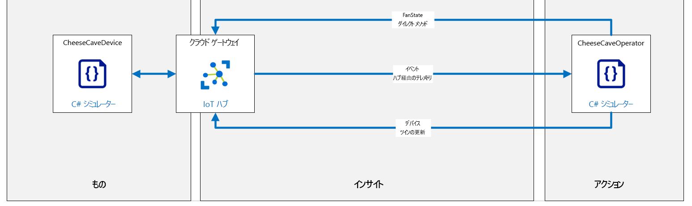

---
lab:
  title: ラボ 15:Azure IoT Hub を使用してデバイスをリモートで監視および制御する
  module: 'Module 8: Device Management'
ms.openlocfilehash: f0ebccb4b7c7b415397ba0b36ddbb7c96e59717c
ms.sourcegitcommit: eec2943250f1cd1ad2c5202ecbb9c37af71e8961
ms.translationtype: HT
ms.contentlocale: ja-JP
ms.lasthandoff: 03/24/2022
ms.locfileid: "140872800"
---
# <a name="remotely-monitor-and-control-devices-with-azure-iot-hub"></a>Azure IoT Hub を使用してデバイスをリモートで監視および制御する

## <a name="lab-scenario"></a>課題シナリオ

Contoso は、受賞歴のあるチーズを誇りにしており、製造プロセス全体で完璧な温度と湿度を維持するように気を付けていますが、エージング プロセス中の状況には常に特別な注意を払ってきました。

近年、Contoso は環境センサーを使用して、ナチュラル チーズのエイジングのための洞窟の中の状態を記録し、そのデータを使用してほぼ完璧な環境を特定しています。 最も成功した (賞に値する) 場所のデータによると、熟成チーズの理想的な温度はおよそ華氏 50 度 +/- 5 度 (摂氏 10 度 +/- 2.8 度) です。 最大飽和度のパーセンテージで測定される理想的な湿度値は、約 85% +/- 10% です。

これらの理想的な温度と湿度の値は、ほとんどのタイプのチーズにも効果的です。 ただし、特に硬いチーズや特に柔らかいチーズには、少々調整が必要です。 また、チーズの外皮に望ましい条件など、特定の結果を得るためにはエージング プロセス中の重要な時期あるいは段階で環境を調整する必要があります。

Contoso は幸運にも、(特定の地域で) ほぼ一年中理想的な条件を自然に維持するチーズ洞窟を運営することができます。 しかしこういった場所でも、エージングプロセス中の環境管理は重要です。 また、自然の洞窟には多くの場合、異なる小部屋が多くあり、小部屋の環境はそれぞれに少しずつ違います。 チーズの品種は、それぞれ特定の要件に合う小部屋 (ゾーン) に配置されます。 環境条件を望ましい範囲内に保つために、温度と湿度の両方を制御する空気処理・調整システムが使われています。

現在、作業者は洞窟施設の各ゾーン内の環境条件を監視し、必要に応じて空気処理システムの設定を調整して、望ましい温度と湿度を維持しています。 作業者は、4時間ごとに各ゾーンを訪問し、環境条件を確認することができます。 昼は高温、夜は低温と温度が著しく変化する場所では、状況が望ましい制限の範囲外になる可能性があります。

Contoso から貯蔵庫の環境を制御制限の範囲内に保つ自動化システムの実装を任されました。

このラボでは、IoT デバイスを実装するチーズ貯蔵庫監視システムをプロトタイプとして作成します。 各デバイスには温度および湿度センサーが装備されており、デバイスが配置されているゾーンの温度と湿度を制御する空気処理システムに接続されています。

### <a name="simplified-lab-conditions"></a>簡略化されたラボ条件

テレメトリの出力頻度は、生産ソリューションにおいて重要な検討事項です。 冷却装置の温度センサーは 1 分間に 1 回しか報告する必要がないのに対し、航空機の加速度センサーは毎秒 10 回報告する必要がある場合があります。 テレメトリを送信する必要のある頻度は、現在の状況に依存する場合もあります。 たとえば、チーズ貯蔵庫のシナリオにおいて夜に急速に温度が低下する傾向がある場合は、日没の 2 時間前からセンサーの読み取り頻度を高めると役立つことがあります。 当然のことながら、テレメトリの頻度を変更する要件は予測可能なパターンの一部である必要はなく、IoT デバイス設定の変更を促すイベントは予測不能な可能性があります。

このラボをシンプルに進行するために、以下を前提とします。

* デバイスは数秒ごとに IoT Hub にテレメトリ (温度と湿度の値) を送信します。 この頻度はチーズ貯蔵庫では非現実的ですが、15 分ごとではなく、もっと頻繁に変化を見る必要があるラボ環境には最適です。
* 空気処理システムは、次の 3 つの状態のいずれかになる送風機です：オン、オフ、エラー
  * 送風機はオフ状態に初期化されています。
  * IoTデバイス上でダイレクト メソッドによって、送風機への電力を制御 (オン/オフ) します。
  * デバイス ツインの必要なプロパティ値は、送風機の目的の状態を設定するために使用されます。 必要なプロパティ値は、送風機/デバイスの規定の設定をオーバーライドします。
  * 温度は送風機をオン/オフにすることで制御できます (ファンをオンにすると温度が下がります)

このラボでのコーディングは、製品利用統計情報の送受信、ダイレクト メソッドの呼び出しと実行、デバイス ツイン プロパティの設定と読み取りの 3 つの部分に分かれています。

まず、製品利用統計情報を送信するデバイス用と、製品利用統計情報を受信する (クラウドで実行される) バックエンド サービス用の 2 つのアプリを作成します。

次のリソースが作成されます。



## <a name="in-this-lab"></a>このラボでは

このラボでは、次のタスクを正常に達成します。

* ラボの前提条件を構成する (必要な Azure リソース)
* シミュレートされたデバイス アプリを作成して、デバイス テレメトリを IoT Hub 送信する
* テレメトリをリッスンするバックエンド サービス アプリを作成する
* ダイレクト メソッドを実装し、IoT デバイスに設定を伝達する
* IoT デバイスのプロパティを管理するために、デバイス ツイン機能を実装する

## <a name="lab-instructions"></a>ラボの手順

### <a name="exercise-1-configure-lab-prerequisites"></a>演習 1:ラボの前提条件を構成する

このラボでは、次の Azure リソースが利用可能であることを前提としています。

| リソースの種類 | リソース名 |
| :-- | :-- |
| リソース グループ | rg-az220 |
| IoT Hub | iot-az220-training-{your-id} |
| IoT デバイス | sensor-th-0055 |

これらのリソースを確実に使用できるようにするには、次の手順に従います。

1. 仮想マシン環境で Microsoft Edge ブラウザー ウィンドウを開き、次の Web アドレスに移動します。
 
    +++https://portal.azure.com/#create/Microsoft.Template/uri/https%3A%2F%2Fraw.githubusercontent.com%2FMicrosoftLearning%2FAZ-220-Microsoft-Azure-IoT-Developer%2Fmaster%2FAllfiles%2FARM%2Flab15.json+++

    > **注**:緑色の "T" 記号 (例: +++このテキストを入力+++) が表示されているときはいつでも、関連付けられているテキストをクリックすると、仮想マシン環境内の現在のフィールドに情報が入力されます。

1. Azure portal にログインするように求められた場合は、このコースで使用している Azure 資格情報を入力します。

    **[カスタム デプロイ]** ページが表示されます。

1. **[プロジェクトの詳細]** の **[サブスクリプション]** ドロップダウンで、このコースで使用する [Azure サブスクリプション] が選択されていることを確認します。

1. **[リソース グループ]** ドロップダウンで、 **[rg-az220]** を選択します。

    > **注**:**rg-az220** がリストにない場合:
    >
    > 1. **[リソース グループ]** ドロップダウンで、 **[新規作成]** をクリックします。
    > 1. **[名前]** に「**rg-az220**」と入力します。
    > 1. **[OK]** をクリックします。

1. **[インスタンスの詳細]** の **[リージョン]** ドロップダウンで、最も近いリージョンを選択します。

    > **注**:**rg-az220** グループが既に存在する場合、 **[リージョン]** フィールドは、リソース グループで使用されるリージョンに設定され、読み取り専用になります。

1. **[Your ID]\(ユーザー ID\)** フィールドに、演習 1 で作成した一意の ID を入力します。

1. **[コース ID]** フィールドに、「**az220**」と入力します。

1. テンプレートを検証するには、 **[確認および作成]** をクリックします。

1. 検証に成功したら、 **[作成]** をクリックします。

    デプロイが開始されます。

1. デプロイが完了した後、テンプレートの出力値を確認するには、左側のナビゲーション領域で **[出力]** をクリックします。

    後で使用するために出力をメモしておきます。

    * deviceConnectionString
    * devicePrimaryKey
    * eventHubsCompatibleEndpoint
    * eventHubsCompatiblePath
    * iotHubSasKey
    * serviceConnectionString

これで、リソースが作成されました。

### <a name="exercise-2-review-code-to-send-and-receive-telemetry"></a>演習 2:テレメトリを送信および受信するコードの確認

この演習では、IoT Hub にテレメトリを送信するシミュレートされたデバイス アプリ (sensor-th-0055 デバイス用) を完成させます。

#### <a name="task-1-open-a-simulated-device-that-generates-telemetry"></a>タスク 1:テレメトリを生成するシミュレートされたデバイスを開く

1. **Visual Studio Code** を開きます。

1. **[ファイル]** メニューで、 **[フォルダーを開く]** を選択します。

1. [フォルダーを開く] ダイアログで、ラボ 15 のスターター フォルダーに移動します。

    "_ラボ 3:開発環境の設定_" では、ZIP ファイルをダウンロードしてコンテンツをローカルに抽出することで、ラボ リソースを含む GitHub リポジトリをクローンしました。 抽出されたフォルダー構造には、次のフォルダー パスが含まれます。

    * すべてのファイル
        * ラボ
            * 15-Azure IoT Hub を使用してリモートによるデバイスを監視および制御する
                * スターター
                    * CheeseCaveDevice
                    * CheeseCaveOperator

1. **[cheesecavedevice]** をクリックし、 **[フォルダーの選択]** をクリックします。

    Visual Studio Code のエクスプローラー ウィンドウに次のファイルが一覧表示されます。

    * cheesecavedevice.csproj
    * Program.cs

1. コード ファイルを開くには、 **[Program.cs]** をクリックします。

    ざっと見ると、このアプリケーションは、前のラボで作業したシミュレートされたデバイス アプリケーションと非常に似ていることがわかります。 このバージョンは、対称キー認証を使用し、テレメトリとログ メッセージの両方を IoT Hub に送信し、より複雑なセンサー実装を備えています。

1. **[ターミナル]** メニューで、**[新しいターミナル]** をクリックします。

    コマンド プロンプトの一部として表示されたディレクトリ パスに注目してください。 以前のラボ プロジェクトのフォルダー構造内で、このプロジェクトのビルドを開始したくありません。

1. ターミナル コマンド プロンプトで、アプリケーションのビルドを確認するには、次のコマンドを入力します。

    ```bash
    dotnet build
    ```

    次のように出力されます。

    ```text
    > dotnet build
    Microsoft (R) Build Engine version 16.5.0+d4cbfca49 for .NET Core
    Copyright (C) Microsoft Corporation. All rights reserved.

    Restore completed in 39.27 ms for D:\Az220-Code\AllFiles\Labs\15-Remotely monitor and control devices with Azure IoT Hub\Starter\CheeseCaveDevice\CheeseCaveDevice.csproj.
    CheeseCaveDevice -> D:\Az220-Code\AllFiles\Labs\15-Remotely monitor and control devices with Azure IoT Hub\Starter\CheeseCaveDevice\bin\Debug\netcoreapp3.1\CheeseCaveDevice.dll

    Build succeeded.
        0 Warning(s)
        0 Error(s)

    Time Elapsed 00:00:01.16
    ```

次のタスクでは、接続文字列を構成し、アプリケーションを確認します。

#### <a name="task-2-configure-connection-and-review-code"></a>タスク 2:接続とレビュー コードを構成する

このタスクで構築するシミュレートされたデバイス アプリは、温度と湿度を監視する IoT デバイスをシミュレートします。 アプリは、センサーの読み取り値をシミュレートし、2 秒ごとにセンサー データを通信します。

1. **Visual Studio Code** で、Program.cs ファイル開かれていることを確認します。

1. コード エディターに、次のコード行を見つけます。

    ```csharp
    private readonly static string deviceConnectionString = "<your device connection string>";
    ```

1. **\<your device connection string\>** を、前に保存したデバイス接続文字列に置き換えます。

    これは、テレメトリを IoT Hub に送信する前に実装する必要がある唯一の変更です。

1. **[ファイル]** メニューの **[保存]** をクリックします。

1. アプリケーションの構造を確認してください。

    アプリケーションの構造は、以前のラボで使用されていたものと似ていることに注意してください。

    * ステートメントの使用
    * 名前空間の定義
      * プログラム クラス - Azure IoT への接続とテレメトリの送信を担当
      * CheeseCaveSimulator クラス - (EnvironmentSensor を置き換えます) テレメトリを生成するだけでなく、このクラスは、冷却ファンの動作によって影響を受ける実行中のチーズ セラー環境もシミュレートします。
      * ConsoleHelper - コンソールへの異なる色のテキストの書き込みをカプセル化するクラス

1. **Main** メソッドを確認します。

    以前のラボと同様に、**Main** メソッドを使用して IoT Hub への接続を確立します。 デバイス ツインのプロパティの変更を統合するために使用されることに気付いたかもしれません。この場合、ダイレクト メソッドも統合します。

1. **SendDeviceToCloudMessagesAsync** メソッドを簡単に確認してください。

    以前のラボで作成した以前のバージョンと非常に似ていることに注意してください。

1. **CheeseCaveSimulator** クラスを簡単に確認してください。

   これは、以前のラボで使用されていた **EnvironmentSensor** クラスを進化させたものです。 主な違いは、ファンの導入です。ファンが **オン** の場合、温度と湿度は徐々に目的の値に向かって移動しますが、ファンが **オフ** (または **故障**) の場合、温度と湿度の値は周囲の値に向かって移動します。 興味深いのは、温度が読み取られたときにファンが **故障** 状態に設定される可能性が 1% あるという事実です。

#### <a name="task-3-test-your-code-to-send-telemetry"></a>タスク 3:テレメトリを送信するコードをテストする

1. Visual Studio Code で、ターミナルが開いたままであることを確認します。

1. ターミナル コマンド プロンプトで、シミュレートされたデバイス アプリを実行するには、次のコマンドを入力します。

    ```bash
    dotnet run
    ```

   このコマンドにより、現在のフォルダーにある **Program.cs** ファイルが実行されます。

1. 出力がターミナルに送信されていることに注意してください。

    すぐに次のようなコンソール出力が表示されます。

    

    > **注**:緑のテキストは、物事が正常に機能していることを示すために使用されます。 赤いテキストは、問題が発生したことを示すために使用されます。 上の画像のような画面が表示されない場合は、まず、デバイスの接続文字列を確認してください。

1. このアプリを実行したままにします。

    このラボの後半で、IoT Hub にテレメトリを送信する必要があります。

### <a name="exercise-3-complete-a-second-app-to-receive-telemetry"></a>演習 3:テレメトリを受信する 2 つ目のアプリを完成させる

(シミュレートされた) チーズ セラー デバイスが IoT Hub にテレメトリを送信するようになったので、IoT Hub に接続してそのテレメトリを "リッスン" できるバックエンド アプリを完成させる必要があります。 最終的には、このバックエンド アプリは、チーズ ケーブの温度の制御を自動化するために使用されます。

#### <a name="task-1-complete-an-app-to-receive-telemetry"></a>タスク 1:テレメトリを受信するアプリを完成させる

このタスクでは、IoT Hub イベント ハブのエンドポイントからテレメトリを受信するために使用するバックエンド アプリの作業を追加します。

1. Visual Studio Code の新しいインスタンスを開きます。

    シミュレートされたデバイス アプリは、既に開いている Visual Studio Code ウィンドウで実行されているため、バックエンド アプリの Visual Studio Code の新しいインスタンスが必要です。

1. **[ファイル]** メニューで、 **[フォルダーを開く]** を選択します。

1. **[フォルダーを開く]** ダイアログで、ラボ 15 のスターター フォルダーに移動します。

1. **[CheeseCaveOperator]** をクリックし、 **[フォルダーの選択]** をクリックします。

    用意されている CheeseCaveOperator アプリケーションは、いくつかの NuGet パッケージ ライブラリと使用されるいくつかのコメントを含む単純なコンソール アプリケーションであり、コードを構築するプロセスをガイドします。 アプリケーションを実行する前に、プロジェクトにコードブ ロックを追加する必要があります。

#### <a name="task-3-enable-the-telemetry-receiver-code"></a>タスク 3:テレメトリ レシーバー コードを有効にする

1. **[エクスプローラー]** ペインで、 **[Program.cs]** をクリックします。

1. using ステートメントを見つけて確認してください。以前のラボで使われているものがほとんどです。 ただし、2 つの新しい名前空間が追加されています。

    ```csharp
    using Azure.Messaging.EventHubs;
    using Azure.Messaging.EventHubs.Consumer;
    ```

    これらの名前空間は両方とも [**Azure.Messaging.EventHubs** NuGet パッケージ](https://www.nuget.org/packages/Azure.Messaging.EventHubs/)に由来しています。 このクライアント ライブラリでは、Azure Event Hubs を使ったイベントの発行と利用の両方が可能になります。 このラボでは、IoT Hub 組み込みの EventHub 互換エンドポイントに接続するようにライブラリを構成します。

    > **注**:NuGet パッケージは、次のコマンド `dotnet add package Azure.Messaging.EventHubs` でインストールできます。詳細は以下のリンクで確認できます。
    > * [.NET 用 Azure Event Hubs クライアント ライブラリ - バージョン 5.5.0](https://docs.microsoft.com/en-us/dotnet/api/overview/azure/messaging.eventhubs-readme?view=azure-dotnet)

1. `Global variables.` というコメントを探します。

1. 少し時間を取って、グローバル変数を確認してください。

    **eventHubsCompatibleEndpoint** 変数は、イベント ハブと互換性のある IoT Hub 組み込みサービス向けエンド ポイント (メッセージ/イベント) の URI を格納するために使用されます

    **eventHubsCompatiblePath** 変数には、Even tHub エンティティへのパスが含まれます。

    **iotHubSasKey** 変数には、名前空間またはエンティティに対応する共有アクセス ポリシー ルールのキー名が含まれます。

    **iotHubSasKeyName** 変数には、名前空間またはエンティティに対応する共有アクセス ポリシー ルールのキーが含まれます。

    **eventHubClient** 変数には、IoT Hub からメッセージを受信するために使用されるイベント ハブ クライアント インスタンスが含まれます。

    **serviceClient** 変数には、アプリから IoT Hub に (そしてそこからターゲット デバイスなどに) メッセージを送信するために使用されるサービス クライアント インスタンスが含まれます。

    **serviceConnectionString** 変数には、オペレーター アプリが IoT Hub に接続できるようにする接続文字列が含まれます。

    **deviceId** 変数には、**CheeseCaveDevice** アプリケーションで使われるデバイス ID (`"sensor-th-0055"`) が含まれます。

1. サービス接続文字列の割り当てに使用するコード行を見つける

    ```csharp
    private readonly static string serviceConnectionString = "<your service connection string>";
    ```

1. **\<your service connection string\>** を、このラボで先ほど保存した IoT Hub サービスの接続文字列に置き換えます。

    演習 1 で実行した ARM テンプレートによって生成された iothubowner 共有アクセス ポリシーのプライマリ接続文字列を保存しておく必要があります。

    > **注**:**サービス** 共有ポリシーではなく、**iothubowner** 共有ポリシーがなぜ使用されているのか、不思議に思われるかもしれません。 答えは、各ポリシーに割り当てられた IoT Hub のアクセス許可に関連しています。 **サービス** ポリシーには **ServiceConnect** アクセス許可があり、通常はバックエンド クラウド サービスによって使用されます。 これは、次の権利を付与します。
    >
    > * クラウド サービス向けの通信エンドポイントと監視エンドポイントへのアクセスを許可します。
    > * デバイスからクラウドへのメッセージの受信、クラウドからデバイスへのメッセージの送信、対応する配信確認メッセージの取得のアクセス許可を付与します。
    > * ファイル アップロードの配信確認メッセージの取得のアクセス許可を付与します。
    > * タグおよび必要なプロパティを更新するためのツインへのアクセス、報告されるプロパティの取得、クエリの実行のアクセス許可を付与します。
    >
    > ラボの最初の部分では、**serviceoperator** アプリケーションがファンの状態を切り替えるダイレクト メソッドを呼び出しており、 **サービス** ポリシーには十分な権限があります。 ただし、ラボの後半では、デバイス レジストリが照会されます。 これは **RegistryManager** クラスを通じて行われます。 **RegistryManager** クラスを使用してデバイス レジストリをクエリするには、IoT Hub への接続に使用される共有アクセス ポリシーに **レジストリ読み取り** アクセス許可が必要です。これは、次の権限を付与します。
    >
    > * ID レジストリへの読み取りアクセスを許可します。
    >
    > **iothubowner** ポリシーには **レジストリの書き込み** アクセス許可が与えられているため、**レジストリの読み取り** 権限が継承されるため、ニーズに適しています。
    >
    > 運用シナリオでは、 **サービス接続** と **レジストリ読み取り** アクセス許可のみを持つ新しい共有アクセス ポリシーを追加することを検討してください。

1. **\<your event hub endpoint\>** 、 **\<your event hub path\>** 、 **\<your event hub SaS key\>** を、このラボで先ほど保存した値に置き換えてください。

1. **Main** メソッドを探して、コード (とコード コメント) を確認します。

    接続文字列が、前に入力した値からどのように構築されるかに注意してください。 これと既定のコンシューマー グループを使って **EventHubConsumerClient** のインスタンスが作成および構成されます。

    > **注**:`var consumerGroup = EventHubConsumerClient.DefaultConsumerGroupName;` のコードでは、**consumerGroup** に文字列 `"$Default` を割り当てます。 一般的には、カスタムのコンシューマー グループを作成しますが、その場合、代わりにコンシューマー グループの名前をここで使うことになります。

    > **Information**:コンシューマー グループの詳細については、[こちら](https://docs.microsoft.com/en-us/azure/event-hubs/event-hubs-features#consumer-groups)をご覧ください。

    この **EventHubConsumerClient** クラスは、**EventHub** (この場合は IoT Hub の組み込み Event Hub エンドポイント) から値を読み取るために使われます。

    **EventHubConsumerClient** の参照は、**consumer** 変数に格納されます。 次に、consumer を使ってパーティション ID 文字列の配列を取得し、**d2cPartitions** 変数に格納します。 この配列は、各パーティションからのメッセージを受信するタスクの一覧を作成するために使われます。

    > **Information**:共パーティションの目的の詳細については、[こちら](https://docs.microsoft.com/en-us/azure/iot-hub/iot-hub-scaling#partitions)を参照してください。

    デバイスから IoT Hub に送信されるメッセージは任意のパーティションで処理される可能性があるため、アプリは各パーティションからメッセージを取得する必要があります。 コードの次のセクションでは、非同期タスクのリストを作成します。各タスクは特定のパーティションからメッセージを受信します。 最後の行は、すべてのタスクが完了するのを待ちます。各タスクは無限ループになるため、この行はアプリケーションが終了するのを防ぎます。

1. **ReceiveMessagesFromDeviceAsync** メソッドを見つけて確認します。

    このメソッドには、ターゲット パーティションを定義する引数が指定されています。 既定の構成では 4 つのパーティションが指定されていることに注意してください。したがって、このメソッドは 4 回呼び出され、各パーティションに対して 1 つずつ並列に非同期で実行されます。

    次に、パーティションに存在する最初のイベントの開始位置を指定します。

    > **Information**:`EventPosition.Earliest` は列挙型であるように見えますが、実際には `EventPosition` は構造体で、`Earliest` と `Latest` の定義だけでなく、エンキューされた時間、オフセット、シーケンス番号から計算したイベントの位置を返すメソッドも提供します。 **EventPosition 構造体** の詳細については、[こちら](https://docs.microsoft.com/dotnet/api/azure.messaging.eventhubs.consumer.eventposition?view=azure-dotnet)を参照してください。

    次のセクションでは、要求されたパーティションからイベントを非同期で列挙できるように読み込み、パーティション上で使用可能になったイベントを反復処理できるようにし、使用できるイベントがない場合は必要に応じて待機します。

    > **Information**:非同期ストリームの詳細については、[こちら](https://docs.microsoft.com/dotnet/csharp/whats-new/csharp-8#asynchronous-streams)を参照してください

    イベントが受信されると、バイナリ本体のデータは文字列に変換され、コンソールに書き込まれます。もちろん、"現実世界" では、JSON は逆シリアル化などが行われることがあります。 次に、イベントデータのプロパティが繰り返され、この場合、値が true であるかどうかが確認されます。現在のシナリオでは、これはアラートを表します。 アラートが見つかると、コンソールに書き込まれます。

1. **[ファイル]** メニューで 変更を Program.cs ファイルに保存するには、 **[保存]** をクリックします。

#### <a name="task-3-test-your-code-to-receive-telemetry"></a>タスク 3:テレメトリを受信するコードをテストする

このテストは重要であり、シミュレートされたデバイスによって送信されたテレメトリがバックエンド アプリによって取得されているかどうかを確認します。 デバイス アプリはまだ実行されており、テレメトリが送信されていることを思い出してください。

1. ターミナルで **CheeseCaveOperator** バックエンド アプリを実行するには、ターミナル ウィンドウを開き、次のコマンドを入力します。

    ```bash
    dotnet run
    ```

   このコマンドにより、現在のフォルダーにある **Program.cs** ファイルが実行されます。

   > **注**:未使用の変数 **serviceConnectionString** に関する警告は無視してかまいません。まもなく、その変数を使用するためのコードを追加します。

1. ターミナルへの出力をしばらく観察してください。

    コンソールの出力がすぐに表示されるはずで、IoT Hub にHub に正常に接続された場合、アプリがテレメトリ メッセージ データをほぼ即座に表示します。

    それ以外の場合は、IoT Hub サービスの接続文字列を慎重に確認し、文字列がサービス接続文字列であり、他の接続文字列ではないことを確認します。

    

    > **注**:緑色のテキストは、物事が本来のように機能していることを示すために使用され、赤いテキストは悪いことが起こっているときに表示されます。 この画像のような画面が表示されない場合は、まず、デバイスの接続文字列を確認してください。

1. このアプリをしばらく実行したままにします。

1. 両方のアプリを実行した状態で、Operator アプリによって表示されるテレメトリが Device アプリによって送信されるテレメトリと同期していることを確認します。

    送信されているテレメトリと受信されているテレメトリを視覚的に比較します。

    * 完全に一致するデータはありますか?
    * データが送信された時点から受信されるまでの遅延は多いですか。

1. テレメトリ データを確認したら、実行中のアプリを停止し、VS Code の両方のインスタンスでターミナル ペインを閉じますが、Visual Studio Code ウィンドウは閉じないでください。

これで、デバイスからテレメトリを送信するアプリと、データの受信を確認するバックエンド アプリが作成されました。 次の演習では、制御側を処理するステップ (データに問題が発生した場合の対処方法) の作業を開始します。

### <a name="exercise-4-include-code-to-invoke-a-direct-method"></a>演習 4:ダイレクト メソッドを呼び出すコードを含める

ダイレクト メソッドを呼び出すバックエンド アプリからの呼び出しには、ペイロードの一部として複数のパラメーターを含めることができます。 ダイレクト メソッドは、通常、デバイスの機能をオンまたはオフにしたり、デバイスの設定を指定したりするために使用されます。

Contoso のシナリオでは、チーズ セラーにあるファンの動作を制御するデバイスに直接法を実装します (ファンをオンまたはオフにすることで温度と湿度の制御をシミュレートします)。 Operator アプリケーションは、IoT Hub と通信して、デバイスでダイレクト メソッドを呼び出します。

チーズ セラー デバイスが、ダイレクト メソッドを実行するための指示を受け取ったときにチェックする必要があるいくつかのエラー状態があります。 これらのチェックの 1 つは簡単で、ファンが障害状態の場合はエラーで応答します。 報告するもう 1 つのエラー状況は、無効なパラメーターを受け取ったときです。 デバイスは遠隔地にある可能性があるので、明確なエラー報告が重要です。

ダイレクト メソッドを使用するには、バックエンド アプリでパラメーターを準備してから、メソッドを呼び出す 1 つのデバイスを指定して呼び出しを行う必要があります。 バックエンド アプリは応答を待機し、それを報告します。

デバイス アプリには、ダイレクト メソッドの機能コードが含まれます。 関数名は、デバイスに対する IoT クライアントに登録されます。 このプロセスにより、クライアントで、IoT ハブから呼び出しが行われたときに、実行する関数が確実に認識されます (多くのダイレクト メソッドが存在する可能性があります)。

この演習では、チーズ ケーブでファンをオンにするシミュレーションを行うダイレクト メソッドのコードを追加して、デバイス アプリを更新します。 次に、このダイレクト メソッドを呼び出すコードをバックエンド サービス アプリに追加します。

#### <a name="task-1-enable-code-to-define-a-direct-method-in-the-device-app"></a>タスク 1:デバイス アプリでダイレクト メソッドを定義するコードを有効にする

1. **cheesecavedevice** アプリを含む Visual Studio Code インスタンスに戻ります。

    > **注**:アプリがまだ実行中の場合は、[ターミナル] ペインを使用してアプリを終了します ([ターミナル] ペイン内をクリックしてフォーカスを設定し、**CTRL+C** を押して実行中のアプリケーションを終了します)。

1. **Program.cs** がコード エディターで開かれていることを確認します。

1. `UNCOMMENT register direct method code below here` というコメントを探します。

1. ダイレクト メソッドを登録するには、次のコードをコメント解除します。

    ```csharp
    deviceClient.SetMethodHandlerAsync("SetFanState", SetFanState, null).Wait();
    ```

    **SetFanState** ダイレクト メソッド ハンドラーもこのコードによって設定されていることに注意してください。 ご覧のとおり、deviceClient の **SetMethodHandlerAsync** メソッドは、リモート メソッド名 `"SetFanState"` と、呼び出す実際のローカル メソッド、ユーザー コンテキスト オブジェクト (この場合は null) を引数として受け取ります。

1. `UNCOMMENT SetFanState method below here` というコメントを探します。

1. **SetFanState** ダイレクト メソッドのコメントを解除し、コードとコメントを確認します。

    これは、**SetFanState** という関連するリモート メソッドが IoT Hub を介して呼び出されたときに、デバイス上で実行されるメソッドです。 **MethodRequest** インスタンスの受信に加えて、ダイレクト メッセージ コールバックが登録されたときに定義された **userContext** オブジェクトも受信することに注意してください (この場合は null になります)。

    このメソッドの最初の行は、チーズ セラー ファンが現在 **故障** 状態にあるかどうかを判断します。チーズ セラー シミュレーターは、ファンが故障すると、後続のコマンドは自動的に失敗することを前提としています。 したがって、JSON 文字列は、**結果** プロパティを **Fan Failed** に設定して作成されます。 次に、新しい **MethodResponse** オブジェクトが作成され、結果文字列がバイト配列と HTTP ステータス コードにエンコードされます。この場合、**400** が使用されます。これは、REST API のコンテキストでは、一般的なクライアント側エラーが発生したことを意味します。 **Task\<MethodResponse\>** を返すには、ダイレクト メソッド コールバックが必要なため、新しいタスクが作成されて返されます。

    > **Information**:HTTPvステータスvコードがvRESTvAPvI内でどのように使用されるかについて詳しくは、[こちら](https://restfulapi.net/http-status-codes/)をご覧ください。

    ファンの状態が **Failed** でない場合、コードはメソッド要求の一部として送信されたデータの処理に進みます。 **methodRequest.Data** プロパティには、バイト配列の形式でデータが含まれているため、最初に文字列に変換されます。 このシナリオでは、次の 2 つの値が予想されます (引用符を含む)。

    * "On"
    * "Off"

    受信したデータは **StateEnum** のメンバーにマップされると想定されています。

    ```csharp
    internal enum StateEnum
    {
        Off,
        On,
        Failed
    }
    ```

    データを解析するには、最初に引用符を削除してから、**Enum.Parse** メソッドを使用して一致する列挙値を見つける必要があります。 これが失敗した場合 (データが正確に一致する必要がある場合)、例外がスローされます。これは以下でキャッチされます。 例外ハンドラーは、ファン障害状態に対して作成されたものと同様のエラー メソッド応答を作成して返すことに注意してください。

    **StateEnum** で一致する値が見つかった場合、チーズ セラー シミュレーターの **UpdateFan** メソッドが呼び出されます。 この場合、メソッドは **FanState** プロパティを指定された値に設定するだけです。実際の実装では、ファンと対話して状態を変更し、状態の変更が成功したかどうかを判断します。 ただし、このシナリオでは、成功が想定され、適切な **結果** と **MethodResponse** が作成されて返されます。今回は、HTTP ステータス コード **200** を使用して成功を示します。

1. **[ファイル]** メニューで Program.cs ファイルを保存するために、 **[保存]** をクリックします。

これで、デバイス側で必要なコーディングが完了しました。 次に、ダイレクト メソッド呼び出すコードをバックエンド Operator アプリケーションに追加する必要があります。

#### <a name="task-2-add-code-to-call-your-direct-method"></a>タスク 2:ダイレクトメソッドを呼び出すコードを追加する

1. **CheeseCaveOperator** アプリを含む Visual Studio Code インスタンスに戻ります。

    > **注**:アプリがまだ実行中の場合は、[ターミナル] ペインを使用してアプリを終了します ([ターミナル] ペイン内をクリックしてフォーカスを設定し、**CTRL+C** を押して実行中のアプリケーションを終了します)。

1. **Program.cs** がコード エディターで開かれていることを確認します。

1. アプリケーションでは、サービス クライアントのインスタンスを保持するためにグローバル変数を定義します。

    ```csharp
    private static ServiceClient serviceClient;
    ```

    **ServiceClient** は、デバイスにメッセージを送信するために使われます。

1. `UNCOMMENT create service client instance below here` というコメントを探します。

1. 次のコードをコメント解除します。

    ```csharp
    // Create a ServiceClient to communicate with service-facing endpoint
    // on your hub.
    serviceClient = ServiceClient.CreateFromConnectionString(serviceConnectionString);
    // Invokes a Direct Method on the device
    await InvokeMethod();
    ```

    **ServiceClient** が前に定義した **serviceConnectionString** を使って接続していることに注意してください。 それから、**InvokeMethod** が呼び出されます。

1. `UNCOMMENT InvokeMethod method below here` というコメントを探します。

1. ダイレクト メソッドを呼び出すコードをコメント解除して確認します。

    **CloudToDeviceMethod** クラスは、メソッド名、タイムアウト、ペイロードといったダイレクト メソッドに関する情報をカプセル化します。 そして、先ほど作成した **ServiceClient** インスタンスを使って、IoT Hub 経由でダイレクト メソッドを呼び出すと、応答オブジェクトが返されます。 `response.Status` プロパティ値が `200` であれば成功です。

    > **Information**:**ServiceClient** クラスは、基になる Azure REST API との相互作用をカプセル化します。 ダイレクト メソッドを呼び出すための基となる REST API については、「[IoT Hub からのダイレクト メソッドの呼び出しについて](https://docs.microsoft.com/en-us/azure/iot-hub/iot-hub-devguide-direct-methods)」で詳しく説明されています。 また、追加の状態コードについても記載されています。
    > * 200 は、ダイレクト メソッドが正常に実行されたことを示します。
    > * 404 は、デバイス ID が無効であるか、ダイレクト メソッドの呼び出し時とその後の connectTimeoutInSeconds の間、デバイスがオンラインでなかったことを示します (根本原因を把握するには、付随するエラー メッセージを使用してください)。
    > * 504 は、デバイスが responseTimeoutInSeconds 内のダイレクト メソッド呼び出しに応答しなかったことが原因で、ゲートウェイのタイムアウトが発生したことを示します。

    このコードは、 デバイス アプリで **SetFanState** ダイレクト メソッドを呼び出すために使用されます。

1. **[ファイル]** メニューで Program.cs ファイルを保存するために、 **[保存]** をクリックします。

これで、**SetFanState** ダイレクト メソッドをサポートするためのコード変更が完了しました。

#### <a name="task-3-test-the-direct-method"></a>タスク 3:ダイレクト メソッドをテストする

ダイレクト メソッドをテストするには、正しい順序でアプリを起動する必要があります。 登録されていないダイレクト メソッドを呼び出す方法はありません。

1. **Cheesecavedevice** デバイス アプリを含む Visual Studio Code のインスタンスに切り替えます。

1. **cheesecavedevice** デバイス アプリを起動するには、[ターミナル] ペインを開いて `dotnet run` コマンドを入力します。

    ターミナルへの書き込みが開始され、テレメトリメッセージが表示されます。

1. **CheeseCaveOperator** バックエンド アプリを含む Visual Studio Code のインスタンスに切り替えます。

1. **CheeseCaveOperator** バックエンド アプリを起動するには、[ターミナル] ペインを開いて `dotnet run` コマンドを入力します。

    > **注**:`Direct method failed: timed-out` というメッセージが表示されたら、**CheeseCaveDevice** の変更を保存してアプリを起動したことを、再度確認してください。

    CheeseCaveOperator バックエンド アプリは、すぐにダイレクト メソッドを呼び出します。

    次のような出力に注目してください。

    

1. これで、 **cheesecavedevice** デバイス アプリのコンソール出力を確認すると、ファンがオンになっていることがわかるはずです。

   

リモート デバイスを正しく監視し、制御できるようになりました。 クラウドから呼び出すことができるダイレクト メソッドをデバイスに実装しました。 Contoso のシナリオでは、ダイレクト メソッドを使用してファンをオンにし、セラー内の環境を希望の設定にします。 温度と湿度の測定値が時間の経過とともに低下し、最終的にアラートが削除されることに注意してください (ファンが故障しない限り)。

しかし、チーズ セラー環境に対して希望する設定をリモートで指定したい場合はどうしますか? おそらく、熟成プロセスのある時点でチーズ セラーの特定の目標温度を設定したいと思うでしょう。 ダイレクト メソッド (有効なアプローチ) で目的の設定を指定することも、この目的のために設計されたデバイス ツインと呼ばれる IoT Hub の別の機能を使用することもできます。 次の演習では、ソリューション内でデバイス ツイン プロパティを実装する作業を行います。

### <a name="exercise-5-implement-the-device-twin-functionality"></a>エクササイズ 5:デバイス ツイン機能を実装する

デバイス ツインには、次の 4 種類の情報が含まれている点に留意してください。

* **タグ**: デバイスには認識されないデバイスについての情報。
* **望ましいプロパティ**: バックエンド アプリによって指定される望ましい設定。
* **報告されたプロパティ**: デバイスの設定の報告された値。
* **デバイス ID プロパティ**: デバイスを識別する読み取り専用の情報。

IoT Hub で管理されるデバイス ツインはクエリ用に設計されており、実際の IoT デバイスと同期されます。 バックエンド アプリでは、いつでもデバイス ツインのクエリを実行できます。 このクエリは、デバイスの現在の状態に関する情報を返すことができます。 このデータを取得するには、デバイスとツインが同期するので、デバイスへの呼び出しは必要ありません。 デバイス ツインの機能の多くは Azure IoT Hub が提供するため、利用する上でコードを記述する必要はありません。

デバイス ツインとダイレクト メソッドの機能には、いくつかの重複があります。 ダイレクトメソッドを使用してデバイスプロパティを設定することができるので、直感的なやり方のように感じられるかもしれません。 しかし、ダイレクト メソッドを使用すると、それらの設定にアクセスする必要がある場合は、バックエンド アプリで設定を明示的に記録する必要があります。 デバイス ツインを使用すると、この情報は既定で格納および管理されます。

この演習では、バックエンドのサービス アプリで一部のコードを有効にし、デバイス ツインの同期を動作中に表示します (ツイン同期のデバイス コードは既に追加されており、以前のラボで説明されています)。

#### <a name="task-1-enable-code-to-use-device-twins-to-synchronize-device-properties"></a>タスク 1:デバイス ツインを使用してデバイスのプロパティを同期するコードを有効にする

1. **CheeseCaveOperator** バックエンド アプリを実行している Visual Studio Code インスタンスに戻ります。

1. アプリがまだ実行されている場合は、端末に入力フォーカスを置き、**Ctrl + C** を押してアプリを終了します。

1. **Program.cs** が開いていることを確認します。

1. **RegistryManager** インスタンスのグローバル変数は既に定義されています。

    ```csharp
    private static RegistryManager registryManager;
    ```

    **RegistryManager** クラスは、デバイス ID レジストリに対する操作、デバイス ツインのクエリ、およびインポート/エクスポート ジョブを含む IoT Hub サービス REST API の一部をカプセル化しています。 この演習では、デバイス ツインを更新するために使います。


1. `UNCOMMENT device twin management below here` というコメントを探します。

1. レジストリ マネージャー インスタンスを作成し、ツイン プロパティを設定する機能を追加するには、次のコードを入力します。

    ```csharp
    // A registry manager is used to access the digital twins.
    registryManager = RegistryManager
        .CreateFromConnectionString(serviceConnectionString);
    await SetTwinProperties();
    ```

    適切なアクセス レベルで IoT Hub に接続するために、**serviceConnectionString** の値が使われていることに注意してください。 次に、**SetTwinProperties** が呼び出されます。

1. `UNCOMMENT Device twins section below here` というコメントを探します。

1. デバイス ツインの必要なプロパティを更新する機能を追加するため、**SetTwinProperties** をコメント解除して、コードとコメントを確認します。

    **SetTwinProperties** メソッドは、デバイス ツインに追加されるタグとプロパティを定義する JSON の一部を作成し、ツインを更新します。 メソッドの次の部分では、**cheeseCave** タグが "CheeseCave1" に設定されているデバイスをリストするために、クエリをどのように実行できるかを示します。 このクエリでは、接続に **レジストリ読み取り** アクセス許可が必要です。

1. **[ファイル]** メニューで Program.cs ファイルを保存するために、 **[保存]** をクリックします。

#### <a name="task-2-enable-code-to-synchronize-device-twin-settings-for-the-device"></a>タスク 2:デバイス ツインの設定をデバイスに同期するコードを有効にします

1. **cheesecavedevice** アプリを含む Visual Studio Code インスタンスに戻ります。

1. アプリがまだ実行されている場合は、端末に入力フォーカスを置き、**Ctrl + C** を押してアプリを終了します。

1. **Program.cs** ファイルが [コード エディター] ウィンドウで開かれていることを確認します。

1. `UNCOMMENT register desired property changed handler code below here` というコメントを探します。

1. 必要なプロパティ変更ハンドラーを登録するために、次のコードをコメント解除します。

    ```csharp
    // Get the device twin to report the initial desired properties.
    Twin deviceTwin = await deviceClient.GetTwinAsync();
    ConsoleHelper.WriteGreenMessage("Initial twin desired properties: " + deviceTwin.Properties.Desired.ToJson());

    // Set the device twin update callback.
    await deviceClient.SetDesiredPropertyUpdateCallbackAsync(OnDesiredPropertyChanged, null);
    ```

1. `UNCOMMENT OnDesiredPropertyChanged method below here` というコメントを探します。

1. デバイス ツインのプロパティ変更に応答するコードを有効にするため、**OnDesiredPropertyChanged** メソッドをコメント解除し、コードを確認します。

    このコードは、デバイス ツインで必要なプロパティが変更されたときに呼び出されるハンドラーを定義します。 変更を確認するために、新しい値が IoT Hub に報告されることに注意してください。

1. **[ファイル]** メニューで Program.cs ファイルを保存するために、 **[保存]** をクリックします。

    > **注**:これで、デバイス ツインのサポートがアプリに追加されました。**desiredHumidity** のように明示的な変数を使うことについて再考できます。 その代わり、デバイス ツイン オブジェクトの変数を使用できます。

#### <a name="task-3-test-the-device-twins"></a>タスク 3:デバイス ツインのテスト

デバイス ツインの必要なプロパティの変更を管理するコードをテストするには、アプリを正しい順序で起動します。最初にデバイス アプリケーションを起動し、次にバック エンド アプリケーションを起動します。

1. **Cheesecavedevice** デバイス アプリを含む Visual Studio Code のインスタンスに切り替えます。

1. **cheesecavedevice** デバイス アプリを起動するには、[ターミナル] ペインを開いて `dotnet run` コマンドを入力します。

    ターミナルへの書き込みが開始され、テレメトリメッセージが表示されます。

1. **CheeseCaveOperator** バックエンド アプリを含む Visual Studio Code のインスタンスに切り替えます。

1. **CheeseCaveOperator** バックエンド アプリを起動するには、[ターミナル] ペインを開いて `dotnet run` コマンドを入力します。

1. **cheesecavedevice** デバイス アプリを含む Visual Studio Code のインスタンスに切り替えます。

1. コンソール出力をチェックし、デバイスが正しく同期されていることを確認します。

    

    ファンを動作させると、最終的に赤いアラートがオフになるはずです (ファンが故障しない限り)

    

1. Visual Studio Code の両方のインスタンスに対して、アプリを停止してから、Visual Studio Code ウィンドウを閉じます。

このラボで実装したコードは本番品質ではありませんが、直接的な方法とデバイスのツイン プロパティの組み合わせを使用して IoT デバイスを監視および制御する基本を示しています。 この実装では、オペレーター制御メッセージは、バックエンド サービス アプリが最初に実行されたときにのみ送信されることを認識しておく必要があります。 通常、バックエンド サービス アプリでは、必要に応じてオペレーターがダイレクト メソッドを送信したり、デバイス ツイン プロパティを設定したりするために、ブラウザー インターフェイスが必要になります。
