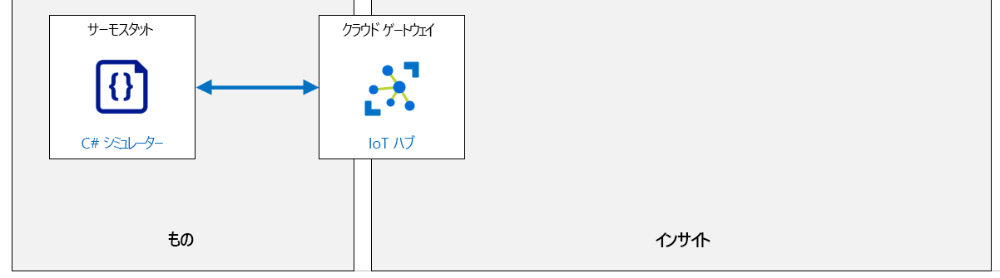

---
lab:
  title: ラボ 16:Azure IoT Hub を使用した IoT デバイス管理の自動化
  module: 'Module 8: Device Management'
ms.openlocfilehash: 3b752cc477c664f1c44b754c49b2e20542de1f72
ms.sourcegitcommit: eec2943250f1cd1ad2c5202ecbb9c37af71e8961
ms.translationtype: HT
ms.contentlocale: ja-JP
ms.lasthandoff: 03/24/2022
ms.locfileid: "140872824"
---
# <a name="automate-iot-device-management-with-azure-iot-hub"></a>Azure IoT Hub を使用した IoT デバイス管理の自動化

IoT デバイスは、最適化されたオペレーティング システムを使用したり、シリコン上でコードを直接実行したりします (実際のオペレーティング システムは必要ありません)。 このようなデバイスで実行されているソフトウェアを更新するために最も一般的な方法は、OSだけでなく実行されているアプリ (ファームウェアと呼ばれる) を含み、ソフトウェア パッケージ全体の新しいバージョンをフラッシュすることです。

各デバイスには特定の目的があるため、ファームウェアは非常に限定的で、デバイスの目的だけでなく、利用可能な制約されたリソースにも最適化されています。

ファームウェアの更新プロセスは、ハードウェアとハードウェアの製造元がボードを作成した方法に対して固有のプロセスにすることもできます。 これは、ファームウェアの更新プロセスの一部が汎用的ではないことを意味し、ファームウェアの更新プロセスの詳細を取得するためにデバイスの製造元と協力する必要があります (ファームウェアの更新プロセスを知っている可能性が高い独自のハードウェアを開発している場合を除きます)。

ファームウェアの更新が個々のデバイスに手動で適用される場合、この方法では一般的な IoT ソリューションで使用されるデバイスの数を考慮することは意味がありません。 現在、ファームウェアの更新は、クラウドからリモートで管理する新しいファームウェアの展開により、無線 (OTA) を介して実行することがより一般的になりました。

すべての無線を介した IoT デバイスのファームウェアの更新には、共通する一連の特徴があります。

1. ファームウェアのバージョンは、一意に識別されます
1. ファームウェアはバイナリ ファイル形式で提供されます。デバイスはこれをオンライン ソースから取得する必要があります
1. ローカルに保存されているファームウェアは、何らかの形の物理ストレージです (ROM メモリ、ハードドライブなど)
1. デバイスの製造元は、ファームウェアを更新するために必要なデバイスの操作の説明を提供します。

Azure IoT Hub は、単一のデバイスとデバイスのコレクションにデバイス管理操作を実装するための高度なサポートを提供します。 [自動デバイス管理](https://docs.microsoft.com/azure/iot-hub/iot-hub-auto-device-config)機能を使用すると、一連の操作の構成、その操作のトリガー、進行状況の監視を簡単に行えます。

## <a name="lab-scenario"></a>課題シナリオ

Contoso 社のチーズ熟成庫に実装した自動空気処理システムは、同社が既に高い品質水準をさらに上げるのに役立ちました。 同社は、チーズでこれまで以上に多くの賞を受賞しています。

基本ソリューションは、センサーと気候制御システムと統合された IoT デバイスで構成されており、マルチチャンバー貯蔵庫システム内の温度と湿度をリアルタイムで制御します。 また、ダイレクト メソッドとデバイス ツイン プロパティの両方を使用してデバイスを管理する機能を示す、シンプルなバックエンド アプリを開発しました。

Contoso 社は、初期ソリューションからシンプルなバックエンド アプリを拡張し、オペレーターが蔵環境の監視とリモート管理に使用できるオンライン ポータルを含めています。 新しいポータルでは、オペレーターはチーズの種類に基づいて、またはチーズの熟成プロセス内の特定の段階に合わせて蔵内の温度と湿度をカスタマイズすることさえできます。 蔵内の各チャンバーまたはゾーンは、別々に制御することができます。

IT 部署は、オペレータ向けに開発したバックエンド ポータルを保守しますが、管理者はソリューションのデバイス側を管理することに同意しています。

この場合、これは次の 2 つのことを意味します。

1. Contoso 社の運用チームは、改善方法を常に模索しています。 これらの機能強化の結果、デバイス ソフトウェアの新機能のリクエストが寄せられることがよくあります。

1. 洞窟の場所にデプロイされている IoT デバイスには、プライバシーを確保しハッカーがシステムを掌握するのを防ぐために、最新のセキュリティパッチが必要です。 システムのセキュリティを維持するため、デバイスのファームウェアをリモートで更新して、デバイスを最新の状態に保つ必要があります。

自動デバイス管理とデバイス管理を大規模に行えるようにする IoT Hub の機能を実装する予定です。

次のリソースが作成されます。



## <a name="in-this-lab"></a>このラボでは

このラボでは、次のタスクを正常に達成します。

* ラボの前提条件を構成する (必要な Azure リソース)
* ファームウェアの更新を実装するシミュレートされたデバイスのコードを記述します
* Azure IoT Hub の自動デバイス管理を使用して、1 つのデバイスでファームウェアの更新プロセスをテストする

## <a name="lab-instructions"></a>ラボの手順

### <a name="exercise-1-configure-lab-prerequisites"></a>演習 1:ラボの前提条件を構成する

このラボでは、次の Azure リソースが利用可能であることを前提としています。

| リソースの種類 | リソース名 |
| :-- | :-- |
| リソース グループ | rg-az220 |
| IoT Hub | iot-az220-training-{your-id} |
| IoT デバイス | sensor-th-0155 |

これらのリソースを確実に使用できるようにするには、次の手順に従います。

1. 仮想マシン環境で Microsoft Edge ブラウザー ウィンドウを開き、次の Web アドレスに移動します。
 
    +++https://portal.azure.com/#create/Microsoft.Template/uri/https%3A%2F%2Fraw.githubusercontent.com%2FMicrosoftLearning%2FAZ-220-Microsoft-Azure-IoT-Developer%2Fmaster%2FAllfiles%2FARM%2Flab16.json+++

    > **注**:緑色の "T" 記号 (例: +++このテキストを入力+++) が表示されているときはいつでも、関連付けられているテキストをクリックすると、仮想マシン環境内の現在のフィールドに情報が入力されます。

1. Azure portal にログインするように求められた場合は、このコースで使用している Azure 資格情報を入力します。

    **[カスタム デプロイ]** ページが表示されます。

1. **[プロジェクトの詳細]** の **[サブスクリプション]** ドロップダウンで、このコースで使用する [Azure サブスクリプション] が選択されていることを確認します。

1. **[リソース グループ]** ドロップダウンで、 **[rg-az220]** を選択します。

    > **注**:**rg-az220** がリストにない場合:
    >
    > 1. **[リソース グループ]** ドロップダウンで、 **[新規作成]** をクリックします。
    > 1. **[名前]** に「**rg-az220**」と入力します。
    > 1. **[OK]** をクリックします。

1. **[インスタンスの詳細]** の **[リージョン]** ドロップダウンで、最も近いリージョンを選択します。

    > **注**:**rg-az220** グループが既に存在する場合、 **[リージョン]** フィールドは、リソース グループで使用されるリージョンに設定され、読み取り専用になります。

1. **[Your ID]\(ユーザー ID\)** フィールドに、演習 1 で作成した一意の ID を入力します。

1. **[コース ID]** フィールドに、「**az220**」と入力します。

1. テンプレートを検証するには、 **[確認および作成]** をクリックします。

1. 検証に成功したら、 **[作成]** をクリックします。

    デプロイが開始されます。

1. デプロイが完了した後、テンプレートの出力値を確認するには、左側のナビゲーション領域で **[出力]** をクリックします。

    後で使用するために出力をメモしておきます。

    * connectionString
    * deviceConnectionString
    * devicePrimaryKey

これで、リソースが作成されました。

### <a name="exercise-2-examine-code-for-a-simulated-device-that-implements-firmware-update"></a>演習 2:ファームウェアの更新を実装するシミュレートされたデバイス用のコードを調べる

この演習では、デバイス ツインの必要なプロパティの変更を管理し、ファームウェアの更新をシミュレートするローカル プロセスをトリガーする簡単なシミュレートされたデバイスを確認します。 ファームウェア更新を起動するために実装するプロセスは、実際のデバイスでファーム更新に使用されるプロセスと同様です。 新しいファームウェア バージョンのダウンロード、ファームウェア更新のインストール、およびデバイスの再起動のプロセスがシミュレートされます。

Azure portal を使用して、デバイス　ツインのプロパティを使用してファームウェアの更新を構成および実行します。 デバイス ツインのプロパティを使用して、構成変更要求をデバイスに転送し、進行状況を監視します。

#### <a name="task-1-examine-the-device-simulator-app"></a>タスク 1:デバイス シミュレーター アプリを調べる

このタスクでは、Visual Studio Code を使用して、コンソール アプリを確認します。

1. **Visual Studio Code** を開きます。

1. **[ファイル]** メニューで、 **[フォルダーを開く]** を選択します。

1. [フォルダーを開く] ダイアログで、ラボ 16 の Starter フォルダーに移動します。

    _[ラボ 3: 開発環境の設定]_ では、ZIP ファイルをダウンロードして内容をローカル環境に抽出することで、ラボ リソースを含む GitHub リポジトリをクローンしました。 抽出されたフォルダー構造には、次のフォルダー パスが含まれます。

    * すべてのファイル
      * ラボ
          * Azure IoT Hub を使用した 16 の IoT デバイス管理の自動化
            * スターター
              * FWUpdateDevice

1. **FWUpdateDevice** をクリックし、 **[フォルダーの選択]** をクリックします。

    Visual Studio Code のエクスプローラー ウィンドウに次のファイルが一覧表示されます。

    * FWUpdateDevice.csproj
    * Program.cs

1. **[エクスプローラー]** ペインで **FWUpdateDevice.csproj** ファイルをクリックして開き、参照されている NuGet パッケージを確認します。

    * Microsoft.Azure.Devices.Client - Azure IoT Hub 用の Device SDK
    * Microsoft.Azure.Devices.Shared - Azure IoT の Device SDK と Service SDK の共通コード
    * Newtonsoft.Json - Json.NET は、.NET 用の人気のある高パフォーマンスの JSON フレームワークです

1. **[エクスプローラー]** ペインで、 **[Program.cs]** をクリックします。

#### <a name="task-2-review-the-application-code"></a>タスク 2:アプリケーションのコードを確認する

このタスクでは、IoT Hub で生成された要求に応答して、デバイスのファームウェア更新プログラムをシミュレートするためのコードを確認します。

1. **Program.cs** ファイルが Visual Studio Code で開かれていることを確認します。

1. `Global Variables` というコメントを探します。

    この簡単な例では、デバイス接続文字列、デバイス ID、現在のファームウェアのバージョンが追跡されます。

1. コード エディターに、次のコード行を見つけます。

    ```csharp
    private readonly static string deviceConnectionString = "<your device connection string>";
    ```

1. **\<your device connection string\>** を、前に保存したデバイス接続文字列に置き換えます。

    変更が必要なコードはこれだけです。

1. **Main** メソッドを見つけます。

    この方法は、前に使ったデバイス シミュレーターに似ています。**deviceConnectionString** は、IoT Hub などに接続するための **DeviceClient** インスタンスを作成するために使用され、デバイス ツインのプロパティ変更コールバックが構成されます。

    **InitDevice** メソッドは新しいもので、デバイスの起動サイクルをシミュレートし、**UpdateFWUpdateStatus** メソッドでデバイス ツインを更新することによって現在のファームウェアを報告するだけです。

    その後、アプリはループし、ファームウェアの更新をトリガーするデバイス ツインの更新を待機します。

1. **UpdateFWUpdateStatus** メソッドを見つけて、そのコードを確認します。

    This method creates a new **TwinCollection** instance, populates it with the provided values, and then updates the device twin.

1. **OnDesiredPropertyChanged** メソッドを見つけて、そのコードを確認します。

    このメソッドは、デバイスがデバイス ツインの更新プログラムを受け取ると、コールバックとして呼び出されます。 ファームウェアの更新プログラムが検出された場合、**UpdateFirmware** メソッドが呼び出されます。 このメソッドは、ファームウェアのダウンロードをシミュレートし、ファームウェアを更新してからデバイスを再起動します。

### <a name="exercise-3-test-firmware-update-on-a-single-device"></a>演習 3:1 台のデバイスでのファームウェアの更新をテストする

この演習では、Azure portal を使用して新しいデバイス管理構成を作成し、それを単一のシミュレートされたデバイスに適用します。

#### <a name="task-1-start-device-simulator"></a>タスク 1:デバイス シミュレーターを起動する

1. 必要に応じて、**FWUpdateDevice** プロジェクトを Visual Studio Code で開きます。

1. [ターミナル] ウィンドウが開いていることを確認します。

    コマンド プロンプトのフォルダーの場所は、`FWUpdateDevice` フォルダーです。

1. `FWUpdateDevice` アプリを実行するには、次のコマンドを入力します。

    ``` bash
    dotnet run "<device connection string>"
    ```

    > **注**:プレースホルダーを実際のデバイス接続文字列に置き換え、接続文字列の周囲に "" を必ず含めることに注意してください。
    >
    > 例: `"HostName=iot-az220-training-{your-id}.azure-devices.net;DeviceId=sensor-th-0155;SharedAccessKey={}="`

1. [ターミナル] ウインドウの内容を確認します。

    次のような出力がターミナルに表示されます。

    ``` bash
        sensor-th-0155: Device booted
        sensor-th-0155: Current firmware version: 1.0.0
    ```

#### <a name="task-2-create-the-device-management-configuration"></a>タスク 2:デバイス管理構成を作成する

1. 必要に応じて、Azure アカウントの資格情報を使用して [Azure Portal](https://portal.azure.com/learn.docs.microsoft.com?azure-portal=true) にログインします。

    複数の Azure アカウントをお持ちの場合は、このコースで使用するサブスクリプションに関連付けられているアカウントを使用してログインしていることを確認してください。

1. Azure portal ダッシュボードで、 **[iot-az220-training-{your-id}]** をクリックします。

    IoT Hub ブレードが表示されるようになりました。

1. 左側のナビゲーション メニューの **[デバイス管理]** で、 **[構成]** をクリックします。

1. **[IoT デバイスの構成]** ウィンドウで、 **[+ デバイス構成の追加]** をクリックします。

1. **[デバイス ツイン構成の作成]** ブレードの **[名前]** で、**firmwareupdate** と入力します。

    **[ラベル]** の下ではなく、構成に必要な **[名前]** フィールドに「`firmwareupdate`」と入力していることを確認します。

1. ブレードの下部にある **[次へ: ツインの設定 >]** をクリックします。

1. **[デバイス ツインの設定]** で、 **[デバイス ツインプロパティ]** フィールドに **properties.desired.firmware** と入力します

1. **[デバイス ツイン プロパティのコンテンツ]** フィールドに、次のように入力します。

    ``` json
    {
        "fwVersion":"1.0.1",
        "fwPackageURI":"https://MyPackage.uri",
        "fwPackageCheckValue":"1234"
    }
    ```

1. ブレードの下部にある **[次へ: メトリック >]** をクリックします。

    カスタム メトリックを使用して、ファームウェアの更新が有効であったかどうかを追跡します。

1. **[メトリック]** タブの **[メトリック名]** で **fwupdated** と入力します

1. **[メトリック基準]** で、次の項目を入力します。

    ``` SQL
    SELECT deviceId FROM devices
        WHERE properties.reported.firmware.currentFwVersion='1.0.1'
    ```

1. ブレードの下部にある **[次へ: ターゲット デバイス >]** をクリックします。

1. **[ターゲット デバイス]** タブの **[優先度]** で、**[優先度 (高い値..)]** フィールドに「**10**」と入力します。

1. **[ターゲット条件]** の **[ターゲット条件]** フィールドに、次のクエリを入力します。

    ``` SQL
    deviceId='<your device id>'
    ```

    > **注**:`'<your device id>'` を、デバイスの作成に使用したデバイス ID に置き換えてください。 例: `'sensor-th-0155'`

1. ブレードの下部にある **[次へ: 確認と作成 >]** をクリックします

    **[確認と作成]** タブが開くと、新しい構成の "検証に成功しました" というメッセージが表示されます。

1. **[確認と作成]** タブで、"検証が成功しました" というメッセージが表示されたら、**[作成]** をクリックします。

    "検証が成功しました" というメッセージが表示された場合は、設定を作成する前に、作業を確認する必要があります。

1. **[IoT デバイスの構成]** ペインの **[構成名]** に、新しい **firmwareupdat** の構成が一覧表示されていることを確認します。

    新しい構成が作成されると、IoT ハブは構成のターゲット デバイスの条件に一致するデバイスを探し、ファームウェアの更新構成を自動的に適用します。

1. [Visual Studio Code] ウィンドウに切り替え、ターミナル ペインの内容を確認します。

    [ターミナル] ペインには、トリガーされたファームウェア更新プロセスの進行状況を一覧表示するアプリによって生成された新しい出力が含まれている必要があります。

1. シミュレートされたアプリを停止し、Visual Studio Code を閉じます。

    ターミナルの Enter キーを押すだけで、デバイス シミュレーターを停止できます。
