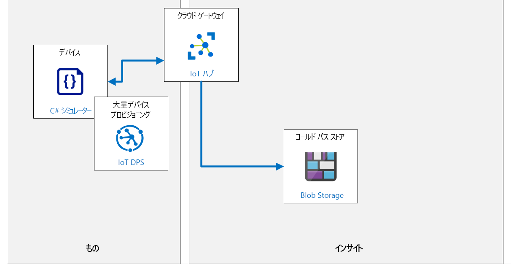

---
lab:
    title: 'ラボ 17: Azure IoT Hub を管理する方法'
    module: 'モジュール 9: ソリューションのテスト、診断、およびログ記録'
---

# Azure IoT Hub を管理する方法

## ラボ シナリオ

Contoso の資産監視およびトラッキング ソリューションは、優れた機能を提供しています。システムは包装および出荷プロセス全体で連続的な監視を提供しています。DPS 内にグループ登録を実装してデバイスを大規模にプロビジョニングし、コンテナーが宛先に到着すると、IoT デバイスは DPS を通じて「廃止」 され、将来の出荷に再利用できます。

IT 部署は、デバイスの使用率やその他のソリューションの特性を管理するために、IoT ソリューション内に Azure の監視およびログ サービスを実装するようチームに依頼しました。

追加のワークロードにコミットする前に、IT 担当者と確認できる簡単なメトリックを実装することに同意します。

このラボでは、接続デバイスとテレメトリ メッセージの送信数を追跡し、接続イベントをログに送信する監視を実装します。さらに、接続されているデバイスの数がしきい値の制限を超えたときにトリガーされるアラートを作成します。システムをテストするには、ルート CA 証明書チェーンで生成されたデバイス CA 証明書を使用して DPS で認証する 9 個のシミュレートされた IoT デバイスを構成します。IoT デバイスは、IoT Hub に製品利用統計情報を送信するように構成されます。

次のリソースが作成されます。



## このラボでは

このラボでは、次のタスクを正常に達成します。

* ラボの前提条件が満たされていることを確認する (必要な Azure リソースがあること)。
* 診断ログを有効にする。
* メトリックを有効にする。
* それらのメトリックのアラートを設定する。
* X.509 経由で接続し、ハブにメッセージを送信する IoT デバイスをシミュレートするアプリをダウンロードして実行します。
* アラートが作動し始めるまでアプリを実行する。
* メトリックを観察し、診断ログを確認する。

## ラボの手順

### 演習 1: ラボの前提条件を確認する

このラボでは、次の Azure リソースが使用可能であることを前提としています。

| リソースの種類 | リソース名 |
| :-- | :-- |
| リソース グループ | rg-az220 |
| IoT Hub | iot-az220-training-{your-id} |
| デバイス プロビジョニング サービス | dps-az220-training-{your-id} |
| ストレージ アカウント | staz220training{your-id} |

これらのリソースが利用できない場合は、演習 2 に進む前に、以下の指示に従って **lab17-setup.azcli** スクリプトを実行する必要があります。スクリプト ファイルは、開発環境構成 (ラボ 3) の一部としてローカルに複製した GitHub リポジトリに含まれています。

**lab17-setup.azcli** スクリプトは、**Bash** シェル環境で実行するために記述されています。Azure Cloud Shell でこれを実行するのが、最も簡単な方法です。

1. ブラウザーを使用して [Azure Cloud Shell](https://shell.azure.com/) を開き、このコースで使用している Azure サブスクリプションでログインします。

    Cloud Shell のストレージの設定に関するメッセージが表示された場合は、デフォルトをそのまま使用します。

1. Cloud Shell が **Bash** を使用していることを確認します。

1. Cloud Shell ツール バーで、「**ファイルのアップロード/ダウンロード**」 をクリックします(右から 4番目のボタン)。

1. ドロップダウンで、「**アップロード**」 をクリックします。

1. ファイル選択ダイアログで、開発環境を構成したときにダウンロードした GitHub ラボ ファイルのフォルダーの場所に移動します。

    _ラボ 3: 開発環境の設定_: ZIP ファイルをダウンロードしてコンテンツをローカルに抽出することで、ラボ リソースを含む GitHub リポジトリを複製しました。抽出されたフォルダー構造には、次のフォルダー パスが含まれます。

    * すべてのファイル
      * ラボ
          * 17- Azure IoT Hub を管理する方法
            * 設定

    lab17-setup.azcli スクリプト ファイルは、ラボ 17 の設定フォルダー内にあります。

1. **lab17-setup.azcli** ファイルを選択し、「**開く**」 をクリックします。

    ファイルのアップロードが完了すると、通知が表示されます。

1. 正しいファイルが Azure Cloud Shell にアップロードされたことを確認するには、次のコマンドを入力します。

    ```bash
    ls
    ```

    `ls` コマンドを使用して、現在のディレクトリの内容を表示します。一覧にある lab17-setup.azcli ファイルを確認できるはずです。

1. セットアップ スクリプトを含むこのラボのディレクトリを作成し、そのディレクトリに移動するには、次の Bash コマンドを入力します。

    ```bash
    mkdir lab17
    mv lab17-setup.azcli lab17
    cd lab17
    ```

1. **lab17-setup.azcli** スクリプトに実行権限があることを確認するには、次のコマンドを入力します。

    ```bash
    chmod +x lab17-setup.azcli
    ```

1. Cloud Shell ツールバーで、lab17-setup.azcli ファイルへのアクセスを有効にするには、「**エディタを開く**」 (右から 2 番目のボタン - **{ }**) をクリックします。

1. 「**ファイル**」 の一覧で、lab17 フォルダーを展開してスクリプト ファイルを開き 、**lab17**、「**lab17-setup.azcli**」 の順にクリックします。

    エディタは **lab17-setup.azcli** ファイルの内容を表示します。

1. エディターで、`{your-id}` と `{your-location}` 変数の値を更新します。

    サンプル例として、このコースの最初に作成した一意の id 、つまり **cah191211** に `{your-id}` を設定し、リソースにとって意味のある場所に `{your-location}` を設定する必要があります。

    ```bash
    #!/bin/bash

    # これらの値を変更してください!
    YourID="{your-id}"
    Location="{your-location}"
    ```

    > **注**:  `{your-location}` 変数は、すべてのリソースをデプロイするリージョンの短い名前に設定する必要があります。次のコマンドを入力すると、使用可能な場所と短い名前 (「**名前**」 の列) の一覧を表示できます。

    ```bash
    az account list-locations -o Table

    DisplayName           Latitude    Longitude    Name
    --------------------  ----------  -----------  ------------------
    East Asia             22.267      114.188      eastasia
    Southeast Asia        1.283       103.833      southeastasia
    Central US            41.5908     -93.6208     centralus
    East US               37.3719     -79.8164     eastus
    East US 2             36.6681     -78.3889     eastus2
    ```

1. エディター画面の右上で、ファイルに加えた変更を保存してエディターを閉じるには、「...」 をクリックし、「**エディターを閉じる**」 をクリックします。

    保存を求められたら、「**保存**」 をクリックすると、エディタが閉じます。

    > **注**:  **CTRL+S** を使っていつでも保存でき、 **CTRL+Q** を押してエディターを閉じます。

1. このラボに必要なリソースを作成するには、次のコマンドを入力します。

    ```bash
    ./lab17-setup.azcli
    ```

    このスクリプトの実行には数分かかります。各ステップが完了すると、出力が表示されます。

    このスクリプトは、まず **rg-az220** という名前のリソース グループを作成し、次に **iot-az220-training-{your-id}** という名前の IoT Hub と、**dps-az220-training-{your-id}** という名前のデバイス プロビジョニング サービスを作成します。サービスが既に存在する場合は、対応するメッセージが表示されます。スクリプトは IoT Hub と DPS をリンクします。その後、スクリプトは **staz220training{your-id}** という名前のストレージ アカウントを作成します。

    これで、このラボの演習 2 に進む準備が整いました。

### 演習 2: IoT Hub を使用したメトリックと診断ログの設定と使用

Azure リソース ログは、内部操作を記述する Azure リソースによって出力されるプラットフォーム ログです。すべてのリソース ログは共通の上位スキーマを共有し、各サービスで独自のイベントの一意のプロパティを出力する柔軟性を持ちます。

運用環境で実行されている IoT Hub ソリューションがある場合は、さまざまなメトリックを設定し、診断ログを有効にします。問題が発生した場合は、問題を診断し、より迅速に修正するのに役立つデータを確認します。

この演習では、診断ログを有効にし、それらを使用してエラーをチェックします。また、監視するメトリックを設定し、メトリックが一定の境界基準に達したときに発生するアラートも設定します。

#### タスク 1: 診断を有効化する

1. 必要な場合は、お使いの Azure アカウントの資格情報を使用して Azure portal にログインします。

    複数の Azure アカウントをお持ちの場合は、このコースで使用するサブスクリプションに関連付けられているアカウントを使用してログインしていることを確認してください。

1. Azure ダッシュボードで、「**iot-az220-training-{your-id}**」 をクリックします。

    ダッシュボードには、rg-az220 リソース グループ タイルの IoT Hub へのリンクが必要です。

1. 左側のメニューの 「**監視**」 の下にある、 「**診断の設定**」 をクリックします。

    > **注**: 現在のドキュメントでは、診断が既定で無効になっている可能性があることが示唆されています。その場合、IoT Hub の診断データを収集するために「診断を有効にする」必要があります。「**診断を有効にする**」 をクリックすると、「**診断設定**」 ペインが開きます。

1. 「**診断設定**」 ペインで、「**名前**」 の下にある 「**+ 診断設定の追加**」 をクリックします。

1. 「**診断設定名**」 テキスト ボックスに「**diags-hub**」と入力します。

1. 「**宛先の詳細**」 に表示されるオプションを確認してください。

    メトリックのルーティングに使用できるオプションが 3 つあることがわかります - それぞれの詳細については、以下のリンクを参照してください。

    * [Azure リソース ログをストレージ アカウントにアーカイブする](https://docs.microsoft.com/ja-jp/azure/azure-monitor/platform/resource-logs-collect-storage)
    * [イベント ハブへの Azure 監視データのストリーム配信](https://docs.microsoft.com/ja-jp/azure/azure-monitor/platform/stream-monitoring-data-event-hubs)
    * [Azure Monitor の Log Analytics ワークスペースで Azure リソース ログを収集する](https://docs.microsoft.com/ja-jp/azure/azure-monitor/platform/resource-logs-collect-workspace)

    このラボでは、ストレージ アカウント オプションを使用します。

1. 「**保存先の詳細**」 で 、「 **ストレージ アカウントにアーカイブする**」 をクリックします。

    この出力先オプションを選択すると、ログ カテゴリの **リテンション期間 (日)** を指定するオプションを含む追加のフィールドが使用可能になります。

    > **注**: ストレージ アカウントとコストに関する注意事項を確認してください。

1. 「**サブスクリプション**」 フィールドで、IoT Hub の作成に使用したサブスクリプションを選択します。

1. 「**ストレージ アカウント**」 フィールドで、**staz220training{your-id}** ストレージ アカウントを選択します。

    このアカウントは、lab17-setup.azcli スクリプトによって作成されました。ドロップダウンに表示されない場合は、手動でアカウントを作成する必要があります(インストラクターに確認してください)。

1. 「**診断の設定**」 ブレードの 「**カテゴリの詳細**」 で 、「**接続**」 をクリックし、「**DeviceTelemetry**」 をクリックします。

1. 選択したログ カテゴリごとに、「**リテンション期間 (日)**」 フィールドに **「7」** と入力します 。

1. ブレードの上部にある 「**保存**」 をクリックし、ブレードを閉じます。

    IoT Hub の 「**診断の設定**」 ペインで、作成した **diags-hub** 設定を表示するために**診断設定**の一覧が更新されたことが確認できます。

    後で診断ログを見ると、デバイスに関する接続と切断のログを確認できます。

#### タスク 2: メトリックの設定

このタスクでは、メッセージが IoT Hub に送信されるタイミングを監視するさまざまなメトリックを設定します。

1. IoT Hub ブレードが開いていることを確認します。

    前のタスクで、IoT HUb ブレードの 「**診断の設定**」 ペインが残っています。

1. 左側のメニューの 「**監視**」 で、「**メトリック**」 をクリックします。

    「**メトリック**」 ペインに、新しい空のグラフが表示されます。

1. 画面の右上にあるグラフの時間の範囲と粒度を変更するには、「**過去 24 時間 (自動)**」 をクリックします。

1. 表示されるコンテキスト メニューの 「**時間の範囲**」 で、「**過去 4 時間**」 をクリックします。

1. 同じコンテキスト メニューの 「**時間の粒度**」 ドロップダウンで 「**1 分**」 をクリックし、「**時刻の表示形式**」 で 「**ローカル**」 が選択されていることを確認します。

1. 時刻の設定を保存するには、「**適用**」 をクリックします。

1. グラフのメトリックを指定するための設定が使用されていることを確認してください。

    **グラフのタイトル**とツールバーの下に、メトリックを指定する領域が表示されます。

    * 「**スコープ**」 が既に **iot-az220-training-{your-id}** に設定されていることに注意してください。
    * 「**メトリック名前空間**」 は既に **IoT Hub 標準メトリック**に設定されています。

    > **注**: 既定では、使用できるメトリック名前空間は 1 つだけです。名前空間は類似のメトリックを分類またはグループ化する方法です。名前空間を使用すると、収集する情報またはパフォーマンス指標に基づいてメトリックのグループを分離できます。たとえば、アプリをプロファイリングするメモリ使用量のメトリックを追跡する **az220memorymetrics** という名前空間があるとします。**az220apptransaction** と呼ばれる別の名前空間は、アプリケーション内のユーザー トランザクションに関するすべてのメトリックを追跡する場合があります。カスタム メトリックスと名前空間の詳細については、[こちら](https://docs.microsoft.com/ja-jp/azure/azure-monitor/platform/metrics-custom-overview?toc=%2Fazure%2Fazure-monitor%2Ftoc.json#namespace)を参照してください。

    次の手順では、IoT Hub に送信されたテレメトリ メッセージの数を監視するために使用するメトリックを追加します。

1. 「**メトリック**」 ドロップダウンで、「**送信されたテレメトリ メッセージ**」 をクリックします。

    選択できるメトリックの数はたくさんあります。

1. 「**集計**」 で 「**合計**」 が選択されていることを確認します。

    4 つの集計操作 - *平均*、*最小*、*最大*、*合計* が使用可能であることに注意してください。

1. グラフを確認してください。

    選択したメトリックを反映するように、グラフのタイトルが更新されていることに注目してください。

    最初のメトリックの仕様を完了しました。次に、接続されているデバイスの数を監視するメトリックを追加します。

1. グラフのタイトルの下にあるツール バーで、「**メトリックの追加**」 をクリックします。

    新しいメトリックが表示されます。「**スコープ**」 と 「**メトリック名前空間**」 の値は事前に設定されています。

1. 「**メトリック**」 ドロップダウンで、「**接続されているデバイス (プレビュー)**」 をクリックします。

1. 「**集計**」 で 「**平均**」 が選択されていることを確認します。

    画面に、送信された製品利用統計情報のメッセージの最小メトリックと、接続されているデバイスの平均値の新しいメトリックが表示されます。グラフのタイトルが両方のメトリックを反映するように更新されていることに注意してください。

    > **注**: グラフ タイトルを編集するには、タイトルの右にある **鉛筆** をクリックします。

1. 「**グラフのタイトル**」 の下のツールバーの右側で、「**ダッシュボードにピン留め**」 をクリックし、「**現在のダッシュボードにピン留め**」 をクリックします。

    > **注**: 作成したグラフを保持するには、 ダッシュボードにピン留めする**必要**があります。

1. 「AZ-220」 ダッシュボードに移動し、チャートが表示されていることを確認します。

    > **注**: ドラッグ アンド ドロップ操作を使用して、グラフのサイズと位置をカスタマイズできます。

ログ記録を有効にし、メトリックを監視するグラフを設定したので、警告を設定することをお勧めします。

### 演習 3: アラートを設定する

監視データに重要な条件が見つかった場合、アラートが事前に通知されます。システムのユーザーが問題に気付く前に、問題を特定して対処できます。

資産トラッキング シナリオでは、センサーを使用して、顧客に出荷されるコンテナーを追跡します。出荷コンテナーにセンサーを追加するたびに、DPS を介して自動プロビジョニングされます。

今後の概念実証デモでは、現在輸送中のコンテナーの数が容量制限に近づくとトリガーされる アラートを作成します。アラートをトリガーするには、IoT Hub からのデバイス接続イベントの数を使用します。

この演習では、5 台以上のデバイスが接続されたときにトリガーされる警告を追加します。

1. 必要な場合は、お使いの Azure アカウントの資格情報を使用して Azure portal にログインします。

    複数の Azure アカウントをお持ちの場合は、このコースで使用するサブスクリプションに関連付けられているアカウントを使用してログインしていることを確認してください。

1. Azure ダッシュボードで、「**iot-az220-training-{your-id}**」 をクリックします。

    ダッシュボードには、rg-az220 リソース グループ タイルの IoT Hub へのリンクが必要です。

1. 左側のメニューの 「**監視**」 で、「**アラート**」 をクリックします。

    空の 「**アラート**」 ペインが表示されます。「**サブスクリプション**」、「**リソース グループ**」、「**リソース**」 と 「**時間の範囲**」 フィールドにあらかじめ値が入力されていることに注意してください。

1. 「**時間の範囲**」 ドロップダウンで、「**過去 1 時間**」 をクリックします。

1. 「**警告**」 ペインの上部で、「**+ 新しい警告ルール**」 をクリックします。

    「**アラート ルールの作成**」 ブレードが表示されます。

1. 「**アラート ルールの作成**」 ブレードを確認してください。

    ブレードには次の 4 つのセクションがあります。スコープ、条件、アクション グループ、およびアラート ルールの詳細です。スコープには、リソースと階層の 2 つのフィールドが表示されます。これらのフィールドには、IoT Hub のプロパティがあらかじめ入力されていることに注意してください。必要に応じて、事前に選択したリソースを編集できます。

1. 「**条件**」 で 「**条件の追加**」 をクリックします

    「**シグナル ロジックの構成**」 ペインが表示されます。使用可能なシグナルのページ分割されたテーブルが表示されていることに注意してください。テーブルの上のフィールドは、必要なシグナル タイプを見つけるためのテーブルをフィルター処理します。

1. **シグナル タイプ** については、**全て** が選択されていることを確認してください。

    「シグナルタイプ」 ドロップダウンを開くと、次の 3 つのオプションが表示されます。*全て*、*メトリック*、*アクティビティ ログ* です。

    > **注**: 監視に使用できるシグナル タイプは、選択したターゲットによって異なります。シグナル タイプは、メトリック、ログ検索クエリ、またはアクティビティ ログです。

1. 「**サービスの監視**」 で、「**すべて**」 が選択されていることを確認します。

    「監視サービス」 ドロップダウンを開くと、次の 3 つのオプションが表示されます。*すべて*、 *プラットフォーム*および *アクティビティ ログ - 管理*。

    > **注**:  プラットフォーム サービスはサービス使用率に関するメトリックを提供し、アクティビティ ログは管理アクティビティを追跡します。

1. 「**シグナル名で検索**」 テキスト ボックスに、「**接続済み**」と入力します

1. シグナルのリストは、入力内容に基づいて直ちにフィルタリングされます。

1. 「**シグナル名**」 で、「**接続されたデバイス**」 をクリックします。

    ペインが更新され、**メトリック**で作成したものと同様のグラフが表示されます。チャートには、選択したシグナルに関連付けられた値が表示されます (この場合は*接続デバイス (プレビュー)*)。

    グラフの下には、 **警告ロジック** を定義する領域があります。

1. **警告ロジック** のオプションを確認してください。

    **しきい値** には、*静的* と *動的* の 2つの選択が可能であることに注意してください。また、**静的** が選択され、このシグナル タイプでは **動的** が使用できないことにも注意してください。

    > **注**:  名前が示すように、 *静的しきい値* はしきい値の定数式を指定し、 *動的しきい値* 検出は詳細な機械学習 (ML) を活用してメトリックの履歴動作を学習し、可能性のあるサービスの問題を示すパターンと異常を特定します。*動的しきい値* の詳細については、 [こちら](https://docs.microsoft.com/ja-jp/azure/azure-monitor/platform/alerts-dynamic-thresholds) を参照してください。

    *接続されたデバイス (プレビュー)* シグナルが 5 以上になったときに、警告を発生する静的なしきい値を作成します。

1. 「**演算子**」 ドロップダウンで、「**次の値以上**」 をクリックします。

    このフィールドと他のフィールドの他のオプションをメモしておきます。

1. **集計タイプ**については、**平均**が選択されていることを確認してください。

1. **しきい値**テキスト ボックスに「**5**」と入力します

    > **注**: **条件プレビュー**には、入力した 「演算子」、「集計タイプ」、および 「しきい値」 の設定に基づいて、表示が更新される条件が表示されます。**条件プレビュー**の下にあるのは、領域 「**に基づく評価**」 です。これらの値は、上記で選択した**集計タイプ**を使用して集計される履歴期間と、条件が評価される頻度を決定します。

1. 「**単位**」 で、「**カウント**」 を選択します。

1. 「**集計の粒度 (期間)**」 で、「**5 分**」 が選択されていることを確認します。

1. 「**評価の頻度**」 で、「**1 分ごと**」 が選択されていることを確認します。

    > **注**: 「**評価の頻度**」 は 「**集計の粒度 (期間)**」 より短いため、スライディング ウィンドウの評価が行われます。つまり、毎分、前の 5 分の値が集計され (この場合は平均)、条件に対して評価されます。1 分の時間が経過すると、前の 5 分間のデータが再び集計されます 。- これには、1分の新しいデータと、すでに評価された4分のデータが含まれます。したがって、一度に 1 分進むスライディング ウィンドウがありますが、以前のウィンドウの一部としても評価された 4分のデータを常に含みます。

1. 「**シグナル ロジックの構成**」 ペインの下部で、警告条件を構成するには、「 **完了**」 をクリックします。

    「**シグナル ロジックの構成**」 ペインが閉じ、「**アラート ルールの作成**」 ブレードが表示されます。**条件**が入力され、**推定月額コスト**が表示されていることに注意してください。執筆時点では、警告条件の推定コストは $0.10 (USD) です。

    次に、警告条件が満たされたときに実行されるアクションを構成する必要があります。

1. **アクション グループ**領域を確認してください。

    アクション グループが選択されていません。**アクション グループを選択する**オプションがあります。

    > **注**: アクション グループは、Azure サブスクリプションの所有者によって定義された通知設定を集めたものです。アクション グループ名は、関連付けられているリソースグループ内で一意である必要があります。Azure Monitor および Service Health アラートは、アクション グループを使用して、アラートがトリガーされたことをユーザーに通知します。さまざまなアラートには、ユーザーの要件に応じて、同じアクション グループまたは異なるアクション グループを使用する場合があります。1 つのサブスクリプションで最大 2,000 のアクション グループを構成できます。アクション グループの作成と管理の詳細については、[こちら](https://docs.microsoft.com/ja-jp/azure/azure-monitor/platform/action-groups)を参照してください。

1. 「**アクション**」 で、「**アクション グループの追加**」 を選択します。

    「**このアラート ルールにアタッチするアクション グループを選択する**」 ペインが表示されます。選択したサブスクリプション内で使用可能な既存のアクション グループがある場合、それらはここに一覧表示されます。サブスクリプションを変更してリストをフィルター処理できることに注意してください。このラボでは、新しいアクション グループを作成します。

1. 「**このアラート ルールにアタッチするアクション グループを選択する**」 ペインで、「**アクション グループの作成**」 をクリックします。

    「**アクション グループの作成**」 ペインが表示されます。

1. 「**基本**」 タブの 「**サブスクリプション**」 で、このラボで使用するサブスクリプションが選択されていることを確認します。

1. 「**リソース グループ**」 ドロップダウンで、「**rg-az220**」 をクリックします。

    > **注**: アクション グループは通常、サブスクリプション全体で共有され、Azure サブスクリプション所有者が一元管理する可能性があります。そのため、プロジェクト固有のリソース グループ (「rg-az220」) ではなく、共通リソース グループに含まれる可能性が高くなります。ラボ後のリソースのクリーンアップを容易にするために、「rg-az220」 を使用しています。

    次の領域である**インスタンスの詳細**は、グループのフルネームと表示名を指定するために使用されます。

1. 「**アクション グループ名**」 に、「**AZ-220 メール アクション グループ**」と入力します。

    > **注**: アクション グループ名は、関連付けられているリソース グループ内で一意である必要があります。

1. 「**表示名**」 の下に、「**AZ220EmailAG**」を入力します

    > **注**: このグループを使用して通知を送信する場合は、完全なアクション グループ名の代わりに表示名前が使用され、最大 12 文字に制限されます。

1. **「次へ: 通知**」 をクリックして、アクション グループの通知フィールドを表示します。

1. 「**通知の種類**」 ドロップダウンを開き、使用可能なオプションを確認します。

1. 「**通知の種類**」 ドロップダウンで、「**メール/SMS/メッセージ/プッシュ/音声**」 をクリックします。

    > **注**: 通知の種類を選択すると、新しい空白の行が追加され、複数の通知を追加できるようになります。値のある各行の右側には、「**詳細の編集**」 アイコンと 「**削除**」 アイコンがあります。

1. 「**名前**」 に、「**AZ220Notifications**」と入力します。

1. 現在の通知の右側にある通知の詳細を入力するには、「**詳細の編集**」 をクリックします。

    「**メール/SMS メッセージ/プッシュ/音声**」 ペインが開きます。

1. 「**メール/SMS/メッセージ/プッシュ/音声**」 ブレードで 、「**メール**」 をクリックし、簡単にアクセスできるメール アドレスを入力します。

1. 「**SMS**」 をクリックし、 SMS アラートの受信に使用する電話の**国番号**と**電話番号**を入力します。

1. 「**Azure アプリのプッシュ通知**」 と 「**音声**」 をスキップします。

1. 「**共通のアラート スキーマを有効にする**」 で、「**はい**」 をクリックします。

   > **注**:  共通アラート スキーマを使用することには、多くの利点があります。今日の Azure でのアラート通知の使用エクスペリエンスを標準化します。これまで、今日の Azure の 3つのアラートの種類 (メトリック、ログ、およびアクティビティ ログ) には、独自のメール テンプレート、Webhook スキーマなどがあります。共通アラート スキーマを使用すると、一貫性のあるスキーマを使用してアラート通知を受信できるようになりました。共通の ALert6 スキーマの詳細については、[こちら](https://docs.microsoft.com/ja-jp/azure/azure-monitor/platform/alerts-common-schema)を参照してください。

   > **重要:** この利点を考えると、共通アラート スキーマがデフォルトで有効になっていない理由を疑問に思うかもしれませんが、「**はい**」 を選択すると、**共通アラートスキーマを有効にすると既存の統合が損なわれる可能性がある**という警告が表示されます。あなた自身の環境でこれを念頭に置いてください。

1. 「**メール/SMS/メッセージ/プッシュ/音声**」 ブレードの下部でアクション構成を保存するには、「**OK**」 をクリックします。

    通知行に、メールと SMS メッセージが選択されたことが表示されます。さらに変更が必要な場合は、「**詳細の編集**」 アイコンをクリックできます。

1. **「次へ: アクション**」 をクリックして、アクション グループのアクション フィールドを表示します。

1. 「**アクション タイプ**」 ドロップダウンを開き、使用可能なオプションを確認します。

    この時点で、*WebHooks* または *Azure 関数*を使用してビジネス統合を起動する必要がある場合は、複数のアクションを追加できますが、このラボでは簡単な通知で十分です。

1. 「**アクション グループの追加**」 ブレードの下部で、このアクション グループを検証するには、「**Review + create**」 をクリックします。

1. 検証が完了したら、「**作成**」 をクリックします。

    いくつかのことが同時に起こります。まず、「**アクション グループの追加**」 ブレードが閉じ、「**ルールの作成**」 ブレードに表示され、新しいアクション グループが 「**アクション**」 の一覧に追加されます。

    次に、SMS 通知とメールの両方を受け取り、**AZ220EmailAG** アクション グループに追加されたことを通知します。SMS メッセージでは、メッセージに返信して今後の通知の受信を停止することができます。 それらのオプションの詳細については、[こちら](https://docs.microsoft.com/ja-jp/azure/azure-monitor/platform/alerts-sms-behavior)を参照して下さい。メールには、クリックしてアクション グループの詳細を表示できるリンクがあり、メールの下部 (小さいフォント) に向かって購読停止のオプションが表示されます。

    次に、**アラート ルールの詳細**を構成します。

1. 「**アラート ルールの作成**」 ブレードの 「**アラート ルール名**」 フィールドで、「**5 台以上の接続デバイス**」と入力します。

    名前は、警告を識別するのに十分な説明を付ける必要があります。

1. 「**説明**」 フィールドで、「**iot-az220-training-{your-id} ハブに接続されているデバイスの数が 5 台以上の場合にこのアラートが発生します」** と入力します。

    説明フィールドはオプションですが、推奨されます。

1. 「**アラートをリソース グループに保存**」 フィールドで、予想されるリソース グループが選択されていることを確認します (例: **rg-az220**)。

1. 「**重要度**」 フィールドで、「**3 - 情報**」 が選択されていることを確認します。

    このシナリオでは、この警告は *情報であり* 、重大な障害を示すものではないため、「**Sev 3**」 が正しい選択です。

    > **注**:  重要度レベルのオプションの範囲は、**0 - 重要** から **4 - 詳細** です。

1. 「**作成時にアラート ルールを有効にする**」 フィールドで、チェックボックスが選択されている (チェックされている) ことを確認します。

    > **注**:  メトリック アラート ルールがアクティブになるには、最大 10 分間かかる場合があります。

1. ブレードの下部にある、「**警告ルールの作成**」 をクリックします。

    IoT Hub の 「**警告**」 ウィンドウが表示されます。真ん中のメッセージは、警告がないことを示しており、そのステータス メッセージの下に 「**警告ルールの管理 (1)**」 ボタンが追加されていることがわかります。

    > **注**: ペインが自動的に更新されていない場合は、「**更新**」 をクリックします。

ここで、警告をトリガーするために必要な環境を構成します。

### 演習 4: センサーのシミュレーション

Contoso の資産トラッキング システムをシミュレートするには、輸送コンテナー内に配置されている IoT デバイスをシミュレートする必要があります。各デバイスがアクティブ化されると、自動デバイス プロビジョニングを使用して IoT ソリューションに接続し、テレメトリの送信を開始する必要があります。自動的に接続するには、各デバイスが、グループ登録の作成に使用されるルート証明書へのチェーンの一部である独自の X.509 証明書を必要とします。

この演習では、既存の環境を検証し、必要なセットアップを実行し、9個のデバイス証明書を生成し、9台のデバイスをシミュレートするコンソール アプリケーションを構成します。

> **注**: このコースのラボ 6 (**ラボ 6-DPS でのデバイスの自動登録** ) では、X.509 リソースを使用するように DPS を構成しました。それでもなおその構成が使用可能な場合は、以下の 1 つ以上のタスクをスキップできる場合があります。

#### タスク 1: DPS 構成の検証

1. ブラウザーで [Azure portal](https://portal.azure.com/) に移動し、サブスクリプションにログインします。

1. **rg-az220** リソース グループのタイルで、**dps-az220-training-{your-id}** をクリックします

1. 左側のメニューの 「**設定**」 で、「**証明書**」 をクリックします。

1. 「**証明書**」 ウィンドウが開いた状態で、次の手順に従います。

    * 証明書の一覧が空の場合は、この演習の**タスク２** に直接移動します。**OpenSSL を検証します**。
    * **root-ca-cert** という名前の証明書がリストされている場合は、次の手順に進みます。

1. 表示されている証明書の場合は、「**ステータス**」 の値を確認し、次の手順に従います。

    * 証明書のステータスが **未確認の場合**:
        * 証明書をクリックして詳細を表示し、「**削除**」 をクリックします。
        * 削除を確認するために **証明書名** を入力し、「**OK**」 をクリックします。
        * この演習の **タスク ２** に直接移動します。**OpenSSL を検証します**。
    * 証明書のステータスが**検証済み**の場合は、次の手順に進みます。

1. 左側のメニューの 「**設定**」 で、「**登録の管理**」 をクリックします。

1. 「**登録の管理**」 ペインで、DPS の登録グループの一覧を表示するには、「**登録グループ**」 をクリックします。

1. **simulated-devices** 登録グループが一覧に表示されている場合は、次の演習つまり**演習 5** に直接移動します。**デバイスのシミュレーション**

1. **simulated-devices** 登録グループが存在しない場合は、次の手順に従います。

    * **root-ca-cert** という名前の検証済み証明書がある場合は、この演習の - **タスク 5** に直接移動 します。**登録グループの作成**。
    * 上記の検証済みの証明書が見つからない場合は、 **タスク 2:** に進みます。**OpenSSL を検証します**。

#### タスク 2: OpenSSL の確認

次の手順では、以前のラボにインストールされている OpenSSL ツールがまだ使用可能であることを確認します。

1. ブラウザーで、[Azure Cloud Shell](https://shell.azure.com/) に移動し、サブスクリプションにログインします。

1. シェルプロンプトで、次のコマンドを実行します。

    ```bash
    cd ~/certificates
    ```

1. 上記のコマンドで、「**このようなファイルまたはディレクトリはありません**」というエラーが表示された場合は、この演習の **タスク 3: OpenSSL ツールをインストールする** に直接移動してください。

1. Cloud Shell コマンド プロンプトで、次のコマンドを入力します。

    ```bash
    cd certs
    ```

    「**このようなファイルまたはディレクトリはありません**」 というエラーが表示された場合は、この演習のタスク 4 に直接移動します - **タスク 4: OpenSSL を使用して x.509 CA 証明書を生成および構成する**。

1. **certs** フォルダーが利用可能な場合は、この演習のタスク 5 に直接移動します - **タスク 5: 登録グループの作成**。

#### タスク 3: OpenSSL ツールをインストールする

1. Cloud Shellで、次のコマンドを入力します。

    ```bash
    mkdir ~/certificates

    # 証明書ディレクトリに移動
    cd ~/certificates

    # ヘルパー スクリプト ファイルをダウンロードする
    curl https://raw.githubusercontent.com/Azure/azure-iot-sdk-c/master/tools/CACertificates/certGen.sh --output certGen.sh
    curl https://raw.githubusercontent.com/Azure/azure-iot-sdk-c/master/tools/CACertificates/openssl_device_intermediate_ca.cnf --output openssl_device_intermediate_ca.cnf
    curl https://raw.githubusercontent.com/Azure/azure-iot-sdk-c/master/tools/CACertificates/openssl_root_ca.cnf --output openssl_root_ca.cnf

    # スクリプトのアクセス許可を更新して、ユーザーがスクリプトの読み取り、書き込み、実行を行えるようにする
    chmod 700 certGen.sh
    ```

#### タスク 4: OpenSSL を使用した x.509 CA 証明書の生成と構成

最初に必要な X.509 証明書は CA と中間証明書です。これらは `certGen.sh` helper script by passing the `create_root_and_intermediate` オプションを使用して生成できます。

1. Cloud Shell で、**~/certificates** ディレクトリに入っていることを確認します。

1. Cloud Shell コマンド プロンプトで CA と中間証明書を生成するには、次のコマンドを入力します。

    ```sh
    ./certGen.sh create_root_and_intermediate
    ```

    このコマンドコマンドは、`azure-iot-test-only.root.ca.cert.pem` という名前の CA ルート証明書を生成し、`./certs` ディレクトリに配置します。

1. Cloud Shell コマンド プロンプトで、ローカル コンピューターに `azure-iot-test-only.root.ca.cert.pem` 証明書をダウンロードするには (DPS にアップロードできるように)、次のコマンドを入力します。

    ```sh
    download ~/certificates/certs/azure-iot-test-only.root.ca.cert.pem
    ```

1. Azure portal で、**dps-az220-training-{your-id}** デバイス プロビジョニング サービスを開きます。

1. 「**デバイス プロビジョニング サービス**」 ブレードの左側のメニューの 「**設定**」 で、「**証明書**」 をクリックします。

1. 既存の **root-ca-cert** 証明書が表示された場合は、その証明書を選択して削除します。

1. 「**証明書**」 ペインで、ブレードの上部にある 「**追加**」 をクリック します。

1. 「**証明書の追加**」 ペインで、「**証明書の .pem または .cer ファイル**」 フィールドの右側にあるフォルダー アイコンをクリックします。

1. 「**開く**」 ダイアログで、ダウンロード フォルダーに移動して、**azure-iot-test-only.root.ca.cert.pem** をクリックして、「**開く**」 をクリックします。

    これは、作成されたばかりの `azure-iot-test-only.root.ca.cert.pem` CA 証明書です。

1. 「**証明書名**」 フィールドに、「**root-ca-cert**」と入力します。

    この名前は、証明書ファイルの名前と同じか、別の名前である可能性があります。これは、x.509 CA 証明書内の_共通名_と相関関係のない論理名です。

1. 「**保存**」 をクリックします。

    x.509 CA 証明書がアップロードされると、**「証明書」** ペインに **「未確認」** の**状態**の証明書が表示されます。この CA 証明書を使用して DPS に対してデバイスを認証できるようになる前に、証明書の**所有証明**を確認する必要があります。

1. 証明書の所有証明の確認プロセスを開始するには、「**root-ca-cert**」 をクリックします。

1. 「**証明書の詳細**」 ペインで、「**確認コードの生成**」 をクリックします。

1. 新しく生成された **確認コード** の値をコピーします。

    > **注**:  検証証明書を生成する間は、「**証明書の詳細**」 ペインを **開いた** ままにする必要があります。ペインを閉じると、確認コードが無効になり、新しいコードを生成する必要があります。

1. まだ開いていない場合は**Azure Cloud Shell** を開いて、`~/certificates` ディレクトリに移動します。

    DPS 内でたった今生成された**確認コード**を使用して CA 証明書から生成された証明書をアップロードすることで、CA 証明書の**所有証明**が DPS に提供されます。これは、CA 証明書を実際に所有していることを証明する方法です。

1. Cloud Shell コマンド プロンプトで、**検証証明書** (**確認コード**を渡す) を作成し、次のコマンドを入力します。

    ```sh
    ./certGen.sh create_verification_certificate <verification-code>
    ```

    必ず、`<verification-code>` プレースホルダーを Azure portal によって生成された **確認コード**に置き換えてください。

    たとえば、コマンド実行は次のようになります。

    ```sh
    ./certGen.sh create_verification_certificate 49C900C30C78D916C46AE9D9C124E9CFFD5FCE124696FAEA
    ```

    このコマンドは、確認コードを使用して CA 証明書にチェーンされた**検証証明書**を生成します。生成された検証証明書 `verification-code.cert.pem` は、Azure Cloud Shell の `./certs` ディレクトリ内にあります。

1. Cloud Shell コマンド プロンプトで、この **検証証明書**をローカル コンピューターにダウンロードし (DPS にアップロードできるように)、次のコマンドを入力します。

    ```sh
    download ~/certificates/certs/verification-code.cert.pem
    ```

1. Azure portal で、 **CA 証明書**の 「**証明書の詳細**」 ペインに戻ります。

1. 「**検証証明書の .pem または .cer ファイル**」 フィールドの右側にあるフォルダー アイコンをクリックします。

1. 「開く」 ダイアログで、ダウンロード フォルダーに移動して、**verification-code.cert.pem** をクリックして、「**開く**」 をクリックします。

    これは、新しく作成され、ダウンロードされた **検証証明書**ファイルです。

1. 「**証明書の詳細**」 ペインで、「**確認**」 をクリックします。

1. 「**証明書**」 ペインで、「**更新**」 をクリックします。

    CA 証明書の**所有証明**が完了すると、root-ca-cert 証明書の**ステータス**が**確認済み**として表示されることに注意してください。

#### タスク 5: 登録グループを作成する

1. Azure portal で、**dps-az220-training-{your-id}** デバイス プロビジョニング サービス ブレードが開いていることを確認します。

1. 左側のメニューの 「**設定**」 で、「**登録の管理**」 をクリックします。

    登録グループが一覧表示されていないことを確認します。

1. ブレードの上部にある、「**登録グループの追加**」 をクリックします。

1. 「**登録グループの追加**」 ブレードの 「**グループ名**」 フィールドに、**シミュレートされたデバイスを入力します**。

1. 「**証明タイプ**」 が 「**証明書**」に設定されていることを確認します。

1. 「**証明書のタイプ**」 フィールドが 「**CA 証明書**」 に設定されていることを確認します。

1. 「**プライマリ証明書**」 ドロップダウンで、「**root-ca-cert**」 をクリックします。

    「**このグループを割り当てることができる IoT Hub の選択**」 ドロップダウンで **iot-az220-training-{your-id}** IoT Hub がが含まれていることを確認してください。これにより、デバイスがプロビジョニングされると、この IoT Hub に追加されます。

1. 「初期デバイス ツイン状態」 フィールドで、`properties.desired` JSON オブジェクトを変更して、`telemetryDelay` という名前のプロパティを `"1"` という名前のプロパティに含めます。これは、センサーのテレメトリを読み取り、IoT Hub にイベントを送信するための遅延時間を設定するためにデバイスによって使用されます。

    最終的な JSON は次のようになります。

    ```js
    {
        "tags": {},
        "properties": {
            "desired": {
                "telemetryDelay": "1"
            }
        }
    }
    ```

1. ブレードの上部で、「**保存**」 をクリックします。

これで環境が設定されましたので、次はデバイス証明書を生成します。

### 演習 5: デバイスのシミュレーション

この演習では、ルート証明書から X.509 証明書を生成します。次に、DPS に接続して IoT Hub にテレメトリを送信する 9 台のデバイスをシミュレートするコンソール アプリケーションで、これらの証明書を使用します。

#### タスク 1: デバイス証明書の生成

これで、9 個のデバイス証明書を生成してダウンロードします。

1. [Azure Cloud Shell](https://shell.azure.com/) を開き、このコースで使用している Azure サブスクリプションでログインします。

1. Cloud Shell コマンド プロンプトで、ディレクトリ名の **監視** を作成してディレクトリ名監視に移動するには、次のコマンドを入力します。

    ```bash
    mkdir monitoring
    cd monitoring
    ```

1. デバイス生成スクリプトをコピーする空のファイルを作成するには、次のコマンドを入力します。

    ```bash
    touch gen-dev-certs.sh
    chmod +x gen-dev-certs.sh
    ```

1. 「Cloud Shell」 ツールバーの 「**エディタを開く**」 をクリックします。

    Cloud Shell エディターを開くボタンは、**{ }** アイコンで、右から 2番目です。

1. **ファイル**で「gen-dev-certs.sh ファイル」の内容を編集するには、「**監視**」 を クリックし、「**gen-dev-certs.sh**」 をクリックします。

    **gen-dev-certs.sh** ファイルは現在空です。

1. 次のコードをクラウド エディターに貼り付けます。

    ```bash
    #!/bin/bash

    # Generate 9 device certificates
    # Rename for each device
    # download from the Cloud CLI
    pushd ~/certificates
    for i in {1..9}
    do
        chmod +w ./certs/new-device.cert.pem
        ./certGen.sh create_device_certificate asset-track$i
        sleep 5
        cp ./certs/new-device.cert.pfx ./certs/sensor-thl-200$i.cert.pfx
        download ./certs/sensor-thl-200$i.cert.pfx
    done
    popd
    ```

    このスクリプトは、9 個のデバイス証明書を作成してダウンロードします。

1. 編集した **gen-dev-certs.sh** ファイルを保存するには、**CTRL-Q** を押します。

    エディターを閉じる前に変更を保存するかどうかを確認するメッセージが表示されたら、「**保存**」 をクリックします。

1. Cloud Shell コマンド プロンプトで、**gen-dev-certs.sh** スクリプトを実行するには、次のコマンドを入力します。

    ```bash
    ./gen-dev-certs.sh
    ```

    スクリプトの実行中に、証明書生成プログラムからの出力が表示されると、ブラウザーは各証明書を自動的にダウンロードします。

    > **注**: ブラウザーでファイルの操作を確認するメッセージが表示されたら、ファイルごとに 「**保存**」 をクリックします。


    完了すると、ブラウザーのダウンロード場所で 9 個の証明書を入手できます。

    * sensor-thl-2001.cert.pfx
    * sensor-thl-2002.cert.pfx
    * sensor-thl-2003.cert.pfx
    * sensor-thl-2004.cert.pfx
    * sensor-thl-2005.cert.pfx
    * sensor-thl-2006.cert.pfx
    * sensor-thl-2007.cert.pfx
    * sensor-thl-2008.cert.pfx
    * sensor-thl-2009.cert.pfx

これらの証明書が使用可能になると、デバイス シミュレーターの構成準備完了です。

#### タスク 2: シミュレーターに証明書を追加する

1. ダウンロードした X.509 デバイス証明書ファイルをラボ 17 **スターター** フォルダーにコピーします。

    _ラボ 3: 開発環境の設定_: ZIP ファイルをダウンロードしてコンテンツをローカルに抽出することで、ラボ リソースを含む GitHub リポジトリを複製しました。抽出されたフォルダー構造には、次のフォルダー パスが含まれます。

    * すべてのファイル
      * ラボ
          * 17- Azure IoT Hub を管理する方法
            * スターター

    ラボ 17 のスターター フォルダーには、SimulatedDevice.csproj ファイルと Program.cs ファイルが含まれています。デバイス プロビジョニング サービスに対して認証を行う場合、プロジェクトはこの証明書ファイルにアクセスする必要があります。ファイルは、プロジェクトフォルダーのルートに配置する必要があります。

    コピー後、証明書ファイルは次の場所に配置されます。

    ```text
    /Starter/sensor-thl-2001.cert.pfx
    /Starter/sensor-thl-2002.cert.pfx
    /Starter/sensor-thl-2003.cert.pfx
    /Starter/sensor-thl-2004.cert.pfx
    /Starter/sensor-thl-2005.cert.pfx
    /Starter/sensor-thl-2006.cert.pfx
    /Starter/sensor-thl-2007.cert.pfx
    /Starter/sensor-thl-2008.cert.pfx
    /Starter/sensor-thl-2009.cert.pfx
    ```

1. Visual Studio Code を開きます。

1. 「**ファイル**」 メニューで、「**フォルダーを開く**」 をクリックします。

1. 「**フォルダを開く**」 ダイアログで、ラボ 17 スターター フォルダに移動し、「**スターター**」 をクリックし、「**フォルダの選択**」 をクリックします。

    > **注**: Visual Studio Code が、アセットの読み込みや復元の実行を推奨している場合は、次の推奨事項に従います。

1. **「エクスプローラ」** ペインで、Program.cs ファイルを開くには、「**Program.cs**」 をクリックします。

    証明書ファイルも表示されるはずです。

1. コード エディターで、変数 `GlobalDeviceEndpoint` を見つけます。

    値は `global.azure-devices-provisioning.net` に設定されています。これは、 パブリック Azure クラウド内の Azure デバイス プロビジョニング サービス (DPS) の**グローバル デバイス エンドポイント**です。Azure DPS に接続しているすべてのデバイスは、このグローバル デバイス エンドポイントの DNS 名で構成されます。

    ```csharp
    private const string GlobalDeviceEndpoint = "global.azure-devices-provisioning.net";
    ```

1. `dpsIdScope` 変数を見つけます。

    ```csharp
    private static string dpsIdScope = "<DPS-ID-Scope>";
    ```

    `<DPS-ID-Scope>` プレースホルダーの値を実際の値に置き換える必要があります。

1. Azure Cloud Shell を表示するブラウザーの画面に戻ります。

1. Cloud Shell コマンド プロンプトで、DPS サービスの ID スコープを表示するには、次のコマンドを入力します。

    ```bash
    az iot dps show --name dps-az220-training-{your-id} --query properties.idScope
    ```

    > **注**: {your-id} を、このクラスの最初に作成した ID に置き換えてください。

1. 上記のコマンドで生成された出力をコピーします。

    値をダブルクリックして選択し、通常どおりにコピーできます。

1. Visual Studio Code に戻ります。

1. `<DPS-ID-Scope>` の値を Azure Cloud Shell からコピーした値に置き換えます。

    コードは次のようになります。

    ```csharp
    private static string dpsIdScope = "0ne000A6D9B";
    ```

1. 「**ファイル**」 メニューの 「**上書き保存**」 をクリックします。

このアプリは、以前のラボで使用された **DPS でのデバイスの L06 自動登録** アプリに非常によく似ています。主な違いは、単一のデバイス シミュレーターを登録してテレメトリを送信するのではなく、30 秒に 1 つずつ 9 個のデバイスを登録するということです。シミュレートされた各デバイスは、テレメトリを送信します。これにより、警告が発生し、監視データがストレージにログ記録されます。

#### タスク 3: シミュレーターの実行

1. Visual Studio Code の、「**ターミナル**」 メニューで、「**新しいターミナル**」 をクリックします。

1. ターミナル コマンド プロンプトで、アプリを実行するには、次のコマンドを入力します。

    ```bash
    dotnet run
    ```

    DPS 経由で接続されている最初のデバイスを示す出力が表示され、次にテレメトリが送信されます。その後 30秒ごとに追加のデバイスが接続され、9個のデバイスすべてが接続され、テレメトリを送信するまでテレメトリの送信が開始されます。

1. Azure portal の DPS グループ登録に戻ります。

1. 「**シミュレートされたデバイス**」 登録 グループで、接続されているデバイスを表示するには、「**登録レコード**」 をクリックします。

    接続したデバイスのリストが表示されます。「**更新**」 をクリックすると、リストを更新できます。

    デバイスを接続してテレメトリを送信したので、5個以上のデバイスを接続したら、5 分間警告のトリガーを待ちます。次のような SMS メッセージが表示されます。

    ```text
    AZ220EmailAG:Fired:Sev3 Azure Monitor Alert Connected Devices Greater or Equal to 5 on <your IoT Hub>
    ```

1. アラートが到着したら、アプリケーションを終了します。

    Visual Studio Code ターミナルで **CTRL+C** を押すか、または Visual Studio Code を閉じます。

    > **注**:  デバイスが切断されると、アラートが解決されたことを知らせるメッセージが表示されます。

次に、ストレージ アカウントを確認し、Azure Monitor によってログに記録されたものがあるかどうかを確認します。

### 演習 6: メトリック、アラート、アーカイブの確認

この演習では、このラボで先ほど構成したレポート リソースとログ リソースの一部を調べ、経過した短時間で記録されたイベント データを確認します。

#### タスク 1: ポータルでのメトリックの確認

1. Azure portal で、グラフ タイトルをクリックして、ダッシュボードにピン留めしたメトリック グラフを開きます。

    グラフが開き、ページに表示されます。

1. 時刻の値を **「過去 30 分**」 に変更します。

    *送信されたテレメトリ メッセージ*と **接続された デバイス (プレビュー)** 値がグラフの下部に表示され、グラフの一番下に最新の数字が表示されます。－ グラフの上にマウスを移動すると、特定の時点の値が表示されます。

#### タスク 2: アラートを見る

Azure portal を使用してアラートを確認するには、次の手順を実行します。

1. Azure portal で、ダッシュボードにもう一度アクセスしてください。

1. Azure portal ツール バーの検索ボックスに、「**モニター**」と入力します。

1. 検索結果ペインの 「**サービス**」 で 「**監視**」 をクリック します。

    「**モニタ - 概要**」 ページが表示されます。これは、現在のサブスクリプションのすべての監視アクティビティの概要です。

1. 左側のメニューで、リストの上部にある 「**アラート**」 をクリックします。

    このアラートビューには、すべてのサブスクリプションのすべてのアラートが表示されます。これを IoT Hub に絞り込みましょう。

1. ブレードの上部近くの 「**サブスクリプション**」 で、このクラスに使用しているサブスクリプションを選択します。

1. 「**リソース グループ**」 ドロップダウンで、「**rg-az220**」 をクリックします。

1. 「**リソース**」 ドロップダウンで、**iot-az220-training-{your-id}** をクリックします

1. 「**時間の範囲**」 ドロップダウンで、「**過去1 時間**」 をクリックします。

    過去 1 時間のアラートの概要が表示されるはずです。「**合計アラート ルール**」に、「**1**」という、前に作成したアラートが表示されます。この下に、重大度カテゴリの一覧と、カテゴリごとのアラートの数が表示されます。関心の対象となるアラートは **3 - 情報** です。少なくとも 1つが表示されます (デバイス シミュレーターを停止して再起動した場合は、そのアラートが 1 つ以上生成されている可能性があります)。

1. 結果の一覧の、「**3 - 情報**」 をクリックします。

    「**すべてのアラート**」 ページが開きます。ページの上部に、いくつかのフィルター フィールドが表示されます - 選択した IoT Hub の **3 - 情報** アラートのみが表示されるように、上記の画面の値が入力されています。アクティブなアラートと共に、警告があるかどうかが表示されます。

1. 「**名前**」 で 3 - 情報アラートを選択し、「**5 個以上の接続されたデバイス**」 をクリックします。

    アラートの詳細の**概要**が表示されたペインが開きます。これには、アラートが発生した理由を示すチャートが含まれます (ダッシュラインは、しきい値と監視対象メトリックの現在の値を示しています)。以下は、**設定基準**の詳細およびその他の詳細です。

1. ペインの上部にあるタイトルの下の、「**履歴**」 をクリックします。

    このビューでは、いつアラートが発生したか、呼び出されたアクション グループ、およびいつアラートが解決されたなどのその他の変更を確認できます。

1. ペインの上部にあるタイトルの下の 「**診断**」 をクリックします。

    アラートに関連する問題がある場合は、追加の詳細がここに表示されます。

#### タスク 3: 診断ログを参照する

このラボの前半では、Blob Storage にエクスポートする診断ログを設定しました。書き込まれた内容を確認してみましょう。

1. ダッシュボードに移動し、「rg-az220」 リソース グループ タイルを探します。

1. リソースの一覧で、以前に作成したストレージ アカウント - 「**staz220training{your-id}**」 を選択します。

    ストレージ アカウントの **概要**が表示されます。

1. ストレージ アカウントのメトリック チャートが表示されるまで下にスクロールします。*出力の合計*、 *合計イングレス*、 *平均待ち時間* 、および *要求の内訳*。

    アクティビティが表示されているはずです。

1. 左側のメニューで、ログに記録されたデータを表示するには、「**Storage Explorer (プレビュー)**」 をクリックします。

1. 「**Storage Explorer**」 ペインで、**BLOB コンテナー** ノードを展開します。

    Azure Monitor が最初にデータをストレージ アカウントに送信すると、 **insights-logs-connection** というコンテナーが作成されます。

1. 「**BLOB コンテナー**」 で 、「**insights-logs-connection**」 をクリックします。

    コンテナーの内容が右側に表示されます。

    ログは、非常にネストされた方法でコンテナーに書き込まれます。実際のログ データに移動するには、各サブフォルダーを順番に開く必要があります。その構造は、たとえば以下のようになっています。

    * **resourceId=**
      * **SUBSCRIPTIONS**
        * **<GUID>** - これは、ログを生成したサブスクリプションの ID です。
          * **RESOURCEGROUPS** - には、ログを生成した各リソース グループのフォルダが含まれています。
            * "RG-AZ220" - IoT Hub を含むリソース グループ
              * **PROVIDERS**
                * **MICROSOFT.DEVICES**
                  * **IOTHUBS**
                    * **IOT-AZ220-TRAINING-{YOUR-INITIALS-AND-CURRENT-DATE}** - には、ログが生成された各年のフォルダが含まれています。
                      * **Y=2019** - には、ログが生成された各月のフォルダが含まれています。
                        * **m=12** -  には、ログが生成された各日のフォルダが含まれます。
                          * **d=15** -  には、ログが生成された毎時のフォルダが含まれます。
                            * **h=15** - には、ログが生成された毎分のフォルダが含まれます。
                              * **m=00** -  には、毎分のログ ファイルが含まれています。

    現在の日付に到達するまでドリルダウンし、最新のファイルを選択します。

1. ファイルを選択した状態で、ペインの上部にあるツール バーで 「**ダウンロード**」 をクリックします。

1. ダウンロードしたファイルを Visual Studio Code で開きます。

    JSON の行数が表示されます。

1. JSON を読みやすくするには、 **F1** キーを押して「**ドキュメントのフォーマット**」と入力し、オプションのリストから 「**ドキュメントのフォーマット**」 を選択します。

    次のように、接続イベントと切断イベントのリストが JSON 表現で表示されます。

    ```json
    {
        "time": "2019-12-26T14:32:45Z",
        "resourceId": "/SUBSCRIPTIONS/AE82FF3B-4BD0-462B-8449-D713DD18E11E/RESOURCEGROUPS/AZ-220/PROVIDERS/MICROSOFT.DEVICES/IOTHUBS/iot-az220-training-cah191216",
        "operationName": "deviceConnect",
        "category": "Connections",
        "level": "Information",
        "properties": "{\"deviceId\":\"sensor-thl-2009\",\"protocol\":\"Amqp\",\"authType\":\"{\\\"scope\\\":\\\"device\\\",\\\"type\\\":\\\"x509Certificate\\\",\\\"issuer\\\":\\\"external\\\",\\\"acceptingIpFilterRule\\\":null}\",\"maskedIpAddress\":\"67.176.115.XXX\",\"statusCode\":null}",
        "location": "westus"
    }
    {
        "time": "2019-12-26T14:37:29Z",
        "resourceId": "/SUBSCRIPTIONS/AE82FF3B-4BD0-462B-8449-D713DD18E11E/RESOURCEGROUPS/AZ-220/PROVIDERS/MICROSOFT.DEVICES/IOTHUBS/iot-az220-training-cah191216",
        "operationName": "deviceDisconnect",
        "category": "Connections",
        "level": "Information",
        "properties": "{\"deviceId\":\"sensor-thl-2008\",\"protocol\":\"Amqp\",\"authType\":null,\"maskedIpAddress\":\"67.176.115.XXX\",\"statusCode\":null}",
        "location": "westus"
    }
    {
        "time": "2019-12-26T14:37:29Z",
        "resourceId": "/SUBSCRIPTIONS/AE82FF3B-4BD0-462B-8449-D713DD18E11E/RESOURCEGROUPS/AZ-220/PROVIDERS/MICROSOFT.DEVICES/IOTHUBS/iot-az220-training-cah191216",
        "operationName": "deviceDisconnect",
        "category": "Connections",
        "level": "Information",
        "properties": "{\"deviceId\":\"sensor-thl-2004\",\"protocol\":\"Amqp\",\"authType\":null,\"maskedIpAddress\":\"67.176.115.XXX\",\"statusCode\":null}",
        "location": "westus"
    }
    ```

    個々のエントリは 1つの JSON レコードであることに注意してください - ドキュメント全体は有効な JSON ドキュメントではありませんが。各レコード内には、発生元の IoT Hub に関する詳細と 各イベントの**プロパティ**が表示されます。**プロパティ** オブジェクト内で、**deviceId** の接続 (または切断) を確認できます。
