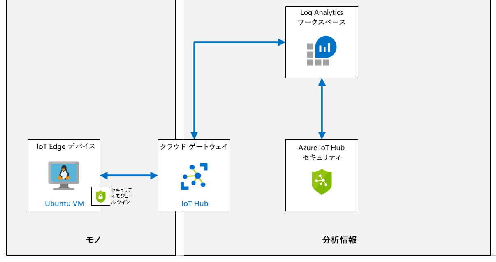
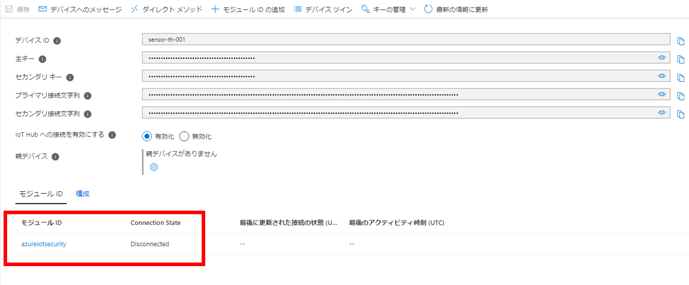
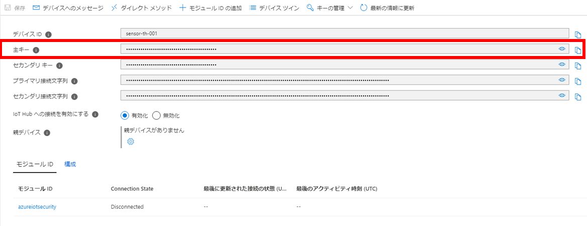
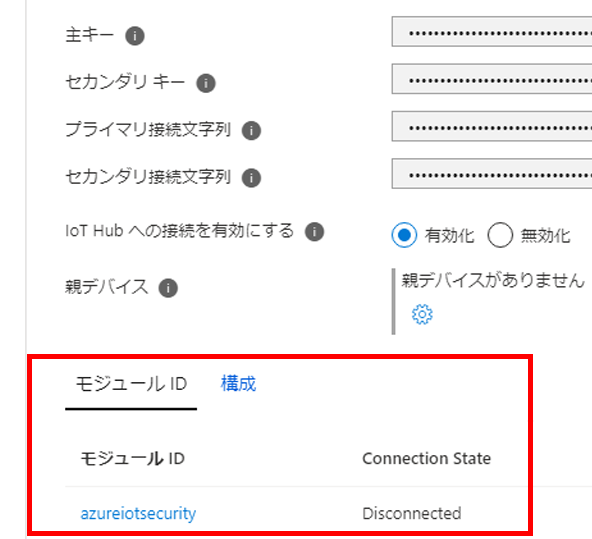

---
lab:
  title: 'ラボ 18:Azure Defender for IoT で IoT デバイスが改ざんされているかどうかを検出する'
  module: 'Module 10: Azure Defender and IoT Security'
---

# <a name="detect-device-tampering-with-azure-defender-for-iot"></a>Azure Defender for IoT でデバイス改ざんされているかどうかを検出する

## <a name="lab-scenario"></a>課題シナリオ

Contoso は、セキュリティを考慮してすべてのソリューションを構築しました。 ただし、Azure IoT ソリューションを含め、オンプレミスとクラウドのすべてのワークロードでセキュリティに関する統一されたビューを得る方法を知りたいと考えています。 さらに、新しいデバイスをオンボードする場合、同社はセキュリティ標準への準拠とセキュリティ体制の向上を確実にするために、ワークロード (リーフ デバイス、Microsoft Edge デバイス、IoT Hub) にセキュリティ ポリシーを適用したいと考えています。

Contoso は、新しい IoT デバイスを備えた新しいアセンブリ ラインを追加して、新しい注文に対する出荷と梱包の要求を増やすのに役立ちます。 新しいデバイスがセキュリティで保護されていることと、ソリューションのセキュリティを継続的に向上させるのに役立つ、セキュリティに関する推奨事項を確認する必要があります (完全なエンドツーエンド IoT ソリューションを検討)。 ソリューションに対する Azure IoT Center for IoT の使用について調査を開始します。

また、Contoso はさまざまなチーズ セラーの温度を監視し制御する機能を向上させる、新しく接続されたサーモスタットも導入しています。 Contoso のセキュリティ要件の一部として、サーモスタットがテレメトリ送信の想定頻度を超えているかどうかを監視するカスタム アラートを作成します。

次のリソースが作成されます。



> **助言**：**Azure Defender for IoT** は、以前は **Azure Security Center for IoT** と呼ばれていました。 名前の変更が段階的に展開されるため、オンライン ドキュメント、GitHub リソース、およびこのコンテンツにいくつかの矛盾が見つかる場合があります。

## <a name="in-this-lab"></a>このラボでは

このラボでは、次のタスクを正常に達成します。

* ラボの前提条件を構成する (必要な Azure リソース)
* Azure Defender for IoT を有効にする
* 新しいデバイスを作成して登録する
* セキュリティ モジュール ツインを作成する
* Linux デバイスに C# ベースのセキュリティ エージェントをインストールする
* 監視対象リソースを構成する
* カスタム アラートの作成
* 警告をトリガーするコンソール アプリを作成する
* Azure Security Center でアラートを確認する

## <a name="lab-instructions"></a>ラボの手順

### <a name="exercise-1-configure-lab-prerequisites"></a>演習 1:ラボの前提条件を構成する

このラボでは、次の Azure リソースが使用可能であることを前提としています。

| リソースの種類 | リソース名 |
| :-- | :-- |
| リソース グループ | rg-az220 |
| IoT Hub | iot-az220-training-{your-id} |

これらのリソースを確実に使用できるようにするには、次の手順に従います。

1. 仮想マシン環境で Microsoft Edge ブラウザー ウィンドウを開き、次の Web アドレスに移動します。
 
    +++https://portal.azure.com/#create/Microsoft.Template/uri/https%3A%2F%2Fraw.githubusercontent.com%2FMicrosoftLearning%2FAZ-220-Microsoft-Azure-IoT-Developer%2Fmaster%2FAllfiles%2FARM%2Flab18.json+++

    > **注**:緑色の "T" 記号 (例: +++このテキストを入力+++) が表示されているときはいつでも、関連付けられているテキストをクリックすると、仮想マシン環境内の現在のフィールドに情報が入力されます。

1. Azure portal にログインするように求められた場合は、このコースで使用している Azure 資格情報を入力します。

    **[カスタム デプロイ]** ページが表示されます。

1. **[プロジェクトの詳細]** の **[サブスクリプション]** ドロップダウンで、このコースで使用する [Azure サブスクリプション] が選択されていることを確認します。

1. **[リソース グループ]** ドロップダウンで、 **[rg-az220]** を選択します。

    > **注**:**rg-az220** がリストにない場合:
    >
    > 1. **[リソース グループ]** ドロップダウンで、 **[新規作成]** をクリックします。
    > 1. **[名前]** に「**rg-az220**」と入力します。
    > 1. **[OK]** をクリックします。

1. **[インスタンスの詳細]** の **[リージョン]** ドロップダウンで、最も近いリージョンを選択します。

    > **注**:**rg-az220** グループが既に存在する場合、 **[リージョン]** フィールドは、リソース グループで使用されるリージョンに設定され、読み取り専用になります。

1. **[Your ID](ユーザー ID)** フィールドに、演習 1 で作成した一意の ID を入力します。

1. **[コース ID]** フィールドに、「**az220**」と入力します。

1. テンプレートを検証するには、 **[確認および作成]** をクリックします。

1. 検証に成功したら、 **[作成]** をクリックします。

    デプロイが開始されます。

1. デプロイが完了した後、テンプレートの出力値を確認するには、左側のナビゲーション領域で **[出力]** をクリックします。

    後で使用するために出力をメモしておきます。

    * connectionString

これで、リソースが作成されました。

### <a name="exercise-2-enable-azure-defender-for-iot-hub"></a>演習 2:Azure Defender for IoT Hub を有効にする

Azure Defender for IoT を使用すると、セキュリティ管理を統一したり、ハイブリッド クラウド ワークロードと Azure IoT ソリューション全体でエンド ツー エンドの脅威の検出および分析を行ったりできます。

Azure Defender for IoT は、次のコンポーネントで構成されています。

* IoT Hub 統合
* デバイス エージェント (オプション)
* セキュリティ メッセージの送信 SDK
* 分析パイプライン

#### <a name="task-1-enable-azure-defender-for-iot"></a>タスク 1:Azure Defender for IoT を有効にする

このタスクでは、IoT Hub 用の **Azure Defender for IoT** を有効にします。

1. 必要な場合は、お使いの Azure アカウントの資格情報を使用して Azure portal にログインします。

    複数の Azure アカウントをお持ちの場合は、このコースで使用するサブスクリプションに関連付けられているアカウントを使用してログインしていることを確認してください。

1. Azure ダッシュボードで、 **[iot-az220-training-{your-id}]** をクリックします。

    ダッシュボードの rg-az220 リソース グループ タイルには、IoT Hub へのリンクが必要です。

1. 左側のメニューの **[Defender for IoT]** の下にある **[概要]** をクリックします。

    Azure Defender for IoT Hub は、セキュリティ ウィンドウが初めて開くとオンボードされます。

1. **[IoT ソリューションを保護する]** ボタンが表示された場合は、 **[IoT ソリューションを保護する]** をクリックし、プロンプトが表示されたらブラウザー ウィンドウを更新します。

    しばらくすると、**[この IoT Hub のオンボーディングを成功しました。有効にするには更新してください]** というメッセージが表示されます。

1. 時間をとって [セキュリティの概要] ウィンドウのコンテンツを確認します。

    > **注**:Azure Defender for IoT をオンボードした最初の瞬間に脅威が即座に検出されるわけではありません。このラボが終了する前に、この [概要] ペインで脅威の検出が報告されるようになります。

#### <a name="task-2-log-analytics-creation"></a>タスク 2:Log Analytics の作成

Azure Defender for IoT を有効にすると、IoT デバイス、IoT Edge、IoT Hub に関する生のセキュリティ イベント、アラート、レコメンデーションを格納するための Azure Log Analytics ワークスペースを作成する必要があります。

このタスクでは、Log Analytics のワークスペース構成をさらっと確認します。

1. 左側のナビゲーション領域の **[Defender for IoT]** の下にある **[設定]** をクリックします。

    **[設定]** ページが表示され、構成可能な 4 つの領域が一覧表示されます。

    * データ収集
    * 推奨構成
    * 監視対象リソース
    * カスタム アラート

1. 既定の**データ収集**設定を確認するには、 **[データ収集]** をクリックします。

1. **[ワークスペースの構成]** セクションの **[接続する Log Analytics ワークスペースの選択:]** で、トグル ボタンが **[オン]** に設定されていることを確認します。

1. **[サブスクリプション]** ドロップダウンで、このラボで使用しているサブスクリプションが選択されていることを確認します。

1. **[ワークスペース]** ドロップダウンで、[**新しいワークスペースの作成]** をクリックします。

1. **[Log Analytics ワークスペース]** ペインの **[Log Analytics ワークスペース]** で、「**log-az220-training-{your-id}**」と入力します。

1. **[サブスクリプション]** で、このコースに使用するサブスクリプションが選択されていることを確認します。

1. **[リソース グループ]** ドロップダウンで、 **[rg-az220]** をクリックします。

1. **[場所]** ドロップダウンで、最寄りの Azure リージョン、つまり Azure IoT Hub がプロビジョニングされているリージョンを選択します。

    使用可能なリージョンを表示するには、[https://azure.microsoft.com/global-infrastructure/services/?products=monitor&regions=all](https://azure.microsoft.com/global-infrastructure/services/?products=monitor&regions=all) を参照してください。

1. **[価格レベル]** で、 **[従量課金制]** が選択されていることを確認します。

1. ワークスペースを作成するには 、 **[OK]** をクリックします。

    しばらくすると、ワークスペースが作成され、ペインが閉じます。

1. **[設定 | データ コレクション]** ページに戻り、 **[ワークスペース]** ドロップダウンで、 **[log-az220-training-{your-id}]** を選択します

1. **[未加工のセキュリティ データへのアクセス]** がチェックされていることを確認します。

1. **[詳細なセキュリティの推奨事項とカスタム アラート]** がチェックされていることを確認します。

1. **[IP データ収集]** がチェックされていることを確認します。

1. データ収集構成を保存するには、 **[保存]** をクリックし、ページを閉じるには、ページの右上にある **[閉じる]** ボタンをクリックします。

### <a name="exercise-3-create-and-register-a-new-device"></a>演習 3:新しいデバイスの作成と登録

この演習では、仮想マシンをセットアップし、IoT デバイスのシミュレーションに使用します。 このラボの後半では、このデバイスを使用してコンベア ベルトの振動を測定します。

#### <a name="task-1-create-a-new-iot-device"></a>タスク 1:新しい IoT デバイスを作成する

このタスクでは、IoT デバイスを表す仮想マシンを作成します。 このラボでは、IoT デバイス (VM) にセキュリティ モジュールをインストールするため、シミュレートされたデバイス コードではなく VM を使用しています。

1. Azure アカウントの資格情報を使用して [portal.azure.com](https://portal.azure.com) にログインします。

1. **[リソース、サービス、ドキュメントの検索]** フィールドに、**[仮想マシン]** と入力します。

1. 検索結果の **[サービス]** で **[仮想マシン]** をクリックします。

1. **[仮想マシン]** ページで、 **[+ 作成]** をクリックして **[仮想マシン]** を選択します。

1. **[仮想マシンの作成]** ブレードの **[サブスクリプション]** ドロップダウンで、このコースに使用するサブスクリプションが選択されていることを確認します。

1. **[リソース グループ]** ドロップダウンで、 **[rg-az220vm]** をクリックします。

    > **注**:このコースで作成されたすべての仮想マシン リソースを追跡および管理するために、単一のリソース グループが使用されています。 **rg-az220vm** リソース グループがまだ作成されていない場合は、次の手順を使用して今すぐ作成してください。

    * **[リソース グループ]** ドロップダウンで、 **[新規作成]** をクリックします。
    * コンテキスト メニューの **[名前]** で、「**rg-az220vm**」と入力し、**[OK]** をクリックします。

    > **注**:VM ごとに個別のリソース グループを作成することを提案するガイダンスが表示される場合があります。 VM ごとに個別のリソース グループを用意すると、VM に追加する追加リソースを管理するのに役立ちます。 このコースで VM を使用する簡単な方法では、VM ごとに個別のリソース グループを用意する必要はなく、実用的でもありません。

1. **[インスタンスの詳細]** の下にある **[仮想マシン名]** テキストボックスに、「**vm-az220-training-edge0002-{your-id}**」と入力します。

1. **[リージョン]** ドロップダウンで、最寄りの Azure リージョン、つまり Azure IoT Hub がプロビジョニングされているリージョンを選択します。

1. **[可用性オプション]** ドロップダウンで、 **[インフラストラクチャの冗長性が必要ありません]** が選択されていることを確認します。

    > **ヒント**: Azure は、アプリケーションの可用性と耐障害性を管理するためのさまざまなオプションを提供しています。 可用性ゾーンまたは可用性セット内のレプリケートされた VM を使用して、データセンターの障害やメンテナンス イベントからアプリやデータを保護するためのソリューションを設計します。 このラボでは、高可用性機能は必要ありません。

1. **[イメージ]** フィールドで、**Ubuntu Server 18.04 LTS - Gen2** イメージを選択します。

1. **[Azure Spot インスタンス]** フィールドをオフのままにします。

1. **[サイズ]** の右側にある **[サイズの変更]** をクリックします。

1. **[VM サイズの選択]** ブレードの **[VM サイズ]** で、 **[Standard_DS1_v2]** 、 **[選択]** の順にクリックします。

    このサイズを選択するには、 **[すべてのサイズを表示]** のリンクを選択することが必要な場合があります。

    > **注**:すべてのリージョンですべての VM サイズを使用できるわけではありません。 後の手順で VM サイズを選択できない場合は、別のリージョンを試してください。 たとえば、**米国西部**で利用できるサイズがない場合は、**米国西部 2** を試してみてください。

1. **[管理者アカウント]** の **[認証の種類]** の右側で、 **[パスワード]** をクリックします。

1. VM 管理者アカウントの場合は、 **[ユーザー名]** 、 **[パスワード]** 、 **[パスワードの確認入力]** の各フィールドの値を入力します。

    > **重要:** これらの値を失くしたり忘れたりしないでください - それらが無いと VM に接続できません。

1. **受信ポートの規則**は、VM の受信 **SSH** アクセスを有効にするために構成されていることに注意してください。

    これは、VM をにリモートで設定して管理するために使用されます。

1. **[Review + create](レビュー + 作成)** をクリックします。

1. **[検証に成功しました]** というメッセージがブレードの上部に表示されるのを待ち、**[作成]** をクリックします。

    > **注**:デプロイが完了するには 5 分ほどかかる場合があります。 デプロイ中に次の演習に進むことができます。

#### <a name="task-2-register-new-devices"></a>タスク 2:新しいデバイスを登録する

接続する前に IoT Hub にデバイスを登録する必要があるため、その登録を作成します。

1. Azure portal メニューで、 **[ダッシュボード]** をクリックします。

1. rg-az220 リソース グループのタイルで、 **[iot-az220-training-{your-id}]** をクリックします

    IoT Hub ブレードを開く方法は他にもたくさんありますので、ご希望のメソッドをどれでも使用してください。

1. 左側のメニューの  **[デバイス管理]** の下にある  **[デバイス]** をクリックします。

1. **[デバイス]** ペインの上部にある **[+ デバイスの追加]** をクリックします

1. **[デバイス ID]** で「**vm-az220-training-edge0002-{your-id}**」を入力します

    はい、デバイス ID として VM に割り当てた名前を使用しています。

    **対称キー** を認証に使用するので、他の設定はデフォルトのままにします。

1. ブレードの上部にある **[保存]** をクリックします。

### <a name="exercise-4-create-a-security-module-twin"></a>演習 4:セキュリティ モジュール ツインを作成する

Azure Defender for IoT は、既存の IoT デバイス管理プラットフォームと完全に統合されるため、デバイスのセキュリティ状態を管理したり、既存のデバイス制御機能を利用したりすることができます。

Azure Defender for IoT では、モジュール ツイン メカニズムを利用して、各デバイス用の azureiotsecurity というセキュリティ モジュール ツインが管理されます。 セキュリティ モジュール ツインでは、各デバイスのデバイス セキュリティに関連するすべての情報が保持されます。 Azure Defender for IoT の機能を最大限に活用するには、新しい IoT Edge デバイスに対して、これらのセキュリティ モジュール ツインを作成、構成、および使用する必要があります。

セキュリティ モジュール ツイン (**azureiotsecurity**) は、次のいずれかの方法を使用して作成できます。

* [モジュール バッチ スクリプト](https://github.com/Azure/Azure-IoT-Security/tree/master/security_module_twin)を使用します。 このスクリプトにより、既定の構成を使用して、新しいデバイス (またはモジュール ツインのないデバイス) 用のモジュール ツインを自動的に作成します。
* 各デバイスに特有の構成を使用して、個別に各モジュール ツインを手動で編集します。

このタスクでは、セキュリティ モジュール ツインを手動で作成します。

1. Azure portal で、必要に応じて、IoT Hub の **[IoT デバイス]** ウィンドウに移動します。

    [IoT Hub] ブレードから **[IoT デバイス]** ペインを開くには、左側のメニューの **[デバイス管理]** で、 **[デバイス]** をクリックします。

1. **[デバイス ID]** で **[vm-az220-training-edge0002-{your-id}]** をクリックします。

    デバイスが一覧表示されるようにするには、 **[さらに読み込む]** をクリックする必要があります。

1. **[vm-az220-training-edge0002-{your-id}]** ブレードで、ブレードの上部近くにある **[+ モジュール ID の追加]** をクリックします。

1. **[モジュール ID の 追加]** ウィンドウの **[モジュール ID 名]** で、**azureiotsecurity**と入力します。

    認証に対称キーを使用するので、すべてのフィールドを既定値のままにしておくことができます。

1. 画面の下部で、 **[保存]** をクリックします。

1. **vm-az220-training-edge0002- {your-id}** ブレードの **[モジュール ID]** の下に、**azureiotsecurity** デバイスが一覧表示されているはずです。

    接続状態が **[切断済み]** になっていることに注意してください。

    > **重要**:モジュール ID は、別の一意の名前ではなく、**azureiotsecurity** と呼ばれる必要があります。

    

1. **vm-az220-training-edge0002- {your-id}** ブレードで、**プライマリ キー**の右側にある **[コピー]** をクリックし、後で使用できるように値を保存します。

    > **注**:接続文字列ではなく、デバイスの**主キー**を必ずコピーしてください。

    

1. IoT Hub ブレードに戻ります。

1. 左側のメニューで **[概要]** をクリックします。

1. ブレードの上部近くにある Essentials 領域で、**ホスト名** の右側にある **クリップボードにコピー** をクリックし、後で使用するために値を保存します。

    > **注**:IoT Hub のホスト名は次のようになります: iot-az220-training-cah102119.azure-devices.net

### <a name="exercise-5-deploy-azure-defender-for-iot-c-security-agent"></a>エクササイズ 5:Azure Defender for IoT C# セキュリティ エージェントのデプロイ

Azure Defender for IoT には、IoT Hub を介してセキュリティ データのログを収集、処理、集計、および送信する、セキュリティ エージェントの参照アーキテクチャがあります。 C および C# ベースのエージェントがあります。 C エージェントは、より制限されたまたは最小限のデバイス リソースを持つデバイスに推奨されます。

セキュリティ エージェントは、次の機能をサポートしています。

* 基になるオペレーティング システム (Linux、Windows) から未処理のセキュリティ イベントを収集する。 使用可能なセキュリティ データ コレクターの詳細については、「Azure Defender for IoT エージェントの構成」を参照してください。
* 未加工のセキュリティ イベントを収集して、IoT Hub を介して送信されるメッセージにする。
* 既存のデバイス ID、または専用のモジュール ID で認証する。 詳細については、「セキュリティ エージェントの認証方法」を参照してください。
* **azureiotsecurity** モジュール ツインを使用してリモートで構成する。 詳細については、「Azure Defender for IoT エージェントの構成」をご覧ください。

この演習では、シミュレーションされたデバイス (Linux VM) にデプロイする C# のセキュリティ エージェントを追加します。

#### <a name="task-1-logging-into-iot-device---linux-vm"></a>タスク 1:IoT デバイスへのログイン - Linux VM

1. 必要な場合は、お使いの Azure アカウントの資格情報を使用して Azure portal にログインします。

    複数の Azure アカウントをお持ちの場合は、このコースで使用するサブスクリプションに関連付けられているアカウントを使用してログインしていることを確認してください。

1. Azure portal メニューで、 **[すべてのリソース]** をクリックします。

    **[すべてのサービス]** ではなく 、 **[すべてのリソース]** を必ず選択してください。

1. **[すべてのリソース]** ブレードの **[名前でフィルター]** テキストボックスに「**vm-az220-training-edge0002**」と入力します。

1. **[名前]** で **[vm-az220-training-edge0002-{your-id}]** をクリックします。

    新しく作成した仮想マシン (**vm-az220-training-edge0002-{your-id}** ) の [概要] ペインが開くはずです。

1. ブレードの上部にある **[接続]** をクリックし、 **[SSH]** をクリックします。

1. 時間を割いて **[接続]** ウィンドウの内容を確認する

    このコースで既に説明したように、SSH 接続を開くためのコマンドの例を示します。

1. サンプルの SSH コマンドを使用して、VM に接続するためのコマンドを作成します。

    コマンド例をテキスト エディターにコピーし、コマンドから `-i <private key path> を削除します。 次の形式のコマンドが残る必要があります。

    ```cmd\sh
    ssh <admin user>@<ip address>
    ```

    コマンドは次のようになるはずです: `ssh demouser@52.170.205.79`

1. Azure portal のツール バーで、 **[Cloud Shell]** をクリックします。

    Cloud Shell 内で **Bash** 環境が選択されていることを確認します。

1. Cloud Shell コマンド プロンプトで、上で作成した `ssh` コマンドを入力し、**Enter** キーを押します。

1. **[接続を続行しますか?]** というメッセージが表示されたら、「**yes**」と入力して **Enter** キーを押します。

    VM への接続をセキュリティで保護するために使用される証明書が自己署名であるため、このプロンプトがセキュリティの確認となります。 このプロンプトに対する回答は、後続の接続で記憶されます。また、これは最初の接続でのみ表示されます。

1. パスワードの入力を求められたら、VM 用に作成した管理者パスワードを入力します。

    接続すると、ターミナル コマンド プロンプトが変更され、Linux VM の名前が次のように表示されることに注意してください。

    ```cmd/sh
    demouser@vm-az220-training-edge0002-{your-id}:~$
    ```

    これにより、接続先の VM と現在のユーザーを追跡できます。

#### <a name="task-3-add-symmetric-keys-to-your-device"></a>タスク 3:デバイスに対称キーを追加する

セキュリティ エージェントの C# バージョンを使用して IoT Hub に接続できます。 接続を実装するには、デバイスの対称キーまたは認定資格証情報が必要です。

このラボでは、対称キーを認証として使用し、デバイス上の一時的なテキスト ドキュメントに格納する必要があります。

1. **vm-az220-training-edge0002-{your-id}** デバイスの**プライマリ キー**値が使用可能であることを確認します。

    このラボでは、以前のプライマリ キー値を保存しておく必要があります。 そうでない場合は、次の手順を実行します。

    1. 新しいブラウザー タブを開き、新しいタブで、Azure portal に移動します。
    1. [Azure portal] メニューで、 **[ダッシュボード]** をクリックし、IoT Hub を開きます。
    1. 左側のメニューの **[エクスプローラー]** で **[IoT デバイス]** をクリックします。
    1. **[デバイス ID]** で **[vm-az220-training-edge0002-{your-id}]** をクリックします。
    1. 詳細の一覧から**主キー**をコピーします。
    1. Azure Cloud Shell ブラウザー タブを返します - **vm-az220-training-edge0002-{your-id}** 仮想マシンに接続されている必要があります。

1. Cloud Shell のコマンド プロンプトで、 というコマンドを入力します。

    ```cmd/sh
    echo "<primary_key>" > s.key
    ```

    このコマンドは、**vm-az220-training-edge0002-{your-id}** デバイスの**プライマリ キー**を使用してデバイス認証タイプ ファイルを作成します。

    > **注**:正しいプライマリ キーをファイルに追加したかどうかを確認するには、`nano s.key` コマンドを使用してファイルを開きます。 デバイスの**主キー**がファイル内にあることを確認します。 Nano エディターを終了するには、`Ctrl` キーと `X` キーを押し続けます。 `shift` キーと `Y` キーを押し続けて、ファイルを保存します。 その後、[Enter] キーを押します。

#### <a name="task-4-installing-security-agent"></a>タスク 4:セキュリティ エージェントのインストール

1. Cloud Shell セッションが SSH 経由で VM に接続されていることを確認します。

1. Cloud Shell コマンド プロンプトで、C# 用セキュリティ エージェントの最新バージョンをデバイスにダウンロードするには、次のコマンドを入力します。

    ```bash
    wget https://github.com/Azure/Azure-IoT-Security-Agent-CS/releases/download/0.0.6/ubuntu-18.04-x64.tar.gz
    ```

    > **注**:上記のコマンドは Ubuntu Server 18.04 LTS をターゲットにしていることに注意してください

1. Cloud Shell コマンド プロンプトで、パッケージの内容を抽出し、`/Install` フォルダーに移動するには、次のコマンドを入力します。

    ```bash
    tar -xzvf ubuntu-18.04-x64.tar.gz && cd Install
    ```

1. Cloud Shell コマンド プロンプトで、`InstallSecurityAgent` スクリプトに実行アクセス許可を追加するには、次のコマンドを入力します。

    ```bash
    chmod +x InstallSecurityAgent.sh
    ```

1. Cloud Shell コマンド プロンプトで、カスタマイズしてから次のコマンドを実行します。

    プレースホルダー値を認証パラメーターに置き換える必要があります。

    ```bash
    sudo ./InstallSecurityAgent.sh -i -aui Device -aum SymmetricKey -f <Insert file location of your s.key file> -hn <Insert your full IoT Hub host name> -di vm-az220-training-edge0002-{your-id}
    ```

    コマンドの例を次に示します。

    `sudo ./InstallSecurityAgent.sh -i -aui Device -aum SymmetricKey -f ../s.key -hn iot-az220-training-ab200213.azure-devices.net -di vm-az220-training-edge0002-{your-id}`

    > **注**:一覧表示されたホスト名ではなく IoT Hub のホスト名を必ず指定してください。

    > **重要**:`-hn` スイッチの値に IoT Hub の完全なホスト名、つまり **iot-az220-training-ab200213.azure-devices.net** を使用していることを確認します。

    このスクリプトは、次の関数を実行します。

    * 前提条件のインストール。
    * サービス ユーザーを追加する (対話型サインインは無効)。
    * エージェントをデーモンとしてインストールする - デバイスがサービス管理に **systemd** を使用すると想定します。
    * エージェントが特定のタスクをルート ユーザーとして実行できるように **sudo ユーザー** を構成します。
    * 指定された認証パラメーターでエージェントを構成する。

1. Cloud Shell ターミナルで出力を監視して、コマンドの進行状況を監視します。

    エージェントのインストールを完了するには、再起動が必要であることに注意してください。

1. Cloud Shell ターミナルで再起動を開始するには「**y**」と入力します。

    デバイスが再起動すると、SSH セッションは失われます。

1. Cloud Shell コマンド プロンプトで、仮想マシンに再接続するには、以前使用した SSH コマンドを入力します。

    Azure Defender for IoT エージェントがアクティブになり実行されます。

1. Cloud Shell コマンド プロンプトで、Azure Defender for IoT エージェントのデプロイ状態を確認するには、次のコマンドを入力します。

    ```cmd/sh
    systemctl status ASCIoTAgent.service
    ```

    次のような出力が表示されます。

    ```log
    ● ASCIoTAgent.service - Azure Security Center for IoT Agent
       Loaded: loaded (/etc/systemd/system/ASCIoTAgent.service; enabled; vendor preset: enabled)
       Active: active (running) since Wed 2020-01-15 19:08:15 UTC; 3min 3s ago
     Main PID: 1092 (ASCIoTAgent)
        Tasks: 7 (limit: 9513)
       CGroup: /system.slice/ASCIoTAgent.service
            └─1092 /var/ASCIoTAgent/ASCIoTAgent
    ```

    具体的には、サービスが **読み込み済み: 読み込み済み**で、**アクティブ: アクティブ (実行中)** であることを確認する必要があります。

    > **注**: Azure Defender for IoT エージェントが実行されていないか、アクティブではない場合、「[Linux 用の Defender for IoT の C# ベースのセキュリティ エージェントをデプロイする](https://docs.microsoft.com/en-us/azure/defender-for-iot/device-builders/how-to-deploy-linux-cs)」を確認してください。 サービスを**アクティブ: アクティブ化中**のままにすることがある一般的な問題は、正しくないキー値であるか、完全な IoT Hub ホスト名を指定していないことです。

1. Azure portal で、IoT Hub のブレードに戻り、 **[vm-az220-training-edge0002-{your-id}]** デバイス ブレードを開きます。

    IoT Hub のブレードを開き、ナビゲーション メニューの **[デバイス管理]** で、 **[デバイス]** 、 **[vm-az220-training-edge0002-{your-id}]** の順にクリックします。

1. **[モジュール ID]** で、**azureiotsecurity** モジュールが**接続済み**状態になったことを確認します。

    

これで、Azure Defender for IoT デバイス エージェントがデバイスにインストールされ、エージェントはデバイスから生のセキュリティ イベントを収集、集計、分析できるようになりました。

### <a name="exercise-6-configure-solution-management"></a>演習 6:ソリューション管理の構成

Azure Defender for IoT は、Azure ベースの IoT ソリューションに対してエンド ツー エンドのセキュリティを提供します。

Azure Defender for IoT を使用すると、1 つのダッシュボードで IoT ソリューション全体を監視し、Azure 内のすべての IoT デバイス、IoT プラットフォーム、およびバックエンド リソースを明確に把握することができます。

Azure Defender for IoT をお使いの IoT Hub で有効にすると、その IoT Hub に接続されていてお使いの IoT ソリューションに関連している他の Azure サービスが自動的に識別されます。

自動でリレーションシップを検出できるだけでなく、他のどの Azure リソース グループを IoT ソリューションの一部としてタグ付けするかを選択することもできます。 選択に応じて、サブスクリプション全体、リソース グループ、または単一のリソースを追加できます。

#### <a name="task-1-open-iot-hub"></a>タスク 1:IoT Hub を開く

1. ブラウザーで Azure portal を開き、IoT Hub に移動します。

1. 左側のメニューの **[Defender for IoT]** の下にある **[設定]** をクリックします。

    **[設定]** ページには、次の領域が一覧表示されます。

    * データ収集
    * 推奨構成
    * 監視対象リソース
    * カスタム アラート

1. リソースのリストを表示するには、 **[監視対象リソース]** をクリックします。

    リソースの一覧には、IoT Hub、Azure Defender for IoT のアクティブ化が以前に行われたときに作成されたワークスペース、および現在のサブスクリプションが既に含まれていることに注意してください。

1. ウィンドウの上部にある **[編集]** をクリックします。

    **[ソリューション管理]** ウィンドウが開き、所有するリソース グループを選択して、追加の Azure リソースをセキュリティ ソリューションに接続できます。

1. **[サブスクリプション]** で、このコースに使用するサブスクリプションが選択されていることを確認します。

    > **注:**  複数のサブスクリプションのリソースをセキュリティ ソリューションに追加できます。

1. **[リソース グループ]** ドロップダウンで、 **[rg-az220vm]** をクリックします。

    これで、2 つのリソース グループが選択されます。 追加したリソース グループの追加リソースを反映するように、[リソース] リストが更新されたことに注意してください。

1. **[ソリューション管理]** ウィンドウの下部にある **[適用]** をクリックします。

    **[適用]** ボタンが使用できない場合は、心配はいりません、リソースが既に追加されています。

1. **[ソリューション管理]** ウィンドウを閉じます。

すべてのリソースのリレーションシップを定義すると、Azure Defender for IoT によって、これらのリソースに対するセキュリティのレコメンデーションとアラートが Azure Defender を通じて提供されるようになります。

#### <a name="task-2-view-azure-defender-for-iot-in-action"></a>タスク 2:Azure Defender for IoT のアクションを表示する

これで、デバイスにセキュリティ エージェントがインストールされ、ソリューションが構成されました。 Azure Defender for IoT のさまざまなビューを確認することをお勧めします。

1. 左側のメニューの **[Defender for IoT]** の下にある **[概要]** をクリックします。

    デバイス、ハブ、およびその他のリソースの正常性の概要が 2 つのグラフに表示されます。 Azure IoT Defender を有効にしたときに有効になった、組み込みのリアルタイム監視、推奨事項、およびアラートを確認できます。

    

1. 左側のメニューの **[セキュリティ]** で、監視対象リソースを表示するには、 **[設定]** をクリックし、 **[監視対象リソース]** をクリックします。

    このペインには、IoT ソリューションで現在監視されているすべてのリソースが一覧表示されます。 一目で、IoT ソリューション全体のリソースの全体的な状態を確認し、各リソースにドリルダウンして詳細を確認できます。 リソースを追加する場合は、 **[編集]** をクリックして、追加するサブスクリプションとリソース グループを選択できます。

    > **重要**:IoT リソースのセキュリティ構成を評価するプロセスは、実行に最大 24 時間かかる場合があるため、ダッシュボードに表示される初期状態は、リソースの実際の状態を反映していません。

    次の図は、セキュリティ評価が実行された後のダッシュボードの状態を示しています。

    

### <a name="exercise-7-introduce-custom-alerts"></a>演習 7:カスタム アラートの導入

カスタムのセキュリティ グループとアラートを使用すると、エンド ツー エンドのセキュリティ情報とカテゴリ別のデバイス知識を最大限に活用し、IoT ソリューション全体のセキュリティを確実に向上させます。 これにより、ソリューションのセキュリティを強化できます。

#### <a name="why-use-custom-alerts"></a>カスタム アラートを使用する理由

ご存知のとおり、IoT デバイスは、すぐに使用できるアルゴリズムよりも優れています。

期待されるデバイスの動作を十分に理解しているお客様は、Azure Defender for IoT を使用して、この理解をデバイス動作ポリシーに変換し、想定される通常の動作からの偏差に対してアラートを作成することができます。

#### <a name="task-1---customize-an-alert"></a>タスク 1 - 警告をカスタマイズする

前述のように、ソリューションの特定の望ましい動作を理解しているお客様は、望ましい動作を超えたときにトリガーするカスタム警告を構成できます。 この演習では、**MQTT** プロトコルを介して送信される**デバイスからクラウドへの**メッセージを監視するカスタム警告を作成します。

通常の状況では、Contoso のチーズ貯蔵庫監視システムは、IoT Hub の温度と湿度のデータを高速で送信しません。 5 分間で、各デバイスが 1 ~ 5 個の device-to-cloud メッセージを送信することが予想されます。 この範囲は、温度がより急速に変化する可能性があり、確立された境界値の外に値がずれないようにするために、より頻繁なデータが必要になる可能性がある夕暮れ時間に対応します。

このタスクでは、カスタム警告を作成します。

1. Azure portalで、IoT Hub ブレードに移動します。

1. 左側のメニューの **[Defender for IoT]** の下にある **[設定]** をクリックします。

    **[設定]** ページには、次の領域が一覧表示されます。

    * データ収集
    * 推奨構成
    * 監視対象リソース
    * カスタム アラート

1. カスタム アラートのリストを表示するには、 **[カスタム アラート]** をクリックします。

1. 時間を割いて、 **[カスタム警告]** ウィンドウを確認します。

    一見すると、このウィンドウは空のように見える場合がありますが、 **[名前]** の下に表示される項目は、実際には**既定の**セキュリティ グループであり、自動的に作成されます。

    セキュリティ グループでは、デバイスの論理グループを定義して、それらのセキュリティ状態を一元的に管理できます。 これらのグループは、特定のハードウェアを備えたデバイス、一定の場所にデプロイされたデバイス、または特定のニーズに適したその他のグループを表す場合があります。

1. 既定のセキュリティ グループにカスタム警告を追加するには、 **[既定]** をクリックします。

    **[デバイス セキュリティ グループ]** ブレードには、アクティブなすべてのカスタム警告が一覧表示されます。 このブレードに初めてアクセスする場合は、空になります。

1. ブレードの上部にある **[カスタム警告ルールの作成]** をクリックします。

    **[カスタム警告ルールの作成]** ウィンドウが開きます。 **[デバイス セキュリティ グループ]** フィールドに**既定の**グループが入力されることに注意してください。

1. **[カスタム警告]** ドロップダウンで、 **[デバイスからクラウドへのメッセージ (MQTT プロトコル) の数が許可された範囲にない]** をクリックします。

    > **ヒント**: 使用可能な多くのカスタム警告を確認します。 ソリューションをセキュリティで保護するためにどのように使用できるかを検討してください。

    > **注**: **[説明]** および **[必須プロパティ]** は、選択した **[カスタム警告]** に応じて変更されます。

1. **[必須プロパティ]** の **[最小しきい値]** フィールドに「**1**」と入力します。

    これは、5 分間に少なくとも 1 つのメッセージが送信されるという期待を満たします。

1. **[最大しきい値]** に「**5**」と入力します。

    これは、5 分間に送信されるメッセージが 5 個を超えないという期待を満たします。

1. **[時間ウィンドウ サイズ]** ドロップダウンで、**00:05:00** をクリックします。

    これは、確立された 5 分間を満たします。

    > **注**:使用可能な時間枠は 4 つあります。
    > * 5 分
    > * 10 分
    > * 約 15 分
    > * 30 分

1. **[カスタム警告ルールの作成]** ウィンドウの下部にある **[OK]** をクリックします。

1. **既定の** (デバイス セキュリティ グループ) ブレードの上部にある **[保存]** をクリックします。

    新しいアラートは、保存しないと IoT ハブを次に閉じたときに削除されます。

    カスタム警告の一覧に戻ります。 以下は、カスタム警告の数を示す画像です。

    

### <a name="exercise-8-configure-the-device-app"></a>演習 8:デバイス アプリの構成

この演習では、IoT Hub デバイスと .Net Core コンソール アプリケーション (C#) を構成し、**Microsoft.Azure.Devices.Client** NuGet パッケージ利用して IoT Hub に接続します。 コンソール アプリケーションは 10 秒ごとにテレメトリを送信し、(前の演習で作成した) カスタム警告で構成されたデバイスからクラウドへのメッセージのしきい値を超えるように設計されています。

#### <a name="task-1-register-new-iot-device"></a>タスク 1:新しい IoT デバイスの登録

デバイスを IoT Hub に接続するには、あらかじめ IoT Hub に登録しておく必要があります。

1. [Azure portal] メニューで、 **[ダッシュボード]** をクリックし、IoT Hub を開きます。

1. 左側のメニューの  **[デバイス管理]** の下にある  **[デバイス]** をクリックします。

1. **[IoT デバイス]** ペインの上部にある **[+ デバイスの追加]** をクリックします

1. **[デバイスの作成]** ブレードの **[デバイス ID]** で、「**sensor-th-0070**」と入力します

    **対称キー**を認証に使用するため、他の値は既定値のままにします。

1. ブレードの上部にある **[保存]** をクリックします。

1. **[IoT デバイス]** ペインの **[デバイス ID]** で、 **[sensor-th-0070]** をクリックします。

    **sensor-th-0070** デバイスにアクセスするには、 **[さらに読み込む]** をクリックする必要があります。

1. デバイス ツインを表示するには、 **[デバイス ツイン]** をクリックします。

    既存のデバイス ツイン JSON が表示され、次のようになります。

    ```json
    {
        "deviceId": "sensor-th-0070",
        "etag": "AAAAAAAAAAE=",
        "deviceEtag": "Mjg2NzY5NzAw",
        "status": "enabled",
        "statusUpdateTime": "0001-01-01T00:00:00Z",
        "connectionState": "Disconnected",
        "lastActivityTime": "0001-01-01T00:00:00Z",
        "cloudToDeviceMessageCount": 0,
        "authenticationType": "sas",
        "x509Thumbprint": {
            "primaryThumbprint": null,
            "secondaryThumbprint": null
        },
        "version": 2,
        "tags": {
            "SecurityGroup": "default"
        },
        "properties": {
            "desired": {
                "$metadata": {
                    "$lastUpdated": "2020-06-11T13:09:38.4712899Z"
                },
                "$version": 1
            },
            "reported": {
                "$metadata": {
                    "$lastUpdated": "2020-06-11T13:09:38.4712899Z"
                },
                "$version": 1
            }
        },
        "capabilities": {
            "iotEdge": false
        }
    }
    ```

1. デバイスを**既定の**セキュリティ グループに追加するには、**バージョン** フィールドと**プロパティ** フィールドの間に次の JSON を挿入します。

    ```json
    "tags": {
        "SecurityGroup": "default"
    },
    ```

    結果のJSONは次のようになります。

    ```json
    {
        "deviceId": "sensor-th-0070",
        "etag": "AAAAAAAAAAE=",
        "deviceEtag": "Mjg2NzY5NzAw",
        "status": "enabled",
        "statusUpdateTime": "0001-01-01T00:00:00Z",
        "connectionState": "Disconnected",
        "lastActivityTime": "0001-01-01T00:00:00Z",
        "cloudToDeviceMessageCount": 0,
        "authenticationType": "sas",
        "x509Thumbprint": {
            "primaryThumbprint": null,
            "secondaryThumbprint": null
        },
        "version": 2,
        "tags": {
            "SecurityGroup": "default"
        },
        "properties": {
            "desired": {
                "$metadata": {
                    "$lastUpdated": "2020-06-11T13:09:38.4712899Z"
                },
                "$version": 1
            },
            "reported": {
                "$metadata": {
                    "$lastUpdated": "2020-06-11T13:09:38.4712899Z"
                },
                "$version": 1
            }
        },
        "capabilities": {
            "iotEdge": false
        }
    }
    ```

1. 更新された JSON を適用するには、 **[保存]** をクリックします。

1. **[デバイス ツイン]** ペインを閉じて、**sensor-th-0070** の詳細ビューに戻ります。

1. **[プライマリ接続文字列]** の右側にある **[コピー]** をクリックし、値をテキスト ファイルに保存します。

    これが sensor-th-0070 デバイスの接続文字列であることに注意してください。 デバイス アプリの接続文字列値が必要です。

#### <a name="task-2-configure-a-cave-device-app"></a>タスク 2:セラー デバイス アプリの構成

1. **Visual Studio Code** を開きます。

1. **[ファイル]** メニューで、 **[フォルダーを開く]** を選択します。

1. [フォルダーを開く] ダイアログで、ラボ 18 のスターター フォルダーに移動します。

1. **[CaveDevice]** をクリックし、 **[フォルダーの選択]** をクリックします。

    Visual Studio Code のエクスプローラー ウィンドウに次のファイルが一覧表示されます。

    * Program.cs
    * CaveDevice.csproj

1. **Program.cs** ファイルを開きます。

    ざっと見ると、**CaveDevice** アプリケーションが前のラボで使用されていたものと非常に似ていることがわかります。 このバージョンでは遅延が増加しているため、メッセージは 10 秒ごとに送信されます: `await Task.Delay(10000);`

1. **[ターミナル]** メニューで、**[新しいターミナル]** をクリックします。

    コマンド プロンプトの一部として表示されたディレクトリ パスに注目してください。 以前のラボ プロジェクトのフォルダー構造内で、このプロジェクトのビルドを開始したくありません。

1. ターミナル コマンド プロンプトで、アプリケーションのビルドを確認するには、次のコマンドを入力します。

   ```bash
   dotnet build
   ```

    次のように出力されます。

    ```text
    ❯ dotnet build
    Microsoft (R) Build Engine version 16.5.0+d4cbfca49 for .NET Core
    Copyright (C) Microsoft Corporation. All rights reserved.

    Restore completed in 39.27 ms for D:\Az220-Code\AllFiles\Labs\15-Remotely monitor and control devices with Azure IoT Hub\Starter\CheeseCaveDevice\CheeseCaveDevice.csproj.
    CheeseCaveDevice -> D:\Az220-Code\AllFiles\Labs\15-Remotely monitor and control devices with Azure IoT Hub\Starter\CheeseCaveDevice\bin\Debug\netcoreapp3.1\CheeseCaveDevice.dll

    Build succeeded.
        0 Warning(s)
        0 Error(s)

    Time Elapsed 00:00:01.16
    ```

1. [コード エディター] ペインで、次のコード行を見つけます。

    ```csharp
    private readonly static string deviceConnectionString = "<your device connection string>";
    ```

1. `<your device connection string>` を sensor-th-0070 デバイスのプライマリ接続文字列に置き換えます。

1. **[ファイル]** メニューの **[保存]** をクリックします。

1. ターミナル コマンド プロンプトで、アプリケーションをビルドして実行するには、次のコマンドを入力します。

    ```bash
    dotnet run
    ```

1. テレメトリ メッセージが IoT Hub に正常に送信されていることを確認します。

    出力は次のようになります。

    ```text
    IoT Hub C# Simulated Thermostat Device. CTRL+C to exit.

    2/28/2020 1:32:21 PM > Sending message: {"temperature":25.7199231282435,"humidity":79.50078555359542}
    2/28/2020 1:32:31 PM > Sending message: {"temperature":21.877205091005752,"humidity":61.30029373862794}
    2/28/2020 1:32:41 PM > Sending message: {"temperature":21.245898961204055,"humidity":71.36471955634873}
    2/28/2020 1:32:51 PM > Sending message: {"temperature":32.61750500072609,"humidity":66.07430422961447}
    2/28/2020 1:33:01 PM > Sending message: {"temperature":31.100763578946125,"humidity":79.93955616836416}
    2/28/2020 1:33:11 PM > Sending message: {"temperature":25.02041019034591,"humidity":70.50569472392355}
    ```

    このラボの残りの部分では、アプリを実行したままにして、複数のアラートを生成できます。

### <a name="exercise-9-review-azure-defender-for-iot-alerts"></a>演習 9:Azure Defender for IoT のアラートを確認する

この時点で、コンソール アプリは、以前に作成したカスタム警告をトリガーするのに十分なテレメトリを送信しています。

> **ヒント**: この警告は、5 分以内にデバイスからクラウドに送信されたメッセージが 1 個未満または 6 個以上の場合にトリガーされるように設定されました。

#### <a name="task-1-review-the-azure-defender-for-iot-dashboard"></a>タスク 1:Azure Defender for IoT のダッシュボードを確認する

1. [Azure portal] メニューで、 **[ダッシュボード]** をクリックし、IoT Hub を開きます。

1. 左側のメニューの **[Defender IoT]** の下にある **[概要]** をクリックします。

    「**脅威の検出**」セクションをご覧ください。 **[デバイス セキュリティ警告]** グラフに 1 つ以上の警告が表示されます。

    

    **[アラートが最も多いデバイス]** タイルでも、**sensor-th-0070** デバイスのエントリが表示されるはずです。

    ![[Devices with the most alerts (アラートが最も多いデバイス)] タイル](media/LAB_AK_18-devices-with-most-alerts-tile.png)

    > **注**:ダッシュボードにアラートが表示されるまでに最大 30 分かかる場合があります。

1. **[脅威検出]** で、 **[Devices with the most alerts (アラートが最も多いデバイス)]** タイルをクリックします。

    これにより、左側のメニューの **[セキュリティ]** の下にある **[セキュリティ アラート]** をクリックした場合と同じ **[アラート**] ブレードが開きます。

    セキュリティ アラートの一覧が表示されます。

    

    最新のアラートには**新しい**ラベルが付 きます。

1. 最新の警告をクリックします。

    詳細ウィンドウが開きます。 **[全般情報]** は、警告に関する概要情報を提供します。 この下の**最後の 10 の影響を受けるデバイス**には、**sensor-th-0070** デバイスが一覧表示されます。

    

1. Visual Studio Code に戻り、デバイス アプリを終了します。

    入力フォーカスをターミナル ウィンドウに配置し、**CTRL + C** キーを押して、アプリを閉じます。
