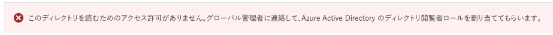
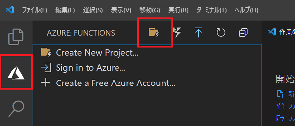
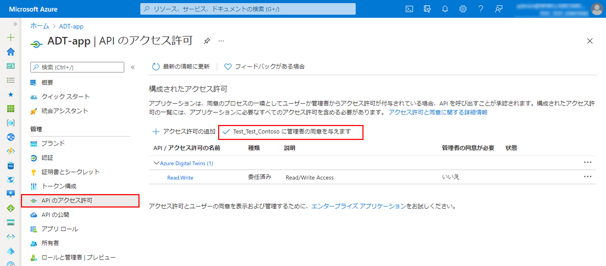

---
lab:
    title: 'ラボ 19: Azure Digital Twins (ADT) を開発する'
    module: 'モジュール 11: Azure Digital Twins を使用した開発'
---

# Azure Digital Twins (ADT) を開発する

## ラボ シナリオ

Contoso の経営陣は、デジタル進化の次のステップを踏み出し、Azure Digital Twins (ADT) を使用してチーズ製造施設のモデルを開発することを決定しました。Azure Digital Twins を使用すると、現実の環境のライブ モデルを作成して対話的に操作することができます。まず、個々の要素がデジタル ツインとしてモデル化されます。次に、これらのモデルは、ライブ イベントに応答し、情報を照会できるナレッジ グラフに接続されます。

ADT を最大限に活用する方法をよりよく理解するために、既存のチーズ セラー デバイスのセンサー テレメトリを次の単純なモデル階層に組み込む方法を示す概念実証プロトタイプを作成するように依頼されました。

* チーズ工場
* チーズ セラー
* チーズ セラー デバイス

この最初のプロトタイプでは、次のシナリオのソリューションを示すように求められました。

* デバイス テレメトリを IoT Hub から ADT の適切なデバイスにマッピングする方法
* 子デジタル ツイン プロパティの更新を使用して親ツインを更新する方法 (チーズ セラー デバイスからチーズ セラーへ)
* デバイス テレメトリを ADT 経由で Time Series Insights にルーティングする方法

次のリソースが作成されます。


## このラボでは

このラボでは、次のタスクを正常に達成します。

* ラボの前提条件が満たされていることを確認する (必要な Azure リソースがあること)
* デジタル ツイン モデルの設計と開発
  * Azure Digital Twin (ADT) インスタンスを作成および構成する
  * IoT デバイス データを ADT モデルとリレーションシップにマッピングする
  * デジタル ツイン モデルを作成してモデルを検証する
* デジタル ツインの作成と構成
  * DTDL を使用してデジタル ツインを作成する
  * デジタル ツイン インスタンスを使用して ADT グラフを作成する
* ADT グラフの相互作用を実装する (ADT エクスプローラー)
  * ADT エクスプローラーをインストールして実行する
  * ADT グラフをクエリする
  * グラフ内の ADT エンティティでプロパティを更新する
* ADT をアップストリームおよびダウンストリーム システムと統合する
  * IoT デバイス メッセージを取り込み、メッセージを ADT に変換する
  * テレメトリを Time Series Insights (TSI) に公開するように ADT ルートとエンドポイントを構成する

## ラボの手順

### 演習 1: ラボの前提条件を確認する

#### タスク1 - リソースを作成する

このラボでは、次の Azure リソースが使用可能であることを前提としています。

| リソースの種類  | リソース名                |
| :------------- | :--------------------------- |
| リソース グループ | rg-az220                     |
| IoT Hub        | iot-az220-training-{your-id} |
| TSI            | tsi-az220-training-{your-id} |
| TSI アクセス ポリシー | access1                   |

> **注**:  **lab19-setup.azcli** スクリプトは、**Bash** シェル環境で実行するために記述されています。Azure Cloud Shell でこれを実行するのが、最も簡単な方法です。

1. ブラウザーを使用して [Azure Cloud Shell](https://shell.azure.com/) を開き、このコースで使用している Azure サブスクリプションでログインします。

1. Cloud Shell のストレージの設定に関するメッセージが表示された場合は、デフォルトをそのまま使用します。

1. Cloud Shell が **Bash** を使用していることを確認します。

    「Azure Cloud Shell」 ページの左上隅にあるドロップダウンは、環境を選択するために使用されます。選択されたドロップダウンの値が **Bash** であることを確認します。

1. Cloud Shell ツール バーで、「**ファイルのアップロード/ダウンロード**」 をクリックします(右から 4番目のボタン)。

1. ドロップダウンで、「**アップロード**」 をクリックします。

1. ファイル選択ダイアログで、開発環境を構成したときにダウンロードした GitHub ラボ ファイルのフォルダーの場所に移動します。

    このコースのラボ 3 にあたる「開発環境のセットアップ」では、ZIP ファイルをダウンロードしてコンテンツをローカルに抽出することで、ラボ リソースを含む GitHub リポジトリを複製しました。抽出されたフォルダー構造には、次のフォルダー パスが含まれます。

    * すべてのファイル
      * ラボ
          * 19-Azure Digital Twins
            * 設定

    lab19-setup.azcli スクリプト ファイルは、ラボ 19 の設定フォルダー内にあります。

1. **lab19-setup.azcli** ファイルを選択し、「**開く**」 をクリックします。

    ファイルのアップロードが完了すると、通知が表示されます。

1. 正しいファイルがアップロードされたことを確認するには、次のコマンドを入力します。

    ```bash
    ls
    ```

    `ls` コマンドを使用して、現在のディレクトリの内容を表示します。一覧にある lab19-setup.azcli ファイルを確認できるはずです。

1. セットアップ スクリプトを含むこのラボのディレクトリを作成し、そのディレクトリに移動するには、次の Bash コマンドを入力します。

    ```bash
    mkdir lab19
    mv lab19-setup.azcli lab19
    cd lab19
    ```

    これらのコマンドは、このラボのディレクトリを作成し、**lab19-setup.azcli** ファイルをそのディレクトリに移動させ、新しいディレクトリを現在の作業ディレクトリにするための変更を行います。

1. **lab19-setup.azcli** に実行権限があることを確認するには、次のコマンドを入力します。

    ```bash
    chmod +x lab19-setup.azcli
    ```

1. Cloud Shell ツールバーで、lab19-setup.azcli ファイルへのアクセスを有効にするには、「**エディタを開く**」 (右から 2 番目のボタン - **{ }**) をクリックします。

1. 「**ファイル**」 の一覧で、lab19 フォルダーを展開してスクリプト ファイルを開き 、**lab19**、「**lab19-setup.azcli**」 の順にクリックします。

    エディタは **lab19-setup.azcli** ファイルの内容を表示します。

1. エディターで、`{your-id}` と `{your-location}` 変数の値を更新します。

    例として以下のサンプルを参照し、このコースの開始時に作成した一意の id、つまり **cah191211** に `{your-id}` を設定し、リソース グループと一致する場所に `{your-location}` を設定する必要があります。

    ```bash
    #!/bin/bash

    # Change these values!
    YourID="{your-id}"
    Location="{your-location}"
    ```

    > **注**:  `{your-location}` 変数は、すべてのリソースをデプロイするリージョンの短い名前に設定する必要があります。次のコマンドを入力すると、使用可能な場所と短い名前 (「**名前**」 の列) の一覧を表示できます。

    ```bash
    az account list-locations -o Table

    DisplayName           Latitude    Longitude    Name
    --------------------  ----------  -----------  ------------------
    East Asia             22.267      114.188      eastasia
    Southeast Asia        1.283       103.833      southeastasia
    Central US            41.5908     -93.6208     centralus
    East US               37.3719     -79.8164     eastus
    East US 2             36.6681     -78.3889     eastus2
    ```

1. エディター画面の右上で、ファイルに加えた変更を保存してエディターを閉じるには、**...** をクリックし、「**エディターを閉じる**」 をクリックします。

    保存を求められたら、「**保存**」 をクリックすると、エディタが閉じます。

    > **注**:  **CTRL+S** を使っていつでも保存でき、 **CTRL+Q** を押してエディターを閉じます。

1. このラボに必要なリソースを作成するには、次のコマンドを入力します。

    ```bash
    ./lab19-setup.azcli
    ```

    これは、実行するのに数分かかります。各ステップが完了すると、出力が表示されます。

#### タスク 2 - ツールを確認する

1. コマンド プロンプトを開き、次のコマンドを入力して、Azure CLI がローカルにインストールされていることを確認します。

    ```powershell
    az --version
    ```

1. azure-cli バージョン 2.4.0 以降が表示されていることを確認します

    Azure CLI がインストールされていない場合は、続行する前にインストールする必要があります。

### 演習 2: Azure Digital Twins リソースのインスタンスを作成する

この演習では、Azure portal を使用して Azure Digital Twins (ADT) インスタンスを作成します。Azure Digital Twins の接続データは、後で使用できるようにテキスト ファイルに保存されます。最後に、現在のユーザーには、ADT リソースへのアクセスを許可する役割が割り当てられます。

#### タスク 1: Azure portal を使用してリソースを作成する (Azure Digital Twins)

1. 新しいブラウザー ウィンドウで [Azure portal](https://portal.azure.com) を開きます。

1. Azure portal で、「**+ リソースの作成**」 をクリックします。

    開く**新しい**ブレードは、Azure で作成できるすべてのリソースのコレクションである Azure Marketplace のフロントエンドです。Marketplace には、Microsoft とコミュニティの両方からのリソースが含まれています。

1. 「**Marketplace を検索**」 テキスト ボックスに、「**Azure Digital Twins**」と入力します。

1. オプションが表示されたら、「**Azure Digital Twins**」 を選択し、「**作成**」 をクリックします。

1. 「**リソースの作成**」 ペインの 「**サブスクリプション**」 で、このコースに使用するサブスクリプションが選択されていることを確認します。

    > **注**: アカウントには、サブスクリプションの管理者ロールが必要です

1. 「**リソース グループ**」 の場合、「**rg-az220**」 を選択します。

1. 「**場所**」 ドロップダウンで、Azure IoT Hub がプロビジョニングされているリージョンを選択します。

1. 「**リソース名**」 ドロップダウンで、「**adt-az220-training-{your-id}**」 をクリックします

1. 入力した値を確認するには、「**Review + create**」 をクリックします。

1. デプロイ プロセスを開始するには、「**作成**」 をクリックします。

    **デプロイ中**が表示されるまでしばらく待ちます。

1. **「リソースに移動」** を選択します。

    ADT リソースの 「概要」 ペインが表示されます。このペインには、「**Azure Digital Twins の概要**」というタイトルの本文セクションが含まれています。

#### タスク 2: 接続データを参照ファイルに保存する

1. **メモ帳**または同様のテキスト エディターを使用して、**adt-connection.txt** という名前のファイルを作成します。

1. Azure Digital Twins インスタンスの名前をファイルに追加します - **adt-az220-training-{your-id}**

1. リソースグループをファイルに追加します - **rg-az220**

1. ブラウザーで、デジタル ツイン インスタンスの 「**概要**」 ペインに戻ります。

1. ペインの 「**Essentials**」 セクションで、「**ホスト名**」 フィールドを見つけます。

1. 「**ホスト名**」 フィールドにマウスポインタを合わせ、値の右側に表示されるアイコンを使用してホスト名をクリップボードにコピーし、テキスト ファイルに貼り付けます。

1. テキスト ファイルで、ホスト名の先頭に **https://** を追加して、ホスト名をデジタル ツイン インスタンスへの接続 URL に変換します。

    変更された URL は のようになります。

    ```http
    https://adt-az220-training-dm030821.api.eus.digitaltwins.azure.net
    ```

1. **adt-connection.txt** ファイルを保存します。

#### タスク 3: ADT ロール割り当てを構成する

1. ユーザー ロールを更新するには、左側のメニューで 「**アクセス制御 (IAM)**」 をクリックします。

1. 現在のユーザー アクセスを表示するには、「**自分のアクセスを表示**」 をクリックします。

    現在のユーザー割り当てを一覧表示するペインが表示されます。現在、ユーザーには**サービス管理者**のロールがあります。このロールは、ADT の作成中に割り当てられました。

1. 「**割り当て**」 ペインを閉じます。

1. すべてのユーザーの既存のロールの割り当てを表示するには、「**ロールの割り当て**」 タブを選択します。

    現在のアカウント ユーザーは、**所有者**のロールの下に表示されている必要があります。

    > **注**: 次のエラーが表示された場合は、無視してかまいません。このラボでは、他のロールの割り当てを表示するためにアクセスする必要はありません。
    > 

1. 新しい割り当てを追加するには、「**+ 追加**」 をクリックしてから、「**ロールの割り当ての追加**」 をクリックします。

1. 「**ロールの割り当ての追加**」 ペインの 「**ロール**」 ドロップダウンで、「**Azure Digital Twins データ所有者**」 を選択します

1. 「**アクセスの割り当て先**」 フィールドの値が**ユーザー、グループ、またはサービス プリンシパル**であることを確認します。

    **注**: **関数アプリ**、**ロジック アプリ**、**仮想マシン**など、選択できるセキュリティ プリンシパルには多くの種類があります。

    使用可能なユーザーのリストを提供する必要があります。

1. ユーザーのリストをフィルター処理するには、「**選択**」 フィールドに、フルネームとメールアドレスが検索結果リストに表示されるように、十分な数の名前またはメールアドレスを入力します。

1. ユーザー アカウントに対応するエントリを選択します。

    使用しているアカウントがわからない場合は、**Azure Shell** を開き、次のコマンドを実行します

    ```bash
    az ad signed-in-user show --query "userPrincipalName" -o tsv
    ```

    出力には、選択する必要のあるアカウントが表示されます。

    > **注**: Azure Active Directory で管理されるユーザー アカウントの形式は、Skype、Xbox など用に作成された Microsoft アカウントなどの外部機関で管理されるユーザーアカウントとは異なります。ログインしているアカウントに正しいエントリを選択したことを確認してください。例:
    > * カスタム ドメインを持つ AAD によって管理される **joe@contoso.com** - ユーザー アカウント
    > * 既定のドメインを持つ AAD によって管理される **joe@joesazure.onmicrosoft.com** - ユーザー アカウント
    > * 既定のドメインで AAD にゲストとして追加された外部の Microsoft アカウント機関によって管理されている **joe.smith_gmail.com#EXT#@joesazure.onmicrosoft.com** - ユーザ－ アカウント

1. ロールを割り当てるには、「**保存**」 をクリックします。

    しばらくすると、ロールが割り当てられ、現在のユーザーが **Azure Digital Twins データ所有者**のロールの下に表示されます。

    > **注**: 外部ユーザーの表示には時間がかかる場合があります。ツールバーの 「**更新**」 をクリックするか、「**概要**」 ペインに移動して 「**アクセス制御 (IAM)**」 ペインに戻ることができます。

これで、Azure Digital Twin リソースが作成され、API を介してリソースにアクセスできるようにユーザー アカウントが更新されました。

### 演習 3 - IoT デバイス データを ADT モデルとリレーションシップにマッピングする

この演習では、デジタル ツイン定義言語 (DTDL) 使用して、Contoso チーズ工場を表すモデルのサブセットを定義します。モデルは、チーズの生産ラインなど、実際のオブジェクトの特性を定義します。詳細のレベルとオブジェクトのサイズは、ビジネスのニーズによって異なります。オブジェクトは、温度センサーのように小さくても、ビルや工場のように大きくても、センサー、人、車両、プロセスのようにばらばらでもかまいません。対象の操作に関連するあらゆるものにできます。モデルには名前があり、このラボの後半で、モデルのデジタル ツイン インスタンスを作成します。

> **注**: DTDL、必須/オプションのエントリの完全なリスト、および受け入れ可能な単位の完全なリストの詳細については、[DTDL 仕様](https://github.com/Azure/opendigitaltwins-dtdl/blob/master/DTDL/v2/dtdlv2.md)を参照してください。

前述のように、モデルを介してビジネスを表現する場合、分類法と詳細の多くは、ビジネスのニーズによって決まります。これには、解決する問題や作成するシミュレーションが含まれます。ただし、モデルの特定の側面は、ソリューションの一部を形成する IoT デバイス、より具体的には、それらが実行するプロパティ、テレメトリ、および操作によって駆動されます。

この演習では、チーズ セラー デバイスとチーズ セラーのリレーションシップを検討し、モデル階層を作成します。次に、チーズ セラー デバイスの特性が考慮され、デジタル ツイン モデルの機能にマッピングされます。

> **注**: コースの前半で開発したチーズ セラー デバイス シミュレーター (コード プロジェクト) を使用して、この演習の目的でデバイスの特性を定義します。ソース コードは、このラボの**スターター** フォルダーに含まれています。

#### タスク 1 - デバイスの機能を検討する

他の種類の設計作業と同様に、ADT モデルの設計にはある程度の計画が必要です。ADT モデルが IoT デバイスを表す場合、計画には、IoT デバイスの特性を対応する ADT モデルのフィールドにマッピングする方法の調査が含まれます。次の手順は、IoT デバイスの種類ごとに完了する必要があります。

1. IoT Hub デバイス ツインを評価します。

    チーズ セラー デバイスは、デバイス ツイン (デジタル ツインと混同しないでください) を使用して、次の設定を指定します。

    * 華氏での望ましいの温度
    * 0 〜 100 の範囲での望ましい湿度

1. IoT デバイス メッセージの内容を評価します。

    チーズ セラー デバイスは、以下を含むメッセージを IoT Hub に送信します

    * プロパティ
        * sensorID - 現在のセンサー ID (**S1** に設定)
        * fanAlert - ファンが故障状態の場合は **true**、それ以外の場合は **false**。
        * TemperatureAlert - true の場合にのみ存在 - 温度が目的の温度から +/- 5 度の場合に **true** に設定
        * humidityAlert - true の場合にのみ存在 - 湿度が目的の湿度パーセンテージの +/- 10 の場合に **true** に設定
    * テレメトリ
        * temperature - 華氏現在の温度
        * humidity - 0 〜 100 の範囲の現在の湿度

1. 追加のクラウドからデバイスまたはデバイスからクラウドへの相互作用を評価します。

    チーズ セラー デバイスは、次の直接メソッドをサポートしています。

    * SetFanState - チーズ セラー ファンをオンまたはオフにしようとします (ファンが失敗する可能性があります)

    デバイスの場合、メッセージの拡張が適用されている場合は、それを検討することもできます。

    次の手順は、ADT モデル内で IoT デバイスの特性を表現する方法を検討することです。

1. ADT モデルの場合、DTDL には、4 つの主要なフィールドがあることを思い出してください。*プロパティ*、*テレメトリ*、*コンポーネント*、および*リレーションシップ*です。

1. IoT デバイス ツイン メッセージとデバイスからクラウド メッセージの両方で指定されたプロパティを ADT モデルのプロパティにマッピングすることを検討してください。

    ADT モデルにすべての IoT デバイス プロパティの直接マッピングを含めることも、ビジネス要件に適合するサブセットを選択することもできます。Azure Digital Twins の現在のバージョンでは、IoT ハブ (デバイス プロパティ) と ADT モデル プロパティ間の自動統合は提供されていません。

1. IoT デバイスのテレメトリ測定値を対応する ADT モデルのテレメトリ フィールドにマッピングすることを検討してください。

1. ADT モデルで表す必要がある可能性のある追加のデバイス特性または相互作用を検討してください。

    IoT デバイスの一部の特性は、ADT モデルに直接マッピングされない場合があります。cチーズ セラー デバイスの場合、**SetFanState** のダイレクト メソッド呼び出しに関してはギャップがあります。ダイレクト メソッドのダイレクト マッピングはありません。DTDL 仕様にはコマンドの定義が含まれていますが、ADT は現在それらをサポートしていません。したがって、ダイレクト メソッドをマッピングすることはできず、コードはビジネス ロジックの一部として記述する必要があります。通常は Azure 関数内に実装されます。

#### タスク2 - チーズ セラー デバイスプロパティの DTDL コードを作成する

> **注**: このタスクでは、ADT モデルで使用できる DTDL コードを作成します。使用するツールを決定するのはあなた次第であり、この演習の目的には Visual Studio Code またはメモ帳のいずれかが適切に機能することをお勧めします。

1. IoT デバイスのメッセージ プロパティ **sensorID** に対応する DTDL コードを作成します。

    このプロパティは文字列値であり、DTDL フラグメントで次のように表すことができます。

    ```json
    {
        "@type": "Property",
        "name": "sensorID",
        "schema": "string",
        "description": "Manufacturer Sensor ID",
        "writable": true
    }
    ```

    プロパティ フィールドの DTDL 仕様に従って、**@type** は必須です。少なくとも**プロパティ**の値が必要であり、オプションでセマンティック型も定義する配列にすることができます。

    > **ヒント**: 使用可能なセマンティック型については、次のリソースを参照できます。
    > * [Digital Twins Definition Language (DTDL)](https://github.com/Azure/opendigitaltwins-dtdl/blob/master/DTDL/v2/dtdlv2.md#semantic-types)

    **名前**プロパティは必須であり、現在のモデル定義内のプロパティを一意に識別する必要があります。この例では、**名前**はデバイス メッセージのマッピングされたプロパティと一致します。これは必須ではありませんが、マッピング プロセスが簡素化されます。

    **スキーマ** プロパティは必須であり、プロパティのデータ型 (この場合は**文字列**) を定義します。スキーマは、[プリミティブ スキーマ](https://github.com/Azure/opendigitaltwins-dtdl/blob/master/DTDL/v2/dtdlv2.md#primitive-schemas)または[コンプレックス スキーマ](https://github.com/Azure/opendigitaltwins-dtdl/blob/master/DTDL/v2/dtdlv2.md#complex-schemas) - として定義できますが、**配列**または**配列**を含むコンプレックス スキーマではない場合があります。

    **説明**プロパティはオプションであり、表示用にローカライズ可能な説明です。

    > **ヒント**: ローカリゼーションの詳細については、次のリソースを確認してください
    > * [文字列のローカリゼーションを表示します](https://github.com/Azure/opendigitaltwins-dtdl/blob/master/DTDL/v2/dtdlv2.md#display-string-localization)。

    **書き込み可能**プロパティはオプションであり、プロパティが外部ソースによって書き込み可能であることを示します。例として、値がデバイス メッセージから更新される場合、**書き込み可能な**値は **true** である必要があります。既定値は false (読み取り専用) です。

    > **ヒント**: これらは、デジタル ツイン プロパティを定義するために使用できるプロパティのほんの一部です。完全なリストを確認するには、次のリソースを確認してください
    > * [DTDL プロパティ](https://github.com/Azure/opendigitaltwins-dtdl/blob/master/DTDL/v2/dtdlv2.md#property)

1. IoT デバイスのメッセージ プロパティ **desiredTemperature** に対応する DTDL コードを作成します。

    このプロパティは double 値であり、DTDL フラグメントで次のように表すことができます。

    ```json
    {
        "@type": ["Property", "Temperature"],
        "name": "desiredTemperature",
        "schema": "double",
        "unit": "degreeFahrenheit",
        "description": "Cave desired temperature in Fahrenheit",
        "writable": true
    }
    ```

    **@type** の値が配列として宣言されており、必要な**プロパティ**値と**温度**セマンティック型が含まれていることに注意してください。セマンティック型を追加することにより、プロパティ値が華氏になるように指定して、**単位**値を追加できます。

    予想どおり、**スキーマ**値は **double** です。

1. 残りのデバイス プロパティで DTDL を更新します：

    ```json
    {
        "@type": "Property",
        "name": "sensorID",
        "schema": "string",
        "description": "Manufacturer Sensor ID",
        "writable": true
    },
    {
        "@type": ["Property", "Temperature"],
        "name": "desiredTemperature",
        "schema": "double",
        "unit": "degreeFahrenheit",
        "description": "Cave desired temperature in Fahrenheit",
        "writable": true
    },
    {
        "@type": "Property",
        "name": "desiredHumidity",
        "schema": "double",
        "description": "Cave desired humidity in percent",
        "writable": true
    },
    {
        "@type": "Property",
        "name": "fanAlert",
        "schema": "boolean",
        "description": "Fan failure alert",
        "writable": true
    },
    {
        "@type": "Property",
        "name": "temperatureAlert",
        "schema": "boolean",
        "description": "Over/Under desired temperature alert",
        "writable": true
    },
    {
        "@type": "Property",
        "name": "humidityAlert",
        "schema": "boolean",
        "description": "Over/Under desired humidity alert",
        "writable": true
    },
    ```

    ご覧のとおり、追加のプロパティは同じパターンに従います。

#### タスク 3 - チーズ セラー デバイス テレメトリの DTDL コードを作成する

1. IoT デバイス テレメトリ**温度**値に対応する DTDL コードを作成します。

    デバイス メッセージのテレメトリ値の**温度**を考慮してください。これは華氏の温度値を含む double 値であり、DTDL フラグメントで次のように表すことができます。

    ```json
    {
        "@type": ["Telemetry", "Temperature"],
        "name": "temperature",
        "schema": "double",
        "unit": "degreeFahrenheit",
        "description": "Current measured temperature"
    }
    ```

    **テレメトリ** フィールドは**プロパティ**と同様の方法で定義されます。**@type** は必須であり、少なくとも**テレメトリ**の値を持っている必要があり、**プロパティ**と同様に、オプションでセマンティック型も定義する配列にすることができます。

    **名前**プロパティは必須であり、現在のモデル定義内のフィールドを一意に識別する必要があります。この例では、**名前**はデバイス メッセージのマッピングされた値と一致します。これは必須ではありませんが、マッピング プロセスが簡素化されます。

    **スキーマ** プロパティは必須であり、テレメトリ値のデータ型 (この場合は **double**) を定義します。スキーマは、[プリミティブ スキーマ](https://github.com/Azure/opendigitaltwins-dtdl/blob/master/DTDL/v2/dtdlv2.md#primitive-schemas)または[コンプレックス スキーマ](https://github.com/Azure/opendigitaltwins-dtdl/blob/master/DTDL/v2/dtdlv2.md#complex-schemas) - として定義できますが、**配列**または**配列**を含むコンプレックス スキーマではない場合があります。

    **説明**プロパティはオプションであり、表示用にローカライズ可能な説明です。

    上記のスニペットまたは仕様には**書き込み可能な**値がないことに注意してください。**テレメトリ**値は外部ソースから書き込まれることが期待されています。

    > **ヒント**: これらは、ADT モデル内でテレメトリ フィールドを定義するために使用できるプロパティのほんの一部です。完全なリストを確認するには、次のリソースを確認してください
    > * [DTDL テレメトリ](https://github.com/Azure/opendigitaltwins-dtdl/blob/master/DTDL/v2/dtdlv2.md#telemetry)

1. デバイス メッセージのテレメトリ**湿度**値の DTDL コードを作成します。

    > **ヒント**: 湿度値は単位なしで指定されていることを思い出してください (0 から 100 の間の相対湿度測定値)。

1. 完成した DTDL コードを次のものと比較します：

    ```json
    {
        "@type": ["Telemetry", "Temperature"],
        "name": "temperature",
        "unit": "degreeFahrenheit",
        "description": "Current measured temperature",
        "schema": "double"
    },
    {
        "@type": "Telemetry",
        "name": "humidity",
        "description": "Current measured humidity",
        "schema": "double"
    }
    ```

### 演習 4 - デジタル ツイン モデルを作成し、モデルを検証する

前の演習では、チーズ セラー デバイスのメッセージ コンテンツが DTDL **プロパティ**と**テレメトリ** フィールドの定義にマッピングされました。これらの DTDL コード フラグメントを使用するには、**インターフェイス** (モデルの最上位のコード アイテム) に組み込む必要があります。チーズ セラー デバイス モデルの**インターフェイス**は、Contoso チーズ工場の Azure Digital Twins 環境のごく一部を形成します。ただし、工場全体を表す環境のモデリングは、このコースの範囲を超えています。これを念頭に置いて、代わりに、チーズ セラー デバイス モデル、関連するチーズ セラー モデル、および工場モデルに焦点を当てた大幅に簡素化された環境を検討します。モデルの階層は次のとおりです。

* チーズ 工場インターフェイス
* チーズ セラー インターフェイス
* チーズ セラー デバイス インターフェイス

上記のインターフェイス定義の階層とそれらの関係を考慮すると、**チーズ工場にはチーズ セラーがあり**、**チーズ セラーにはチーズ セラー デバイスがある**と言えます。

ADT 環境用のデジタル ツイン モデルを設計するときは、インターフェイス、スキーマ、およびリレーションシップに使用される ID を作成するために一貫したアプローチを使用するのが最善です。環境内の各エンティティには **@ID** プロパティがあり (インターフェイスに必要です)、そのエンティティを一意に識別する必要があります。ID 値の形式は、**デジタル ツインモデル 識別子 (DTMI)** の形式です。DTMI には、スキーム、パス、バージョンの 3 つのコンポーネントがあります。スキームとパスはコロン `:` で区切られ、パスとバージョンはセミコロン `;` で区切られます。形式は次のようになります。`<scheme> : <path> ; <version>`.DTMI 形式の ID 内のスキームの値は常に **dtmi** です。

Contoso チーズ工場の ID 値の 1 つの例は、`dtmi:com:contoso:digital_factory:cheese_factory;1` です。

この例では、スキーム値は期待どおり **dtmi** であり、バージョンは **1** に設定されています。この ID 値内の `<path>` コンポーネントは、次の分類を利用します。

* モデルのソース - **com:contoso**
* モデルのカテゴリ - **digital_factory**
* カテゴリ内の型 - **cheese_factory**

> **ヒント**: DTMI 形式の詳細については、次のリソースを確認してください。
> * [デジタル ツイン モデルの識別子](https://github.com/Azure/opendigitaltwins-dtdl/blob/master/DTDL/v2/dtdlv2.md#digital-twin-model-identifier)

上記で特定したモデル階層とリレーションシップを思い出してください。使用される ID の例は、次のとおりです。

| インターフェイス                      | ID                                                                     |
| :----------------------------- | :--------------------------------------------------------------------- |
| チーズ 工場インターフェイス       | dtmi:com:contoso:digital_factory:cheese_factory;1                      |
| チーズ セラー インターフェイス        | dtmi:com:contoso:digital_factory:cheese_factory:cheese_cave;1        |
| チーズ セラー デバイス インターフェイス | dtmi:com:contoso:digital_factory:cheese_factory:cheese_cave_device;1 |

ID の間のリレーションシップは次のようになります。

| リレーションシップ | ID                                                                | ID から                                                         | ID へ                                                                  |
| :----------- | :---------------------------------------------------------------- | :-------------------------------------------------------------- | :--------------------------------------------------------------------- |
| Has Caves  | dtmi:com:contoso:digital_factory:cheese_factory:rel_has_caves;1 | dtmi:com:contoso:digital_factory:cheese_factory;1               | dtmi:com:contoso:digital_factory:cheese_factory:cheese_cave;1        |
| Has Devices  | dtmi:com:contoso:digital_factory:cheese_cave:rel_has_devices;1  | dtmi:com:contoso:digital_factory:cheese_factory:cheese_cave;1 | dtmi:com:contoso:digital_factory:cheese_factory:cheese_cave_device;1 |

> **注**: _ラボ 3: 開発環境の設定_: ZIP ファイルをダウンロードしてコンテンツをローカルに抽出することで、ラボ リソースを含む GitHub リポジトリを複製しました。抽出されたフォルダー構造には、次のフォルダー パスが含まれます。
>
> * すべてのファイル
>   * ラボ
>       * 19-Azure Digital Twins
>           * 最終工程
>               * モデル
>
>  この演習で参照されている完全なモデルは、このフォルダーの場所で入手できます。

#### タスク 1 - 工場インターフェースの作成

Contoso チーズ会社のビジネス アナリストはチーズ工場モデルは単純なものであり、以下の特性を有するべきであると判断しました。

| 名前        | スキーマ | 説明                                                                                              |
| :---------- | :----- | :------------------------------------------------------------------------------------------------------- |
| FactoryName | 文字列 | 工場の名前                                                                                  |
| GeoLocation | オブジェクト | 工場の場所 - 緯度と経度の値が double で表される複雑なプロパティ |

さらに、工場はチーズ セラーと関係があります。

1. チーズ工場モデルを作成するタスクを開始するために、Visual Studio Code を開きます。

    > **注**: Microsoft は、Visual Studio Code の拡張機能である **Visual Studio Code の DTDL エディター**を提供します。これにより、次の主要な機能を最大限に活用して DTDL をより効率的に使用できます。
    >
    > * 事前定義またはカスタマイズされたテンプレートを使用してコマンド パレットからインターフェイスを作成します。
    > * 言語構文 (オートコンプリートを含む) を支援する Intellisense。
    > * 事前定義されたコード スニペットを使用して、DTDL を効率的に開発します。
    > * 構文の検証。

1. DTDL 拡張機能を使用して新しいインターフェイス ファイルを作成するには、VS Code コマンド パレットを開き、**DTDL: インターフェイスの作成」** を選択します。

    コマンド パレットは、「表示」 メニューから利用できます。

1. **フォルダーを選択する**ように求められたら、インターフェイス ファイルを保存する場所を参照します。

1. **インターフェイス名**の入力を求められたら、「**CheeseFactoryInterface**」と入力します。

    Visual Studio Code は、選択したフォルダーの場所を開き、ファイル **CheeseFactoryInterface.json** を作成します。

1. **CheeseFactoryInterface.json** を選択して編集用に開きます。内容は次のようになります。

    ```json
    {
        "@context": "dtmi:dtdl:context;2",
        "@id": "dtmi:com:example:CheeseFactoryInterface;1",
        "@type": "Interface",
        "displayName": "CheeseFactoryInterface",
        "contents": [
            {
                "@type": "Telemetry",
                "name": "temperature",
                "schema": "double"
            },
            {
                "@type": "Property",
                "name": "deviceStatus",
                "schema": "string"
            },
            {
                "@type": "Command",
                "name": "reboot",
                "request": {
                    "name": "delay",
                    "schema": "integer"
                }
            }
        ]
    }
    ```

    この開始テンプレートは、必要なものを示していますインターフェイス ファイルのコンテンツと構造を示しています。もちろん、Contoso チーズ工場の要件に合わせてカスタマイズする必要があります。

    **@context** プロパティは必須であり、このバージョンの DTDL では、**dtmi:dtdl:context;2** に設定する必要があります。

    **@type** プロパティは必須であり、**インターフェイス**に設定する必要があります。

    残りのプロパティについては、次の手順で説明します。

1. **@ID** プロパティを見つけて、値を **「dtmi:com:contoso:digital_factory:cheese_factory;1」** に更新します。

    **@ID** プロパティは必須であり、インターフェイスを一意に識別する必要があります。上記で使用されている値は、`<path>` の分類を利用しています。

    * モデルのソース - **com:contoso**
    * モデルのカテゴリ - **digital_factory**
    * カテゴリ内の型 - **cheese_factory**

    モデルのバージョンは **1** です。

1. 改善された表示名を提供するには、**displayName** プロパティを見つけて、値を **「Cheese Factory - Interface Model」** に更新します。

    > **注**: **displayName** 値はローカライズできます。

1. サンプル プロパティを削除するには、**コンテンツ**配列を見つけてコンテンツを削除します。

    編集後、CheeseFactoryInterface.json ファイルは次のようになります：

    ```json
    {
        "@context": "dtmi:dtdl:context;2",
        "@id": "dtmi:com:contoso:digital_factory:cheese_factory;1",
        "@type": "Interface",
        "displayName": "Cheese Factory - Interface Model",
        "contents": [
        ]
    }
    ```

1. **FactoryName** の DTDL プロパティを追加するには、次のように**コンテンツ** プロパティを更新します。

    ```json
    "contents": [
        {
            "@type": "Property",
            "name": "FactoryName",
            "schema": "string",
            "writable": true
        }
    ]
    ```

    **コンテンツ** プロパティは JSON 配列として定義されているため、DTDL プロパティと テレメトリは配列内のオブジェクトとして追加されます。

1. 別のプロパティを追加する準備をするには、上の閉じ中括弧 `}` の後にカーソルを置き、コンマ 「,」 を追加して、**Enter** キーを押します。

1. コード スニペットを使用して**プロパティ**を作成するには、「**dtp**」と入力し、「**DTDL プロパティ スニペットの追加**」 を選択します (または **TAB** を押します)。

    

    スニペットが展開されたら、コードは次のようになります。

    

1. **GeoLocation** に**名前**プロパティ値を設定します。

    ビジネス要件によると、**GeoLocation** DTDL プロパティは、緯度と経度で構成される複雑なプロパティです。これを指定する 1 つの方法は、インライン スキーマを含めることです。スキーマは、デジタル ツイン インターフェイスのデータのオンザワイヤまたはシリアル化された形式を記述するために使用されます。

    > **ヒント**: スキーマの詳細については、次のリソースを確認してください
    > * [DTDL スキーマ](https://github.com/Azure/opendigitaltwins-dtdl/blob/master/DTDL/v2/dtdlv2.md#schemas)

1. **GeoLocation**,の複雑なスキーマ定義を追加するには、**スキーマ** プロパティ値を次のように更新します

    ```json
    {
        "@type": "Property",
        "name": "GeoLocation",
        "schema": {
            "@id": "dtmi:com:contoso:digital_factory:custom_schema:GeoCord;1",
            "@type": "Object",
            "fields": [
                {
                    "@id": "dtmi:com:contoso:digital_factory:custom_schema:GeoCord:lat;1",
                    "name": "Latitude",
                    "schema": "double"
                },
                {
                    "@id": "dtmi:com:contoso:digital_factory:custom_schema:GeoCord:lon;1",
                    "name": "Longitude",
                    "schema": "double"
                }
            ]
        }
    },
    ```

    スキーマには **@ID** 値があることに注意してください (値が追加されていない場合、1 つは自動です)。生成された DTMI 仕様に従い、工場の定義に使用される分類を拡張します。

    **@型** プロパティは、複雑なスキーマの型を指定します。現在、次の複雑なスキーマが提供されています。**配列**、**列挙**、**マップ**、**オブジェクト**です。この例では、**オブジェクト**型が使用されています。**オブジェクト**は、名前付きフィールド (C 言語の構造体など) で構成されるデータ型を記述します。オブジェクト マップのフィールドは、プリミティブ スキーマまたはコンプレックス スキーマにすることができます。

    **フィールド** プロパティは、**オブジェクト**の各フィールドに 1 つずつ、フィールドの説明の配列に設定されます。各フィールドには、オプションの **@ID**、必須の**名前**、および必須の**型**があります。

    > **ヒント**: 使用可能な複合型の詳細については、次のリソースを確認してください。
    >
    > * [配列](https://github.com/Azure/opendigitaltwins-dtdl/blob/master/DTDL/v2/dtdlv2.md#array)
    > * [列挙型](https://github.com/Azure/opendigitaltwins-dtdl/blob/master/DTDL/v2/dtdlv2.md#enum)
    > * [マップ](https://github.com/Azure/opendigitaltwins-dtdl/blob/master/DTDL/v2/dtdlv2.md#map)
    > * [オブジェクト](https://github.com/Azure/opendigitaltwins-dtdl/blob/master/DTDL/v2/dtdlv2.md#object)

1. 工場とセラーの間のリレーションシップを追加するには (セラー インターフェイスは次のタスクで定義されます)、次の JSON オ ブジェクトを**コンテンツ**配列に追加します。

    ```json
    {
        "@type": "Relationship",
        "@id": "dtmi:com:contoso:digital_factory:cheese_factory:rel_has_caves;1",
        "name": "rel_has_caves",
        "displayName": "Has caves",
        "target": "dtmi:com:contoso:digital_factory:cheese_cave;1"
    }
    ```

    **@type** プロパティは必須であり、**リレーションシップ**に設定する必要があります。

    **@ID** はオプションです。値が追加されていない場合は、値が自動生成されます。ここで使用される値は、リレーションシップが **cheese_factory** に属することを示す構造を使用します。

    **名前**プロパティは必須であり、リレーションシップの 「プログラミング」 名です。リレーションシップは、クエリなどでこの値によって参照されます。

    **displayName** プロパティはオプションであり、ローカライズ可能です。

    最後に、**ターゲット** プロパティはオプションですが、ターゲットのインターフェイス **@ID** 値を指定します。**ターゲット**が欠落しているということは、リレーションシップが任意のインターフェースをターゲットにできることを意味します。ここで使用されている値 **「dtmi:com:contoso:digital_factory:cheese_cave;1」** は、次のタスクで作成されるセラー モデルを対象としています。

    > **ヒント**: この関係のインスタンスの最小数と最大数を制限できる 2 つの利用可能なオプションのプロパティが他にもあります。詳細については、以下のドキュメントを確認してください。
    > * [DTDL リレーションシップ](https://github.com/Azure/opendigitaltwins-dtdl/blob/master/DTDL/v2/dtdlv2.md#relationship)

1. 完了すると、インターフェイス定義は次のようになります

    ```json
    {
        "@context": "dtmi:dtdl:context;2",
        "@id": "dtmi:com:contoso:digital_factory:cheese_factory;1",
        "@type": "Interface",
        "displayName": "Cheese Factory - Interface Model",
        "contents": [
            {
                "@type": "Property",
                "name": "FactoryName",
                "schema": "string",
                "writable": true
            },
            {
                "@type": "Property",
                "name": "GeoLocation",
                "schema": {
                    "@id": "dtmi:com:contoso:digital_factory:custom_schema:GeoCord;1",
                    "@type": "Object",
                    "fields": [
                        {
                            "@id": "dtmi:com:contoso:digital_factory:custom_schema:GeoCord:lat;1",
                            "name": "Latitude",
                            "schema": "double"
                        },
                        {
                            "@id": "dtmi:com:contoso:digital_factory:custom_schema:GeoCord:lon;1",
                            "name": "Longitude",
                            "schema": "double"
                        }
                    ]
                }
            },
            {
                "@type": "Relationship",
                "@id": "dtmi:com:contoso:digital_factory:cheese_factory:rel_has_caves;1",
                "name": "rel_has_caves",
                "displayName": "Has caves",
                "target": "dtmi:com:contoso:digital_factory:cheese_factory:cheese_cave;1"
            }
        ]
    }
    ```

#### タスク 2 - チーズ セラー インターフェイスを確認する

Contoso チーズ社のビジネス アナリストは、チーズ セラー モデルには、セラーの現在の状態と、そのセラーに必要な温度と湿度を追跡するプロパティがあると判断しました。多くの場合、これらの値は、接続されているチーズ セラー デバイスによって報告された値と重複しますが、デバイスは別のセラーに交換または再配置される場合があります。デバイスからセラーに値をロールアップすると、セラーの最新の状態を利用できるようになります。

次のようにチーズ セラー モデルのために特定のプロパティの完全なリストは、次のとおりです。

| 名前               | スキーマ  | 説明                                   |
| :----------------- | :------ | :-------------------------------------------- |
| inUse              | boolean | セラーが使用であるかどうかを示します |
| temperatureAlert   | boolean | 希望の温度を超える/下回るアラート          |
| humidityAlert      | boolean | 希望の湿度を超える/下回るアラート             |
| fanAlert           | boolean | ファン障害アラート                             |
| 温度        | double  | 華氏での最後の測定温度       |
| 湿度           | double  | 最後の測定湿度                        |
| desiredTemperature | double  | セラーの華氏での希望温度      |
| desiredHumidity    | double  | セラーのパーセント単位での希望湿度            |

1. **チーズ セラー インターフェース**のインターフェース定義を確認してください。

    ```json
    {
        "@id": "dtmi:com:contoso:digital_factory:cheese_factory:cheese_cave;1",
        "@type": "Interface",
        "displayName": "Cheese Cave - Interface Model",
        "@context": "dtmi:dtdl:context;2",
        "contents": [
            {
                "@type": "Property",
                "name": "inUse",
                "schema": "boolean",
                "description": "Indicates whether the Cheese Cave is in use",
                "writable": true
            },
            {
                "@type": "Property",
                "name": "temperatureAlert",
                "schema": "boolean",
                "description": "Over/under desired temperature alert",
                "writable": true
            },
            {
                "@type": "Property",
                "name": "humidityAlert",
                "schema": "boolean",
                "description": "Over/under desired humidity alert",
                "writable": true
            },
            {
                "@type": "Property",
                "name": "fanAlert",
                "schema": "boolean",
                "description": "Fan failure alert",
                "writable": true
            },
            {
                "@type": ["Property", "Temperature"],
                "name": "temperature",
                "schema": "double",
                "unit": "degreeFahrenheit",
                "description": "Last measured temperature",
                "writable": true
            },
            {
                "@type": "Property",
                "name": "humidity",
                "schema": "double",
                "description": "Last measured humidity",
                "writable": true
            },
            {
                "@type": ["Property", "Temperature"],
                "name": "desiredTemperature",
                "schema": "double",
                "unit": "degreeFahrenheit",
                "description": "Cave desired temperature in Fahrenheit",
                "writable": true
            },
            {
                "@type": "Property",
                "name": "desiredHumidity",
                "schema": "double",
                "description": "Cave desired humidity in percent",
                "writable": true
            },
            {
                "@type": "Relationship",
                "@id": "dtmi:com:contoso:digital_factory:cheese_cave:rel_has_devices;1",
                "name": "rel_has_devices",
                "displayName": "Has devices",
                "target": "dtmi:com:contoso:digital_factory:cheese_cave:cheese_cave_device;1"
            }
        ]
    }
    ```

    プロパティ定義が要件とどのように一致しているかに注意してください。チーズ セラー デバイスとのリレーションシップも提供されています。

    > **注**: 完成したモデル ファイル **CheeseCaveInterface.json** は、このラボに関連付けられている **Final\Models** フォルダーにあります。

#### タスク 3 - チーズ セラー デバイス インターフェイスを確認する

このタスクでは、**演習 2 - IoT デバイス データを ADT モデルとリレーションシップにマッピングする** で特定されたプロパティとテレメトリ値がインターフェイス定義に組み込まれます。

| プロパティ名      | スキーマ  | 説明                              |
| :----------------- | :------ | :--------------------------------------- |
| sensorID           | 文字列  | メーカー センサー ID                   |
| desiredTemperature | double  | セラーの華氏での希望温度 |
| desiredHumidity    | double  | セラーのパーセント単位での希望湿度       |
| fanAlert           | boolean | ファン障害アラート                        |
| temperatureAlert   | boolean | 希望の温度を超える/下回るアラート     |
| humidityAlert      | boolean | 希望の湿度を超える/下回るアラート        |

| テレメトリ名 | スキーマ | 説明                  |
| :------------- | :----- | :--------------------------- |
| 温度    | double | 現在測定されている温度 |
| 湿度       | double | 現在測定されている湿度    |

1. **チーズ セラー デバイス インターフェイス**のインターフェイス定義を確認します。

    ```json
    {
        "@context": "dtmi:dtdl:context;2",
        "@id": "dtmi:com:contoso:digital_factory:cheese_factory:cheese_cave_device;1",
        "@type": "Interface",
        "displayName": "Cheese Cave Device - Interface Model",
        "contents": [
            {
                "@type": "Property",
                "name": "sensorID",
                "schema": "string",
                "description": "Manufacturer Sensor ID",
                "writable": true
            },
            {
                "@type": ["Property", "Temperature"],
                "name": "desiredTemperature",
                "schema": "double",
                "unit": "degreeFahrenheit",
                "description": "Cave desired temperature in Fahrenheit",
                "writable": true
            },
            {
                "@type": "Property",
                "name": "desiredHumidity",
                "schema": "double",
                "description": "Cave desired humidity in percent",
                "writable": true
            },
            {
                "@type": "Property",
                "name": "fanAlert",
                "schema": "boolean",
                "description": "Fan failure alert",
                "writable": true
            },
            {
                "@type": "Property",
                "name": "temperatureAlert",
                "schema": "boolean",
                "description": "Over/under desired temperature alert",
                "writable": true
            },
            {
                "@type": "Property",
                "name": "humidityAlert",
                "schema": "boolean",
                "description": "Over/under desired humidity alert",
                "writable": true
            },
            {
                "@type": ["Telemetry", "Temperature"],
                "name": "temperature",
                "schema": "double",
                "unit": "degreeFahrenheit",
                "description": "Current measured temperature",
            },
            {
                "@type": "Telemetry",
                "name": "humidity",
                "schema": "double",
                "description": "Current measured humidity"
            }
        ]
    }
    ```

    プロパティ定義が要件とどのように一致しているかに注意してください。

    > **注**: 完成したモデル ファイル **CheeseCaveDeviceInterface.json** は、このラボに関連付けられている **Final\Models** フォルダーにあります。

#### タスク 4 - DTDL バリデーターをインストールする

**Visual Studio Code 用の DTDL エディター**の拡張機能は、個々のモデルの構文を適切に検証しますが、モデルの階層を検証することはできません。つまり、リレーションシップで識別された**ターゲット**が存在することを確認します。この課題を支援するために、Microsoft はコマンド ラインツール (DTDL ファイルのディレクトリ ツリーを検証できる **DTDL Validator**) を開発しました。このユーティリティは、**Microsoft.Azure.DigitalTwins.Parser** NuGet パッケージを使用して、ファイルを解析および検証します。

1. **DTDL Validator** をインストールするには、ブラウザーを開いて [DTDL Validator](https://docs.microsoft.com/samples/azure-samples/dtdl-validator/dtdl-validator/) ページに移動します。

1. ソース zip をダウンロードするには、「**ZIP のダウンロード**」 をクリックします。

1. **DTDL_Validator.zip** を選択した場所に解凍します。

1. コマンド プロンプトを開き、**{UnZip-Location}\DTDLValidator-Sample\DTDLValidator** フォルダーに移動します。

1. **DTDL Validator** のコマンド ライン オプションを表示するには、次のコマンドを入力します。

    ```powershell
    dotnet run -- --help
    ```

    次のように出力されます。

    ```cmd
    DTDLValidator 1.0.0
    Copyright (C) 2021 DTDLValidator

    -e, --extension      (Default: json) File extension of files to be processed.

    -d, --directory      (Default: .) Directory to search files in.

    -r, --recursive      (Default: true) Search given directory (option -d) only (false) or subdirectories too (true)

    -i, --interactive    (Default: false) Run in interactive mode

    --help               Display this help screen.

    --version            Display version information.
    ```

#### タスク 5 - DTDL Validator を使用してモデルを検証する

1. フォルダーおよびサブフォルダー内のモデル ファイルを検証するには、次のコマンドを入力します。

    ```powershell
    dotnet run -- --directory {model-location}
    ```

    **{model-location}** トークンを、モデルが配置されているフォルダー (たとえば、**Allfiles\Labs\19-Azure Digital Twins\Final\Models** フォルダー) に置き換えます。

    このラボに含まれるモデルに対して実行される出力例は次のとおりです。

    ```cmd
    dotnet run -- --directory "D:\D-Repos\AZ220-DeveloperLabs\Allfiles\Labs\19-Azure Digital Twins\Final\Models"
    Simple DTDL Validator (dtdl parser library version 3.12.5.0)
    Validating *.json files in folder 'D:\D-Repos\AZ220-DeveloperLabs\Allfiles\Labs\19-Azure Digital Twins\Final\Models'.
    Recursive is set to True

    Read 3 files from specified directory
    Validated JSON for all files - now validating DTDL

    **********************************************
    ** Validated all files - Your DTDL is valid **
    **********************************************
    ```

1. エラーのあるファイルの出力例を確認するには、**Allfiles\Labs\19-Azure Digital Twins\Final\Models** フォルダーには、エラーのあるファイル (**CheeseCaveDeviceInterface.json.bad**) が含まれています。このファイルに対して **DTDL Validator** ツールを実行するには、次のように **--extension** 引数を使用できます。

    ```powershell
    dotnet run -- --extension bad --directory "D:\Az220\Allfiles\Labs\19-Azure Digital Twins\Final\Models"
    ```

    この出力は JSON のエラーを識別します。

    ```cmd
    Simple DTDL Validator (dtdl parser library version 3.12.5.0)
    Validating *.bad files in folder 'D:\Az220\Allfiles\Labs\19-Azure Digital Twins\Final\Models'.
    Recursive is set to True

    Read 1 files from specified directory
    Invalid json found in file D:\Az220\Allfiles\Labs\19-Azure Digital Twins\Final\Models\CheeseCaveDeviceInterface.json.bad.
    Json parser error
    The JSON object contains a trailing comma at the end which is not supported in this mode. Change the reader options. LineNumber: 55 | BytePositionInLine: 8.

    Found  1 Json parsing errors
    ```

1. エラーを修正するには、Visual Studio Code でファイルを開き、55 行目の最後にある追加のコンマ `,` を削除します。

1. ファイルを保存して、次のコマンドを再実行します。

    ```powershell
    dotnet run -- --extension bad --directory "D:\Az220\Allfiles\Labs\19-Azure Digital Twins\Final\Models"
    ```

    今回は、バリデーターがエラーを報告し、**@context**は DTDL バージョン 1 に設定されます。

1. Visual Studio Code に戻り、**@context** プロパティを見つけて、**dtmi:dtdl:context;2** に設定します。

1. ファイルを保存して、次のコマンドを再実行します。

    ```powershell
    dotnet run -- --extension bad --directory "D:\Az220\Allfiles\Labs\19-Azure Digital Twins\Final\Models"
    ```

    今回はバリデーターは、*最上位要素 dtmi:com:contoso:digital_factory:cheese_factory:cheese_cave_device;1 に 配列、コマンド、CommandPayload、コンポーネント、列挙、EnumValue、フィールド、インターフェイス、マップ、MapKey、MapValue、オブジェクト、プロパティ、リレーションシップ、テレメトリの @type がないことを報告します。許可される型 @type を指定します。*

1. Visual Studio Code に戻り、4 行目を見つけますプロパティの名前が **@type** ではなく、**@typo** - っとなっていることに注意してください。これを修正してください。

1. ファイルを保存して、次のコマンドを再実行します。

    ```powershell
    dotnet run -- --extension bad --directory "D:\Az220\Allfiles\Labs\19-Azure Digital Twins\Final\Models"
    ```

    今回はバリデーターは、**desiredTemperature** プロパティに関連する 2 つのエラーを報告します - **スキーマ**は **double** ではなく **byte** に設定されています。

ご覧のとおり、**DTDL バリデーター**は問題の特定に非常に役立ちますが、すべての問題を特定するには何度も実行する必要があります。

### 演習 5 - モデルのグラフを作成する

これで、概念実証で使用されるデジタル ツインごとにインターフェイスが定義されたので、デジタル ツインの実際のグラフを作成します。グラフを作成するためのフローは簡単です。

* モデル定義をインポートする
* 適切なモデルからツイン インスタンスを作成する
* 定義されたモデルのリレーションシップを使用してツイン インスタンス間のリレーションシップを作成する

このフローを実現するには、いくつかの方法があります。

* コマンドラインまたはスクリプトで Azure CLI コマンドを使用する
* SDK の 1 つをプログラムで使用するか、REST API を介して直接実行する
* ADT エクスプローラー サンプルなどのツールを使用する

ADT エクスプローラーには ADT グラフの豊富な視覚化が含まれているため、概念実証用の単純なモデルを構築するのに非常に適しています。ただし、より大きく、より複雑なモデルもサポートされており、包括的な一括インポート/エクスポート機能が反復設計に役立ちます。この演習では、次のタスクが完了します。

* ADT エクスプローラーをローカルにインストールする
* ADT インスタンスに接続する
* Contoso チーズ モデルインポートする
* モデルを使用してデジタル ツインを作成する
* グラフにリレーションシップを追加する
* ADT からツイン、リレーションシップ、モデルを削除する方法を学ぶ
* グラフを ADT にバルク インポートする

#### タスク 1 - ADT エクスプローラーをインストールする

**ADT エクスプローラー**は、Azure Digital Twins サービスのサンプル アプリケーションです。このアプリは Azure Digital Twins インスタンスに接続し、次の機能を提供します。

* モデルのアップロードおよび確認
* ツイン グラフのアップロードと編集
* さまざまなレイアウト手法を使用したツイン グラフの視覚化
* ツインのプロパティの編集
* ツイン グラフに対するクエリの実行

ADT エクスプローラーは単一ページの JavaScript アプリケーションとして記述されています。node.js アプリケーションとしてローカルで実行できます - 以下の手順を参照してください。

1. **node.js** がインストールされていることを確認するには、コマンドシェルを開き、次のコマンドを入力します。

    ```powershell
    node --version
    ```

    ノードがインストールされている場合は、表示されるバージョンが 10 以上であることを確認してください。そうでない場合は、[node.js をダウンロードしてインストールします](https://nodejs.org/en/#home-downloadhead)。

1. ADT Explorer のソースコードをダウンロードするには、ブラウザーを開き、[Azure Digital Twins (ADT) explorer Release zip](https://github.com/Azure-Samples/digital-twins-explorer/releases/download/235622/Azure_Digital_Twins__ADT__explorer.zip) のリンクをクリックします。

    ブラウザは **Azure_Digital_Twins__ADT__explorer.zip** ファイルをダウンロードします。

1. **Azure_Digital_Twins__ADT__explorer.zip** から選択した場所にファイルを抽出します。

1. コマンド シェルで、**Azure_Digital_Twins__ADT__explorer.zip** が抽出された場所に移動します。

    このフォルダー構造には、ドキュメントとアプリケーションを含むフォルダーが含まれています。

1. **client\src** フォルダーに移動します。

1. アプリケーションの依存関係を復元するには、次のコマンドを入力します。

    ```powershell
    npm install
    ```

    これは、しばらく時間がかかります。

1. Azure Digital Twin インスタンスにアクセスするには、ユーザーは Azur eCLI を使用して Azure にログインする必要があります。現在のユーザーがログインしていることを確認するには、次のコマンドを入力します。

    ```powershell
    az login
    ```

    いつものようにブラウザーを介してログインします。

1. **adt-connection.txt** ファイル (このラボの前半で ADT インスタンスを作成した後に保存したファイル) を開き、ADT URL のコピーを取得します。

    **ADT エクスプローラー**を Azure で実行されている ADT インスタンスに接続するには、ADT URL が必要です。**adt-connection.txt** ファイルに含める必要があります。ただし、使用可能なファイルがない場合は、コマンド ラインを使用して次のコマンドを入力してホスト名を決定します。

    ```powershell
    az dt list --query "[].hostName" -o tsv
    ```

    > **注**: **ホスト名**の前に **https://** - を付けることを忘れないでください。たとえば、
    > ```http
    > https://adt-az220-training-dm030821.api.eus.digitaltwins.azure.net
    > ```

1. アプリケーションを起動するには、次のコマンドを入力します：

    ```powershell
    npm run start
    ```

    開始したら、[http://localhost:3000](http://localhost:3000) をアドレス指定するブラウザー ページを開く必要があります

1. 右上隅にある ADT URL アイコンを使用して **Azure Digital Twins URL** ダイアログを開きます。

1. **Azure Digital Twins URL** ダイアログの 「**ADT URL**」 で、ADT URL 値を入力します。

1. 「**保存**」 をクリックして、ブラウザー アプリのローカル ストレージに情報を追加し、ADT インスタンスに接続します。

    > **注**: 「**アクセス許可が要求されました**」 ポップアップが表示された場合は、アプリに同意する必要がある場合があります。

これで、**ADT エクスプローラー** サンプル アプリケーションを使用する準備が整いました。モデルの読み込みは次のタスクなので、使用可能なモデルがないことを示すエラー メッセージが表示されても心配しないでください。

#### タスク 2 - モデルをインポートする

ADT でデジタル ツインを作成するには、最初にモデルをアップロードする必要があります。モデルをアップロードする方法はいくつかあります。

* [データ プレーン SDK](https://docs.microsoft.com/azure/digital-twins/how-to-use-apis-sdks)
* [データ プレーン REST API](https://docs.microsoft.com/rest/api/azure-digitaltwins/)
* [Azure CLI](https://docs.microsoft.com/cli/azure/ext/azure-iot/dt?view=azure-cli-latest)
* [ADT エクスプローラー](https://docs.microsoft.com/samples/azure-samples/digital-twins-explorer/digital-twins-explorer/)のインポート機能

最初の 2 つのオプションは、プログラム シナリオに適していますが、Azure CLI は、コード シナリオまたは「1 回限りの」**コードとして構成**する場合に役立ちます。**ADT エクスプローラー** アプリは、ADT と対話するための直感的な方法を提供します。

> **ヒント**: **コードとして構成**とは何ですか? 構成はソース コード (たとえば、Azure CLI コマンドを含むスクリプト) して記述されているため、モデル アップロードの再利用可能な定義の作成、パラメーター化、ループを使用したさまざまなモデルのインスタンスの作成など、すべてのベスト開発プラクティスを使用して最適化できます。これらのスクリプトは、ソースコード管理に保存して、保持、バージョン管理などを行うことができます。

このタスクでは、Azure CLI コマンドと ADT エクスプローラー サンプル アプリを使用して、 **Allfiles\Labs\19-Azure Digital Twins\Final\Models** フォルダ－に含まれるモデルをアップロードします。

1. 新しいコマンド プロンプト ウィンドウを開きます。

    開いているコマンド ライン ツールから ADT エクスプローラーを実行したままにする必要があります。

1. 正しい Azure アカウントの資格情報を使用していることを確認するには、次のコマンドを使用して Azure にログインします。

    ```powershell
    az login
    ```

1. **チーズ工場インターフェイス**をアップロードするには、次のコマンドを入力します。

    ```powershell
    az dt model create --models "{file-root}\Allfiles\Labs\19-Azure Digital Twins\Final\Models\CheeseFactoryInterface.json" -n adt-az220-training-{your-id}
    ```

    **{file-root}** をこのラボのコンパニオン ファイルが配置されているフォルダーに置き換え、**{your-id}** を一意の識別子に置き換えてください。

    成功すると、次のような出力が表示されます。

    ```json
    [
        {
            "decommissioned": false,
            "description": {},
            "displayName": {
            "en": "Cheese Factory - Interface Model"
            },
            "id": "dtmi:com:contoso:digital_factory:cheese_factory;1",
            "uploadTime": "2021-03-24T19:56:53.8723857+00:00"
        }
    ]
    ```

1. ブラウザーで、[http://localhost:3000](http://localhost:3000) の **ADT エクスプローラー**に戻ります。

    > **ヒント**: アプリケーションがすでに実行されている場合は、ブラウザーを更新して**モデル ビュー**を更新します。

    アップロードされた**チーズ工場 - インターフェイス モデル**が一覧表示されます

    

1. **ADT エクスプローラー**を使用して、残りの 2 つのモデルをインポートするには、**モデルビュー**で 「**モデルのアップロード**」 アイコンをクリックします

    

1. ダイアログを**開き**、**モデル** フォルダーに移動し、**CheeseCaveInterface.json** ファイルと **CheeseCaveDeviceInterface.json** ファイルを選択して、「**開く**」 をクリックします。

    次に、2 つのファイルが ADT にアップロードされ、モデルが追加されます。完了すると、**モデル ビュー**が更新され、3 つのモデルすべてが一覧表示されます。

モデルがアップロードされたので、デジタル ツインを作成できます。

#### タスク 3 - ツインを作成する

Azure Digital Twins ソリューションでは、環境内のエンティティはデジタル ツインで表されます。デジタル ツインは、カスタム定義されたモデルの 1 つのインスタンスです。リレーションシップを介して他のデジタル ツインに接続してツイン グラフを形成できます。このツイン グラフは、環境全体を表したものです。

モデルと同様に、デジタル ツインとリレーションシップは複数の方法で作成できます。

* [データ プレーン SDK](https://docs.microsoft.com/azure/digital-twins/how-to-use-apis-sdks)
* [データ プレーン REST API](https://docs.microsoft.com/rest/api/azure-digitaltwins/)
* [Azure CLI](https://docs.microsoft.com/cli/azure/ext/azure-iot/dt?view=azure-cli-latest)
* [ADT エクスプローラー](https://docs.microsoft.com/samples/azure-samples/digital-twins-explorer/digital-twins-explorer/)のインポート機能

以前と同様に、最初の 2 つのオプションはプログラム シナリオに適していますが、Azure CLI は、**コードとしての構成**のシナリオまたは「1 回限りの」要件として構成する場合に引き続き役立ちます。デジタル ツインとリレーションシップを作成する最も直感的な方法は、**ADT エクスプローラー**を使用することですが、プロパティの初期化に関してはいくつかの制限があります。

1. チーズ工場インターフェイス モデルのアップロードに使用したコマンド ライン ウィンドウを開きます。

1. モデルからデジタル ツインを作成するには、次のコマンドを入力します。

    ```powershell
    az dt twin create --dt-name adt-az220-training-{your-id} --dtmi "dtmi:com:contoso:digital_factory:cheese_factory;1" --twin-id factory_1 --properties "{file-root}\Allfiles\Labs\19-Azure Digital Twins\Final\Properties\FactoryProperties.json"
    ```

    **{file-root}** をこのラボのコンパニオン ファイルが配置されているフォルダーに置き換え、**{your-id}** を一意の識別子に置き換えてください。

    次に注意してください。

    * **--dt-name** 値は、ADT ツイン インスタンスを指定します。
    * **--dtmi** 値は、以前にアップロードされたチーズ工場モデルを指定します
    * **--twin-id** は、デジタルツインに指定された ID を指定します。
    * **--properties** 値は、ツインの初期化に使用される JSON ドキュメントのファイル パスを提供します。または、単純な JSON をインラインで指定することもできます。

    成功した場合、コマンドの出力は次のようになります。

    ```json
    {
        "$dtId": "factory_1",
        "$etag": "W/\"09e781e5-c31f-4bf1-aed4-52a4472b0c5b\"",
        "$metadata": {
            "$model": "dtmi:com:contoso:digital_factory:cheese_factory;1",
            "FactoryName": {
                "lastUpdateTime": "2021-03-24T21:51:04.1371421Z"
            },
            "GeoLocation": {
                "lastUpdateTime": "2021-03-24T21:51:04.1371421Z"
            }
        },
        "FactoryName": "Contoso Cheese 1",
        "GeoLocation": {
            "Latitude": 47.64319985218156,
            "Longitude": -122.12449651580214
        }
    }
    ```

    **$metadata** プロパティには、プロパティが最後に更新された時刻を追跡するオブジェクトが含まれていることに注意してください。

1. **FactoryProperties.json** ファイルには次の JSON が含まれています。

    ```json
    {
        "FactoryName": "Contoso Cheese 1",
        "GeoLocation": {
            "Latitude": 47.64319985218156,
            "Longitude": -122.12449651580214
        }
    }
    ```

    プロパティ名がチーズ工場インターフェイスで宣言された DTDL プロパティ値と一致します。

    > **注**: コンプレックス プロパティ **GeoLocation** は、**緯度**プロパティと**経度**プロパティを持つ JSON オブジェクトを介して割り当てられます。現在、**ADT エクスプローラー**は、UI を使用してこれらの複雑なプロパティを初期化することはできません。

1. ブラウザーで、[http://localhost:3000](http://localhost:3000) の **ADT エクスプローラー**に戻ります。

1. これまでに作成したデジタル ツインを表示するには、「**クエリの実行**」 をクリックします。

    > **注**: クエリとクエリ言語については、後ほど説明します。

    しばらくすると、**factory_1** デジタル ツインが**グラフ ビュー**に表示されます。

    

1. デジタル ツイン プロパティを表示するには、**グラフ ビュー**で 「**factory_1**」 をクリックします。

    **factory_1** のプロパティは、ツリー ビューのノードとして**プロパティ ビュー**に表示されます。

1. 経度と緯度のプロパティ値を表示するには、**GeoLocation** をクリックします。

    値が **FactoryProperties.json** ファイルの値と一致していることに注意してください。

1. チーズ工場モデルから別のデジタル ツインを作成するには、**モデルビュー**で**チーズ工場**モデルを見つけ、「**ツインの作成**」 をクリックします。

    

1. **新しいツイン名**の入力を求められたら、「**factory_2**」と入力し、「**保存**」 をクリックします。

1. **factory_2** のデジタル ツイン プロパティを表示するには、**グラフ ビュー**で 「**factory_2**」 をクリックします。

    **FactoryName** プロパティと **GeoLocation** プロパティが初期化されていないことに注意してください。

1. **factoryName** を設定するには、プロパティの右側にマウスカーソルを置きます。テキストボックス コントロールが表示されます。「**チーズ工場2**」を入力します。

    

1. 「プロパティ エクスプローラー」 ペインで、プロパティの更新を保存するには、「**パッチ ツイン**」 アイコンを選択します。

    > **注**: 「パッチ ツイン」 アイコンは、「クエリの実行」 ボタンの右側にある 「クエリの保存」 アイコンと同じように表示されます。「クエリの保存」 アイコンは必要ありません。

    「パッチ ツイン」 選択すると、JSON パッチが作成されて送信され、デジタル ツインが更新されます。**パッチ情報**がダイアログに表示されます。値が設定されるのはこれが初めてであるため、**op** (操作) プロパティが**追加である**ことに注意してください。その後の値の変更は**置換**操作になります。これを確認するには、「**クエリの実行**」 をクリックして**グラフ ビュー**を更新してから、別の更新を行います。

   > **ヒント**: JSON パッチ ドキュメントの詳細については、次のリソースを確認してください。
   > * [Javascript Object Notation (JSON) パッチ](https://tools.ietf.org/html/rfc6902)
   > * [JSON パッチとは何ですか?](http://jsonpatch.com/)

1. **プロパティ エクスプローラー**で、**GeoLocation** ノードを展開します - 値が **{空のオブジェクト}** であることに注意してください

    現在、**ADT エクスプローラー**は、初期化されていないプロパティに複雑なオブジェクトを追加できません。

1. **モデル ビュー**で適切なモデルを選択し、「**ツインの追加**」 をクリックして、次のデジタル ツインを追加します。

    | モデル名                             | デジタル ツイン名 |
    | :------------------------------------- | :---------------- |
    | チーズ セラー - インターフェイス モデル        | cave_1          |
    | チーズ セラー - インターフェイス モデル        | cave_2          |
    | チーズ セラー デバイス - インターフェイス モデル | device_1          |
    | チーズ セラー デバイス - インターフェイス モデル | device_2          |

    

いくつかのツインが作成されたので、リレーションシップを追加します。

#### タスク4 - リレーションシップを追加する

ツインは、そのリレーションシップによってツイン グラフに接続されます。ツインが持つことのできるリレーションシップは、そのモデルの一部として定義されます。

たとえば、**チーズ工場**モデルは、**チーズ セラー**型のツインを対象とする 「contains」 関係を定義します。この定義により、Azure Digital Twins を使用すると、**チーズ工場**ツインから**チーズ セラー** ツイン (特定のチーズ専用の**チーズ セラー** - などの**チーズ セラー**のサブタイプである可能性のあるツインを含む) への **rel_has_caves** リレーションシップを作成できます。

このプロセスにより、グラフ内にエッジ (リレーションシップ) によって接続された一連のノード (デジタル ツイン) が作成されます。

モデルやツインと同様に、リレーションシップは複数の方法で作成できます。

1. Azure CLI を介してリレーションシップを作成するには、コマンド プロンプトに戻り、次のコマンドを実行します。

    ```powershell
    az dt twin relationship create -n adt-az220-training-{your-id} --relationship-id factory_1_has_cave_1 --relationship rel_has_caves --twin-id factory_1 --target cave_1
    ```

    **{your-id}** を一意の識別子に置き換えます。

    成功した場合、コマンドの出力は次のようになります。

    ```json
    {
        "$etag": "W/\"cdb10516-36e7-4ec3-a154-c050afed3800\"",
        "$relationshipId": "factory_1_has_cave_1",
        "$relationshipName": "rel_has_caves",
        "$sourceId": "factory_1",
        "$targetId": "cave_1"
    }
    ```

1. リレーションシップを視覚化するには、ブラウザーで、[http://localhost:3000](http://localhost:3000) の **ADT エクスプローラー**に戻ります。

1. 更新されたデジタル ツインを表示するには、「**クエリの実行**」 をクリックします。

    図が更新され、新しいリレーションシップが表示されます。

    

    リレーションシップがない場合は、ブラウザー ウィンドウを更新してから、クエリを実行します。

1. **ADT エクスプローラー**を使用して、リレーションシップを追加するには、**cave_1** をクリックし、**Ctrl** キーを押しながら **device_1** をクリックします。

    これで両方のツインが選択され、「**リレーションシップの追加**」 ボタンが有効になります。

1. リレーションシップを追加するには、「**リレーションシップの追加**」 ボタンをクリックします

    

1. 「**リレーションシップの作成**」 ダイアログの 「**ソース ID**」で、**cave_1** が表示されていることを確認します。

1. **「ターゲット ID」** で、**device_1** が表示されていることを確認します。

1. 「**リレーションシップ**」 で、**rel_has_devices** が表示されていることを確認します。

    > **注**: Azure CLI で作成された関係とは異なり、**$relationshipId** 値を提供する UI はありません。代わりに、GUID が割り当てられます。

1. リレーションシップを作成するには、「**保存**」 をクリックします。

    リレーションシップが作成され、図が更新されてリレーションシップが表示されます。この図は、**factory_1** に **device_1** を持つ **cave_1** があることを示しています。

1. さらに 2 つのリレーションシップを追加します。

    | ソース    | ターゲット   | リレーションシップ    |
    | :-------- | :------- | :-------------- |
    | factory_1 | cave_2 | rel_has_caves |
    | cave_2  | device_2 | rel_has_devices |

    グラフは次のように表示されます。

    

1. **グラフ ビュー**のレイアウト オプションを表示するには、「**レイアウトの実行**」 ボタンの右側にあるドロップダウンをクリックします。

    **グラフ ビュー**では、さまざまなアルゴリズムを使用してグラフをレイアウトできます。既定では、**クレイ** レイアウトが選択されています。さまざまなレイアウトを選択して、グラフがどのように影響を受けるかを確認できます。

#### タスク 5 - モデル、関係、およびツインの削除

ADT を使用したモデリングの設計プロセス中に、いくつかの概念実証が作成され、その多くが削除される可能性があります。デジタル ツインの他の操作と同様に、モデルとツインを削除するためのプログラムによるアプローチ (API、SDK、および CLI) があり、**ADT エクスプローラー**を使用することもできます。

> **注**: 削除操作は非同期であり、たとえば、REST API 呼び出しまたは **ADT エクスプローラー**での削除はすぐに完了したように見える場合がありますが、ADT サービス内で操作が完了するまでに数分かかる場合があります。最近削除されたモデルと同じ名前で改訂されたモデルをアップロードしようとすると、バックエンド操作が完了するまで予期せず失敗する可能性があります。

1. CLI を使用して **factory_2** デジタル ツインを削除するには、コマンド プロンプト ウィンドウに戻り、次のコマンドを入力します。

    ```powershell
    az dt twin delete -n adt-az220-training-{your-id} --twin-id factory_2
    ```

    他のコマンドとは異なり、出力は表示されません (コマンドがエラーを生成しない限り)。

1. **factory_1** と **cave_1** の間のリレーションシップを削除するには、次のコマンドを入力します。

    ```powershell
    az dt twin relationship delete -n adt-az220-training-{your-id} --twin-id factory_1 --relationship-id factory_1_has_cave_1
    ```

    このコマンドはリレーションシップ ID が必要であることをに注意してください。特定のツインのリレーションシップ ID を表示できます。たとえば、**factory_1** のリレーションシップ ID を表示するには、次のコマンドを入力します。

    ```powershell
    az dt twin relationship list -n adt-az220-training-{your-id} --twin-id factory_1
    ```

    セラー 1 とのリレーションシップを削除する前にこのコマンドを実行すると、次のような出力が表示されます。

    ```json
    [
        {
            "$etag": "W/\"a6a9f506-3cfa-4b62-bcf8-c51b5ecc6f6d\"",
            "$relationshipId": "47b0754a-25d1-4b71-ac47-c2409bb08535",
            "$relationshipName": "rel_has_caves",
            "$sourceId": "factory_1",
            "$targetId": "cave_2"
        },
        {
            "$etag": "W/\"b5207e88-7c86-498f-a272-7f81dde88dee\"",
            "$relationshipId": "factory_1_has_cave_1",
            "$relationshipName": "rel_has_caves",
            "$sourceId": "factory_1",
            "$targetId": "cave_1"
        }
    ]
    ```

1. モデルを削除するには、次のコマンドを入力します。

    ```powershell
    az dt model delete -n adt-az220-training-{your-id} --dtmi "dtmi:com:contoso:digital_factory:cheese_factory;1"
    ```

    ここでも出力は表示されません。

    > **重要**: このコマンドは、デジタル ツイン **factory_1** がまだ存在していても、工場モデルを削除して成功しました。削除されたモデルを使用して作成されたデジタル ツインは、グラフをクエリすることで引き続き見つけることができますが、モデルがないとツインのプロパティを更新できなくなります。一貫性のないグラフを作成しないように、モデル管理タスク (バージョン管理、削除など) を完了するときは十分に注意してください。

1. デジタル ツインへの最近の変更を表示するには、[http://localhost:3000](http://localhost:3000) で **ADT エクスプローラー**に戻ります。

1. 表示を更新するには、ブラウザー ページを更新し、「**クエリの実行**」 をクリックします。

    **チーズ工場**モデルは**モデル ビュー**から欠落しており、**グラフ ビュー**では **factory_1** と **cave_1** の間にリレーションシップがないはずです。

1. **cave_1** と **device_1** の間のリレーションシップを選択するには、2 つのツインの間の線をクリックします。

    線が太くなり、選択されていることを示し、「**リレーションシップの削除**」 ボタンが有効になります。

    

1. リレーションシップを削除するには、「**リレーションシップの削除**」をクリックし、「**削除**」 をクリックして確定します。

    リレーションシップが削除され、グラフが更新されます。

1. 削除する **device_1** デジタル ツインを選択するには、**device_1** をクリックします。

    「**選択したツインを削除**」 ボタンが有効になります。

    

    > **注**: **CTRL** キーを使用すると、複数のツインを選択して削除できます。

1. **device_1** を削除するには、「**選択したツインの削除**」 をクリックし、「**削除**」 をクリックして確定します。

    ツインが削除され、グラフが更新されます。

1. 「ADT エクスプローラー」 ページの右上隅にあるグラフ内のすべてのデジタル ツインを削除するには、「**すべてのツインを削除**」 をクリックし、「**削除**」 をクリックして確定します。

    

    > **重要**: 注意して使用してください - この機能を元に戻すことはできません。

    > **注**: すべてのツインを削除した後、**モデル ビュー**も空に表示される場合があります - モデルは**削除されていません**。ブラウザーを更新すると、モデルが再表示されます。

1. **モデル ビュー**から**チーズ セラー デバイス** モデルを削除するには、関連する 「**モデルの削除**」 ボタンをクリックし、「**削除**」 をクリックして確定します。

1. すべてのモデルを削除するには、**モデル ビュー**の上部にある 「**すべてのモデルを削除**」 をクリックします。

    > **重要**: 注意して使用してください - 元に戻す機能はありません。

この時点で、ADT インスタンスには、すべてのモデル、ツイン、およびリレーションシップが含まれていません。心配しないでください。次のタスクでは、**グラフのインポート**機能を使用して新しいグラフを作成します。

#### タスク 6 - ADT エクスプローラーを使用した一括インポート

**ADT エクスプローラー**は、デジタル ツイン グラフのインポートとエクスポートをサポートしています。**エクスポート**機能は、最新のクエリ結果を、モデル、ツイン、リレーションシップなどの JSON ベースの形式にシリアル化します。**インポート**機能は、カスタムの Excel ベースの形式またはエクスポート時に生成された JSON ベースの形式のいずれかから逆シリアル化します。インポートが実行される前に、検証のためにグラフのプレビューが表示されます。

Excel のインポート形式は、次の列に基づいています

* **ModelId**: インスタンス化する必要があるモデルの完全な dtmi。
* **ID**: 作成されるツインの一意のID
* **リレーションシップ**: 新しい双子との発信リレーションシップを持つツインID
* **リレーションシップ名**: 前の列のルインからの発信リレーションシップの名前
* **初期データ**: 作成するツインの**プロパティ**設定を含む JSON 文字列

> **注**: Excel のインポート機能では、モデル定義はインポート**されず**、ツインとリレーションシップのみがインポートされます。JSON 形式はモデルもサポートします。

次の表は、このタスクで作成されるツインとリレーションシップを示しています (**初期データ**の値は読みやすくするために削除されています)。

| ModelID                                                                | ID             | リレーションシップ (発信側) | リレーションシップ名 | 初期データ |
| :--------------------------------------------------------------------- | :------------- | :------------------ | :---------------- | :-------- |
| dtmi:com:contoso:digital_factory:cheese_factory;1                      | factory_1      |                     |                   |           |
| dtmi:com:contoso:digital_factory:cheese_factory:cheese_cave;1        | cave_1       | factory_1           | rel_has_caves   |           |
| dtmi:com:contoso:digital_factory:cheese_factory:cheese_cave;1        | cave_2       | factory_1           | rel_has_caves   |           |
| dtmi:com:contoso:digital_factory:cheese_factory:cheese_cave;1        | cave_3       | factory_1           | rel_has_caves   |           |
| dtmi:com:contoso:digital_factory:cheese_factory:cheese_cave_device;1 | sensor-th-0055 | cave_1            | rel_has_devices   |           |
| dtmi:com:contoso:digital_factory:cheese_factory:cheese_cave_device;1 | sensor-th-0056 | cave_2            | rel_has_devices   |           |
| dtmi:com:contoso:digital_factory:cheese_factory:cheese_cave_device;1 | sensor-th-0057 | cave_3            | rel_has_devices   |           |

スプレッドシート **cheese-factory-scenario.xlsx** は、**{file-root}\Allfiles\Labs\19-Azure Digital Twins\Final\Models** フォルダーにあります。

1. ブラウザーで、[http://localhost:3000](http://localhost:3000) の **ADT エクスプローラー**に戻ります。

1. **ADT エクスプローラー**を使用してモデルをインポートするには、**モデル ビュー**で、「**モデルのアップロード**」 アイコンをクリックします。

1. 「**開く」** ダイアログで、**モデル** フォルダーに移動し、**CheeseFactoryInterface.json**、**CheeseCaveInterface.json**、および **CheeseCaveDeviceInterface.json** ファイルを選択して、「**開く**」 をクリックします。

    これにより、すべてのモデルがリロードされます。

1. **chees-factory-scenario.xlsx** スプレッドシートをインポートするには、「**グラフのインポート**」 をクリックします。

    

1. 「**開く**」 ダイアログで、**モデル** フォルダーに移動し、**cheese-factory-scenario.xlsx** ファイルを選択して、「**開く**」 をクリックします。

    インポートするグラフのプレビューが**インポート** ビューに表示されます。

    

1. インポートを完了するには、「**インポートの開始**」 をクリックします。

    「**インポートに成功しました**」 ダイアログが表示され、7 つのツインと 6 つリレーションシップがインポートされたことが詳細に示されます。「**閉じる**」 をクリックして続行します。

    「**インポート**」 ペインが閉じ、**グラフ ビュー**が表示されます。

1. **グラフ ビュー**を更新するには、「**クエリの実行**」 をクリックします。

    インポートされたグラフが表示されます。各ツインをクリックしてプロパティを表示できます (各ツインは値で初期化されています)。

1. 現在のグラフを JSON としてエクスポートするには、「**グラフのエクスポート**」 (前に使用した 「**グラフのインポート**」 ボタンの横) をクリックします。

    **エクスポート** ビューは、左上隅に**ダウンロード** リンクとともに表示されます。

1. JSON でモデルをダウンロードするには、「**ダウンロード**」 リンクをクリックします。

    ブラウザーがモデルをダウンロードします。

1. JSON を 表示するには、ダウンロードしたファイルを Visual Studio Code で開きます。

    JSON が 1 行で表示されている場合は、コマンド パレットから 「**ドキュメントのフォーマット**」 コマンドを使用するか、**Shift+Alt+F** を押して、JSON を再フォーマットします。

    JSON には 3 つの主要なセクションがあります。

    * **digitalTwinsFileInfo** - エクスポートされたファイル形式のバージョンが含まれます
    * **digitalTwinsGraph** - エクスポートされたグラフに表示されたすべてのツインとリレーションシップのインスタンスデータが含まれます (つまり、クエリに基づいて表示されたもののみ)
    * **digitalTwinsModels** - モデル定義

    > **注**: Excel 形式とは異なり、JSON ファイルにはモデル定義が含まれています。つまり、1 つのファイルだけですべてをインポートできます。

1. JSON ファイルをインポートするには、**ADT エクスプローラー**を使用して、前のタスクの手順に従ってモデルとツインを削除してから、作成したばかりの JSON エクス ポートファイルをインポートします。モデル、ツインとそのプロパティ、およびリレーションシップが再作成されることに注意してください。

このツイン グラフは、クエリの演習の基礎として使用されます。

### 演習 6 - ADT エクスプローラーを使用してグラフをクエリする

>**注**: この演習では、演習 5 でインポートしたグラフが必要です。

次に、デジタル ツイン グラフ クエリ言語を確認します。

作成したデジタル ツイン グラフに対してクエリを実行すると、デジタル ツインとそれに含まれるリレーションシップに関する情報を取得できます。これらのクエリは、SQL に似たカスタム クエリ言語 (Azure Digital Twins クエリ言語と呼ばれます) で記述します。この言語は、Azure IoT Hub のクエリ言語にも似ています。

クエリは、Digital Twins REST API および SDK を使用して行うことができます。この演習では、Azure Digital Twins エクスプローラーのサンプルアプリを使用して、API呼び出しを処理します。追加のツールについては、このラボの後半で説明します。

> **注**: **ADT エクスプローラー**はグラフを視覚化するように設計されており、名前など、ツインから選択された単一の値だけでなく、ツイン全体のみを表示できます。

#### タスク 1 - ADT エクスプローラーを使用したクエリ

このタスクでは、ADT エクスプローラーを使用してグラフ クエリを実行し、結果をグラフとしてレンダリングします。ツインは、プロパティ、モデルの種類、およびリレーションシップによってクエリできます。クエリは、一度に複数の種類のツイン記述子をクエリできる組み合わせ演算子を使用して、複合クエリに組み合わせることができます。

1. ブラウザーで、[http://localhost:3000](http://localhost:3000) の **ADT エクスプローラー**に戻ります。

1. **クエリ エクスプローラー**のクエリが次のように設定されていることを確認します。

    ```sql
    SELECT * FROM digitaltwins
    ```

    SQL に精通している場合は、これによりデジタル ツインからすべてが返されることが期待されます。

1. このクエリを実行するには、「**クエリの実行**」 をクリックします。

    予想通り、グラフ全体が表示されます。

1. これを名前付きクエリとして保存するには、(「**クエリの実行**」 ボタンのすぐ右側にある) 「**保存**」 アイコンをクリックします。

1. 「**クエリの保存**」 ダイアログで、「**All Twins**」という名前を入力し、「**保存**」 をクリックします。

    このクエリはローカルに保存され、クエリ テキストボックスの左側にある 「**保存されたクエリ**」 ドロップダウンで使用できます。保存されたクエリを削除するには、「**保存されたクエリ**」 ドロップダウンが開いているときに、クエリの名前の横にある 「**X**」 アイコンをクリックします。

    > **ヒント**: 「**All Twins**」 クエリを実行して、いつでも完全なビューに戻ります。

1. **チーズ セラー** ツインのみが表示されるようにグラフをフィルター処理するには、次のクエリを入力して実行します。

    ```sql
    SELECT * FROM digitaltwins
    WHERE IS_OF_MODEL('dtmi:com:contoso:digital_factory:cheese_factory:cheese_cave;1')
    ```

    グラフには、3 つの**チーズ セラー** ツインだけが表示されます。

    このクエリを**ジャスト セラー**として保存します。

1. **使用中**の**チーズ セラー** ツインのみを表示するには、次のクエリを入力して実行します。

    ```sql
    SELECT * FROM digitaltwins
    WHERE IS_OF_MODEL('dtmi:com:contoso:digital_factory:cheese_factory:cheese_cave;1')
    AND inUse = true
    ```

    グラフには **cave_3** と **cave_1** だけが表示されます。

1. **使用中**で**温度アラート**がある**チーズ セラー** ツインのみを表示するには、次のクエリを入力して実行します。

    ```sql
    SELECT * FROM digitaltwins
    WHERE IS_OF_MODEL('dtmi:com:contoso:digital_factory:cheese_factory:cheese_cave;1')
    AND inUse = true
    AND temperatureAlert = true
    ```

    グラフには、**cave_3** だけが表示されます。

1. リレーションシップを使用して、結合を介してデバイス **sensor-th-0055** の親を見つけるには、次のクエリを入力します。

    ```sql
    SELECT Parent FROM digitaltwins Parent
    JOIN Child RELATED Parent.rel_has_devices
    WHERE Child.$dtId = 'sensor-th-0055'
    ```

    **cave_1** ツインが表示されるはずです。

    SQL JOIN に精通している人にとって、ここで使用される構文は、あなたが慣れているものとは異なって見えるでしょう。この JOIN を WHERE 句のキー値と相関させたり、JOIN 定義にインラインでキー値を指定したりするのではなく、リレーションシップ **rel_has_devices** の名前が指定されていることに注意してください。ターゲット エンティティはリレーションシップのプロパティ自体によって識別されるため、この相関関係は自動的に計算されます。リレーションシップの定義は次のとおりです。

    ```json
    {
        "@type": "Relationship",
        "@id": "dtmi:com:contoso:digital_factory:cheese_cave:rel_has_devices;1",
        "name": "rel_has_devices",
        "displayName": "Has devices",
        "target": "dtmi:com:contoso:digital_factory:cheese_factory:cheese_cave_device;1"
    }
    ```

#### タスク 2 - ADT エクスプローラーを使用したプロパティのクエリ

**ADT エクスプローラー**の主な制限はグラフをレンダリングするように設計されており、プロパティのみを返すクエリの結果をプライマリ表示に表示できないことです。このタスクでは、コーディング ソリューションに頼らずに、このようなクエリの結果を確認する方法を学習します。

1. プロパティのみを返す有効なクエリを実行するには、次のクエリを入力します。

    ```sql
    SELECT Parent.desiredTemperature FROM digitaltwins Parent
    JOIN Child RELATED Parent.rel_has_devices
    WHERE Child.$dtId = 'sensor-th-0055'
    AND IS_PRIMITIVE(Parent.desiredTemperature)
    ```

    クエリはエラーなしで実行されますが、グラフは表示されません。ただし、**ADT エクスプローラー**で結果を表示する方法があり、次のタスクでクエリ結果を表示するために 「**出力**」 ペインを開きます。

    > **重要**: 上記のクエリで **IS_PRIMITIVE** 関数が使用されていることに注意してください。コンプレックス プロパティは ADT クエリではサポートされていません (コンプレックス プロパティの例は、**チーズ工場** の **GeoLocation** プロパティです)。射影プロパティが有効であることを確認するために、ADT クエリには IS_PRIMITIVE チェックを含める必要があります。この場合、 `IS_PRIMITIVE(Parent.desiredTemperature)` 関数は true を返し、**Parent.desiredTemperature** プロパティがプリミティブであることを確認します。このチェックを省略すると、エラーが発生し、クエリが失敗します。

1. 「**出力**」 ペインを開くには、ページの右上にある 「**設定**」 アイコンをクリックします。

1. 表示されるダイアログの 「**表示**」 で、「**出力**」 を有効にしてから、ダイアログを閉じます。

    ページの下部に 「**出力**」 ペインが表示されます。

1. 上記のクエリを再実行し、「**出力**」 ペインの内容を確認します。

    「出力」 ペインに**要求済みクエリ**が表示され、返された JSON が表示されます。JSON は次のようになります：

    ```json
    {
        "queryCharge": 20.259999999999998,
        "connection": "close",
        "content-encoding": "gzip",
        "content-type": "application/json; charset=utf-8",
        "date": "Thu, 25 Mar 2021 21:34:40 GMT",
        "strict-transport-security": "max-age=2592000",
        "traceresponse": "00-182f5e54efb95c4b8b3e2a6aac15499f-9c5ffe6b8299584e-01",
        "transfer-encoding": "chunked",
        "vary": "Accept-Encoding",
        "x-powered-by": "Express",
        "value": [
            {
            "desiredTemperature": 50
            }
        ],
        "continuationToken": null
    }
    ```

    追加の結果メタデータとともに、**値**プロパティに選択した **desiredTemperature** プロパティと値が含まれていることに注意してください。

### 演習7 - デバイスシミュレーターの構成と起動

前の演習では、概念実証用のデジタル ツイン モデルとグラフを作成しました。デバイス メッセージ トラフィックを IoT Hub から ADT にルーティングする方法を示すには、デバイス シミュレーターを使用すると便利です。この演習では、ラボ 15 で開発されたシミュレートされたデバイス アプリを構成して、テレメトリを IoT Hub に送信します。

#### タスク 1: デバイス シミュレーター プロジェクトを開く

このタスクでは、構成の準備として、チーズ セラー デバイス シミュレーター アプリを Visual Studio Code で開きます。

1. **Visual Studio Code** を開きます。

1. **「ファイル」** メニューで、**「フォルダを開く」** を選択します。

1. 「フォルダーを開く」 ダイアログで、ラボ 19 のスターター フォルダーに移動します。

    _ラボ 3: 開発環境の設定_:ZIP ファイルをダウンロードしてコンテンツをローカルに抽出することで、ラボ リソースを含む GitHub リポジトリを複製しました。抽出されたフォルダー構造には、次のフォルダー パスが含まれます。

    * すべてのファイル
        * ラボ
            * 19-Azure Digital Twins
                * スターター
                    * cheesecavedevice

1. 「**cheesecavedevice**」 をクリックし、「**フォルダーの選択**」 をクリックします。

    Visual Studio Code のエクスプローラー ウィンドウに次のファイルが一覧表示されます。

    * cheesecavedevice.csproj
    * Program.cs

1. コード ファイルを開くには、「**Program.cs**」 をクリックします。

    ざっと見ると、このアプリケーションは、前のラボで作業したシミュレートされたデバイス アプリケーションと非常に似ていることがわかります。このバージョンは、対称キー認証を使用し、テレメトリとログ メッセージの両方を IoT Hub に送信し、より複雑なセンサー実装を備えています。

1. 「**ターミナル**」 メニューで、「**新しいターミナル**」 をクリックします。

    コマンド プロンプトの一部として表示されたディレクトリ パスに注目してください。以前のラボ プロジェクトのフォルダー構造内で、このプロジェクトのビルドを開始したくありません。

1. ターミナル コマンド プロンプトで、アプリケーションのビルドを確認するには、次のコマンドを入力します。

    ```bash
    dotnet build
    ```

    次のように出力されます。

    ```text
    > dotnet build
    Microsoft (R) Build Engine version 16.5.0+d4cbfca49 for .NET Core
    Copyright (C) Microsoft Corporation. All rights reserved.

    Restore completed in 39.27 ms for D:\Az220\AllFiles\Labs\19-Azure Digital Twins\Starter\CheeseCaveDevice\CheeseCaveDevice.csproj.
    CheeseCaveDevice -> D:\Az220\AllFiles\Labs\19-Azure Digital Twins\Starter\CheeseCaveDevice\bin\Debug\netcoreapp3.1\CheeseCaveDevice.dll

    Build succeeded.
        0 Warning(s)
        0 Error(s)

    Time Elapsed 00:00:01.16
    ```

次のタスクでは、接続文字列を構成し、アプリケーションを確認します。

#### タスク 2: 接続とレビュー コードを構成する

このタスクで構築するシミュレートされたデバイス アプリは、温度と湿度を監視する IoT デバイスをシミュレートします。このアプリは、センサーの読み取り値をシミュレートし、センサー データを 2 秒ごとに通信し、ラボ 15 で構築されたものと同じアプリです

1. **Visual Studio Code** で、Program.cs ファイル開かれていることを確認します。

1. コード エディターに、次のコード行を見つけます。

    ```csharp
    private readonly static string deviceConnectionString = "<your device connection string>";
    ```

1. **\<your device connection string\>** を、ラボのセットアップ演習の終わり近くに保存したデバイス接続文字列に置き換えます。

    これは、テレメトリを IoT Hub に送信する前に実装する必要がある唯一の変更です。

    > **注**: デバイスとサービスの両方の接続文字列を保存しました。必ずデバイス接続文字列を入力してください。

1. 「**ファイル**」 メニューの 「**上書き保存**」 をクリックします。

#### タスク 3: テレメトリを送信するコードをテストする

このタスクでは、構成されたシミュレーター アプリが起動され、テレメトリが正常に送信されたことを確認します。

1. Visual Studio Code で、ターミナルが開いたままであることを確認します。

1. ターミナル コマンド プロンプトで、シミュレートされたデバイス アプリを実行するには、次のコマンドを入力します。

    ```bash
    dotnet run
    ```

   このコマンドは、 現在のフォルダー内の **Program.cs** ファイルを実行します。

1. 出力がターミナルに送信されていることに注意してください。

    すぐに次のようなコンソール出力が表示されます。

    

    > **注**:  緑のテキストは、物事が正常に機能していることを示すために使用されます。赤いテキストは、問題が発生したことを示すために使用されます。上の画像のような画面が表示されない場合は、まず、デバイスの接続文字列を確認してください。

1. このアプリを実行したままにします。

    このラボの後半で、IoT Hub にテレメトリを送信する必要があります。

### 演習 8 - データを取り込むように Azure 関数をセットアップする

概念実証の重要な部分は、デバイスからのデータを Azure Digital Twins に配信する方法を示すことです。データは、仮想マシン、Azure Functions、Logic Apps などの外部コンピューティングリソースを介して Azure Digital Twins に取り込むことができます。この演習では、関数アプリは IoT Hub の組み込み Event Grid.によって呼び出されます。関数アプリはデータを受信し、Azure Digital Twins API を使用して、適切なデジタル ツイン インスタンスにプロパティを設定します。

#### タスク 1 - 関数アプリの作成と構成

テレメトリを Azure 関数にルーティングするように IoT Hub イベント グリッド エンドポイントを構成するには、最初に Azure 関数を作成する必要があります。このタスクでは、個々の Azure Functions が実行される実行コンテキストを提供する Azure 関数アプリが作成されます。

Azure Digital Twins とその API にアクセスするには、適切なアクセス許可を持つサービス プリンシパルを利用する必要があります。このタスク中に、関数アプリのサービス プリンシパルが作成され、適切な権限が割り当てられます。関数アプリに適切なアクセス許可が付与されると、関数アプリのコンテキスト内で実行される Azure 関数はそのサービス プリンシパルを使用するため、ADT にアクセスするためのアクセス許可が付与されます。

関数アプリ コンテキストは、1 つ以上の関数のアプリ設定を管理するための環境も提供します。この機能は、Azure Functions で読み取ることができる ADT 接続文字列を含む設定を定義するために使用されます。接続文字列やその他の構成値をアプリ設定にカプセル化することは、関数コードに値をハードコーディングするよりもはるかに優れた方法と見なされます。

1. Azure portal を含むブラウザー ウィンドウを開き、Azure Cloud Shell を開きます。

1. Cloud Shell コマンド プロンプトで、Azure 関数アプリを作成するには、次のコマンドを入力します。

    ```bash
    az functionapp create --resource-group rg-az220 --consumption-plan-location {your-location} --name func-az220-hub2adt-training-{your-id} --storage-account staz220training{your-id} --functions-version 3
    ```

    > **注**: 上記の **{your-location}** トークンと **{your-id}** トークンを忘れずに置き換えてください。

    Azure関数では、Azure Digital Twins で認証するために、ベアラー トークンを渡す必要があります。このトークンが確実に渡されるようにするには、関数アプリのマネージド ID を作成する必要があります。

1. 関数アプリのシステム管理 ID を作成 (割り当て) し、関連付けられたプリンシパル ID を表示するには、次のコマンドを入力します。

    ```bash
    az functionapp identity assign -g rg-az220 -n func-az220-hub2adt-training-{your-id} --query principalId -o tsv
    ```

    > **注**: 上記の **{your-id}** トークンを忘れずに置き換えてください。

    出力は次のようになります。

    ```bash
    1179da2d-cc37-48bb-84b3-544cbb02d194
    ```

    これは、関数アプリに割り当てられたプリンシパル ID です - 次のステップでプリンシパル ID が必要になります。

1. **Azure Digital Twins データ所有者**の役割を Function App プリンシパルに割り当てるには、次のコマンドを入力します。

    ```bash
    az dt role-assignment create --dt-name adt-az220-training-{your-id} --assignee {principal-id} --role "Azure Digital Twins Data Owner"
    ```

    > **注**: 上記の **{your-id}** トークンと **{principal-id}** トークンを忘れずに置き換えてください。**{principal-id}** 値は、前のステップの出力として表示されました。

    プリンシパルが Azure関数アプリに割り当てられたので、Azure Digital Twins インスタンスにアクセスできるように、そのプリンシパルに **Azure Digital Twins データ所有者**のロールを割り当てる必要があります。

1. Azure Digital Twin インスタンスの URL を環境変数として Azure 関数アプリに提供するには、次のコマンドを入力します。

    ```bash
    az functionapp config appsettings set -g rg-az220 -n func-az220-hub2adt-training-{your-id} --settings "ADT_SERVICE_URL={adt-url}"
    ```

    > **注**: 上記の **{your-id}** トークンと **{adt-url}** トークンを忘れずに置き換えてください。**{adt-url}** 値は、以前のタスクで **adt-connection.txt** ファイルに保存されており、`https://adt-az220-training-dm030821.api.eus.digitaltwins.azure.net` のようになります。

    完了すると、コマンドは使用可能なすべての設定を一覧表示します。Azure 関数は、**ADT_SERVICE_URL** 値を読み取ることで ADT サービス URL を取得できるようになります。

#### タスク 2 - Visual Studio Code で Azure 関数プロジェクトを作成する

このタスクでは、Visual Studio Code を使用して、上記で作成した関数アプリを使用するローカルの Azure 関数プロジェクトを作成します。プロジェクトは C# を使用するように構成され、初期関数は Event Grid イベントによってトリガーされるように構成されます。この演習の後半で、関数コードを上記で作成した Azure 関数アプリに公開します。

1. **Visual Studio Code** を開きます。

1. アクティビティバーで 「**Azure**」 アイコンを選択し、「**Azure: Functions**」 領域で 「**新しいプロジェクトの作成**」 アイコンを選択します。

    

1. 新しいフォルダーを作成し、**Contoso.AdtFunctions** という名前を付けて、フォルダーを選択し、「**選択**」 をクリックします。

    > **注**: このディレクトリは新規かつ空で、この Azure Functions プロジェクトに対して一意である必要があります。

1. プロンプトで、次の情報を入力します。

   * **関数プロジェクトの言語を選択する**: 「**C#**」 を選択します。
   * **.NET ランタイム**を選択するように求められたら、**NET Core3** を選択します。
   * **プロジェクトの最初の関数の温度を選択する**: 「**テンプレートフィルターの変更**」 を選択します。
   * **テンプレート フィルターを選択する**: 「**すべて**」 を選択します。
   * **プロジェクトの最初の関数の温度を選択する**: 「**Azure Event Grid トリガー**」 を選択します。
   * **関数名を指定する**： 「**HubToAdtFunction**」と入力します。
   * **名前空間を指定する**: 「**Contoso.AdtFunctions**」と入力します。
   * **ストレージ アカウントの選択を求められたら**、「**今すぐスキップ**」 をクリックします。
   * **プロジェクトを開く方法を選択する**: 「**ワークスペースに追加**」 を選択します。

    Visual Studio Code はプロジェクトを作成し、選択したフォルダーを開きます。

#### タスク 3 - NuGet パッケージの追加

Azure 関数は、さまざまな NuGe tパッケージを利用して、ADT および Azure ID と対話します。このタスクでは、それらをプロジェクトに追加します。

1. Visual Studio Code の 「**表示**」 メニューで、「**ターミナル**」 を選択します。

    「**ターミナル**」 ペインが開きます。

1. 「**ターミナル**」 ペインで、必要な NuGet パッケージを追加するには、次のコマンドを入力します。

    ```powershell
    dotnet add package Azure.DigitalTwins.Core
    dotnet add package Azure.identity
    dotnet add package System.Net.Http
    ```

    * **Azure.DigitalTwins.Core** パッケージには、Azure Digital Twins サービスの SDK が含まれています。このライブラリは、ツイン、モデル、リレーションシップなどを管理するための Azure Digital Twins サービスへのアクセスを提供します。
    * **Azure.identity** パッケージには、Azure ID 用の Azure SDK クライアント ライブラリの実装が含まれています。Azure ID ライブラリは、Azure SDK 全体で Azure Active Directory トークン認証のサポートを提供します。これは、AAD トークン認証をサポートする Azure SDK クライアントを構築するために使用できる一連の TokenCredential 実装を提供します。
    * **System.Net.Http** パッケージは、HTTP クライアント コンポーネントを含む最新の HTTP アプリケーション用のプログラミング インターフェイスを提供します。これには、アプリケーションが HTT Pを介して Web サービスを利用できるようにするコンポーネントと、クライアントとサーバーの両方が HTTPヘッダーを解析するために使用できる HTTP コンポーネントが含まれます。

#### タスク 4 - Event Grid トリガーを使用して Azure 関数を作成する

このタスクでは、関連付けられた Event Grid でイベントが発生するたびに実行される Azure Function を開発します。イベントが処理され、メッセージとテレメトリが ADT にルーティングされます。

1. Visual Studio Code で、**HubToAdtFunction.cs** ファイルを開きます。

1. ファイルの内容を次のコードに置き換えます。

    ```csharp
    using System;
    using Microsoft.Azure.WebJobs;
    using Microsoft.Azure.EventGrid.Models;
    using Microsoft.Azure.WebJobs.Extensions.EventGrid;
    using Microsoft.Extensions.Logging;
    using Azure.DigitalTwins.Core;
    using Azure.Identity;
    using System.Net.Http;
    using Azure.Core.Pipeline;
    using Newtonsoft.Json;
    using Newtonsoft.Json.Linq;
    using System.Text;

    namespace Contoso.AdtFunctions
    {
        public static class HubToAdtFunction
        {
            // INSERT member variables below here

            // INSERT Run method below here
        }
    }
    ```

1. 関数のメンバー変数を追加するには、`// INSERT member variables below here` コメントを見つけます。その下に次のコードを挿入します。

    ```csharp
    //Your Digital Twins URL is stored in an application setting in Azure Functions.
    private static readonly string adtInstanceUrl = Environment.GetEnvironmentVariable("ADT_SERVICE_URL");
    private static readonly HttpClient httpClient = new HttpClient();
    ```

    **adtInstanceUrl** 変数には、演習の前半で定義した **ADT_SERVICE_URL** 環境変数の値が割り当てられていることに注意してください。このコードは、**HttpClient** の単一の静的インスタンスを使用するベスト プラクティスにも準拠しています。

1. **Run** メソッド宣言を追加するには、 `// INSERT Run method below here` コメントを見つけて、その下に次のコードを挿入します。

    ```csharp
    [FunctionName("HubToAdtFunction")]
    public async static void Run([EventGridTrigger] EventGridEvent eventGridEvent, ILogger log)
    {
        // INSERT log statement below here

        // INSERT environment variable check below here

        // INSERT try/catch block below here
    }
    ```

    **FunctionName** 属性を使用して、**Run** メソッドを **HubToAdtFunction** のエントリポイント **Run** としてマークしていることに注意してください。このメソッドは、Azure Digital Twin を更新するコードが非同期で実行されるため、`async` としても宣言されています。

    **eventGridEvent** パラメーターには、関数呼び出しをトリガーした Event Grid イベントが割り当てられ、**ログ** パラメーターはデバッグに使用できるロガーへのアクセスを提供します。

    > **ヒント**: Azure Functions の Azure Event Grid トリガーの詳細については、以下のリソースを確認してください。
    > * [Azure Functions の Azure Event Grid トリガー](https://docs.microsoft.com/azure/azure-functions/functions-bindings-event-grid-trigger?tabs=csharp%2Cbash)

1. Azure Functions の Event Grid イベント データに関する情報データをログに記録するには、`// INSERT log statement below here`コメントを見つけ、その下に次のコードを挿入します。

    ```csharp
    log.LogInformation(eventGridEvent.Data.ToString());
    ```

    **ILogger** インターフェイスは **Microsoft.Extensions.Logging** 名前空間で定義され、ほとんどのロギングパターンを単一のメソッド呼び出しに集約します。この場合、ログエントリは**情報**レベルで作成されます。重大なエラーなど、さまざまなレベルで他の方法が存在します。AzureFunction はクラウドで実行されているため、開発および本番環境ではロギングが不可欠です。

    > **ヒント:** **Microsoft.Extensions.Logging** 機能の詳細については、次のリソースを確認してください。
    > * [.NET へのログイン](https://docs.microsoft.com/dotnet/core/extensions/logging?tabs=command-line)
    > * [Microsoft.Extensions.Logging 名前空間](https://docs.microsoft.com/dotnet/api/microsoft.extensions.logging?view=dotnet-plat-ext-5.0&viewFallbackFrom=netcore-3.1)
    > * [ILogger インターフェイス](https://docs.microsoft.com/ja-jp/dotnet/api/microsoft.extensions.logging.ilogger?view=dotnet-plat-ext-5.0&viewFallbackFrom=netcore-3.1)

1. **ADT_SERVICE_URL** 環境変数が定義されていることを確認するには、`// INSERT environment variable check below here` コメントを見付け、その下に次のコードを挿入します。

    ```csharp
    if (adtInstanceUrl == null)
    {
        log.LogError("Application setting \"ADT_SERVICE_URL\" not set");
        return;
    }
    ```

    このコードは、**adtInstanceUrl** 環境変数が設定されているかどうかを確認します。設定されていない場合は、エラーがログに記録され、関数が終了します。これは、関数が正しく構成されていないという事実をキャプチャするためのロギングの価値を示しています。

1. 例外がログに記録されるようにするには、`// INSERT try/catch block below here` を見つけて、その下に次のコードを挿入します。

    ```csharp
    try
    {
        // INSERT authentication code below here

        // INSERT event processing code below here
    }
    catch (Exception e)
    {
        log.LogError(e.Message);
    }
    ```

    例外メッセージがログに記録されていることに注意してください。

1. 関数アプリ プリンシパルを使用して ADT を認証し、クライアント インスタンスを作成するには、`// INSERT authentication code below here` コメントを見つけ、その下に次のコードを挿入します。

    ```csharp
    ManagedIdentityCredential cred = new ManagedIdentityCredential("https://digitaltwins.azure.net");
    DigitalTwinsClient client = new DigitalTwinsClient(new Uri(adtInstanceUrl), cred, new DigitalTwinsClientOptions { Transport = new HttpClientTransport(httpClient) });
    log.LogInformation($"Azure digital twins service client connection created.");
    ```

    **ManagedIdentityCredential** クラスの使用に注意してください。このクラスは、以前にデプロイ環境に割り当てられたマネージ ID を使用して認証を試みます。資格情報が返されると、**DigitalTwinsClient** のインスタンスを構築するために使用されます。クライアントには、モデル、コンポーネント、プロパティ、リレーションシップなどのデジタル ツイン情報を取得および更新するためのメソッドが含まれています。

1. イベントグリッドイベントの処理を開始するには、`// INSERT event processing code below here` コメントを見つけて、その下に次のコードを挿入します。

    ```csharp
    if (eventGridEvent != null && eventGridEvent.Data != null)
    {
        // Read deviceId and temperature for IoT Hub JSON.
        JObject deviceMessage = (JObject)JsonConvert.DeserializeObject(eventGridEvent.Data.ToString());
        string deviceId = (string)deviceMessage["systemProperties"]["iothub-connection-device-id"];
        var fanAlert = (bool)deviceMessage["properties"]["fanAlert"]; // cast directly to a bool
        var temperatureAlert = deviceMessage["properties"].SelectToken("temperatureAlert") ?? false; // JToken object
        var humidityAlert = deviceMessage["properties"].SelectToken("humidityAlert") ?? false; // JToken object
        log.LogInformation($"Device:{deviceId} fanAlert is:{fanAlert}");
        log.LogInformation($"Device:{deviceId} temperatureAlert is:{temperatureAlert}");
        log.LogInformation($"Device:{deviceId} humidityAlert is:{humidityAlert}");

        var bodyJson = Encoding.ASCII.GetString((byte[])deviceMessage["body"]);
        JObject body = (JObject)JsonConvert.DeserializeObject(bodyJson);
        log.LogInformation($"Device:{deviceId} Temperature is:{body["temperature"]}");
        log.LogInformation($"Device:{deviceId} Humidity is:{body["humidity"]}");
        // INSERT ADT update code below here
    }
    ```

    イベント データにアクセスするために JSON 逆シリアル化が使用されていることに注意してください。イベント データの JSON は次のようになります。

    ```JSON
    {
        "properties": {
            "sensorID": "S1",
            "fanAlert": "false",
            "temperatureAlert": "true",
            "humidityAlert": "true"
        },
        "systemProperties": {
            "iothub-connection-device-id": "sensor-th-0055",
            "iothub-connection-auth-method": "{\"scope\":\"device\",\"type\":\"sas\",\"issuer\":\"iothub\",\"acceptingIpFilterRule\":null}",
            "iothub-connection-auth-generation-id": "637508617957275763",
            "iothub-enqueuedtime": "2021-03-11T03:27:21.866Z",
            "iothub-message-source": "Telemetry"
        },
        "body": "eyJ0ZW1wZXJhdHVyZSI6OTMuOTEsImh1bWlkaXR5Ijo5OC4wMn0="
    }
    ```

    メッセージの**プロパティ**と**システム プロパティ**は、インデクサー アプローチを使用して簡単にアクセスできます。ただし、**温度アラート**や**湿度アラート**などのプロパティがオプションの場合は、例外がスローされないように、 `SelectToken` と null 合体演算を使用する必要があります。

    > **ヒント**: null 合体演算子 `??` の詳細については、次の内容を確認してください。
    > * [?? および ??= 演算子 (C# リファレンス)](https://docs.microsoft.com/dotnet/csharp/language-reference/operators/null-coalescing-operator)

    メッセージ**本文**にはテレメトリ ペイロードが含まれ、ASCII エンコードされた JSON です。したがって、テレメトリ プロパティにアクセスする前に、最初にデコードしてから逆シリアル化する必要があります。

    > **ヒント**: イベント スキーマの詳細については、次のリソースを確認してください。
    > * [イベント スキーマ](https://docs.microsoft.com/azure/azure-functions/functions-bindings-event-grid-trigger?tabs=csharp%2Cbash#event-schema)

1. ADT ツインを更新するコードを追加するには、`// INSERT ADT update code below here` コメントを見つけて、その下に次のコードを挿入します。

    ```csharp
    //Update twin
    var patch = new Azure.JsonPatchDocument();
    patch.AppendReplace<bool>("/fanAlert", fanAlert); // already a bool
    patch.AppendReplace<bool>("/temperatureAlert", temperatureAlert.Value<bool>()); // convert the JToken value to bool
    patch.AppendReplace<bool>("/humidityAlert", humidityAlert.Value<bool>()); // convert the JToken value to bool

    await client.UpdateDigitalTwinAsync(deviceId, patch);

    // publish telemetry
    await client.PublishTelemetryAsync(deviceId, null, bodyJson);
    ```

    デジタル ツインにデータを適用するために使用されているアプローチは 2 つあります。1 つは JSON パッチを使用したプロパティの更新、もう 1 つはテレメトリデータの公開です。

    ADT クライアントは、JSON パッチドキュメントを利用して、デジタル ツイン プロパティを追加または更新します。JSON パッチは、JSON ドキュメントに適用する一連の操作を表現するための JSON ドキュメント構造を定義します。さまざまな値が追加または置換操作としてパッチに追加され、ADT が非同期に更新されます。

   > **ヒント**: JSON パッチ ドキュメントの詳細については、次のリソースを確認してください。
   > * [Javascript Object Notation (JSON) パッチ](https://tools.ietf.org/html/rfc6902)
   > * [JSON パッチとは何ですか?](http://jsonpatch.com/)
   > * [JsonPatchDocument クラス](https://docs.microsoft.com/dotnet/api/azure.jsonpatchdocument?view=azure-dotnet)

   > **重要**: `AppendReplace` 操作を使用する前に、デジタル ツイン インスタンスに既存の値が必要です。

   テレメトリ データはプロパティとは異なる方法で処理されることに注意してください。デジタル ツイン プロパティの設定に使用されるのではなく、テレメトリ イベントとして公開されます。このメカニズムにより、デジタル ツイン イベント ルートのダウンストリーム サブスクライバーがテレメトリを利用できるようになります。

   > **注**: テレメトリ メッセージを公開する前に、デジタル ツイン イベントルートを定義する必要があります。そうしないと、メッセージは消費用にルーティングされません。

1. 「Visual Studio Code **ファイル**」 メニューの 「**保存**」 をクリックします。

#### タスク 5 - 関数アプリを Azure に公開する

Azure 関数が作成されたので、Azure に公開する必要があります。

1. Visual Studio CodeのAzure Functions 拡張機能で、「**関数アプリにデプロイ**」 を選択します。

    

1. プロンプトが表示されたら、次の選択を行います。

    * **サブスクリプションの選択**: このコースで使用するサブスクリプションを選択します。
    * **Azure で関数アプリを選択**： **func-az220-hub2adt-training-{your-id}** を選択します。

    デプロイの確認を求められたら、「**デプロイ**」 をクリックします。

    次に、関数がコンパイルされ、成功した場合はデプロイされます。これには数分かかることがあります。

1. デプロイが完了すると、次のプロンプトが表示されます。

    

    「**ストリーム ログ**」 をクリックし、確認ダイアログでアプリケーションログを有効にするために、「**はい**」 をクリックします。

    「**出力**」 ペインにデプロイされた関数のログストリームが表示されます - これは 2 時間後にタイムアウトします。一部のステータス情報が表示されますが、関数が起動されるまで、関数自体からの診断情報は表示されません。これについては、次の演習で説明します。

    ストリーミングは、Visual Studio Code で Azure 関数を右クリックして 「**ストリーミング ログの開始**」 または 「**ストリーミング ログの停止**」 を選択することで、いつでも停止または開始できます。

    

### 演習 9 - IOT Hub を Azure 関数に接続する

この演習では、セットアップスクリプトによって作成された IoT Hub は、イベントが発生したときに、前の演習で作成されたAzure 関数にイベントを公開するように構成されます。以前に作成されたデバイス シミュレータからのテレメトリは、ADT インスタンスにルーティングされます。

1. ブラウザーを開き、[Azure portal](https://portal.azure.com/) に移動します。

1. **iot-az220-training- {your-id}** IoT Hub に移動します。

1. 左側のナビゲーション領域で、「**イベント**」 を選択します。

1. イベント サブスクリプションを追加するには、「**+ イベント サブスクリプション**」 をクリックします。

1. 「**イベント サブスクリプションの詳細**」 セクションの 「**名前**」 フィールドに、「**device-telemetry**」と入力します。

1. 「**イベント グリッド スキーマ**」 ドロップダウンで、「**イベント グリッド スキーマ**」 が選択されていることを確認します。

1. 「**トピックの詳細**」 セクションで、「**トピックの種類**」 が 「**IoT Hub**」 に設定され、「**ソース リソース**」 が 「**iot-az220-training-{your-id}**」 に設定されていることを確認します。

1. 「**システム トピック名**」 フィールドに「**ツイン トピック**」と入力します

1. 「**イベント タイプ**」 セクションの 「**イベント タイプへのフィルター**」 ドロップダウンで、「**デバイス テレメトリ**」 _のみ_を選択します。

1. 「**エンドポイントの詳細**」 セクションの 「**エンドポイントの種類**」 ドロップダウンで、「**Azure 関数**」 を選択します。

    エンドポイントの選択を提供するために UI が更新されることに注意してください。

1. 「**エンドポイント**」 フィールドで、「**エンドポイントの選択**」 をクリックします。

1. 「**Azure 関数の選択**」 ペインの 「**サブスクリプション**」 で、正しいサブスクリプションが選択されていることを確認します。

1. 「**リソース グループ**」で、**rg-az220** が選択されていることを確認します。

1. 「**関数アプリ**」 で、「**func-az220-hub2adt-training-{your-id}**」 を選択します。

1. 「**スロット**」 で、「**実稼働**」 が選択されていることを確認します。

1. 「**関数**」 で、**HubToAdtFunction** が選択されていることを確認します。

1. このエンドポイントを選択するには、「**選択の確認**」 をクリックします。

1. **HubToAdtFunction** が指定されたエンドポイントになったことを確認します。

    「**イベント サブスクリプションの作成**」 ペインの 「**エンドポイントの詳細**」 セクションで、「**エンドポイント**」 フィールドに **HubToAdtFunction** が表示されます。

1. このイベント サブスクリプションを作成するには、「**作成**」 をクリックします。

    サブスクリプションが作成されると、前の演習で構成した AzureFunctions ログ ストリームにメッセージが表示されます。Azure Functions ログ ストリームには、Event Grid から受信しているテレメトリが表示されます。また、Azure Digital Twins への接続時またはツインの更新時に発生するエラーも表示されます。

    成功した関数呼び出しのログ出力は次のようになります。

    ```log
    2021-03-12T19:14:17.180 [Information] Executing 'HubToAdtFunction' (Reason='EventGrid trigger fired at 2021-03-12T19:14:17.1797847+00:00', Id=88d9f9e8-5cfa-4a20-a4cb-36e07a78acd6)
    2021-03-12T19:14:17.180 [Information] {
    "properties": {
        "sensorID": "S1",
        "fanAlert": "false",
        "temperatureAlert": "true",
        "humidityAlert": "true"
    },
    "systemProperties": {
        "iothub-connection-device-id": "sensor-th-0055",
        "iothub-connection-auth-method": "{\"scope\":\"device\",\"type\":\"sas\",\"issuer\":\"iothub\",\"acceptingIpFilterRule\":null}",
        "iothub-connection-auth-generation-id": "637508617957275763",
        "iothub-enqueuedtime": "2021-03-12T19:14:16.824Z",
        "iothub-message-source": "Telemetry"
    },
    "body": "eyJ0ZW1wZXJhdHVyZSI6NjkuNDcsImh1bWlkaXR5Ijo5Ny44OX0="
    }
    2021-03-12T19:14:17.181 [Information] Azure digital twins service client connection created.
    2021-03-12T19:14:17.181 [Information] Device:sensor-th-0055 fanAlert is:False
    2021-03-12T19:14:17.181 [Information] Device:sensor-th-0055 temperatureAlert is:true
    2021-03-12T19:14:17.181 [Information] Device:sensor-th-0055 humidityAlert is:true
    2021-03-12T19:14:17.181 [Information] Device:sensor-th-0055 Temperature is:69.47
    2021-03-12T19:14:17.181 [Information] Device:sensor-th-0055 Humidity is:97.89
    2021-03-12T19:14:17.182 [Information] Executed 'HubToAdtFunction' (Succeeded, Id=88d9f9e8-5cfa-4a20-a4cb-36e07a78acd6, Duration=2ms)
    ```

    デジタル ツイン インスタンスが見つからない場合のログの例を次に示します。

    ```log
    2021-03-11T16:35:43.646 [Information] Executing 'HubToAdtFunction' (Reason='EventGrid trigger fired at 2021-03-11T16:35:43.6457834+00:00', Id=9f7a3611-0795-4da7-ac8c-0b380310f4db)
    2021-03-11T16:35:43.646 [Information] {
    "properties": {
        "sensorID": "S1",
        "fanAlert": "false",
        "temperatureAlert": "true",
        "humidityAlert": "true"
    },
    "systemProperties": {
        "iothub-connection-device-id": "sensor-th-0055",
        "iothub-connection-auth-method": "{\"scope\":\"device\",\"type\":\"sas\",\"issuer\":\"iothub\",\"acceptingIpFilterRule\":null}",
        "iothub-connection-auth-generation-id": "637508617957275763",
        "iothub-enqueuedtime": "2021-03-11T16:35:43.279Z",
        "iothub-message-source": "Telemetry"
    },
    "body": "eyJ0ZW1wZXJhdHVyZSI6NjkuNzMsImh1bWlkaXR5Ijo5OC4wOH0="
    }
    2021-03-11T16:35:43.646 [Information] Azure digital twins service client connection created.
    2021-03-11T16:35:43.647 [Information] Device:sensor-th-0055 fanAlert is:False
    2021-03-11T16:35:43.647 [Information] Device:sensor-th-0055 temperatureAlert is:true
    2021-03-11T16:35:43.647 [Information] Device:sensor-th-0055 humidityAlert is:true
    2021-03-11T16:35:43.647 [Information] Device:sensor-th-0055 Temperature is:69.73
    2021-03-11T16:35:43.647 [Information] Device:sensor-th-0055 Humidity is:98.08
    2021-03-11T16:35:43.648 [Information] Executed 'HubToAdtFunction' (Succeeded, Id=9f7a3611-0795-4da7-ac8c-0b380310f4db, Duration=2ms)
    2021-03-11T16:35:43.728 [Error] Service request failed.
    Status: 404 (Not Found)

    Content:
    {"error":{"code":"DigitalTwinNotFound","message":"There is no digital twin instance that exists with the ID sensor-th-0055. Please verify that the twin id is valid and ensure that the twin is not deleted. See section on querying the twins http://aka.ms/adtv2query."}}

    Headers:
    Strict-Transport-Security: REDACTED
    traceresponse: REDACTED
    Date: Thu, 11 Mar 2021 16:35:43 GMT
    Content-Length: 267
    Content-Type: application/json; charset=utf-8
    ```

1. ブラウザーの **ADT エクスプローラー** インスタンスに戻り、グラフをクエリします。

    **fanAlert**、**temporaryAlert**、**heidumityAlert** の各プロパティが更新されていることを確認できます。

この時点で、デバイス (この場合は デバイス シミュレーター) から ADT へのデータの取り込みが実証されています。次のいくつかの演習では、ADT REST API について説明します。ただし、演習 12 と 13 は概念実証の実装に戻り、親のツインを更新してテレメトリを Time Series Insights (TSI) にストリーミングする方法を示します。

### 演習 10 - ADT API にアクセスするためのアプリ サービス プリンシパルを作成する

プロトタイプから少し離れて、ADT と対話するための代替手段としてADT REST API を調査するように求められました。

ADT REST API にアクセスするには、適切なアクセス許可とロールを持つサービス プリンシパルを使用して Azure Active Directory に対して認証する必要があります。次のタスクでは、REST 呼び出しで使用できるアプリ登録とサービス プリンシパルを作成するプロセスについて説明します。次に、サービス プリンシパルに ADT API への読み取り/書き込みアクセスが許可され、**Azure Digital Twins の所有者**ロールが割り当てられます。

#### タスク 1 - Azure Digital Twins で使用するアプリ登録を作成する

REST API を介した OAuth スタイルの認証を使用するなど、認証戦略で認証に**クライアント ID** と**テナント ID** が必要な状況では、Azure Active Directory (AAD) でアプリ登録を作成する必要があります。アプリ登録を作成すると、ADT へのアクセスに使用できるサービス プリンシパルも作成されます。

1. ブラウザーで、[Azure portal](https://portal.azure.com) に移動します。

1. 「**リソース、サービス、ドキュメントの検索**」 フィールドに、「**Azure Active Directory**」と入力し、**Azure Active Directory** の検索結果をクリックします。

    **既定のディレクトリ概要**が表示されます。

1. 左側のナビゲーション領域の 「**管理**」 で、「**アプリの登録**」 をクリックします。

1. REST API で使用する新しいアプリ登録を追加するには、「**+ 新規登録**」 をクリックします。

1. 「**名前**」 に「**app-az220-rest**」と入力します。

1. 「**サポートされているアカウントの種類**」 で、**この組織ディレクトリのアカウントのみ (既定のディレクトリのみ - 単一テナント)** が選択されていることを確認します。

    > **ヒント**: 異なるアカウントの種類は次のとおりです。
    > * **この組織ディレクトリ内のアカウントのみ (既定のディレクトリのみ - 単一テナント)** - ディレクトリ内のすべてのユーザー アカウントとゲスト アカウントは、アプリケーションまたは API を使用できます。対象ユーザーが組織の内部にいる場合は、このオプションを使用します。
    > * **任意の組織ディレクトリ (任意の Azure AD ディレクトリ - マルチ テナント) のアカウント** - Microsoft の職場または学校のアカウントを持つすべてのユーザーは、アプリケーションまたは API を使用できます。これには、Office 365 を使用する学校や企業が含まれます。対象ユーザーが企業または教育機関の顧客であり、マルチ テナンシーを有効にする場合は、このオプションを使用します。
    > * **任意の組織ディレクトリ (任意の Azure AD ディレクトリ - マルチ テナント) および個人用の Microsoft アカウント (Skype、Xbox など) のアカウント** - 職場や学校、または個人用の Microsoft アカウントを持つすべてのユーザーは、アプリケーションまたは API を使用できます。これには、Office 365 を使用する学校と企業、および Xbox や Skype などのサービスへのサインインに使用されている個人用アカウントが含まれます。このオプションを使用して、最も幅広い Microsoft ID をターゲットにし、マルチ テナンシーを有効にします。
    > * **個人用の Microsoft アカウントのみ** - Xbox や Skype などのサービスへのサインインに使用される個人用アカウント。このオプションを使用して、最も幅広い Microsoft ID を対象にします。

1. 「**リダイレクト URI**」 で、ドロップダウン値を 「**パブリッククライアント/ネイティブ (モバイルおよびデスクトップ)**」 に変更し、**http://localhost** と入力します。

1. 登録を作成するには、「**登録**」 をクリックします。

    登録が完了すると、**app-az220-rest** 登録の詳細ページが表示されます。

1. 選択したテキスト エディターで、ファイル **appid-details.txt** を作成し、**アプリケーション (クライアント) ID** と**ディレクトリ (テナント) ID** を記録します。

    後で詳細にアクセスできるようにファイルを保存します。

#### タスク 2 - ADT API アクセス許可を追加する

AzureDigital Twin API にアクセスするには、アプリの登録に **Azure Digital Twins** アクセス許可を付与する必要があります。

1. **app-az220-rest** 登録詳細ページの左側のナビゲーション領域で、「**API アクセス許可**」 をクリックします。

1. **API アクセス許可の要求**アクティビティを開始するには、「**+ アクセス許可の追加**」 をクリックします。

1. 「**API アクセス許可の要求**」 ページで、**組織で使用している API** タブに切り替えて、**Azure Digital Twins** を検索します。

    > **注**: Azure Digital Twins には特定の **アプリケーション (クライアント) ID** - `0b07f429-9f4b-4714-9392-cc5e8e80c8b0` があります。この値は他のラボで参照されている場合があります。

1. 検索結果から **Azure Digital Twins** を選択して、Azure Digital Twins API に対するアクセス許可の割り当てを続行します。

    > **注**:  サブスクリプションに、サービスの以前のパブリック プレビュー (2020 年 7 月より前) の既存の Azure Digital Twins インスタンスがまだある場合は、代わりに **Azure Smart Spaces Service** を検索して選択する必要があります。これは同じ API セットの古い名前であり (プリケーション (クライアント) ID は同じです)、この手順を超えてエクスペリエンスが変更されることはありません。

1. これらの API に付与するアクセス許可を選択するには、「**読み取り**アクセス許可」 セクションを展開し (折りたたまれている場合)、「**Read.Write**」 をオンにします。

1. アプリの登録にリーダーとライターのアクセス許可を付与するには、「**アクセス許可の追加**」 をクリックします。

    完了すると、「**API アクセス許可**」 ページが表示され、新しいアクセス許可が一覧表示されます。

1. 管理者同意設定を確認する

    アプリの登録には、**「会社」 の管理者同意の付与**アクションが必要になることがよくあります。組織では、サブスクリプション内のすべてのアプリ登録について、Azure Active Directory (Azure AD) で 「**管理者の同意が必要**」 がグローバルにオンになっている場合があります。その場合、アプリの登録を有効にするには、所有者または管理者が、そのアプリの登録について 「API のアクセス許可」 ページで会社のボタンを選択する必要があります。

    

#### タスク 3 - シークレットベースの認証を追加する

REST API を使用するには、HTTP ヘッダーでシークレット (またはパスワード) を渡す必要があります。次の手順で、アプリケーション シークレットを作成します。

1. **app-az220-rest** 登録詳細ページの左側のナビゲーション領域で、「**証明書とシークレット**」 をクリックします。

1. 「**クライアント シークレット**」 セクションで、「**+ 新しいクライアント シークレット**」 をクリックします。

1. 「**クライアント シークレットの追加**」 ポップアップの 「**説明**」 に、「**AZ220ADT ラボのシークレット**」と入力します

1. 「**有効期限**」 で、「**12 か月**」 を選択します。

    > **ヒント**: シークレットの有効期限を **「しない」** に設定すると便利な場合がありますが、組織ではセキュリティ ポリシーの一部としてトークンの有効期限が必要になることがよくあります。

1. シークレットを作成するには、「**追加**」 をクリックします。

    > **重要**: 次のステップを完了して、生成された**値**を今すぐメモすることが重要です1 (前に作成した **appid-details.txt** ファイルに追加します)。このページを離れると、値を表示できなくなります。唯一の手段は、シークレットを削除して新しいシークレットを追加することです。

1. アプリのシークレット密情報 (値と ID に割り当てられた値) を、前に作成した **appid-details.txt** ファイルにコピーします。

#### タスク 4 - アプリ サービス プリンシパル Azure Digital Twin 所有者ロールを追加する

最後に、アプリ登録サービス プリンシパルに ADT ロールを付与する必要があります。

1. **adt-az220-training-{your-id}** ADT インスタンスを開きます。

    「**リソース、サービス、ドキュメントの検索**」 フィールドを使用して、「**adt-az220**」と入力し、**adt-az220-training-{your-id}** 検索結果をクリックして、ADT インスタンスに移動できます。

1. ユーザー ロールを更新するには、左側のメニューで 「**アクセス制御 (IAM)**」 をクリックします。

1. 新しい割り当てを追加するには、「**+ 追加**」 をクリックしてから、「**ロールの割り当ての追加**」 をクリックします。

1. 「**ロール**」 ドロップダウンで、「**Azure Digital Twins データ所有者**」 を選択します

1. 「**アクセスの割り当て先**」 フィールドの値が**ユーザー、グループ、またはサービス プリンシパル**であることを確認します。

    **注**: **関数アプリ**、**ロジック アプリ**、**仮想マシン**など、選択できるセキュリティ プリンシパルには多くの種類があります。

    使用可能なユーザーのリストを一覧表示する必要がありますが、アプリ サービス プリンシパルは表示されていません。

1. アプリ サービス プリンシパルを表示するには、「**選択**」 フィールドに「**app-az220-rest**」と入力します。

    アプリ登録サービス プリンシパルが表示されます。

1. 「**app-az220-rest**」 を選択し、**選択したメンバー**に追加されることに注意して、「**保存**」 をクリックします。

1. 確認するには、「**ロールの割り当て**」 をクリックすると、**Azure Digital Twins 所有者**ロールの下に **app-az220-rest** が表示されます。

### 演習 11 - Postman を使用して REST API を呼び出す

前の演習では、Azure Digital Twins REST APIを探索できるように、サービス プリンシパルを作成しました。一部のアプリケーション アーキテクチャは Azure Digital Twins SDK をサポートしていないため、Azure Digital Twins REST APIを使用して、コントロール プレーン操作 (たとえば、Azure Digital Twins インスタンスの作成) とデータ プレーン操作 (たとえば、テレメトリの取り込みや Azure Digital Twins インスタンス プロパティの変更) の両方を実行できます。

#### タスク 1 - Postman を使用して認証トークンを取得する

このタスクでは、Postman アプリケーションが起動され、ADT REST API で使用するように構成されます。以前に作成したサービス プリンシパルの詳細を使用して、グローバル Azure Active Directory 認証サービスにアクセスするGET 要求が作成されます。サービス呼び出しは、Azure AAD 認証エンドポイントからアクセストークンを返します。これは、ADT REST API への後続の呼び出しで使用できます。

1. **Postman** アプリケーションを起動する

1. 既存の **Postman** アカウントをお持ちの場合は、現在のアカウントでサインインします

    **または**

    無料のアカウントにサインアップできます。

1. 「**ファイル**」 メニューで 「**新規...**」 を選択します。

1. 「**新規作成**」 ダイアログで、「**要求**」 をクリックします。

1. 「**要求名**」 に「**ADT トークンの取得**」と入力します。

1. 「**保存先のコレクションまたはフォルダーの選択:**」 で、「**+ コレクションの作成**」 をクリックします。

1. 「**コレクションに名前を付ける**」 フィールドに「**ADT API**」と入力し、チェックマークをクリックして入力を受け入れます。

1. 要求を新しいコレクションに保存するには、「**ADT APIに保存**」 をクリックします。

    新しいリクエストが表示されます。

1. ドロップダウンで **GET** 値を見つけ、**POST** に変更します。

1. 「**要求 URL の入力**」 フィールドに、**https://login.microsoftonline.com/{tenant-id}/oauth2/v2.0/token** と入力します

    この URL は、Azure Active Directory テナントの認証エンドポイントです。

    > **注**: **{tenant-id}** トークンを、**appid-details.txt** ファイルに保存されている **ディレクトリ (テナント) ID** 値に置き換えます。

1. UR Lの下で、「**ヘッダー**」 タブを選択し、次のように入力します。

    | キー          | 値                             |
    | :----------- | :-------------------------------- |
    | Content-Type | application/x-www-form-urlencoded |

1. 送信するデータを入力するには、「**本文**」 タブを選択します。

1. キー/値のペアへのデータ入力を構成するには、**x-www-form-urlencoded** タブを選択し、次のように入力します。

    | キー           | 値                                   |
    | :------------ | :-------------------------------------- |
    | client_id     | {application-id}                        |
    | scope         | https://digitaltwins.azure.net/.default |
    | client_secret | {secret}                                |
    | grant_type    | client_credentials                      |

    > **注**: **{application-id}** トークンを **アプリケーション (クライアント) ID** 値に置き換え、**{secret}** トークンを **appid-details.txt** ファイルに保存されている **Secret** 値に置き換えます。

1. トークンを取得するには、「**送信**」 をクリックします。

    成功した応答には、次のような JSON 本文が含まれます。

    ```json
    {
        "token_type": "Bearer",
        "expires_in": 3599,
        "ext_expires_in": 3599,
        "access_token": "eyJ0eXAiOiJKV1QiLCJhbGciOiJSUzI1NiIsIng1dCI6Im5PbzNaRHJPRFhFSzFqS1doWHNsSFJfS1hFZyIsImtpZCI6Im5PbzNaRHJPRFhFSzFqS1doWHNsSFJfS1hFZyJ9.eyJhdWQiOiJodHRwczovL2RpZ2l0YWx0d2lucy5henVyZS5uZXQiLCJpc3MiOiJodHRwczovL3N0cy53aW5kb3dzLm5ldC83ODFkZTliYS05NWI1LTRlZWMtODg4NC02YWMwNWI5MGNhYmIvIiwiaWF0IjoxNjE1NjY2OTg5LCJuYmYiOjE2MTU2NjY5ODksImV4cCI6MTYxNTY3MDg4OSwiYWlvIjoiRTJZQWd1VzZuN1k4RUpPWFRuK3UrWmJQL3dNQSIsImFwcGlkIjoiMzY2NGY4Y2UtZjFhMC00MWY4LTg1NjItMmIyZjEwMTg2N2UxIiwiYXBwaWRhY3IiOiIxIiwiaWRwIjoiaHR0cHM6Ly9zdHMud2luZG93cy5uZXQvNzgxZGU5YmEtOTViNS00ZWVjLTg4ODQtNmFjMDViOTBjYWJiLyIsIm9pZCI6IjViNjExY2I4LTkyZjAtNDg3YS05ZGUyLWQ3YjA0NTBhMmY1OSIsInJoIjoiMC5BUWNBdXVrZGVMV1Y3RTZJaEdyQVc1REt1ODc0WkRhZzhmaEJoV0lyTHhBWVotRUhBQUEuIiwic3ViIjoiNWI2MTFjYjgtOTJmMC00ODdhLTlkZTItZDdiMDQ1MGEyZjU5IiwidGlkIjoiNzgxZGU5YmEtOTViNS00ZWVjLTg4ODQtNmFjMDViOTBjYWJiIiwidXRpIjoiYjNRZFVxVm9hVTJfbGtGd2h5SWhBQSIsInZlciI6IjEuMCJ9.b8epFAPh9SBC-8Scm5elgb2JsjS0HP0Q6kTNOd_dbXA5VYBdWw7xbuXF-yb4CRxyzqK1nyedZfDO43vIxzyLsKKSsq4ebfx3ixdnUMKWkhZMOWl8vBcJ7kZ_Xoyj_GMONgVRjL52iplr2FD9qCMK1S4icoPfW_8ceTgwLtWwHYfsfDh65-6nDw-kJ3AqBGCwjdEZTQrej05j1KdfDrR6PY2gFAwVNDQvkQs7WlZ37NOroCDBRixf1xiEZzjYccjGF4-z3R6hJNDXmMroa6bRwzHCT78Mb5OGcVABXCTS4Hh_UF1iXX0aZE-ESqJRvBhSvuzINT6L1-FHgxlaw2Nxfg"
    }
    ```

    **expires_in** 値に注意してください - これ値は秒単位であり、指定された値は、上記のトークンが約 1 時間で期限切れになることを示します。

1. **リクエスト**によって返された **access_token** 値 (引用符の間の複数行の文字列) をコピーして、**appid-details.txt** ファイルに追加します。

#### タスク 2 - REST API を使用して ADT プロパティを更新する

このタスクでは、ADT REST API を使用して、チーズ セラー ツインを更新し、**desiredTemperature** プロパティと **desiredHumidity** プロパティを更新します。

1. **Postman** アプリケーションの 「**ファイル**」 メニューで、「**新規...**」 を選択します。

1. 「**新規作成**」 ダイアログで、「**要求**」 をクリックします。

1. 「**要求名**」 に、「**セラーの目的のプロパティ更新**」と入力します。

1. 「**保存するコレクションまたはフォルダーの選択:**」 で、**ADT API** が選択されていることを確認します。

1. 新しいリクエストをコレクションに保存するには、「**ADT API に保存**」 をクリックします。

    新しいリクエストが表示されます。

1. ドロップダウンで **GET** 値を見つけ、それを **PATCH** に変更します。

1. 「**リクエスト URL の入力**」 フィールドに **https://{adt-hostname}/digitaltwins/{twin_id}** と入力します。

    > **注**: **{twin_id}** トークンを **cave_2** に置き換え、**{adt-hostname}** トークンを Azure Digital Twin インスタンスのホスト名に置き換えます。次の Azure CLI コマンドは、現在のサブスクリプション内のすべての ADT インスタンスのホスト名を一覧表示します。`az dt list --query "[].hostName"`。

1. UR Lの下で、「**パラメーター**」 タブを選択し、次のように入力します。

    | キー         | 値      |
    | :---------- | :--------- |
    | api-version | 2020/10/31 |

1. UR Lの下で、「**ヘッダー**」 タブを選択し、次のように入力します。

    | キー           | 値              |
    | :------------ | :----------------- |
    | Content-Type  | application/json   |
    | 認可 | Bearer {aad_token} |

    > **注**: **{aad_token}** トークンを、**appid-details.txt** ファイルに保存されている **access_token** 値に置き換えます。

    値は次のようになります。

    

1. JSON パッチ データを提供するには、「**本文**」 タブを選択します。

1. データ形式を指定するには、「**未加工**」 を選択し、形式のドロップダウンが表示され、既定で **JSON** が選択されていることに注意してください。

1. 「本文」 フィールドに次のように入力します。

    ```json
    [
        {
            "op": "replace",
            "path": "/desiredTemperature",
            "value": 75.0
        },
        {
            "op": "replace",
            "path": "/desiredHumidity",
            "value": 85.0
        }
    ]
    ```

1. 要求を送信するには、「**送信」** をクリックします。

    呼び出しが成功した場合、**204 No Content** の HTTP ステータスが返されます。ただし、エラーが発生した場合は、JSON ドキュメントが適切な HTTP ステータスとともに表示されます。たとえば、存在しないプロパティを更新しようとすると、**400 Bad Request** の HTTP ステータスが返されます。

    ```json
    {
        "error": {
            "code": "JsonPatchInvalid",
            "message": "DesiredMissingHumidity does not exist on component. Please provide a valid patch document. See section on update apis in the documentation http://aka.ms/adtv2twins."
        }
    }
    ```

#### タスク 3 - REST API を使用して ADT をクエリする

このタスクでは、ADT REST API を使用して単純なクエリを実行します。

1. **Postman** アプリケーションの 「**ファイル**」 メニューで、「**新規...**」 を選択します。

1. 「**新規作成**」 ダイアログで、「**要求**」 をクリックします。

1. 「**要求名**」 に「**クエリ ADT**」と入力します。

1. 「**保存するコレクションまたはフォルダーの選択:**」 で、**ADT API** が選択されていることを確認します。

1. 要求を新しいコレクションに保存するには、「**ADT API に保存**」 をクリックします。

    新しいリクエストが表示されます。

1. ドロップダウンで **GET** 値を見つけ、**POST** に変更します。

1. 「**要求 URL の入力**」 フィールドに **https://{adt-hostname}/query** と入力します。

    > **注**: **{adt-hostname}** トークンを Azure Digital Twin インスタンスのホスト名に置き換えます。次の Azure CLI コマンドは、現在のサブスクリプション内のすべての ADT インスタンスのホスト名を一覧表示します。`az dt list --query "[].hostName"`。

1. 「URL」 で、「**クエリ パラメーター**」 タブを選択し、次のように入力します。

    | キー         | 値      |
    | :---------- | :--------- |
    | api-version | 2020/10/31 |

1. UR Lの下で、「**ヘッダー**」 タブを選択し、次のように入力します。

    | キー           | 値              |
    | :------------ | :----------------- |
    | Content-Type  | application/json   |
    | 認可 | Bearer {aad_token} |

    > **注**: **{aad_token}** トークンを、**appid-details.txt** ファイルに保存されている **access_token** 値に置き換えます。

    値は次のようになります。

    

1. JSON パッチ データを提供するには、「**本文**」 タブを選択します。

1. データ形式を指定するには、「**未加工**」 を選択し、形式のドロップダウンが表示され、既定で **JSON** が選択されていることに注意してください。

1. 「本文」 フィールドに次のように入力します。

    ```json
    {
        "query": "SELECT desiredTemperature, desiredHumidity FROM DIGITALTWINS where $dtId = 'cave_2' AND IS_PRIMITIVE(desiredTemperature) AND IS_PRIMITIVE(desiredHumidity)"
    }
    ```

    > **注**: 現時点では、複合プロパティはサポートされていません。投影プロパティが有効であることを確認するには、上記のように投影を **IS_PRIMITIVE** チェックと組み合わせます。

1. 要求を送信するには、「**送信」** をクリックします。

    呼び出しが成功すると、**200 OK** の HTTP ステータスは、次のような JSON で返されます。

    ```json
    {
        "value": [
            {
                "DesiredTemperature": 75,
                "DesiredHumidity": 85
            }
        ],
        "continuationToken": null
    }
    ```

    > **注**: 結果の数が 1 回の呼び出しの制限を超えた場合、**continuationToken** は前のクエリから次の結果セットを取得するために使用されます。**continuationToken** キーと値は、後続のクエリ呼び出しの本文のキー/値リストに追加されます
    > ```json
    > {
    >     "query": "SELECT DesiredTemperature, DesiredHumidity FROM DIGITALTWINS where $dtId = 'cave_5' AND IS_PRIMITIVE(DesiredTemperature) AND IS_PRIMITIVE(DesiredHumidity)",
    >     "continuationToken": "{continuation-token}"
    > }
    > ```

### 演習 12 - ツイン更新通知のルートとフィルターを作成する

概念実証シナリオに戻り、子チーズ セラー デバイスのプロパティへの変更に基づいて、チーズ セラーのプロパティを更新する方法を検討してください。チーズ工場シナリオでは、各チーズ セラー デバイスには、親チーズ セラーがあります。ただし、チーズ セラー デバイス ツインと親チーズ セラー ツインの特定の関係は一時的なものです。チーズ セラー ツインは物理的な場所を表し、変更される可能性は低いですが、チーズ セラー デバイス ツインは、故障して交換される可能性のあるデバイスを表します。障害が発生した場合、障害が発生したデバイスとセラーのリレーションシップが削除され、交換用デバイスとのリレーションシップが作成されます。

このリレーションシップを検討する際、Contoso のビジネスアナリストは、チーズ セラー ツインをチーズ セラーの現在の状態の記録と見なし、クエリではチーズ セラー ツインのみを検討する必要があると判断しました。したがって、チーズ セラー ツインが最新であることを確認するには、チーズ セラー デバイス ツインのプロパティ値への変更を、親チーズ セラーに伝達する必要があります。

概念実証の開発者として、デジタル ツイン変更通知を監視することを決定しました。チーズ セラー デバイスに変更が加えられると、親チーズ セラー デジタル ツインが検出され、更新が行われます。

Azure Digital Twins には、通知を生成するさまざまなイベントがいくつかあります。通知は、イベントが発生したときにソリューション バックエンドに警告します。次に、イベント通知は Azure Digital Twins の内外のさまざまな場所にルーティングされ、そこで情報を使用して目的のアクションを実行できます。

生成できる通知にはいくつかの種類があり、通知を生成したイベントの種類によって通知メッセージの外観が異なる場合があります。

以下のグラフは、さまざまな通知の種類を示しています。

| 通知の種類                             | ルーティング ソース名                           | 生成元                           |
| :-------------------------------------------- | :-------------------------------------------- | :------------------------------------------ |
| デジタル ツインの変更通知              | デジタル ツインの変更通知              | 任意のデジタル ツインのプロパティの変更            |
| デジタル ツインのライフサイクル通知           | デジタル ツインのライフサイクル通知           | 任意のデジタル ツインの作成または削除操作 |
| デジタル ツインの関係の変更通知 | デジタル ツインの関係の変更通知 | 任意のデジタル ツインの関係の変更        |
| デジタル ツインのテレメトリ メッセージ               | テレメトリ メッセージ                            | 任意のテレメトリ メッセージ                       |

一般的に、通知はヘッダーと本文の 2 つの部分で構成されます。

> **注**: 詳細は以下で確認できます。
> * [イベント データについて](https://docs.microsoft.com//azure/digital-twins/how-to-interpret-event-data)

このコースの前半で、Azure Digital Twins に入力するために IoT Hub デバイス メッセージを処理する Azure 関数が実装されました。Azure 関数は、次のアクションを実行しました。

* デバイス メッセージからプロパティを抽出し、デバイスのデジタル ツインにマッピングされたプロパティ (ファン、温度、湿度のアラート) を更新しました 。
* デバイスの温度と湿度のテレメトリを ADT に公開しました

> **注**: デジタル ツイン プロパティを更新するとデジタル ツイン変更通知が発生するため、関数が目的のイベントのみに応答するようにすることが重要です。

このデータフローを設定するために完了するアクションは次のとおり

* インスタンスを Event Grid に接続する Event Grid エンドポイントを Azure Digital Twins に作成します。
* そのエンドポイントにツインのプロパティ変更イベントを送信するためのルートを Azure Digital Twins 内に設定します。
* エンドポイントを（Event Grid を介して) リッスンする Azure Functions アプリをデプロイし、メッセージがチーズ セラー デバイスから発信されている場合は、親チーズ セラー更新を適用します。
* シミュレートされたデバイスを実行し、Azure Digital Twins にクエリを実行して結果をライブで確認します。

> **ヒント**: **Event Grid** と **Event Hub** - は似ているように聞こえ、どちらもイベントを処理しますが、2 つのサービスは異なる目的で使用されます。**Event Grid** は、アプリケーションがツイン更新などの離散イベントを処理するときに使用されます。これは、アプリケーションがパブリッシャー/サブスクライバーモデルで動作する必要がある場合に **Event Grids** が使用されることを意味します。ただし、**Event Hub** は、多くのセンサーからのストリーミング テレメトリなど、大規模に発生する可能性のある一連のイベントをアプリケーションが処理する場合に使用されます。この演習では、**Event Grid** はツイン更新イベントの処理に適しています。後の演習では、**Event Hub** を使用して、デバイスのテレメトリを Azure Digital Twins からTime Series Insights にストリーミングします。

#### タスク 1 - Event Grid トピックの作成

Event Grid は、Azure サービスからのイベントを Azure 内の他の場所にルーティングおよび配信するのに役立つ Azure サービスです。Event Grid トピックを作成してソースから特定のイベントを収集すると、サブスクライバーはトピックをリッスンして、イベントが発生したときに受信できます。

1. ブラウザーで、[Azure portal](https://portal.azure.com) に移動します。

1. Azure portal で、「**+ リソースの作成**」 をクリックします。

1. 「検索」 テキストボックスに「**Event Grid トピック**」と入力します

    検索結果が更新され、検索条件に一致する利用可能なサービスが表示されます。

1. 「**新規**」 ブレードで、**Event Grid トピック**検索結果をクリックします。

1. Event Grid トピックの作成プロセスを開始するには、「**作成**」 をクリックします。

1. 「**トピックの作成**」 ブレードの 「**サブスクリプション**」 ドロップダウンで、このコースで使用する予定の Azure サブスクリプションが選択されていることを確認します。

1. 「**リソース グループ**」 の右側にあるドロップダウンを開き、「**rg-az220**」 をクリックします

1. 「**トピックの詳細**」 セクションの 「**名前**」 フィールドに、「**evgt-az220-adtoutput**」と入力します。

1. 「**場所**」 ドロップダウンで、お近くの地域を選択します。

1. 「**Review + create**」 をクリックします。

1. 「検証に成功しました」というメッセージが表示されていることを確認し、「**作成**」 をクリックします。

   リソースが正常にデプロイされたら、次のタスクに進みます。

#### タスク 2 - エンドポイントのセットアップ

Azure Digital Twins がイベントを送信するには、エンドポイントを定義する必要があります。

1. Azure portal で、Azure Digital Twins インスタンス - **adt-az220-training-{your-id}** に移動します。

1. 左側のナビゲーション領域の 「**出力の接続**」 で、「**エンドポイント**」 をクリックします。

    既存のエンドポイントのリストが表示されます。

1. 新しいエンドポイントを追加するには、「**+ エンドポイントの作成**」 をクリックします。

1. 「**エンドポイントの作成**」 ペインの 「**名前**」 に、「**eventgrid-endpoint**」と入力します。

1. 「**エンドポイントの種類**」で、「**Event Grid**」 が選択されていることを確認します。

    > **注**: この選択の値は、下の UI を選択に関連するフィールドに変更します。

1. 「**サブスクリプション**」 で、このコースで使用する予定の Azure サブスクリプションが選択されていることを確認します。

1. 「**Event Grid トピック**」 で、ドロップダウンを開き、**evgt-az220-adtoutput** (以前に作成した Event Grid トピック) を選択します。

1. エンドポイントを作成するには、「**保存**」 をクリックします。

    「**エンドポイントの作成**」 ペインが閉じ、エンドポイントのリストが更新されて新しいエンドポイントが含まれます。エンドポイントのステータスが「**プロビジョニング**」であることに注意してください。しばらく待ってから、「**更新**」 をクリックしてリストを更新します。エンドポイントのステータスが「**アクティブ**」になるまで繰り返します。

#### タスク 3 - ルートの設定

Azure Digital Twins がエンドポイントを介してイベントを送信するには、ルートを作成する必要があります。

1. 左側のナビゲーション領域の 「**出力の接続**」 で、「**イベント ルート**」 をクリックします。

    既存のイベント ルートのリストが表示されます。

1. 新しいイベント ルートを追加するには、「**+ イベント ルートの作成**」 をクリックします。

1. 「**イベント ルートの作成**」 ペインの 「**名前**」 に、「**eventgrid-updateeventroute**」と入力します

1. 「**エンドポイント**」 で、「**eventgrid-endpoint**」 を選択します。

1. 「**イベントルート フィルターの追加**」 セクションで、「**詳細エディター**」 設定を無効のままにします。

    > **注**: フィルター処理を行わない場合、エンドポイントは Azure Digital Twins からさまざまなイベントを受信します。
    > * Azure Digital Twins サービス API を使用してデジタル ツインで発生するテレメトリ
    > * Azure Digital Twins インスタンスでツインのプロパティが変更されたときに発生する、ツインのプロパティ変更通知
    > * ツインまたはリレーションシップが作成または削除されたときに発生するライフサイクル イベント
    >
    > エンドポイントのフィルターをイベント ルートに追加することで、送信されるイベントを制限できます。**詳細エディター**を使用すると、フィルター式をテキストとして記述できます。フィルターの詳細については、以下のリソースを確認してください。
    > * [イベントのフィルター処理](https://docs.microsoft.com/azure/digital-twins/how-to-manage-routes-apis-cli#filter-events)

1. ツイン更新イベントのみが **eventgrid-endpoint** に送信されるようにルートを設定するには、「**イベントの種類**」 ドロップダウンを展開し、「**ツイン更新**」 オプションのみを選択します。

    オプションを変更すると、「**フィルター**」 の下に表示されるテキストが更新されることに注意してください。**詳細エディター**を有効にすると、このテキストを直接更新できるようになります。

1. このルートとフィルターを保存するには、「**保存**」 をクリックします。

    「**イベント ルートの作成**」 ペインが閉じ、イベント ルートのリストが更新されて新しいルートが含まれます。必要に応じて、「**更新**」 をクリックしてリストを更新します。

#### タスク 4 - ツイン更新関数の作成

このタスクでは、新しい関数が既存の **func-az220-hub2adt-training-{your-id}** 関数アプリと関連するコード プロジェクトに追加されます。この関数は、チーズ セラー デバイスからルーティングされたツイン更新イベントに応答し、親チーズ セラー ツインのプロパティを更新します。

> **注**: 関数は既存の関数アプリ内にデプロイされるため、ADT にアクセスする権限を持つサービス プリンシパルを継承します。

1. Visual Studio Code で、**Contoso.AdtFunctions** プロジェクトを開きます。

1. 既存のプロジェクトに新しい関数を追加するには、「**表示**」 メニューで 「**コマンド パレット**」 をクリックし、「**Azure Functions:**」と入力します。**関数の作成**

1. プロンプトで、次の情報を入力します。

   * **関数のテンプレートを選択する**: 「**テンプレートフィルターの変更**」 を選択します。
   * **テンプレート フィルターを選択する**: 「**すべて**」 を選択します。
   * **関数のテンプレートを選択する**: 「**Azure Event Grid トリガー**」 を選択します。
   * **関数名を指定する**： 「**UpdateTwinFunction**」と入力します。
   * **名前空間を指定する**: 「**Contoso.AdtFunctions**」と入力します。
   * **ストレージ アカウントの選択を求められたら**、「**今すぐスキップ**」 をクリックします。

    **UpdateTwinFunction.cs** ファイルがプロジェクトに追加され、編集用に開かれているのがわかります。

1. ファイルの先頭にある `using` ステートメントを次のように置き換えます。

    ```csharp
    using Azure;
    using Azure.Core.Pipeline;
    using Azure.DigitalTwins.Core;
    using Azure.Identity;
    using Microsoft.Azure.EventGrid.Models;
    using Microsoft.Azure.WebJobs;
    using Microsoft.Azure.WebJobs.Extensions.EventGrid;
    using Microsoft.Extensions.Logging;
    using Newtonsoft.Json;
    using Newtonsoft.Json.Linq;
    using System;
    using System.Linq;
    using System.Net.Http;
    using System.Threading.Tasks;
    ```

1. **UpdateTwinFunction** クラス定義を次のコードに置き換えます。

    ```csharp
    public static class UpdateTwinFunction
    {
        //Your Digital Twins URL is stored in an application setting in Azure Functions.
        private static readonly string adtInstanceUrl = Environment.GetEnvironmentVariable("ADT_SERVICE_URL");
        private static readonly HttpClient httpClient = new HttpClient();

        private static string[] mappedProperties = new string[] {
                                "/fanAlert",
                                "/humidityAlert",
                                "/temperatureAlert"
                            };

        [FunctionName("UpdateTwinFunction")]
        public async static void Run([EventGridTrigger] EventGridEvent eventGridEvent, ILogger log)
        {
            log.LogInformation(eventGridEvent.Data.ToString());

            if (adtInstanceUrl == null)
            {
                log.LogError("Application setting \"ADT_SERVICE_URL\" not set");
                return;
            }

            try
            {
                // INSERT authentication code below here
                ManagedIdentityCredential cred = new ManagedIdentityCredential("https://digitaltwins.azure.net");
                DigitalTwinsClient client = new DigitalTwinsClient(new Uri(adtInstanceUrl), cred, new DigitalTwinsClientOptions { Transport = new HttpClientTransport(httpClient) });
                log.LogInformation($"Azure digital twins service client connection created.");

                // INSERT event processing code below here
            }
            catch (Exception e)
            {
                log.LogError(e.Message);
            }
        }
    }
    ```

    このコードは、前に作成した **HubToAdtFunction** で使用されているコードと実質的に同じです。**mappedProperties** 配列は、親チーズ セラーの一致するプロパティに読み取られて適用されるチーズ セラー デバイス プロパティのリストです。

1. イベントグリッドイベントの処理を開始するには、`// INSERT event processing code below here` コメントを見つけて、その下に次のコードを挿入します。

    ```csharp
    if (eventGridEvent != null && eventGridEvent.Data != null)
    {
        string twinId = eventGridEvent.Subject.ToString();
        JObject message = (JObject)JsonConvert.DeserializeObject(eventGridEvent.Data.ToString());

        log.LogInformation($"Reading event from {twinId}: {eventGridEvent.EventType}: {message["data"]}");

        if (message["data"]["modelId"] != null && (string)message["data"]["modelId"] == "dtmi:com:contoso:digital_factory:cheese_factory:cheese_cave_device;1")
        {
            // INSERT Find the device parent model (the Cheese Cave)

        }
        else
        {
            log.LogInformation($"Source model is not a Cheese Cave Device: {(message["data"]["modelId"] != null ? (string)message["data"]["modelId"] : "null")}");
        }
    }
    ```

    前の関数と同様に、**eventGridEvent** にデータがあることを確認した後、イベントが処理されます。元のツイン ID がサブジェクトとして存在することに注意してください。

    > **注**: デジタル ツイン変更通知の形式の詳細については、次のリソースを確認してください。
    >
    > * [デジタル ツインの変更通知](https://docs.microsoft.com/azure/digital-twins/how-to-interpret-event-data#digital-twin-change-notifications)

    メッセージは、**eventGridEvent** データから逆シリアル化されます。メッセージデータ JSON の例を次に示します。

    ```json
    {
        "modelId": "dtmi:com:contoso:digital_factory:cheese_factory:cheese_cave_device;1",
        "patch": [
            {
                "value": false,
                "path": "/fanAlert",
                "op": "replace"
            },
            {
                "value": true,
                "path": "/temperatureAlert",
                "op": "replace"
            },
            {
                "value": true,
                "path": "/humidityAlert",
                "op": "replace"
            }
        ]
    }
    ```

    上記のコードからわかるように、メッセージデータの **modelId** プロパティはソース モデルを識別します。この関数は、イベントを処理する前に、元のモデルがチーズ セラー デバイスであることを確認します。そうでない場合は、ソースがチーズ セラー デバイスではなかったことを示すメッセージをログに記録します。

    > **注**: 他のモデルからのイベントが予想されるため、これはエラーとしてではなく、情報として記録されます。多くの異なるモデルからの更新を処理するように関数が拡張され、それぞれが異なるアクションをもたらすシナリオが存在します。

1. ソース見つけるには、`// INSERT Find the device parent model (the Cheese Cave)` コメントを見つけ、その下に次のコードを挿入します。

    ```csharp
    AsyncPageable<IncomingRelationship> rels = client.GetIncomingRelationshipsAsync(twinId);

    string parentId = null;
    await foreach (IncomingRelationship ie in rels)
    {
        if (ie.RelationshipName == "rel_has_devices")
        {
            parentId = ie.SourceId;
            break;
        }
    }

    if (parentId == null)
    {
        log.LogError($"Unable to find parent for {twinId}");
    }
    else
    {
        // INSERT Update the parent
    }
    ```

    親チーズ セラーを見つけるために、コードはデジタル ツインを対象とするすべての関係を取得します。結果は実際には **AsyncPageable** コレクションにカプセル化されます。これは、複数のサービス要求を繰り返し処理する可能性のある値のコレクションであり、ページングされた非同期データ呼び出しの消費を大幅に簡素化します。簡単に言うと、**GetIncomingRelationshipsAsync** の実装は、次のオブジェクトを返します。

    * 結果の最初のページを非同期に取得する
    * 反復処理できる列挙子を提供し、最後の結果の前にページの終わりに達した場合は、次のページを自動的に取得します。その後、反復は新しいページまで続き、最後の結果に達するまで続きます。

    > **ヒント**: **Async Pageable** コレクションは Azure SDK for .NET の一部であり、以下のリソースに記載されています。
    >
    > * [AsyncPageable<T> クラス](https://docs.microsoft.com/dotnet/api/azure.asyncpageable-1?view=azure-dotnet)

    **GetIncomingRelationshipsAsync** によって返される関係を反復処理するために `await foreach(IncomingRelationship ie in rels)` が使用されていることに注意してください。

    次に、コードは目的の名前 - **rel_has_devices** を持つリレーションシップを探します。これは、デジタル ツイン モデルで定義されているリレーションシップの名前である必要があります。見つかった場合、リレーションシップソース ID は親 ID です。

    リレーションシップが見つからない場合はエラーがログに記録されます。それ以外の場合は、メッセージが処理されて親が更新されます。

1. 親のCheeseCaveを更新するには、`// INSERT Update the parent` コメントを見つけて、その下に次のコードを挿入します。

    ```csharp
    // Read properties which values have been changed in each operation
    var patch = new Azure.JsonPatchDocument();
    foreach (var operation in message["data"]["patch"])
    {

        string opValue = (string)operation["op"];
        if (opValue.Equals("replace"))
        {
            string propertyPath = ((string)operation["path"]);

            if (mappedProperties.Contains(propertyPath))
            {
                var value = operation["value"].Value<bool>();
                patch.AppendReplace<bool>(propertyPath, value);
                log.LogInformation($"Updating parent {parentId}: {propertyPath} = {value}");
            }
        }
    }

    await client.UpdateDigitalTwinAsync(parentId, patch);
    ```

    このコードは新しい **JsonPatchDocument** を作成し、イベント データの**パッチ** プロパティ内の各オブジェクトを反復処理します。

    ```json
    {
        "modelId": "dtmi:com:contoso:digital_factory:cheese_factory:cheese_cave_device;1",
        "patch": [
            {
                "value": false,
                "path": "/fanAlert",
                "op": "replace"
            },
            {
                "value": true,
                "path": "/temperatureAlert",
                "op": "replace"
            },
            {
                "value": true,
                "path": "/humidityAlert",
                "op": "replace"
            }
        ]
    }
    ```

    オブジェクト操作が**置換**であり、**パス** (プロパティ) が含まれている場合、関数の上部で宣言された **mappedProperties** リストで、プロパティへの変更が新しい **JsonPatchDocument** に追加されます。

    ```csharp
    private static string[] mappedProperties = new string[] {
                            "/fanAlert",
                            "/humidityAlert",
                            "/temperatureAlert"
                        };
    ```

    すべての操作がチェックされた後、デジタル ツインが更新されます。

#### タスク 5 - 関数アプリを Azure にデプロイする

関数が作成されたので、関数アプリ全体を Azure に再デプロイできます。

1. Visual Studio Code の Azure Functions 拡張機能で、「**関数アプリにデプロイ**」 を選択します。

    

1. プロンプトが表示されたら、次の選択を行います。

    * **サブスクリプションの選択**: このコースで使用するサブスクリプションを選択します。
    * **Azure で関数アプリを選択**： **func-az220-hub2adt-training-{your-id}** を選択します。

    デプロイの確認を求められたら、「**デプロイ**」 をクリックします。

    次に、関数がコンパイルされ、成功した場合はデプロイされます。これには数分かかることがあります。

1. デプロイが完了すると、次のプロンプトが表示されます。

    

    「**ストリーム ログ**」 をクリックし、確認ダイアログでアプリケーションログを有効にするために、「**はい**」 をクリックします。

    「**出力**」 ペインにデプロイされた関数のログストリームが表示されます - これは 2 時間後にタイムアウトします。一部のステータス情報が表示されますが、関数が起動されるまで、関数自体からの診断情報は表示されません。これについては、次の演習で説明します。

    ストリーミングは、Visual Studio Code で Azure 関数を右クリックして 「**ストリーミング ログの開始**」 または 「**ストリーミング ログの停止**」 を選択することで、いつでも停止または開始できます。

    

#### タスク 6 - 関数を Event Grid に接続する

関数がデプロイされていますが、それでもイベントにサブスクライブする必要があります。

1. ブラウザーで、Azure portal に戻り、**evgt-az220-adtoutput** Event Grid トピックに移動します。

1. 「**概要**」 ペインで、「**+ イベント サブスクリプション**」 をクリックします。

    このイベント サブスクリプションを作成する手順は、このモジュールの前半で最初の Azure 関数を IoT Hub にサブスクライブした場合と同様です。今回は、リッスンするイベント タイプとしてデバイス テレメトリを指定する必要はなく、別の Azure 関数に接続します。

1. 「**イベント サブスクリプションの作成**」 ページの 「**名前**」 フィールドに、「**twin-updates**」と入力します。

1. 「**イベント スキーマ**」 フィールドで、「**イベント グリッド スキーマ**」 が選択されていることを確認します。

1. 「**トピックの詳細**」 セクションで、**トピックの種類**と**ソース リソース**が事前に入力されており、読み取り専用であることに注意してください。

1. 「**イベントの種類**」 セクションで、このサブスクリプションを介して公開されるイベントの種類を制限するフィルターを追加できることに注意してください。この演習では、空のままにします。

    > **注**: 既定では、イベント ソースのすべての種類のイベントがエンドポイントに送信されます。特定のイベントの種類のみをご利用のエンドポイントに送信するように決めることができます。たとえば、ご利用のリソースに対する更新は通知されても、削除のような他の操作は通知されないようにすることができます。その場合は、**Microsoft.Resources.ResourceWriteSuccess** イベントの種類でフィルター処理します。イベントの種類のフィルター処理の詳細については、次のリソースを確認してください。
    >
    > * [Event Grid サブスクリプションでのイベントのフィルター処理を理解します](https://docs.microsoft.com/azure/event-grid/event-filtering)

1. 「**エンドポイントの詳細**」 セクションの 「**エンドポイントの種類**」で、「**Azure 関数**」 を選択します。

1. 「**エンドポイント**」 で、「**エンドポイントの選択**」 をクリックします。

1. 「**Azure 関数の選択**」 ペインの 「**サブスクリプション**」 で、正しいサブスクリプションが選択されていることを確認します。

1. 「**リソースグループ**」 で、**rg-az220** が選択されていることを確認します。

1. 「**関数アプリ**」 で、「**func-az220-hub2adt-training-{your-id}**」 を選択します。

1. 「**スロット**」 で、「**実稼働**」 が選択されていることを確認します。

1. 「**関数**」 で、「**UpdateTwinFunction**」 を選択します。

1. このエンドポイントを選択するには、「**選択の確認**」 をクリックします。

1. 「**イベント サブスクリプションの作成**」 ペインの 「**エンドポイントの詳細**」 セクションで、「**エンドポイント**」 フィールドに **UpdateTwinFunction** が表示されていることを確認します。

1. サブスクリプションを作成するには、「**作成**」 をクリックします。

サブスクリプションが作成されると、デジタル ツインへの更新はすべて **UpdateTwinFunction** に流れます。

#### タスク 7 - シミュレーターを実行する

このラボの _演習 7_ では、**チーズ セラー デバイス**シミュレーターを構成して起動しました。このアプリがまだ実行中の場合は、次のタスクにジャンプします。それ以外の場合は、_演習 7_ に戻り、タスクと手順を完了してシミュレーターを起動します。

#### タスク 8 - cave_1 に適用された更新を確認する

**チーズ セラー デバイス** シミュレーターが実行されていること、**TwinUpdateFunction** がログをストリーミングしていることを確認します。

1. 関数ログをストリーミングしている Visual Studio Code インスタンスで、関数の出力を確認します。**UpdateTwinFunction** からの出力の例を以下に示します。

    ```log
    2021-03-26T16:42:47.983 [Information] Executing 'UpdateTwinFunction' (Reason='EventGrid trigger fired at 2021-03-26T16:42:47.9834088+00:00', Id=b3a742e7-c2bd-4e42-af8d-759c416af238)
    2021-03-26T16:42:47.984 [Information] Azure digital twins service client connection created.
    2021-03-26T16:42:47.984 [Information] Reading event from sensor-th-0055: Microsoft.DigitalTwins.Twin.Update: {
        "modelId": "dtmi:com:contoso:digital_factory:cheese_factory:cheese_cave_device;1",
        "patch": [
            {
                "value": false,
                "path": "/fanAlert",
                "op": "replace"
            },
            {
                "value": true,
                "path": "/temperatureAlert",
                "op": "replace"
            },
            {
                "value": true,
                "path": "/humidityAlert",
                "op": "replace"
            }
        ]
    }
    2021-03-26T16:42:47.984 [Information] Executed 'UpdateTwinFunction' (Succeeded, Id=b3a742e7-c2bd-4e42-af8d-759c416af238, Duration=1ms)
    2021-03-26T16:42:48.002 [Information] Updating parent cave_1: /fanAlert = False
    2021-03-26T16:42:48.003 [Information] Updating parent cave_1: /temperatureAlert = True
    2021-03-26T16:42:48.003 [Information] Updating parent cave_1: /humidityAlert = True
    ```

    予想どおり、**sensor-th-0055** からのツイン更新通知が処理され、更新が **cave_1** に適用されます。

    無視された **cave_1** の更新の例を以下に示します。

    ```log
    2021-03-26T16:42:48.175 [Information] Executing 'UpdateTwinFunction' (Reason='EventGrid trigger fired at 2021-03-26T16:42:48.1754078+00:00', Id=03e26a1d-e2df-477c-ac49-0039d87450ad)
    2021-03-26T16:42:48.176 [Information] Azure digital twins service client connection created.
    2021-03-26T16:42:48.176 [Information] Reading event from cave_1: Microsoft.DigitalTwins.Twin.Update: {
        "modelId": "dtmi:com:contoso:digital_factory:cheese_factory:cheese_cave;1",
        "patch": [
            {
                "value": false,
                "path": "/fanAlert",
                "op": "replace"
            },
            {
                "value": true,
                "path": "/temperatureAlert",
                "op": "replace"
            },
            {
                "value": true,
                "path": "/humidityAlert",
                "op": "replace"
            }
        ]
    }
    2021-03-26T16:42:48.176 [Information] Source model is not a Cheese Cave Device: dtmi:com:contoso:digital_factory:cheese_factory:cheese_cave;1
    2021-03-26T16:42:48.176 [Information] Executed 'UpdateTwinFunction' (Succeeded, Id=03e26a1d-e2df-477c-ac49-0039d87450ad, Duration=1ms)
    ```

1. ブラウザーで、[http://localhost:3000](http://localhost:3000) の **ADT エクスプローラー**に戻ります。

1. **クエリ エクスプローラー**のクエリが次のように設定されていることを確認します。

    ```sql
    SELECT * FROM digitaltwins
    ```

1. このクエリを実行するには、「**クエリの実行**」 をクリックします。

1. **cave_1** デバイスを選択し、**プロパティ エクスプローラー**でプロパティを確認します。

    **cave_1** ツインが初期化されたとき、**温度アラート**と**湿度アラート**は false に設定されていました。いくつかの更新が適用された後、**温度アラート**と**湿度アラート**のプロパティが true に設定されます。

1. **cave_1** ツインのプロパティの最終更新時刻を確認するには、**$metadata** プロパティを展開します。

    **lastUpdateTime** 値 (UTC で表示) は、プロパティが最近更新されたことを示している必要があります。

1. 「**クエリの実行**」 をクリックしてクエリを再実行し、**温度アラート** プロパティと**湿度アラート** プロパティの **lastUpdateTime** 値が変更されていることを確認します。

    **lastUpdateTime** 値が更新されていない場合は、ブラウザー ウィンドウを更新してから、クエリを再実行してください。

### 演習 13 - ADT を TSI に接続する

この演習では、概念実証の最後の部分を完了し、センサーから送信されたデバイス テレメトリをシミュレーターを介して、AzureDigital Twins の Time Series Insights にストリーミングします。

> **注**: このラボのセットアップ スクリプトは、この演習で使用する Azure ストレージアカウント、 Time Series Insights 環境、およびアクセス ポリシーを作成しました。

ADT から TSI へのイベント データのルーティングは、次の基本的なフローによって実現されます

* ADT は通知イベントを Event Hub (adt2func) に公開します
* Azure 関数 は adt2func Event Hub からのイベントによってトリガーされ、TSI の新しいイベントを作成し、パーティション キーを別の Event Hub (func2tsi) に追加します。
* TSI は、func2tsi Event Hub に公開されたイベントをサブスクライブします。

この流れを実現するために、次のリソースは (ADT および TSI に加えて) を作成する必要があります。

* Azure Function
* Event Hub の名前空間
* 2 つの Event Hub - 1 つは ADT から Azure 関数へのイベント用で、もう 1 つは Azure Function for TSI からのイベント用です。

Azure関数は、さまざまな目的に使用できます。

* デバイス固有のテレメトリ メッセージ形式 (プロパティ名、データ型など) を TSI の単一の形式にマッピングします。これにより、さまざまなデバイス間で統合されたビューを提供できるだけでなく、TSI ソリューションをソリューションの他の部分への変更から隔離できます。
* 他のソースからのメッセージを強化する
* TSI 内の Time Series ID プロパティとして使用するために、各イベントにフィールドを追加します。

#### タスク 1 - Event Hub 名前空間の作成

Event Hub 名前空間は、DNS 統合ネットワーク エンドポイントと、IP フィルタリング、仮想ネットワーク サービス エンドポイント、プライベート リンクなどのさまざまなアクセス制御およびネットワーク統合管理機能を提供する、複数の Event Hub インスタンス (または Kafka 用語ではトピック) の 1 つの管理コンテナーです。このソリューションに必要な 2 つの Event Hub は、この名前空間内に作成されます。

1. Azure アカウントの資格情報を使用して [portal.azure.com](https://portal.azure.com) にログインします。

1. Azure portal で、「**+ リソースの作成**」 をクリックします。

1. 「検索」 テキストボックスに「**Event Hubs**」と入力し、**Event Hubs** の検索結果をクリックします。

1. **Event Hub** を作成するには、「**作成**」 をクリックします。

    「**名前空間の作成**」 ページが開きます。

1. 「**名前空間の作成**」 ブレードの 「**サブスクリプション**」 ドロップダウンで、このコースに使用している Azure サブスクリプションが選択されていることを確認します。

1. 「**リソース グループ**」 の右側にあるドロップダウンを開き、「**rg-az220**」 をクリックします

1. 「**名前空間名**」 フィールドに、「**evhns-az220-training- {your-id}**」と入力します。

    このリソースは一般公開されており、一意の名前を付ける必要があります。

1. 「**場所**」 の右側にあるドロップダウンリストを開き、リソース グループに選択したのと同じ場所を選択します。

1. 「**価格レベル」** の右側で、ドロップダウンリストを開き、「**標準**」 を選択します。

    > **ヒント**: この演習では、**基本**レベルも機能しますが、ほとんどの実稼働シナリオでは、**標準**レベルの方が適しています。
    >
    > * **基本**
    >   * 1 コンシューマー グループ
    >   * 100 ブローカー経由の接続
    >   * イングレス イベント - 百万あたり $0.028 (書き込み時)
    >   * メッセージの保存 - 1 日
    > * **標準**
    >   * 20 コンシューマー・グループ
    >   * 1000 のブローカ経由の接続
    >   * イングレス イベント - 百万あたり $0.028 (書き込み時)
    >   * メッセージの保存 - 1 日
    >   * 追加ストレージ - 7日まで
    >   * パブリッシャー ポリシー

1. **スループット ユニット**の右側で、選択を **1** のままにします。

    > **ヒント**: Event Hubs のスループット容量は、スループット単位によって制御されます。スループット ユニットとは、購入済みの容量ユニットのことです。1 つのスループットでは次が可能です。
    >
    > * イングレス: 1 秒あたり最大で 1 MB または 1,000 イベント (どちらか先に到達した方)
    > * エグレス: 1 秒あたり最大で 2 MB または 4,096 イベント

1. 入力したデータの検証を開始するには、「**Review + create**」 をクリックします。

1. 検証が成功したら、「**作成**」 をクリックします。

    しばらくすると、リソースがデプロイされます。「**リソースに移動**」 をクリックします。

この名前空間には、デジタル ツイン テレメトリを Azure 関数と統合するために使用される Event Hub と、Azure 関数の出力を取得して Time Series Insights と統合する Event Hubs が含まれます。

#### タスク 2 - ADT の Event Hub を追加する

このタスクは、ツイン テレメトリ イベントをサブスクライブし、それらを Azure 関数に渡す Event Hub を作成します。

1. **evhns-az220-training- {your-id}** 名前空間の 「**概要**」 ページで、「**+ Event Hub**」 をクリックします。

1. 「**イベントハブの作成**」 ページの 「**名前**」 に、「**evh-az220-adt2func**」と入力します

1. 「**パーティション数**」 で、値を **1** のままにします。

    > **ヒント**: パーティションはデータ編成メカニズムであり、コンシューマー アプリケーションで必要とされるダウンストリーム並列処理に関連します。イベント ハブでのパーティションの数は、予想される同時接続のリーダー数に直接関連します。

1. 「**メッセージの保持**」 で、値を **1** のままにします。

    > **ヒント**: これは、イベントの保持期間です。保持期間は 1 日から 7 日の間で設定できます。

1. 「**キャプチャ**」 で、値を 「**オフ**」 に設定します。

    > **ヒント**: Azure Event Hubs を使用すると、Event Hubs のストリーミング データを選択した Azure Blob Storage または Azure Data Lake Store アカウントに自動的に配信します。時間またはサイズの間隔は柔軟に指定できます。Capture の設定は高速で、実行するための管理コストはなく、Event Hubs スループット ユニットを使用して自動的にスケーリングされます。Event Hubs Capture はストリーミング データを Azure に読み込む最も簡単な方法であり、これを利用すれば、データのキャプチャではなくデータの処理に注力できるようになります。

1. Event Hub を作成するには、「**作成**」 をクリックします。

    しばらくすると、Event Hub が作成され、Event Hub 名前空間の**概要**が表示されます。必要に応じて、ページの一番下までスクロールすると、**evh-az220-adt2func** Event Hub が一覧表示されます。

#### タスク 3 - Event Hub に承認ルールを追加する

各 Event Hubs 名前空間と各 Event Hubs エンティティ (イベント ハブ インスタンスまたは Kafka トピック) には、規則で構成される共有アクセス承認ポリシーがあります。名前空間レベルのポリシーは、個々のポリシー構成に関係なく、名前空間内のすべてのエンティティに適用されます。各承認ポリシー規則について、名前、スコープ、および権限という 3 つの情報を決定します。名前は、そのスコープ内の一意の名前です。スコープは、対象となるリソースの URI です。Event Hub 名前空間の場合、スコープは `https://evhns-az220-training-{your-id} .servicebus.windows.net /` などの完全修飾ドメイン名 (FQDN) です。

ポリシー規則によって提供される権限では、次のものを組み合わせることができます。

* 送信 – エンティティにメッセージを送信する権利を付与します
* リッスン – エンティティをリッスンまたは受信する権利を付与します
* 管理 – エンティティの作成と削除を含む、名前空間のトポロジを管理する権限を付与します

このタスクでは、**リッスン**と**送信**のアクセス許可が作成されます。

1. **evhns-az220-training- {your-id}** 名前空間の 「**概要**」 ページで、**evh-az220-adt2func** Event Hub をクリックします。

1. 左側のナビゲーション エリアの、「**設定**」 で 「**共有アクセス ポリシー**」 をクリックします。

    この Event Hub に固有のポリシーの空のリストが表示されます。

1. 新しい承認ルールを作成するには、「**+ 追加**」 をクリックします。

1. 「**SAS ポリシーの追加**」 ペインのポリシー名の下に、「**ADTHubPolicy**」と入力します。

1. アクセス許可のリストで、「**送信**」 と 「**リッスン**」 のみをオンにします。

1. 「**作成**」 をクリックして、認可ルールを保存します。

    しばらくすると、ペインが閉じ、ポリシーのリストが更新されます。

1. 許可ルールのプライマリ接続文字列を取得するには、リストの **「ADTHubPolicy」** をクリックします。

    「**SAS Policy: ADTHubPolicy**」 ペインが開きます。

1. **接続文字列-プライマリ キー**値をコピーして、**telemetry-function.txt** という名前の新しいテキスト ファイルに追加します。

1. 「**SAS Policy: ADTHubPolicy**」 ペインを閉じます。

#### タスク 4 - Event Hub エンドポイントを ADT インスタンスに追加する

Event Hub が作成されたので、ADT インスタンスがイベントを送信するための出力として使用できるエンドポイントとして追加する必要があります。

1. **adt-az229-training-{your-id}** インスタンスに移動します。

1. 左側のナビゲーション領域の 「**出力の接続**」 で、「**エンドポイント**」 をクリックします。

    以前に作成された **eventgrid-endpoint** を含むエンドポイントのリストが表示されます。

1. 新しいエンドポイントを追加するには、「**+ エンドポイントの作成**」 をクリックします。

1. 「**エンドポイントの作成**」 ペインの 「**名前**」 に、「**eventhub-endpoint**」と入力します。

1. 「**エンドポイントの種類**」 で、「**Event Hub**」 を選択します。

    UI が更新され、Event Hub の詳細を指定するフィールドが含まれるようになります。

1. 「**サブスクリプション**」 ドロップダウンで、このコースで使用する予定の Azure サブスクリプションが選択されていることを確認します。

1. 「**Event Hub の名前空間**」 ドロップダウンで、**evhns-az220-training-{your-id}** を選択します。

1. 「**Event Hub**」 ドロップダウンで、「**evh-az220-adt2func**」 を選択します。

1. 「**認可ルール**」 ドロップダウンで、「**ADTHubPolicy**」 を選択します。

   これは、以前に作成された許可ルールです。

1. エンドポイントを作成するには、「**保存**」 をクリックします。

    ペインが閉じ、しばらくすると、エンドポイント リストが更新されて新しいエンドポイントが含まれます。

#### タスク 5 - Event Hub にテレメトリを送信するルートを追加する

Event Hub エンドポイントを ADT インスタンスに追加すると、ツイン テレメトリ イベントをこのエンドポイントに送信するルートを作成する必要があります。

1. 左側のナビゲーション領域の 「**出力の接続**」 で、「**イベント ルート**」 をクリックします。

    以前に作成された **eventgrid-updateeventroute** を含む、既存のルートのリストが表示されます。

1. 新しいイベント ルートを追加するには、「**+ イベント ルートの作成**」 をクリックします。

1. 「**イベントルートの作成**」 ペインの 「**名前**」 に、「**eventhub-telemetryeventroute**」と入力します。

1. 「**エンドポイント**」 ドロップダウンで、「**eventhub-endpoint**」 を選択します。

1. 「**イベント タイプ**」 ドロップダウンで、「**テレメトリ**」 のみを選択します。

1. イベント ルートを作成するには、「**保存**」 をクリックします。

    ペインが閉じ、しばらくすると、イベント ルート リストが更新されて新しいルートが含まれます。

#### タスク 6 - TSI イベント ハブとポリシーの作成

今回は、Azure CLI を使用して Event Hub と認可ルールを作成します。

1. プロンプト コマンドに戻り、次のように入力して、セッションがまだログインしていることを確認します。

    ```powershell
    az account list
    ```

    `az login` を実行するように求められたら、それを実行してログインします。

1. Azure Function と TSI の間に Event Hub を作成するには、次のコマンドを入力します。

    ```powershell
    az eventhubs eventhub create --name evh-az220-func2tsi --resource-group rg-az220 --namespace-name evhns-az220-training-{your-id}
    ```

    **{your-id}** を置き換えることを忘れないでください。

1. 新しい Event Hub でリッスンおよび送信権限を持つ認可ルールを作成するには、次のコマンドを入力します。

    ```powershell
    az eventhubs eventhub authorization-rule create --rights Listen Send --resource-group rg-az220  --eventhub-name evh-az220-func2tsi --name TSIHubPolicy --namespace-name evhns-az220-training-{your-id}
    ```

    **{your-id}** を置き換えることを忘れないでください。

1. 認可ルールのプライマリ接続文字列を取得するには、次のコマンドを入力します。

    ```powershell
    az eventhubs eventhub authorization-rule keys list --resource-group rg-az220 --eventhub-name evh-az220-func2tsi --name TSIHubPolicy --namespace-name evhns-az220-training-{your-id} --query primaryConnectionString -o tsv
    ```

    **{your-id}** を置き換えることを忘れないでください。

    次のように出力されます。

    ```text
    Endpoint=sb://evhns-az220-training-dm030821.servicebus.windows.net/;SharedAccessKeyName=TSIHubPolicy;SharedAccessKey=x4xItgUG6clhGR9pZe/U6JqrNV+drIfu1rlvYHEdk9I=;EntityPath=evh-az220-func2tsi
    ```

1. **接続文字列-プライマリ キー** 値をコピーして、**telemetry-function.txt** という名前のテキスト ファイルに追加します。

    次のタスクでは、2 つの接続文字列が必要になります。

#### タスク 7 - エンドポイント アドレスを Azure 関数のアプリ設定として追加する

Event Hub に接続するには、適切な権限を持つポリシーの接続文字列にアクセスできる必要があります。このシナリオでは、2 つの Event Hub が関係しています。ADT からイベントを公開するハブと、Azure関数によって変換されたデータを TSI に公開するハブです。

1. Event Hub 承認ルールの接続文字列を環境変数として提供するには、Azure portal で、**func-az220-hub2adt-training-{your-id}** インスタンスに移動します。

1. 左側のナビゲーション領域の **「設定」** で、**「構成」** をクリックします。

1. 「**構成**」 ページの 「**アプリケーション設定**」 タブで、一覧表示されている現在**のアプリケーション設定**を確認します。

    CLI を介して以前に追加された **ADT_SERVICE_URL** がリストされている必要があります。

1. adt2func ルール接続文字列の環境変数を追加するには、「**+ 新しいアプリケーション設定**」 をクリックします。

1. 「**アプリケーションの追加/編集設定**」 ペインの 「**名前**」 フィールドに、「**ADT_HUB_CONNECTIONSTRING**」と入力します

1. 「**値**」 フィールドに、前のタスクで **telemetry-function.txt** ファイルに保存され、`EntityPath=evh-az220-adt2func` で終わる自動化ルール接続文字列値を入力します。

    値は、`Endpoint=sb://evhns-az220-training-dm030821.servicebus.windows.net/;SharedAccessKeyName=ADTHubPolicy;SharedAccessKey=fHnhXtgjRGpC+rR0LFfntlsMg3Z/vjI2z9yBb9MRDGc=;EntityPath=evh-az220-adt2func` のようになります。

1. ペインを閉じるには、「**OK**」 をクリックします。

    > **注**: 設定はまだ保存されていません。

1. func2tsi ルール接続文字列の環境変数を追加するには、「**+ 新しいアプリケーション設定**」 をクリックします。

1. 「**アプリケーションの追加/編集設定**」 ペインの 「**名前**」 フィールドに、「**TSI_HUB_CONNECTIONSTRING**」と入力します

1. 「**値**」 フィールドに、前のタスクで **telemetry-function.txt** ファイルに保存され、`EntityPath=evh-az220-func2tsi` で終わる自動化ルール接続文字列値を入力します。

    値は、`Endpoint=sb://evhns-az220-training-dm030821.servicebus.windows.net/;SharedAccessKeyName=TSIHubPolicy;SharedAccessKey=x4xItgUG6clhGR9pZe/U6JqrNV+drIfu1rlvYHEdk9I=;EntityPath=evh-az220-func2tsi` のよう

1. ペインを閉じるには、「**OK**」 をクリックします。

    > **注**: 設定はまだ保存されていません。

1. 両方の新しい設定を保存するには、「**保存**」 をクリックして 「**続行**」 をクリックします。

    > **注**: アプリケーション設定を変更すると、機能が再開されます。

#### タスク 8 - テレメトリ Azure 関数を追加する

このタスクでは、別の Azure 関数が **func-az220-hub2adt-training-{your-id}** 関数アプリに追加されます。この関数は、デバイスのテレメトリ メッセージを TSI の代替形式にマッピングする役割を果たします。このアプローチには、TSI ソリューションを変更せずにデバイス テレメトリ形式の変更を処理できるという利点があります。

1. Visual Studio Code で、**Contoso.AdtFunctions** プロジェクトを開きます。

1. 既存のプロジェクトに新しい関数を追加するには、「表示」 メニューで 「**コマンド パレット**」 をクリックし、「**Azure Functions:**」と入力します。**関数の作成**

1. プロンプトで、次の情報を入力します。

   * **関数のテンプレートを選択する**: 「**テンプレートフィルターの変更**」 を選択します。
   * **テンプレート フィルターを選択する**: 「**すべて**」 を選択します。
   * **関数のテンプレートを選択する**: **EventHubTrigger** を選択します。
   * **関数名を指定する**： 「**TelemetryFunction**」と入力します。
   * **名前空間を指定する**: 「**Contoso.AdtFunctions**」と入力します。
   * **local.settings.json から設定を選択する**: Enter キーを押します。
   * **サブスクリプションの選択**: 使用するサブスクリプションを選択します。
   * **Event Hub の名前空間を選択する**: **evhns-az220-training-{your-id}** を選択します。
   * **Event Hub を選択する**: **evh-az220-adt2func** を選択します。
   * **Event Hub ポリシーを選択する**: **ADTHubPolicy** を選択します。
   * **ストレージ アカウントの入力を求められたとき**: 「今はスキップ」 を選択します。

    **TelemetryFunction.cs** ファイルがプロジェクトに追加され、編集用に開かれているのがわかります。

    > **ヒント**: **EventGridTrigger** ではなく **EventHubTrigger** が選択されていることを再確認してください。

1. ファイルの先頭にある `using` ステートメントを次のように置き換えます。

    ```csharp
    using System;
    using System.Collections.Generic;
    using System.Linq;
    using System.Text;
    using System.Threading.Tasks;
    using Microsoft.Azure.EventHubs;
    using Microsoft.Azure.WebJobs;
    using Microsoft.Extensions.Logging;
    using Newtonsoft.Json;
    using Newtonsoft.Json.Linq;
    ```

1. **TelemetryFunction** クラス定義を次のコードに置き換えます。

    ```csharp
    public static class TelemetryFunction
    {
        [FunctionName("TelemetryFunction")]
        public static async Task Run(
            [EventHubTrigger("evh-az220-adt2func", Connection = "ADT_HUB_CONNECTIONSTRING")] EventData[] events,
            [EventHub("evh-az220-func2tsi", Connection = "TSI_HUB_CONNECTIONSTRING")] IAsyncCollector<string> outputEvents,
            ILogger log)
        {
            var exceptions = new List<Exception>();

            foreach (EventData eventData in events)
            {
                try
                {
                    // INSERT check telemetry below here
                }
                catch (Exception e)
                {
                    // We need to keep processing the rest of the batch - capture this exception and continue.
                    // Also, consider capturing details of the message that failed processing so it can be processed again later.
                    exceptions.Add(e);
                }
            }

            // Once processing of the batch is complete, if any messages in the batch failed processing throw an exception so that there is a record of the failure.

            if (exceptions.Count > 1)
                throw new AggregateException(exceptions);

            if (exceptions.Count == 1)
                throw exceptions.Single();
        }
    }
    ```

    **Run** メソッドの定義を確認してください。**events** パラメーターは **EventHubTrigger** 属性を利用します - 属性のコンストラクターは、Event Hub no名前、コンシューマー グループの**オプション**の名前 (省略されている場合は **$Default** が使用されます)、および接続文字列を含むアプリ設定の名前を取ります。これにより、Event Hub イベント ストリームに送信されたイベントに応答するように関数トリガーが構成されます。**イベント**は EventData の配列として定義されているため、イベントのバッチを設定できます。

    > **ヒント** **EventHubTrigger** の詳細については、次のリソースを確認してください。
    > [Azure Functions の Azure Event Hubs トリガー](https://docs.microsoft.com/azure/azure-functions/functions-bindings-event-hubs-trigger?tabs=csharp)

    次のパラメーターである **outputEvents** には **EventHub** 属性があります。この属性のコンストラクターは、Event Hub の名前と、接続文字列を含むアプリ設定の名前を取ります。**outputEvents** 変数にデータを追加すると、関連する Event Hub にデータが公開されます。

    この関数はイベントのバッチを処理しているため、エラーを処理する方法は、例外を保持するコレクションを作成することです。次に、関数はバッチ内の各イベントを反復処理し、例外をキャッチしてコレクションに追加します。関数の最後に、複数の例外がある場合、コレクションで **AggregaeException** が作成され、単一の例外が生成されると、単一の例外がスローされます。

1. イベントにチーズ セラー デバイス テレメトリが含まれているかどうかを確認するコードを追加するには、`// INSERT check telemetry below here` コメントを見つけて、その下に次のコードを挿入します。

    ```csharp
    if ((string)eventData.Properties["cloudEvents:type"] == "microsoft.iot.telemetry" &&
        (string)eventData.Properties["cloudEvents:dataschema"] == "dtmi:com:contoso:digital_factory:cheese_factory:cheese_cave_device;1")
    {
        // INSERT TSI Event creation below here
    }
    else
    {
        log.LogInformation($"Not Cheese Cave Device telemetry");
        await Task.Yield();
    }
    ```

    このコードは、現在のイベントがチーズ セラー デバイス ADT ツインからのテレメトリであることを確認します。そうでない場合は、そうでないことをログに記録し、メソッドを非同期で完了させます。これにより、リソースをより有効に活用できます。

    > **ヒント**: `await Task.Yield();` の使用方法の詳細については、次のリソースを確認してください。
    > * [Task.Yield メソッド](https://docs.microsoft.com/dotnet/api/system.threading.tasks.task.yield?view=net-5.0)

1. イベントを処理して TSI メッセージを作成するコードを追加するには、`// INSERT TSI Event creation below here` コメントを見つけ、その下に次のコードを挿入します。

    ```csharp
    // The event is Cheese Cave Device Telemetry
    string messageBody = Encoding.UTF8.GetString(eventData.Body.Array, eventData.Body.Offset, eventData.Body.Count);
    JObject message = (JObject)JsonConvert.DeserializeObject(messageBody);

    var tsiUpdate = new Dictionary<string, object>();
    tsiUpdate.Add("$dtId", eventData.Properties["cloudEvents:source"]);
    tsiUpdate.Add("temperature", message["temperature"]);
    tsiUpdate.Add("humidity", message["humidity"]);

    var tsiUpdateMessage = JsonConvert.SerializeObject(tsiUpdate);
    log.LogInformation($"TSI event: {tsiUpdateMessage}");

    await outputEvents.AddAsync(tsiUpdateMessage);
    ```

    **eventData.Body** は単なる配列ではなく、**ArraySegment** として定義されているため、**messageBody** を含む基になる配列を抽出してから、逆シリアル化する必要があります。

    > **ヒント**: **ArraySegment** の詳細については、次のコンテンツを確認してください。
    > * [ArraySegment&lt;T&gt; Struct](https://docs.microsoft.com/dotnet/api/system.arraysegment-1?view=net-5.0)

    次に、TSI イベント内で送信されるプロパティを構成するキーと値のペアを保持するために、**ディクショナリ**がインスタンス化されます。**cloudEvents:source** プロパティ (完全修飾ツイン ID が含まれています - `adt-az220-training-dm030821.api.eus.digitaltwins.azure.net/digitaltwins/sensor-th-0055` に似ています) が **\$dtId** キーに割り当てられていることに注意してください。セットアップ中に作成された Time Series Insights 環境が **Time Series ID プロパティ**として **\$dtId** を使用しているため、このキーには特別な意味があります。

    **温度**と**湿度**の値がメッセージから抽出され、TSI の更新に追加されます。

    次に、更新は JSON にシリアル化され、更新を Event Hub に公開する **outputEvents** に追加されます。

    これで、関数を公開する準備が整いました。

#### タスク 9 - 関数アプリを Azure に公開する

1. Visual Studio Code の Azure Functions 拡張機能で、「**関数アプリにデプロイ**」 を選択します。

    

1. プロンプトが表示されたら、次の選択を行います。

    * **サブスクリプションの選択**: このコースで使用するサブスクリプションを選択します。
    * **Azure で関数アプリを選択**： **func-az220-hub2adt-training-{your-id}** を選択します。

    デプロイの確認を求められたら、「**デプロイ**」 をクリックします。

    次に、関数がコンパイルされ、成功した場合はデプロイされます。これには数分かかることがあります。

1. デプロイが完了すると、次のプロンプトが表示されます。

    

    「**ストリーム ログ**」 をクリックし、確認ダイアログでアプリケーションログを有効にするために、「**はい**」 をクリックします。

    「**出力**」 ペインにデプロイされた関数のログストリームが表示されます - これは 2 時間後にタイムアウトします。一部のステータス情報が表示されますが、関数が起動されるまで、関数自体からの診断情報は表示されません。これについては、次の演習で説明します。

    ストリーミングは、Visual Studio Code で Azure 関数を右クリックして 「**ストリーミング ログの開始**」 または 「**ストリーミング ログの停止**」 を選択することで、いつでも停止または開始できます。

    

#### タスク 10 - TSI の構成

1. ブラウザーで、Azure portal に接続し、**tsi-az220-training-{your-id}** リソースを見つけます。

    > **注**: このリソースは、セットアップ スクリプトによって作成されました。まだ実行していない場合は、今すぐ実行してください。スクリプトは既存のリソースに影響を与えません。

1. 「**概要**」 ペインの 「**基本**」 セクションで、「**Time Series ID プロパティ**」 フィールドと値 (**$dtid**) を見つけます。この値は、TSI 環境の作成中に指定されたものであり、TSI にストリーミングされるイベント データのフィールドと一致する必要があります。

    > **重要**: **Time Series ID プロパティ**値は、TSI 環境の作成中に指定され、後で変更することはできません。

1. 左側のナビゲーション領域の 「**設定**」 で、「**イベント ソース**」 をクリックします。

    **イベント ソース**のリストが表示されます - この時点では、空になっているはずです。

1. 新しいイベント ソースを追加するには、「**+ 追加**」 をクリックします。

1. 「**新しいイベント ソース**」 ペインの 「**イベント ソース名**」 で、「**adt-telemetry**」と入力します

1. 「**ソース**」 で、「**Event Hub**」 を選択します。

1. 「**インポート オプション**」 で、「**利用可能なサブスクリプションから Event Hub を使用する**」 を選択します

1. 「**サブスクリプション ID**」 で、このコースで使用されているサブスクリプションを選択します。

1. 「**Event Hub の名前空間**」 で、「**echns-az220-training-{your-id}**」 を選択します。

1. 「**Event Hub 名**」 で、「**evh-az220-func2tsi**」 を選択します。

1. 「**Event Hub ポリシー値**」 で、「**TSIHubPolicy**」 を選択します。

    読み取り専用フィールドの **EventHub ポリシー キー**が自動的に入力されることに注意してください。

1. 「**Event Hub コンシューマー グループ**」 で、「**$Default**」 を選択します。

    > **ヒント**: **evh-az220-func2tsi** Event Hubにはイベント リーダーが 1 つしかないため、**$Default** コンシューマー グループを使用しても問題ありません。さらにリーダーを追加する場合は、リーダーごとに 1 つのコンシューマー グループを使用することをお勧めします。コンシューマー グループは、イベントハブで作成されます。

1. 「**イベント シリアル化形式**」 で、読み取り専用の値が **JSON** であることに注意してください。

1. 「**タイム スタンププロパティ名**」 で、値を空のままにします。

    > **ヒント**: イベントのタイムスタンプとして使用する必要があるイベント プロパティの名前。指定しない場合、イベント ソース内のイベント エンキュー時間がイベント タイムスタンプとして使用されます。

1. イベント ソースを作成するには、「**保存**」 をクリックします。

#### タスク 11 - Time Series Insights でテレメトリ データを視覚化する

現在は、データが Time Series Insights インスタンスに流れているはずであり、分析する準備ができました。次の手順のようにして、受信したデータを調べます。

1. ブラウザーで、**tsi-az220-training-{your-id}** リソースの 「**概要**」 ペインに戻ります。

1. **TSI エクスプローラー**に移動するには、「**TSI エクスプローラーに移動**」 をクリックします。

    **TSI エクスプローラー**は、ブラウザーの新しいタブで開きます。

1. エクスプローラーでは、左側に Azure Digital Twins が表示されます。

    

1. グラフにテレメトリを追加するには、ツインをクリックして、**EventCount**、**湿度**、および**温度**を選択します。

    適切な時間範囲を選択すると、表示されるデータは次のようになります。

    

既定では、デジタル ツインは Time Series Insights にフラットな階層として保存されますが、モデル情報と組織のマルチレベル階層で強化できます。Azure Digital Twins に既に格納されているモデルとグラフ データを使用して、この情報を自動的に提供するカスタム ロジックを作成できます。
