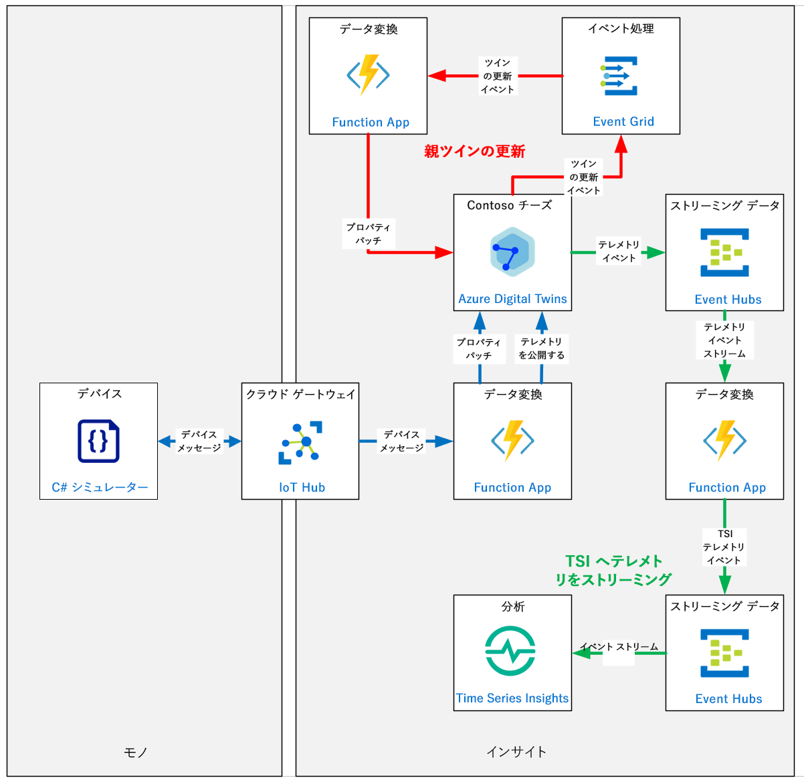
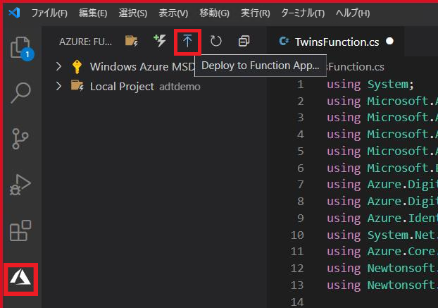
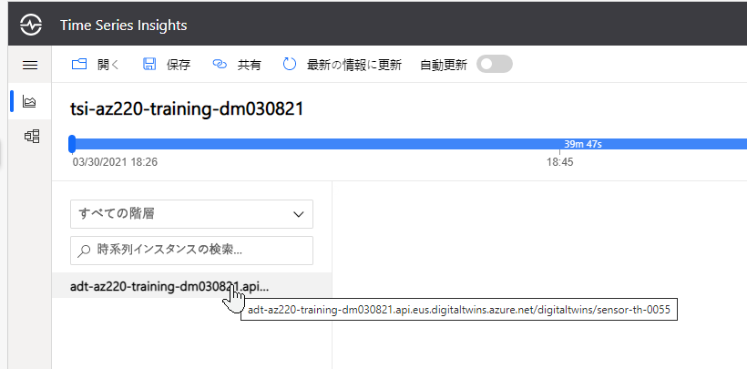
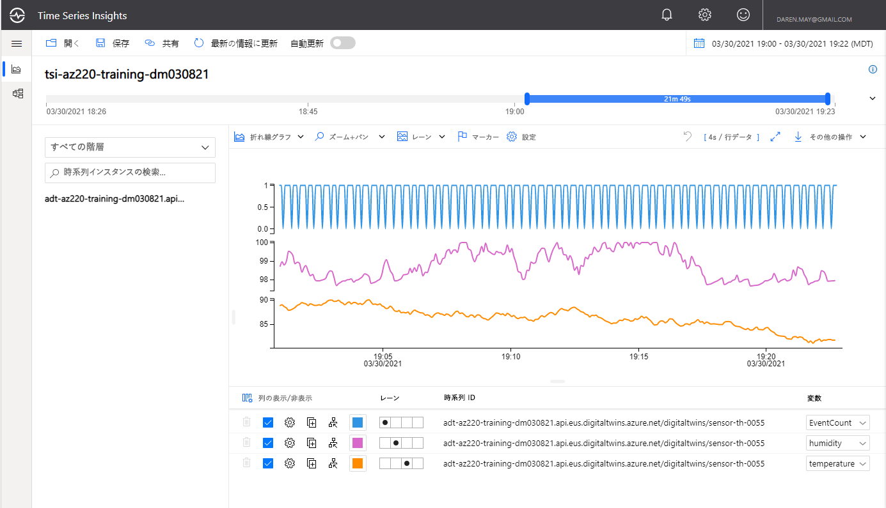

---
lab:
  title: ラボ 19:Azure Digital Twins (ADT) を開発する
  module: 'Module 11: Develop with Azure Digital Twins'
ms.openlocfilehash: 654a98a8b7affffb99e1c88a6c1c9c5a32546488
ms.sourcegitcommit: 7874419a1f0f346f972914893b4b3644ba84a267
ms.translationtype: HT
ms.contentlocale: ja-JP
ms.lasthandoff: 03/04/2022
ms.locfileid: "139262461"
---
# <a name="develop-azure-digital-twins-adt-solutions"></a>Azure Digital Twins (ADT) を開発する

## <a name="lab-scenario"></a>課題シナリオ

Contoso の経営陣は、デジタル進化の次のステップを踏み出し、Azure Digital Twins (ADT) を使用してチーズ製造施設のモデルを開発することを決定しました。 Azure Digital Twins を使用すると、現実の環境のライブ モデルを作成して対話的に操作することができます。 まず、個々の要素がデジタル ツインとしてモデル化されます。 次に、これらのモデルは、ライブ イベントに応答し、情報を照会できるナレッジ グラフに接続されます。

ADT を最大限に活用する方法をよりよく理解するために、既存のチーズ セラー デバイスのセンサー テレメトリを次の単純なモデル階層に組み込む方法を示す概念実証プロトタイプを作成するように依頼されました。

* チーズ工場
* チーズ セラー
* チーズ セラー デバイス

この最初のプロトタイプでは、次のシナリオのソリューションを示すように求められました。

* デバイス テレメトリを IoT Hub から ADT の適切なデバイスにマッピングする方法
* 子デジタル ツイン プロパティの更新を使用して親ツインを更新する方法 (チーズ セラー デバイスからチーズ セラーへ)
* デバイス テレメトリを ADT 経由で Time Series Insights にルーティングする方法

次のリソースが作成されます。



## <a name="in-this-lab"></a>このラボでは

このラボでは、次のタスクを正常に達成します。

* ラボの前提条件を構成する (必要な Azure リソース)
* デジタル ツインの作成と構成
  * 提供された DTDL を使用してデジタル ツインを作成する
  * デジタル ツイン インスタンスを使用して ADT グラフを作成する
* ADT グラフの相互作用を実装する (ADT エクスプローラー)
  * ADT グラフをクエリする
  * グラフ内の ADT エンティティでプロパティを更新する
* ADT をアップストリームおよびダウンストリーム システムと統合する
  * IoT デバイス メッセージを取り込み、メッセージを ADT に変換する
  * テレメトリを Time Series Insights (TSI) に公開するように ADT ルートとエンドポイントを構成する

## <a name="lab-instructions"></a>ラボの手順

### <a name="exercise-1---configure-lab-prerequisites"></a>演習 1 - ラボの前提条件を構成する

#### <a name="task-1---create-resources"></a>タスク1 - リソースを作成する

このラボでは、次の Azure リソースが使用可能であることを前提としています。

| リソースの種類  | リソース名                |
| :------------- | :--------------------------- |
| リソース グループ | rg-az220                     |
| IoT Hub        | iot-az220-training-{your-id} |
| TSI            | tsi-az220-training-{your-id} |
| TSI アクセス ポリシー | access1                   |

これらのリソースを確実に使用できるようにするには、次の手順に従います。

1. 仮想マシン環境で Microsoft Edge ブラウザー ウィンドウを開き、次の Web アドレスに移動します。
 
    +++https://portal.azure.com/#create/Microsoft.Template/uri/https%3A%2F%2Fraw.githubusercontent.com%2FMicrosoftLearning%2FAZ-220-Microsoft-Azure-IoT-Developer%2Fmaster%2FAllfiles%2FARM%2Flab19.json+++

    > **注**:緑色の "T" 記号 (例: +++このテキストを入力+++) が表示されているときはいつでも、関連付けられているテキストをクリックすると、仮想マシン環境内の現在のフィールドに情報が入力されます。

1. Azure portal にログインするように求められた場合は、このコースで使用している Azure 資格情報を入力します。

    **[カスタム デプロイ]** ページが表示されます。

1. **[プロジェクトの詳細]** の **[サブスクリプション]** ドロップダウンで、このコースで使用する [Azure サブスクリプション] が選択されていることを確認します。

1. **[リソース グループ]** ドロップダウンで、 **[rg-az220]** を選択します。

    > **注**:**rg-az220** がリストにない場合:
    >
    > 1. **[リソース グループ]** ドロップダウンで、 **[新規作成]** をクリックします。
    > 1. **[名前]** に「**rg-az220**」と入力します。
    > 1. **[OK]** をクリックします。

1. **[インスタンスの詳細]** の **[リージョン]** ドロップダウンで、最も近いリージョンを選択します。

    > **注**:**rg-az220** グループが既に存在する場合、 **[リージョン]** フィールドは、リソース グループで使用されるリージョンに設定され、読み取り専用になります。

1. **[Your ID]\(ユーザー ID\)** フィールドに、演習 1 で作成した一意の ID を入力します。

1. **[コース ID]** フィールドに、「**az220**」と入力します。

1. 現在のユーザー オブジェクト ID を確認するには、**Cloud Shell** を開き、次のコマンドを実行します。

    ```sh
    az ad signed-in-user show --query objectId -o tsv
    ```

    表示されたオブジェクト ID をコピーします。

1. **[オブジェクト ID]** フィールドに、前のステップでコピーしたオブジェクト ID を入力します。

1. テンプレートを検証するには、 **[確認および作成]** をクリックします。

1. 検証に成功したら、 **[作成]** をクリックします。

    デプロイが開始されます。

1. デプロイが完了した後、テンプレートの出力値を確認するには、左側のナビゲーション領域で **[出力]** をクリックします。

    後で使用するために出力をメモしておきます。

    * connectionString
    * deviceConnectionString
    * devicePrimaryKey
    * storageAccountName

これで、リソースが作成されました。

#### <a name="task-2---verify-tools"></a>タスク2 - ツールを確認する

1. お使いの仮想マシン環境で、Windows コマンド プロンプト ウィンドウを開きます。

1. ローカル環境にインストールされている Azure CLI のバージョンを表示するには、次のコマンドを入力します。

    ```powershell
    az --version
    ```

1. azure-cli バージョン 2.11.0 以降が表示されていることを確認します。

    Azure CLI バージョン 2.11 には、最新バージョンにアップグレードする機能があります。 アップグレードするには、次のコマンドを入力します。

        ```powershell
        az update
        ```

    > **注**:Azure CLI がインストールされていない場合は、続行する前にインストールする必要があります。

    1. ブラウザーを開き、[Azure CLI ツールのダウンロード] ページに移動します。[Azure CLI のインストール](https://docs.microsoft.com/en-us/cli/azure/install-azure-cli?view=azure-cli-latest "Azure CLI のインストール")

        Azure CLI ツールの最新バージョンをインストールする必要があります。 Azure CLI の現在 (2022 年 2 月時点) のバージョンは 2.33 ですが、新しいバージョンが毎月リリースされるので、最新バージョンは変わっている可能性があることに注意してください。

    1. **[Azure CLI のインストール]** ページで、OS のインストール オプション ( **[Install on Windows]\(Windows にインストール\)** など) を選び、画面の指示に従って Azure CLI ツールをインストールします。

### <a name="exercise-2---create-an-instance-of-the-azure-digital-twins-resource"></a>演習 2 - Azure Digital Twins リソースのインスタンスを作成する

この演習では、Azure portal を使用して Azure Digital Twins (ADT) インスタンスを作成します。 Azure Digital Twins の接続データは、後で使用できるようにテキスト ファイルに保存されます。 最後に、現在のユーザーには、ADT リソースへのアクセスを許可する役割が割り当てられます。

#### <a name="task-1---use-the-azure-portal-to-create-a-resource-azure-digital-twins"></a>タスク 1 - Azure portal を使用してリソースを作成する (Azure Digital Twins)

1. 新しいブラウザー ウィンドウで [Azure portal](https://portal.azure.com) を開きます。

1. Azure portal で、 **[+ リソースの作成]** をクリックします。

    開く **新しい** ブレードは、Azure で作成できるすべてのリソースのコレクションである Azure Marketplace のフロントエンドです。 Marketplace には、Microsoft とコミュニティの両方からのリソースが含まれています。

1. **[Marketplace を検索]** テキスト ボックスに、「**Azure Digital Twins**」と入力します

1. オプションが表示されたら、 **[Azure Digital Twins]** を選択し、 **[作成]** をクリックします。

1. **[リソースの作成]** ペインの **[サブスクリプション]** で、このコースに使用するサブスクリプションが選択されていることを確認します。

    > **注**:アカウントには、サブスクリプションの管理者ロールが必要です

1. **[リソース グループ]** の場合、 **[rg-az220]** を選択します。

1. **[リソース名]** ドロップダウンで、 **[adt-az220-training-{your-id}]** をクリックします

1. **[リージョン]** ドロップダウンで、Azure IoT Hub がプロビジョニングされているリージョン (または、使用可能な最も近いリージョン) を選びます。

1. **[リソースへのアクセス権の付与]** で、現在のユーザーが **Digital Twins Explorer** アプリを使用できるようにするため、 **[Assign Azure Digital Twins Owner Role]\(Azure Digital Twins の所有者ロールを割り当てる\)** をオンにします。

    > **注**:インスタンス内の要素を管理するには、ユーザーが Azure Digital Twins データ プレーン API にアクセスできる必要があります。 上記の推奨されるロールを選ぶと、現在のユーザーにデータ プレーン API へのフル アクセスが許可されます。 また、Access Control (IAM) を使用して、後で適切なロールを選ぶこともできます。 Azure Digital Twins のセキュリティについて詳しくは、[こちら](https://docs.microsoft.com/azure/digital-twins/concepts-security)をご覧ください

1. 入力した値を確認するには、 **[Review + create]** をクリックします。

1. デプロイ プロセスを開始するには、**[作成]** をクリックします。

    **デプロイ中** が表示されるまでしばらく待ちます。

1. **[リソースに移動]** を選択します。

    ADT リソースの [概要] ペインが表示されます。このペインには、「**Azure Digital Twins の概要**」というタイトルの本文セクションが含まれています。

#### <a name="task-2---save-the-connection-data-to-a-reference-file"></a>タスク 2 - 接続データを参照ファイルに保存する

1. **メモ帳** または同様のテキスト エディターを使用して、**adt-connection.txt** という名前のファイルを作成します。

1. Azure Digital Twins インスタンスの名前をファイルに追加します - **adt-az220-training-{your-id}**

1. リソースグループをファイルに追加します - **rg-az220**

1. ブラウザーで、デジタル ツイン インスタンスの **[概要]** ペインに戻ります。

1. ペインの **[Essentials]** セクションで、 **[ホスト名]** フィールドを見つけます。

1. **[ホスト名]** フィールドにマウスポインタを合わせ、値の右側に表示されるアイコンを使用してホスト名をクリップボードにコピーし、テキスト ファイルに貼り付けます。

1. テキスト ファイルで、ホスト名の先頭に **https://** を追加して、ホスト名をデジタル ツイン インスタンスへの接続 URL に変換します。

    変更された URL は のようになります。

    ```http
    https://adt-az220-training-dm030821.api.eus.digitaltwins.azure.net
    ```

1. **adt-connection.txt** ファイルを保存します。

これで、Azure Digital Twin リソースが作成され、API を介してリソースにアクセスできるようにユーザー アカウントが更新されました。

### <a name="exercise-3---create-a-graph-of-the-models"></a>演習 3 - モデルのグラフを作成する

モデリング アクティビティの一部として、アナリストは、チーズ セラー デバイス メッセージの内容など、多くの要因を検討し、DTDL の **プロパティ** と **テレメトリ** のフィールド定義でマッピングを作成します。 これらの DTDL コード フラグメントを使用するには、それらを **インターフェイス** (モデルの最上位のコード アイテム) に組み込みます。 ただし、チーズ セラー デバイス モデルの **インターフェイス** は、Contoso チーズ工場の Azure Digital Twins 環境のごく一部を形成します。 工場全体を表す環境のモデリングはこのコースの範囲を超えているため、チーズ セラー デバイスのモデル、関連するチーズ セラーのモデル、工場のモデルに焦点を当てた、大幅に簡略化された環境を代わりに検討します。 モデルの階層は次のとおりです。

* チーズ 工場インターフェイス
* チーズ セラー インターフェイス
* チーズ セラー デバイス インターフェイス

上記のインターフェイス定義の階層とそれらの関係を考慮すると、**チーズ工場にはチーズ セラーがあり**、**チーズ セラーにはチーズ セラー デバイスがある** と言えます。

ADT 環境用のデジタル ツイン モデルを設計するときは、インターフェイス、スキーマ、およびリレーションシップに使用される ID を作成するために一貫したアプローチを使用するのが最善です。 環境内の各エンティティには **@id** プロパティがあり (インターフェイスに必要です)、そのエンティティを一意に識別する必要があります。 ID 値の形式は、**デジタル ツインモデル 識別子 (DTMI)** の形式です。 DTMI には、スキーム、パス、バージョンの 3 つのコンポーネントがあります。 スキームとパスはコロン `:` で区切られ、パスとバージョンはセミコロン `;` で区切られます。 形式は次のようになります: `<scheme> : <path> ; <version>`。 DTMI 形式の ID 内のスキームの値は常に **dtmi** です。

Contoso チーズ工場の ID 値の 1 つの例は、次のようになります: `dtmi:com:contoso:digital_factory:cheese_factory;1`。

この例では、スキーム値は期待どおり **dtmi** であり、バージョンは **1** に設定されています。 この ID 値内の `<path>` コンポーネントは、次の分類を利用します。

* モデルのソース - **com:contoso**
* モデルのカテゴリ - **digital_factory**
* カテゴリ内の型 - **cheese_factory**

> **助言**：DTMI 形式の詳細については、次のリソースを確認してください。
> * [デジタル ツイン モデルの識別子](https://github.com/Azure/opendigitaltwins-dtdl/blob/master/DTDL/v2/dtdlv2.md#digital-twin-model-identifier)

上記で特定したモデル階層とリレーションシップを思い出してください。使用される ID の例は、次のとおりです。

| インターフェイス                      | id                                                                     |
| :----------------------------- | :--------------------------------------------------------------------- |
| チーズ 工場インターフェイス       | dtmi:com:contoso:digital_factory:cheese_factory;1                      |
| チーズ セラー インターフェイス        | dtmi:com:contoso:digital_factory:cheese_factory:cheese_cave;1        |
| チーズ セラー デバイス インターフェイス | dtmi:com:contoso:digital_factory:cheese_factory:cheese_cave_device;1 |

ID の間のリレーションシップは次のようになります。

| リレーションシップ | id                                                                | 元 ID                                                         | ID へ                                                                  |
| :----------- | :---------------------------------------------------------------- | :-------------------------------------------------------------- | :--------------------------------------------------------------------- |
| Has Caves  | dtmi:com:contoso:digital_factory:cheese_factory:rel_has_caves;1 | dtmi:com:contoso:digital_factory:cheese_factory;1               | dtmi:com:contoso:digital_factory:cheese_factory:cheese_cave;1        |
| Has Devices  | dtmi:com:contoso:digital_factory:cheese_cave:rel_has_devices;1  | dtmi:com:contoso:digital_factory:cheese_factory:cheese_cave;1 | dtmi:com:contoso:digital_factory:cheese_factory:cheese_cave_device;1 |

> **注**: 「_ラボ 3: 開発環境の設定_」では、ZIP ファイルをダウンロードして内容をローカル環境に抽出することで、ラボ リソースを含む GitHub リポジトリをクローンしました。 抽出されたフォルダー構造には、次のフォルダー パスが含まれます。
>
> * すべてのファイル
>   * ラボ
>       * 19-Azure Digital Twins
>           * 最終工程
>               * モデル
>
>  この演習で参照されている完全なモデルは、このフォルダーの場所で入手できます。

この演習のためのインターフェイスは、概念実証で使用されるデジタル ツインごとに既に定義されているので、デジタル ツインの実際のグラフを作成します。 グラフを作成するためのフローは簡単です。

* モデル定義をインポートする
* 適切なモデルからツイン インスタンスを作成する
* 定義されたモデルのリレーションシップを使用してツイン インスタンス間のリレーションシップを作成する

このフローを実現するには、いくつかの方法があります。

* コマンドラインまたはスクリプトで Azure CLI コマンドを使用する
* SDK の 1 つをプログラムで使用するか、REST API を介して直接実行する
* ADT エクスプローラー サンプルなどのツールを使用する

ADT エクスプローラーには ADT グラフの豊富な視覚化が含まれているため、概念実証用の単純なモデルを構築するのに非常に適しています。 ただし、より大きく、より複雑なモデルもサポートされており、包括的な一括インポート/エクスポート機能が反復設計に役立ちます。 この演習では、次のタスクが完了します。

* Azure Portal を使用して ADT Explorer (プレビュー) にアクセスする
* Contoso チーズ モデルインポートする
* モデルを使用してデジタル ツインを作成する
* グラフにリレーションシップを追加する
* ADT からツイン、リレーションシップ、モデルを削除する方法を学ぶ
* グラフを ADT にバルク インポートする

#### <a name="task-1---access-the-adt-explorer"></a>タスク 1 - ADT Explorer にアクセスする

**ADT Explorer** は、Azure Digital Twins サービス用のアプリケーションです。 このアプリは Azure Digital Twins インスタンスに接続し、次の機能を提供します。

* モデルのアップロードおよび確認
* ツイン グラフのアップロードと編集
* さまざまなレイアウト手法を使用したツイン グラフの視覚化
* ツインのプロパティの編集
* ツイン グラフに対するクエリの実行

ADT Explorer は、プレビュー機能として Azure Portal に組み込まれており、スタンドアロンのサンプル アプリケーションとしても使用できます。 このラボでは、Azure Portal に組み込まれているバージョンを使います。

1. 新しいブラウザー ウィンドウで [Azure portal](https://portal.azure.com) を開きます。

1. ブラウザーで、Digital Twins インスタンスの **[概要]** ペインに移動します。

1. 新しいブラウザー タブで ADT Explorer を開くには、 **[Azure Digital Twins Explorer を開く (プレビュー)]** をクリックします。

    ADT Explorer をホストする新しいブラウザー タブが開きます。 結果が見つからなかったことを示すアラートが表示されます。モデルをインポートしていないので、これは予想されることです。

    **注**:新しいウィンドウで ADT インスタンスの URL の入力を求めるメッセージが表示された場合は、テキスト エディターに保存した URL の値を入力します。

    > **重要**: ログインを求めるメッセージが表示される場合は、Azure Digital Twins インスタンスの作成時に使用したのと同じアカウントを使ってください。そうしないと、データ プレーン API にアクセスできないので、エラーが表示されます。


これで、**ADT エクスプローラー** サンプル アプリケーションを使用する準備が整いました。 モデルの読み込みは次のタスクなので、使用可能なモデルがないことを示すエラー メッセージが表示されても心配しないでください。

#### <a name="task-2---import-models"></a>タスク2 - モデルをインポートする

ADT でデジタル ツインを作成するには、最初にモデルをアップロードする必要があります。 モデルをアップロードする方法はいくつかあります。

* [データ プレーン SDK](https://docs.microsoft.com/azure/digital-twins/how-to-use-apis-sdks)
* [データ プレーン REST API](https://docs.microsoft.com/rest/api/azure-digitaltwins/)
* [Azure CLI](https://docs.microsoft.com/cli/azure/ext/azure-iot/dt?view=azure-cli-latest)
* [ADT エクスプローラー](https://docs.microsoft.com/samples/azure-samples/digital-twins-explorer/digital-twins-explorer/)のインポート機能

最初の 2 つのオプションはプログラム シナリオに適していますが、Azure CLI は、コード シナリオまたは "1 回限り" の **コードとして構成** する場合に役立ちます。 **ADT エクスプローラー** アプリは、ADT と対話するための直感的な方法を提供します。

> **助言**：**コードとしての構成** とはどのようなものでしょうか。 構成はソース コード (たとえば、Azure CLI コマンドを含むスクリプト) して記述されているため、モデル アップロードの再利用可能な定義の作成、パラメーター化、ループを使用したモデルの複数のインスタンスの作成など、開発のベスト プラクティスを使用して最適化できます。 これらのスクリプトは、ソースコード管理に保存して、保持、バージョン管理などを行うことができます。

このタスクでは、Azure CLI コマンドと ADT エクスプローラー サンプル アプリを使用して、 **Allfiles\Labs\19-Azure Digital Twins\Final\Models** フォルダ－に含まれるモデルをアップロードします。

1. コマンド プロンプト ウィンドウを開きます。

1. 正しい Azure アカウントの資格情報を使用していることを確認するには、次のコマンドを使用して Azure にログインします。

    ```powershell
    az login
    ```

1. **チーズ工場インターフェイス** をアップロードするには、次のコマンドを入力します。

    ```powershell
    az dt model create --models "{file-root}\Allfiles\Labs\19-Azure Digital Twins\Final\Models\CheeseFactoryInterface.json" -n adt-az220-training-{your-id}
    ```

    **{file-root}** をこのラボのコンパニオン ファイルが配置されているフォルダーに置き換え、 **{your-id}** を一意の識別子に置き換えてください。

    成功すると、次のような出力が表示されます。

    ```json
    [
        {
            "decommissioned": false,
            "description": {},
            "displayName": {
            "en": "Cheese Factory - Interface Model"
            },
            "id": "dtmi:com:contoso:digital_factory:cheese_factory;1",
            "uploadTime": "2021-03-24T19:56:53.8723857+00:00"
        }
    ]
    ```

    **注**:Azure CLI コマンドを構成できない場合は、以下の手順で、Azure Digitial Twins Explorer インターフェイスを使ってモデルをインポートする方法が示されています。
  
1. **ADT Explorer** に戻ります。

    > **助言**：モデルの一覧を更新するには、 **[MODELS]\(モデル\)** エクスプローラーの **[Refresh]\(最新の情報に更新\)** ボタンをクリックします。

    アップロードされた **チーズ工場 - インターフェイス モデル** が一覧表示されます

    

1. **ADT Explorer** を使って、残りの 2 つのモデルをインポートするには、 **[MODELS]\(モデル\)** エクスプローラーで **[Upload a Model]\(モデルのアップロード\)** アイコンをクリックします

    ![ADT エクスプローラ モデル ビューの [モデルのアップロード] ボタン](media/LAB_AK_19-modelview-addmodel.png)

1. ダイアログを **開き**、**モデル** フォルダーに移動し、**CheeseCaveInterface.json** ファイルと **CheeseCaveDeviceInterface.json** ファイルを選択して、 **[開く]** をクリックします。

    次に、2 つのファイルが ADT にアップロードされ、モデルが追加されます。 完了すると、 **[MODELS]\(モデル\)** エクスプローラーが更新され、3 つのモデルすべてが一覧表示されます。

モデルがアップロードされたので、デジタル ツインを作成できます。

#### <a name="task-3---creating-twins"></a>タスク3 - ツインを作成する

Azure Digital Twins ソリューションでは、環境内のエンティティはデジタル ツインで表されます。 デジタル ツインは、カスタム定義モデルのいずれかのインスタンスです。 それをリレーションシップによって他のデジタル ツインに接続して、ツイン グラフを形成できます。このツイン グラフは、環境全体を表しています。

モデルと同様に、デジタル ツインとリレーションシップは複数の方法で作成できます。

* [データ プレーン SDK](https://docs.microsoft.com/azure/digital-twins/how-to-use-apis-sdks)
* [データ プレーン REST API](https://docs.microsoft.com/rest/api/azure-digitaltwins/)
* [Azure CLI](https://docs.microsoft.com/cli/azure/ext/azure-iot/dt?view=azure-cli-latest)
* [ADT エクスプローラー](https://docs.microsoft.com/samples/azure-samples/digital-twins-explorer/digital-twins-explorer/)のインポート機能

以前と同様に、最初の 2 つのオプションはプログラム シナリオに適していますが、Azure CLI は、**コードとして構成** するシナリオ、または "1 回限り" の要件として構成する場合に引き続き役立ちます。 デジタル ツインとリレーションシップを作成する最も直感的な方法は、**ADT エクスプローラー** を使用することですが、プロパティの初期化に関してはいくつかの制限があります。

1. チーズ工場インターフェイス モデルのアップロードに使用したコマンド ライン ウィンドウを開きます。

1. モデルからデジタル ツインを作成するには、次のコマンドを入力します。

    ```powershell
    az dt twin create --dt-name adt-az220-training-{your-id} --dtmi "dtmi:com:contoso:digital_factory:cheese_factory;1" --twin-id factory_1 --properties "{file-root}\Allfiles\Labs\19-Azure Digital Twins\Final\Properties\FactoryProperties.json"
    ```

    **{file-root}** をこのラボのコンパニオン ファイルが配置されているフォルダーに置き換え、 **{your-id}** を一意の識別子に置き換えてください。

    次に注意してください。

    * **--dt-name** 値は、ADT ツイン インスタンスを指定します。
    * **--dtmi** 値は、以前にアップロードされたチーズ工場モデルを指定します
    * **--twin-id** は、デジタルツインに指定された ID を指定します。
    * **--properties** 値は、ツインの初期化に使用される JSON ドキュメントのファイル パスを提供します。 または、単純な JSON をインラインで指定することもできます。

    成功した場合、コマンドの出力は次のようになります。

    ```json
    {
        "$dtId": "factory_1",
        "$etag": "W/\"09e781e5-c31f-4bf1-aed4-52a4472b0c5b\"",
        "$metadata": {
            "$model": "dtmi:com:contoso:digital_factory:cheese_factory;1",
            "FactoryName": {
                "lastUpdateTime": "2021-03-24T21:51:04.1371421Z"
            },
            "GeoLocation": {
                "lastUpdateTime": "2021-03-24T21:51:04.1371421Z"
            }
        },
        "FactoryName": "Contoso Cheese 1",
        "GeoLocation": {
            "Latitude": 47.64319985218156,
            "Longitude": -122.12449651580214
        }
    }
    ```

    **$metadata** プロパティには、プロパティが最後に更新された時刻を追跡するオブジェクトが含まれていることに注意してください。

1. **FactoryProperties.json** ファイルには次の JSON が含まれています。

    ```json
    {
        "FactoryName": "Contoso Cheese 1",
        "GeoLocation": {
            "Latitude": 47.64319985218156,
            "Longitude": -122.12449651580214
        }
    }
    ```

    プロパティ名がチーズ工場インターフェイスで宣言された DTDL プロパティ値と一致します。

    > **注**:コンプレックス プロパティ **GeoLocation** は、**緯度** プロパティと **経度** プロパティを持つ JSON オブジェクトを介して割り当てられます。

1. ブラウザーで **ADT Explorer** に戻ります。

1. これまでに作成したデジタル ツインを表示するには、 **[クエリの実行]** をクリックします。

    > **注**:クエリとクエリ言語については、後ほど説明します。

    しばらくすると、**factory_1** デジタル ツインが **[TWIN GRAPH]\(ツイン グラフ\)** ビューに表示されます。

    

1. デジタル ツインのプロパティを表示するには、 **[TWIN GRAPH]\(ツイン グラフ\)** ビューで **factory_1** をクリックします。

    **factory_1** のプロパティは、ツリー ビューのノードとして **プロパティ ビュー** に表示されます。

1. 経度と緯度のプロパティ値を表示するには、**GeoLocation** をクリックします。

    値が **FactoryProperties.json** ファイルの値と一致していることに注意してください。

1. チーズ工場モデルから別のデジタル ツインを作成するには、 **[MODELS]\(モデル\)** エクスプローラーで **チーズ工場** モデルを見つけて、 **[Create a Twin]\(ツインの作成\)** をクリックします

    ![ADT エクスプローラーのモデル ビューの [ツインの作成] ボタン](media/LAB_AK_19-modelview-createtwin.png)

1. **新しいツイン名** の入力を求められたら、「**factory_2**」と入力し、**[保存]** をクリックします。

1. **factory_2** のデジタル ツインのプロパティを表示するには、 **[TWIN GRAPH]\(ツイン グラフ\)** ビューで **factory_2** をクリックします。

    **FactoryName** プロパティと **GeoLocation** プロパティが初期化されていないことに注意してください。

1. **factoryName** を設定するには、プロパティの右側にマウスカーソルを置きます。テキストボックス コントロールが表示されます。 「**Cheese Factory 2**」と入力します。

    

1. **[PROPERTIES]\(プロパティ\)** エクスプローラー ペインでプロパティの更新を保存するには、 **[Patch Twin]\(ツインのパッチ\)** アイコンを選びます。

    > **注**:[パッチ ツイン] アイコンは、[クエリの実行] ボタンの右側にある [クエリの保存] アイコンと同じように表示されます。 [クエリの保存] アイコンは必要ありません。

    [パッチ ツイン] 選択すると、JSON パッチが作成されて送信され、デジタル ツインが更新されます。 **パッチ情報** がダイアログに表示されます。 これが初めての値の設定なので、**op** (操作) プロパティが **add** であることに注意してください。 以降の値の変更は、**replace** 操作になります。これを確認するには、別の更新を行う前に、 **[Run Query]\(クエリの実行\)** をクリックして **[TWIN GRAPH]\(ツイン グラフ\)** ビューを更新します。

   > **助言**：JSON パッチ ドキュメントの詳細については、次のリソースを確認してください。
   > * [JavaScript Object Notation (JSON) パッチ](https://tools.ietf.org/html/rfc6902)
   > * [JSON パッチとは何ですか?](http://jsonpatch.com/)

1. **[PROPERTIES]\(プロパティ\)** エクスプローラーで、**factory_2** の **GeoLocation** プロパティを調べます。**Latitude** と **Longitude** の値が **Unset** と表示されることに注意してください。

    > **Info**:以前のバージョンの ADT Explorer では、UI を使って "サブプロパティ" を編集することはできませんでした。ありがたいことに、この機能が追加されています。

1. **Latitude** と **Longitude** の値を次のように更新します。

    | プロパティ名 | 値 |
    | :-- | :-- |
    | Latitude | 47.64530450740752 |
    | Longitude | -122.12594819866645 |

1. **[PROPERTIES]\(プロパティ\)** エクスプローラー ペインでプロパティの更新を保存するには、 **[Patch Twin]\(ツインのパッチ\)** アイコンを選びます。

    [Patch Information]\(パッチ情報\) が再び表示されます。

1. **[MODELS]\(モデル\)** エクスプローラーで適切なモデルを選んで、 **[Add a Twin]\(ツインの追加\)** をクリックし、次のデジタル ツインを追加します。

    | Model Name                             | デジタル ツイン名 |
    | :------------------------------------- | :---------------- |
    | チーズ セラー - インターフェイス モデル        | cave_1          |
    | チーズ セラー - インターフェイス モデル        | cave_2          |
    | チーズ セラー デバイス - インターフェイス モデル | device_1          |
    | チーズ セラー デバイス - インターフェイス モデル | device_2          |

    

いくつかのツインが作成されたので、リレーションシップを追加します。

#### <a name="task-4---adding-relationships"></a>タスク4 - リレーションシップを追加する

ツインは、そのリレーションシップによってツイン グラフに接続されます。 ツインが持つことのできるリレーションシップは、そのモデルの一部として定義されます。

たとえば、**チーズ工場** モデルは、**チーズ セラー** 型のツインを対象とする "contains" 関係を定義します。 この定義により、Azure Digital Twins を使って、**チーズ工場** ツインから **チーズ セラー** ツイン (特定のチーズ専用の **チーズ セラー** など、**チーズ セラー** のサブタイプである可能性のあるツインを含む) への **rel_has_caves** リレーションシップを作成できます。

このプロセスにより、グラフ内にエッジ (リレーションシップ) によって接続された一連のノード (デジタル ツイン) が作成されます。

モデルやツインと同様に、リレーションシップは複数の方法で作成できます。

1. Azure CLI を介してリレーションシップを作成するには、コマンド プロンプトに戻り、次のコマンドを実行します。

    ```powershell
    az dt twin relationship create -n adt-az220-training-{your-id} --relationship-id factory_1_has_cave_1 --relationship rel_has_caves --twin-id factory_1 --target cave_1
    ```

    **{your-id}** を一意の識別子に置き換えます。

    成功した場合、コマンドの出力は次のようになります。

    ```json
    {
        "$etag": "W/\"cdb10516-36e7-4ec3-a154-c050afed3800\"",
        "$relationshipId": "factory_1_has_cave_1",
        "$relationshipName": "rel_has_caves",
        "$sourceId": "factory_1",
        "$targetId": "cave_1"
    }
    ```

1. リレーションシップを表示するには、ブラウザーで、**ADT Explorer** に戻ります。

1. 更新されたデジタル ツインを表示するには、 **[クエリの実行]** をクリックします。

    図が更新され、新しいリレーションシップが表示されます。

    

    リレーションシップがない場合は、ブラウザー ウィンドウを更新してから、クエリを実行します。

1. **ADT Explorer** を使ってリレーションシップを追加するには、最初に **cave_1** をクリックしてそれを選んだ後、**device_1** を **右クリック** します。 表示されたコンテキスト メニューで、 **[Add relationships]\(リレーションシップの追加\)** を選びます。

1. **[リレーションシップの作成]** ダイアログの **[ソースID]** で、**cave_1** が表示されていることを確認します。

1. **[ターゲット ID]** で、**device_1** が表示されていることを確認します。

1. **[Relationship]\(リレーションシップ\)** で **rel_has_devices** を選びます。

    > **注**:Azure CLI で作成したリレーションシップとは異なり、 **$relationshipId** の値を指定するための同等の UI はありません。 代わりに、GUID が割り当てられます。

1. リレーションシップを作成するには、 **[保存]** をクリックします。

    リレーションシップが作成され、図が更新されてリレーションシップが表示されます。 この図は、**factory_1** に **device_1** を持つ **cave_1** があることを示しています。

1. さらに 2 つのリレーションシップを追加します。

    | source    | 移行先   | リレーションシップ    |
    | :-------- | :------- | :-------------- |
    | factory_1 | cave_2 | rel_has_caves |
    | cave_2  | device_2 | rel_has_devices |

    グラフは次のように表示されます。

    

1. **[TWIN GRAPH]\(ツイン グラフ\)** ビューのレイアウト オプションを表示するには、 **[Choose Layout]\(レイアウトの選択\)** ボタンをクリックします。

    

    **[TWIN GRAPH]\(ツイン グラフ\)** ビューでは、さまざまなアルゴリズムを使ってグラフをレイアウトできます。 既定では、**クレイ** レイアウトが選択されています。 さまざまなレイアウトを選択して、グラフがどのように影響を受けるかを確認できます。

#### <a name="task-5---deleting-models-relationships-and-twins"></a>タスク5 - モデル、関係、およびツインの削除

ADT を使用したモデリングの設計プロセス中に、いくつかの概念実証が作成され、その多くが削除される可能性があります。 デジタル ツインの他の操作と同様に、モデルとツインを削除するためのプログラムによるアプローチ (API、SDK、および CLI) があり、**ADT エクスプローラー** を使用することもできます。

> **注**:削除操作は非同期であり、たとえば、REST API 呼び出しまたは **ADT Explorer** での削除はすぐに完了したように見える場合がありますが、ADT サービス内で操作が完了するまでに数分かかる場合があります。 最近削除されたモデルと同じ名前で改訂されたモデルをアップロードしようとすると、バックエンド操作が完了するまで予期せず失敗する可能性があります。

1. CLI を使用して **factory_2** デジタル ツインを削除するには、コマンド プロンプト ウィンドウに戻り、次のコマンドを入力します。

    ```powershell
    az dt twin delete -n adt-az220-training-{your-id} --twin-id factory_2
    ```

    他のコマンドとは異なり、出力は表示されません (コマンドがエラーを生成しない限り)。

1. **factory_1** と **cave_1** の間のリレーションシップを削除するには、次のコマンドを入力します。

    ```powershell
    az dt twin relationship delete -n adt-az220-training-{your-id} --twin-id factory_1 --relationship-id factory_1_has_cave_1
    ```

    このコマンドはリレーションシップ ID が必要であることをに注意してください。 特定のツインのリレーションシップ ID を表示できます。 たとえば、**factory_1** のリレーションシップ ID を表示するには、次のコマンドを入力します。

    ```powershell
    az dt twin relationship list -n adt-az220-training-{your-id} --twin-id factory_1
    ```

    セラー 1 とのリレーションシップを削除する前にこのコマンドを実行すると、次のような出力が表示されます。

    ```json
    [
        {
            "$etag": "W/\"a6a9f506-3cfa-4b62-bcf8-c51b5ecc6f6d\"",
            "$relationshipId": "47b0754a-25d1-4b71-ac47-c2409bb08535",
            "$relationshipName": "rel_has_caves",
            "$sourceId": "factory_1",
            "$targetId": "cave_2"
        },
        {
            "$etag": "W/\"b5207e88-7c86-498f-a272-7f81dde88dee\"",
            "$relationshipId": "factory_1_has_cave_1",
            "$relationshipName": "rel_has_caves",
            "$sourceId": "factory_1",
            "$targetId": "cave_1"
        }
    ]
    ```

1. モデルを削除するには、次のコマンドを入力します。

    ```powershell
    az dt model delete -n adt-az220-training-{your-id} --dtmi "dtmi:com:contoso:digital_factory:cheese_factory;1"
    ```

    ここでも出力は表示されません。

    > **重要**:このコマンドは、デジタル ツイン **factory_1** がまだ存在していても、工場モデルを削除して成功しました。 削除されたモデルを使用して作成されたデジタル ツインは、グラフをクエリすることで引き続き見つけることができますが、モデルがないとツインのプロパティを更新できなくなります。 一貫性のないグラフを作成しないように、モデル管理タスク (バージョン管理、削除など) を完了するときは十分に注意してください。

1. デジタル ツインへの最近の変更を表示するには、**ADT Explorer** に戻ります。

1. 表示を更新するには、ブラウザー ページを更新し、 **[クエリの実行]** をクリックします。

    **[MODELS]\(モデル\)** エクスプローラーには **チーズ工場** モデルがなく、 **[TWIN GRAPH]\(ツイン グラフ\)** ビューには **factory_1** と **cave_1** の間のリレーションシップがないはずです。

1. **cave_1** と **device_1** の間のリレーションシップを選択するには、2 つのツインの間の線をクリックします。

    線が太くなり、選択されていることを示し、 **[リレーションシップの削除]** ボタンが有効になります。

    

1. リレーションシップを削除するには、線を右クリックし、コンテキスト メニューから **[Delete relationship(s)]\(リレーションシップの削除\)** を選び、 **[Delete]\(削除\)** をクリックして確認します。

    リレーションシップが削除され、グラフが更新されます。

1. **device_1** デジタル ツインを削除するには、**device_1** を右クリックして、コンテキスト メニューから **[Delete twin(s)]\(ツインの削除\)** を選びます。

    > **注**:**Ctrl** キーを押しながら左クリックすると、複数のツインを選択できます。 それらを削除するには、最後のツインを右クリックして、コンテキスト メニューから **[Delete twin(s)]\(ツインの削除\)** を選びます。

1. ADT エクスプローラー ページの右上隅にあるグラフ内のすべてのデジタル ツインを削除するには、**すべてのツインを削除** をクリックし、**削除** をクリックして確定します。

    

    > **重要**:注意して使用してください - この機能を元に戻すことはできません。

1. **[MODELS]\(モデル\)** エクスプローラーから **チーズ セラー デバイス** モデルを削除するには、関連する **[Delete Model]\(モデルの削除\)** ボタンをクリックし、 **[Delete]\(削除\)** をクリックして確定します。

1. すべてのモデルを削除するには、 **[MODELS]\(モデル\)** エクスプローラーの上部にある **[Delete All Models]\(すべてのモデルを削除\)** をクリックします。

    > **重要**:注意して使用してください - 元に戻す機能はありません。

この時点で、ADT インスタンスには、すべてのモデル、ツイン、およびリレーションシップが含まれていません。 心配しないでください。次のタスクでは、**グラフのインポート** 機能を使用して新しいグラフを作成します。

#### <a name="task-6---bulk-import-with-adt-explorer"></a>タスク 6 - ADT エクスプローラーを使用した一括インポート

**ADT エクスプローラー** は、デジタル ツイン グラフのインポートとエクスポートをサポートしています。 **エクスポート** 機能は、最新のクエリ結果を、モデル、ツイン、リレーションシップなどの JSON ベースの形式にシリアル化します。 **インポート** 機能は、カスタムの Excel ベースの形式またはエクスポート時に生成された JSON ベースの形式のいずれかから逆シリアル化します。 インポートが実行される前に、検証のためにグラフのプレビューが表示されます。

Excel のインポート形式は、次の列に基づいています

* **ModelId**:インスタンス化する必要があるモデルの完全な dtmi。
* **ID**: 作成されるツインの一意のID
* **リレーションシップ**: 新しい双子との発信リレーションシップを持つツインID
* **リレーションシップ名**:前の列のルインからの発信リレーションシップの名前
* **初期データ**:作成するツインの **プロパティ** 設定を含む JSON 文字列

> **注**:Excel のインポート機能では、モデル定義はインポート **されず**、ツインとリレーションシップのみがインポートされます。 JSON 形式はモデルもサポートします。

次の表は、このタスクで作成されるツインとリレーションシップを示しています (**初期データ** の値は読みやすくするために削除されています)。

| ModelID                                                                | id             | リレーションシップ (発信側) | リレーションシップ名 | 初期データ |
| :--------------------------------------------------------------------- | :------------- | :------------------ | :---------------- | :-------- |
| dtmi:com:contoso:digital_factory:cheese_factory;1                      | factory_1      |                     |                   |           |
| dtmi:com:contoso:digital_factory:cheese_factory:cheese_cave;1        | cave_1       | factory_1           | rel_has_caves   |           |
| dtmi:com:contoso:digital_factory:cheese_factory:cheese_cave;1        | cave_2       | factory_1           | rel_has_caves   |           |
| dtmi:com:contoso:digital_factory:cheese_factory:cheese_cave;1        | cave_3       | factory_1           | rel_has_caves   |           |
| dtmi:com:contoso:digital_factory:cheese_factory:cheese_cave_device;1 | sensor-th-0055 | cave_1            | rel_has_devices   |           |
| dtmi:com:contoso:digital_factory:cheese_factory:cheese_cave_device;1 | sensor-th-0056 | cave_2            | rel_has_devices   |           |
| dtmi:com:contoso:digital_factory:cheese_factory:cheese_cave_device;1 | sensor-th-0057 | cave_3            | rel_has_devices   |           |

スプレッドシート **cheese-factory-scenario.xlsx** は、 **{file-root}\Allfiles\Labs\19-Azure Digital Twins\Final\Models** フォルダーにあります。

1. ブラウザーで **ADT Explorer** に戻ります。

1. **ADT Explorer** を使ってモデルをインポートするには、 **[MODELS]\(モデル\)** エクスプローラーで **[Upload a Model]\(モデルのアップロード\)** アイコンをクリックします

1. **[開く]** ダイアログで、**モデル** フォルダーに移動し、**CheeseFactoryInterface.json**、**CheeseCaveInterface.json**、および **CheeseCaveDeviceInterface.json** ファイルを選択して、 **[開く]** をクリックします。

    これにより、すべてのモデルがリロードされます。

1. **chees-factory-scenario.xlsx** スプレッドシートをインポートするには、 **[グラフのインポート]** をクリックします。

    

1. **[開く]** ダイアログで、**モデル** フォルダーに移動し、**cheese-factory-scenario.xlsx** ファイルを選択して、 **[開く]** をクリックします。

    インポートされるグラフのプレビューが、 **[IMPORT]\(インポート\)** ビューに表示されます。

    

1. インポートを完了するには、 **[インポートの開始]** をクリックします。

    **[インポートに成功しました]** ダイアログが表示され、7 つのツインと 6 つのリレーションシップがインポートされたことが詳細に示されます。 **[閉じる]** をクリックして続行します。

1. **[TWIN GRAPH]\(ツイン グラフ\)** ビューに戻り、 **[Run Query]\(クエリの実行\)** をクリックします。

    インポートされたグラフが表示されます。 各ツインをクリックしてプロパティを表示できます (各ツインは値で初期化されています)。

1. 現在のグラフを JSON としてエクスポートするには、 **[グラフのエクスポート]** (前に使用した **[グラフのインポート]** ボタンの横) をクリックします。

    **エクスポート** ビューは、左上隅に **ダウンロード** リンクとともに表示されます。

1. JSON でモデルをダウンロードするには、 **[ダウンロード]** リンクをクリックします。

    ブラウザーがモデルをダウンロードします。

1. JSON を表示するには、ダウンロードしたファイルを Visual Studio Code で開きます。

    JSON が 1 行で表示されている場合は、コマンド パレットから **[ドキュメントのフォーマット]** コマンドを使用するか、**Shift+Alt+F** を押して、JSON を再フォーマットします。

    JSON には 3 つの主要なセクションがあります。

    * **digitalTwinsFileInfo** - エクスポートされたファイル形式のバージョンが含まれます
    * **digitalTwinsGraph** - エクスポートされたグラフに表示されていたすべてのツインとリレーションシップのインスタンス データが含まれます (つまり、クエリに基づいて表示されたもののみ)
    * **digitalTwinsModels** - モデルの定義

    > **注**:Excel 形式とは異なり、JSON ファイルにはモデル定義が含まれています。つまり、1 つのファイルだけですべてをインポートできます。

1. JSON ファイルをインポートするには、**ADT エクスプローラー** を使用して、前のタスクの手順に従ってモデルとツインを削除してから、作成したばかりの JSON エクス ポートファイルをインポートします。 モデル、ツインとそのプロパティ、およびリレーションシップが再作成されることに注意してください。

このツイン グラフは、クエリの演習の基礎として使用されます。

### <a name="exercise-4---query-the-graph-using-adt-explorer"></a>演習 4 - ADT Explorer を使用してグラフのクエリを行う

>**注**:この演習では、前の演習でインポートしたグラフが必要です。

次に、デジタル ツイン グラフ クエリ言語を確認します。

作成したデジタル ツイン グラフに対してクエリを実行すると、デジタル ツインとそれに含まれるリレーションシップに関する情報を取得できます。 これらのクエリは、SQL に似たカスタム クエリ言語 (Azure Digital Twins クエリ言語と呼ばれます) で記述します。 この言語は、Azure IoT Hub 用のクエリ言語にも似ています。

クエリは、Digital Twins REST API および SDK を使用して行うことができます。 この演習では、Azure Digital Twins エクスプローラーのサンプルアプリを使用して、API呼び出しを処理します。 追加のツールについては、このラボの後半で説明します。

> **注**:**ADT エクスプローラー** はグラフを視覚化するように設計されており、名前など、ツインから選択された単一の値だけでなく、ツイン全体のみを表示できます。

#### <a name="task-1---query-using-the-adt-explorer"></a>タスク 1 - ADT エクスプローラーを使用したクエリ

このタスクでは、ADT エクスプローラーを使用してグラフ クエリを実行し、結果をグラフとしてレンダリングします。 ツインは、プロパティ、モデルの種類、およびリレーションシップによってクエリできます。 クエリは、一度に複数の種類のツイン記述子をクエリできる組み合わせ演算子を使用して、複合クエリに組み合わせることができます。

1. ブラウザーで **ADT Explorer** に戻ります。

1. **クエリ エクスプローラー** のクエリが次のように設定されていることを確認します。

    ```sql
    SELECT * FROM digitaltwins
    ```

    SQL に精通している場合は、これによりデジタル ツインからすべてが返されることが期待されます。

1. このクエリを実行するには、 **[クエリの実行]** をクリックします。

    予想通り、グラフ全体が表示されます。

1. これを名前付きクエリとして保存するには、( **[クエリの実行]** ボタンのすぐ右側にある) **[保存]** アイコンをクリックします。

1. **[クエリの保存]** ダイアログで、**"All Twins"** という名前を入力し、**[保存]** をクリックします。

    このクエリはローカルに保存され、クエリ テキストボックスの左側にある **[保存されたクエリ]** ドロップダウンで使用できます。 保存されたクエリを削除するには、 **[保存されたクエリ]** ドロップダウンが開いているときに、クエリの名前の横にある **[X]** アイコンをクリックします。

    > **助言**： **[All Twins]** クエリを実行して、いつでも完全なビューに戻ります。

1. **チーズ セラー** ツインのみが表示されるようにグラフをフィルター処理するには、次のクエリを入力して実行します。

    ```sql
    SELECT * FROM digitaltwins
    WHERE IS_OF_MODEL('dtmi:com:contoso:digital_factory:cheese_factory:cheese_cave;1')
    ```

    グラフには、3 つの **チーズ セラー** ツインだけが表示されます。

    このクエリを **ジャスト セラー** として保存します。

1. **使用中** の **チーズ セラー** ツインのみを表示するには、次のクエリを入力して実行します。

    ```sql
    SELECT * FROM digitaltwins
    WHERE IS_OF_MODEL('dtmi:com:contoso:digital_factory:cheese_factory:cheese_cave;1')
    AND inUse = true
    ```

    グラフには **cave_3** と **cave_1** だけが表示されます。

1. **使用中** で **温度アラート** がある **チーズ セラー** ツインのみを表示するには、次のクエリを入力して実行します。

    ```sql
    SELECT * FROM digitaltwins
    WHERE IS_OF_MODEL('dtmi:com:contoso:digital_factory:cheese_factory:cheese_cave;1')
    AND inUse = true
    AND temperatureAlert = true
    ```

    グラフには、**cave_3** だけが表示されます。

1. リレーションシップを使用して、結合を介してデバイス **sensor-th-0055** の親を見つけるには、次のクエリを入力します。

    ```sql
    SELECT Parent FROM digitaltwins Parent
    JOIN Child RELATED Parent.rel_has_devices
    WHERE Child.$dtId = 'sensor-th-0055'
    ```

    **cave_1** ツインが表示されるはずです。

    SQL JOIN に精通している人にとって、ここで使用される構文は、あなたが慣れているものとは異なって見えるでしょう。 この JOIN を WHERE 句のキー値と相関させたり、JOIN 定義にインラインでキー値を指定したりするのではなく、リレーションシップ **rel_has_devices** の名前が指定されていることに注意してください。 ターゲット エンティティはリレーションシップのプロパティ自体によって識別されるため、この相関関係は自動的に計算されます。 リレーションシップの定義は次のとおりです。

    ```json
    {
        "@type": "Relationship",
        "@id": "dtmi:com:contoso:digital_factory:cheese_cave:rel_has_devices;1",
        "name": "rel_has_devices",
        "displayName": "Has devices",
        "target": "dtmi:com:contoso:digital_factory:cheese_factory:cheese_cave_device;1"
    }
    ```

#### <a name="task-2---query-for-properties-using-the-adt-explorer"></a>タスク 2 - ADT エクスプローラーを使用したプロパティのクエリ

**ADT Explorer** の主な制限は、グラフをレンダリングするように設計されており、プロパティのみを返すクエリの結果をプライマリ表示に表示できないことです。 このタスクでは、コーディング ソリューションに頼らずに、このようなクエリの結果を確認する方法を学習します。

1. プロパティのみを返す有効なクエリを実行するには、次のクエリを入力して、 **[Run Query]\(クエリの実行\)** をクリックします。

    ```sql
    SELECT Parent.desiredTemperature FROM digitaltwins Parent
    JOIN Child RELATED Parent.rel_has_devices
    WHERE Child.$dtId = 'sensor-th-0055'
    ```

    クエリはエラーなしで実行されますが、グラフは表示されません。 ただし、**ADT エクスプローラー** で結果を表示する方法があり、次のタスクでクエリ結果を表示するために **[出力]** ペインを開きます。

1. **[出力]** ペインを開くには、ページの右上にある **[設定]** アイコンをクリックします。

1. 表示されるダイアログの **[表示]** で、 **[出力]** を有効にしてから、ダイアログを閉じます。

    ページの下部に **[出力]** ペインが表示されます。

1. 上記のクエリを再実行し、 **[出力]** ペインの内容を確認します。

    [出力] ペインに **要求済みクエリ** が表示され、返された JSON が表示されます。 JSON は次のようになります：

    ```json
    {
        "queryCharge": 20.259999999999998,
        "connection": "close",
        "content-encoding": "gzip",
        "content-type": "application/json; charset=utf-8",
        "date": "Thu, 25 Mar 2021 21:34:40 GMT",
        "strict-transport-security": "max-age=2592000",
        "traceresponse": "00-182f5e54efb95c4b8b3e2a6aac15499f-9c5ffe6b8299584e-01",
        "transfer-encoding": "chunked",
        "vary": "Accept-Encoding",
        "x-powered-by": "Express",
        "value": [
            {
            "desiredTemperature": 50
            }
        ],
        "continuationToken": null
    }
    ```

    追加の結果メタデータとともに、**値** プロパティに選択した **desiredTemperature** プロパティと値が含まれていることに注意してください。

### <a name="exercise-5---configure-and-launch-device-simulator"></a>演習 5 - デバイス シミュレーターを構成して起動する

前の演習では、概念実証用のデジタル ツイン モデルとグラフを作成しました。 デバイス メッセージ トラフィックを IoT Hub から ADT にルーティングする方法を示すには、デバイス シミュレーターを使用すると便利です。 この演習では、シミュレートされたデバイス アプリを構成して、テレメトリを IoT Hub に送信します。

#### <a name="task-1-open-the-device-simulator-project"></a>タスク 1:デバイス シミュレーター プロジェクトを開く

このタスクでは、構成の準備として、チーズ セラー デバイス シミュレーター アプリを Visual Studio Code で開きます。

1. **Visual Studio Code** を開きます。

1. **[ファイル]** メニューで、 **[フォルダーを開く]** を選択します。

1. [フォルダーを開く] ダイアログで、ラボ 19 の Starter フォルダーに移動します。

    「_ラボ 3: 開発環境の設定_」では、ZIP ファイルをダウンロードして内容をローカル環境に抽出することで、ラボ リソースを含む GitHub リポジトリをクローンしました。 抽出されたフォルダー構造には、次のフォルダー パスが含まれます。

    * すべてのファイル
        * ラボ
            * 19-Azure Digital Twins
                * スターター
                    * CheeseCaveDevice

1. **CheeseCaveDevice** をクリックして、 **[フォルダーの選択]** をクリックします。

    Visual Studio Code のエクスプローラー ウィンドウに次のファイルが一覧表示されます。

    * CheeseCaveDevice.csproj
    * Program.cs

1. コード ファイルを開くには、 **[Program.cs]** をクリックします。

    ざっと見ると、このアプリケーションは、前のラボで作業したシミュレートされたデバイス アプリケーションと非常に似ていることがわかります。 このバージョンは、対称キー認証を使用し、テレメトリとログ メッセージの両方を IoT Hub に送信し、より複雑なセンサー実装を備えています。

1. **[ターミナル]** メニューで、**[新しいターミナル]** をクリックします。

    コマンド プロンプトの一部として表示されたディレクトリ パスに注目してください。 以前のラボ プロジェクトのフォルダー構造内で、このプロジェクトのビルドを開始したくありません。

1. ターミナル コマンド プロンプトで、アプリケーションのビルドを確認するには、次のコマンドを入力します。

    ```bash
    dotnet build
    ```

    次のように出力されます。

    ```text
    > dotnet build
    Microsoft (R) Build Engine version 16.5.0+d4cbfca49 for .NET Core
    Copyright (C) Microsoft Corporation. All rights reserved.

    Restore completed in 39.27 ms for D:\Az220\AllFiles\Labs\19-Azure Digital Twins\Starter\CheeseCaveDevice\CheeseCaveDevice.csproj.
    CheeseCaveDevice -> D:\Az220\AllFiles\Labs\19-Azure Digital Twins\Starter\CheeseCaveDevice\bin\Debug\netcoreapp3.1\CheeseCaveDevice.dll

    Build succeeded.
        0 Warning(s)
        0 Error(s)

    Time Elapsed 00:00:01.16
    ```

次のタスクでは、接続文字列を構成し、アプリケーションを確認します。

#### <a name="task-2-configure-connection-and-review-code"></a>タスク 2:接続とレビュー コードを構成する

このタスクで構築するシミュレートされたデバイス アプリは、温度と湿度を監視する IoT デバイスをシミュレートします。 このアプリは、センサーの読み取り値をシミュレートし、センサー データを 2 秒ごとに通信し、ラボ 15 で構築されたものと同じアプリです

1. **Visual Studio Code** で、Program.cs ファイル開かれていることを確認します。

1. コード エディターに、次のコード行を見つけます。

    ```csharp
    private readonly static string deviceConnectionString = "<your device connection string>";
    ```

1. **\<your device connection string\>** を、ラボのセットアップ演習の終わり近くに保存したデバイス接続文字列に置き換えます。

    これは、テレメトリを IoT Hub に送信する前に実装する必要がある唯一の変更です。

    > **注**:デバイスとサービスの両方の接続文字列を保存しました。 必ずデバイス接続文字列を入力してください。

1. **[ファイル]** メニューの **[保存]** をクリックします。

#### <a name="task-3-test-your-code-to-send-telemetry"></a>タスク 3:テレメトリを送信するコードをテストする

このタスクでは、構成されたシミュレーター アプリが起動され、テレメトリが正常に送信されたことを確認します。

1. Visual Studio Code で、ターミナルが開いたままであることを確認します。

1. ターミナル コマンド プロンプトで、シミュレートされたデバイス アプリを実行するには、次のコマンドを入力します。

    ```bash
    dotnet run
    ```

   このコマンドにより、現在のフォルダーにある **Program.cs** ファイルが実行されます。

1. 出力がターミナルに送信されていることに注意してください。

    すぐに次のようなコンソール出力が表示されます。

    

    > **注**:緑のテキストは、物事が正常に機能していることを示すために使用されます。 赤いテキストは、問題が発生したことを示すために使用されます。 上の画像のような画面が表示されない場合は、まず、デバイスの接続文字列を確認してください。

1. このアプリを実行したままにします。

    このラボの後半で、IoT Hub にテレメトリを送信する必要があります。

### <a name="exercise-6----set-up-azure-function-to-ingest-data"></a>演習 6 - データを取り込むように Azure 関数をセットアップする

概念実証の重要な部分は、デバイスからのデータを Azure Digital Twins に配信する方法を示すことです。 データは、仮想マシン、Azure Functions、Logic Apps などの外部コンピューティングリソースを介して Azure Digital Twins に取り込むことができます。 この演習では、関数アプリは IoT Hub の組み込み Event Grid によって呼び出されます。 関数アプリはデータを受信し、Azure Digital Twins API を使用して、適切なデジタル ツイン インスタンスにプロパティを設定します。

#### <a name="task-1---create-and-configure-a-function-app"></a>タスク 1 - 関数アプリの作成と構成

テレメトリを Azure 関数にルーティングするように IoT Hub イベント グリッド エンドポイントを構成するには、最初に Azure 関数を作成する必要があります。 このタスクでは、個々の Azure Functions が実行される実行コンテキストを提供する Azure 関数アプリが作成されます。

Azure Digital Twins とその API にアクセスするには、適切なアクセス許可を持つサービス プリンシパルを利用する必要があります。 このタスク中に、関数アプリのサービス プリンシパルが作成され、適切な権限が割り当てられます。 関数アプリに適切なアクセス許可が付与されると、関数アプリのコンテキスト内で実行される Azure 関数はそのサービス プリンシパルを使用するため、ADT にアクセスするためのアクセス許可が付与されます。

関数アプリ コンテキストは、1 つ以上の関数のアプリ設定を管理するための環境も提供します。 この機能は、Azure Functions で読み取ることができる ADT 接続文字列を含む設定を定義するために使用されます。 接続文字列やその他の構成値をアプリ設定にカプセル化することは、関数コードに値をハードコーディングするよりもはるかに優れた方法と見なされます。

1. Azure portal を含むブラウザー ウィンドウを開き、Azure Cloud Shell を開きます。

1. Cloud Shell コマンド プロンプトで、Azure 関数アプリを作成するには、次のコマンドを入力します。

    ```bash
    az functionapp create --resource-group rg-az220 --consumption-plan-location {your-location} --name func-az220-hub2adt-training-{your-id} --storage-account staaz220training{your-id} --functions-version 3
    ```

    > **注**:上記の **{your-location}** トークンと **{your-id}** トークンを忘れずに置き換えてください。

    Azure 関数では、Azure Digital Twins で認証するために、ベアラー トークンを渡す必要があります。 このトークンが確実に渡されるようにするには、関数アプリのマネージド ID を作成する必要があります。

1. 関数アプリのシステム管理 ID を作成 (割り当て) し、関連付けられたプリンシパル ID を表示するには、次のコマンドを入力します。

    ```bash
    az functionapp identity assign -g rg-az220 -n func-az220-hub2adt-training-{your-id} --query principalId -o tsv
    ```

    > **注**:上記の **{your-id}** トークンを忘れずに置き換えてください。

    出力は次のようになります。

    ```bash
    1179da2d-cc37-48bb-84b3-544cbb02d194
    ```

    これは、関数アプリに割り当てられたプリンシパル ID です - 次のステップでプリンシパル ID が必要になります。

1. **Azure Digital Twins データ所有者** のロールを Function App プリンシパルに割り当てるには、次のコマンドを入力します。

    ```bash
    az dt role-assignment create --dt-name adt-az220-training-{your-id} --assignee {principal-id} --role "Azure Digital Twins Data Owner"
    ```

    > **注**:上記の **{your-id}** トークンと **{principal-id}** トークンを忘れずに置き換えてください。 **{principal-id}** 値は、前のステップの出力として表示されました。

    プリンシパルが Azure関数アプリに割り当てられたので、Azure Digital Twins インスタンスにアクセスできるように、そのプリンシパルに **Azure Digital Twins データ所有者** のロールを割り当てる必要があります。

1. Azure Digital Twin インスタンスの URL を環境変数として Azure関数アプリに提供するには、次のコマンドを入力します。

    ```bash
    az functionapp config appsettings set -g rg-az220 -n func-az220-hub2adt-training-{your-id} --settings "ADT_SERVICE_URL={adt-url}"
    ```

    > **注**:上記の **{your-id}** トークンと **{adt-url}** トークンを忘れずに置き換えてください。 **{adt-url}** の値は、前のタスクで **adt-connection.txt** ファイルに保存されており、`https://adt-az220-training-dm030821.api.eus.digitaltwins.azure.net` のようなものです。

    完了すると、コマンドは使用可能なすべての設定を一覧表示します。 Azure 関数は、**ADT_SERVICE_URL** 値を読み取ることで ADT サービス URL を取得できるようになります。

#### <a name="task-2---review-contosoadtfunctions-project"></a>タスク 2 - Contoso.AdtFunctions プロジェクトを確認する

このタスクでは、関連付けられた Event Grid でイベントが発生するたびに実行される Azure 関数を確認します。 イベントが処理され、メッセージとテレメトリが ADT にルーティングされます。

1. **Visual Studio Code** で、**Contoso.AdtFunctions** フォルダーを開きます。

1. **Contoso.AdtFunctions.csproj** ファイルを開きます。

> **注**: 「_ラボ 3: 開発環境の設定_」では、ZIP ファイルをダウンロードして内容をローカル環境に抽出することで、ラボ リソースを含む GitHub リポジトリをクローンしました。 抽出されたフォルダー構造には、次のフォルダー パスが含まれます。
>
> * すべてのファイル
>   * ラボ
>       * 19-Azure Digital Twins
>           * 最終工程
>               * Contoso.AdtFunctions

    Notice the project references the following NuGet Packages:

    * **Azure.DigitalTwins .Core** パッケージには、Azure Digital Twins サービスの SDK が含まれています。 このライブラリは、ツイン、モデル、リレーションシップなどを管理するための Azure Digital Twins サービスへのアクセスを提供します。
    * **Microsoft.Azure.WebJobs.Extensions.EventGrid** パッケージによって、Azure Functions で Event Grid の Webhook 呼び出しを受信する機能が提供され、Event Grid に発行されたイベントに応答する関数を簡単に記述できます。
    * **Microsoft.Azure.WebJobs.Extensions.EventHubs** パッケージによって、Azure Functions でイベント ハブの Webhook 呼び出しを受信する機能が提供され、イベント ハブに発行されたイベントに応答する関数を簡単に記述できます。
    * **Microsoft.NET.Sdk.Functions** パッケージには、.NET 関数プロジェクトをビルドするためのビルド タスクが含まれています。
    * **Azure.identity** パッケージには、Azure ID 用の Azure SDK クライアント ライブラリの実装が含まれています。 Azure ID ライブラリは、Azure SDK 全体で Azure Active Directory トークン認証のサポートを提供します。 これは、AAD トークン認証をサポートする Azure SDK クライアントを構築するために使用できる一連の TokenCredential 実装を提供します。
    * **System.Net.Http** パッケージは、HTTP クライアント コンポーネントを含む最新の HTTP アプリケーション用のプログラミング インターフェイスを提供します。これには、アプリケーションが HTT Pを介して Web サービスを利用できるようにするコンポーネントと、クライアントとサーバーの両方が HTT Pヘッダーを解析するために使用できる HTTP コンポーネントが含まれます。

1. Visual Studio Code で、**HubToAdtFunction.cs** ファイルを開きます。

1. 関数のメンバー変数を確認するには、`// INSERT member variables below here` というコメントを見つけて、その下のコードを確認します。

    ```csharp
    //Your Digital Twins URL is stored in an application setting in Azure Functions.
    private static readonly string adtInstanceUrl = Environment.GetEnvironmentVariable("ADT_SERVICE_URL");
    private static readonly HttpClient httpClient = new HttpClient();
    ```

    **adtInstanceUrl** 変数には、演習の前半で定義した **ADT_SERVICE_URL** 環境変数の値が割り当てられていることに注意してください。 このコードは、**HttpClient** の単一の静的インスタンスを使用するベスト プラクティスにも準拠しています。

1. **Run** メソッドの宣言を見つけて、次のコメントを確認します。

    ```csharp
    [FunctionName("HubToAdtFunction")]
    public async static Task Run([EventGridTrigger] EventGridEvent eventGridEvent, ILogger log)
    ```

    **FunctionName** 属性を使用して、**Run** メソッドを **HubToAdtFunction** のエントリポイント **Run** としてマークしていることに注意してください。 Azure Digital Twin を更新するコードは非同期で実行されるため、このメソッドも `async` と宣言されています。

    **eventGridEvent** パラメーターには、関数呼び出しをトリガーした Event Grid イベントが割り当てられ、**ログ** パラメーターはデバッグに使用できるロガーへのアクセスを提供します。

    > **助言**：Azure Functions の Azure Event Grid トリガーの詳細については、以下のリソースを確認してください。
    > * [Azure Functions の Azure Event Grid トリガー](https://docs.microsoft.com/azure/azure-functions/functions-bindings-event-grid-trigger?tabs=csharp%2Cbash)

1. 情報データをログに記録する方法を確認するには、次のコードを見つけます。

    ```csharp
    log.LogInformation(eventGridEvent.Data.ToString());
    ```

    **ILogger** インターフェイスは **Microsoft.Extensions.Logging** 名前空間で定義され、ほとんどのロギングパターンを単一のメソッド呼び出しに集約します。 この場合、ログ エントリは **情報** レベルで作成されます。重大、エラーなどのさまざまなレベルのためのメソッドが他に存在します。 その他。Azure 関数はクラウドで実行されるので、ログは開発と運用の間に不可欠です。

    > **ヒント:** **Microsoft.Extensions.Logging** 機能の詳細については、次のリソースを確認してください。
    > * [.NET でのログの記録](https://docs.microsoft.com/dotnet/core/extensions/logging?tabs=command-line)
    > * [Microsoft.Extensions.Logging 名前空間](https://docs.microsoft.com/dotnet/api/microsoft.extensions.logging?view=dotnet-plat-ext-5.0&viewFallbackFrom=netcore-3.1)
    > * [ILogger インターフェイス](https://docs.microsoft.com/en-us/dotnet/api/microsoft.extensions.logging.ilogger?view=dotnet-plat-ext-5.0&viewFallbackFrom=netcore-3.1)

1. **adtInstanceUrl** 変数の値のチェック方法を理解するには、次のコードを見つけます。

    ```csharp
    if (adtInstanceUrl == null)
    {
        log.LogError("Application setting \"ADT_SERVICE_URL\" not set");
        return;
    }
    ```

    このコードにより、**adtInstanceUrl** 変数が設定されているかどうかがチェックされます。設定されていない場合は、エラーがログに記録され、関数は終了します。 これは、関数が正しく構成されていないという事実をキャプチャするためのロギングの価値を示しています。

1. 例外をログに記録するには、`try..catch` ループを使います。

    ```csharp
    try
    {
        // ... main body of code
    }
    catch (Exception e)
    {
        log.LogError(e.Message);
    }
    ```

    例外メッセージがログに記録されていることに注意してください。

1. 関数アプリ プリンシパルを使って ADT に対する認証を行い、クライアント インスタンスを作成する方法を確認するには、`// REVIEW authentication code below here` というコメントを見つけて、次のコードを確認します。

    ```csharp
    ManagedIdentityCredential cred = new ManagedIdentityCredential("https://digitaltwins.azure.net");
    DigitalTwinsClient client = new DigitalTwinsClient(new Uri(adtInstanceUrl), cred, new DigitalTwinsClientOptions { Transport = new HttpClientTransport(httpClient) });
    log.LogInformation($"Azure digital twins service client connection created.");
    ```

    **ManagedIdentityCredential** クラスの使用に注意してください。 このクラスは、以前にデプロイ環境に割り当てられたマネージ ID を使用して認証を試みます。 資格情報が返されると、**DigitalTwinsClient** のインスタンスを構築するために使用されます。 クライアントには、モデル、コンポーネント、プロパティ、リレーションシップなどのデジタル ツイン情報を取得および更新するためのメソッドが含まれています。

1. Event Grid イベントの処理を開始するコードを確認するには、`// REVIEW event processing code below here` というコメントを見つけて、その下にある次のコードを確認します。

    ```csharp
    if (eventGridEvent != null && eventGridEvent.Data != null)
    {
        // Read deviceId and temperature for IoT Hub JSON.
        JObject deviceMessage = (JObject)JsonConvert.DeserializeObject(eventGridEvent.Data.ToString());
        string deviceId = (string)deviceMessage["systemProperties"]["iothub-connection-device-id"];
        var fanAlert = (bool)deviceMessage["properties"]["fanAlert"]; // cast directly to a bool
        var temperatureAlert = deviceMessage["properties"].SelectToken("temperatureAlert") ?? false; // JToken object
        var humidityAlert = deviceMessage["properties"].SelectToken("humidityAlert") ?? false; // JToken object
        log.LogInformation($"Device:{deviceId} fanAlert is:{fanAlert}");
        log.LogInformation($"Device:{deviceId} temperatureAlert is:{temperatureAlert}");
        log.LogInformation($"Device:{deviceId} humidityAlert is:{humidityAlert}");

        var bodyJson = Encoding.ASCII.GetString((byte[])deviceMessage["body"]);
        JObject body = (JObject)JsonConvert.DeserializeObject(bodyJson);
        log.LogInformation($"Device:{deviceId} Temperature is:{body["temperature"]}");
        log.LogInformation($"Device:{deviceId} Humidity is:{body["humidity"]}");
    }
    ```

    イベント データにアクセスするために JSO N逆シリアル化が使用されていることに注意してください。 イベント データの JSON は次のようになります。

    ```JSON
    {
        "properties": {
            "sensorID": "S1",
            "fanAlert": "false",
            "temperatureAlert": "true",
            "humidityAlert": "true"
        },
        "systemProperties": {
            "iothub-connection-device-id": "sensor-th-0055",
            "iothub-connection-auth-method": "{\"scope\":\"device\",\"type\":\"sas\",\"issuer\":\"iothub\",\"acceptingIpFilterRule\":null}",
            "iothub-connection-auth-generation-id": "637508617957275763",
            "iothub-enqueuedtime": "2021-03-11T03:27:21.866Z",
            "iothub-message-source": "Telemetry"
        },
        "body": "eyJ0ZW1wZXJhdHVyZSI6OTMuOTEsImh1bWlkaXR5Ijo5OC4wMn0="
    }
    ```

    メッセージの **プロパティ** と **システム プロパティ** には、インデクサーの方法を使って簡単にアクセスできます。ただし、**temperatureAlert** や **humidityAlert** のようにプロパティがオプションの場合は、例外がスローされないように、`SelectToken` と null 合体演算を使用する必要があります。

    > **助言**：null 合体演算子 `??` について詳しくは、次のコンテンツを確認してください。
    > * [?? および ??= 演算子 (C# リファレンス)](https://docs.microsoft.com/dotnet/csharp/language-reference/operators/null-coalescing-operator)

    メッセージ **本文** にはテレメトリ ペイロードが含まれ、ASCII エンコードされた JSON です。 したがって、テレメトリ プロパティにアクセスする前に、最初にデコードしてから逆シリアル化する必要があります。

    > **助言**：イベント スキーマの詳細については、次のリソースを確認してください。
    > * [イベント スキーマ](https://docs.microsoft.com/azure/azure-functions/functions-bindings-event-grid-trigger?tabs=csharp%2Cbash#event-schema)

1. ADT ツインを更新するコードを調べるには、`// REVIEW ADT update code below here` というコメントを見つけて、その下にある次のコードを確認します。

    ```csharp
    //Update twin
    var patch = new Azure.JsonPatchDocument();
    patch.AppendReplace<bool>("/fanAlert", fanAlert); // already a bool
    patch.AppendReplace<bool>("/temperatureAlert", temperatureAlert.Value<bool>()); // convert the JToken value to bool
    patch.AppendReplace<bool>("/humidityAlert", humidityAlert.Value<bool>()); // convert the JToken value to bool

    await client.UpdateDigitalTwinAsync(deviceId, patch);

    // publish telemetry
    await client.PublishTelemetryAsync(deviceId, null, bodyJson);
    ```

    デジタル ツインにデータを適用するために使用されているアプローチは 2 つあります。1 つは JSON パッチを使用したプロパティの更新、もう 1 つはテレメトリデータの公開です。

    ADT クライアントは、JSON パッチドキュメントを利用して、デジタル ツイン プロパティを追加または更新します。 JSON パッチは、JSON ドキュメントに適用する一連の操作を表現するための JSON ドキュメント構造を定義します。 さまざまな値が追加または置換操作としてパッチに追加され、ADT が非同期に更新されます。

   > **助言**：JSON パッチ ドキュメントの詳細については、次のリソースを確認してください。
   > * [JavaScript Object Notation (JSON) パッチ](https://tools.ietf.org/html/rfc6902)
   > * [JSON パッチとは何ですか?](http://jsonpatch.com/)
   > * [JsonPatchDocument クラス](https://docs.microsoft.com/dotnet/api/azure.jsonpatchdocument?view=azure-dotnet)

   > **重要**:`AppendReplace` 操作を使う前に、デジタル ツイン インスタンスに既存の値が必要です。

   テレメトリ データはプロパティとは異なる方法で処理されることに注意してください。デジタル ツイン プロパティの設定に使用されるのではなく、テレメトリ イベントとして公開されます。 このメカニズムにより、デジタル ツイン イベント ルートのダウンストリーム サブスクライバーがテレメトリを利用できるようになります。

   > **注**:テレメトリ メッセージを公開する前に、デジタル ツイン イベントルートを定義する必要があります。そうしないと、メッセージは消費用にルーティングされません。

関数を公開する準備が整いました。

> **注**:**TelemetryFunction.cs** 関数は、後のタスクで確認します。

#### <a name="task-3---publish-functions"></a>タスク 3 - 関数を公開する

1. Visual Studio Code 用の Azure Functions 拡張機能で、**[Deploy to Function App]\(関数アプリにデプロイする\)** を選択します。

    

1. プロンプトが表示されたら、次の選択を行います。

    * **[Azure にサインイン]** : メッセージが表示されたら、Azure にサインインします
    * **サブスクリプションを選択してください**: メッセージが表示されたら、このコースで使っているサブスクリプションを選びます。
    * **[Select Function App in Azure]\(Azure で関数アプリを選択してください\)** : **func-az220-hub2adt-training-{your-id}** を選択します。

    デプロイの確認を求められたら、 **[デプロイ]** をクリックします。

    次に、関数がコンパイルされ、成功した場合はデプロイされます。 これには数分かかることがあります。

1. デプロイが完了すると、次のプロンプトが表示されます。

    

    **[ストリーム ログ]** をクリックし、確認ダイアログでアプリケーションログを有効にするために、 **[はい]** をクリックします。

    **[出力]** ペインにデプロイされた関数のログストリームが表示されます - これは 2 時間後にタイムアウトします。 一部のステータス情報が表示されますが、関数が起動されるまで、関数自体からの診断情報は表示されません。 これについては、次の演習で説明します。

    ストリーミングは、Visual Studio Code で Azure 関数を右クリックして **[Start Streaming Logs]\(ストリーミング ログの開始\)** または **[Stop Streaming Logs]\(ストリーミング ログの停止\)** を選ぶことで、いつでも停止または開始できます。

    

### <a name="exercise-7---connect-iot-hub-to-the-azure-function"></a>演習 7 - IoT Hub を Azure 関数に接続する

この演習では、セットアップスクリプトによって作成された IoT Hub は、イベントが発生したときに、前の演習で作成されたAzure関数にイベントを公開するように構成されます。 以前に作成されたデバイス シミュレータからのテレメトリは、ADT インスタンスにルーティングされます。

1. ブラウザーを開いて [Azure Portal](https://portal.azure.com/) に移動します。

1. **iot-az220-training- {your-id}** IoT Hub に移動します。

1. 左側のナビゲーション領域で、 **[イベント]** を選択します。

1. イベント サブスクリプションを追加するには、 **[ +イベント サブスクリプション]** をクリックします。

1. **[イベント サブスクリプションの詳細]** セクションの **"名前"** フィールドに、「**device-telemetry**」と入力します。

1. **[イベント グリッド スキーマ]** ドロップダウンで、 **[イベント グリッド スキーマ]** が選択されていることを確認します。

1. **[トピックの詳細]** セクションで、 **[トピックの種類]** が **[IoT Hub]** に設定され、 **[ソース リソース]** が **[iot-az220-training-{your-id}]** に設定されていることを確認します。

1. **"システム トピック名"** フィールドに「**Twin-Topic**」と入力します

1. **[イベントの種類]** セクションの **[イベントの種類のフィルター]** ドロップダウンで、 **[Device Telemetry]\(デバイス テレメトリ\)** _のみ_ を選びます。

1. **[エンドポイントの詳細]** セクションの **[エンドポイントの種類]** ドロップダウンで、 **[Azure 関数]** を選択します。

    エンドポイントの選択を提供するために UI が更新されることに注意してください。

1. **[エンドポイント]** フィールドで、 **[エンドポイントの選択]** をクリックします。

1. **[Azure 関数の選択]** ペインの **[サブスクリプション]** で、正しいサブスクリプションが選択されていることを確認します。

1. **[リソース グループ]** で、**rg-az220** が選択されていることを確認します。

1. **[関数アプリ]** で、 **[func-az220-hub2adt-training-{your-id}]** を選択します。

1. **[スロット]** で、 **[実稼働]** が選択されていることを確認します。

1. **[関数]** で、**HubToAdtFunction** が選択されていることを確認します。

1. このエンドポイントを選択するには、 **[選択の確認]** をクリックします。

1. **HubToAdtFunction** が指定されたエンドポイントになったことを確認します。

    **[イベント サブスクリプションの作成]** ペインの **[エンドポイントの詳細]** セクションで、 **[エンドポイント]** フィールドに **HubToAdtFunction** が表示されます。

1. このイベント サブスクリプションを作成するには、 **[作成]** をクリックします。

    サブスクリプションが作成されると、前の演習で構成した AzureFunctions ログ ストリームにメッセージが表示されます。 Azure Functions ログ ストリームには、Event Grid から受信しているテレメトリが表示されます。 また、Azure Digital Twins への接続時またはツインの更新時に発生するエラーも表示されます。

    成功した関数呼び出しのログ出力は次のようになります。

    ```log
    2021-03-12T19:14:17.180 [Information] Executing 'HubToAdtFunction' (Reason='EventGrid trigger fired at 2021-03-12T19:14:17.1797847+00:00', Id=88d9f9e8-5cfa-4a20-a4cb-36e07a78acd6)
    2021-03-12T19:14:17.180 [Information] {
    "properties": {
        "sensorID": "S1",
        "fanAlert": "false",
        "temperatureAlert": "true",
        "humidityAlert": "true"
    },
    "systemProperties": {
        "iothub-connection-device-id": "sensor-th-0055",
        "iothub-connection-auth-method": "{\"scope\":\"device\",\"type\":\"sas\",\"issuer\":\"iothub\",\"acceptingIpFilterRule\":null}",
        "iothub-connection-auth-generation-id": "637508617957275763",
        "iothub-enqueuedtime": "2021-03-12T19:14:16.824Z",
        "iothub-message-source": "Telemetry"
    },
    "body": "eyJ0ZW1wZXJhdHVyZSI6NjkuNDcsImh1bWlkaXR5Ijo5Ny44OX0="
    }
    2021-03-12T19:14:17.181 [Information] Azure digital twins service client connection created.
    2021-03-12T19:14:17.181 [Information] Device:sensor-th-0055 fanAlert is:False
    2021-03-12T19:14:17.181 [Information] Device:sensor-th-0055 temperatureAlert is:true
    2021-03-12T19:14:17.181 [Information] Device:sensor-th-0055 humidityAlert is:true
    2021-03-12T19:14:17.181 [Information] Device:sensor-th-0055 Temperature is:69.47
    2021-03-12T19:14:17.181 [Information] Device:sensor-th-0055 Humidity is:97.89
    2021-03-12T19:14:17.182 [Information] Executed 'HubToAdtFunction' (Succeeded, Id=88d9f9e8-5cfa-4a20-a4cb-36e07a78acd6, Duration=2ms)
    ```

    デジタル ツイン インスタンスが見つからない場合のログの例を次に示します。

    ```log
    2021-03-11T16:35:43.646 [Information] Executing 'HubToAdtFunction' (Reason='EventGrid trigger fired at 2021-03-11T16:35:43.6457834+00:00', Id=9f7a3611-0795-4da7-ac8c-0b380310f4db)
    2021-03-11T16:35:43.646 [Information] {
    "properties": {
        "sensorID": "S1",
        "fanAlert": "false",
        "temperatureAlert": "true",
        "humidityAlert": "true"
    },
    "systemProperties": {
        "iothub-connection-device-id": "sensor-th-0055",
        "iothub-connection-auth-method": "{\"scope\":\"device\",\"type\":\"sas\",\"issuer\":\"iothub\",\"acceptingIpFilterRule\":null}",
        "iothub-connection-auth-generation-id": "637508617957275763",
        "iothub-enqueuedtime": "2021-03-11T16:35:43.279Z",
        "iothub-message-source": "Telemetry"
    },
    "body": "eyJ0ZW1wZXJhdHVyZSI6NjkuNzMsImh1bWlkaXR5Ijo5OC4wOH0="
    }
    2021-03-11T16:35:43.646 [Information] Azure digital twins service client connection created.
    2021-03-11T16:35:43.647 [Information] Device:sensor-th-0055 fanAlert is:False
    2021-03-11T16:35:43.647 [Information] Device:sensor-th-0055 temperatureAlert is:true
    2021-03-11T16:35:43.647 [Information] Device:sensor-th-0055 humidityAlert is:true
    2021-03-11T16:35:43.647 [Information] Device:sensor-th-0055 Temperature is:69.73
    2021-03-11T16:35:43.647 [Information] Device:sensor-th-0055 Humidity is:98.08
    2021-03-11T16:35:43.648 [Information] Executed 'HubToAdtFunction' (Succeeded, Id=9f7a3611-0795-4da7-ac8c-0b380310f4db, Duration=2ms)
    2021-03-11T16:35:43.728 [Error] Service request failed.
    Status: 404 (Not Found)

    Content:
    {"error":{"code":"DigitalTwinNotFound","message":"There is no digital twin instance that exists with the ID sensor-th-0055. Please verify that the twin id is valid and ensure that the twin is not deleted. See section on querying the twins http://aka.ms/adtv2query."}}

    Headers:
    Strict-Transport-Security: REDACTED
    traceresponse: REDACTED
    Date: Thu, 11 Mar 2021 16:35:43 GMT
    Content-Length: 267
    Content-Type: application/json; charset=utf-8
    ```

1. ブラウザーの **ADT エクスプローラー** インスタンスに戻り、グラフをクエリします。

    **fanAlert**、**temporaryAlert**、**heidumityAlert** の各プロパティが更新されていることを確認できます。

この時点で、デバイス (この場合は デバイス シミュレーター) から ADT へのデータの取り込みが実証されています。 次の演習では、テレメトリを Time Series Insights (TSI) にストリーミングする方法を示します。

### <a name="exercise-8---connect-adt-to-tsi"></a>演習 8 - ADT を TSI に接続する

この演習では、概念実証の最後の部分を完了し、センサーから送信されたデバイス テレメトリをシミュレーターを介して、AzureDigital Twins の Time Series Insights にストリーミングします。

> **注**:このラボのセットアップ スクリプトは、この演習で使用する Azure ストレージアカウント、 Time Series Insights 環境、およびアクセス ポリシーを作成しました。

ADT から TSI へのイベント データのルーティングは、次の基本的なフローによって実現されます

* ADT は通知イベントを Event Hub (adt2func) に公開します
* Azure 関数 は adt2func Event Hub からのイベントによってトリガーされ、TSI の新しいイベントを作成し、パーティション キーを別の Event Hub (func2tsi) に追加します。
* TSIは、func2tsi Event Hub に公開されたイベントをサブスクライブします。

この流れを実現するために、次のリソースは (ADT および TSI に加えて) を作成する必要があります。

* Azure Function
* Event Hub の名前空間
* 2 つの Event Hub - 1 つは ADT から Azure関数へのイベント用で、もう 1 つは Azure Function for TSI からのイベント用です。

Azure関数は、さまざまな目的に使用できます。

* デバイス固有のテレメトリ メッセージ形式 (プロパティ名、データ型など) を TSI の単一の形式にマッピングします。 これにより、さまざまなデバイス間で統合されたビューを提供できるだけでなく、TSI ソリューションをソリューションの他の部分への変更から隔離できます。
* 他のソースからのメッセージを強化する
* TSI 内の Time Series ID プロパティとして使用するために、各イベントにフィールドを追加します。

#### <a name="task-1---create-event-hub-namespace"></a>タスク 1 - Event Hub 名前空間の作成

Event Hubs 名前空間は、DNS 統合ネットワーク エンドポイントと、アクセス制御およびネットワーク統合管理機能 (IP フィルタリング、仮想ネットワーク サービス エンドポイント、Private Link など) を提供します。また、複数のイベント ハブ インスタンス (または Kafka 用語ではトピック) の管理コンテナーです。 このソリューションに必要な 2 つの Event Hub は、この名前空間内に作成されます。

1. Azure アカウントの資格情報を使用して [portal.azure.com](https://portal.azure.com) にログインします。

1. Azure portal で、 **[+ リソースの作成]** をクリックします。

1. [検索] テキストボックスに「**Event Hubs**」と入力し、**Event Hubs** の検索結果をクリックします。

1. **Event Hub** を作成するには、 **[作成]** をクリックします。

    **[名前空間の作成]** ページが開きます。

1. **[名前空間の作成]** ブレードの **[サブスクリプション]** ドロップダウンで、このコースに使用している Azure サブスクリプションが選択されていることを確認します。

1. **[リソース グループ]** の右側にあるドロップダウンを開き、 **[rg-az220]** をクリックします

1. **"名前空間名"** フィールドに、「**evhns-az220-training- {your-id}**」と入力します。

    このリソースは一般公開されており、一意の名前を付ける必要があります。

1. **[場所]** の右側にあるドロップダウンリストを開き、リソース グループに選択したのと同じ場所を選択します。

1. [**価格レベル]** の右側で、ドロップダウンリストを開き、 **[標準]** を選択します。

    > **助言**：この演習では、**基本** レベルも機能しますが、ほとんどの実稼働シナリオでは、**標準** レベルの方が適しています。
    >
    > * **Basic**
    >   * 1 コンシューマー グループ
    >   * 100 ブローカー経由の接続
    >   * イングレス イベント - 百万あたり $0.028 (書き込み時)
    >   * メッセージの保存 - 1 日
    > * **Standard**
    >   * 20 コンシューマー・グループ
    >   * 1000 のブローカ経由の接続
    >   * イングレス イベント - 百万あたり $0.028 (書き込み時)
    >   * メッセージの保存 - 1 日
    >   * 追加ストレージ - 7日まで
    >   * パブリッシャー ポリシー

1. **スループット ユニット** の右側で、選択を **1** のままにします。

    > **助言**：Event Hubs のスループット容量は、スループット ユニットによって制御されます。 スループット ユニットとは、購入済みの容量ユニットのことです。 1 つのスループットでは次が可能です。
    >
    > * イングレス: 1 秒あたり最大で 1 MB または 1,000 イベント (どちらか先に到達した方)
    > * エグレス: 1 秒あたり最大で 2 MB または 4,096 イベント

1. **[自動拡張を有効にする]** はオフのままにしておきます。

    自動インフレは、トラフィックが割り当てられたスループット ユニットの容量を超えると、Standard レベルの Event Hubs 名前空間に割り当てられたスループット ユニットの数を自動的にスケーリングします。 名前空間を自動的にスケーリングするための制限を指定できます。

1. 入力したデータの検証を開始するには、 **[Review + create]** をクリックします。

1. 検証が成功したら、 **[作成]** をクリックします。

    しばらくすると、リソースがデプロイされます。 **[リソースに移動]** をクリックします。

この名前空間には、デジタル ツイン テレメトリを Azure 関数と統合するために使用される Event Hub と、Azure 関数の出力を取得して Time Series Insights と統合する Event Hubs が含まれます。

#### <a name="task-2---add-an-event-hub-for-adt"></a>タスク 2 - ADT の Event Hub を追加する

このタスクは、ツイン テレメトリ イベントをサブスクライブし、それらを Azure 関数に渡す Event Hub を作成します。

1. **evhns-az220-training- {your-id}** 名前空間の **[概要]** ページで、 **[+ Event Hub]** をクリックします。

1. **[イベントハブの作成]** ページの **[名前]** に、「**evh-az220-adt2func**」と入力します

    > **注**:イベント ハブのスコープはグローバルに一意の名前空間内であるため、イベント ハブ名自体がグローバルに一意である必要はありません。

1. **[パーティション数]** で、値を **1** のままにします。

    > **助言**：パーティションは、アプリケーションの使用に必要なダウンストリーム並列処理に関連するデータ編成メカニズムです。 イベント ハブでのパーティションの数は、予想される同時接続のリーダー数に直接関連します。

1. **[メッセージの保持]** で、値を **1** のままにします。

    > **助言**：これは、イベントの保持期間です。 保持期間は 1 日から 7 日の間で設定できます。

1. **[キャプチャ]** で、値を **[オフ]** に設定します。

    > **助言**：Azure Event Hubs を使用すると、Event Hubs のストリーミング データを選択した Azure Blob Storage または Azure Data Lake Store アカウントに自動的に配信します。時間またはサイズの間隔は柔軟に指定できます。 Capture の設定は手軽で、実行に伴う管理コストは生じません。また、Event Hubs のスループット単位に応じて自動的にスケールします。 Event Hubs Capture はストリーミング データを Azure に読み込む最も簡単な方法であり、これを利用すれば、データのキャプチャではなくデータの処理に注力できるようになります。

1. Event Hub を作成するには、 **[作成]** をクリックします。

    しばらくすると、Event Hub が作成され、Event Hub 名前空間の **概要** が表示されます。 必要に応じて、ページの一番下までスクロールすると、**evh-az220-adt2func** Event Hub が一覧表示されます。

#### <a name="task-3---add-an-authorization-rule-to-the-event-hub"></a>タスク 3 - Event Hub に承認ルールを追加する

各 Event Hubs 名前空間と各 Event Hubs エンティティ (イベント ハブ インスタンスまたは Kafka トピック) には、規則で構成される共有アクセス承認ポリシーがあります。 名前空間レベルのポリシーは、個々のポリシー構成に関係なく、名前空間内のすべてのエンティティに適用されます。 各承認ポリシー規則について、名前、スコープ、および権限という 3 つの情報を決定します。 名前は、そのスコープ内の一意の名前です。 スコープは、対象となるリソースの URI です。 Event Hubs 名前空間の場合、スコープは、`https://evhns-az220-training-{your-id}.servicebus.windows.net/` のような完全修飾ドメイン名 (FQDN) です。

ポリシー規則によって提供される権限では、次のものを組み合わせることができます。

* 送信 – エンティティにメッセージを送信する権限を付与します
* リッスン – エンティティをリッスンまたは受信する権限を付与します
* 管理 – エンティティの作成と削除を含む、名前空間のトポロジを管理する権限を付与します

このタスクでは、**リッスン** と **送信** のアクセス許可が作成されます。

1. **evhns-az220-training- {your-id}** 名前空間の **[概要]** ページで、**evh-az220-adt2func** Event Hub をクリックします。

1. 左側のナビゲーション エリアの、 **[設定]** で **[共有アクセス ポリシー]** をクリックします。

    この Event Hub に固有のポリシーの空のリストが表示されます。

1. 新しい承認ルールを作成するには、 **[+ 追加]** をクリックします。

1. **[SAS ポリシーの追加]** ペインのポリシー名の下に、「**ADTHubPolicy**」と入力します。

1. アクセス許可のリストで、 **[送信]** と **[リッスン]** のみをオンにします。

1. **[作成]** をクリックして、認可ルールを保存します。

    しばらくすると、ペインが閉じ、ポリシーのリストが更新されます。

1. 許可ルールのプライマリ接続文字列を取得するには、リストの **[ADTHubPolicy]** をクリックします。

    **[SAS ポリシー: ADTHubPolicy]** ペインが開きます。

1. **接続文字列-プライマリ キー** 値をコピーして、**telemetry-function.txt** という名前の新しいテキスト ファイルに追加します。

1. **SAS ポリシー: ADTHubPolicy** ペインを閉じます。

#### <a name="task-4---add-an-event-hub-endpoint-to-the-adt-instance"></a>タスク 4 - Event Hub エンドポイントを ADT インスタンスに追加する

Event Hub が作成されたので、ADT インスタンスがイベントを送信するための出力として使用できるエンドポイントとして追加する必要があります。

1. **adt-az229-training-{your-id}** インスタンスに移動します。

1. 左側のナビゲーション領域の **[出力の接続]** で、 **[エンドポイント]** をクリックします。

    エンドポイントの一覧が表示されます。

1. 新しいエンドポイントを追加するには、 **[+ エンドポイントの作成]** をクリックします。

1. **[エンドポイントの作成]** ペインの **[名前]** に、「**eventhub-endpoint**」と入力します。

1. **[エンドポイントの種類]** で、 **[Event Hub]** を選択します。

    UI が更新され、Event Hub の詳細を指定するフィールドが含まれるようになります。

1. **[サブスクリプション]** ドロップダウンで、このコースで使用する予定の Azure サブスクリプションが選択されていることを確認します。

1. **[Event Hub の名前空間]** ドロップダウンで、**evhns-az220-training-{your-id}** を選択します。

1. **[Event Hub]** ドロップダウンで、 **[evh-az220-adt2func]** を選択します。

1. **[認可ルール]** ドロップダウンで、 **[ADTHubPolicy]** を選択します。

   これは、以前に作成された許可ルールです。

1. エンドポイントを作成するには、 **[保存]** をクリックします。

    ペインが閉じ、しばらくすると、エンドポイント リストが更新されて新しいエンドポイントが含まれます。

#### <a name="task-5---add-a-route-to-send-telemetry-to-the-event-hub"></a>タスク 5 - Event Hub にテレメトリを送信するルートを追加する

Event Hub エンドポイントを ADT インスタンスに追加すると、ツイン テレメトリ イベントをこのエンドポイントに送信するルートを作成する必要があります。

1. 左側のナビゲーション領域の **[出力の接続]** で、 **[イベント ルート]** をクリックします。

    既存のルートの一覧が表示されます。

1. 新しいイベント ルートを追加するには、 **[+ イベント ルートの作成]** をクリックします。

1. **[イベントルートの作成]** ペインの **[名前]** に、「**eventhub-telemetryeventroute**」と入力します。

1. **[エンドポイント]** ドロップダウンで、 **[eventhub-endpoint]** を選択します。

1. **[Add a event route filter]\(イベント ルート フィルターの追加\)** で、 **[詳細エディター]** は無効のままに します。

    詳細エディターでは、特定のフィルター式を入力できます。このタスクでは、UI で十分です。

1. **[イベント タイプ]** ドロップダウンで、 **[テレメトリ]** のみを選択します。

    **[フィルター]** フィールドに生成されたフィルター式が表示されることに注意してください。

1. イベント ルートを作成するには、 **[保存]** をクリックします。

    ペインが閉じ、しばらくすると、イベント ルート リストが更新されて新しいルートが含まれます。

#### <a name="task-6---create-tsi-event-hub-and-policy"></a>タスク 6 - TSI イベント ハブとポリシーの作成

今回は、Azure CLI を使用して Event Hub と認可ルールを作成します。

1. プロンプト コマンドに戻り、次のように入力して、セッションがまだログインしていることを確認します。

    ```powershell
    az account list
    ```

    `az login` を実行するように求められたら、それを実行してログインします。

1. Azure Function と TSI の間に Event Hub を作成するには、次のコマンドを入力します。

    ```powershell
    az eventhubs eventhub create --name evh-az220-func2tsi --resource-group rg-az220 --namespace-name evhns-az220-training-{your-id}
    ```

    **{your-id}** を置き換えることを忘れないでください。

1. 新しい Event Hub でリッスンおよび送信権限を持つ認可ルールを作成するには、次のコマンドを入力します。

    ```powershell
    az eventhubs eventhub authorization-rule create --rights Listen Send --resource-group rg-az220  --eventhub-name evh-az220-func2tsi --name TSIHubPolicy --namespace-name evhns-az220-training-{your-id}
    ```

    **{your-id}** を置き換えることを忘れないでください。

1. 認可ルールのプライマリ接続文字列を取得するには、次のコマンドを入力します。

    ```powershell
    az eventhubs eventhub authorization-rule keys list --resource-group rg-az220 --eventhub-name evh-az220-func2tsi --name TSIHubPolicy --namespace-name evhns-az220-training-{your-id} --query primaryConnectionString -o tsv
    ```

    **{your-id}** を置き換えることを忘れないでください。

    次のように出力されます。

    ```text
    Endpoint=sb://evhns-az220-training-dm030821.servicebus.windows.net/;SharedAccessKeyName=TSIHubPolicy;SharedAccessKey=x4xItgUG6clhGR9pZe/U6JqrNV+drIfu1rlvYHEdk9I=;EntityPath=evh-az220-func2tsi
    ```

1. **接続文字列-プライマリ キー** 値をコピーして、**telemetry-function.txt**.という名前のテキスト ファイルに追加します。

    次のタスクでは、2 つの接続文字列が必要になります。

#### <a name="task-7---add-the-endpoint-addresses-as-app-settings-for-azure-function"></a>タスク 7 - エンドポイント アドレスを Azure 関数のアプリ設定として追加する

Event Hub に接続するには、適切な権限を持つポリシーの接続文字列にアクセスできる必要があります。 このシナリオでは、2 つの Event Hub が関係しています。ADT からイベントを公開するハブと、Azure関数によって変換されたデータを TSI に公開するハブです。

1. Event Hub 承認ルールの接続文字列を環境変数として提供するには、Azure portal で、**func-az220-hub2adt-training-{your-id}** インスタンスに移動します。

1. 左側のナビゲーション領域の **[設定]** で、 **[構成]** をクリックします。

1. **[構成]** ページの **[アプリケーション設定]** タブで、一覧表示されている現在の **アプリケーション設定** を確認します。

    CLI を介して以前に追加された **ADT_SERVICE_URL** がリストされている必要があります。

1. adt2func ルール接続文字列の環境変数を追加するには、 **[+ 新しいアプリケーション設定]** をクリックします。

1. **[アプリケーションの追加/編集設定]** ペインの **"名前"** フィールドに、「**ADT_HUB_CONNECTIONSTRING**」と入力します

1. **[値]** フィールドに、前のタスクで **telemetry-function.txt** ファイルに保存され、`EntityPath=evh-az220-adt2func` で終わる承認規則接続文字列の値を入力します。

    この値は `Endpoint=sb://evhns-az220-training-dm030821.servicebus.windows.net/;SharedAccessKeyName=ADTHubPolicy;SharedAccessKey=fHnhXtgjRGpC+rR0LFfntlsMg3Z/vjI2z9yBb9MRDGc=;EntityPath=evh-az220-adt2func` のようになるはずです。

1. ペインを閉じるには、 **[OK]** をクリックします。

    > **注**:設定はまだ保存されていません。

1. func2tsi 規則の接続文字列の環境変数を追加するには、 **[+ 新しいアプリケーション設定]** をクリックします。

1. **[アプリケーションの追加/編集設定]** ペインの **"名前"** フィールドに、「**ATSI_HUB_CONNECTIONSTRING**」と入力します

1. **[値]** フィールドに、前のタスクで **telemetry-function.txt** ファイルに保存され、`EntityPath=evh-az220-func2tsi` で終わる承認規則接続文字列の値を入力します。

    この値は `Endpoint=sb://evhns-az220-training-dm030821.servicebus.windows.net/;SharedAccessKeyName=TSIHubPolicy;SharedAccessKey=x4xItgUG6clhGR9pZe/U6JqrNV+drIfu1rlvYHEdk9I=;EntityPath=evh-az220-func2tsi` のようになるはずです

1. ペインを閉じるには、 **[OK]** をクリックします。

    > **注**:設定はまだ保存されていません。

1. 両方の新しい設定を保存するには、 **[保存]** をクリックして **[続行]** をクリックします。

    > **注**:アプリケーション設定を変更すると、機能が再開されます。

#### <a name="task-8---review-a-telemetry-azure-function"></a>タスク 8 - テレメトリ Azure 関数を確認する

このタスクでは、2 番目の Azure 関数を確認します。 この関数は、デバイスのテレメトリ メッセージを TSI の代替形式にマッピングする役割を果たします。 このアプローチには、TSI ソリューションを変更せずにデバイス テレメトリ形式の変更を処理できるという利点があります。

1. Visual Studio Code で、**Contoso.AdtFunctions** プロジェクトを開きます。

1. **TelemetryFunction.cs** ファイルを開きます。

1. **Run** メソッドの定義を見つけて、そのコードを確認します。

    ```csharp
    public static class TelemetryFunction
    {
        [FunctionName("TelemetryFunction")]
        public static async Task Run(
            [EventHubTrigger("evh-az220-adt2func", Connection = "ADT_HUB_CONNECTIONSTRING")] EventData[] events,
            [EventHub("evh-az220-func2tsi", Connection = "TSI_HUB_CONNECTIONSTRING")] IAsyncCollector<string> outputEvents,
            ILogger log)
        {
            var exceptions = new List<Exception>();

            foreach (EventData eventData in events)
            {
                try
                {
                    // main processing code here
                }
                catch (Exception e)
                {
                    // We need to keep processing the rest of the batch - capture this exception and continue.
                    // Also, consider capturing details of the message that failed processing so it can be processed again later.
                    exceptions.Add(e);
                }
            }

            // Once processing of the batch is complete, if any messages in the batch failed processing throw an exception so that there is a record of the failure.

            if (exceptions.Count > 1)
                throw new AggregateException(exceptions);

            if (exceptions.Count == 1)
                throw exceptions.Single();
        }
    }
    ```

    少し時間を取って、**Run** メソッドの定義を調べてください。 **events** パラメーターは **EventHubTrigger** 属性を利用します。属性のコンストラクターは、イベント ハブの名前、**省略可能** なコンシューマー グループの名前 (省略すると **$Default** が使われます)、および接続文字列が含まれるアプリ設定の名前を受け取ります。 これにより、Event Hub イベント ストリームに送信されたイベントに応答するように関数トリガーが構成されます。 **イベント** は EventData の配列として定義されているため、イベントのバッチを設定できます。

    > **ヒント** **EventHubTrigger** の詳細については、次のリソースを確認してください。[Azure Functions の Azure Event Hubs トリガー](https://docs.microsoft.com/azure/azure-functions/functions-bindings-event-hubs-trigger?tabs=csharp)

    次のパラメーターである **outputEvents** には **EventHub** 属性があります。この属性のコンストラクターは、Event Hub の名前と、接続文字列を含むアプリ設定の名前を取ります。 **outputEvents** 変数にデータを追加すると、関連する Event Hub にデータが公開されます。

    この関数はイベントのバッチを処理しているため、エラーを処理する方法は、例外を保持するコレクションを作成することです。 次に、関数はバッチ内の各イベントを反復処理し、例外をキャッチしてコレクションに追加します。 メソッドの最後までスキップすると、複数の例外がある場合は、コレクションで **AggregaeException** が作成され、単一の例外が生成されると、単一の例外がスローされることがわかります。

1. イベントにチーズ セラー デバイスのテレメトリが含まれるかどうかを調べるコードを確認するには、`// REVIEW check telemetry below here` というコメントを見つけて、その下の次のコードを確認します。

    ```csharp
    if ((string)eventData.Properties["cloudEvents:type"] == "microsoft.iot.telemetry" &&
        (string)eventData.Properties["cloudEvents:dataschema"] == "dtmi:com:contoso:digital_factory:cheese_factory:cheese_cave_device;1")
    {
        // REVIEW TSI Event creation below here
    }
    else
    {
        log.LogInformation($"Not Cheese Cave Device telemetry");
        await Task.Yield();
    }
    ```

    このコードは、現在のイベントがチーズ セラー デバイス ADT ツインからのテレメトリであることを確認します。そうでない場合は、そうでないことをログに記録し、メソッドを非同期で完了させます。これにより、リソースをより有効に活用できます。

    > **助言**：`await Task.Yield();` の使用について詳しくは、次のリソースをご覧ください。
    > * [Task.Yield メソッド](https://docs.microsoft.com/dotnet/api/system.threading.tasks.task.yield?view=net-5.0)

1. イベントを処理して TSI に対するメッセージを作成するコードを確認するには、`// REVIEW TSI Event creation below here` というコメントを見つけて、その下にある次のコードを確認します。

    ```csharp
    // The event is Cheese Cave Device Telemetry
    string messageBody = Encoding.UTF8.GetString(eventData.Body.Array, eventData.Body.Offset, eventData.Body.Count);
    JObject message = (JObject)JsonConvert.DeserializeObject(messageBody);

    var tsiUpdate = new Dictionary<string, object>();
    tsiUpdate.Add("$dtId", eventData.Properties["cloudEvents:source"]);
    tsiUpdate.Add("temperature", message["temperature"]);
    tsiUpdate.Add("humidity", message["humidity"]);

    var tsiUpdateMessage = JsonConvert.SerializeObject(tsiUpdate);
    log.LogInformation($"TSI event: {tsiUpdateMessage}");

    await outputEvents.AddAsync(tsiUpdateMessage);
    ```

    **eventData.Body** は単なる配列ではなく、**ArraySegment** として定義されているため、**messageBody** を含む基になる配列を抽出してから、逆シリアル化する必要があります。

    > **助言**：**ArraySegment** の詳細については、次のコンテンツを確認してください。
    > * [ArraySegment&lt;T&gt; 構造体](https://docs.microsoft.com/dotnet/api/system.arraysegment-1?view=net-5.0)

    次に、TSI イベント内で送信されるプロパティを構成するキーと値のペアを保持するために、**ディクショナリ** がインスタンス化されます。 **cloudEvents:source** プロパティ (`adt-az220-training-dm030821.api.eus.digitaltwins.azure.net/digitaltwins/sensor-th-0055` のよような完全修飾ツイン ID が含まれています) が **\$dtId** キーに割り当てられていることに注意してください。 セットアップの間に作成される Time Series Insights 環境で **Time Series ID プロパティ** として **\$dtId** が使われているため、このキーには特別な意味があります。

    **温度** と **湿度** の値がメッセージから抽出され、TSI の更新に追加されます。

    次に、更新は JSON にシリアル化され、更新を Event Hub に公開する **outputEvents** に追加されます。

    これで、関数を公開する準備が整いました。

#### <a name="task-9---publish-the-function-app-to-azure"></a>タスク 9 - 関数アプリを Azure に公開する

1. Visual Studio Code 用の Azure Functions 拡張機能で、**[Deploy to Function App]\(関数アプリにデプロイする\)** を選択します。

    

1. プロンプトが表示されたら、次の選択を行います。

    * **サブスクリプションを選択してください**: メッセージが表示されたら、このコースで使っているサブスクリプションを選びます。
    * **[Select Function App in Azure]\(Azure で関数アプリを選択してください\)** : **func-az220-hub2adt-training-{your-id}** を選択します。

    デプロイの確認を求められたら、 **[デプロイ]** をクリックします。

    次に、関数がコンパイルされ、成功した場合はデプロイされます。 これには数分かかることがあります。

1. デプロイが完了すると、次のプロンプトが表示されます。

    

    **[ストリーム ログ]** をクリックし、確認ダイアログでアプリケーションログを有効にするために、 **[はい]** をクリックします。

    **[出力]** ペインにデプロイされた関数のログストリームが表示されます - これは 2 時間後にタイムアウトします。 一部のステータス情報が表示されますが、関数が起動されるまで、関数自体からの診断情報は表示されません。 これについては、次の演習で説明します。

    ストリーミングは、Visual Studio Code で Azure 関数を右クリックして **[Start Streaming Logs]\(ストリーミング ログの開始\)** または **[Stop Streaming Logs]\(ストリーミング ログの停止\)** を選ぶことで、いつでも停止または開始できます。

    

#### <a name="task-10---configure-tsi"></a>タスク 10 - TSI の構成

1. ブラウザーで、Azure portal に接続し、**tsi-az220-training-{your-id}** リソースを見つけます。

    > **注**:このリソースは、セットアップ スクリプトによって作成されました。 まだ実行していない場合は、今すぐ実行してください。スクリプトは既存のリソースに影響を与えません。

1. **[概要]** ペインの **[基本]** セクションで、 **[Time Series ID プロパティ]** フィールドと値 ( **$dtid**) を見つけます。 この値は、TSI 環境の作成中に指定されたものであり、TSI にストリーミングされるイベント データのフィールドと一致する必要があります。

    > **重要**:**Time Series ID プロパティ** 値は、TSI 環境の作成中に指定され、後で変更することはできません。

1. 左側のナビゲーション領域の **[設定]** で、 **[イベント ソース]** をクリックします。

    **イベント ソース** のリストが表示されます - この時点では、空になっているはずです。

1. 新しいイベント ソースを追加するには、 **[+ 追加]** をクリックします。

1. **[新しいイベント ソース]** ペインの **[イベント ソース名]** に、「**adt-telemetry**」と入力します

1. **[ソース]** で、 **[Event Hub]** を選択します。

1. **[インポート オプション]** で、 **[利用可能なサブスクリプションから Event Hub を使用する]** を選択します

1. **[サブスクリプション ID]** で、このコースで使用されているサブスクリプションを選択します。

1. **[イベント ハブの名前空間]** で、**evhns-az220-training-<自分の ID>** を選びます

1. **[Event Hub 名]** で、 **[evh-az220-func2tsi]** を選択します。

1. **[Event Hub ポリシー値]** で、 **[TSIHubPolicy]** を選択します。

    読み取り専用フィールドの **EventHub ポリシー キー** が自動的に入力されることに注意してください。

1. **[Event Hub コンシューマー グループ]** で、 **[$Default]** を選択します。

    > **助言**：**evh-az220-func2tsi** Event Hub にはイベント リーダーが 1 つしかないため、 **$Default** コンシューマー グループを使用しても問題ありません。 さらにリーダーを追加する場合は、リーダーごとに 1 つのコンシューマー グループを使用することをお勧めします。 コンシューマー グループは、イベントハブで作成されます。

1. **[開始時刻]** で、 **[All my data]\(自分のすべてのデータ\)** を選びます。

    **[Beginning now (default)]\(今すぐ開始 (既定値)\)** など、使用できるオプションが他にもあり、運用環境にさらに適している可能性があることに注意してください。

1. **[イベント シリアル化形式]** で、読み取り専用の値が **JSON** であることに注意してください。

1. **[タイム スタンププロパティ名]** で、値を空のままにします。

    > **助言**：これは、イベントのタイムスタンプとして使う必要があるイベント プロパティの名前を指定します。 指定しないと、イベント ソース内のイベント エンキュー時間がイベント タイムスタンプとして使われます。

1. イベント ソースを作成するには、 **[保存]** をクリックします。

#### <a name="task-11---visualize-the-telemetry-data-in-time-series-insights"></a>タスク 11 - Time Series Insights でテレメトリ データを視覚化する

現在は、データが Time Series Insights インスタンスに流れているはずであり、分析する準備ができました。 次の手順のようにして、受信したデータを調べます。

1. ブラウザーで、**tsi-az220-training-{your-id}** リソースの **[概要]** ペインに戻ります。

1. **TSI エクスプローラー** に移動するには、 **[TSI エクスプローラーに移動]** をクリックします。

    **TSI エクスプローラー** は、ブラウザーの新しいタブで開きます。

1. エクスプローラーでは、左側に Azure Digital Twins が表示されます。

    

1. グラフにテレメトリを追加するには、ツインをクリックして、 **[EventCount]** 、 **[湿度**]、および **[温度]** を選択します。

    適切な時間範囲を選択すると、表示されるデータは次のようになります。

    

    > **注**:十分なデータが表示されるには、時間がかかる場合があります。

既定では、デジタル ツインは Time Series Insights にフラットな階層として保存されますが、モデル情報と組織のマルチレベル階層で強化できます。 Azure Digital Twins に既に格納されているモデルとグラフ データを使用して、この情報を自動的に提供するカスタム ロジックを作成できます。

おめでとうございます。現在、デバイスのテレメトリ データが Time Series Insights に渡されています。
