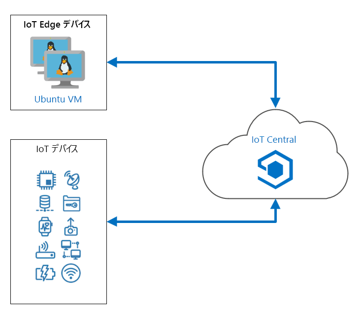

---
lab:
    title: 'ラボ 20: 最初の Azure IoT Central アプリを作成する'
    module: 'モジュール 12: IoT Central で構築'
---

# 最初の Azure IoT Central アプリを作成する

Azure IoT サービスとテクノロジは優れた機能を備えており、チームにメンバーがいる場合は管理が簡単ですが、完全な IoT ソリューション アーキテクチャがあれば、小規模で専門性の低いチームでも実装およびサポートすることができます。Azure IoT Central は、Azure IoT Hub、Azure Device Provisioning System (DPS)、Azure Maps、Azure Time Series Insights、Azure IoT Edge など、基盤となる IoT テクノロジの幅広い範囲を網羅する SaaS アプリケ―ションです。IoT Central では、これらのテクノロジを直接実装するときに得られるレベルの細分性は提供されませんが、小規模なチームは一連のリモート デバイスを簡単に管理および監視できるようになります。

特に、このラボは、IoT Central が特定のシナリオをサポートする適切なツールである場合を判断するのに役立ちます。それでは、IoT Central で何ができるかを調べていきましょう。

## ラボ シナリオ

Contoso は、都市とその周辺地域でチーズの配送に使用する冷凍トラックのフリートを運営しています。この地域に多数の顧客を抱えており、市内の集中化された場所を使用してフリートを運用しています。毎日、トラックには製品が積み込まれ、ドライバーはディスパッチャーから配送ルートを与えられます。システムはうまく機能し、めったに問題は起きません。しかし、トラックの冷却システムに障害が発生した場合、ドライバーとディスパッチャーは最善の配達方法を話し合う必要があります。ディスパッチャーは、製品を倉庫に戻して検査するか、車両の現在地に近い顧客の場所に配送します。トラックに残っている未出荷の製品の量と、冷蔵エリアの温度は、どちらも決定の要因です。

情報に基づいて決定するために、ドライバーとディスパッチャーは、トラックと運搬している製品に関する最新の情報を必要とします。ドライバーとディスパッチャーは、地図上の各トラックの位置、トラックの冷却システムの状態、およびトラックの貨物の状態を知る必要があります。

IoT Central には、このシナリオを処理するために必要なあらゆるものが用意されています。

次のリソースが作成されます。



## このラボでは

このラボでは、次のタスクを正常に達成します。

* IoT Central ポータルを使用して、Azure IoT Central カスタム アプリを作成する
* IoT Central ポータルを使用して、カスタム デバイス用にデバイス テンプレートを作成する
* Visual Studio Code または Visual Studio を使用して、Azure Maps によって選択されたルートで冷凍ラックをシミュレートするプログラミング プロジェクトを作成する
* IoT Central ダッシュボードから、シミュレートされたデバイスの監視と指示を行う

## ラボの手順

### 演習 1: Azure IoT Central を作成して構成する

#### タスク 1: 最初の IoT Central アプリを作成する

1. [Azure IoT Central](https://apps.azureiotcentral.com/?azure-portal=true) に移動します。

    この URL は、すべての IoT Central アプリのホーム ページとしてブックマークしておくことをお勧めします。

1. 少し下にスクロールして、このホームページの内容を読んでください。

1. 左側のナビゲーション メニューで、「**ビルド**」 をクリックします。

    特定のシナリオに、より高度な開始点を提供するいくつかのオプションがあることに注意してください。

1. 「**機能**」 の 「**カスタム アプリ**」 をクリックします。

1. 「**新しいアプリケーション**」 ページの 「**アプリケーション名**」 に、「**Refrigerated-Trucks-{your-id}**」と入力します。

    入力したアプリケーション名がアプリケーション URL のルートとして使用されていることに注意してください (小文字に変換されます)。

    アプリケーション名は任意のフレンドリ名にすることができますが、**URL** は一意である_必要があります_。2 つを完全に一致させる必要はありませんが、一致させると混乱が少なくなります。

    アプリケーション名に `{your-id}` を追加すると、URL が一意になります。

1. 「**アプリケーション テンプレート**」 は、デフォルトの 「**カスタム アプリケーション**」 の値のままにします。

1. 「**請求情報**」 のフィールドを確認してください。

    「**ディレクトリ**」 フィールドは、Azure Active Directory テナントを指定するために使用されます。組織で AAD テナントを使用する場合は、ここで指定します。このコースでは、デフォルトのままにします。

    コストを含む価格設定オプションを選択する場合は、Azure サブスクリプションを指定する必要があります。

1. 「**価格プラン**」 の 「**Free**」 をクリックします。

    無料オプションでは 7 日間の試用版が提供され、5 つの無料デバイスが含まれていることに注意してください。代わりに、「**請求情報**」 セクションが 「**連絡先情報**」 に更新されました。

1. 「**連絡先情報**」 で、各必須フィールドに連絡先情報を入力します。

    > **注**: プランに関するコミットメントまたは解約料はありません。IoT Central の価格について詳しく知りたい場合は、「**ビルド**」 ページに 「[価格の詳細を取得する](https://aka.ms/iotcentral-pricing-jpn)」 へのリンクが含まれています。

1. ページの下部で、「**作成**」 をクリックします。

    アプリ リソースが構築されるまで数秒待つと、デフォルトのリンクがいくつかある**ダッシュボード**が表示されます。

1. Azure IoT Central ブラウザーのタブを閉じます。

    次回、Azure IoT Central ホーム ページを開いたときに、左側のナビゲーション メニューから 「**マイ アプリ**」 を選択すると、**Refrigerated-Trucks-{your-id}** アプリが一覧表示されます。

1. ブラウザーを使用して [Azure IoT Central](https://apps.azureiotcentral.com/?azure-portal=true) を開きます。

1. 左側のナビゲーション メニューで、「**マイ アプリ**」 をクリックし、「**Refrigerated-Trucks-{your-id}**」 をクリックします。

    次の手順では、_デバイス テンプレート_を指定します。

#### タスク 2: デバイス テンプレートの作成

リモート デバイスと IoT Central の間で通信されるデータは、_デバイス テンプレート_で指定されます。デバイス テンプレートでは、データに関するすべての詳細がカプセル化されます。これにより、デバイスと IoT Central の両方で通信を解釈するために必要なすべての情報が得られます。

1. Azure IoT Central アプリの 「**ダッシュボード**」 ページで、左側のナビゲーション メニューの 「**アプリの設定**」 の下にある 「**デバイス テンプレート**」 をクリックします。

1. 「**デバイス テンプレート**」 で、「**+ 新規**」 をクリックします。

    カスタム デバイス テンプレートおよび構成済みのデバイス テンプレートのオプションの範囲が表示されます。

    > **ヒント**: 構成済みのオプションをメモします。関連するハードウェアがある場合は、これらの構成済みのデバイス テンプレートのいずれかを将来のプロジェクトに使用できます。

1. 「**カスタム デバイス テンプレートの作成**」 で、「**IoT デバイス**」 をクリックします。

1. ページの下部で、「**次へ:**」 をクリックします**カスタマイズ**

1. 「**デバイス テンプレート名の入力**」 テキストボックスに「**RefrigeratedTruck**」と入力し、「**Enter**」 を押します。

    > **注**: **ゲートウェイ デバイス**を選択しないでください。

1. ページの下部で、「**次へ: レビュー**」 をクリックします。

    表示されている**基本情報**を確認します。

1. 「**レビュー**」 ページの下部で、「**作成**」 をクリックします。

    テンプレートが作成されると、**RefrigeratedTruck** ページが表示されます。

1. 「**RefrigeratedTruck**」 ページの 「**能力モデルの作成**」 で、「**カスタム**」 をクリックします。

    これで、デバイス テンプレートの詳細を追加する準備ができました。

#### タスク 3: センサー テレメトリの追加

テレメトリは、センサーによって送信されるデータ値です。この冷凍トラックで最も重要なセンサーは、コンテンツの気温を監視します。

1. 「**RefrigeratedTruck** デバイス テンプレート」 ページで、「**+ インターフェイスの追加**」 をクリックし、「**カスタム**」 をクリックします。

    インターフェイスは、一連の_機能_を定義します。冷凍トラックの機能を定義するには、かなりの数のインターフェイスを追加します。

    カスタム インターフェイスを使用すると、空のインターフェイスから構築を開始できます。

1. 「**機能**」 で、「**+ 機能の追加**」 をクリックします

1. 少し時間をとって、使用可能なフィールドのタイプについて説明します。

1. トラックの温度センサーの機能を定義するには、次のフィールド値を入力します。

    | フィールド | 値 |
    | --- | --- |
    | 表示名 | 荷物の温度 |
    | 名前 | ContentsTemperature |
    | 機能の種類 | テレメトリ |
    | セマンティックの種類 | 温度 |
    | スキーマ | Double |
    | 単位 | <sup>o</sup>C |

1. 入力した情報を再確認してください。

    > **重要**:
    > このラボの後半で追加するコードでは、上記の名前を使用します。したがって、インターフェイスに入力する名前は、表示のように_正確に_入力する必要があります。

#### タスク 4: 状態とイベントのテレメトリを追加する

状態は、それによってオペレーターは何が起こっているかを知ることができるため、重要です。IoT Central の状態は、さまざまな値に関連付けられた名前です。このラボの後半では、各状態値に関連付ける色を選択し、識別しやすくします。

1. 「**機能**」 で、「**+ 機能の追加**」 をクリックします。

1. トラックの貨物状態の機能を定義するには、次のフィールド値を入力します。

    | フィールド | 値 |
    | --- | --- |
    | 表示名 | 荷物の状態 |
    | 名前 | ContentsState |
    | 機能の種類 | テレメトリ |
    | セマンティックの種類 | 都道府県 |
    | 値スキーマ | 文字列 |

1. 「**値スキーマ**」 の下で、「**複合型を定義する必要があります**」 というメッセージが表示されます。

    ラボのシナリオを簡略化するために、トラックの貨物状態を_空_、_満杯_、または_溶融_のいずれかとして定義します。

1. 「**複合型を定義する必要があります**」 というメッセージの下で、「**+**」 をクリックします。

1. 「**表示名**」 の下に、**空の値**を入力します

    「**名前**」 フィールドには、自動的に**空の値**が入力されます。

1. 「**値**」 に「**空**」を入力します

    3 つのフィールドはすべて**空**になります。

1. 入力したフィールドのすぐ下にある 「**+**」 をクリックします。

1. 上記のようなやり方で、もう 2 つの状態値**満杯**と**融解**を追加します。

    ここでも、追加した各状態値のオプションについて、「**表示名**」 、「**名前**」 、「**値**」 の各フィールドに同じテキストが表示されます。

1. 各機能を慎重に確認してから、次に進んでください。

    ここで、シミュレーションに不確実性を加えるために、トラックの冷却システムの故障状態を追加してみましょう。冷却システムに障害が発生した場合、このラボで後述するとおり、搭載物が「融解」する可能性が大幅に高まります。トラックの冷却システムに対して _オン_、 _オフ_、 _故障_ のエントリを追加します。

1. 「**冷蔵トラック**」 デバイス テンプレート ページの 「**機能**」 で、「**+ 機能の追加**」 をクリックします。

1. トラックの冷却システムの状態を扱う機能を定義するために、次のフィールド値を入力します。

    | フィールド | 値 |
    | --- | --- |
    | 表示名 | 冷却システムの状態 |
    | 名前 | CoolingSystemState |
    | 機能の種類 | テレメトリ |
    | セマンティックの種類 | 都道府県 |
    | 値スキーマ | 文字列 |

1. 「**複合型で定義する必要があります**」 というメッセージ の下の 「**+**」 をクリックして、次の状態値のオプションを上記と同じやり方で追加します。

    * on
    * オフ
    * 失敗

    「**表示名**」、「**名前**」、「**値**」 の 3 つすべてのフィールドで、3 つの状態値オプション (オン、オフ、失敗) が繰り返されていることを確認します。

    トラック自体には、さらに複雑な状態を定義する必要があります。トラックの標準的なルーティングは、すべてが順調であれば次のようになるでしょう。 _待機中_、 _運送中_、 _配達中_、 _帰還中_、 _積載中_、そして _待機中_ に戻ります。いっぽう、溶けた積み荷を倉庫に持ち帰って検査する (そして廃棄するかもしれない) 場合に対応するために、 _荷下ろし中_ の状態も含めるでしょう。

1. 前述した状態の機能を定義したのと同じやり方で、新しい機能を次のように作成します。

    | フィールド | 値 |
    | --- | --- |
    | 表示名 | トラックの状態 |
    | 名前 | TruckState |
    | 機能の種類 | テレメトリ |
    | セマンティックの種類 | 都道府県 |
    | 値スキーマ | 文字列 |

    状態値のオプションには、以下を使用します。

    * ready
    * 配送中
    * 配達中
    * 結果を返して
    * 積載中
    * 荷下ろし中

    指定する必要がある次の機能タイプは、イベントです。イベントは、デバイスによってトリガーされ、IoT Central アプリに伝達される問題です。イベントは、次の 3 種類のいずれかにできます。_エラー_、 _警告_、 _情報_。

1. イベント機能を作成するために、「**+ 機能の追加**」 をクリックして新しい機能を次のように設定します。

    | フィールド | 値 |
    | --- | --- |
    | 表示名 | イベント |
    | 名前 | イベント |
    | 機能の種類 | テレメトリ |
    | セマンティックの種類 | イベント |
    | スキーマ | 文字列 |

    デバイスがトリガーする可能性のあるイベントの 1 つに、競合コマンドがあります。たとえば、トラックが顧客の所から空で帰ってきたのに、その荷物を別の顧客に配送する指令を受け取る場合です。競合が発生した場合、デバイスでイベントをトリガーして、IoT Central アプリのオペレーターに警告することをお勧めします。

    トラックの配送先となる顧客 ID を確認し、記録するだけという別のイベントも考えられます。

#### タスク 5: 位置情報テレメトリの追加

位置情報はおそらく最も重要ですが、デバイス テンプレートに最も簡単に追加できる測定値の 1 つです。内部的には、デバイスの緯度、経度、およびオプションの高度で構成されます。

1. 位置情報の機能を作成するために、「**+ 機能の追加**」 をクリックして新しい機能を次のように設定します。

    | フィールド | 値 |
    | --- | --- |
    | 表示名 | 場所 |
    | 名前 | 場所 |
    | 機能の種類 | テレメトリ |
    | セマンティックの種類 | 場所 |
    | スキーマ | Geopoint |

#### タスク 6: プロパティの追加

デバイスのプロパティは、通常は定数値で、通信が最初に開始されたときに IoT Central アプリに伝達されます。冷蔵トラックのシナリオでは、トラックのナンバー プレートのように、トラックに固有の ID がプロパティの良い例です。

プロパティは、デバイスの構成データにも使用できます。トラックの積み荷の _最適温度_ をプロパティとして定義することもできるでしょう。この適温は、さまざまな種類の荷物、さまざまな気象条件、または他の妥当な条件によって変化する可能性があります。設定には初期の既定値が設定されていて、変更する必要はありませんが、必要に応じて、簡単かつ迅速に変更することができます。このようなプロパティを _書き込み可能なプロパティ_ と呼びます。

プロパティは単一の値です。より複雑なデータ セットをデバイスに送信する必要がある場合は、コマンド (下記参照) の方がそれを処理する方法として適しています。

1. トラック ID のプロパティ機能を作成するには、「**+ 機能の追加**」 をクリックして新しい機能を次のように設定します。

    | フィールド | 値 |
    | --- | --- |
    | 表示名 | トラック ID |
    | 名前 | TruckID |
    | 機能の種類 | プロパティ |
    | セマンティックの種類 | なし |
    | スキーマ | 文字列 |
    | 書き込み可能 | オフ |
    | 単位 | なし |

1. 最適温度のプロパティ機能を作成するには、「**+ 機能の追加**」 をクリックして新しい機能を次のように設定します。

    | フィールド | 値 |
    | --- | --- |
    | 表示名 | 最適温度 |
    | 名前 | OptimalTemperature |
    | 機能の種類 | プロパティ |
    | セマンティックの種類 | なし |
    | スキーマ | Double |
    | 書き込み可能 | On |
    | 単位 |  <sup>o</sup>C  |

#### タスク 7: コマンドの追加

コマンドは、IoT Central アプリのオペレーターによってリモート デバイスに送信されます。コマンドは書き込み可能なプロパティに似ていますが、1 つのコマンドには任意の数の入力フィールドを含めることができるのに対し、書き込み可能なプロパティは 1 つの値に制限されています。

冷凍トラックの場合、次の 2 つのコマンドを追加する必要があります。荷物を顧客に配送するコマンドとトラックをベースに呼び戻すコマンドです。

1. 荷物を顧客に配送するコマンド機能を作成するには、「**+ 機能の追加**」 をクリックし、新しい機能を次のように作成します。

    | フィールド | 値 |
    | --- | --- |
    | 表示名 | 顧客への配送 |
    | 名前 | GoToCustomer |
    | 機能の種類 | コマンド |
    | コマンド | 同期 |

1. 「**コマンド**」 で、「**要求**」 をクリックします。

    「**要求**」 オプションをオンにすると、コマンドの詳細を入力できるようになります。

1. コマンド機能の 「**要求**」 部分を完了するには、次のようにフィールド値を入力します。

    | フィールド | 値 |
    | --- | --- |
    | 要求 | On |
    | 表示名 | 顧客 ID |
    | 名前 | 顧客 ID |
    | スキーマ | Integer |
    | 単位 | なし |

1. トラックを呼び戻すコマンド機能を作成するには、「**+ 機能の追加**」 をクリックし、新しい機能を次のように作成します。

    | フィールド | 値 |
    | --- | --- |
    | 表示名 | 取り消し |
    | 名前 | 取り消し |
    | 機能の種類 | コマンド |
    | コマンド | 同期 |

    このコマンドには追加のパラメーターがないため、「**要求**」 をオフのままにします。

1. ページの上部にある 「**保存**」 をクリックします。

    先に進む前に、さらに慎重にインターフェイスを確認してください。インターフェイスを発行した後では、編集オプションが非常に限られてしまいます。発行前に間違いがないようにしておくことが重要です。

    デバイス テンプレートの名前をクリックすると、「**表示**」 オプションで終了するメニューに、機能の概要が表示されます。

#### タスク 8: テンプレートを発行する

1. 前回保存してから変更を行った場合は、「**保存**」 をクリックします。

1. **RefrigeratedTruck** デバイス テンプレートの右上にある 「**公開**」 をクリックします。

    > **注**: 確認を求めるポップアップ ダイアログが表示されたら、「**公開**」 をクリックします。

    コメントが 「**下書き**」 から 「**公開済み**」 に変わるのがわかります。

デバイス テンプレートの準備には、少しの注意と少しの時間が必要です。

次の演習では、デバイス テンプレートの機能を使用して、コントローラー ダッシュボードを準備します。ビューの準備は、デバイス テンプレートの発行前でも発行後でも行うことができます。

### 演習 3: シミュレートされたデバイスを監視する

この演習を開始するには、デバイス テンプレートのすべての機能を示すダッシュボードを作成します。その後、デバイス テンプレートを使用してデバイスを作成し、リモート デバイス アプリに必要な接続設定を記録します。

#### タスク 1: 豊富なダッシュボードを作成する

1. **RefrigeratedTruck** デバイス テンプレートの左側のメニューで、「**ビュー**」 をクリックし、「**デバイスの視覚化**」 をクリックします。

1. 少し時間をとって、利用できる**テレメトリ**、**プロパティ**、および**コマンド**の一覧を確認してください。

    これらは作成した機能であり、それぞれに選択チェックボックスがあります。

1. 「**テレメトリ**」 で、「**場所**」 をクリックし、「**タイルの追加**」 をクリックします。

    ダッシュボードはタイルを使用して構成され、選択したタイルを配置したりサイズ変更したりできます。「場所」 タイルは世界地図上のトラックの場所を示し、これを最初に作成することで、地図のサイズを変更するための十分なスペースができます。

1. タイルの右下隅にマウス ポインターを置き、タイルの高さと幅が既定サイズの約 2 倍になるように、コーナーをドラッグします。

1. 「**ビュー名**」 に「**トラック ビュー**」と入力します。

1. 「**テレメトリ**」 で、「**荷物の状態**」 をクリックし、「**タイルの追加**」 をクリックします。

1. 残りのテレメトリ機能ごとに前の手順を繰り返し、上から順に作業します。

    「場所」 タイルが既に追加されていることを思い出してください。

1. 同じトップダウン プロセスを使用して、プロパティ機能を追加します。

    ラボの後半で、ダッシュボードにタイルを配置する機会があります。ここでは、リモート デバイスから送信されるすべてのテレメトリを確認するダッシュボードが必要です。

    ダッシュボードにコマンドを追加するオプションがありますが、追加する必要はありません。

1. ダッシュボードを確認してください。

    スクロールしてダッシュボードを表示します。タイルの内容を調べ、その情報をどのように使用するかを検討します。

1. タイルの位置を素早く配置します。

    今、これにあまり時間を費やさず、タイルをドラッグすることができ、ポータルでタイルがきれいに並べ替えられることに注意してください。

1. 「**保存**」 をクリックしてから、「**発行**」 をクリックします。

    発行ダイアログで、「**ビュー**」 の横に **「はい」** と表示されることに注意してください。

1. 発行ダイアログで、「**発行**」 をクリックします。

ビューは必要な数だけ作成でき、それぞれにフレンドリ名を付けることができます。

次のタスクでは、デバイス テンプレートからデバイスを作成します。

#### タスク 2: 実際のデバイスを作成する

IoT Central は、実際のセンサーを使用して物理デバイスに接続したり、アルゴリズムに基づいてデータを生成するシミュレートされたデバイスに接続したりできます。どちらの場合も、IoT Central はリモート アプリがテレメトリ データを生成していることを理解し、どちらの方法でも、接続されたデバイスを「実際の」 デバイスとして扱います。

1. 左側のナビゲーション メニューで、「**デバイス**」 をクリックします。

1. 「**デバイス**」 メニューの **「すべてのデバイス**」 で、「**冷蔵トラック**」 をクリックします。

    画面が更新され、選択したデバイス テンプレートが太字で表示されることに注意してください。デバイス テンプレートが多数ある場合は、正しいデバイス テンプレートを使用していることを確認するのに役立ちます。

1. トップ メニューで 「**+ 新規**」 をクリックします。

1. 「**新しいデバイスの作成**」 ダイアログの 「**デバイス名**」 で、**冷蔵トラック**がプレフィックスとして一覧表示されていることを確認します。

    これは、適切なデバイス テンプレートを選択したことを確認するもう 1 つの機会です。

1. 「**デバイス ID**」 に、「**冷蔵トラック1**」と入力します。

1. 「**デバイス名**」 に「**冷蔵トラック - 1**」と入力します。

1. 「**シミュレート**」 で、「**オフ**」 が選択されていることを確認します。

    IoT Central では、物理デバイスとシミュレートされたデバイスへの接続が同じ方法で処理されることを思い出してください。どちらもリモート アプリで、どちらも本物です。あなたはここで本物のトラックを構築します。そう、シミュレートされた _本物の_ トラックです!

    このシミュレート値を**オン**に設定すると、テレメトリのランダム値を入力するように IoT Central に指示されます。これらのランダム値は、デバイス テンプレートを検証する際に役立ちますが、このラボでは、シミュレートされたデバイス (トラック) を使用してテレメトリをシミュレートします。

1. 「**新しいデバイスの作成**」 ダイアログ で、「**作成**」 をクリックします。

    数秒待つと、デバイス リストに 1 つのエントリが表示されます。

    「**デバイスの状態**」 が **登録済み**に設定されていることを確認します。IoT Central アプリは、**デバイスの状態**が**プロビジョニング済み**の場合にのみ、デバイスへの接続を受け入れます。このラボの後半では、デバイスをプロビジョニングする方法を示すコーディング タスクがあります。

1. 「**デバイス名**」 の 「**冷蔵トラック - 1**」 をクリックします。

    ライブ ダッシュボードが表示されます (多数の **データを待機中** メッセージも表示されます)。

1. デバイス ダッシュボードのタイトル 「**冷蔵トラック - 1**」 の下にある 「**コマンド**」 をクリックします。

    入力した 2 つのコマンドがすでにリストアップされていて、実行できる状態にあることを確認できます。

次の手順では、リモート デバイスが IoT Central アプリと通信できるようにするキーを作成します。

#### タスク 3: 接続キーを記録する

1. 右上のメニューで 「**接続**」 をクリックします。

    「**ゲートウェイにアタッチ**」 はクリック_しない_でください。

1. 「**デバイス接続**」 ダイアログで、「**ID スコープ**」、「**デバイス ID**」、「**主キー**」 の値を気を付けてコピーし、**トラック接続.txt** という名前のテキスト ファイルに保存します。

    メモ帳 (または別のテキスト エディター) を使用してこれらの値をテキスト ファイルに保存し、トラック接続.txt などのわかりやすい名前を付けます。

1. 「**接続方法**」 で、「**共有アクセス署名 (SAS)**」 が選択されていることを確認します。

1. ダイアログの最下部で、「**閉じる**」 をクリックします。

ブラウザーで IoT ポータルを開いたままで待ちます。

### 演習 4: 無料の Azure Maps アカウントを作成する

Azure Maps アカウントをまだ持っていない場合は、作成する必要があります。

1. 新しいブラウザー タブを開き、[Azure Maps](https://azure.microsoft.com/services/azure-maps/?azure-portal=true) に移動します。

1. 無料アカウントを作成するには、右上の 「**無料で開始**」 をクリックし、表示される指示に従います。

    > **注**: このコースで用いたサブスクリプションとリソース グループを使用して Azure Maps アカウントを作成し、アカウントの名前には AZ-220-MAPS を、価格レベルには Standard S1 を使用できます。

1. Azure Maps アカウントを作成したら、Azure Maps アカウントのサブスクリプション キー (主キー) を Truck-connections.txt テキスト ファイルにコピーします。

    このコースで使用している Azure Subscription を使用して Azure Maps アカウントを作成した場合、次のように Azure portal でアカウントの主キーを確認できます。Azure Maps (AZ-220-MAPS) ブレードを開き、「認証」 ウィンドウを開きます。主キーが一覧で表示されます。

    > **注**: 主キー (Azure Maps 用) が正しい / 機能していることを確認する場合。次の HTML を .html ファイルに保存します。`'<your Azure Maps subscription key>'` プレースホルダーを主キーの値に置き換え、ファイルを Web ブラウザーに読み込みます。表示された世界地図を確認できます。

    ```html
    <!DOCTYPE html>
    <html>

    <head>
        <title>Map</title>
        <meta charset="utf-8">
        <meta name="viewport" content="width=device-width, initial-scale=1, shrink-to-fit=no">

        <!-- Azure Maps マップ コントロールの JavaScript と CSS ファイルへの参照を追加します。-->
        <link rel="stylesheet" href="https://atlas.microsoft.com/sdk/javascript/mapcontrol/2/atlas.min.css" type="text/css">
        <script src="https://atlas.microsoft.com/sdk/javascript/mapcontrol/2/atlas.min.js"></script>

        <!-- リファレンスを Azure Maps サービスラボ JavaScript ファイルに追加します。-->
        <script src="https://atlas.microsoft.com/sdk/javascript/mapcontrol/2/atlas-service.min.js"></script>

        <script>
            function GetMap() {
                // マップ オブジェクトのインスタンス化
                var map = new atlas.Map("myMap", {
                    // Azure Maps サブスクリプション キーをマップ SDK に追加します。https://azure.com/maps で Azure Maps キーを取得する
                    authOptions: {
                        authType: 'subscriptionKey',
                        subscriptionKey: '<your Azure Maps subscription key>'
                    }
                });
            }
        </script>
        <style>
            html,
            body {
                width: 100%;
                height: 100%;
                padding: 0;
                margin: 0;
            }

            #myMap {
                width: 100%;
                height: 100%;
            }
        </style>
    </head>

    <body onload="GetMap()">
        <div id="myMap"></div>
    </body>

    </html>
    ```

これで、最初の IoT Central アプリを実際のデバイスに接続するための準備手順が完了しました。お疲れさまでした。

次の手順では、デバイス アプリを作成します。

### 演習 5: 実際のデバイスのプログラミング プロジェクトを作成する

このタスクでは、冷蔵トラックでセンサー デバイスをシミュレートするプログラミング プロジェクトを作成します。このシミュレーションにより、物理デバイスを必要とするかなり前にコードをテストできます。

デバイス アプリと IoT Central アプリの間の通信コードは物理デバイスとトラックの間の通信コードと同じであるため、IoT Central はこのシミュレーションを「リアル」 として扱います。つまり、冷凍トラックの会社を経営している場合、このタスクのコードと同様のシミュレートされたコードから始めることになります。コードが正常に動作することを確認した後、シミュレーション固有のコードは、センサー データを受信するコードに置き換えられます。この制限された更新により、次のコードを書くことが貴重な経験となります。

#### タスク 1: デバイス アプリを作成する

Visual Studio Code を使用して、デバイス センサー アプリをビルドします。

1. Visual Studio Code の新しいインスタンスを開きます。

1. 「**ファイル**」 メニューで、「**フォルダーを開く**」 をクリックします。

1. 「**フォルダを開く**」 ダイアログの上部にある 「**新規フォルダ**」 をクリックし、「**RefrigeratedTruck**」と入力して 「**Enter**」 を押します。

    このコースの ラボ 20 フォルダーの下、または別の場所に、RefrigeratedTruck フォルダーを作成できます。

1. 「**RefrigeratedTruck**」 をクリックし、「**フォルダの選択**」 をクリックします。

    Visual Studio Code Explorer ペインが開くはずです。

1. 「**表示**」 メニューで、統合ターミナルを開くには、「**ターミナル**」 をクリックします。

    ターミナル コマンド プロンプトに、冷蔵トラック フォルダが表示されているはずです。次のコマンドは現在のフォルダーで実行されるため、これは重要です。

1. ターミナル コマンド プロンプトで、新しいコンソール アプリを作成するには、次のコマンドを入力します。

    ```cmd/sh
    dotnet new console
    ```

    このコマンドにより、Program.cs ファイルがプロジェクト ファイルと共にフォルダー内に作成されます。

1. ターミナル コマンド プロンプトで、プリが、必要な .NET パッケージにアクセスできることを確認するには、次のコマンドを入力します。

    ```cmd/sh
    dotnet restore
    ```

1. ターミナル コマンド プロンプトで、必要なライブラリをインストールするには、次のコマンドを入力します。

    ```CLI
    dotnet add package AzureMapsRestToolkit
    dotnet add package Microsoft.Azure.Devices.Client
    dotnet add package Microsoft.Azure.Devices.Provisioning.Client
    dotnet add package Microsoft.Azure.Devices.Provisioning.Transport.Mqtt
    dotnet add package System.Text.Json
    ```

1. **EXPLORER** ペインで、**Program.cs** をクリックします。

1. 「コード エディター」 ペインで、Program.cs ファイルの内容を削除します。

これで、次のコードを追加する準備が整いました。

#### タスク 2: デバイス アプリを作成する

このタスクでは、冷凍トラック用のシミュレートされたデバイス アプリを一度に 1 セクションずつ構築します。各セクションについて簡単に説明します。

このプロセスをできるだけ簡単にするには、ここにリストされている順序で、コードの各セクションをファイルの末尾に追加する必要があります。

> **注**:
>  このタスクをスキップし、すべてのコードをアプリに読み込む場合は、Program.cs のすべてのコンテンツをダウンロードしてプロジェクトの Program.cs ファイルにコピーします。このコードをコピーして (接続文字列とサブスクリプション文字列を置き換える) 場合は、次のタスクに直接進み、テストを開始してください。このコースのラボ 3 にあたる「開発環境のセットアップ」では、ZIP ファイルをダウンロードしてコンテンツをローカルに抽出することで、ラボ リソースを含む GitHub リポジトリを複製しました。抽出されたフォルダー構造には、次のフォルダー パスが含まれます。

    * すべてのファイル
      * ラボ
          * 20-Build with IoT Central
            * 最終工程

1. コード エディター ペインで、必要な `using` ステートメントを追加するには、次のコードを入力します。

   ```cs
    using System;
    using System.Text.Json;
    using System.Text;
    using System.Threading;
    using System.Threading.Tasks;
    using Microsoft.Azure.Devices.Client;
    using Microsoft.Azure.Devices.Shared;
    using Microsoft.Azure.Devices.Provisioning.Client;
    using Microsoft.Azure.Devices.Provisioning.Client.Transport;
    using AzureMapsToolkit;
    using AzureMapsToolkit.Common;
    ```

    これらの `using` ステートメントで、Azure IoT Central や Azure Maps などの、コードが使用するリソースに簡単にアクセスできるようになります。

1. コード エディター ペインで、名前空間、クラス、およびグローバル変数を追加するには、次のコードを入力します。

   ```cs
    namespace refrigerated_truck
    {
        class Program
        {
            enum StateEnum
            {
                ready,
                enroute,
                delivering,
                returning,
                loading,
                dumping
            };
            enum ContentsEnum
            {
                full,
                melting,
                empty
            }
            enum FanEnum
            {
                on,
                off,
                failed
            }

            // Azure maps service globals.
            static AzureMapsServices azureMapsServices;

            // Telemetry globals.
            const int intervalInMilliseconds = 5000;        // Time interval required by wait function.

            // Refrigerated truck globals.
            static int truckNum = 1;
            static string truckIdentification = "Truck number " + truckNum;

            const double deliverTime = 600;                 // 出荷を完了する時間、単位秒。
            const double loadingTime = 800;                 // 荷物を積み込む時間。
            const double dumpingTime = 400;                 // 溶けた内容物を廃棄する時間。
            const double tooWarmThreshold = 2;              // 内容物にとって熱すぎる温度、摂氏。
            const double tooWarmtooLong = 60;               // 温度が超過した場合に内容物が溶け始めるまでの時間、単位秒。


            static double timeOnCurrentTask = 0;            // 現在のタスクの時間、単位秒。
            static double interval = 60;                    // シミュレーションされた時間サイクル間隔、単位秒。
            static double tooWarmPeriod = 0;                // 内容物が熱すぎた時間、単位秒。
            static double tempContents = -2;                // 内容物の現在温度、摂氏。
            static double baseLat = 47.644702;              // 基本位置の緯度。
            static double baseLon = -122.130137;            // 基本位置の経度。
            static double currentLat;                       // 現在位置の緯度。
            static double currentLon;                       // 現在位置の経度。
            static double destinationLat;                   // 目的地の緯度
            static double destinationLon;                   // 目的地の経度

            static FanEnum fan = FanEnum.on;                // 冷却ファンの状態
            static ContentsEnum contents = ContentsEnum.full;    // トラック内容の状態
            static StateEnum state = StateEnum.ready;       // トラックは満杯で出発準備完了
            static double optimalTemperature = -5;         // 設定 - IoT Central からオペレーターが変更可能.

            const string noEvent = "none";
            static string eventText = noEvent;              // IoT Central に送信されるイベント テキスト

            static double[,] customer = new double[,]
            {
                // 顧客の緯度/経度位置
                // ガスワークス パーク
                {47.645892, -122.336954},

                // ゴールデン ガーデンズ パーク
                {47.688741, -122.402965},

                // スワード パーク
                {47.551093, -122.249266},

                // レイク サマーミッシュ パーク
                {47.555698, -122.065996},

                // メリームーア パーク
                {47.663747, -122.120879},

                // メドーデール ビーチ パーク
                {47.857295, -122.316355},

                // リンカーン パーク
                {47.530250, -122.393055},

                // ジーン クーロン パーク
                {47.503266, -122.200194},

                // ルーサー バンク パーク
                {47.591094, -122.226833},

                // パイオニア パーク
                {47.544120, -122.221673 }
            };

            static double[,] path;                          // ルートの緯度/経度ステップ
            static double[] timeOnPath;                     // ルートの各セクションの時間 （秒単位）
            static int truckOnSection;                      // トラックがいる現在のパス セクション
            static double truckSectionsCompletedTime;       // 前に完了したセクションでトラックが費やした時間
            static Random rand;

            // IoT Central のグローバル変数
            static DeviceClient s_deviceClient;
            static CancellationTokenSource cts;
            static string GlobalDeviceEndpoint = "global.azure-devices-provisioning.net";
            static TwinCollection reportedProperties = new TwinCollection();

            // ユーザー ID
            static string ScopeID = "<your Scope ID>";
            static string DeviceID = "<your Device ID>";
            static string PrimaryKey = "<your device Primary Key>";
            static string AzureMapsKey = "<your Azure Maps Subscription Key>";
    ```

    追加するコードは他にもありますが、入力したプレースホルダー値を置き換えるタイミングです。これらはすべて、ラボ中に追加したテキスト ファイルで使用できる必要があります。

1. 以前に保存した冷蔵トラック1 および Azure Maps アカウント情報を含むテキスト ファイルを開きます。

1. 「コード エディター」 ペインで、プレースホルダーの値をテキスト ファイルからの対応する値に置き換えます。

    これらの値をコードで更新すると、アプリのビルドに戻ることができます。

1. 「コード エディター」 ペインで、Azure Maps 経由でルートを取得するために使用するメソッドを追加するには、次のコードを入力します。

   ```cs
            static double Degrees2Radians(double deg)
            {
                return deg * Math.PI / 180;
            }

            // 地球上の 2 つの位置の間の距離をメートル単位で返します。
            static double DistanceInMeters(double lat1, double lon1, double lat2, double lon2)
            {
                var dlon = Degrees2Radians(lon2 - lon1);
                var dlat = Degrees2Radians(lat2 - lat1);

                var a = (Math.Sin(dlat / 2) * Math.Sin(dlat / 2)) + Math.Cos(Degrees2Radians(lat1)) * Math.Cos(Degrees2Radians(lat2)) * (Math.Sin(dlon / 2) * Math.Sin(dlon / 2));
                var angle = 2 * Math.Atan2(Math.Sqrt(a), Math.Sqrt(1 - a));
                var meters = angle * 6371000;
                return meters;
            }

            static bool Arrived()
            {
                // トラックが目的地から 10 メートル位内にあれば、呼び出しは良好です。
                if (DistanceInMeters(currentLat, currentLon, destinationLat, destinationLon) < 10)
                    return true;
                return false;
            }

            static void UpdatePosition()
            {
                while ((truckSectionsCompletedTime + timeOnPath[truckOnSection] < timeOnCurrentTask) && (truckOnSection < timeOnPath.Length - 1))
                {
                    // トラックは次のセクションに移動しました。
                    truckSectionsCompletedTime += timeOnPath[truckOnSection];
                    ++truckOnSection;
                }

                // 間隔が必要な数をカウントする可能性があるため、残りが 0 から 1 であることを確認します。
                var remainderFraction = Math.Min(1, (timeOnCurrentTask - truckSectionsCompletedTime) / timeOnPath[truckOnSection]);

                // パスは、timeOnPath 配列より 1 つ長いエントリ長である必要があります。
                // トラックがセクションからどれくらい移動したかを見つけます。
                currentLat = path[truckOnSection, 0] + remainderFraction * (path[truckOnSection + 1, 0] - path[truckOnSection, 0]);
                currentLon = path[truckOnSection, 1] + remainderFraction * (path[truckOnSection + 1, 1] - path[truckOnSection, 1]);
            }

            static void GetRoute(StateEnum newState)
            {
                // 新しいルートが到着するまで、状態を準備完了に設定します。
                state = StateEnum.ready;

                var req = new RouteRequestDirections
                {
                    Query = FormattableString.Invariant($"{currentLat},{currentLon}:{destinationLat},{destinationLon}")
                };
                var directions = azureMapsServices.GetRouteDirections(req).Result;

                if (directions.Error != null || directions.Result == null)
                {
                    // エラーを処理します。
                    redMessage("Failed to find map route");
                }
                else
                {
                    int nPoints = directions.Result.Routes[0].Legs[0].Points.Length;
                    greenMessage($"Route found. Number of points = {nPoints}");

                    // パスをクリアします。始点と終点に 2 点を追加します。
                    path = new double[nPoints + 2, 2];
                    int c = 0;

                    // 現在の場所から開始します。
                    path[c, 0] = currentLat;
                    path[c, 1] = currentLon;
                    ++c;

                    // ルートを取得し、配列にポイントをプッシュします。
                    for (var n = 0; n < nPoints; n++)
                    {
                        var x = directions.Result.Routes[0].Legs[0].Points[n].Latitude;
                        var y = directions.Result.Routes[0].Legs[0].Points[n].Longitude;
                        path[c, 0] = x;
                        path[c, 1] = y;
                        ++c;
                    }

                    // 目的地で終了します。
                    path[c, 0] = destinationLat;
                    path[c, 1] = destinationLon;

                    // 平均速度を計算するために、パスの長さと経過時間を格納します。
                    var meters = directions.Result.Routes[0].Summary.LengthInMeters;
                    var seconds = directions.Result.Routes[0].Summary.TravelTimeInSeconds;
                    var pathSpeed = meters / seconds;

                    double distanceApartInMeters;
                    double timeForOneSection;

                    // パス配列の時刻をクリアします。パス配列は、ポイント配列より 1 小さい値です。
                    timeOnPath = new double[nPoints + 1];

                    // パスの各セクションに必要な時間を計算します。
                    for (var t = 0; t < nPoints + 1; t++)
                    {
                        // 2 つのパス ポイント間の距離をメートル単位で計算します。
                        distanceApartInMeters = DistanceInMeters(path[t, 0], path[t, 1], path[t + 1, 0], path[t + 1, 1]);

                        // パスの各セクションの時間を計算します。
                        timeForOneSection = distanceApartInMeters / pathSpeed;
                        timeOnPath[t] = timeForOneSection;
                    }
                    truckOnSection = 0;
                    truckSectionsCompletedTime = 0;
                    timeOnCurrentTask = 0;

                    // ルートが到着した状態を更新します。いずれか 1 つ: 途上または戻り。
                    state = newState;
                }
            }
    ```

    > **注**:
    > 上記のコード内のキー呼び出しは、`var directions = azureMapsServices.GetRouteDirections(req).Result;` です。`directions` 構造は複雑です。このメソッドにブレークポイントを設定し、`directions` の内容を調べることを検討してください。

1. 「コード エディター」 ペインで、顧客に配信するダイレクト メソッドを追加するには、次のコードを入力します。

   ```cs
        static Task<MethodResponse> CmdGoToCustomer(MethodRequest methodRequest, object userContext)
        {
            try
            {
                // IoT Central で指定された名前で、要求ペイロードから変数を取得します。
                var payloadString = Encoding.UTF8.GetString(methodRequest.Data);
                int customerNumber = Int32.Parse(payloadString);

                // 有効なキーと顧客 ID を確認します。
                if (customerNumber >= 0 && customerNumber < customer.Length)
                {
                    switch (state)
                    {
                        case StateEnum.dumping:
                        case StateEnum.loading:
                        case StateEnum.delivering:
                            eventText = "Unable to act - " + state;
                            break;

                        case StateEnum.ready:
                        case StateEnum.enroute:
                        case StateEnum.returning:
                            if (contents == ContentsEnum.empty)
                            {
                                eventText = "Unable to act - empty";
                            }
                            else
                            {
                                // すべてが良好な場合にのみイベントを設定します。
                                eventText = "New customer: " + customerNumber.ToString();

                                destinationLat = customer[customerNumber, 0];
                                destinationLon = customer[customerNumber, 1];

                                // 現在の位置から目的地までのルートを検索し、ルートを格納します。
                                GetRoute(StateEnum.enroute);
                            }
                            break;
                    }

                    // 200 の成功メッセージで、ダイレクト メソッド 呼び出しを認識します。
                    string result = "{\"result\":\"Executed direct method: " + methodRequest.Name + "\"}";
                    return Task.FromResult(new MethodResponse(Encoding.UTF8.GetBytes(result), 200));
                }
                else
                {
                    eventText = $"Invalid customer: {customerNumber}";

                    // 400 の成功メッセージで、ダイレクト メソッド 呼び出しを認識します。
                    string result = "{\"result\":\"Invalid customer\"}";
                    return Task.FromResult(new MethodResponse(Encoding.UTF8.GetBytes(result), 400));
                }
            }
            catch
            {
                // 400 の成功メッセージで、ダイレクト メソッド 呼び出しを認識します。
                string result = "{\"result\":\"Invalid call\"}";
                return Task.FromResult(new MethodResponse(Encoding.UTF8.GetBytes(result), 400));
            }
        }
    ```

    > **注**:
    > デバイスが適切な状態ではない場合、デバイスは競合で応答します。コマンド自体は、メソッドの終了時に確認されます。次の手順に引き継がれる呼び戻しコマンドも、同様の方法で処理を行います。

1. コード エディター ペインで、呼び戻しダイレクト メソッドを追加するには、次のコードを入力します。

   ```cs
        static void ReturnToBase()
        {
            destinationLat = baseLat;
            destinationLon = baseLon;

            // 現在の位置から基地までのルートを検索して格納する。
            GetRoute(StateEnum.returning);
        }
        static Task<MethodResponse> CmdRecall(MethodRequest methodRequest, object userContext)
        {
            switch (state)
            {
                case StateEnum.ready:
                case StateEnum.loading:
                case StateEnum.dumping:
                    eventText = "Already at base";
                    break;

                case StateEnum.returning:
                    eventText = "Already returning";
                    break;

                case StateEnum.delivering:
                    eventText = "Unable to recall - " + state;
                    break;

                case StateEnum.enroute:
                    ReturnToBase();
                    break;
            }

            // コマンドに対して了解します。
            if (eventText == noEvent)
            {
                // 200 の成功メッセージで、ダイレクト メソッド 呼び出しを認識します。
                string result = "{\"result\":\"Executed direct method: " + methodRequest.Name + "\"}";
                return Task.FromResult(new MethodResponse(Encoding.UTF8.GetBytes(result), 200));
            }
            else
            {
                // 400 の成功メッセージで、ダイレクト メソッド 呼び出しを認識します。
                string result = "{\"result\":\"Invalid call\"}";
                return Task.FromResult(new MethodResponse(Encoding.UTF8.GetBytes(result), 400));
            }
        }
    ```

1. トラックのシミュレーションを各時間サイクルで更新するメソッドを追加するために、「コード エディタ」 ペインで次のコードを入力します。

   ```cs
        static double DieRoll(double max)
        {
            return rand.NextDouble() * max;
        }

        static void UpdateTruck()
        {
            if (contents == ContentsEnum.empty)
            {
                // 可能であれば、積み荷が空の場合は冷却システムの電源を切ります。
                if (fan == FanEnum.on)
                {
                    fan = FanEnum.off;
                }
                tempContents += -2.9 + DieRoll(6);
            }
            else
            {
                // 積み荷が満杯です。または融解しています。
                if (fan != FanEnum.failed)
                {
                    if (tempContents < optimalTemperature - 5)
                    {
                        // 積み荷が冷えすぎるので、冷却システムをオフにします。
                        fan = FanEnum.off;
                    }
                    else
                    {
                        if (tempContents > optimalTemperature)
                        {
                            // 温度が上がったので、冷却システムをもう一度オンにします。
                            fan = FanEnum.on;
                        }
                    }

                    // 冷却システムをランダムに故障させます。
                    if (DieRoll(100) < 1)
                    {
                        fan = FanEnum.failed;
                    }
                }

                // 積み荷の温度を設定します。冷却システムがオンの場合は、より涼しい温度を維持します。
                if (fan == FanEnum.on)
                {
                    tempContents += -3 + DieRoll(5);
                }
                else
                {
                    tempContents += -2.9 + DieRoll(6);
                }

                // 温度がしきい値より高い場合は、その状態の秒数を計測し、長すぎる場合は内容物を溶かします。
                if (tempContents >= tooWarmThreshold)
                {
                    // 積み荷が温かくなっています。
                    tooWarmPeriod += interval;

                    if (tooWarmPeriod >= tooWarmtooLong)
                    {
                        // 積み荷が溶けています。
                        contents = ContentsEnum.melting;
                    }
                }
                else
                {
                    // 積み荷が冷えています。
                    tooWarmPeriod = Math.Max(0, tooWarmPeriod - interval);
                }
            }

            timeOnCurrentTask += interval;

            switch (state)
            {
                case StateEnum.loading:
                    if (timeOnCurrentTask >= loadingTime)
                    {
                        // 積み込みが完了しました。
                        state = StateEnum.ready;
                        contents = ContentsEnum.full;
                        timeOnCurrentTask = 0;

                        // 冷却ファンの電源を入れます。
                        // ファンが障害状態の場合は、ファンは基地にあるので修理済みであるとします。
                        fan = FanEnum.on;
                        tempContents = -2;
                    }
                    break;

                case StateEnum.ready:
                    timeOnCurrentTask = 0;
                    break;

                case StateEnum.delivering:
                    if (timeOnCurrentTask >= deliverTime)
                    {
                        // 配達が完了しました。
                        contents = ContentsEnum.empty;
                        ReturnToBase();
                    }
                    break;

                case StateEnum.returning:

                    // トラックの位置情報を更新します。
                    UpdatePosition();

                    // トラックが基地に戻ってきたかどうかを確認します。
                    if (Arrived())
                    {
                        switch (contents)
                        {
                            case ContentsEnum.empty:
                                state = StateEnum.loading;
                                break;

                            case ContentsEnum.full:
                                state = StateEnum.ready;
                                break;

                            case ContentsEnum.melting:
                                state = StateEnum.dumping;
                                break;
                        }
                        timeOnCurrentTask = 0;
                    }
                    break;

                case StateEnum.enroute:

                    // トラックを移動します。
                    UpdatePosition();

                    // トラックが客先に到着したかどうかを確認します。
                    if (Arrived())
                    {
                        state = StateEnum.delivering;
                        timeOnCurrentTask = 0;
                    }
                    break;

                case StateEnum.dumping:
                    if (timeOnCurrentTask >= dumpingTime)
                    {
                        // 荷下ろしが終了しました。
                        state = StateEnum.loading;
                        contents = ContentsEnum.empty;
                        timeOnCurrentTask = 0;
                    }
                    break;
            }
        }
    ```

    > **注**:
    > この関数は、期間ごとに呼び出されます。実際のサイクル間隔は 5 秒に設定されていますが、 _シミュレーション間隔_ (この関数を呼び出すたびに経過したと想定する設定秒数) はグローバル変数 `static double interval = 60` で設定します。この値を 60 に設定すると、シミュレーションは、60 を 5 で割った速度、つまりリアルタイムの 12 倍の速度で実行されることを意味します。シミュレーション間隔を短くするには、`interval`" をたとえば 30 に減らします (実時間の 6 倍の速度でシミュレーションが実行されます)。`interval` を 5 に設定すると、リアルタイムでシミュレーションが実行されます。この速度は現実的ではありますが、配送先の顧客への実際の運転時間を考慮すると、少し遅いかもしれません。

1. トラックのテレメトリを送信する (もし発生していたらイベントも送信する) メソッドを追加するために、「コード エディター」 ペインで次のコードを入力します。

   ```cs
        static void colorMessage(string text, ConsoleColor clr)
        {
            Console.ForegroundColor = clr;
            Console.WriteLine(text);
            Console.ResetColor();
        }
        static void greenMessage(string text)
        {
            colorMessage(text, ConsoleColor.Green);
        }

        static void redMessage(string text)
        {
            colorMessage(text, ConsoleColor.Red);
        }

        static async void SendTruckTelemetryAsync(Random rand, CancellationToken token)
        {
            while (true)
            {
                UpdateTruck();

                // テレメトリの JSON メッセージを作成します。
                var telemetryDataPoint = new
                {
                    ContentsTemperature = Math.Round(tempContents, 2),
                    TruckState = state.ToString(),
                    CoolingSystemState = fan.ToString(),
                    ContentsState = contents.ToString(),
                    Location = new { lon = currentLon, lat = currentLat },
                    Event = eventText,
                };
                var telemetryMessageString = JsonSerializer.Serialize(telemetryDataPoint);
                var telemetryMessage = new Message(Encoding.ASCII.GetBytes(telemetryMessageString));

                // メッセージを送信したのでイベントをクリアします。
                eventText = noEvent;

                Console.WriteLine($"\nTelemetry data: {telemetryMessageString}");

                // 指示があれば放出します。
                token.ThrowIfCancellationRequested();

                // テレメトリ メッセージを送信します。
                await s_deviceClient.SendEventAsync(telemetryMessage);
                greenMessage($"Telemetry sent {DateTime.Now.ToShortTimeString()}");

                await Task.Delay(intervalInMilliseconds);
            }
        }
    ```

    > **注**:
    > `SendTruckTelemetryAsync` は重要な関数であり、テレメトリ、状態、イベントなどを IoT Central へ送信する処理を行います。JSON 文字列を使用してデータを送信することに注意してください。

1. 設定とプロパティを処理するコードを追加するために、「コード エディター」 ペインで次のコードを入力します。

   ```cs
        static async Task SendDevicePropertiesAsync()
        {
            reportedProperties["TruckID"] = truckIdentification;
            await s_deviceClient.UpdateReportedPropertiesAsync(reportedProperties);
            greenMessage($"Sent device properties: {JsonSerializer.Serialize(reportedProperties)}");
        }
        static async Task HandleSettingChanged(TwinCollection desiredProperties, object userContext)
        {
            string setting = "OptimalTemperature";
            if (desiredProperties.Contains(setting))
            {
                BuildAcknowledgement(desiredProperties, setting);
                optimalTemperature = (int) desiredProperties[setting];
                greenMessage($"Optimal temperature updated: {optimalTemperature}");
            }
            await s_deviceClient.UpdateReportedPropertiesAsync(reportedProperties);
        }

        static void BuildAcknowledgement(TwinCollection desiredProperties, string setting)
        {
            reportedProperties[setting] = new
            {
                value = desiredProperties[setting],
                status = "completed",
                desiredVersion = desiredProperties["$version"],
                message = "Processed"
            };
        }
    ```

    アプリに追加できる設定とプロパティはそれぞれ 1 つだけです。さらに必要な場合は、簡単に追加できます。

    > **注**:
    > コードのこのセクションは、IoT Central と通信するほとんどの C# アプリに一般的なものです。プロパティや設定を追加するには、`reportedProperties` に追加するか新しい設定文字列を作成して、それぞれ `desiredProperties` をチェックします。通常は、他のコードの変更は必要ありません。

1. `Main` 関数を追加するために、「コード エディター」 ペインで次のコードを入力します。

   ```cs
            static void Main(string[] args)
            {

                rand = new Random();
                colorMessage($"Starting {truckIdentification}", ConsoleColor.Yellow);
                currentLat = baseLat;
                currentLon = baseLon;

                // Azure Maps に接続します。
                azureMapsServices = new AzureMapsServices(AzureMapsKey);

                try
                {
                    using (var security = new SecurityProviderSymmetricKey(DeviceID, PrimaryKey, null))
                    {
                        DeviceRegistrationResult result = RegisterDeviceAsync(security).GetAwaiter().GetResult();
                        if (result.Status != ProvisioningRegistrationStatusType.Assigned)
                        {
                            Console.WriteLine("Failed to register device");
                            return;
                        }
                        IAuthenticationMethod auth = new DeviceAuthenticationWithRegistrySymmetricKey(result.DeviceId, (security as SecurityProviderSymmetricKey).GetPrimaryKey());
                        s_deviceClient = DeviceClient.Create(result.AssignedHub, auth, TransportType.Mqtt);
                    }
                    greenMessage("Device successfully connected to Azure IoT Central");

                    SendDevicePropertiesAsync().GetAwaiter().GetResult();

                    Console.Write("Register settings changed handler...");
                    s_deviceClient.SetDesiredPropertyUpdateCallbackAsync(HandleSettingChanged, null).GetAwaiter().GetResult();
                    Console.WriteLine("Done");

                    cts = new CancellationTokenSource();

                    // ダイレクト メソッドを呼び出すハンドラーを作成します。
                    s_deviceClient.SetMethodHandlerAsync("GoToCustomer", CmdGoToCustomer, null).Wait();
                    s_deviceClient.SetMethodHandlerAsync("Recall", CmdRecall, null).Wait();

                    SendTruckTelemetryAsync(rand, cts.Token);

                    Console.WriteLine("Press any key to exit...");
                    Console.ReadKey();
                    cts.Cancel();
                }
                catch (Exception ex)
                {
                    Console.WriteLine();
                    Console.WriteLine(ex.Message);
                }
            }


            public static async Task<DeviceRegistrationResult> RegisterDeviceAsync(SecurityProviderSymmetricKey security)
            {
                Console.WriteLine("Register device...");

                using (var transport = new ProvisioningTransportHandlerMqtt(TransportFallbackType.TcpOnly))
                {
                    ProvisioningDeviceClient provClient =
                              ProvisioningDeviceClient.Create(GlobalDeviceEndpoint, ScopeID, security, transport);

                    Console.WriteLine($"RegistrationID = {security.GetRegistrationID()}");

                    Console.Write("ProvisioningClient RegisterAsync...");
                    DeviceRegistrationResult result = await provClient.RegisterAsync();

                    Console.WriteLine($"{result.Status}");

                    return result;
                }
            }
        }
    }
    ```

    > **注**:
    > 次のようなステートメントを使用して、ダイレクト メソッドをクライアントで設定します。`s_deviceClient.SetMethodHandlerAsync("cmdGoTo", CmdGoToCustomer, null).Wait();`

1. 「**ファイル**」 メニューの 「**上書き保存**」 をクリックします。

    シミュレートされたデバイス アプリが完成したので、次は作成したコードをテストすることを考えます。

### 演習 6: IoT Central デバイスをテストする

この演習では、作成したすべての可動部品が意図したとおりに連携するかどうかを検査します。

冷凍トラック デバイスを完全にテストするには、テストを次のようにいくつもの細かいチェックに分割すると便利です。

* デバイス アプリが Azure IoT Central に接続されている。

* テレメトリ関数が指定された間隔でデータを送信している。

* IoT Central によってデータが正しく取得されている。

* 指定された顧客にトラックを送るコマンドが、想定どおりに動作している。

* トラックを再呼び出しするコマンドは、想定どおりに動作します。

* カスタマー イベントと競合イベントが正しく送信されていることを確認する。

* トラックのプロパティを確認し、適温を変更する。

この一覧に加えて、調査することのできるエッジケースもあります。このようなケースの 1 つに、トラックの荷物が解凍しはじめたときにどうなるのかということがあります。このシミュレーションでは、前のタスクで乱数をコードに使用することで、そのような状態の発生を偶然に任せています。

#### タスク 1: IoT Central とシミュレートされたデバイスを準備する

1. Azure IoT Central アプリがブラウザーで開いていることを確認します。

    IoT Central とデバイス間の接続テストを始める前に、Azure IoT Central アプリがブラウザーで開いていることを確認します。「冷蔵トラック - 1」 ダッシュボードの 「コマンド」 タブでアプリを開いたままにしていました。必要に応じて、ブラウザーで [Azure IoT Central](https://apps.azureiotcentral.com/?azure-portal=true) をもう一度開きます。

1. Visual Studio Code のターミナル コマンド プロンプトで、次のコマンドを入力します。

    ```cmd/sh
    dotnet run
    ```

1. 出力が 「ターミナル」 ペインに送信されることを確認します。

    ターミナル コンソールに、次のテキストで出力が表示されるはずです。**Starting Truck number 1**

1. テキストが以下であることを確認する: **Starting Truck number 1** が表示されることを確認します。

    > **注**: すべてが期待どおりに動作すれば、定義したいくつかのテスト ケースを迅速に検査できるでしょう。

    この後のタスクも、引き続き 「ターミナル」 ペインを確認します。

#### タスク 2: デバイス アプリが Azure IoT Central に接続されていることを確認する

1. 「ターミナル」 ペインで **デバイスが正常に Azure IoT Central に接続されました** と表示されることを確認します。

    コンソールの次の行のいずれかに、「**デバイスは Azure IoT Central に正常に接続されました**」がある場合、接続が行われています。このメッセージが表示されない場合は、通常、IoT Central アプリが実行されていないか、接続キー文字列が正しくないことを示しています。

1. 「接続された」メッセージの後に、設定とプロパティが正常に送信されたことを確認するテキストが続いていることを確認します。

    すべてが正常に行われた場合、2 番目のテスト (タスク 3) に進みます。

#### タスク 3: テレメトリ関数で、指定された間隔でデータが送信されていることを確認する

1. テレメトリ データが送信されていることを確認します。

    コンソール メッセージが、荷物の温度と一緒に、5 秒ごとに表示されます。

1. しばらくの間テレメトリを見て、このラボのメイン テストの心の準備をしてください!

#### タスク 4: IoT Central によりデータが正しく取得されていることを確認する

1. Azure IoT Central アプリが含まれているブラウザーの画面に切り替えます。

1. 「**RefrigeratedTruck-1**」 ダッシュボードで、「**トラック ビュー**」 をクリックします。

    ご使用の RefrigeratedTruck デバイスが IoT Central で選択されていない場合は、次の手順を実行します。

    * 左側のナビゲーション メニューで、「**デバイス**」 をクリックします。
    * デバイスの一覧で、「**RefrigeratedTruck-1**」 をダブルクリックします。
    * ダッシュボードで、「**トラック ビュー**」 が選択されていることを確認します。

1. データが 「**RefrigeratedTruck-1**」 ダッシュボードにあることを確認します。

    たとえば、トラック ID タイルには「トラック番号 1」が表示され、トラック状態タイルには「準備完了」と時刻の値が表示されます。

1. ダッシュボードで、「**荷物の温度**」 タイルを見つけます。

    > **注**: 一般的に許容可能な温度 (ゼロ℃近く) の期間が過ぎると、数値は上昇し始めます。

1. デバイス アプリから送信される温度が、IoT Central アプリのテレメトリ ビューに表示されているデータと一致していることを確認します。

    Visual Studio Code のターミナル ウィンドウの最新の値を、「コンテンツ温度」 グラフに表示された最新の値と比較します。

1. トラックとその積載物が予期した状態であることを確認するには、状態タイルを確認します。**トラックの状態**、 **冷却システムの状態**、および **積載物の状態**。

1. デバイスの**場所**マップ ビューを確認します。

    米国シアトルの近くにある青い円は、トラックの出発準備ができていることを示しています。場合によっては、少し縮小する必要があります。

    トラックは、そのベースに正しい状態で配置し、コマンドを待っている必要があります。

    次のタスクでは、アプリのテストを完了します。

#### タスク 5: 指定された顧客にトラックを送るコマンドが想定どおりに動作することを確認する

1. 「**冷蔵トラック - 1**」 ダッシュボードで、ダッシュボードのタイトルのすぐ下にある 「**コマンド**」 をクリックします。

1. 「**顧客 ID**」 に「**1**」と入力します。

    「0」から「9」までの値はすべて、有効な顧客 ID です。

1. コマンドを発行するには、「**実行**」 をクリックします。

1. **トラックビュー**に戻ります。

    デバイス アプリのコンソールには、 「**新しい顧客**」イベントと「**発見されたルート**」メッセージの両方が表示されるはずです。

   > **注**:
   > 「**無効なサブスクリプション キーのためアクセスが拒否されました**」 というテキストを含むメッセージが表示された場合、Azure Maps のサブスクリプション キーを確認します。

1. ダッシュボードの「**場所**」 タイルで、トラックが進行中であることを確認します。

    2 つのアプリが同期されるまで、しばらく待つ必要があります。

1. イベント タイルでイベント テキストが更新されていることを確認します。

1. 少し時間をとって、マップの更新とトラックの荷物の配送状態を確認します。

#### タスク 6: トラックを呼び戻すコマンドが想定どおり動作することを確認する

1. トラックがベースに戻り、荷物を再度積むと、状態が**準備完了**になります。

    別の配送コマンドを発行してみます。別の顧客 ID を選択してください。

1. トラックが顧客に到達する前に呼び戻しコマンドを発行します。

1. トラックがこのコマンドに応答することを確認します。

#### タスク 7: 顧客および競合イベントが正しく送信されていることを確認する

競合イベントをテストするために、意味がないと思われるコマンドを送信することができます。

1. トラックがベースにいる状態で、Recall (呼び戻し) コマンドを発行します。

1. トラックが、「既にベースにある」イベントで応答することを確認します。

#### タスク 8: トラックのプロパティを確認し、適温を変更する

1. 「**トラック ID**」 タイルに、「**トラック番号 1**」 が表示されていることを確認します。

    このプロパティは、テストする最も簡単なものです。

    書き込み可能なプロパティのテストはより複雑です。**最適温度**プロパティは書き込み可能なプロパティなので、これをテストします。

1. 左側のナビゲーション メニューで、「**ジョブ**」 をクリックします。

1. 「**ジョブ**」 で 「**+ 新規**」 をクリックします。

1. 「**ジョブ**」 で、「**適温を -10 に設定する**」と入力し、「**新しいジョブ名を入力**」 を置き換えます。

1. 「**デバイス グループ**」 ドロップダウンで、「**RefrigeratedTruck - すべてのデバイス**」 をクリックします。

1. 「**ジョブの種類**」 ドロップダウンで、「**プロパティ**」 をクリックします。

1. 「**名前**」 ドロップダウンで、「**適温**」 をクリックします。

1. 「**値**」 テキストボックスに、**-10** と入力します

    このジョブを実行すると、デバイス グループ内のすべてのトラックに適温が設定されます。この場合は 1 つだけです。

1. ウィンドウの上部にある 「**実行**」 をクリックします。

1. しばらくすると、ジョブの 「**状態**」 が 「**保留中**」 から 「**完了**」 に変わります。

    わずか数秒で変化します。

1. 「**デバイス**」 を使用して、ダッシュボードに戻ります。

1. ダッシュボードの 「**最適温度**」 タイルで、**最適温度**が -10 に設定されていることを確認します。

1 台のトラックのテストが完了したら、IoT Central システムの拡張を検討します。

### 演習 7: 複数のデバイスを作成する

この演習では、所有車両に複数のトラックを追加するために必要な手順を完了します。

#### タスク 1: IoT Central アプリに複数のデバイスを追加する

1. IoT Central アプリが開いていることを確認します。

    必要に応じて [Azure IoT Central](https://apps.azureiotcentral.com/?azure-portal=true) アプリを開く

1. 左側のナビゲーション メニューで、「**デバイス**」 をクリックします。

1. 「**デバイス**」 で 「**冷蔵トラック**」 をクリックします。

    これにより、作成したデバイスがこのデバイス テンプレートを使用できるようになります。選択したデバイス テンプレートが、太字で表示されます。

1. 「**冷蔵トラック**」 で 、「**+ 新規**」 をクリックします。

    デフォルトのデバイス名に「**冷蔵トラック**」テキストが含まれていることを確認します。そうでない場合は、正しいデバイス テンプレートを選択していません。

1. 「**新しいデバイスの作成**」 ダイアログの 「**デバイス ID**」 に、「**冷蔵トラック 2**」と入力します。

1. 「**デバイス名**」 に「**冷蔵トラック - 2**」と入力します。

1. 「**新しいデバイスの作成**」 ダイアログの下部にある 「**作成**」 をクリックします。

    必要に応じて、上記のプロセスを追加のトラックに繰り返すことができます。

#### タスク 2: 新しいデバイスをプロビジョニングする

1. 「**デバイス名**」 で、「**冷蔵トラック - 2**」 をダブルクリックします。

1. ページの右上にある 「**接続**」 をクリックします。

1. 「**デバイス接続**」 ダイアログ ボックスで、**デバイス ID** と**主キー**をテキスト ファイルにコピーし、これが 2 台目のトラック用であることを確認します。

    この値は最初のトラックの値と同じであるため、**ID スコープ**をコピーする必要はありません (個々のデバイスではなく、アプリを識別します)。

1. 「**デバイス接続**」 ダイアログの下部にある 「**閉じる**」 をクリックします。

1. 「**デバイス**」 ページに戻り、作成した他のデバイスに対してこのプロセスを繰り返し、**デバイス ID**と**主キー**をテキスト ファイルにコピーします。

1. 新しいトラックをすべて接続したら、**プロビジョニング ステータス**が**登録済み**のままになっていることに注目してください。

    接続を確立するまで、これは変更されません。

#### タスク 3: 新しいデバイスごとに新しいアプリを作成する

各トラックは、シミュレートされたデバイス アプリの個別に実行されているインスタンスによってシミュレートされます。そのため、複数のバージョンのアプリを同時に実行する必要があります。

1. 新しいシミュレートされたデバイス アプリを作成するには、IoT Central アプリで作成した新しいトラックごとに、「**実際のデバイス用のプログラミング プロジェクトを作成する**」タスクを繰り返します。

1. **デバイス ID** と**主キー**を、新しいトラックの値に置き換えたことを確認します。

    **スコープ ID** と **Azure Maps アカウントの主キー**は、すべてのデバイスで同じである必要があります。

1. 新しいプロジェクトごとに必要なライブラリを読み込む必要があります。

1. 各プロジェクトの `truckNum` を別の値に変更します。

1. プロジェクトごとに、ターミナル コマンド `dotnet run` を使用してアプリを起動します。

#### タスク 4: すべてのデバイスからのテレメトリを確認する

1. 作成したダッシュボードがすべてのトラックに対して動作することを確認します。

1. 各トラックのダッシュボードを使用して、さまざまな顧客への指示をトラックに試してみます。

1. 各ダッシュボードの**場所**マップを使用して、トラックが正しい方向に向かっているのを確認します。

    ラボを完了しました。おめでとうございます!

1. リソースをクリーンアップする。
